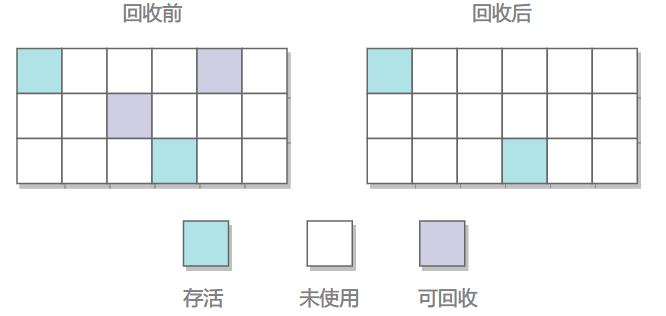

#  Java 程序

源代码编译成字节码，通过类加载器加载到内存中实例化，然后由 JVM 解释成特定操作系统指令集，由操作系统调用 CPU 执行指令

1. ClassLoader（类加载器）
2. Runtime Data Area（运行时数据区）
3. Execution Engine（执行引擎）—— JVM 
4. Native Interface（本地库接口）—— JVM 解释过程会涉及到其它编程语言提供的接口，由 Native Interface 提供


# 运行时数据区域


元空间（MetaSpace）是方法区的实现，也就是说方法区是一个规范。元空间存在于本地内存（Native Memory），即可以电脑内存足够便可以一直使用。

## 线程私有内存空间

1. ### 程序计数器

   存储执行线程的字节码指令位置，完成线程切换。如果执行的是本地方法（native）存储的是 undefine

   > 不会发生 OutOfMemoryError

   

2. ### 虚拟机栈

   线程执行方法时创建一个<span style='font-size: 20px'>栈帧</span>，执行完毕后将栈帧弹出。假设方法逻辑错误出现无限递归，递归深度超过了虚拟机栈内存容量会抛出<span style='font-size: 18px'>StackOverFlowError</span>；如果是虚拟机栈内存不足会抛出<span style='font-size: 18px'>OutOfMemoryError</span>，可调整虚拟机栈内存大小 `java -Xss2M HackTheJava`

   <span style='font-size: 20px'>栈帧结构</span>

   1. <span style='font-size: 18px'>局部变量表</span> —— 参数、局部变量
   2. <span style='font-size: 18px'>操作数栈</span> —— 根据指令读取变量的值并写入操作数栈中，完成指令运算再从操作数栈读取结果
   3. <span style='font-size: 18px'>动态链接</span> —— 栈帧拥有<span style='font-size: 20px'>引用</span>指向归属的方法，方法调用确定了方法的符号引用，类加载阶段的解析阶段转化为直接引用
   4. <span style='font-size: 18px'>方法出口</span> —— 存储程序计数器的值，方法结束后继续执行程序

   

3. ### 本地方法栈

   `JNI` (Java Native Interface) 调用本地方法，本地方法以库文件（DDL文件）的形式存放

## 堆

堆内存是 JVM 控制的系统内存分配。JVM 可用的堆内存大小主要由`-Xms<value>`和`-Xmx<value>`JVM 参数控制。`-Xms<value>`设置初始堆大小和最小堆大小，`-Xmx<value>`将设置最大堆大小。

如果堆内存已满，那么当 JVM 尝试为新对象分配空间时，将会导致 JVM 抛出`java.lang.OutOfMemoryError`异常。对于 Java 中垃圾收集器的大多数实现，堆内存根据对象的“年龄”分为多个区域。区域的数量和类型将根据垃圾收集器的具体实现而变化。


### 分代垃圾收集

Java 中的大多数垃圾收集器都是分代垃圾收集器。分代垃圾收集器旨在利用弱分代假设，该假设认为大多数对象都是短暂的。因此，分代垃圾收集器将堆分为年轻代和老一代。在分配时，对象从年轻代开始，经常检查年轻代中的对象是否不再可达。如果一个对象在足够多的垃圾收集周期中幸存下来，它将被复制到老一代，而老一代的检查频率较低。

分代垃圾收集器提供的优势是更有效地利用 CPU 时间。垃圾收集器将更有效地花费 CPU 时间扫描堆的子集，其中更有可能遇到要删除的候选对象。这种更高效的 CPU 时间使用可用于减少暂停时间、提高吞吐量或减少内存使用；这些方面的具体改进将取决于垃圾收集器的启发式方法及其配置方式。


### 分代

- **Young Space** - 年轻代，顾名思义，是包含新分配的对象的堆区域。年轻区本身又进一步划分为更多的区域。
  - **Eden 空间** - 分配时，对象存储在堆的 Eden 区域中，直到第一次垃圾回收。
  - **Survivor 空间** - 在 GC 周期中幸存下来的对象将被复制到幸存者区域。分代收集器通常有多个“幸存者”区域，目的是通过将幸存对象复制到新的幸存者区域，然后释放整个旧的幸存者区域来提高垃圾收集器效率。
- **Old Space** - 如果一个对象通过幸存的 GC 周期获得足够的“年龄”，它将被复制到旧区域。如前所述，垃圾收集器很少扫描旧区域以查找不再可达的对象。
- **永久/元空间区域**- 最后一个区域是永久或元空间区域。这里存储的对象通常是 JVM 元数据、核心系统类以及通常在 JVM 生命周期的整个持续时间内存在的其他数据。


## 元空间（方法区）

Java 类在 Java Hotspot VM 中具有内部表示，称为类元数据。在 Java Hotspot VM 的早期版本中，类元数据分配在所谓的永久代中。在 JDK 8 中，永久代被删除，类元数据分配在本机内存中。默认情况下，可用于类元数据的本机内存量是无限的。使用该选项`MaxMetaspaceSize`可以设置用于类元数据的本机内存量的上限。

当相应的 Java 类被卸载时，类元数据被释放。

# 直接内存

不属于 JVM 运行时数据区，也不是《Java虚拟机规范》中定义的内存区域，是直接向系统申请的内存区间，以往 Java 读取磁盘，通过堆内存

```
磁盘IO-->直接内存[系统内核态]--> 非直接(堆)内存[用户态] --> 直接内存[系统内核态]--> 磁盘IO
```


使用直接内存可以避免内核态和用户态之间反复切换，有利于文件读写

```
磁盘IO --> 系统直接内存 --> 磁盘IO
```


# 对象

类的实例称为对象，对象可以被引用，<span style='font-size: 20px'>引用</span>与对象是两个东西，对象可以拥有多个引用

1. <span style='font-size: 20px'>强引用</span> —— 不会被回收

   ```Java
   Object obj = new Object();
   ```

2. <span style='font-size: 20px'>软引用</span> —— 内存不足时被回收

   ```java
   String str = "str";
   SoftReference<String> stringSoftReference = new SoftReference<>(str);
   str = null;  //清除强引用
   ```

3. <span style='font-size: 20px'>弱引用</span> —— 总是被回收

   ```java
   WeakReference<Object> wf = new WeakReference<Object>(new Object());
   ```

4. <span style='font-size: 20px'>虚引用</span> —— 回收的时候，能够被感知到，以便进行一些重要的操作

   ```java
   PhantomReference<Object> pf = new PhantomReference<Object>(new Object(), null);
   ```


<span style='font-size: 24px'>引用队列</span>

搭配软、弱、虚引用使用，当回收对象发现它还有其它引用，会将引用加入到引用队列中。虚引用一定搭配引用队列

## 内存分配

1. <span style='font-size: 20px'>优先分配新生代</span> —— 对象在新生代 Eden 上分配，当 Eden 空间不够时，发起 Minor GC
2. <span style='font-size: 20px'>大对象直接去老年代</span> —— 对象内存大于 -XX:PretenureSizeThreshold 的对象直接在老年代分配，避免频繁的 Minor GC
3. <span style='font-size: 20px'>长期存活的对象进入老年代</span> —— 每经历 1 次 Minor GC 年龄增加 1 岁，年领到达 -XX:MaxTenuringThreshold 阈值进入老年代
4. <span style='font-size: 20px'>动态进入老年代</span> —— Survivor 中年龄相同的对象大小的总和大于 Survivor 空间的一半，则年龄大于或等于该年龄的对象可以直接进入老年代，无需达到年龄阈值


<span style='font-size: 24px'>空间分配担保</span>

在进行 Minor GC 时，如果 Survivor 区无法容纳存活的对象，或者无法将存活对象晋升到老年代，就会触发空间分配担保，以确保有足够的连续空间来进行对象分配

JVM 判断老年代的最大连续空间是否大于等于新生代所有对象的总和，或者历次晋升到老年代的平均大小。如果满足这个条件，就会进行 Minor GC，并将存活对象直接晋升到老年代。如果不满足条件，则会触发一次 Full GC

<span style='font-size: 24px'>⁉️</span> 为什么需要连续的空间呢？

- 新生代的复制算法机制决定

- JVM 中对象的分配和回收是高频操作，需要考虑性能，为每个新生代晋升对象在老年代零散的空间中寻找足够的空间是非常耗时且繁琐的操作。通过使用分配担保机制，可以使用经验值（历次晋升的平均大小）来降低系统的资源消耗，避免低效的 Full GC 操作


# 垃圾回收

垃圾回收器通常是作为一个单独的低级别的线程运行，在堆和方法区进行垃圾回收，线程私有区域不进行。当一个对象无法再从运行程序中的任何指针访问时，该对象被视为垃圾[^引用计数法]。垃圾回收算法常用的方式是迭代每个可达的对象[^可达性分析]，剩下的任何对象都视为垃圾，这种方式花费的时间与活动对象数量成正比，在维护大量活动对象的应用上应该禁止。

虚拟机采用了多种不同的垃圾收集算法，这些算法使用==分代收集==进行组合。虽然朴素垃圾收集会检查堆中的每个活动对象，但分代收集利用大多数应用程序的几个==凭经验观察到的属性==来最大限度地减少垃圾回收所需要工作。这些观察到的属性中最重要的是*弱世代假说*，该假说指出大多数物体仅存活很短的时间。

***图 — 分代收集***


依赖此假说，绝大多数对象都分配在专用于年轻对象（*年轻代*）的池中，并且大多数对象在那里消亡。当年轻代填满时，会引起==*小规模收集（Minor GC）*==其中仅收集年轻一代；其他世代的垃圾不被回收。假设弱代假设成立并且年轻代中的大多数对象都是垃圾并且可以回收，则可以优化次要集合。此类收集的成本首先与所收集的活体对象的数量成正比，充满死亡对象的年轻一代使用可达性分析很快就会被收集起来。


***图 — 分代收集的默认内存安排（并行收集器和 G1 除外）***


在初始化时，虚拟地保留最大地址空间，但除非需要，否则不会分配给物理内存。为对象内存保留的完整地址空间可以分为年轻代和终身代。

年轻代由伊甸园和两个幸存者空间组成。大多数对象最初是在 eden 中分配的。一个幸存者空间在任何时候都是空的，并且作为 Eden 和其中一个 Survivor 中任何存活对象的目的地；另一个 Survivor 空间将被清空然后当作下一次垃圾收集时的空的幸存者空间。对象以这种方式在幸存者空间之间复制，直到它们足够老而可以被保留（复制到终身代）。


***性能考虑***

垃圾收集性能有两个主要衡量标准：

- *吞吐量*是在很长一段时间内未花费在垃圾收集上的总时间的百分比。吞吐量包括分配所用的时间（但通常不需要调整分配速度）。
- *暂停*是指应用程序因垃圾收集而显得无响应的时间。

用户对垃圾收集有不同的要求。例如，有些人认为 Web 服务器的正确指标是吞吐量，因为垃圾收集期间的暂停可能是可以容忍的，或者只是被网络延迟所掩盖。然而，在交互式图形程序中，即使是短暂的暂停也可能会对用户体验产生负面影响。没有一种正确的方法来选择一代的规模，最佳选择取决于应用程序使用内存的方式以及用户需求。[因此，虚拟机对垃圾收集器的选择并不总是最佳的，并且可能会被调整代大小](https://docs.oracle.com/javase/8/docs/technotes/guides/vm/gctuning/sizing.html#sizing_generations)部分中描述的命令行选项覆盖。


[^引用计数法]: 缺陷在于两个对象互为引用，永不被回收
[^可达性分析]: 以 GC Root 根节点出发遍历，Root 对象有：局部变量、静态字段、活动线程的引用和 JNI 引用


## 垃圾收集器

目前为止的讨论都是关于串行收集器的。Java HotSpot VM 包括三种不同类型的收集器，每种收集器具有不同的性能特征。

- 串行收集器使用单个线程来执行所有垃圾收集工作，这使得它相对高效，因为线程之间没有通信开销。
- 并行收集器（也称为*吞吐量收集器*）并行执行次要收集，这可以显着减少垃圾收集开销。它适用于在多处理器或多线程硬件上运行的具有中型到大型数据集的应用程序。在某些硬件和操作系统配置上默认选择并行收集器，或者可以使用选项显式启用`-XX:+UseParallelGC`。
  - 并行压缩是一项使并行收集器能够并行执行主要收集的功能。如果没有并行压缩，主要收集将使用单个线程执行，这会严重限制可扩展性。`-XX:+UseParallelGC`如果指定了该选项，则默认启用并行压缩。关闭它的选项是`-XX:-UseParallelOldGC`。
- 大多数并发收集器同时执行其大部分工作（例如，当应用程序仍在运行时），以保持垃圾收集暂停时间较短。它专为具有中型到大型数据集的应用程序而设计，其中响应时间比总体吞吐量更重要，因为用于最小化暂停的技术会降低应用程序性能。Java HotSpot VM 提供了两个大多数并发收集器之间的选择；请参阅[大多数并发收集器](https://docs.oracle.com/javase/8/docs/technotes/guides/vm/gctuning/concurrent.html#mostly_concurrent)。使用该选项`-XX:+UseConcMarkSweepGC`启用 CMS 收集器或`-XX:+UseG1GC`启用 G1 收集器。


### 并行收集器

并行收集器（这里也称为*吞吐量收集器*）是类似于串行收集器的分代收集器；主要区别在于使用多个线程来加速垃圾收集。并行收集器通过命令行选项启用`-XX:+UseParallelGC`。默认情况下，使用此选项，次要收集和主要收集会并行执行，以进一步减少垃圾收集开销。

垃圾收集器线程的具体数量可以通过命令行选项进行调整（稍后介绍）。在具有一个处理器的主机上，由于并行执行（例如同步）所需的开销，并行收集器的性能可能不如串行收集器。但是，当运行具有中型到大型堆的应用程序时，在具有两个处理器的计算机上，它通常比串行收集器表现要好一些，并且当有两个以上处理器可用时，通常比串行收集器表现要好得多。

垃圾收集器线程的数量可以使用命令行选项进行控制`-XX:ParallelGCThreads=<N>`。如果使用命令行选项对堆进行显式调整，则并行收集器获得良好性能所需的堆大小与串行收集器所需的大小相同。但是，启用并行收集器应该会使收集暂停时间更短。由于多个垃圾收集器线程正在参与次要收集，因此由于收集期间从年轻代升级到终身代，可能会产生一些碎片。次要收集中涉及的每个垃圾收集线程都会保留一部分终身代用于升级，并将可用空间划分到这些“升级缓冲区”中可能会导致碎片效应。

***图 — 并行收集器内存安排***


### 大多数并发收集器

Java Hotspot VM 在 JDK 8 中有两个主要并发的收集器：

- [并发标记清除 (CMS) 收集器](https://docs.oracle.com/javase/8/docs/technotes/guides/vm/gctuning/cms.html#concurrent_mark_sweep_cms_collector)：此收集器适用于喜欢较短的垃圾收集暂停并且能够与垃圾收集共享处理器资源的应用程序。
- [Garbage-First 垃圾收集器](https://docs.oracle.com/javase/8/docs/technotes/guides/vm/gctuning/g1_gc.html#garbage_first_garbage_collection)：这种服务器式收集器适用于具有大内存的多处理器机器。它以高概率满足垃圾收集暂停时间目标，同时实现高吞吐量。

大多数并发收集器会牺牲处理器资源（否则这些资源将可供应用程序使用）以换取更短的主要收集暂停时间。

## 内存泄露

长生命周期的对象持有短生命周期对象的引用

## 垃圾收集算法

### 标记-清除



标记阶段为可存活对象添加标记，清除阶段清除对象并清除存活对象的标记

✅ 清除后若有空闲分块相邻则合并

❌ 标记、清除效率不高

❌ 产生不连续的内存碎片


### 标记-整理

在标记清除的基础上，将回收后存活的对象往一侧移动，减少内存碎片


### 复制


内存划分为大小相等的两块，只使用其中一块，当使用的一块内存满了之后将幸存对象复制到另一块内存，再对使用的内存块完全清理


### 分代收集

将内存分为新生代（一个 Eden 区和两个 Survivor 空间） 和老年代，新生代占 80%，老年代占 20%


新生代以<span style='font-size: 20px'>复制</span>算法回收垃圾，因为其中只有少量对象存活，少量复制即可

老年代以<span style='font-size: 20px'>标记—清除</span>算法回收，少量对象需要删除


# 垃圾收集过程

从高层面来看，垃圾收集器的过程分为三个阶段：标记、清除和压实（整理）。每个步骤都有不同的职责。但请注意，根据垃圾收集器的实现，每个阶段中可能还存在此处未涵盖的其他子阶段。


## 标记

在对象创建时，JVM 会给对象 1 位标记值，最初设置为 false（0）。垃圾收集器根据此值判断对象是否可达。在垃圾收集开始前，垃圾收集器遍历对象图并将其可以到达的任何对象标记为 true（1）。

垃圾收集器不会单独扫描每个对象，而是从`Root`对象开始。`Root`对象有：局部变量、静态字段、活动 Java 线程和 JNI 引用。


## 清除

在标记阶段任何不可达的对象都会被清除


## 压实

垃圾收集的最后阶段是压实阶段。Eden 空间和已被占用的 Survivor 空间中的活动对象将被移动到空的 Survivor 空间。如果 Survivor 空间中的对象获得了足够的所有权，则将其移动或复制到老年代。


## 垃圾收集暂停

在垃圾收集期间，JVM中的一些甚至全部处理可能会暂停，这些被称为Stop-the-World事件。正如在堆内存部分的介绍中提到的，存储在堆内存中的对象不是线程安全的。这反过来意味着，在垃圾收集期间，JVM的部分或全部必须暂停一段时间，而垃圾收集器将在检查对象的使用情况、删除、移动或复制时防止出现错误。

像JDK Flight Recorder (JFR)和Visual VM这样的工具可以用来监控垃圾收集中发生暂停的频率和持续时间。如何调优垃圾收集器超出了本教程的范围，但是监视垃圾收集器的行为，然后通过JVM参数对其进行调优，可能是提高应用程序性能的关键方法。


## 垃圾收集的类型

就像堆内存有不同的区域一样，垃圾收集也有不同的类型。

- Minor（次要）—— 次要垃圾收集只扫描堆内存的年轻区域。次要垃圾收集发生的频率非常高，并且与之相关的暂停时间通常非常短。
- Major（主要） - Major垃圾收集扫描堆内存的Young和Old区域。主要垃圾收集发生的频率远低于次要垃圾收集，通常由VM中的特定条件触发，例如，当使用堆内存的阈值百分比时。


# 类

类在运行期间第一次使用时动态加载的，而不是一次性加载所有类，节省内存。

## 生命周期


1. <span style='font-size: 24px'>加载</span>
   
   通过全限定名获取类文件转化为二进制字节流，生成<span style='font-size: 20px'>类对象</span>
   
   

2. <span style='font-size: 24px'>验证</span>

   确保类文件符合虚拟机规范

   1. 文件格式验证
   2. 元数据验证
   3. 字节码验证
   4. 符号引用验证

   

3. <span style='font-size: 24px'>准备</span>

   <span style='font-size: 20px'>类变量</span>分配内存并设置系统初始值，value 被初始化为 0

   ```java
   public static int value = 123;
   ```

   常量初始化为给定值

   ```java
   public static final int value = 123;
   ```

   

4. <span style='font-size: 24px'>解析</span>

   

   <span style='font-size: 20px'>符号引用</span> —— 一组符号描述所引用的目标

   1. 与虚拟机实现的内存布局无关

   2. 引用的目标并不一定是已经加载到虚拟机内存当中

      

   <span style='font-size: 20px'>直接引用</span> —— 指向目标的指针，或者是一个能间接定位到目标的句柄。

   1. 与虚拟机实现的内存布局相关
   2. 有了直接引用，说明目标已存在于虚拟机


5. <span style='font-size: 24px'>初始化</span>

   <span style='font-size: 20px'>类变量</span>完成指定赋值

   静态变量（类变量）和静态代码块的执行顺序取决于代码顺序 > 普通变量、代码块 > 构造器


## 初始化时机

除了 JVM 启动时包含 main() 方法的类初始化，其它类初始化需要触发点，称之为主动引用

- new、静态调用指令
- 反射
- 子类初始化牵动父类初始化


存在被动引用，不会触发初始化

- 通过子类引用父类的静态字段，不会导致子类初始化。

- 类数组

- 常量

## 类加载器

1. #### Bootstrap ClassLoader

   加载 java 核心库，只加载包名为java、javax、sun等开头的类

   

2. #### Extensions ClassLoader

   加载 java 扩展库

   

3. #### App ClassLoader

   通过 Classpath 加载 Java 类，默认的类加载器，可重写

   

4. #### 自定义类加载器

   继承 ClassLoader 重写 findClass()
   
   ```java
   public class FileSystemClassLoader extends ClassLoader {
   
       private String rootDir;
   
       public FileSystemClassLoader(String rootDir) {
           this.rootDir = rootDir;
       }
   
       @Override
       protected Class<?> findClass(String name) throws ClassNotFoundException {
           byte[] classData = getClassData(name);
           if (classData == null) {
               throw new ClassNotFoundException();
           } else {
               return defineClass(name, classData, 0, classData.length);
           }
       }
   
       private byte[] getClassData(String className) {
           String path = classNameToPath(className);
           try {
               InputStream ins = new FileInputStream(path);
               ByteArrayOutputStream baos = new ByteArrayOutputStream();
               int bufferSize = 4096;
               byte[] buffer = new byte[bufferSize];
               int bytesNumRead;
               while ((bytesNumRead = ins.read(buffer)) != -1) {
                   baos.write(buffer, 0, bytesNumRead);
               }
               return baos.toByteArray();
           } catch (IOException e) {
               e.printStackTrace();
           }
           return null;
       }
   
       private String classNameToPath(String className) {
           return rootDir + File.separatorChar
                   + className.replace('.', File.separatorChar) + ".class";
       }
   }
   ```
   


## 双亲委派模型

一个类加载器首先将类加载请求转发到父类加载器，只有当父类加载器无法完成时才尝试自己加载

✅ 避免类重复加载

✅ 保证 java 核心库安全

> 假设存在与核心库同名的类，篡改它的实现，容易造成危险。双亲委派机制下，核心库皆由 BootstraClassLoader 加载保证其安全。


图中的父子关系通过组合（Composition）来实现，而不是继承


# 排查问题

## JPS

查看JVM进程

```shell
jps [option]

option：
-l:显示运行类的完整包
-q:只显示进程号
-m:显示给main方法的参数
-v:显示给jvm的完整参数
```


## Jinfo

查看Java System属性和JVM命令行参数；也可以动态的修改正在运行的 JVM 一些参数。当系统崩溃时，jinfo可以从core文件里面知道崩溃的Java应用程序的配置信息。

```shell
jinfo [option] <pid>

where <option> is one of:
    -flag <name>         JVM参数的值
    -flag [+|-]<name>    布尔类型的值
    -flag <name>=<value> 修改指定参数，不是所有参数都可以修改。
    -flags               所有VM参数值
    -sysprops            Java系统参数
    <no option>          打印上面两个
    -h | -help           to print this help message
```


#### 查看可修改参数

官方文档

> Flags marked as manageable are dynamically writeable through the JDK management interface (com.sun.management.HotSpotDiagnosticMXBean API) and also through JConsole.
>
> 标记为可管理的标志可通过 JDK 管理接口 (com.sun.management.HotSpotDiagnosticMXBean API) 以及 JConsole 动态写入。


#### 查看标记为 manageable 的标志

- Linux环境：java -XX:+PrintFlagsInitial | grep manageable
- Window环境：java -XX:+PrintFlagsInitial | findstr manageable


#### 通过HotSpotDiagnosticMXBean API

查看该类的 [Java Doc](https://link.jianshu.com?t=http://docs.oracle.com/javase/8/docs/jre/api/management/extension/com/sun/management/HotSpotDiagnosticMXBean.html)，有一个==getDiagnosticOptions()==这样的方法，该方法的详细描述如下：

> Returns a list of VMOption objects for all diagnostic options. A diagnostic option is a writeable VM option that can be set dynamically mainly for troubleshooting and diagnosis.
>
> 返回所有诊断选项的 VMOption 对象列表。 诊断选项是一个可写的 VM 选项，可以动态设置，主要用于故障排除和诊断。

```java
public class DiagnosticOptionsTest {

    public static void main(String[] args) {
        HotSpotDiagnostic mxBean = new HotSpotDiagnostic();
        List<VMOption> diagnosticVMOptions = mxBean.getDiagnosticOptions();
        for (VMOption vmOption:diagnosticVMOptions){
            System.out.println(vmOption.getName() + " = " + vmOption.getValue());
        }
    }
}
```

说明：
 由于HotSpotDiagnosticMXBean 是接口（public class HotSpotDiagnostic implements HotSpotDiagnosticMXBean ），所以需要通过它唯一的实现类HotSpotDiagnostic 来调用这个方法；


运行结果如下：

```
HeapDumpBeforeFullGC = false
HeapDumpAfterFullGC = false
HeapDumpOnOutOfMemoryError = false
HeapDumpPath =
CMSAbortablePrecleanWaitMillis = 100
CMSWaitDuration = 2000
CMSTriggerInterval = -1
PrintGC = false
PrintGCDetails = false
PrintGCDateStamps = false
PrintGCTimeStamps = false
PrintGCID = false
PrintClassHistogramBeforeFullGC = false
PrintClassHistogramAfterFullGC = false
PrintClassHistogram = false
MinHeapFreeRatio = 0
MaxHeapFreeRatio = 100
PrintConcurrentLocks = false
UnlockCommercialFeatures = false
```


## Jstat

```
jstat -<option> [-t] [-h<lines>] <vmid> [<interval> [<count>]]

定义：
  <option> 选项
        -options:查看可用参数
        -class:类加载统计
        -compiler
        -gc:查看堆内存各区域使用情况
        -gccapacity
        -gccause:堆内存各区域使用占比,以及最后一次和当前(当前可能没有)引发垃圾回收的诱因
        -gcmetacapacity
        -gcnew
        -gcnewcapacity
        -gcold
        -gcoldcapacity
        -gcutil:查看堆内存各区域使用占比
        -printcompilation:编译情况

  <vmid> 虚拟机标识符。 vmid 采用以下形式：
                     <lvmid>[@<主机名>[:<端口>]]
                其中 <lvmid> 是目标的本地虚拟机标识符
                Java虚拟机，通常是一个进程id； <主机名> 是
                运行目标 Java 虚拟机的主机名；
                <port> 是 rmiregistry 上的端口号目标主机。
                
  <lines> 标题行之间的样本数。
  
  <interval> 采样间隔。允许使用以下形式：
                    <n>[“毫秒”|“秒”]
                其中 <n> 是一个整数，后缀指定单位为
                毫秒（“ms”）或秒（“s”）。默认单位是“毫秒”。
                
  <count> 终止前要采集的样本数。
  
  -J<flag> 将 <flag> 直接传递给运行时系统。
```


#### 查看堆内存各区域使用情况


#### 查看堆内存各区域使用占比


#### 类加载统计

```
jstat -class vmid
```


#### 堆内存各区域使用占比,以及最后一次和当前(当前可能没有)引发垃圾回收的诱因

```
jstat -gccause vmid
```


## Jmap

生成堆转储快照，查看堆详细信息等

```
jmap [选项] <pid>
（连接到正在运行的进程）
jmap [选项] <executable <core>
（连接到核心文件）
jmap [option] [server_id@]<远程服务器 IP 或主机名>
（连接到远程调试服务器）

其中 <option> 是以下之一：
    <none> 打印与 Solaris pmap 相同的信息
    -heap 打印java堆摘要
    -histo[:live] 打印java对象堆的直方图；如果“活”
                         指定子选项，只计算活动对象
    -clstats 打印类加载器统计信息
    -finalizerinfo 打印关于等待完成的对象的信息
    -dump:<dump-options> 以 hprof 二进制格式转储 java 堆
                         转储选项：
                           活转储仅活对象；如果没有指定，
                                        堆中的所有对象都被转储。
                           format=b 二进制格式
                           file=<file> 将堆转储到 <file>
                         示例：jmap -dump:live,format=b,file=heap.bin <pid>
    -F 力。与 -dump:<dump-options> <pid> 或 -histo 一起使用
                         当 <pid> 没有时强制堆转储或直方图
                         回应。不支持“live”子选项
                         在这种模式下。
    -h | -help 打印此帮助信息
    -J<flag> 将 <flag> 直接传递给运行时系统
```


#### 生成堆转储快照

```shell
PS C:\Users\yls91> jmap -dump:format=b,file=9520.txt 9520
Dumping heap to C:\Users\yls91\9520.txt ...
Heap dump file created
```


## Jhat

转储快照分析工具

```shell
用法：jhat [-stack <bool>] [-refs <bool>] [-port <port>] [-baseline <file>] [-debug <int>] [-version] [-h|-help] <文件>

        -J<flag> 将 <flag> 直接传递给运行时系统。为了
                          例如，-J-mx512m 使用 512MB 的最大堆大小
        -stack false：关闭跟踪对象分配调用堆栈。
        -refs false：关闭对对象引用的跟踪
        -port <port>：设置 HTTP 服务器的端口。默认为 7000
        -exclude <file>：指定一个文件，其中列出了应包含的数据成员
                          从reachableFrom 查询中排除。
        -baseline <file>：指定基线对象转储。中的对象
                          具有相同 ID 和相同类的两个堆转储将
                          被标记为不是“新的”。
        -debug <int>：设置调试级别。
                            0：无调试输出
                            1：调试hprof文件解析
                            2：调试hprof文件解析，无服务器
        -version 报告版本号
        -h|-help 打印此帮助并退出
        <file> 要读取的文件

对于包含多个堆转储的转储文件，
您可以指定文件中的哪个转储
通过将“#<number>”附加到文件名，即“foo.hprof#3”。

所有布尔选项默认为“true”
```


#### 分析转储文件

使用前面生成的dump文件9520.txt

```shell
PS C:\Users\yls91> jhat 9520.txt
Reading from 9520.txt...
Dump file created Fri Aug 26 13:08:40 CST 2022
Snapshot read, resolving...
Resolving 1485605 objects...
Chasing references, expect 297 dots.........................................................................................................................................................................................................................................................................................................
Eliminating duplicate references.........................................................................................................................................................................................................................................................................................................
Snapshot resolved.
Started HTTP server on port 7000
Server is ready.
```


## Jstack

堆栈跟踪工具，生成虚拟机当前时刻的线程快照。

线程快照是当前虚拟机内每一条线程正在执行的方法堆栈的集合，生成线程快照的主要目的是定位线程出现长时间停顿的原因， 如线程间死锁、死循环、请求外部资源导致的长时间等待等问题。

```shell
jstack [-l] <pid>
（连接到正在运行的进程）
jstack -F [-m] [-l] <pid>
（连接到挂起的进程）
jstack [-m] [-l] <可执行文件> <核心>
（连接到核心文件）
jstack [-m] [-l] [server_id@]<远程服务器 IP 或主机名>
（连接到远程调试服务器）

选项：
     -F 强制线程转储。 当 jstack <pid> 没有响应（进程挂起）时使用
     -m 打印 java 和 native 帧（混合模式）
     -l 长列表。 打印关于锁的附加信息
     -h 或 -help 打印此帮助信息
```


## Linux示例

这里以排查应用程序cpu使用率过高为例，排查步骤如下：

#### 获取占cpu过高的应用程序pid

```
输入： top
输出：
PID USER      PR  NI    VIRT    RES    SHR S  %CPU %MEM     TIME+ COMMAND       20959 china     20   0 8345840 635048  25048 S   4.6  6.3   0:24.87 java 
```


由上输出确定，占cpu过高pid为20959


#### 查询应用程序内部占cpu过高的线程id

```
输入： top -Hp 20959
部分输出：
 PID USER      PR  NI    VIRT    RES    SHR S %CPU %MEM     TIME+ COMMAND
 20960 china     20   0 8345840 636332  25048 S  0.7  6.3   0:17.92 java
 21060 china     20   0 8345840 636332  25048 S  0.3  6.3   0:01.55 java  

```


由上输出确定，占cpu过高线程id为20960


#### 将占cpu过高的线程id转为16进制

```
输入：printf '%x\n' 20960
输出：51e0
```

20960的16进制为51e0


#### 在jvm中查看占cpu过高的堆栈信息

```
输入： jstack 20959 | grep -i -A10 51e0
输出：
"main" #1 prio=5 os_prio=0 tid=0x00007f7040018800 nid=0x51e0 waiting on condition [0x00007f7049190000]
   java.lang.Thread.State: TIMED_WAITING (sleeping)
        at java.lang.Thread.sleep(Native Method)
        at java.lang.Thread.sleep(Thread.java:340)
        at java.util.concurrent.TimeUnit.sleep(TimeUnit.java:386)
        at com.dragon.study.msa_client.MsaClientApplication.main(MsaClientApplication.java:26)
```


由此可发现MsaClientApplication类的26行可能有问题。


# 调优

- Jmeter 性能测试工具-下载

- JVisualVM 监控-cmd输入 jvisualvm启动


IDEA调整VM参数：

1. RUN-Edit configrations 调整具体某一个的vm参数
2. HELP-Edit Custom VM options 所有java程序默认的vm参数

## 面试回答

JVM调优之前做过，但是 JVM 参数那么多也不可能完全记得住，通常是需要的时候再去查文档，一般都是使用默认值，

在真正调优的时候去重新设置覆盖默认值。按照目前回忆，JVM 参数一般分为三种，一种是标准参数，一种是 X 参数，还有一种是 XX 参数。

标准参数主要是来查看一些信息，比如JVM的版本号啊，等等..

另外就是X 和 XX参数，主要用来设置 JVM 内存的一些参数，当然XX 比 X的稳定性差点一点。

另外举例几个常用的吧，比如 -Xms 分配初始内存大小，默认值是 s，表示默认初始值的意思，然后是兆为单位，它默认的话是物理内存的 1/64，等价于是 XX 的initHeapSize 这么一个设置；第二个就是 -Xmx 它是用来设置最大的堆内存，同样以兆为单位，那么它的默认值是 x，表示最大max的意思。一般来说的 -Xms 和 -Xmx 它的设置值设为相同大小，这样可以避免 JVM 内存的一个自动扩展，当堆内存自动扩展时会发生内存抖动，会影响到程序的稳定性。

另外一个就是 -Xmn 的参数设置，用来设置新生代的大小，默认值时n，表示new新生的意思，一般设置为堆空间的 1/3 或者是 1/4，因为新生代大了，老年代就会小。

然后就是 -Xss，它可以设置每个线程虚拟机栈的大小。

还有 -XX：PretenureSizeThreshold 参数，它是任期大小阈值的意思，当创建对象分配内存时，对象所需内存空间大于这个参数，那么对象将直接进入老年代，默认是分配在新生代。

以及，-XX：MaxTenuringThreshold 设置对象存活的年龄，当对象初始分配在新生代时，每经历一次 Minor GC 年龄就会增加一岁，当年零大于此参数，将会进入老年代。

另外话有一个经常用到的日志开关，就是可以设置GC的日志，设置为 + 表示打开，- 表示关闭。

当然还有很多参数，可以照着文档进行设置，具体可能就记不住那么多了。


# JDK 

## javac 编译器

读取 Java 类和接口定义，并将它们编译成字节码和类文件

```shell
javac [options] [sourcefiles]
```


## javap 反汇编

反汇编一个或多个类文件

```shell
javap [options] classes...
```

选项：

`help, --help, or -?`打印 javap 命令的帮助消息。

`-version`打印版本信息。

`-verbose or -v`打印有关选定类的其他信息。

`-l`打印线条表和局部变量表。

`-public`仅显示公共类和成员。

`-protected`仅显示受保护类和公共类和成员。

`-package`显示包/受保护/公共类和成员（默认）。

`-private`或“显示所有类和成员”。

`-c`为类中的每个方法打印反汇编的代码，例如，包含 Java 字节码的指令。

`-s`打印内部类型签名。

`-sysinfo`显示正在处理的类的系统信息（路径、大小、日期、MD5 哈希）。

`-constants`显示静态最终常量。

`--module module`或指定包含要反汇编的类的模块。

`--module-path path`指定在何处查找应用程序模块。

`--system jdk`指定在何处查找系统模块。

--class-path path`、路径或指定 javap 命令用于查找用户类文件的路径。它在设置时会覆盖默认变量或类路径环境变量。

`-bootclasspath path`覆盖引导类文件的位置。

`-Joption`将指定的选项传递给 JVM。例如：

```shell
javap -J-version
javap -J-Djava.security.manager -J-Djava.security.policy=MyPolicy MyClassName
```

 


## javadoc 文档生成器

从 Java 源文件生成 API 文档的 HTML 页面


## java 启动

启动一个爪哇应用程序


### JVM 参数

#### 普通热点参数

`-Xmn` 新生代大小，默认单位 byte。新生代过小，Minor GC频繁，过大，只执行 Full GC。

> Oracle 建议您将年轻一代的大小保持在大于或小于总体堆大小的大小。

`-Xms` 堆初始大小

`-Xmx` 堆最大内存


#### 高级参数 `-XX`


### 堆性能分析

分析过程分为两部分。

第一部分检查整个代码堆，并聚合所有被认为有用或重要的信息。

第二部分由几个独立的步骤组成，这些步骤打印收集的信息，重点是数据的不同方面。数据收集和打印是在“应要求”的基础上进行的。


以下命令发出实时动态分析请求：

```shell
jcmd pid Compiler.CodeHeap_Analytics [function] [granularity]
```

`-Xlog:codecache=Trace`如果只对运行示例工作负荷后代码堆的外观感兴趣，则可以使用命令行选项。

`-Xlog:codecache=Debug`若要在存在“编解码器已满”情况时查看代码堆状态，请使用命令行选项启动 VM。


### -Xlog 统一日志记录框架

级别

- off
- trace
- debug
- info
- warning
- error


### java 推荐调优案例

更高的吞吐量性能

```shell
java -server -XX:+UseParallelGC -XX:+UseLargePages -Xmn10g  -Xms26g -Xmx26g
```

缩短响应时间

```shell
java -XX:+UseG1GC -XX:MaxGCPauseMillis=100
```

保持 Java 堆较小，并减少嵌入式应用程序的动态占用空间

```shell
-XX:MaxHeapFreeRatio=10 -XX:MinHeapFreeRatio=5
```

**注意：**这两个选项的默认值分别为 70% 和 40%。由于使用这些小设置时可能会发生性能牺牲，因此应通过尽可能减少这些设置来优化较小的占用空间，而不会引入不可接受的性能降级。

  
