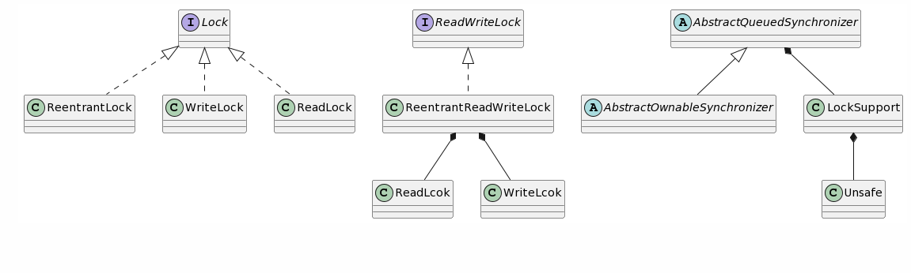
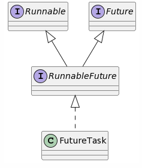
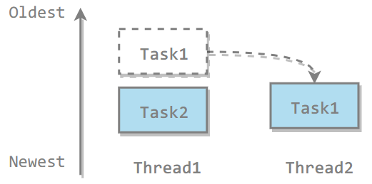
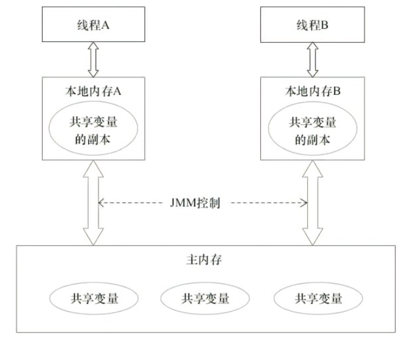

当多个用户调用同一个接口时，每个请求都会在服务器端创建一个新的线程来处理，这些线程会**并发执行**，以提高服务器的吞吐量和性能。

***并发问题***指的是，多个线程同一时间需要执行同一段代码，并且代码中存在***共享资源***，线程需要修改共享资源时，不加锁则会造成数据的不一致。


## 状态

JVM 里线程的状态，不代表操纵系统线程的状态

- <span style='font-size: 20px'>new 新建</span>

- <span style='font-size: 20px'>Runable 可运行</span> —— JVM 中正在运行，但在操作系统中可能因为资源问题处于就绪状态

- <span style='font-size: 20px'>Blocked 阻塞</span> —— 未获取得锁

- <span style='font-size: 20px'>Waiting 等待</span>

- <span style='font-size: 20px'>Time Waiting 限时等待</span>

- <span style='font-size: 20px'>Terminated 结束</span>

线程调用 start() 方法进入可运行状态，系统调度将就绪线程进入运行状态，运行状态遇到 Synchronized 转为阻塞状态，获取到 Synchronized 锁再次进入运行状态，运行状态调用 Object.wait() 方法将当前线程挂起（等待状态）。当线程关联的代码执行完后，线程变为结束状态。


## 子线程

<span style='font-size: 22px'>启动线程</span>

三种方式创建新的线程，并调用 start() 方法启动

1. 实现 Runable
2. 实现 Callable
3. 继承 Thread

> Runnable 和 Callable 最终通过 Thread 类来调用并且启动线程


<span style='font-size: 22px'>停止线程</span>

在未执行完任务就将其停止

<span style='font-size: 20px'>❌</span> stop()、suspend()、remuse()

<span style='font-size: 20px'>✅</span> 线程调用 interrupt() 方法将线程的中断标志位设为 true，在线程任务中使用 Thread.currentThread().isInterrupted() 不断检测当前线程的中断标志位，如果为 true 执行相应的中断操作

<span style='font-size: 20px'>✅</span> 线程抛出 <span style='font-size: 20px'>InterruptedExpection</span> 时调用 interrupt() 方法中断线程


# 线程池

线程池管理多个异步任务的执行

1. *线程复用*- 避免了线程重复创建与销毁带来的资源损耗
2. 提高响应速度（闲置线程立马执行任务）
3. 提高线程的可管理性（不需要管理线程的生命周期）


**创建**

1. **Executors**

   1. *FixedThreadPool()* ：固定数量的线程池

   2. *SingleThreadExecutor()*：一个线程的线程池

   3. *CachedThreadPool()*：一个任务一个线程

      

2. **线程数量**

   假设电脑的 CPU 核心数是 ***N***

   - IO 密集型，CPU 大部分时间空闲，可以交出给其它线程使用，线程数量可设置为 ***2N***
   - CPU 密集型，线程数量设置为 ***N + 1*** ，多出来一个是因为偶尔会发生***缺页中断***，可由下一个线程先执行

   

***线程池构造函数***

```java
public ThreadPoolExecutor(int corePoolSize, //核心线程数
                          
                      int maximumPoolSize,  //最大线程数
                          
                      long keepAliveTime,   //存活时间
                          
                      TimeUnit unit,		//时间单位
                          
                      BlockingQueue<Runnable> workQueue, //任务队列
                          
                      ThreadFactory threadFactory, //线程工厂
                          
                      RejectedExecutionHandler handler) { //饱和策略
}
```


## 饱和策略

任务队列已经存满了，并且线程数量已经是最大，再有新任务到来该如何？

- *AbortPolicy*：抛出 *RejectedExecutionException* 异常，表示无法处理。**默认**

  

- *DiscardPolicy*： 无视，丢掉

  

- *DiscardOldestPolicy*：丢弃最老的任务，也就是队列头部的任务。

  

- *CallerRunsPolicy*： 由提交该任务的线程来执行该任务，也就是让主线程来处理任务。
  
  - 降低对新任务提交速度，影响程序的整体性能
  - 如果您的应用程序可以承受此延迟并且你要求任何一个任务请求都要被执行的话，你可以选择这个策略
  


**自定义饱和策略**

实现 RejectedExecutionHandler

~~~java
void rejectedExecution(Runnable r, ThreadPoolExecutor executor);
~~~

r是被拒绝执行的任务，executor是当前线程池对象


**中断**

- Executor.shutdown() ：线程执行完关闭

- shutdownNow() ：相当于调用每个线程的 interrupt() 

- 中断某一个线程

  ~~~java
  ExecutorService executor = Executors.newFixedThreadPool(10);  // 线程池
  Future<?> future = executor.submit(new MyTask());     // 执行任务
  future.cancel(true);  // 取消 MyTask 任务的执行，并中断其所在线程
  ~~~

  myTask 中需要关注是否停止

  ~~~java
  // 判断当前线程是否被中断，如果被中断则直接返回，以退出线程执行。
  if (Thread.currentThread().isInterrupted()) {
      return;
  }
  ~~~

  


# synchronized

对象锁，在对象头的 Mark Word 记录锁信息

Java 有类对象和实例对象，对这两种对象加入 synchronized 具有不同的效果

- <span style='font-size: 20px'>实例对象锁</span> —— 同一时间里，同一个对象被多个线程调用进入临界区，只有一个线程能进入
- <span style='font-size: 20px'>类对象锁</span> —— 同一时间里，同一个类的多个对象被多个线程调用进入临界区，只有一个线程能进入


<span style='font-size: 24px'>临界区</span>

1. 实例对象临界区

   ~~~java
   public void func() {
       synchronized (this) {
           // ...
       }
   }
   ~~~

2. 类对象临界区

   ~~~java
   public void func() {
       synchronized (SynchronizedExample.class) {
           // ...
       }
   }
   ~~~

   

<span style='font-size: 24px'>临界方法</span>

1. 实例对象临界方法

   ~~~java
   public synchronized void func () {
       // ...
   }
   ~~~

2. 类对象临界方法

   ~~~java
   public synchronized static void fun() {
       // ...
   }
   ~~~


## 线程同步

<span style='font-size: 22px'>wait()</span> —— 挂起等待并释放锁

1. 在同步方法或者同步代码块中使用，否则会在运行时抛出 **IllegalMonitorStateException**

2. 可抛出 **InterrupredException**，使用 interrupt() 中断线程

<span style='font-size: 22px'>notify()</span> —— 由 JVM 随机唤醒一个线程获得锁

<span style='font-size: 22px'>notifyAll()</span> —— 唤醒所有等待状态的线程，让它们竞争

## 优化

Synchronized 早期不具有超时、非阻塞等待和多个条件变量等机制

1. #### 偏向锁

   第一个访问同步块的线程获得偏向锁，以后此线程再访问这个同步块不需要再进行加锁操作，优化了无竞争环境下线程进入同步块的速度

   当第二个线程访问此同步块时，偏向锁失效

   

2. #### 轻量级锁

   尝试使用 **CAS** 修改对象头中 Mark Word 的锁信息，修改成功则获取锁，修改失败则通过自旋等待锁释放

   

3. #### 自旋锁

   自旋减少了线程切换，但会占用 CPU

   将对象的 mark word 复制到它自己的线程栈中，使用 CAS 尝试将对象的 mark word 指向线程栈中的锁记录，失败则继续自旋；超过一定次数或者时间，线程放弃自旋转而转为阻塞状态，轻量级锁也升级为重量级锁


# Lock

~~~mermaid
classDiagram
	
	class ReadWriteLock
	<<interface>> ReadWriteLock
	ReadWriteLock<|..ReentrantReadWriteLock
	ReentrantReadWriteLock*--ReadLock
	ReentrantReadWriteLock*--WriteLock
	class Lock
	<<interface>> Lock
	Lock <|..ReentrantLock
	Lock <|..ReadLock
	Lock <|..WriteLock
~~~




Lock 接口提供的 synchronized 不具备的主要特性

1. 中断
2. 非阻塞等待
3. 超时

## 抽象排队同步器 AQS

Lock 实现类有 volatile 修饰的变量 state，获取锁要使用 CAS 修改 state，成功则获取锁成功，失败则进入等待队列 CLH

Lock 的实现类都组合了内部类 Sync 的实例，Sync 继承了 AbstractQueuedSynchronizer， AQS 有 CLH 队列将请求锁的线程存入，等待通知

## Condition

ReentrantLock 可以创建多个 Condition ，线程对象可以注册在指定的 Condition 中，从而可以有选择性的进行线程通知


# Thread

### sleep()

```java
try {
    Thread.sleep(3000);          //休眠指定时间当前正在执行的线程，不释放对象锁。
} catch (InterruptedException e) {  // 抛出此异常，可中断
    e.printStackTrace();
}
```


### yield()

表明当前线程已经完成了生命周期中最重要的部分，可以切换给其它线程来执行。

对线程调度器的一个建议，建议具有相同优先级的其它线程可以运行。

```java
public void run() {
    Thread.yield();
}
```


### join()

在线程中调用另一个线程的 join() 方法，会将当前线程挂起，转头执行调用 join() 的线程，直到线程结束。

```java
public class JoinExample {

    private class A extends Thread {
        @Override
        public void run() {
            System.out.println("A");
        }
    }

    private class B extends Thread {
        private A a;

        B(A a) { this.a = a;}

        @Override
        public void run() {
            try {
                a.join();
            } catch (InterruptedException e) {
                e.printStackTrace();
            }
            System.out.println("B");
        }
    }

    public void test() {
        A a = new A();
        B b = new B(a);
        b.start();
        a.start();
    }
}
```

~~~java
public static void main(String[] args) {
    JoinExample example = new JoinExample();
    example.test();
}
~~~

```
A
B
```


# 守护线程

程序运行时在后台提供服务的线程

- 并非不可或缺
- 当所有非守护线程结束时，程序也就终止，同时会杀死所有守护线程。


**设置守护线程**：线程启动之前使用 setDaemon() 

```java
public static void main(String[] args) {
    Thread thread = new Thread(new MyRunnable());
    thread.setDaemon(true);
}
```


# JUC

## CountDownLatch

计数门栓，给定一个值，使用 await() 方法让当前线程进入等待，并使用 countDown() 方法让值每次减 1，当值为 0 时让陷入等待的线程开始执行

```java
public static void main(String[] args) throws InterruptedException {
    ExecutorService service = Executors.newCachedThreadPool();
    final CountDownLatch cdOrder = new CountDownLatch(1);
    final CountDownLatch cdAnswer = new CountDownLatch(4);

    for (int i = 0; i < 4; i++) {
        Runnable runnable = new Runnable() {
            @Override
            public void run() {
                try {
                    System.out.println("选手" + Thread.currentThread().getName() + "正在等待裁判发布口令");
                    cdOrder.await();
                    System.out.println("选手" + Thread.currentThread().getName() + "已接受裁判口令");
                    Thread.sleep((long) (Math.random() * 10000));
                    System.out.println("选手" + Thread.currentThread().getName() + "到达终点");
                    cdAnswer.countDown();
                } catch (InterruptedException e) {
                    e.printStackTrace();
                }
            }
        };
        service.execute(runnable);
    }
    try {
        Thread.sleep((long) (Math.random() * 10000));
        System.out.println("裁判"+Thread.currentThread().getName()+"即将发布口令");
        cdOrder.countDown();
        System.out.println("裁判"+Thread.currentThread().getName()+"已发送口令，正在等待所有选手到达终点");
        cdAnswer.await();
        System.out.println("所有选手都到达终点");
        System.out.println("裁判"+Thread.currentThread().getName()+"汇总成绩排名");
    } catch (InterruptedException e) {
        e.printStackTrace();
    }
    service.shutdown();
}
```

## CyclicBarrier

控制多个线程互相等待，只有当多个线程都到达时，这些线程才会继续执行。

通过维护计数器来实现的。线程执行 await() 计数器会减 1，并进行等待，直到计数器为 0，所有调用 await() 方法而在等待的线程才能继续执行。

CyclicBarrier 和 CountdownLatch 的一个区别是，CyclicBarrier 的计数器通过调用 reset() 方法可以循环使用，所以它才叫做循环屏障。

CyclicBarrier 有两个构造函数，其中 parties 指示计数器的初始值，barrierAction 在所有线程都到达屏障的时候会执行一次。

~~~java
public CyclicBarrier(int parties, Runnable barrierAction) {
    if (parties <= 0) throw new IllegalArgumentException();
    this.parties = parties;
    this.count = parties;
    this.barrierCommand = barrierAction;
}

public CyclicBarrier(int parties) {
    this(parties, null);
}
~~~

~~~java
public class CyclicBarrierExample {

    public static void main(String[] args) {
        final int totalThread = 10;
        CyclicBarrier cyclicBarrier = new CyclicBarrier(totalThread);
        ExecutorService executorService = Executors.newCachedThreadPool();
        for (int i = 0; i < totalThread; i++) {
            executorService.execute(() -> {
                System.out.print("before..");
                try {
                    cyclicBarrier.await();
                } catch (InterruptedException | BrokenBarrierException e) {
                    e.printStackTrace();
                }
                System.out.print("after..");
            });
        }
        executorService.shutdown();
    }
}
~~~

```
before..before..before..before..before..before..before..before..before..before..
after..after..after..after..after..after..after..after..after..after..
```


## Semaphore

Semaphore 类似于操作系统中的信号量，可以控制对互斥资源的访问线程数。

以下代码模拟了对某个服务的并发请求，每次只能有 3 个客户端同时访问，请求总数为 10。

~~~java
public class SemaphoreExample {

    public static void main(String[] args) {
        final int clientCount = 3;
        final int totalRequestCount = 10;
        Semaphore semaphore = new Semaphore(clientCount);
        ExecutorService executorService = Executors.newCachedThreadPool();
        for (int i = 0; i < totalRequestCount; i++) {
            executorService.execute(()->{
                try {
                    semaphore.acquire();
                    System.out.print(semaphore.availablePermits() + " ");
                } catch (InterruptedException e) {
                    e.printStackTrace();
                } finally {
                    semaphore.release();
                }
            });
        }
        executorService.shutdown();
    }
}
~~~

```
2 1 2 2 2 2 2 1 2 2
```


## FutureTask

Callable 可以有返回值，返回值通过 FutureTask<V> 进行封装。



它继承了Runable以及Future接口，所以它可以灵活的作为Runnable给thread执行，也可作为Future得到callable的计算结果。


### get()

阻塞的


### cancel()

中断线程

~~~java
ExecutorService executor = Executors.newFixedThreadPool(10);  // 线程池
Future<?> future = executor.submit(new MyTask());     // 执行任务
future.cancel(true);  // 取消 MyTask 任务的执行，并中断其所在线程
~~~

myTask 中需要关注是否停止

~~~java
// 判断当前线程是否被中断，如果被中断则直接返回，以退出线程执行。
if (Thread.currentThread().isInterrupted()) {
    return;
}
~~~


## BlockingQueue

- **FIFO 队列** ：LinkedBlockingQueue、ArrayBlockingQueue（固定长度）
- **优先级队列** ：PriorityBlockingQueue

提供了阻塞的 take() 和 put() 方法：如果队列为空 take() 将阻塞，直到队列中有内容；如果队列为满 put() 将阻塞，直到队列有空闲位置。

**使用 BlockingQueue 实现生产者消费者问题**

```java
public class ProducerConsumer {

    private static BlockingQueue<String> queue = new ArrayBlockingQueue<>(5);

    private static class Producer extends Thread {
        @Override
        public void run() {
            try {
                queue.put("product");
            } catch (InterruptedException e) {
                e.printStackTrace();
            }
            System.out.print("produce..");
        }
    }

    private static class Consumer extends Thread {

        @Override
        public void run() {
            try {
                String product = queue.take();
            } catch (InterruptedException e) {
                e.printStackTrace();
            }
            System.out.print("consume..");
        }
    }
}
```

```java
public static void main(String[] args) {
    for (int i = 0; i < 2; i++) {
        Producer producer = new Producer();
        producer.start();
    }
    for (int i = 0; i < 5; i++) {
        Consumer consumer = new Consumer();
        consumer.start();
    }
    for (int i = 0; i < 3; i++) {
        Producer producer = new Producer();
        producer.start();
    }
}
```

```
produce..produce..consume..consume..produce..consume..produce..consume..produce..consume..
```


## ForkJoin

主要用于并行计算中，和 MapReduce 原理类似，都是把大的计算任务拆分成多个小任务并行计算。

```java
public class ForkJoinExample extends RecursiveTask<Integer> {

    private final int threshold = 5;
    private int first;
    private int last;

    public ForkJoinExample(int first, int last) {
        this.first = first;
        this.last = last;
    }

    @Override
    protected Integer compute() {
        int result = 0;
        if (last - first <= threshold) {
            // 任务足够小则直接计算
            for (int i = first; i <= last; i++) {
                result += i;
            }
        } else {
            // 拆分成小任务
            int middle = first + (last - first) / 2;
            ForkJoinExample leftTask = new ForkJoinExample(first, middle);
            ForkJoinExample rightTask = new ForkJoinExample(middle + 1, last);
            leftTask.fork();
            rightTask.fork();
            result = leftTask.join() + rightTask.join();
        }
        return result;
    }
}
```

```java
public static void main(String[] args) throws ExecutionException, InterruptedException {
    ForkJoinExample example = new ForkJoinExample(1, 10000);
    ForkJoinPool forkJoinPool = new ForkJoinPool();
    Future result = forkJoinPool.submit(example);
    System.out.println(result.get());
}
```

ForkJoin 使用 ForkJoinPool 来启动，它是一个特殊的线程池，线程数量取决于 CPU 核数。

```
public class ForkJoinPool extends AbstractExecutorService
```

ForkJoinPool 实现了工作窃取算法来提高 CPU 的利用率。每个线程都维护了一个双端队列，用来存储需要执行的任务。工作窃取算法允许空闲的线程从其它线程的双端队列中窃取一个任务来执行。窃取的任务必须是最晚的任务，避免和队列所属线程发生竞争。例如下图中，Thread2 从 Thread1 的队列中拿出最晚的 Task1 任务，Thread1 会拿出 Task2 来执行，这样就避免发生竞争。但是如果队列中只有一个任务时还是会发生竞争。




## ConcurrentHashMap


# Java 内存模型

JMM 中，内存被分为主内存（Main Memory）和线程本地内存（Thread Local Memory）。主内存是所有线程共享的内存，而线程本地内存则是每个线程私有的内存。线程在执行过程中，需要从主内存中读取变量的值到线程本地内存中进行操作，然后将结果写回到主内存中。




JMM是一个抽象概念，定义了在多线程环境下各个线程之间的内存关系。为了解决并发编程中的 ***可见性、原子性、有序性*** 问题，保证多线程程序的正确。

- 原子性（Atomicity）：JMM 保证所有的变量操作都是原子性的，即对于基本数据类型的读写操作，JMM 保证其具有原子性，即一个线程在进行读或写操作时，其他线程不会干扰它。
- 可见性（Visibility）：JMM 保证所有线程对变量的读操作都能看到其他线程修改后的值，即一个线程对共享变量的修改，对其他线程立即可见。
- 有序性（Ordering）：JMM 保证程序执行的顺序按照代码的顺序进行，即程序的执行结果与代码编写的顺序一致，不会出现重排序的现象。


为了实现这些目标，JMM 引入了一些机制，如：

1. volatile ：可见性、有序性
2. synchronized ：有序性（强制只能一个进去，这样的有序导致了可见性）
3. final ：可见性


# 线程安全


## 不可变

不可变（Immutable）的对象一定是线程安全的，不需要再采取任何的线程安全保障措施

## 阻塞同步

一种悲观的并发策略，无论共享数据是否真的会出现竞争，它都要进行加锁、用户态核心态转换、维护锁计数器和检查是否有被阻塞的线程需要唤醒等操作。

## 非阻塞同步

### CAS

CAS（Compare and Swap）是一种乐观锁技术，它通过比较并交换的方式实现了对共享变量的原子性操作。

CAS 操作需要三个参数：

1. 修改的内存值 V：即要修改的共享变量的值。
2. 预期的值 A：即当前线程认为的共享变量的值，通常是通过读取共享变量获得的。
3. 新值 B：即当前线程希望将共享变量更新成的值。

CAS 操作的执行流程如下：

1. 当前线程首先读取共享变量 V 的值，记为 A。

2. 当前线程根据 A 和预期的值 A 是否相等来决定是否进行操作。

   > 如果预期的值 A 和需要进行操作的内存值 V 相同，说明当前线程的预期值是正确的，它可以执行 CAS 操作

3. 如果相等，则将共享变量 V 的值更新为新值 B，否则不进行任何操作。

4. 最后，CAS 操作返回当前共享变量 V 的值。

需要注意的是，CAS 操作是一种自旋操作，即如果当前线程尝试执行 CAS 操作时，发现共享变量的值已经被其他线程修改过了，那么当前线程会一直尝试执行 CAS 操作，直到成功为止，或者达到一定的尝试次数后放弃操作。

CAS 操作通常被用于实现无锁数据结构和并发控制算法，可以保证对共享变量的原子性操作，避免了传统锁机制所带来的线程阻塞和上下文切换开销，提高了程序的并发性能。


#### ABA

ABA 问题是指，假设共享变量的初始值为 A，线程 1 将其修改为 B，然后又将其修改为 A，此时共享变量的值与初始值相同，但是实际上已经发生了一次修改。此时，线程 2 也尝试修改共享变量的值，它读取共享变量的值为 A，与自己预期的值相同，于是执行 CAS 操作，将共享变量的值从 A 修改为 C。此时，共享变量的值变成了 C，而线程 1 修改共享变量的过程被线程 2 忽略了，这就是 ABA 问题。


AtomicStampedReference —— 版本号

AtomicMarkableReference —— 时间戳


## 无同步方案

要保证线程安全，并不是一定就要进行同步。如果一个方法本来就不涉及共享数据，那它自然就无须任何同步措施去保证正确性。


### 虚拟机栈

多个线程访问同一个方法的局部变量时，不会出现线程安全问题，因为局部变量存储在虚拟机栈中，属于线程私有的。


### ThreadLocal 

线程创建时也会为自己创建一个 ThreadLocal 对象（如果访问了代码片段），这时 ThreadLocal 是每个线程都各自拥有一份，并且 ThreadLocal 本身可以存储一个值。


**ThreadLocalMap<ThreadLocal, value>**  是 **ThreadLocal** 的静态内部类

线程使用一个引用指向 ThreadLocal.ThreadLocalMap，这意味着线程可以拥有多个 *ThreadLocal*

```java
ThreadLocal.ThreadLocalMap threadLocals = null;
```


```java
public void set(T value) {
    // 当前线程
    Thread t = Thread.currentThread();
    
    // 得到当前线程的 ThreadLocalMap 对象
    ThreadLocalMap map = getMap(t);
    if (map != null)
        map.set(this, value);
    else
        createMap(t, value);
}
```

```java
public T get() {
    Thread t = Thread.currentThread();
    ThreadLocalMap map = getMap(t);
    if (map != null) {
        ThreadLocalMap.Entry e = map.getEntry(this);
        if (e != null) {
            @SuppressWarnings("unchecked")
            T result = (T)e.value;
            return result;
        }
    }
    return setInitialValue();
}
```

ThreadLocal 从理论上讲并不是用来解决多线程并发问题的，因为根本不存在多线程竞争。

在一些场景 (尤其是使用线程池) 下，由于 ThreadLocal.ThreadLocalMap 的底层数据结构导致 ThreadLocal 有内存泄漏的情况，应该尽可能在每次使用 ThreadLocal 后手动调用 remove()，以避免出现 ThreadLocal 经典的内存泄漏甚至是造成自身业务混乱的风险。


#### 内存泄露

ThreadLocalMap 中使用的 key 是 ThreadLocal 的弱引用， value 是强引用。 ThreadLocal 没有被外部强引用的情况下，在垃圾回收的时候，key 会被清理掉，而 value 不会被清理掉。

**使用完 `ThreadLocal`方法后 最好手动调用`remove()`方法**


**示例**

ThreadLocal 是 Java 提供的一个线程局部变量的解决方案，它可以让某个变量在每个线程中都有一个独立的副本，而互不影响。

使用 ThreadLocal 可以解决多线程并发访问共享变量的问题，避免了线程安全问题的发生，可以提高并发访问效率。ThreadLocal 的使用方式如下：

1. 创建一个 ThreadLocal 对象：`ThreadLocal<T> threadLocal = new ThreadLocal<T>();`
2. 向 ThreadLocal 对象中存储值：`threadLocal.set(value);`
3. 从 ThreadLocal 对象中获取值：`T value = threadLocal.get();`
4. 在使用完 ThreadLocal 对象之后，需要手动删除该对象中的值：`threadLocal.remove();`

需要注意的是，ThreadLocal 存储的值只在当前线程中有效，如果需要在多个线程之间传递数据，则需要在这些线程中分别创建 ThreadLocal 对象并分别存储相应的值。

ThreadLocal 适用于多线程场景下的状态隔离，例如在 Web 应用程序中，可以使用 ThreadLocal 来存储用户的登录信息、用户的请求信息等，避免了多个线程之间的状态混乱问题。同时，ThreadLocal 也可以用于一些需要缓存的数据，在单个线程中缓存数据可以避免频繁的访问数据库或其他外部系统，提高了应用程序的性能。


### 3. 可重入代码（Reentrant Code）

这种代码也叫做纯代码（Pure Code），可以在代码执行的任何时刻中断它，转而去执行另外一段代码（包括递归调用它本身），而在控制权返回后，原来的程序不会出现任何错误。

可重入代码有一些共同的特征，例如不依赖存储在堆上的数据和公用的系统资源、用到的状态量都由参数中传入、不调用非可重入的方法等。


# CompletableFuture

## 异步接收

```java
public class ThreadDemo {

    public static void main(String[] args) {
        // 1. 创建线程池
        ExecutorService executorService = Executors.newFixedThreadPool(3);

        List<Integer> list = Arrays.asList(1, 2, 3);
        for (Integer key : list) {
            // 2. 提交任务
            CompletableFuture.supplyAsync(() -> {
                // 睡眠一秒，模仿处理过程
                try {
                    Thread.sleep(1000L);
                } catch (InterruptedException e) {
                }
                return "结果" + key;
            }, executorService).whenCompleteAsync((result, exception) -> {
                // 3. 获取结果
                System.out.println(result);
            });;
        }

        executorService.shutdown();
        // 由于whenCompleteAsync获取结果的方法是异步的，所以要阻塞当前线程才能输出结果
        try {
            Thread.sleep(2000L);
        } catch (InterruptedException e) {
            e.printStackTrace();
        }
    }

}
```

输出结果：

```
    结果1
    结果2
    结果3
```


代码中使用了CompletableFuture的两个方法

|                                                              | 参数                               |      |
| ------------------------------------------------------------ | ---------------------------------- | ---- |
| static <U> CompletableFuture<U> supplyAsync(Supplier<U> supplier,                                                    Executor executor) | 执行任务（需要返回结果）、执行线程 |      |
| CompletableFuture<T> whenCompleteAsync(     BiConsumer<? super T, ? super Throwable> action) | 接收结果、异常                     |      |

简洁优雅


## 等待所有任务执行完成

我猜你一定会使用 线程池+CountDownLatch

~~~java
public class ThreadDemo {

    public static void main(String[] args) {
        // 1. 创建线程池
        ExecutorService executorService = Executors.newFixedThreadPool(3);

        List<Integer> list = Arrays.asList(1, 2, 3);
        CountDownLatch countDownLatch = new CountDownLatch(list.size());
        for (Integer key : list) {
            // 2. 提交任务
            executorService.execute(() -> {
                // 睡眠一秒，模仿处理过程
                try {
                    Thread.sleep(1000L);
                } catch (InterruptedException e) {
                }
                System.out.println("结果" + key);
                countDownLatch.countDown();
            });
        }

        executorService.shutdown();
        // 3. 阻塞等待所有任务执行完成
        try {
            countDownLatch.await();
        } catch (InterruptedException e) {
        }
    }

}
~~~

输出结果：

```
    结果2
    结果3
    结果1
```

Low不Low？十年前可以这样写，Java8都已经发布7年了，你还不会用Java8的写法？


CompletableFuture是怎么重构的：

```java
public class ThreadDemo {

    public static void main(String[] args) {
        // 1. 创建线程池
        ExecutorService executorService = Executors.newFixedThreadPool(3);

        List<Integer> list = Arrays.asList(1, 2, 3);
        // 2. 提交任务，并调用join()阻塞等待所有任务执行完成
        CompletableFuture
            .allOf(
            list.stream().map(key ->
                              CompletableFuture.runAsync(() -> {
                                  // 睡眠一秒，模仿处理过程
                                  try {
                                      Thread.sleep(1000L);
                                  } catch (InterruptedException e) {
                                  }
                                  System.out.println("结果" + key);
                              }, executorService))
            .toArray(CompletableFuture[]::new))
            .join();
        executorService.shutdown();
    }

}
```

输出结果：

```
    结果3
    结果1
    结果2
```

代码看着有点乱，其实逻辑很清晰。

1. 遍历list集合，提交CompletableFuture任务，把结果转换成数组
2. 再把数组放到CompletableFuture的allOf()方法里面
3. 最后调用join()方法阻塞等待所有任务执行完成

CompletableFuture的allOf()方法的作用就是，等待所有任务处理完成。


## 任何一个任务处理完成就返回

anyOf()方法就行了。

```java
public class ThreadDemo {

    public static void main(String[] args) {
        // 1. 创建线程池
        ExecutorService executorService = Executors.newFixedThreadPool(3);

        List<Integer> list = Arrays.asList(1, 2, 3);
        long start = System.currentTimeMillis();
        // 2. 提交任务
        CompletableFuture<Object> completableFuture = CompletableFuture
            .anyOf(
            list.stream().map(key ->
                              CompletableFuture.supplyAsync(() -> {
                                  // 睡眠一秒，模仿处理过程
                                  try {
                                      Thread.sleep(1000L);
                                  } catch (InterruptedException e) {
                                  }
                                  return "结果" + key;
                              }, executorService))
            .toArray(CompletableFuture[]::new));
        executorService.shutdown();

        // 3. 获取结果
        System.out.println(completableFuture.join());
    }

}
```

输出结果：

```
    结果3
```

一切都是那么简单优雅。


### 一个线程执行完成，交给另一个线程接着执行

你是不是想到了一堆工具，线程池、CountDownLatch、Semaphore、ReentrantLock、Synchronized，该怎么进行组合使用呢？AB组合还是BC组合？

别瞎想了，你写的肯定没有CompletableFuture好用，看一下CompletableFuture是怎么用的：

```java
public class ThreadDemo {

    public static void main(String[] args) {
        // 1. 创建线程池
        ExecutorService executorService = Executors.newFixedThreadPool(2);

        // 2. 提交任务，并调用join()阻塞等待任务执行完成
        String result2 = CompletableFuture.supplyAsync(() -> {
            // 睡眠一秒，模仿处理过程
            try {
                Thread.sleep(1000L);
            } catch (InterruptedException e) {
            }
            return "结果1";
        }, executorService).thenApplyAsync(result1 -> {
            // 睡眠一秒，模仿处理过程
            try {
                Thread.sleep(1000L);
            } catch (InterruptedException e) {
            }
            return result1 + "结果2";
        }, executorService).join();

        executorService.shutdown();
        // 3. 获取结果
        System.out.println(result2);
    }

}
```

输出结果：

```
    结果1结果2
```

代码主要用到了CompletableFuture的thenApplyAsync()方法，作用就是异步处理上一个线程的结果。

是不是太方便了？


## 常用API

### 说明

1. 提交任务
   supplyAsync
   runAsync

2. 接力处理

   thenRun 	thenRunAsync
   thenAccept 	thenAcceptAsync
   thenApply 	thenApplyAsync
   handle 	handleAsync
   applyToEither 	applyToEitherAsync
   acceptEither 	acceptEitherAsync
   runAfterEither 	runAfterEitherAsync
   thenCombine 	thenCombineAsync
   thenAcceptBoth 	thenAcceptBothAsync

API太多，有点眼花缭乱，很容易分类。
带run的方法，无入参，无返回值。
带accept的方法，有入参，无返回值。
带supply的方法，无入参，有返回值。
带apply的方法，有入参，有返回值。
带handle的方法，有入参，有返回值，并且带异常处理。
以Async结尾的方法，都是异步的，否则是同步的。
以Either结尾的方法，只需完成任意一个。
以Both/Combine结尾的方法，必须所有都完成。

1. 获取结果
   join 阻塞等待，不会抛异常
   get 阻塞等待，会抛异常
   complete(T value) 不阻塞，如果任务已完成，返回处理结果。如果没完成，则返回传参value。
   completeExceptionally(Throwable ex) 不阻塞，如果任务已完成，返回处理结果。如果没完成，抛异常。


### 示例

用最常见的煮饭来举例：

#### then、handle方法使用示例

```java

public class ThreadDemo {

    public static void main(String[] args) {
        CompletableFuture<String> completableFuture = CompletableFuture.supplyAsync(() -> {
            System.out.println("1. 开始淘米");
            return "2. 淘米完成";
        }).thenApplyAsync(result -> {
            System.out.println(result);
            System.out.println("3. 开始煮饭");
            // 生成一个1~10的随机数
            if (RandomUtils.nextInt(1, 10) > 5) {
                throw new RuntimeException("4. 电饭煲坏了，煮不了");
            }
            return "4. 煮饭完成";
        }).handleAsync((result, exception) -> {
            if (exception != null) {
                System.out.println(exception.getMessage());
                return "5. 今天没饭吃";
            } else {
                System.out.println(result);
                return "5. 开始吃饭";
            }
        });

        try {
            String result = completableFuture.get();
            System.out.println(result);
        } catch (Exception e) {
            e.printStackTrace();
        }
    }
}
```

输出结果可能是：

```
    1. 开始淘米
    2. 淘米完成
    3. 开始煮饭
    4. 煮饭完成
    5. 开始吃饭
```

也可能是：

```
    1. 开始淘米
    2. 淘米完成
    3. 开始煮饭
    java.lang.RuntimeException: 4. 电饭煲坏了，煮不了
    5. 今天没饭吃
```


#### complete方法使用示例

```java
public class ThreadDemo {

    public static void main(String[] args) {
        CompletableFuture<String> completableFuture = CompletableFuture.supplyAsync(() -> {
            return "饭做好了";
        });

        //try {
        //    Thread.sleep(1L);
        //} catch (InterruptedException e) {
        //}

        completableFuture.complete("饭还没做好，我点外卖了");
        System.out.println(completableFuture.join());
    }
}
```

输出结果：

```
    饭还没做好，我点外卖了
```

如果把注释的sleep()方法放开，输出结果就是:

```
    饭做好了
```


#### either方法使用示例

```java
public class ThreadDemo {

    public static void main(String[] args) {
        CompletableFuture<String> meal = CompletableFuture.supplyAsync(() -> {
            try{
                Thread.sleep(2000);
            }catch (InterruptedException e) {

            }
            return "饭做好了";
        });
        CompletableFuture<String> outMeal = CompletableFuture.supplyAsync(() -> {
            try{
                Thread.sleep(1000);
            }catch (InterruptedException e) {

            }
            return "外卖到了";
        });

        // 饭先做好，就吃饭。外卖先到，就吃外卖。就是这么任性。
        CompletableFuture<String> completableFuture = meal.applyToEither(outMeal, myMeal -> {
            return myMeal;
        });

        System.out.println(completableFuture.join());
    }

}
```

输出结果可能是：

```
    饭做好了
```

也可能是：

```
    外卖到了
```
