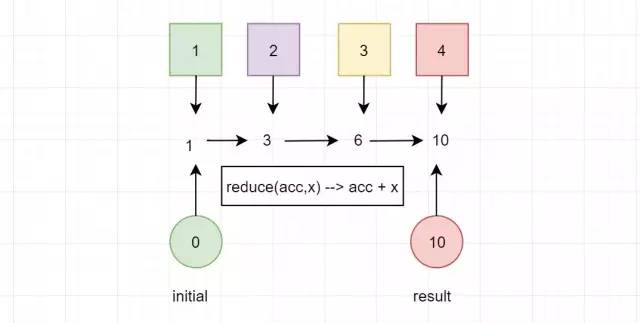
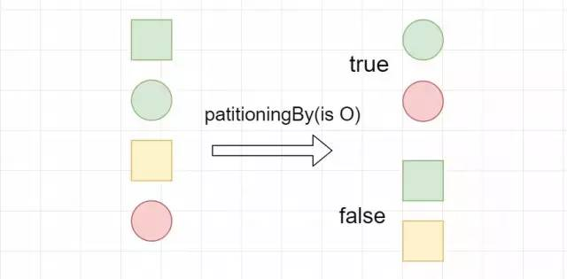
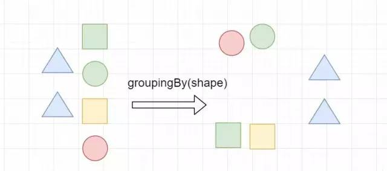

|           | 同类 | 同包 | 子孙类 | 其他包 |
| --------- | ---- | ---- | ------ | ------ |
| public    | ✔️    | ✔️    | ✔️      | ✔️      |
| protected | ✔️    | ✔️    | ✔️      |        |
| 无修饰符  | ✔️    | ✔️    |        |        |
| private   | ✔️    |      |        |        |


# 多态

父类引用可以指向子类引用

~~~java
Farther f1 = new Farther(); 	// Farther 引用指向 Farther 的实例
Farther f2 = new Son();    		// Farther 引用指向 Son 的实例
~~~

~~~java
class Farther {
    void run() {
        System.out.println("爸爸跑");
    }
}

class Son extends Farther {
    @Override
    void run() {
        System.out.println("儿子跑");
    }
}
~~~

```
爸爸跑
儿子跑
```


# 抽象类

抽象类不可被实例化创建对象，存在目的是抽取共性，提供给子类。特点是可以使用 abstract 修饰方法，强制子类重写方法逻辑。


# 接口

不可被实例化，但可以指向实现类。

抽象类实现接口时可以不用实现接口的方法

~~~java
interface Inter {
    void run();
    void eat();
}

abstract class AbsC implements Inter {}
~~~


# 数据类型

## 8 种基本数据类型

|           |       位数       | 字节 | 后缀 |
| :-------: | :--------------: | :--: | :--: |
|  *byte*   |        8         |  1   |      |
|  *short*  |        16        |  2   |      |
|   *int*   |        32        |  4   |      |
|  *long*   |        64        |  8   |  L   |
|  *char*   | 16 （ Unicode ） |  2   |      |
|  *float*  |        32        |  4   |  f   |
| *double*  |        64        |  8   |  d   |
| *boolean* |                  |      |      |


### 隐式向下转型

- `+=` 
- `++` 

~~~java
short s1 = 1; 
s1 += 1;
s1++;  // 等同 s1 = (short) (s1 + 1);
~~~


## String

1. *被 final 修饰，不可被继承*
2. *存储数组 value 被 final 修饰，不可再指向其它数组对象*
3. *String 类内部没有可以修改 value 的函数*

```java
public final class String implements Serializable, 
                                     Comparable<String>, 
                                     CharSequence {
    
    private final char value[];
}
```


### String Pool 

字符串常量池，保存着所有字符串实例

1. *** + 运算符***

   ~~~java
   //只会创建一个 “ab” 字面量对象
   String s= "a" + "b"  
        
   // 对于引用不会进行优化
   String s = "Hello"; 
   s = s + " world!";
   ~~~

2. ***new*** String()

   ~~~java
   // 每次都会创建一个新实例，不建议使用
   String s = new String("xyz")
       
   // 推荐
   String s = "xyz"
   String s = String.valueOf("xyz");
   ~~~

   数据类型的包装类型都有***valueOf()***方法，它会先从缓存获取


# 数据结构

## 集合（Collections）

<span style='font-size: 24px'>List</span>

1. ArrayList - 数组实现，默认容量为 10，每次扩容约为 1.5 倍
2. LinkedList - 链表实现
3. Vector - 数组实现，实现了线程同步操作。默认扩容翻倍，也可以指定扩容大小


<span style='font-size: 24px'>Queue</span>

1. PriorityQueue — 优先队列

2. Deque — 双向队列


<span style='font-size: 24px'>Set</span>

1. TreeSet —— 红黑树实现，有序

2. HashSet

3. LinkedHashSet —— hash 的查找效率，双向链表维持存放的顺序


## 映射（Map）

<span style='font-size: 24px'>TreeMap</span>


<span style='font-size: 24px'>HashTable</span>

类似 HashMap ，线程安全

❌ 键值都不可以为 null


<span style='font-size: 24px'>LinkedHashMap</span>

双向链表保持存放顺序，插入顺序或者 LRU 顺序


## 源码分析

### HashMap

1. <span style='font-size: 20px'>链表数组</span>

   ```java
   transient Entry[] table;
   ```

   ```java
   static class Entry<K,V> implements Map.Entry<K,V> {
       final K key;
       V value;
       Entry<K,V> next;
       int hash;
   	....
   }
   ```

2. <span style='font-size: 20px'>键为 null，放在 0 号桶</span>

   *null*不能调用方法*hashcode()*，也就无法确定 null 的下标

   ✅允许一个键是 null

   ✅ 允许多个值是 null

3. <span style='font-size: 20px'>计算 hashcode 并对数组长度取余</span>

   2 的幂次方的数，对其取余等价于对其减 1 的按位与，所以 hashMap 就是计算键下标方式是 hsah & (capacity - 1)

   ```
   y   : 10110010   		y         : 10110010
   x   : 00010000			x-1       : 00001111					
   y % x : 00000010    	y & (x-1) : 00000010
   ```

4. <span style='font-size: 20px'>哈希冲突</span>

   两个对象 hashCode 相等，再经过 equal() 比较后确定为同一个对象，那么就将键的值更新；如果经过 equal() 比较不为等价对象则对 hashCode 取余，那么取余后的下标相同，数组每个槽位存储的是一个链表，新来元素成为链表头节点

5. <span style='font-size: 20px'>扩容翻倍</span>

   | 相关参数   | 说明                                                         |
   | ---------- | ------------------------------------------------------------ |
   | capacity   | 容量（数组长度）默认 16                                      |
   | size       | 元素数量                                                     |
   | threshold  | size 的阈值，size > threshold 触发扩容                       |
   | loadFactor | 装载因子，决定数组能够使用的比例，threshold = (int)(capacity* loadFactor)。**`默认转载因子为 0.75`** |

6. <span style='font-size: 20px'>重哈希</span>——扩容时，需要重新计算桶下标 hash & （newCapacity - 1)

7. 构造器传入容量自动转换为 2 的 n 次方

   ~~~java
   static final int tableSizeFor(int cap) {
       int n = cap - 1;
       n |= n >>> 1;
       n |= n >>> 2;
       n |= n >>> 4;
       n |= n >>> 8;
       n |= n >>> 16;
       return (n < 0) ? 1 : (n >= MAXIMUM_CAPACITY) ? MAXIMUM_CAPACITY : n + 1;
   }
   ~~~

   `tableSizeFor()`是对传入容量进行`左移 >>` 和`或  |`运算得到掩码

   ```java
   mask |= mask >> 1    11011000
   mask |= mask >> 2    11111110
   mask |= mask >> 4    11111111
   ```

   掩码 + 1 就能得到该数字的最小 2 次方

   ```java
   num     10010000
   mask    11111111
   mask+1  100000000
   ```

8. 当 HashMap 数组长度达到 64 并且其中一个链表长度达到 8 时会将链表转为红黑树

   ~~~java
   //最小树化容量    
   static final int MIN_TREEIFY_CAPACITY = 64;
   
   //树化时链表长度 
   static final int TREEIFY_THRESHOLD = 8;
   ~~~

   

### ConcurrentHashMap

```java
static final class HashEntry<K,V> {
    final int hash;
    final K key;
    volatile V value;
    volatile HashEntry<K,V> next;
}
```

**JDK 7**：将数组等分为几个部分，每一个部分称作 segment 并且加上一个 ***锁***，一个 segment 共享一把锁

- 默认 16 个 Segment

- Segment 继承自 ReentrantLock

**JDK 8** 

1. 将 Map 拆分成多个桶（Bucket），每个桶都是一个独立的散列表，可以独立进行操作，从而避免了锁竞争
2. 红黑树替代链表
3. CAS 操作优化


# 等价对象

## equals()

判断引用数据类型是否等价

**1.等价关系**

Ⅰ 自反性

```java
x.equals(x); // true
```

Ⅱ 对称性

```java
x.equals(y) == y.equals(x); // true
```

Ⅲ 传递性

```java
if (x.equals(y) && y.equals(z))
    x.equals(z); // true;
```

Ⅳ 一致性

```java
x.equals(y) == x.equals(y); // true
```

Ⅴ 与 null 的比较

```java
x.equals(null); // false;
y.equals(null); // false;
```


**2. 相等关系**

对于基本数据类型，==  判断值是否相同

对于引用数据类型，==  比较的是内存地址


**3. 实现**

1.  引用是否相等
2.  是否同类
3.  将 Object 对象进行转型；
4.  判断每个字段是否相等

```java
public class EqualExample {

    private int x;
    private int y;
    private int z;

    public EqualExample(int x, int y, int z) {
        this.x = x;
        this.y = y;
        this.z = z;
    }

    @Override
    public boolean equals(Object o) {
        // 引用相等
        if (this == o) return true;
        
        // 是否同类
        if (o == null || getClass() != o.getClass()) return false;

        // 将 Object 对象进行转型
        EqualExample that = (EqualExample) o;

        // 判断每个字段
        if (x != that.x) return false;
        if (y != that.y) return false;
        return z == that.z;
    }
}
```


## *hashCode()*

hashCode  <=>  等价对象的关系

- 等价对象的 hashCode 一样
- hashCode 一样的对象不一定等价

**推论：**

✔️如果 hashCode 不一样，那就代表对象一定不等价。

✔️hashCode 一样，进一步调用 equal() 判断对象是否真的等价。

> 在覆盖 equals() 方法时应当总是覆盖 hashCode() 方法，保证等价的两个对象哈希值也相等。


**实现**

质数能够更好地散布哈希值

```java
public class Person {
    
    private String name;
    private int age;

    @Override
    public int hashCode() {
        // 初始化为一个质数
        int result = 17; 
        
        // 与31相乘可以转换成移位和减法
        // 31*x == (x<<5)-x（编译器自动优化）
        result = 31 * result + name.hashCode();
        result = 31 * result + age;
        return result;
    }
}
```


## clone()

如果一个类或其超类之一实现了该`Cloneable`接口，则可以使用该`clone()`方法从现有对象创建副本。`Object`该方法的实现检查被调用的对象是否`clone()`实现了该`Cloneable`接口。如果对象不这样做，则该方法将引发`CloneNotSupportedException`异常

```java
protected native Object clone() throws CloneNotSupportedException 
```

> 对于某些类，Object 方法的默认行为[`clone()`](https://docs.oracle.com/en/java/javase/20/docs/api/java.base/java/lang/Object.html#clone())工作得很好。但是，如果一个对象包含对外部对象的引用，您可能需要重写[`clone()`](https://docs.oracle.com/en/java/javase/20/docs/api/java.base/java/lang/Object.html#clone())才能获得正确的行为。


<span style='font-size: 22px'>三种拷贝</span>

- **浅拷贝**：拷贝对象和原始对象中的字段的引用类型引用同一个对象。
- **深拷贝**：拷贝对象和原始对象中的字段的引用类型引用不同对象。
- **引用拷贝** ：对象和拷贝对象都指向一个实例。


***Effective Java：**使用拷贝构造函数或者拷贝工厂来拷贝一个对象。使用 clone() 方法来拷贝一个对象即复杂又有风险，它会抛出异常，并且还需要类型转换。* 


# 泛型

✔️编译时类型检查

✔️避免强制类型转换

1. ***泛型类***

   ```java
   public class Generic<T> {
       public T data;
   }
   
   //实例化,必须指定T的具体类型
   Generic<Integer> genericInteger = new Generic<Integer>();
   ```

2. ***泛型接口***

   ```java
   public interface Generator<T> {
       public T method();
   }
   
   //实现时，必须指定T的具体类型
   class GeneratorImpl implements Generator<String>{
       @Override
       public String method() {
           return "hello";
       }
   }
   ```

   

3. ***泛型方法***

   ~~~java
   public <E> void printArray(E[] arr) {
       for(E element : arr) System.out.println(element);
   }
   Integer[] arr1 = {1,2,3};
   printArray(arr1);
   ~~~
   
   `<E>`是泛型参数的声明

   

   泛型返回值

   ~~~java
   T deserialize(byte[] bytes);
   ~~~

## 边界

- List<? **extends** Apple> 接受自身和子类
- List<? **super** Apple> 接受自身和子类

~~~java
class Fruit {}
class Apple extends Fruit {}
class Jonathan extends Apple {}
~~~


## 泛型擦除

运行期将泛型信息擦除

```java
List<Integer> list = new ArrayList<>();
Class<? extends List> clazz = list.getClass();
Method add = clazz.getDeclaredMethod("add", Object.class);
add.invoke(list, "kl");  // 通过，泛型限制在 runtime 消失
```


## 通配符

- T （type）具体 java 类型

- K V 键值对类型

- E （element）集合元素类型

- ？无界通配符，不知道什么类型，可以使用 Object 接收

  ~~~Java
  public static void printList(List<?> list) {
      for (Object elem : list) 
          System.out.print(elem + " ");
      System.out.println();
  }
  
  public static void main(String[] args) {
      List<Integer> li = Arrays.asList(1, 2, 3);
      List<String> ls = Arrays.asList("one", "two", "three");
      printList(li);
      printList(ls);
  }
  ~~~

  

# 枚举

一种类型的集合

## 实例

1. 使用 `javac` 编译

2. `javap` 执行

   ~~~java
   Compiled from "ColorEn.java"
   public final class ColorEn extends java.lang.Enum<ColorEn> {
     public static final ColorEn RED;
     public static final ColorEn YELLOW;
     
     public static ColorEn[] values();
     public static ColorEn valueOf(java.lang.String);
     static {};
   }
   ~~~
   
   1. ***final** 修饰的 Class*
   
   2. 继承 ***java.lang.Enum<>***
   
      Java 单继承，所以***enum 不可再继承任何类***
   
   3. 每一个属性都被 ***public static final*** 修饰，并且是枚举本身的实例
   


## 字段

~~~java
public enum ColorEn {
    RED("#ffffff", "红色"),
    YELLOW("#ffffff", "黄色")
    
    String code;
    String name;
         
    ColorEn(String code, String name) {
        this.code = code;
        this.name = name;
    }
}
~~~


## 方法

先定义常量，再定义函数，在定义的最后一个常量尾部写上  ***;*** ，不然报错。

~~~java
public enum Color {
    RED,YELLOW,BLUE;
    //函数
}
~~~


**Enum 自身方法：**

1. ***values()*** ：枚举所有实例

2. `name()`：实例名称

3. `ordinal` ：实例声明时的名称

4. `getDeclaringClass()`：返回实例所属的 enum 类型。


## EnumSet

- `EnumSet`是一个抽象类，它继承自`AbstractSet`类，并且实现了`Set`接口。
- `EnumSet`中只能存储同一枚举类型的常量。
- `EnumSet`中的元素按照枚举常量的声明顺序进行排序。
- `EnumSet`是基于位向量实现的，因此在性能和内存占用方面都非常高效。
- `EnumSet`提供了多种静态工厂方法来创建实例，如`EnumSet.allOf()`、`EnumSet.noneOf()`、`EnumSet.of()`等。

以下是一些示例代码和用法说明：

```java
enum Day {
  MONDAY, TUESDAY, WEDNESDAY, THURSDAY, FRIDAY, SATURDAY, SUNDAY
}

// 创建一个包含所有枚举常量的EnumSet
EnumSet<Day> allDays = EnumSet.allOf(Day.class);

// 创建一个空的EnumSet
EnumSet<Day> emptyDays = EnumSet.noneOf(Day.class);

// 创建一个包含指定枚举常量的EnumSet
EnumSet<Day> workDays = EnumSet.of(Day.MONDAY, Day.TUESDAY, Day.WEDNESDAY, Day.THURSDAY, Day.FRIDAY);

// 创建一个范围内的EnumSet
EnumSet<Day> weekendDays = EnumSet.range(Day.SATURDAY, Day.SUNDAY);

// 添加和删除元素
EnumSet<Day> days = EnumSet.allOf(Day.class);
days.add(Day.MONDAY);
days.remove(Day.TUESDAY);

// 遍历EnumSet
for (Day day : days) {
  System.out.println(day);
}

// 检查是否包含指定元素
boolean containsMonday = days.contains(Day.MONDAY);

// 获取EnumSet的大小
int size = days.size();
```


# 注解

注解有多种用途，其中

- 编译器的信息 —— 编译器使用注解检查错误或者抑制警告
- 编译时和部署时处理 —— 软件工具可以处理注释信息以生成代码、XML 文件等。
- 运行时处理 —— 些注释可以在运行时检查


## 元注解

自定义注解时用到的注解。

1.  ***@Target()***：作用目标（类、接口、字段、参数..)

2.  ***@Retention()***：保留时期

3.  ***@Inherited***：子类继承注解；子类若被其它注解注解，则不继承

4.  @Repeatable

5.  @Native

6.  @Documented

   

## 字段

字段声明方式与Class不同，类似函数，但是没有访问权限修饰符。

~~~java
public @interface RpcService {
    int version() default 1;   //设定默认值
    String group() default "";
}
~~~

赋值

~~~java
@RpcService(group = "test1", version = 2) //不赋值使用默认值
public class test{}
~~~


## 预置注解

1.  **@Deprecated** 

2.  **@Override**

3.  **@SuppressWarnings** —— 抑制警告

4.  **@Safevargs** —— 抑制方法中与参数有关的警告，注解表明参数是安全的

5.  **@FunctionalInterface**


## 操作注解

首先获取**<u>类对象</u>**，使用类对象对注解进行获取以及判断，根据判断进行下一步操作。


# 反射

可以在运行期获取操作类和对象，如修改 String 的值。正因强大，破坏了封装性带来了风险，性能略低

## 类对象

1. 类名.class

   ```java
   Class<T> targetClass = T.class;
   ```

2. 类的全限定名

   ```java
   Class<?> targetClass = Class.forName("xx.xxx.xxx");
   ```

3. 通过实例反向获取

   ```java
   Class targetClass = new TargetObject().getClass();
   ```
   
4. 类加载器和类全限定名

   ```java
   Class targetClass = ClassLoader.loadClass("xxx.xxx.xxx");
   ```

   类加载器获取 Class 对象不会进行初始化


使用类对象创建实例

```java
Target targetInstance = targetClass.newInstance();
```


## 操作字段

~~~java
//全部字段
targetClass.getDeclaredFields()  
//特定字段
Field field = target.getDeclaredField("字段名")
field.setAccessible(true);  // 设为可修改
field.set(targetInstance, "值");   //修改目标实例的字段值
~~~


## 操作方法

~~~java
//全部方法
target.getDeclaredMethods()  //获取所有方法
//特定方法
Method method = target.getDeclaredMethod("方法名", String.class)
method.invoke(targetInstance, "参数值");   //目标实例调用方法
~~~

私有方法，需要解除安全检查才可调用

~~~java
privateMethod.setAccessible(true);
privateMethod.invoke(targetInstance);
~~~


# 异常

在程序运行过程中，可能会出现一些可抛出的错误或者异常

~~~mermaid
classDiagram
	class Throwable
	Throwable <|-- Error
	Throwable <|-- Exception
	Exception <|-- RuntimeException
	class CheckedException
	<<interface>> CheckedException
~~~

## 错误（Error）

错误是程序代码不可处理的，只可以抛出做出提示

## 异常（Exception）

异常分为两大类，一类称作受检查异常（CheckedException），一类是运行时异常（RuntimeException）

受检查异常在编译的时候，编译器会检查语法上的错误并提示修正，<span style='font-size: 24px'>运行时异常</span>可以通过代码处理，处理方式有抛出和捕获处理

~~~mermaid
classDiagram
	class CheckedException
	<<interface>> CheckedException
	
	class Exception
	Exception <|-- RuntimeException
	
~~~

### 捕获处理（try-catch）

1. try-catch

   ~~~java
   try{
       // 异常产生地
   } catch (ClassNotFoundException e) {   
   	// 可以捕获多种异常，如果在 catch 块又发生了异常，可以抛出也可以嵌套 try-catch 处理
   } finally { 
       // 必须存在，必定执行。如果在执行前调用了 System.exit(int) 或者线程死亡将不会执行
   	// 存在 return 则之前的 return 值
       // 通常完成对资源的关闭
   }
   ~~~

2. try-with-resources

   资源处理类需要实现 `AutoCloseable` 或 `Closeable`，相当于是 try-catch 的改进版，自动关闭开启的资源

   ~~~java
   try (Scanner scanner = new Scanner(system.in)) {
   
   } catch (FileNotFoundException fnfe) {
       
   }
   ~~~

### 抛出（throws）

在方法声明里使用关键字 `thorws` 表明，若方法执行过程中出现此异常直接抛出


# Stream

可以检索和逻辑处理集合数据、包括筛选、排序、统计、计数等，可以想象成是 Sql 语句。分为串行流和并行流（可多线程执行）

```java
//返回一个串行流
default Stream<E> stream()
//返回一个并行流
default Stream<E> parallelStream()
```


## 中间操作

*Stream*分为中间操作和终止操作，中间操作指的是对流元素进行筛选、过滤等操作，并且中间操作返回的也是*stream*，可以有多个中间操作；终止操作将会结束流，并返回对应结果。

~~~java
// 数据过滤
Stream<T> filter(Predicate<? super T> predicate);

// 接受一个Function，给定参数进行处理然后返回值
<R> Stream<R> map(Function<? super T, ? extends R> mapper);

// 将流中的每一个元素再次转化成一个流，每个子元素都是一个流，最后每个流合并返回一个流
<R> Stream<R> flatMap(Function<? super T, ? extends Stream<? extends R>> mapper);

// 去除流中重复元素
Stream<T> distinct();

// 对流排序
Stream<T> sorted();

// 传入比较器，定义规则排序
Stream<T> sorted(Comparator<? super T> comparator);

// 对元素进行操作
Stream<T> peek(Consumer<? super T> action);

// 返回前几个元素
Stream<T> limit(long maxSize);

// 跳过前几个
Stream<T> skip(long n);
~~~


## 终止操作

结束流

~~~java
// 对流中的每个元素执行指定的操作
void forEach(Consumer<? super T> action);

void forEachOrdered(Consumer<? super T> action);


Object[] toArray();

<A> A[] toArray(IntFunction<A[]> generator);

T reduce(T identity, BinaryOperator<T> accumulator);

//将流中的元素进行聚合操作，返回一个Optional对象
Optional<T> reduce(BinaryOperator<T> accumulator);

<U> U reduce(U identity,
             BiFunction<U, ? super T, U> accumulator,
             BinaryOperator<U> combiner);

// 将流中的元素收集到一个集合中
<R> R collect(Supplier<R> supplier,
              BiConsumer<R, ? super T> accumulator,
              BiConsumer<R, R> combiner);

<R, A> R collect(Collector<? super T, A, R> collector);

// 返回流中的最小元素
Optional<T> min(Comparator<? super T> comparator);

// 返回流中元素个数
long count();

// 判断流中是否存在满足条件的元素
boolean anyMatch(Predicate<? super T> predicate);

// 判断流中是否所有元素都满足条件
boolean allMatch(Predicate<? super T> predicate);

// 判断流中是否没有任何元素满足条件
boolean noneMatch(Predicate<? super T> predicate);

// 
Optional<T> findFirst();

Optional<T> findAny();
~~~


### `collect()`  

此方法经常用到，它的参数*Collector*也很为重要

```java
<R, A> R collect(Collector<? super T, A, R> collector);
```

~~~java
 // 将名字累加到List中
List<String> list = people.stream()
                            .map(Person::getName)
                            .collect(Collectors.toList());    
// 将名称累积到TreeSet中  
Set<String> set = people.stream()
                        .map(Person::getName)
                        .collect(Collectors.toCollection(TreeSet::new));  

// 将元素转换为字符串并将它们连接起来，以逗号分隔
String joined = things.stream()
                        .map(Object::toString)
                        .collect(Collectors.joining(", "));    
// 计算员工的工资总和
int total = employees.stream()
    			.collect(Collectors.summingInt(Employee::getSalary)));  

// 按部门分组员工
Map<Department, List<Employee>> byDept = employees.stream()
    .collect(Collectors.groupingBy(Employee::getDepartment));  

// 按部门，二级部门分组员工
Map<Department, Map<SecondDepartment, List<Employee>>> 
    byDept = 
    mployees
    .stream()
    .collect(Collectors.groupingBy(Employee::getDepartment, 		Collectors.groupingBy(Employee::getSecondDepartment)));

// 按部门计算工资总额  
Map<Department, Integer> totalByDept = 
    employees
    .stream()
    .collect(Collectors.groupingBy(
        Employee::getDepartment,
        Collectors.summingInt(Employee::getSalary))); 

// 把学生分为及格和不及格
Map<Boolean, List<Student>> passingFailing = students.stream()              .collect(Collectors.partitioningBy(s -> s.getGrade() >= PASS_THRESHOLD));
~~~


`toList()`：将流中的元素收集到一个`List`实例中。

```java
List<String> result = givenList.stream().collect(Collectors.toList());
```


`toUnmodifiableList()`：将流中的元素收集到一个不可修改的`List`实例中（Java 10+）。

```java
List<String> result = givenList.stream().collect(Collectors.toUnmodifiableList());
```


`toCollection(collectionFactory)`：将流中的元素收集到指定类型的集合中。

```java
List<String> result = givenList.stream().collect(Collectors.toCollection(LinkedList::new));
```


`collectingAndThen(downstream, finisher)`：在收集结束后对结果进行进一步处理。

```
  List<String> result = givenList.stream()
                                 .collect(Collectors.collectingAndThen(Collectors.toList(), ImmutableList::copyOf));
```


`joining(delimiter)`：将流中的字符串元素连接成一个字符串。

```
  String result = givenList.stream()
                           .collect(Collectors.joining());
```


`averagingDouble/Long/Int(mapper)`：计算流中元素的平均值。

```
  Double result = givenList.stream()
                           .collect(Collectors.averagingDouble(String::length));
```


`summingDouble/Long/Int(mapper)`：计算流中元素的总和。

```
  Double result = givenList.stream()
                           .collect(Collectors.summingDouble(String::length));
```


`groupingBy(classifier)`：根据指定的分类器对元素进行分组，并将结果存储在`Map`中。

```
  Map<Integer, List<String>> result = givenList.stream()
                                              .collect(Collectors.groupingBy(String::length));
```


`partitioningBy(predicate)`：根据指定的条件将元素分成两部分，并将结果存储在`Map`中。

```
  Map<Boolean, List<String>> result = givenList.stream()
                                               .collect(Collectors.partitioningBy(s -> s.length() > 2));
```


### `reduce`

reduce 操作可以实现从一组值中生成一个值。在上述例子中用到的 count 、 min 和 max 方法，因为常用而被纳入标准库中。事实上，这些方法都是 reduce 操作。及早求值。



~~~java
public static void main(String[] args) {
    Integer reduce = Stream.of(1, 2, 3, 4).reduce(0, (acc, x) -> acc+ x);
    System.out.println(reduce);
}
~~~

reduce接收了一个初始值为0的累加器，依次取出值与累加器相加，最后累加器的值就是最终的结果。


### 高级集合类及收集器


#### 转换成值

~~~java
public class CollectorsTest {
    public static void main(String[] args) {
        List<Student> students1 = new ArrayList<>(3);
        students1.add(new Student("路飞", 23, 175));
        students1.add(new Student("红发", 40, 180));
        students1.add(new Student("白胡子", 50, 185));

        OutstandingClass ostClass1 = new OutstandingClass("一班", students1);
        //复制students1，并移除一个学生
        List<Student> students2 = new ArrayList<>(students1);
        students2.remove(1);
        OutstandingClass ostClass2 = new OutstandingClass("二班", students2);
        //将ostClass1、ostClass2转换为Stream
        Stream<OutstandingClass> classStream = Stream.of(ostClass1, ostClass2);
        OutstandingClass outstandingClass = biggestGroup(classStream);
        System.out.println("人数最多的班级是：" + outstandingClass.getName());

        System.out.println("一班平均年龄是：" + averageNumberOfStudent(students1));
    }

    /**
     * 获取人数最多的班级
     */
    private static OutstandingClass biggestGroup(Stream<OutstandingClass> outstandingClasses) {
        return outstandingClasses.collect(
                maxBy(comparing(ostClass -> ostClass.getStudents().size())))
                .orElseGet(OutstandingClass::new);
    }

    /**
     * 计算平均年龄
     */
    private static double averageNumberOfStudent(List<Student> students) {
        return students.stream().collect(averagingInt(Student::getAge));
    }
}
//输出结果
//人数最多的班级是：一班
//一班平均年龄是：37.666666666666664
~~~

maxBy或者minBy就是求最大值与最小值。


#### 转换成块

常用的流操作是将其分解成两个集合，Collectors.partitioningBy帮我们实现了，接收一个Predicate函数式接口。

Predicate函数式接口。



将示例学生分为会唱歌与不会唱歌的两个集合。

~~~java
Map<Boolean, List<Student>> listMap = students.stream()
    .collect(Collectors.partitioningBy(student -> student.getSpecialities().
                              contains(SpecialityEnum.SING)));
~~~


#### 数据分组

数据分组是一种更自然的分割数据操作，与将数据分成 ture 和 false 两部分不同，可以使用任意值对数据分组。Collectors.groupingBy接收一个Function做转换。



如图，我们使用 groupingBy 将根据进行分组为圆形一组，三角形一组，正方形一组。

例子：根据学生第一个特长进行分组

~~~java
Map<SpecialityEnum, List<Student>> listMap = 
    students.stream()
    .collect(Collectors.groupingBy(student -> student.getSpecialities().get(0)));
~~~

Collectors.groupingBy与SQL 中的 group by 操作是一样的。


#### 字符串拼接

使用Stream，使用Collectors.joining()简单容易。

~~~java
List<Student> students = new ArrayList<>(3);
students.add(new Student("路飞", 22, 175));
students.add(new Student("红发", 40, 180));
students.add(new Student("白胡子", 50, 185));

String names = students.stream()
    .map(Student::getName).collect(Collectors.joining(",","[","]"));
~~~

joining接收三个参数，第一个是分界符，第二个是前缀符，第三个是结束符。

也可以不传入参数Collectors.joining()，这样就是直接拼接。


## 静态方法

~~~java
// 创建一个空的流
public static<T> Stream<T> empty();

// 创建一个由指定元素组成的流
public static<T> Stream<T> of(T... values);

// 流合并
public static <T> Stream<T> concat(Stream<? extends T> a, Stream<? extends T> b)
    
// 根据Supplier<T>生成内容加入到流，需要使用limit限制元素个数，不然无限生成
public static<T> Stream<T> generate(Supplier<T> s)
~~~


### builder()

创建一个Stream.Builder对象，通过该对象可以逐步构建一个流。

```java
Stream.Builder<String> builder = Stream.builder();
builder.add("Java").add("Python").add("C++");
Stream<String> stream = builder.build();
```


