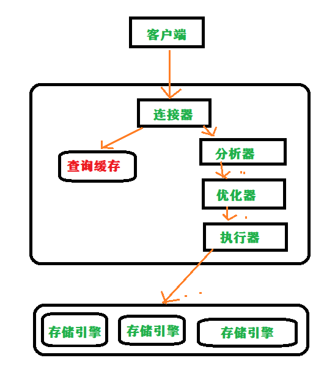
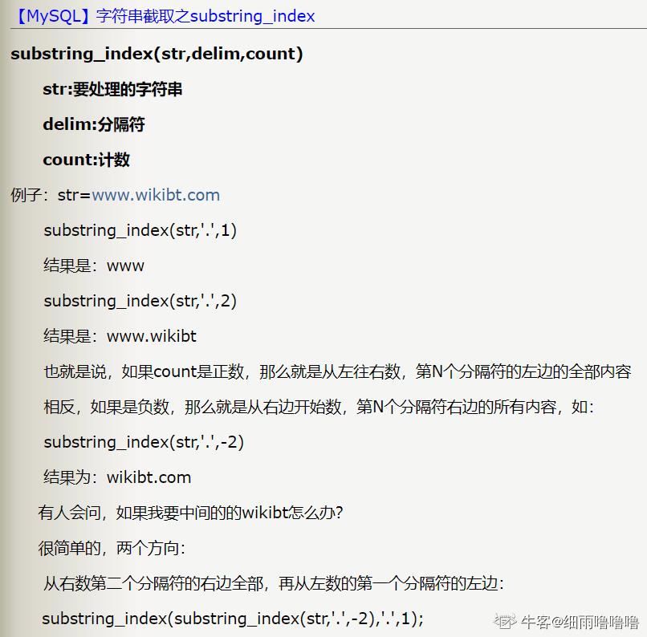
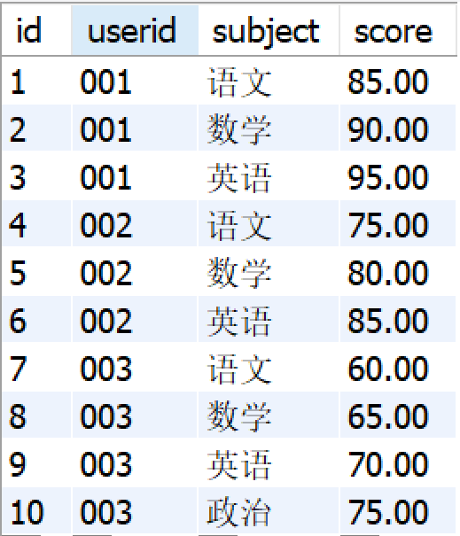
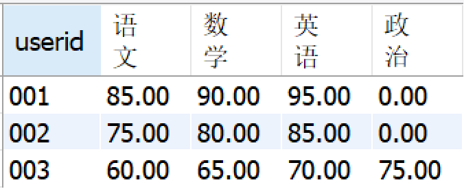

# 事务

原子性（Atomicity）—— 事务涉及的所有操作视为一个整体，这些操作要么全部成功，要么全部失败回滚

一致性（Consistency） —— 事务前后数据都正确

隔离性（Isolation）—— 事务对数据所作修改在未提交之前，其它事务不可对此数据进行访问

持久性（Durability）—— 数据持久化到硬盘


## 隔离性

事务执行需要时间，那么在当前事务执行期间其它事务是否有权查看当前事务修改的数据，即为隔离


|       隔离级别       |                  | 脏读 | 不可重读 | 幻读 |
| :------------------: | ---------------- | :--: | :------: | :--: |
| **READ-UNCOMMITTED** | 读未提交         |  ❌   |    ❌     |  ❌   |
|  **READ-COMMITTED**  | 读已提交         |  ✔️   |    ❌     |  ❌   |
| **REPEATABLE-READ**  | 可重读           |  ✔️   |    ✔️     |  ❌   |
|   **SERIALIZABLE**   | 强制事务串行执行 |  ✔️   |    ✔️     |  ✔️   |

1. 脏读（Dirty read）——读取到另一事务修改但未提交的数据

2. 不可重读（Unrepeatable read）—— 事务多次访问同一数据期间另一事务对此数据进行修改，导致事务相邻两次访问此数据结果不同

3. [幻读（Phantom read）](#huandu)—— 事务多次访问同一数据期间另一事务对此数据进行修改，导致事务相邻两次访问此数据发现数据记录增加或减少


如何实现隔离？并发即多线程，多线程之间的协调使用了锁，那么并发事务之间的协调同样可以使用锁

| 存储引擎 | 表级锁 | 行级锁 |
| -------- | ------ | ------ |
| InnoDB   | ✔️      | ✔️      |
| MyISAM   | ✔️      |        |


1. **Record Locks** —— 锁定记录的索引

2. **Gap Locks** —— 在条件范围内但不存在的记录

   ~~~sql
   update test_innodb_lock set sex = '0' where id < 4;
   ~~~

   

3. **Next-Key Locks** —— 上面两把锁的结合，避免了<span id='huandu' style='font-size: 20px'>幻读</span>


### MVCC 读写隔离

解决数据正在被修改时不能读取的问题

每行记录存在着隐藏列，如事务ID、Undo log 指针（一条链表保存了记录所作的修改），依据这些可以形成记录的版本快照


# 索引

**在数据之外，数据库系统还维护了满足特定查找算法的数据结构，这些数据结构以某种方式引用（指向）数据，这样就可以在这些数据结构上实现高级查找算法。**

InnoDB 引擎的表，具备<span style='font-size: 22px'>聚簇索引（主键）</span>，它记录了完整的数据行，如果不指定主键则会隐式指定一列为主键

对其他字段建立的索引会以字段值为依据进行排序，拥有主键的指针以及本列的值，非主键字段建立的索引称为<span style='font-size: 22px'>非聚簇索引</span>


## 建立原则

适合索引的列是出现在`where`子句中的列，或者连接子句中指定的列，还有分组以及排序列

数据基数小的表不需要建立索引，索引效果不高

使用短索引，如果对长字符串列进行索引，应该指定一个前缀长度，这样能够节省大量索引空间

不要过度索引。索引需要额外的磁盘空间，并降低写操作的性能。在修改表内容的时候，索引会进行更新甚至重构，索引列越多，这个时间就会越长。所以只保持需要的索引有利于查询即可。


1. 覆盖索引 —— 要查询的列都拥有索引，并使用了索引查询将无需回表再次查询
2. 联合索引 —— 为多个列建立一个索引

#### 索引生效

✅ 比较运算符

✅ 联合索引、between ——> 最左匹配原则，指的是查询条件要有最左列，如（name，age）索引，where 中要有 name 做条件才会走索引

✅ LIKE 运算时通配符 % 在最右边

✅❌ in 运算 —— 是否走索引取决于多种因素

❌ 数据类型出现隐式转换的时候不会命中索引，如 name 列是字符串，然后在 where 中使用了数字`WHERE name=1;`


####  前缀索引

​	如果字段的数据类型很大，如BLOB、TEXT 和 VARCHAR 类型的列，必须使用前缀索引，只索引开始的部分字符。

​	前缀长度的选取需要根据索引选择性来确定。


## 重构

drop原索引，然后再创建索引：

```
drop index index_name;
create index index_name on table_name (index_column);
```

这种方式相当耗时，一般不建议使用。


直接重建索引：

```
alter index indexname rebuild;
alter index indexname rebuild online;
```

rebuild是快速重建索引的一种有效的办法，因为它是一种使用现有索引项来重建新索引的方法。

如果重建索引时有其他用户在对这个表操作，尽量使用带online参数来最大限度的减少索引重建时将会出现的任何加锁问题。由于新旧索引在建立时同时存在，因此，使用这种重建方法需要有额外的磁盘空间可供临时使用，当索引建完后把老索引删除，如果没有成功，也不会影响原来的索引。利用这种办法可以用来将一个索引移到新的表空间。

rebuild重建索引的过程：

1. Rebuild以index fast full scan或table full scan方式（采用那种方式取决于cost）读取原索引中的数据来构建一个新的索引，重建过程中有排序操作，rebuild online执行表扫描获取数据，重建过程中有排序的操作；
2. Rebuild会阻塞DML操作，rebuild online不会阻塞DML操作；
3. rebuild online时系统会产生一个SYS_JOURNAL_xxx的IOT类型的系统临时日志表，所有rebuild online时索引的变化都记录在这个表中，当新的索引创建完成后，把这个表的记录维护到新的索引中去，然后drop掉旧的索引，rebuild online就完成了。

重建索引过程中的注意事项：

1. 执行rebuild操作时，需要检查表空间是否足够；
2. 虽然说rebuild online操作允许DML操作，但还是建议在业务不繁忙时间段进行；
3. Rebuild操作会产生大量Redo Log；


### 


## 字符型

### 字符串

~~~sql
类型				大小        	 编码				速度
char	 		255字符（字节）  无关编码		  速度快，浪费空间

varchar(60)    最多65535字节  编码影响空间占用 	 速度慢，节省空间
    
--------------------------------------------------------------------
varchar 数字代表可存储空间，与内存挂钩

    
varchar -- 第一个字节是空的
		-- 数据小于255个字节，则采用一个字节来保存长度，反之需要两个字节来保存
    
    Mysql记录行数据是有限的。一条字段存储的数据大小为64k,即65535个字节
    问：若一个表定义为 
    CREATE TABLE tb(
        c1 int, 
        c2 char(30), 
        c3 varchar(N)) 
        charset=utf8; 问N的最大值是多少？ 
    答：(65535-1-2-4-30*3)/3  
    c1 int 占去4字节
    utf8字符类型中文3个字节
    c2 char(30) 最大30字符，每个字符3字节
 	所以剩下 65535-4-90
 	varchar字符规则 第1个字节为空 再用2字节存储长度 剩下 65535-4-90-3
 	（65535-4-90-3）/ 3

~~~


## 日期型

~~~sql
datetime    8字节    日期及时间     1000-01-01 00:00:00 到 9999-12-31 23:59:59

timestamp   4字节    时间戳        1970-01-01 00-00-00 到 2038-01-19 03:14:07

------------------------------------------------
datetime    YYYY-MM-DD hh:mm:ss

timestamp   YY-MM-DD hh:mm:ss
            YYYYMMDDhhmmss
            YYMMDDhhmmss
            YYYYMMDDhhmmss
            YYMMDDhhmmss
            
            
-- timestamp
它和时区有关，也就是说一个时间戳在不同的时区所代表的具体时间是不同的。

MySQL 提供了 FROM_UNIXTIME() 函数把 UNIX 时间戳转换为日期，并提供了 UNIX_TIMESTAMP() 函数把日期转换为 UNIX 时间戳。

默认情况下，如果插入时没有指定 TIMESTAMP 列的值，会将这个值设置为当前时间。

应该尽量使用 TIMESTAMP，因为它比 DATETIME 空间效率更高。
~~~


# SQL 慢


如果执行SQL响应比较慢，有以下4个原因：

1. 没有索引或者没有命中索引导致索引失效
2. 单表数据量过多，导致查询瓶颈
3. 网络原因或者机器负载均衡过高
4. 热点数据导致单点负载不均衡


## 没有索引或者索引失效

可以打开MySQL的慢查询日志，收集一段时间的慢查询，找出耗时最长的SQL语句，对这些SQL语句在进行分析。

```
show variables likes '%slow_query_log%';
```

`EXPLAIN` 查询SQL是否命中索引，没有命中索引的话，尝试优化SQL语句，保证SQL走索引执行。如果SQL语句没办法再优化，那就尝试在表上添加对应的索引，添加索引的时候需要符合最左匹配原则。


## 单表数据量过多，导致查询瓶颈

存在即使表添加了索引，表现性能也不是特别的情况。这个时候就要考虑对表进行切分。

表切分分为两种：水平切分和垂直切分。

#### 水平切分

水平切分又称为 Sharding，它是将同一个表中的记录拆分到多个结构相同的表中。


#### 垂直切分

垂直切分是将一张表按列切分成多个表，按照业务逻辑把关联性比较大的列放在同一张表上去。


#### Sharding 策略

- 哈希取模：hash(key) % N；
- 范围：可以是 ID 范围也可以是时间范围；
- 映射表：使用单独的一个数据库来存储映射关系。


#### Sharding 存在的问题

##### 1. 事务问题

使用分布式事务来解决。

##### 2. join 连接

可以将原来的连接分解成多个单表查询，可以在程序中进行连接，在一个数据库中查询到一个数据之后，再根据这个数据去另外一个数据库中找对应的数据。

##### 3. 分布式 ID


除了进行分表，还可以分库。将切分后的表，假如有100张id从0到99，每10张表放到一个数据库实例中，根据请求路由到不同的数据库实例中，让每个数据库实例承担相应的流量。

> 而对于应用查询的数据行返回过多：
>
> 1. 分页
> 2. 增大应用内存


## 网络原因或者机器负载均衡过高

可以进行读写分离，MySQL支持一主多从的分布式部署，可以将主库只用来处理写的操作，然后多个从库负责读的操作。在流量大的环境中，可以增加从库的数量来提高数据库的负载能力，从而提高数据库的总体性能。


#### 读写分离

- 主从服务器负责各自的读和写，极大程度缓解了锁的争用；
- 从服务器可以使用 MyISAM，提升查询性能以及节约系统开销；


**主从复制** 维持数据一致。


落实到项目本身的话，常用的方式有两种：

**1.代理方式**


我们可以在应用和数据中间加了一个代理层。应用程序所有的数据请求都交给代理层处理，代理层负责分离读写请求，将它们路由到对应的数据库中。

提供类似功能的中间件有 **MySQL Router**（官方）、**Atlas**（基于 MySQL Proxy）、**Maxscale**、**MyCat**。


**2.组件方式**

引入第三方组件处理读写请求。

[sharding-jdbc 关于读写分离的操作open in new window](https://shardingsphere.apache.org/document/legacy/3.x/document/cn/manual/sharding-jdbc/usage/read-write-splitting/)


#### 主从复制

- **binlog 线程** ：负责将主服务器上的数据更改写入二进制日志（Binary log）中。
- **I/O 线程** ：负责从主服务器上读取二进制日志，并写入从服务器的中继日志（Relay log）。
- **SQL 线程** ：负责读取中继日志（Relay log）同步数据并在从服务器中重放（Replay）。


## 热点数据导致单点负载不均衡

除了对数据库本身做调整以外，还可以增加缓存。然后将查询比较频繁的热点数据放到缓存中，以此来缓解数据库的压力，从而提高性能。


# SQL注入

SQL代码伪装到输入参数里，传递到服务器解析并执行的一种攻击手段。

预期中的sql

```sql
SELECT * FROM user WHERE username = 'ls' AND password = '123456'
```

SQL中会将#及--以后的字符串当做注释处理，如果我们使用 ' or 1=1 # 作为用户名参数，那么

```sql
select * from user where username='' or 1=1 #' and password='123456'
```


1）参数校验

2）SQL预编译

MySQL服务器对参数进行编译，即填充到相应的占位符的过程中，做了转义操作。

JDBC就有预编译功能，不仅提升性能，而且防止SQL注入。


# 字符集

***GBK*** 是中文字符集标准

1. 兼容 ASCII 码
2. **中文 2 byte**
3. **英文字符 1 byte**


***UTF-8*** 可变长度字符编码方式，可以表示世界上所有的语言、符号和表情

1.  **ASCII 字符 1 byte**
3. **中文 3 byte** ，特殊情况 2 byte


UTF-8 优点：

1. 节约空间：UTF-8 可以根据字符的实际情况来选择使用 1 到 4 个字节进行编码，对于英文等单字节字符，可以节约存储空间。
2. 传输方便：UTF-8 可以使用 ASCII 码进行兼容，这使得在传输数据时可以方便地进行编码和解码。
3. 兼容性强：UTF-8 可以表示 Unicode 字符集中的所有字符，因此在跨平台和跨语言的情况下，具有更好的兼容性。


**`utf8mb4`** ： UTF-8 的完整实现！最多支持使用 4 个字节表示字符（存储`emoji`）

```mysql
-- MySQL、数据库、表、字段均可设置编码
-- 数据编码与客户端编码不需一致
-- 查看所有字符集编码项
SHOW VARIABLES LIKE 'character_set_%'
    character_set_client        客户端向服务器发送数据时使用的编码
    character_set_results       服务器端将结果返回给客户端所使用的编码
    character_set_connection    连接层编码
    
SET 变量名 = 变量值
    SET character_set_client = gbk;
    SET character_set_results = gbk;
    SET character_set_connection = gbk;

-- 校对集
    校对集用以排序
    SHOW CHARACTER SET [LIKE 'pattern']/SHOW CHARSET [LIKE 'pattern']   查看所有字符集
    SHOW COLLATION [LIKE 'pattern']     查看所有校对集
    CHARSET 字符集编码     设置字符集编码
    COLLATE 校对集编码     设置校对集编码
```


# 数据修改

## Insert

#### 全字段插入

```sql
INSERT INTO table_name VALUES (value1, value2, ...)
```

主键自增时，把主键设为 null。也可以直接填入主键值，但是会失去自增的意义。

#### 指定字段插入

```sql
INSERT INTO table_name (column1, column2, ...) VALUES (value1, value2, ...)
```

主键自增，可以不添加主键字段，即可自增。

#### 插入多条

```sql
INSERT INTO table_name (column1, column2, ...)
VALUES (value1_1, value1_2, ...), (value2_1, value2_2, ...), ...
```


#### 从另一个表导入

```sql
INSERT INTO table_name
SELECT * FROM table_name2
```


### Replace

1. 首先尝试插入数据到表中

2. 如果发现表中已经有此行数据（主键、唯一索引判断），先删除含有重复关键字值的冲突行，然后插入新的数据；

   > 数据表必须有主键或者是唯一索引！
   >
   > 否则 replace into 会直接插入数据，导致表中出现重复关键字段值的数据。

3. 否则，直接插入新数据。


## 删除

### Delete

删除表数据，支持条件过滤和回滚（记录日志）。

```sql
DELETE FROM tb_name [WHERE options] [ [ ORDER BY fields ] LIMIT n ]
```


### Truncate

表删除重建（清空数据），不可回滚。

```sql
TRUNCATE [TABLE] tbl_name
```

与delete区别：

1. truncate 是删除表再创建，delete 是逐条删除
2. truncate 重置auto_increment的值。而delete不会
3. truncate 不知道删除了几条，而delete知道
4. 当被用于带分区的表时，truncate 会保留分区


### Drop

删除表

```sql
DROP table_name：
```


## Update

修改值

```sql
UPDATE table_name SET column_name=new_value [, column_name2=new_value2] [ WHERE column_name3=value3 ]
```


将已知的值改成给定的值

```sql
update student 
set class_id = replace(class_id,1,2)
[ WHERE column_name3=value3 ]
```


从另一张表更新：

```sql
update b set b.col=a.col from a,b where a.id=b.id;
update b set col=a.col from b inner join a on a.id=b.id;
update b set b.col=a.col from b left Join a on b.id = a.id;
```


# SELECT


架构方面查询SQL的执行顺序：

~~~mermaid
flowchart TD
	1(((start)))--查权限-->connect["连接器"]
	connect--"查缓存(8.0v前版本)"-->cache["缓存"]
	connect--"词法分析"-->analyzer["分析器"]
	cache--"没有缓存，词法分析"-->analyzer
	cache--"查到缓存"-->2(((end)))
	analyzer--"优化SQL，确定执行方案"-->optimizer["优化器"]
	optimizer--"执行方案，调用引擎"-->memoryEngine["存储引擎"]
	memoryEngine-.->MyISAM
	memoryEngine-.->InnoDB
~~~

## FROM

*from*后接表名，表示从哪张表进行查询；可以*SELECT*中同时查询多张表，使用逗号`，`对多个表名进行分隔，多张表的查询称作自然连接（笛卡尔积），自然连接会对表之间的数据进行乘法级的数据量提升


## ON

连接查询时，on后面接表的连接条件，也可以进行筛选。

~~~sql
SELECT * 
FROM 表1 
JOIN 表2 ON 连接条件 AND 筛选条件
where 筛选条件
~~~

1. *cross join*和*inner join*时，on后面接筛选条件和where接筛选条件没有区别
2. *outer join*时*on*接筛选条件和*where*接筛选条件是不同的结果


表main


表ext


将地址不为杭州的所有用户信息筛选出来，结果中需要包含main表和ext表的所有字段数据。

~~~sql
select * from main left JOIN exton main.id = ext.id and address <> '杭州'
~~~

闭上眼睛， 请用大脑人肉运行一下这段SQL， 想象一下是什么结果。


当把 **address <> '杭州'** 这个筛选条件放在on之后，查询得到的结果似乎跟我们预料中的不同，从结果中能看出，这个筛选条件好像只过滤掉了ext表中对应的记录，而main表中的记录并没有被过滤掉，也就是上图中标记为红色的那条记录。outer join相对于inner join的一个主要特性就是以一侧的表为基础，但是在这里以左表为基这一点却可以无视筛选条件，这未免也太霸道了一些。

把查询语句稍微改动一下，将地址的筛选条件从on转移至where

**select \* from main left JOIN ext on main.id = ext.id where address <> '杭州'**

结果就如我们预期的那样了


造成这种结果上的差异要从outer join查询的逻辑查询的各个阶段说起。总的来说，outer join 的执行过程分为4步

**1、先对两个表执行交叉连接(笛卡尔积)**

**2、应用on筛选器**

**3、添加外部行**

**4、应用where筛选器**


就拿上面不使用where筛选器的sql来说，执行的整个详细过程如下

**第一步**，对两个表执行交叉连接，结果如下，这一步会产生36条记录（此图显示不全）


**第二步**，应用on筛选器。筛选器中有两个条件，**main.id = ext.id and address<> '杭州'**，符合要求的记录如下


这似乎正是我们期望中查询的结果，然而在接下来的步骤中这个结果会被打乱

**第三步**，添加外部行。outer join有一个特点就是以一侧的表为基，假如另一侧的表没有符合on筛选条件的记录，则以null替代。在这次的查询中，这一步的作用就是将那条原本应该被过滤掉的记录给添加了回来


是不是不种画蛇添足的感觉, 结果就成了这样


**第四步**，应用where筛选器

在这条问题sql中，因为没有where筛选器，所以上一步的结果就是最终的结果了。

而对于那条地址筛选在where条件中的sql，这一步便起到了作用，将所有地址不属于杭州的记录筛选了出来


## JOIN

连接查询关键字，一个查询同时涉及两个或两个以上的表，则称之为连接查询。

~~~sql
SELECT * FROM 表1 JOIN 表2 ON 连接条件
~~~

或者

~~~sql
SELECT * FROM 表1 JOIN 表2 using(id)
~~~

id是两个表的共同字段，表示id相等的。

使用using，就不用on。


1. 内连接 - 只保留符合连接条件的数据

   *join*关键字默认是内连接，可以省略*inner*关键字

   ~~~sql
   SELECT * FROM 表1 [INNER] JOIN 表2 ON 连接条件
   ~~~

   *on*可以使用*using*替代

   ~~~sql
   SELECT * FROM 表1 JOIN 表2 using(连接条件)
   ~~~

2. 外连接 - 返回满足连接条件的数据，也返回不满足连接条件的数据。分为左连接（LEFT OUTER JOIN）和右连接（RIGHT OUTER JOIN），左连接是指返回左表的所有数据，而右表只返回满足连接条件的数据，右连接相反


### 笛卡尔积

两个表的笛卡尔积是行数相乘，6条数据的表和另外一张6条数据的表的笛卡尔积是36行数据


### 自然连接

自动判断连接条件完成连接，相当于省略了using，会自动查找相同字段名。

```mysql
natural join
natural left join
natural right join
select info.id, info.name, info.stu_num, extra_info.hobby, extra_info.sex from info, extra_info where info.stu_num = extra_info.stu_id;
```


**困难**！！！

描述：现有用户信息表user_info（uid用户ID，nick_name昵称, achievement成就值, level等级, job职业方向, register_time注册时间）

| id   | uid  | nick_name | achievement | level | job  | register_time       |
| ---- | ---- | --------- | ----------- | ----- | ---- | ------------------- |
| 1    | 1001 | 牛客1号   | 3100        | 7     | 算法 | 2020-01-01 10:00:00 |
| 2    | 1002 | 牛客2号   | 2300        | 7     | 算法 | 2020-01-01 10:00:00 |
| 3    | 1003 | 牛客3号   | 2500        | 7     | 算法 | 2020-01-01 10:00:00 |
| 4    | 1004 | 牛客4号   | 1200        | 5     | 算法 | 2020-01-01 10:00:00 |
| 5    | 1005 | 牛客5号   | 1600        | 6     | C++  | 2020-01-01 10:00:00 |
| 6    | 1006 | 牛客6号   | 2000        | 6     | C++  | 2020-01-01 10:00:00 |

试卷信息表examination_info（exam_id试卷ID, tag试卷类别, difficulty试卷难度, duration考试时长, release_time发布时间）：

| id   | exam_id | tag  | difficulty | duration | release_time        |
| ---- | ------- | ---- | ---------- | -------- | ------------------- |
| 1    | 9001    | SQL  | hard       | 60       | 2021-09-01 06:00:00 |
| 2    | 9002    | C++  | hard       | 60       | 2021-09-01 06:00:00 |
| 3    | 9003    | 算法 | medium     | 80       | 2021-09-01 10:00:00 |

试卷作答记录表exam_record（uid用户ID, exam_id试卷ID, start_time开始作答时间, submit_time交卷时间, score得分）：

| id   | uid  | exam_id | start_time          | submit_time         | score |
| ---- | ---- | ------- | ------------------- | ------------------- | ----- |
| 1    | 1001 | 9001    | 2021-09-01 09:01:01 | 2021-09-01 09:31:00 | 81    |
| 2    | 1002 | 9002    | 2021-09-01 12:01:01 | 2021-09-01 12:31:01 | 81    |
| 3    | 1003 | 9001    | 2021-09-01 19:01:01 | 2021-09-01 19:40:01 | 86    |
| 4    | 1003 | 9002    | 2021-09-01 12:01:01 | 2021-09-01 12:31:51 | 89    |
| 5    | 1004 | 9001    | 2021-09-01 19:01:01 | 2021-09-01 19:30:01 | 85    |
| 6    | 1005 | 9002    | 2021-09-01 12:01:01 | 2021-09-01 12:31:02 | 85    |
| 7    | 1006 | 9003    | 2021-09-07 10:01:01 | 2021-09-07 10:21:01 | 84    |
| 8    | 1006 | 9001    | 2021-09-07 10:01:01 | 2021-09-07 10:21:01 | 80    |

题目练习记录表practice_record（uid用户ID, question_id题目ID, submit_time提交时间, score得分）：

| id   | uid  | question_id | submit_time         | score |
| ---- | ---- | ----------- | ------------------- | ----- |
| 1    | 1001 | 8001        | 2021-08-02 11:41:01 | 60    |
| 2    | 1002 | 8001        | 2021-09-02 19:30:01 | 50    |
| 3    | 1002 | 8001        | 2021-09-02 19:20:01 | 70    |
| 4    | 1002 | 8002        | 2021-09-02 19:38:01 | 70    |
| 5    | 1004 | 8001        | 2021-08-02 19:38:01 | 70    |
| 6    | 1004 | 8002        | 2021-08-02 19:48:01 | 90    |
| 7    | 1001 | 8002        | 2021-08-02 19:38:01 | 70    |
| 8    | 1004 | 8002        | 2021-08-02 19:48:01 | 90    |
| 9    | 1004 | 8002        | 2021-08-02 19:58:01 | 94    |
| 10   | 1004 | 8003        | 2021-08-02 19:38:01 | 70    |
| 11   | 1004 | 8003        | 2021-08-02 19:48:01 | 90    |
| 12   | 1004 | 8003        | 2021-08-01 19:38:01 | 80    |

请你找到高难度SQL试卷得分平均值大于80并且是7级的红名大佬，统计他们的2021年试卷总完成次数和题目总练习次数，只保留2021年有试卷完成记录的用户。结果按试卷完成数升序，按题目练习数降序。

示例数据输出如下：

| uid  | exam_cnt | question_cnt |
| ---- | -------- | ------------ |
| 1001 | 1        | 2            |
| 1003 | 2        | 0            |

解释：用户1001、1003、1004、1006满足高难度SQL试卷得分平均值大于80，但只有1001、1003是7级红名大佬；1001完成了1次试卷1001，练习了2次题目；1003完成了2次试卷9001、9002，未练习题目（因此计数为0）


其实看到这道题，我一开始满脑子在想，怎么结合在一起，因为条件基本顺从于exam_record这张表，结果写得非常复杂且不正确

后面我想了下，为啥不能先把这些数据表先做简化呢

于是第一步，我先从**统计**那步下手，分别将**exam_record**完成试卷数和 **practice_record题目练习数**一一算出来

```sql
select 
    uid,
    count(submit_time) as exam_cnt
from exam_record
where YEAR(submit_time) = 2021
group by uid
```

```sql
select
    uid,
    count(submit_time) as question_cnt
from practice_record
where YEAR(submit_time) = 2021
group by uid
```

第二步，我着重于它的筛选条件高难度SQL试卷得分平均值大于80并且是7级的红名大佬

这步其实针对于**exam_record**,**user_info**,**examination_info**这三张表，后两者只是用于连接作用，因此难度并不大

这一步用于筛选目标用户uid

```sql
select
    uid
from exam_record
join examination_info using(exam_id)
join user_info using(uid)
where tag = 'SQL' and difficulty = 'hard' and `level` = 7
group by uid
having avg(score) >= 80
```

第三步，前者条件也筛选出来了，后者试卷数和练习数也写出来了，只剩下组装这项工程了

**试卷数和练习数的SQL语句里面留下uid**这个字段，目的就是链接三者
下面为最终SQL语句

```sql
select 
    uid,
    exam_cnt,
    if(question_cnt is null, 0, question_cnt)
from
(select 
    uid,
    count(submit_time) as exam_cnt
from exam_record
where YEAR(submit_time) = 2021
group by uid) t

left join

(select
    uid,
    count(submit_time) as question_cnt
from practice_record
where YEAR(submit_time) = 2021
group by uid) t2 using(uid)

where uid in
(
select
    uid
from exam_record
join examination_info using(exam_id)
join user_info using(uid)
where tag = 'SQL' and difficulty = 'hard' and `level` = 7
group by uid
having avg(score) >= 80
)
order by exam_cnt asc, question_cnt desc
```


## WHERE

筛选，根据需求的数据对表的数据进行过滤，返回想要的特定数据。


一般的筛选场景可以使用操作符进行过滤

| 操作符      | 说明                                                         |
| ----------- | ------------------------------------------------------------ |
| NOT         | 反转表达式结果                                               |
| AND 、OR    | 连接多个条件，优先处理 AND                                   |
| =           | 等于                                                         |
| <           | 小于                                                         |
| >           | 大于                                                         |
| <>  !=      | 不等于                                                       |
| <=  !>      | 小于等于 \| 不大于                                           |
| >=  !<      | 大于等于 \| 不小于                                           |
| BETWEEN AND | 在两个值之间（包含边界值）                                   |
| IS NULL     |                                                              |
| IS NOT NULL |                                                              |
| IN          | 匹配一组值。可接 SELECT 子句                                 |
| LIKE        | 模糊查询<br/>(1) % 匹配大于等于*0*个任意字符；<br/>(2) _ 匹配*1*个任意字符 <br/>(3) [ ] 可以匹配集合内的字符，例如 [ab] 将匹配字符 a 或者 b。用脱字符 ^ 可以对其进行否定，也就是不匹配集合内的字符。 |

操作符除了*IN*可以对一组进行匹配，其它的操作符都**不能直接**比对一组值。可以使用子查询对一组值进行比对，如查询哪些國家的GDP比Europe歐洲的全部國家都要高呢?

~~~sql
SELECT name
FROM world
WHERE gdp > ALL((SELECT gdp 
                 FROM world 
                 WHERE continent = 'Europe' AND gdp > 0))
~~~

配合*ALL()*函数使用


## GROUP BY

将数据分组，分组的目的是为了统计，所以分组必定搭配聚合函数使用。

下面表格数据，如想要统计哔哩大学的学生数量可以使用分组统计

~~~sql
SELECT 学校, SUM(学生) AS 学生数量
FROM tableName
GROUP BY 学校
~~~

| 学校     | 学生   | 性别 |
| -------- | ------ | ---- |
| 哔哩大学 | 狂神   | 男   |
| 百度大学 | 阮一峰 | 男   |
| 哔哩大学 | 黑马   | 不详 |

将会得到

| 学校     | 学生数量 |
| -------- | -------- |
| 哔哩大学 | 2        |
| 百度大学 | 1        |


使用*GROUP BY*需要注意的点，分组的目的是为了**统计**，所以获取在分组获取数据是不可行的，即分组后还想要获取学生的姓名

~~~sql
SELECT 学校, 学生
FROM tableName
GROUP BY 学校
~~~

错误点：

1. 分组的目的不是为了统计
2. 想要获取学生就不需要分组
3. <span style='color: red'>语法上不允许：设置分组后，*SELECT*不允许查询未分组的列，未分组的列只能用在聚合函数中用于统计</span>


所以 group by 需要结合聚合函数，在select 中对其他字段进行计算，达到统计计算效果。

| 聚合函数               | 说 明                         |
| ---------------------- | ----------------------------- |
| AVG()                  | 返回某列的平均值（忽略 NULL） |
| COUNT(*)               | 返回某列的行数，包括NULL      |
| COUNT(DISTINCT <列名>) | 返回某列的值个数（去重）      |
| MAX()                  | 返回某列的最大值              |
| MIN()                  | 返回某列的最小值              |
| SUM()                  | 返回某列值之和                |
| AVG(DISTINCT )         | 相同值参与一次                |


## HAVING

*GROUP BY*根据列的值对数据进行分组，分组的目的是为了统计，统计的目的是为了获取某些值，获取值之后再对数据进行过滤，*HAVING*就是基于这一目的而来。

所以*HAVING*从目的上和数据库架构上可以使用以下几种进行过滤：

1. **聚合函数的结果**：`HAVING`子句最常用于包含聚合函数（如COUNT(), SUM(), AVG(), MAX(), MIN()等）的查询中，用于过滤满足特定条件的分组。例如，你可能想要找到平均工资高于某个值的部门，就可以在`HAVING`子句中使用AVG(salary)这样的表达式。

   ```sql
   SELECT department_id, AVG(salary)
   FROM employees
   GROUP BY department_id
   HAVING AVG(salary) > 5000;
   ```

2. **GROUP BY中的列**

   ```sql
   SELECT department_id, COUNT(employee_id)
   FROM employees
   GROUP BY department_id
   HAVING department_id > 5;
   ```

3. **常数和无参数函数**：`HAVING`子句还可以使用常数和无参数函数（如当前日期函数）

   > 此外，虽然在许多数据库中，`SELECT`子句中定义的别名不能在`HAVING`子句中使用，因为在执行顺序上，`HAVING`子句在`SELECT`子句之前被评估。但在某些数据库（如PostgreSQL）中，你可以在`GROUP BY`子句中使用别名，但仍然不能在`HAVING`子句中使用别名。


## SELECT

结果列选择，在*FROM*选择要查询的表后可以使用*SELECT*选定结果集的列

1)使用 * 选择所有列

~~~SQL
SELECT *
FROM tableName
~~~

2)选择指定列

~~~sql
SELECT name
FROM tableName
~~~

3)使用表别名选择指定列，在多表连接查询需要为每张表起别名以便SQL简洁

获取表1的名称和表2的家庭地址

~~~sql
SELECT t1.name, t2.address
FROM tableName t1
LEFT JOIN tableName2 t2 ON t1.id = t2.id
~~~

4)子查询起别名选择列

~~~sql
SELECT t1.name, t2.address
FROM tableName t1
LEFT JOIN (SELECT address 
           FROM tableName2) t2 ON t1.id = t2.id
~~~


### 逻辑函数

| 判断函数                    | 说明                                    |
| --------------------------- | --------------------------------------- |
| IF(qp.result='right', 1, 0) | IF(布尔表达式, true返回值, false返回值) |

| 数学函数           | 说明               |
| ------------------ | ------------------ |
| SIN()              | 正弦               |
| COS()              | 余弦               |
| TAN()              | 正切               |
| ABS()              | 绝对值             |
| SQRT()             | 平方根             |
| MOD()              | 余数               |
| EXP()              | 指数               |
| PI()               | 圆周率             |
| RAND()             | 随机数             |
| ROUND(num1, num2 ) | num2指定保留小数位 |

| 文本函数  | 说明         |
| --------- | ------------ |
| LEFT()    | 左边的字符   |
| RIGHT()   | 右边的字符   |
| LOWER()   | 转小写       |
| UPPER()   | 转大写       |
| LTRIM()   | 去空格       |
| RTRIM()   | 去空格       |
| TRIM()    | 去两侧的空格 |
| LENGTH()  | 长度         |
| concat()  | 连接两个字段 |
| SOUNDEX() | 转换为语音值 |

SOUNDEX() 将字符串转换为其语音表示的字母数字模式。

```SQL
SELECT *
FROM mytable
WHERE SOUNDEX(col1) = SOUNDEX('apple')
```


| 日期函数 YYYY-mm-DD | 说明                 |
| ------------------- | -------------------- |
| ADDDATE()           | 增加一个日期         |
| CURDATE()           | 返回当前日期         |
| DATE()              | 返回日期时间中的日期 |
| YEAR()              | 返回年份             |
| MONTH()             | 返回月               |
| DAY()               | 返回每个月中的第几天 |
| DAYOFWEEK()         | 返回今天是星期几     |
| NOW()               | 返回日期和时间       |

| 时间函数 HH:MM:SS | 说明                     |
| ----------------- | ------------------------ |
| ADDTIME()         | 增加一个时间             |
| CURTIME()         | 返回当前时间             |
| TIME()            | 返回日期时间中的时间部分 |
| HOUR()            | 返回一个时间的小时部分   |
| MINUTE()          | 返回一个时间的分钟部分   |
| SECOND()          | 返回一个时间的秒部分     |

| 日期计算函数                                  | 说明                               |
| --------------------------------------------- | ---------------------------------- |
| DATEDIFF()                                    |                                    |
| DATE_ADD()                                    |                                    |
| DATE_FORMAT(column, '匹配选项')               | date_format(date, "%Y%m")="202108" |
| TIMESTAMPDIFF(interval, time_start, time_end) | 计算时间差，interval时间单位       |

TIMESTAMPDIFF(interval, time_start, time_end)，

interval为准，常用可选：

- SECOND 秒
- MINUTE 分钟（返回秒数差除以60的整数部分）
- HOUR 小时（返回秒数差除以3600的整数部分）
- DAY 天数（返回秒数差除以3600*24的整数部分）
- MONTH 月数
- YEAR 年数


### 窗口函数

分组排名，且不聚合数据。


分组排名问题：分班级按成绩排名


分组topN问题：找出每个部门排名前N的员工进行奖励

```sql
<窗口函数> over (partition by <分组列名>
                order by <排序列名>)
```

- rank,
- dense_rank
- row_number

> 聚合函数 也可作为窗口函数


#### 窗口函数差异

```text
select *,
   rank() over (order by 成绩 desc) as ranking,
   dense_rank() over (order by 成绩 desc) as dese_rank,
   row_number() over (order by 成绩 desc) as row_num
from 班级表
```


> rank()：并列名次的行，会占用下一名次的位置
>
> dense_rank()：并列名次的行，不占用下一名次的位置
>
> row_number()：不考虑并列名次的情况


#### 聚合函数作为窗口函数

```sql
select *,
   sum(成绩) over (order by 学号) as current_sum,
   avg(成绩) over (order by 学号) as current_avg,
   count(成绩) over (order by 学号) as current_count,
   max(成绩) over (order by 学号) as current_max,
   min(成绩) over (order by 学号) as current_min
from 班级表
```


可以在每一行的数据里直观的看到，截止到本行数据，统计数据是多少（最大值、最小值等）。同时可以看出每一行数据，对整体统计数据的影响。

如果想要知道所有人成绩的总和、平均等聚合结果，看最后一行。


### 字符串函数




**group_concat**([distinct] 要连接的字段 [order by 排序字段 asc/desc ] [separator '分隔符'])

*通过使用distinct可以排除重复值；如果希望对结果中的值进行排序，可以使用order by子句；separator是一个字符串值，缺省为一个逗号。*


### CASE函数

是一种多分支的函数，根据列值定义显示结果，类似 swich-case

可用在任何允许使用表达式的地方，但不能单独作为一个语句执行

**简单 CASE函数**

```sql
CASE 字段
WHEN 值 THEN 结果
WHEN 值 THEN 结果
WHEN 值 THEN 结果
[ ELSE 结果 ]
END
```

查询班级表中的学生的班号、班名、系号和班主任号，并对系号作如下处理：

当系号为1时，显示 “计算机系”；
当系号为2时，显示 “软件工程系”；
当系号为3时，显示 “物联网系”。

~~~sql
SELECT 班号 ,班名,
CASE 系号
WHEN 1 THEN '软件工程系'
WHEN 2 THEN '计算机系'
WHEN 3 THEN '物联网系'
END AS 系号,班主任号
FROM 班级表
~~~


**搜索CASE函数**

```sql
CASE
WHEN 布尔表达式1 THEN 结果表达式1
WHEN 布尔表达式2 THEN 结果表达式2 …
WHEN 布尔表达式n THEN 结果表达式n
[ ELSE 结果表达式n+1 ]
END
```

查询“M01F011”号课程的考试情况，列出学号、课程号和成绩，同时将百分制成绩显示为等级。

```sql
SELECT 学号,课程号,
CASE
WHEN 成绩 >= 90 THEN '优'
WHEN 成绩 BETWEEN 80 AND 89 THEN '良'
WHEN 成绩 BETWEEN 70 AND 79 THEN '中'
WHEN 成绩 BETWEEN 60 AND 69 THEN '及格'
WHEN 成绩 <60 THEN '不及格'
END 成绩
FROM 成绩表
WHERE 课程号 = 'M01F011'
```


## DISTINCT

*SELECT*选中的列，如果出现重复值可以使用*DISTINCT*去除重复值

```sql
SELECT DISTINCT col1
FROM tableName
```


## ORDER BY

对最终的结果集进行排序，依据列的值进行排序

~~~sql
SELECT *
WHERE tableName
ORDER BY col1 [ASC | DESC][,col2 [ASC | DESC]]
~~~


特殊情况：

1）列的值自然排序不在最后，但是希望它在最后

eg：物理和化学科目排最后

`subject IN ('Chemistry'，'Physics')`对于*subject*如果是其中之一的值就会返回*1*，不是则返回*0*；使用`If(subject=‘Chemistry’ or subject=‘Physics’, 1, 0)`是同样的意思。在*ORDER BY*就可以根据返回的值的大小对其进行排序。

~~~sql
~~~


## LIMIT

对结果集的数据行数返回做出限制

```sql
SELECT prod_name 
FROM products 
LIMIT 5;  -- 在所有的查询结果中，返回前5行记录。 

SELECT prod_name 
FROM products 
LIMIT 5,5; -- 在所有的查询结果中，从第5行开始，返回5行记录。 
```


在偏移量非常大的时候，例如 LIMIT 10000,20 这样的查询，这时MySQL需要查询10020条记录然后只返回最后20条，前面的10000条记录都将被抛弃，这样的代价是非常高的。

#### 1）覆盖索引

先使用覆盖索引，然后根据需要做一次关联操作再返回所需的列。

```sql
SELECT film_id, description 
FROM film 
ORDER BY title 
LIMIT 50,5;
```

如果这个表非常大，那么这个查询最好改写成下面的样子：

```sql
SELECT film_id,description  
FROM film 
INNER JOIN (SELECT film_id 
            FROM film 
            ORDER BY title 
            LIMIT 50,5 ) AS lim USING(film_id);
```

这里的“延迟关联”将大大提升查询效率，它让MySQL扫描尽可能少的页面，获取需要访问的记录后再根据关联列回原表查询需要的所有列。


#### 2）记录*Offset*并使用*WHERE*条件过滤*offset*的数据

有时候也可以将LIMIT查询转换为已知位置的查询，让MySQL通过范围扫描获得对应的结果。例如，如果在一个位置列上有索引，并且预先计算出了边界值，上面的查询就可以改写为：

```sql
SELECT film_id,description 
FROM film 
WHERE position BETWEEN 50 AND 54 
ORDER BY position;
```

对数据进行排名的问题也与此类似，但往往还会同时和GROUP BY混合使用，在这种情况下通常都需要预先计算并存储排名信息。


例如，若需要按照租赁记录做翻页，那么可以根据最新一条租赁记录向后追溯，这种做法可行是因为租赁记录的主键是单调增长的。首先使用下面的查询获得第一组结果：

```sql
SELECT * 
FROM rental 
ORDER BY rental_id DESC 
LIMIT 20;
```

假设上面的查询返回的是主键16049到16030的租赁记录，那么下一页查询就可以从16030这个点开始：

```sql
SELECT * 
FROM sakila.rental  
WHERE rental_id < 16030 
ORDER BY rental_id DESC 
LIMIT 20;
```

## ———————————


## WITH AS

用于创建临时表、视图，允许将子查询的结果储存起来，并在主查询中使用

示例1：简化复杂查询

```sql
 WITH average_salary AS (
   SELECT AVG(salary) AS avg_salary
   FROM employees
 )
 SELECT employee_id, first_name, last_name, salary
 FROM employees
 WHERE salary > (SELECT avg_salary FROM average_salary)
 ORDER BY salary DESC;
```

上述示例中，我们通过创建名为"average_salary"的临时表，保存了员工表中的平均工资。在主查询中，我们可以直接引用临时表中的平均工资，避免了重复计算的开销，提高了查询性能。

示例2：创建多个临时表

```sql
 WITH 
   temp_table1 AS (
     SELECT column1, column2
     FROM table1
   ),
   temp_table2 AS (
     SELECT column3, column4
     FROM table2
   )
 SELECT *
 FROM temp_table1
 JOIN temp_table2 ON temp_table1.column1 = temp_table2.column3;
```


## UNION

*UNION*将不同查询的结果集合并，合并的是数据行

- UNION--去重

- UNION ALL---保留重复


## 子查询

子查询实际上与*SELECT*查询没有区别，只是它被嵌套进入一个*SELECT*查询中去，因此也拥有其它的特性，如可以参考外部查询的值。

> 子查询为什么可以参考外部查询的值？
>
> 因为是外部查询中的每一行数据都会进行一次子查询，所以子查询都能确定到外部查询中列的具体值。看起来这样好像子查询会很消耗性能？但是*MySQL*对其进行了优化。

eg：**列出洲份名稱，和每個洲份中國家名字按字母順序是排首位的國家名**

~~~sql
SELECT continent, name
FROM world x
WHERE name <= ALL(SELECT name
              FROM world y
              WHERE x.continent = y.continent)
~~~

对外部查询每一行的数据，依据洲份的值匹配子查询，子查询获取的国家名称就都是此洲份的，使用*ALL()*接收此洲份的所有国家名称的值并配合外部查询中的<=操作符比对字母排序，那么对于外部查询中此洲份的每一行数据只有国家名称字母排序小于等于<=子查询中最小的此洲份国家名称的数据才不会被过滤，然后成功获得数据。

所以，此处子查询的作用相当于是获取此洲份国家名称中排序是首位的国家名称值，可以使用*MIN()*函数获取。思路是一样的，只换了个函数。

~~~sql
SELECT continent, name
FROM world x
WHERE name <= (SELECT MIN(name)
              FROM world y
              WHERE x.continent = y.continent)
~~~


eg：**找出洲份，當中全部國家都有少於或等於 25000000 人口. 在這些洲份中，列出國家名字name，continent洲份和population人口。**

~~~sql
SELECT name,
       continent,
       population
FROM world
WHERE continent in (SELECT x.continent
                    FROM (SELECT continent,
                                 COUNT(name) AS gjsl
                          FROM world
                          GROUP BY continent) x
                    WHERE x.gjsl = (SELECT COUNT(name)
                                    FROM world y
                                    WHERE x.continent = y.continent
                                          AND population <= 25000000))
~~~

阅读题干，关键在于找出符合条件的洲份。使用一个子查询统计每个洲份国家的数量，在使用一个子查询统计这个洲份中人口小于*25000000*的国家数量，看结果是否相等，相等说明此洲份所有国家的人口都小于*25000000*.

简化思路，如果这个洲份最大人口的国家的人口数量都小于*25000000*，即说明此洲份所有的国家人口都小于此值。

~~~sql
SELECT name,
       continent,
       population
FROM world x
WHERE (SELECT MAX(population)
       FROM world y
       WHERE x.continent = y.continent) <= 25000000;
~~~


## 函数

1）计算函数

|                                 | 参数1 | 参数2                                                        |
| ------------------------------- | ----- | ------------------------------------------------------------ |
| RONUD(数学表达式, 保留几位小数) |       | 正数：保留的小数位，并将下一位小数四舍五入<br>负数：正整数位四舍五入，并将前一位四舍五入 |
|                                 |       |                                                              |
|                                 |       |                                                              |


2）字符串

|                                                           | 参数1    | 参数2    | 参数3                          | 参数4                    | 说明                                                  |
| --------------------------------------------------------- | -------- | -------- | ------------------------------ | ------------------------ | ----------------------------------------------------- |
| CONCAT(str1, str2[, str3..])                              |          |          |                                |                          |                                                       |
| TO_CHAR(数字, 数字格式化符号)                             |          |          |                                |                          |                                                       |
| INSTR(srcStr, targetStr[, startPosition, nth_occurrence]) | 源字符串 | 目标字串 | 可选，从源字符串的哪个位置开始 | 可选，定位第几个出现字串 | 不符合条件返回0，寻找到则返回子串在原始字符串中的位置 |


- `9` 不存在数字显示空格
- `0` 不存在数字显示0
- `.` 指定位置加`.`
- `,` 指定位置加`,`
- `FM` - 


##### instr()

```SQL
INSTR(source_string, search_string, [start_position], [nth_occurrence])
```

- `source_string`：要搜索的原始字符串。
- `search_string`：要查找的子串。
- `start_position`（可选）：指定开始搜索的位置索引。如果未提供，默认从第一个字符开始搜索。
- `nth_occurrence`（可选）：指定要查找的子串在原始字符串中的第几个出现。如果未提供，默认为第一个出现。

`INSTR` 函数返回一个整数值，表示子串在原始字符串中的位置。如果子串未找到，函数将返回 0。如果指定了 `nth_occurrence` 参数，但是在指定的出现次数之前没有找到足够的子串，也会返回 0。


3）辅助查询函数

|                       |      | 说明                                       |
| --------------------- | ---- | ------------------------------------------ |
| ALL(子查询返回一组值) |      | 对返回的所有值进行比较，与比较符号结合使用 |
|                       |      |                                            |
|                       |      |                                            |


4）统计函数（聚合函数）

|       |      | 说明             |
| ----- | ---- | ---------------- |
| MAX() |      | 返回一列中最大值 |
| MIN() |      | 返回一列中最小值 |
|       |      |                  |


ANY() 与ALL()类似，用于对返回值中的任意值进行比较

## 优化

### 慢查询日志

慢查询日志定位慢SQL，设置 long_query_time 的值，超过这个执行时间的 SQL 将被记录。

my.cnf 中添加如下代码，然后退出重启 MySQL。

```
log-slow-queries = /tmp/mysql-slow.log
long_query_time = 2
```

查询 MySQL 慢查询日志是否开启

```
show variables like "%slow%";
```

启用慢查询日志

```
set global slow_query_log='ON';
```


慢查询日志会在查询结束以后才记录，所以在应用反应执行效率出现问题的时候慢查询日志并不能定位问题，此时应该使用 **show processlist** 命令查看当前 MySQL 正在进行的线程。包括线程的状态、是否锁表等，可以实时的查看 SQL 执行情况。同样，使用**mysqladmin processlist**语句也能得到此信息。


- Id ：Id 就是一个标示，在我们使用 kill 命令杀死进程的时候很有用，比如 kill 进程号。
- User：显示当前的用户，如果不是 root，这个命令就只显示你权限范围内的 SQL 语句。
- Host：显示 IP ，用于追踪问题
- Db：显示这个进程目前连接的是哪个数据库，为 null 是还没有 select 数据库。
- Command：显示当前连接锁执行的命令，一般有三种：查询 query，休眠 sleep，连接 connect。
- Time：这个状态持续的时间，单位是秒
- State：显示当前 SQL 语句的状态，非常重要，下面会具体解释。
- Info：显示这个 SQL 语句。

State 列文章：https://blog.csdn.net/weixin_34357436/article/details/91768402


### EXPLAIN


- **id** ：标识符
- **select_type**：查询类型.
- **table** ：查询的表
- **type** ：表的连接方式
- **possible_keys** ：能够使用的索引
- **key** ：实际采用的索引
- **key_len** ：显示了mysql在索引里使用的字节数，通过这个值可以算出具体使用了索引中的哪些列。
- **ref** ：这一列显示了在key列记录的索引中，表查找值所用到的列或常量，常见的有：const（常量），func，NULL，字段名。
- **rows** ：估算可能查询的行数
- **Extra** ：额外信息


重点要关注如下几列：

| 列名    | 备注                                                         |
| ------- | ------------------------------------------------------------ |
| type    | 本次查询表联接类型，从这里可以看到本次查询大概的效率。       |
| key     | 最终选择的索引，如果没有索引的话，本次查询效率通常很差。     |
| key_len | 本次查询用于结果过滤的索引实际长度。                         |
| rows    | 预计需要扫描的记录数，预计需要扫描的记录数越小越好。         |
| Extra   | 额外附加信息，主要确认是否出现 Using filesort、Using temporary 这两种情况。 |


其中，type包含以下几种结果，从上之下依次是最差到最好：

| 类型            | 备注                                                         |
| --------------- | ------------------------------------------------------------ |
| ALL             | full table scan                                              |
| index           | full index scan，并且可以通过索引完成结果扫描并且直接从索引中取的想要的结果数据，也就是可以避免回表，比ALL略好，因为索引文件通常比全部数据要来的小。 |
| range           | 索引范围查询                                                 |
| index_subquery  | 子查询中可以用到索引。                                       |
| unique_subquery | 子查询中可以用到唯一索引，效率比 index_subquery 更高些。     |
| index_merge     | 可以利用index merge特性用到多个索引，提高查询效率。          |
| ref_or_null     | 表连接类型是ref，但进行扫描的索引列中可能包含NULL值。        |
| fulltext        | 全文检索。                                                   |
| ref             | 基于索引的等值查询，或者表间等值连接。                       |
| eq_ref          | 表连接时基于主键或非NULL的唯一索引完成扫描，比ref略好。      |
| const           | 基于主键或唯一索引唯一值查询，最多返回一条结果，比eq_ref略好。 |
| system          | 查询对象表只有一行数据，这是最好的情况。                     |


另外，Extra列需要注意以下的几种情况：

| 关键字                       | 备注                                                         |
| ---------------------------- | ------------------------------------------------------------ |
| Using filesort               | 将用外部排序而不是按照索引顺序排列结果，数据较少时从内存排序，否则需要在磁盘完成排序，代价非常高，需要添加合适的索引。 |
| Using temporary              | 需要创建一个临时表来存储结果，这通常发生在对没有索引的列进行GROUP BY时，或者ORDER BY里的列不都在索引里，需要添加合适的索引。 |
| Using index                  | 表示MySQL使用覆盖索引避免全表扫描，不需要再到表中进行二次查找数据，这是比较好的结果之一。注意不要和type中的index类型混淆。 |
| Using where                  | 通常是进行了全表/全索引扫描后再用WHERE子句完成结果过滤，需要添加合适的索引。 |
| Impossible WHERE             | 对Where子句判断的结果总是false而不能选择任何数据，例如where 1=0，无需过多关注。 |
| Select tables optimized away | 使用某些聚合函数来访问存在索引的某个字段时，优化器会通过索引直接一次定位到所需要的数据行完成整个查询，例如MIN()\MAX()，这种也是比较好的结果之一。 |


## 查询逻辑

### 不能同时满足

两种解决方法

~~~sql
WHERE (1条件满足 AND 2条件不满足) OR (1条件不满足 AND 2条件满足)
~~~

~~~sql
WHERE 1条件满足 OR 2条件满足 AND NOT (1条件满足 AND 2条件满足)
~~~


### 行转列






通常，我们有两种方式来实现这种转换。

1. 使用 CASE...WHEN...THEN 语句实现行转列

   ```sql
   SELECT userid, 
          SUM(CASE `subject` WHEN '语文' THEN score ELSE 0 END) AS '语文', 
          SUM(CASE `subject` WHEN '数学' THEN score ELSE 0 END) AS '数学', 
          SUM(CASE `subject` WHEN '英语' THEN score ELSE 0 END) AS '英语', 
          SUM(CASE `subject` WHEN '政治' THEN score ELSE 0 END) AS '政治'  
   FROM tb_score  
   GROUP BY userid
   ```

   注意，SUM() 是为了能够使用GROUP BY根据userid进行分组，因为每一个userid对应的subject="语文"的记录只有一条，所以SUM() 的值就等于对应那一条记录的score的值。假如userid ='001' and subject='语文' 的记录有两条，则此时SUM() 的值将会是这两条记录的和，同理，使用Max()的值将会是这两条记录里面值最大的一个。但是正常情况下，一个user对应一个subject只有一个分数，因此可以使用SUM()、MAX()、MIN()、AVG()等聚合函数都可以达到行转列的效果。

2. 使用 IF() 函数实现行转列

   ```sql
   SELECT userid, 
   		SUM(IF(`subject`='语文',score,0)) as '语文', 
   		SUM(IF(`subject`='数学',score,0)) as '数学', 
   		SUM(IF(`subject`='英语',score,0)) as '英语', 
   		SUM(IF(`subject`='政治',score,0)) as '政治'  
   FROM tb_score
   GROUP BY userid
   ```


# 数据库和表

## Table

### CREATE

直接创建表

```sql
CREATE [TEMPORARY] TABLE [IF NOT EXISTS] tb_name(
    column_name1 data_type1 约束, 
    ...
) [CHARACTER SET charset] -- 字符集编码
[engine = InnoDB] -- 存储引擎

-- 查看表结构
desc table_name
```


复制表结构创建

```sql
CREATE TABLE tb_name LIKE tb_name_old
```


从另一张表的查询结果创建表 

```sql
CREATE TABLE tb_name 
AS SELECT * FROM tb_name_old [ WHERE options ]
```


### ALTER

```sql
ALTER TABLE tb_name
	   ADD COLUMN column_name data_type [[after | before] COLUMN_name]
     | DROP COLUMN column_name
     | CHANGE COLUMN old_column_name new_column_name new_data_type -- 修改列名或类型
     | MODIFY COLUMN column_name data_type -- 修改列类型
     | ALTER COLUMN column_name { SET DEFAULT <默认值> | DROP DEFAULT } -- 修改/删除 默认值
     
     | ADD [UNIQUE | FULLTEXT] INDEX index_content(content) -- 添加索引
     | DROP INDEX <索引名> -- 删除索引
     
     | RENAME TO <新表名> -- 修改表名
     | CHARACTER SET <字符集名> -- 修改字符集
     | COLLATE <校对规则名>  -- 修改校对规则（比较和排序时用到）
```

下面我们就来通过一个实例来验证下，Ribbon 默认是使用什么策略选取服务实例的。

1）在 MySQL 数据库中执行以下 SQL 语句，准备测试数据。

```
CREATE DATABASE db2
USE db2;
//从dept1的查询结果创建dept2

CREATE DATABASE db3
USE db3;

```


### DROP

删除表

```sql
DROP table_name：
```


### 约束

外键，保持数据一致性，完整性，主要目的是控制存储在外键表（从表）中的数据

```sql
alter table t1 
add constraint `t1_t2_fk` 
foreign key (t1_id) references t2(id);
        -- 将表t1的t1_id外键关联到表t2的id字段。

    
MySQL中，可以对InnoDB引擎使用外键约束：
    语法：
    foreign key (外键字段） references 主表名 (关联字段) [主表记录删除时的动作] [主表记录更新时的动作]
    此时需要检测一个从表的外键需要约束为主表的已存在的值。外键在没有关联的情况下，可以设置为null.前提是该外键列，没有not null。
    可以不指定主表记录更改或更新时的动作，那么此时主表的操作被拒绝。
    如果指定了 on update 或 on delete：在删除或更新时，有如下几个操作可以选择：
    1. cascade，级联操作。主表数据被更新（主键值更新），从表也被更新（外键值更新）。主表记录被删除，从表相关记录也被删除。
    2. set null，设置为null。主表数据被更新（主键值更新），从表的外键被设置为null。主表记录被删除，从表相关记录外键被设置成null。但注意，要求该外键列，没有not null属性约束。
    3. restrict，拒绝父表删除和更新。
    注意，外键只被InnoDB存储引擎所支持。其他引擎是不支持的。
```


### 查看表信息

查看所有表
    SHOW TABLES[ LIKE 'pattern']
    SHOW TABLES FROM  库名


查看表结构

```sql
    SHOW CREATE TABLE table_name
    
    DESC 表名 / DESCRIBE 表名 / EXPLAIN 表名 / SHOW COLUMNS FROM 表名 [LIKE 'PATTERN']
    
    SHOW TABLE STATUS [FROM db_name] [LIKE 'pattern']
    
    show table status from shop where name = 'shop_order';
```


## Database

增：

```sql
CREATE DATABASE [IF NOT EXISTS] datebaseName 
[CHARACTER SET charset_name] 
[COLLATE collation_name]
```

删

```sql
DROP DATABASE [IF EXISTS] databaseName
```

改：

```sql
ALTER DATABASE datebaseName [选项]
```

查：

- 当前库：SELECT DATABASE()   |  SHOW CREATE DATABASE DatebaseName

- 所有库：SHOW DATABASES[ LIKE 'PATTERN']


# ----------------------------

# 其它命令

### 用户及权限

~~~sql
-- 用户信息表
mysql.user

-- 增加用户
CREATE USER 'username'@'host' IDENTIFIED BY [PASSWORD] 'password'
    - username 用户名
    - host 可以登录的主机名，远程主机使用通配符%，本地用户localhost
    
-- 删除用户
DROP USER 用户名

-- 重命名用户
RENAME USER old_user TO new_user

-- 设置密码
SET PASSWORD = PASSWORD('密码')  -- 当前用户设置密码
SET PASSWORD FOR 用户名 = PASSWORD('密码') -- 指定用户设置密码


-- 分配权限/添加用户
GRANT 权限列表 ON 库名.表名 TO 用户名 [IDENTIFIED BY [PASSWORD] 'password']
    - all privileges 所有权限
    - *.* 表示所有库的所有表 
    - 库名.* 库下所有表

-- 查看权限
SHOW GRANTS FOR 用户名
    -- 查看当前用户权限
    SHOW GRANTS;
    SHOW GRANTS FOR CURRENT_USER;
    SHOW GRANTS FOR CURRENT_USER();
-- 撤消权限
REVOKE 权限列表 ON 表名 FROM 用户名
REVOKE ALL PRIVILEGES, GRANT OPTION FROM 用户名   -- 撤销所有权限

-- 刷新权限
FLUSH PRIVILEGES;

-- 权限层级
-- 要使用GRANT或REVOKE，您必须拥有GRANT OPTION权限，并且您必须用于您正在授予或撤销的权限。
全局层级：全局权限适用于一个给定服务器中的所有数据库，mysql.user
    GRANT ALL ON *.*和 REVOKE ALL ON *.*只授予和撤销全局权限。
数据库层级：数据库权限适用于一个给定数据库中的所有目标，mysql.db, mysql.host
    GRANT ALL ON db_name.*和REVOKE ALL ON db_name.*只授予和撤销数据库权限。
表层级：表权限适用于一个给定表中的所有列，mysql.talbes_priv
    GRANT ALL ON db_name.tbl_name和REVOKE ALL ON db_name.tbl_name只授予和撤销表权限。
列层级：列权限适用于一个给定表中的单一列，mysql.columns_priv
    当使用REVOKE时，您必须指定与被授权列相同的列。

-- 权限列表
ALL [PRIVILEGES]    -- 设置除GRANT OPTION之外的所有简单权限
ALTER   -- 允许使用ALTER TABLE
ALTER ROUTINE   -- 更改或取消已存储的子程序
CREATE  -- 允许使用CREATE TABLE
CREATE ROUTINE  -- 创建已存储的子程序
CREATE TEMPORARY TABLES     -- 允许使用CREATE TEMPORARY TABLE
CREATE USER     -- 允许使用CREATE USER, DROP USER, RENAME USER和REVOKE ALL PRIVILEGES。
CREATE VIEW     -- 允许使用CREATE VIEW
DELETE  -- 允许使用DELETE
DROP    -- 允许使用DROP TABLE
EXECUTE     -- 允许用户运行已存储的子程序
FILE    -- 允许使用SELECT...INTO OUTFILE和LOAD DATA INFILE
INDEX   -- 允许使用CREATE INDEX和DROP INDEX
INSERT  -- 允许使用INSERT
LOCK TABLES     -- 允许对您拥有SELECT权限的表使用LOCK TABLES
PROCESS     -- 允许使用SHOW FULL PROCESSLIST
REFERENCES  -- 未被实施
RELOAD  -- 允许使用FLUSH
REPLICATION CLIENT  -- 允许用户询问从属服务器或主服务器的地址
REPLICATION SLAVE   -- 用于复制型从属服务器（从主服务器中读取二进制日志事件）
SELECT  -- 允许使用SELECT
SHOW DATABASES  -- 显示所有数据库
SHOW VIEW   -- 允许使用SHOW CREATE VIEW
SHUTDOWN    -- 允许使用mysqladmin shutdown
SUPER   -- 允许使用CHANGE MASTER, KILL, PURGE MASTER LOGS和SET GLOBAL语句，mysqladmin debug命令；允许您连接（一次），即使已达到max_connections。
UPDATE  -- 允许使用UPDATE
USAGE   -- “无权限”的同义词
GRANT OPTION    -- 允许授予权限
~~~


### 备份与还原

```mysql
-- 导出
mysqldump [options] db_name [tables]
mysqldump [options] ---database DB1 [DB2 DB3...]
mysqldump [options] --all--database
 
1. 导出一张表
　　mysqldump -u用户名 -p密码 库名 表名 > D:/a.sql
　　
2. 导出多张表
　　mysqldump -u用户名 -p密码 库名 表1 表2 表3 > D:/a.sql
　　
3. 导出所有表
　　mysqldump -u用户名 -p密码 库名 > 文件名(D:/a.sql)
　　
4. 导出一个库
　　mysqldump -u用户名 -p密码 --lock-all-tables --database 库名 > 文件名(D:/a.sql)
可以-w携带WHERE条件

-- 导入
1. 在登录mysql的情况下：
　　source  备份文件
2. 在不登录的情况下
　　mysql -u用户名 -p密码 库名 < 备份文件
```


### 触发器

```mysql
/* 触发器 */ ------------------
    触发程序是与表有关的命名数据库对象，当该表出现特定事件时，将激活该对象
    监听：记录的增加、修改、删除。
-- 创建触发器
CREATE TRIGGER trigger_name trigger_time trigger_event ON tbl_name FOR EACH ROW trigger_stmt
    参数：
    trigger_time是触发程序的动作时间。它可以是 before 或 after，以指明触发程序是在激活它的语句之前或之后触发。
    trigger_event指明了激活触发程序的语句的类型
        INSERT：将新行插入表时激活触发程序
        UPDATE：更改某一行时激活触发程序
        DELETE：从表中删除某一行时激活触发程序
    tbl_name：监听的表，必须是永久性的表，不能将触发程序与TEMPORARY表或视图关联起来。
    trigger_stmt：当触发程序激活时执行的语句。执行多个语句，可使用BEGIN...END复合语句结构
-- 删除
DROP TRIGGER [schema_name.]trigger_name
可以使用old和new代替旧的和新的数据
    更新操作，更新前是old，更新后是new.
    删除操作，只有old.
    增加操作，只有new.
-- 注意
    1. 对于具有相同触发程序动作时间和事件的给定表，不能有两个触发程序。
-- 字符连接函数
concat(str1,str2,...])
concat_ws(separator,str1,str2,...)
-- 分支语句
if 条件 then
    执行语句
elseif 条件 then
    执行语句
else
    执行语句
end if;
-- 修改最外层语句结束符
delimiter 自定义结束符号
    SQL语句
自定义结束符号
delimiter ;     -- 修改回原来的分号
-- 语句块包裹
begin
    语句块
end
-- 特殊的执行
1. 只要添加记录，就会触发程序。
2. Insert into on duplicate key update 语法会触发：
    如果没有重复记录，会触发 before insert, after insert;
    如果有重复记录并更新，会触发 before insert, before update, after update;
    如果有重复记录但是没有发生更新，则触发 before insert, before update
3. Replace 语法 如果有记录，则执行 before insert, before delete, after delete, after insert
```


### SQL编程

```mysql
/* SQL编程 */ ------------------
--// 局部变量 ----------
-- 变量声明
    declare var_name[,...] type [default value]
    这个语句被用来声明局部变量。要给变量提供一个默认值，请包含一个default子句。值可以被指定为一个表达式，不需要为一个常数。如果没有default子句，初始值为null。
-- 赋值
    使用 set 和 select into 语句为变量赋值。
    - 注意：在函数内是可以使用全局变量（用户自定义的变量）
--// 全局变量 ----------
-- 定义、赋值
set 语句可以定义并为变量赋值。
set @var = value;
也可以使用select into语句为变量初始化并赋值。这样要求select语句只能返回一行，但是可以是多个字段，就意味着同时为多个变量进行赋值，变量的数量需要与查询的列数一致。
还可以把赋值语句看作一个表达式，通过select执行完成。此时为了避免=被当作关系运算符看待，使用:=代替。（set语句可以使用= 和 :=）。
select @var:=20;
select @v1:=id, @v2=name from t1 limit 1;
select * from tbl_name where @var:=30;
select into 可以将表中查询获得的数据赋给变量。
    -| select max(height) into @max_height from tb;
-- 自定义变量名
为了避免select语句中，用户自定义的变量与系统标识符（通常是字段名）冲突，用户自定义变量在变量名前使用@作为开始符号。
@var=10;
    - 变量被定义后，在整个会话周期都有效（登录到退出）
--// 控制结构 ----------
-- if语句
if search_condition then
    statement_list   
[elseif search_condition then
    statement_list]
...
[else
    statement_list]
end if;
-- case语句
CASE value WHEN [compare-value] THEN result
[WHEN [compare-value] THEN result ...]
[ELSE result]
END
-- while循环
[begin_label:] while search_condition do
    statement_list
end while [end_label];
- 如果需要在循环内提前终止 while循环，则需要使用标签；标签需要成对出现。
    -- 退出循环
        退出整个循环 leave
        退出当前循环 iterate
        通过退出的标签决定退出哪个循环
--// 内置函数 ----------
-- 数值函数
abs(x)          -- 绝对值 abs(-10.9) = 10
format(x, d)    -- 格式化千分位数值 format(1234567.456, 2) = 1,234,567.46
ceil(x)         -- 向上取整 ceil(10.1) = 11
floor(x)        -- 向下取整 floor (10.1) = 10
round(x)        -- 四舍五入去整
mod(m, n)       -- m%n m mod n 求余 10%3=1
pi()            -- 获得圆周率
pow(m, n)       -- m^n
sqrt(x)         -- 算术平方根
rand()          -- 随机数
truncate(x, d)  -- 截取d位小数
-- 时间日期函数
now(), current_timestamp();     -- 当前日期时间
current_date();                 -- 当前日期
current_time();                 -- 当前时间
date('yyyy-mm-dd hh:ii:ss');    -- 获取日期部分
time('yyyy-mm-dd hh:ii:ss');    -- 获取时间部分
date_format('yyyy-mm-dd hh:ii:ss', '%d %y %a %d %m %b %j'); -- 格式化时间
unix_timestamp();               -- 获得unix时间戳
from_unixtime();                -- 从时间戳获得时间
-- 字符串函数
length(string)          -- string长度，字节
char_length(string)     -- string的字符个数
substring(str, position [,length])      -- 从str的position开始,取length个字符
replace(str ,search_str ,replace_str)   -- 在str中用replace_str替换search_str
instr(string ,substring)    -- 返回substring首次在string中出现的位置
concat(string [,...])   -- 连接字串
charset(str)            -- 返回字串字符集
lcase(string)           -- 转换成小写
left(string, length)    -- 从string2中的左边起取length个字符
load_file(file_name)    -- 从文件读取内容
locate(substring, string [,start_position]) -- 同instr,但可指定开始位置
lpad(string, length, pad)   -- 重复用pad加在string开头,直到字串长度为length
ltrim(string)           -- 去除前端空格
repeat(string, count)   -- 重复count次
rpad(string, length, pad)   --在str后用pad补充,直到长度为length
rtrim(string)           -- 去除后端空格
strcmp(string1 ,string2)    -- 逐字符比较两字串大小
-- 流程函数
case when [condition] then result [when [condition] then result ...] [else result] end   多分支
if(expr1,expr2,expr3)  双分支。
-- 聚合函数
count()
sum();
max();
min();
avg();
group_concat()
-- 其他常用函数
md5();
default();
--// 存储函数，自定义函数 ----------
-- 新建
    CREATE FUNCTION function_name (参数列表) RETURNS 返回值类型
        函数体
    - 函数名，应该合法的标识符，并且不应该与已有的关键字冲突。
    - 一个函数应该属于某个数据库，可以使用db_name.funciton_name的形式执行当前函数所属数据库，否则为当前数据库。
    - 参数部分，由"参数名"和"参数类型"组成。多个参数用逗号隔开。
    - 函数体由多条可用的mysql语句，流程控制，变量声明等语句构成。
    - 多条语句应该使用 begin...end 语句块包含。
    - 一定要有 return 返回值语句。
-- 删除
    DROP FUNCTION [IF EXISTS] function_name;
-- 查看
    SHOW FUNCTION STATUS LIKE 'partten'
    SHOW CREATE FUNCTION function_name;
-- 修改
    ALTER FUNCTION function_name 函数选项
--// 存储过程，自定义功能 ----------
-- 定义
存储存储过程 是一段代码（过程），存储在数据库中的sql组成。
一个存储过程通常用于完成一段业务逻辑，例如报名，交班费，订单入库等。
而一个函数通常专注与某个功能，视为其他程序服务的，需要在其他语句中调用函数才可以，而存储过程不能被其他调用，是自己执行 通过call执行。
-- 创建
CREATE PROCEDURE sp_name (参数列表)
    过程体
参数列表：不同于函数的参数列表，需要指明参数类型
IN，表示输入型
OUT，表示输出型
INOUT，表示混合型
注意，没有返回值。
```

### 表维护

```mysql
-- 分析和存储表的关键字分布
ANALYZE [LOCAL | NO_WRITE_TO_BINLOG] TABLE 表名 ...

-- 检查一个或多个表是否有错误
CHECK TABLE tbl_name [, tbl_name] ... [option] ...
option = {QUICK | FAST | MEDIUM | EXTENDED | CHANGED}

-- 整理数据文件的碎片
OPTIMIZE [LOCAL | NO_WRITE_TO_BINLOG] TABLE tbl_name [, tbl_name] ...
```

### 杂项

```mysql
1. 可用反引号（`）为标识符（库名、表名、字段名、索引、别名）包裹，以避免与关键字重名！中文也可以作为标识符！
2. 每个库目录存在一个保存当前数据库的选项文件db.opt。
3. 注释：
    单行注释 # 注释内容
    多行注释 /* 注释内容 */
    单行注释 -- 注释内容
4. 模式通配符：
    _   任意单个字符
    %   任意多个字符，甚至包括零字符
    单引号需要进行转义 \'
5. CMD命令行内的语句结束符可以为 ";", "\G", "\g"，仅影响显示结果。其他地方还是用分号结束。delimiter 可修改当前对话的语句结束符。
6. SQL对大小写不敏感
7. 清除已有语句：\c
```


# ----------------------------


# 表设计规范


## 命名

- 表名：小写字母或者数字，禁止使用数字开头，禁止使用拼音，并且一般不使用英文缩写，下划线 _ 隔开单词
- *字段名*：小写字母或者数字，禁止使用数字开头，禁止使用拼音，并且一般不使用英文缩写
- 索引名：
  - 主键索引名为`pk_字段名`
  - 唯一索引名为`uk_字段名`
  - 普通索引名则为`idx_字段名`


## 主键设计要合理

主键不与业务逻辑有关

主键最好是毫无意义的一串独立不重复的数字，比如`UUID`，又或者`Auto_increment`自增的主键，或者是雪花算法生成的主键等等。


## 选择合适的字段类型

- 尽可能选择存储空间小的字段类型，就好像数字类型的，从`tinyint、smallint、int、bigint`从左往右开始选择

- 小数类型如金额，则选择 `decimal`，禁止使用 `float` 和 `double`。

- 如果存储的字符串长度几乎相等，使用 `char` 定长字符串类型。

- `varchar`是可变长字符串，不预先分配存储空间，长度不要超过`5000`。

- 如果存储的值太大，建议字段类型修改为`text`，同时抽出单独一张表，用主键与之对应

- 同一表中，所有`varchar`字段的长度加起来，不能大于`65535`. 如果有这样的需求，请使用`TEXT/LONGTEXT`类型。


## 字段不宜过多

尽量不要超过 20 个字段。

如果业务需求，实在需要很多字段，可以把一张大的表，拆成多张小的表，它们的主键相同即可。

当表的字段数非常多时，可以将表分成两张表，一张作为条件查询表，一张作为详细内容表 (主要是为了性能考虑)。


## 优先考虑逻辑删除，而不是物理删除

> 什么是物理删除？什么是逻辑删除？
>
> - 物理删除：把数据从硬盘中删除，可释放存储空间
> - 逻辑删除：给数据添加一个字段，比如`is_deleted`，以标记该数据已经逻辑删除。


物理删除就是执行`delete`语句，如删除`account_no =‘666’`的账户信息 SQL 如下：

```sql
delete from account_info_tab whereaccount_no ='666';
```

逻辑删除呢，就是这样：

```sql
update account_info_tab set is_deleted = 1 where account_no ='666';
```


**为什么推荐用逻辑删除，不推荐物理删除呢？**

> - 为什么不推荐使用物理删除，因为恢复数据很困难
> - 物理删除会使自增主键不再连续
> - 核心业务表的数据不建议做物理删除，只适合做状态变更。


## 通用字段

表必备一般来说，或具备这几个字段：

- id：主键，一个表必须得有主键，**必须**

- create_time：创建时间，**必须**

- creator ：创建人，非必须
- modified_by :修改人，非必须
- modifed_time/update_time: 修改时间，**必须**，更新记录时，需要更新它

- version : 数据记录的版本号，用于乐观锁，非必须

- remark ：数据记录备注，非必须

- logic_del: 逻辑删除

## not null 定义字段

防止出现空指针问题。并且*null*值需要额外存储，也会导致运算复杂使优化器难以优化，也会导致索引失效

如果将字段默认设置成一个空字符串或常量值并没有什么不同，且都不会影响到应用逻辑， 那就可以将这个字段设置为`NOT NULL`。


## 索引-添加原则

评估你的表数据量。

- 表数据量只有一百几十行，就没有必要加索引。
- 数据量大则在查询条件上添加索引。


索引**不能滥用**：

1. 单表索引个数不要超过`5`个。

   > 创建过多的索引，会降低写得速度。

   

2. 区分度不高的字段，不能加索引

   > 如性别等、

   

3. 避免索引失效

   > 如使用 mysql 的内置函数，会导致索引失效的。
   >
   > 
   >
   > 失效场景：
   >
   > - `where` 中使用 `!=` 、`<>`  
   > - `where`中对字段进行表达式操作
   > - 索引列上使用`mysql`的内置函数      
   > - 联合索引遵循最左匹配原则

   

4. 索引过多，考虑联合索引

   > 索引还有一些规则，如覆盖索引，最左匹配原则等


## 不需严格遵循 3NF，业务字段冗余来减少表关联

数据库三范式（`3NF`），大家是否还有印象吗？

- 第一范式：对属性的原子性，要求属性具有原子性，不可再分解；

  

- 第二范式：对记录的唯一性，要求记录有唯一标识，即实体的唯一性，即不存在部分依赖；

  

- 第三方式：对字段的冗余性，要求任何字段不能由其他字段派生出来，它要求字段没有冗余，即不存在传递依赖；


设计表及其字段之间的关系, 应尽量满足第三范式。


但是有时候，可以适当冗余，来提高效率。

比如以下这张表：

| 商品名称 | 商品型号 | 单价 | 数量 | 总金额 |
| :------- | :------- | :--- | :--- | :----- |
| 手机     | 华为     | 8000 | 5    | 40000  |

`总金额`这个字段的存在，表明该表的设计不满足第三范式，因为`总金额`可以由`单价*数量`得到，说明`总金额`是冗余字段。

但是，增加`总金额`这个冗余字段，可以提高查询统计的速度，这就是以空间换时间的作法。


## 避免使用 MySQL 保留字

如果库名、表名、字段名等属性含有保留字时，`SQL`语句必须用反引号来引用属性名称，这将使得 SQL 语句书写、SHELL 脚本中变量的转义等变得非常复杂。

因此，我们一般避免使用`MySQL`保留字，如`select、interval、desc`等等


## 不得使用外键

我们为什么不推荐使用**外键**呢？

> - 使用外键存在性能问题、并发死锁问题、使用起来不方便等等。每次做`DELETE`或者`UPDATE`都必须考虑外键约束，会导致开发的时候很难受,测试数据造数据也不方便。
> - 还有一个场景不能使用外键，就是分库分表。


另起一个字段，引用外表的主键。


## INNODB 存储引擎

建表是需要选择**存储引擎**的，我们一般都选择`INNODB`存储引擎，除非读写比率小于`1%`, 才考虑使用`MyISAM`。


`MySQL`这三种存储引擎的对比区别吧：

| 特性         | INNODB | MyISAM | MEMORY |
| :----------- | :----- | :----- | :----- |
| 事务安全     | 支持   | 无     | 无     |
| 存储限制     | 64TB   | 有     | 有     |
| 空间使用     | 高     | 低     | 低     |
| 内存使用     | 高     | 低     | 高     |
| 插入数据速度 | 低     | 高     | 高     |
| 是否支持外键 | 支持   | 无     | 无     |


## 统一的字符集。

数据库库、表、开发程序等都需要统一字符集，通常中英文环境用`utf8`。


MySQL 支持的字符集有`utf8、utf8mb4、GBK、latin1`等。

- utf8：支持中英文混合场景，国际通过，3 个字节长度

  

- utf8mb4: 完全兼容 utf8，4 个字节长度，一般存储**emoji 表情**需要用到它。

  

- GBK ：支持中文，但是不支持国际通用字符集，2 个字节长度

  

- latin1：MySQL 默认字符集，1 个字节长度


## 枚举类型字段， comment 解释

如果你设计的数据库字段是枚举类型的话，就需要在`comment`后面注释清楚每个枚举的意思，以便于维护

正例如下：

```
`session_status` varchar(2) COLLATE utf8_bin NOT NULL COMMENT 'session授权态 00：在线-授权态有效 01：下线-授权态失效 02：下线-主动退出 03：下线-在别处被登录'
```

反例：

```
`session_status` varchar(2) COLLATE utf8_bin NOT NULL COMMENT 'session授权态'
```

并且，如果你的枚举类型在未来的版本有增加修改的话，也需要同时维护到`comment`后面。


## 时间的类型选择

 MySQL 来说，主要有：

- date ：表示的日期值, 格式`yyyy-mm-dd`,范围`1000-01-01 到 9999-12-31`，3 字节

  

- time ：表示的时间值，格式 `hh:mm:ss`，范围`-838:59:59 到 838:59:59`，3 字节

  

- datetime：表示的日期时间值，格式`yyyy-mm-dd hh:mm:ss`，范围`1000-01-01 00:00:00到`9999-12-31 23:59:59```,8 字节，跟时区无关

  

- timestamp：表示的时间戳值，格式为`yyyymmddhhmmss`，范围`1970-01-01 00:00:01到2038-01-19 03:14:07`，4 字节，跟时区有关

  

- year：年份值，格式为`yyyy`。范围`1901到2155`，1 字节


推荐优先使用`datetime`类型来保存日期和时间，因为存储范围更大，且跟时区无关。


## 不建议使用 Stored procedure (存储过程，触发器) 

**什么是存储过程**

已预编译为一个可执行过程的一个或多个 SQL 语句。


**什么是触发器**

触发器，指一段代码，当触发某个事件时，自动执行这些代码。使用场景：

- 可以通过数据库中的相关表实现级联更改。
- 实时监控某张表中的某个字段的更改而需要做出相应的处理。
- 例如可以生成某些业务的编号。
- 注意不要滥用，否则会造成数据库及应用程序的维护困难。

对于 MYSQL 来说，存储过程、触发器等还不是很成熟， 并没有完善的出错记录处理，不建议使用。


## 1:N 关系的设计

建表原则就是：在从表（`N`的这一方）创建一个字段，以字段作为外键指向主表（`1`的这一方）的主键。


学生表是多（`N`）的一方，会有个字段`class_id`保存班级表的主键。


有时候两张表存在`N:N`关系时，我们应该消除这种关系。

通过增加第三张表，把`N:N`修改为两个 `1:N`。

比如图书和读者，是一个典型的多对多的关系。一本书可以被多个读者借，一个读者又可以借多本书。我们就可以设计一个借书表，包含图书表的主键，以及读者的主键，以及借还标记等字段。


## 大字段

- 用户评论
- 博客内容
- 合同数据

如果直接把表字段设计成 text 类型的话，就会浪费存储空间，查询效率也不好。


在 MySQL 中，这种方式保存的设计方案，其实是不太合理的。

这种非常大的数据，可以保存到`mongodb`中，然后，在业务表保存对应`mongodb`的`id`即可。

> 类似于，我们表字段保存图片时，为什么不是保存图片内容，而是直接保存图片 url 即可。


## 考虑是否需要分库分表


1
