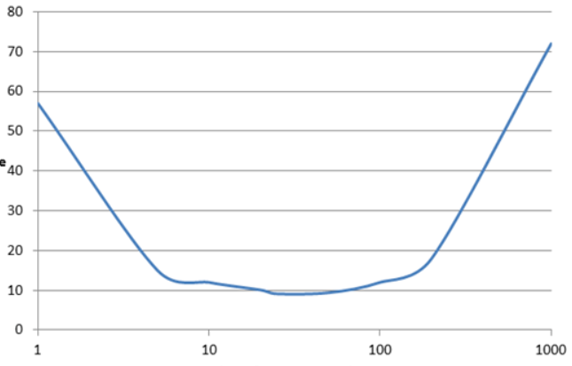

# ------- 基础------

#### #{} 、 ${} 

- ***#{}*** 参数占位符，编译时将 *#{}* 替换成 ***？***（ prepareStatement ）
- ***${}*** 字符串拼接符，有***SQL注入***的风险（ statement）


#### namespace 

MapperXMl 中的  `select|insert|update|delete`  等标签会被解析为 **MappedStatement** 对象


- `Dao` 接口（ `Mapper` 接口）的全限名，就是 xml 映射文件中的 ***namespace*** 属性的值

- `Dao` 接口的方法名，对应 xml 中  `select|insert|update|delete`  标签的 ***id*** 值

  

当调用接口方法时，接口全限名+方法名拼接字符串作为 key 值，可唯一定位一个 `MappedStatement` ，MyBatis 运行时会使用 JDK 动态代理为 Dao 接口生成代理 proxy 对象，代理对象 proxy 会拦截接口方法，转而执行 `MappedStatement` 所代表的 sql，将 sql 执行结果返回。


#### Dao 接口方法能重载吗？

先说结论！！！ ***不可以重载***

相关 issue ：[更正：Dao 接口里的方法可以重载，但是 Mybatis 的 XML 里面的 ID 不允许重复！open in new window](https://github.com/Snailclimb/JavaGuide/issues/1122)。


***Only when***

1. 只有一个无参方法和一个有参方法
2. 多个有参方法时，参数数量必须一致。且使用相同的 `@Param` 

```java
Person queryById();

Person queryById(@Param("id") Long id); // 调用会报错

Person queryById(@Param("id") Long id, @Param("name") String name);
```

```xml
<select id="queryById" resultMap="PersonMap">
    select
      id, name, age, address
    from person
    <where>
        <if test="id != null">
            id = #{id}
        </if>
        <if test="name != null and name != ''">
            name = #{name}
        </if>
    </where>
    limit 1
</select>
```

也就是说，这并不是真正意义上的重载！！！！


#### 分页 ？分页拦截器的原理 ？

1. 结果集分页
2. SQL 分页
3. 拦截 SQL 根据数据库类型添加分页 SQL 语句（插件）


#### 动态 SQL 

逻辑判断和动态拼接 sql 的功能

`if | where | foreach | when | otherwise | choose | set | trim | bind  `  

原理是利用 OGLN 从***参数***中计算表达式的值，根据表达式的动态拼接 SQL


#### SQL 结果映射为 Java Object 

ColumnName 和 FieldName 逐一对应，建立了字段名与属性名的映射关系后，MyBatis 通过***反射***创建对象，同时给对象的属性逐一赋值。

两种方式：

1. resultMap 对应

2. 列别名对应属性名

   


#### 关联查询 

mybatis 的关联查询：

1.  `<ResultMap>` 标签的 `association` 和 `collection` 子标签（***拦截器**、**延迟加载***）
2.  join 关键字（只执行一次 sql）


**问题：**查询出来的记录有 6 条，如何确定主对象有几个？

举例：下面 join 查询出来 6 条记录，一、二列是 Teacher 对象列，第三列为 Student 对象列。

| t_id | t_name  | s_id |
| ---- | ------- | ---- |
| 1    | teacher | 38   |
| 1    | teacher | 39   |
| 1    | teacher | 40   |
| 1    | teacher | 41   |
| 1    | teacher | 42   |
| 1    | teacher | 43   |

MyBatis 去重复处理后，结果为 1 个老师 6 个学生，而不是 6 个老师 6 个学生。

**答：** 依据 `<ResultMap>` 标签的 `id` 子标签，MyBatis 根据 `<id>` 列值来完成 100 条记录的去重复功能。关联对象也是据此原理。

一般情况下，只有主对象会有重复记录，关联对象一般不会重复。


#### 延迟加载 

支持，使用的 `<ResultMap>` 标签的 `association` 和 `collection` 子标签。


两个设置项和延迟加载有关：

1. *lazyLoadingEnable* （开启延迟加载）
2. *agressiveLazyLoading* （设为`false`则是按需加载）


**实现原理：**使用 `CGLIB` 创建目标对象的代理对象，当调用目标方法时，进入拦截器方法。

1. 调用 `a.getB().getName()` ，拦截器 `invoke()` 方法发现 `a.getB()` 是 null 值

   

2. 那么就会单独发送事先保存好的查询关联 B 对象的 sql，把 B 查询上来

   

3. 然后调用 a.setB(b)，于是 a 的对象 b 属性就有值了，接着完成 `a.getB().getName()` 方法的调用


#### 不同的 xml 映射文件，id 是否可以重复？

可以重复，Mybatis 底层将 ***namespace+id*** 是作为 ***Map<String, MappedStatement>*** 的 key 使用，正常来说 namespace 不会相同，相同当我没说。而且 namespace 不是必须的


#### xml 文件和 Mybatis 内部数据结构的映射关系？

xml 文件中所有的配置信息都封装在 Configuration 对象内部。


例如，`<parameterMap>` 标签会被解析成 ParameterMap对象，其子标签会被解析成 ParameterMapping 对象。

同理，`<resultMap>` 标签会被解析成 resultMap 对象，其子标签会被解析成 ResultMapping 对象。

增删改查标签 `<insert>\<delete>\<update>\<select>` 都会被解析成 MappedStatement 对象。


#### Mybatis 半自动 ORM 

Hibernate 是全自动 ORM 框架，在查询关联对象或者关联集合对象时，可根据**对象关系模型**直接获取。

而 mybatis 在这两种情况，需要手写 SQL ，所以被称为半自动 ORM 框架。


# 批量插入

1）少量插入（20~50条）

~~~xml
<insert id="batchInsert" parameterType="java.util.List">
    insert into USER (id, name) values
    <foreach collection="list" item="item" index="index" separator=",">
        (#{item.id}, #{item.name})
    </foreach>
</insert>
~~~

foreach的values的增长与所需的解析时间，是呈指数型增长的



一般按经验来说，一次性插**20~50行**数量是比较合适的


#### Mybatis 推荐方法

http://www.mybatis.org/mybatis-dynamic-sql/docs/insert.html 中 Batch Insert Support

```java
SqlSession session = sqlSessionFactory.openSession(ExecutorType.BATCH);
try {
    SimpleTableMapper mapper = session.getMapper(SimpleTableMapper.class);
    List<SimpleTableRecord> records = getRecordsToInsert(); // not shown
 
    BatchInsert<SimpleTableRecord> batchInsert = insert(records)
            .into(simpleTable)
            .map(id).toProperty("id")
            .map(firstName).toProperty("firstName")
            .map(lastName).toProperty("lastName")
            .map(birthDate).toProperty("birthDate")
            .map(employed).toProperty("employed")
            .map(occupation).toProperty("occupation")
            .build()
            .render(RenderingStrategy.MYBATIS3);
 
    batchInsert.insertStatements().stream().forEach(mapper::insert);
 
    session.commit();
} finally {
    session.close();
}
```


即基本思想是将 MyBatis session 的 executor type 设为 Batch ，然后多次执行插入语句。就类似于JDBC的下面语句一样。


```java
Connection connection = DriverManager.getConnection("jdbc:mysql://127.0.0.1:3306/mydb?useUnicode=true&characterEncoding=UTF-8&useServerPrepStmts=false&rewriteBatchedStatements=true","root","root");
connection.setAutoCommit(false);
PreparedStatement ps = connection.prepareStatement(
        "insert into tb_user (name) values(?)");
for (int i = 0; i < stuNum; i++) {
    ps.setString(1,name);
    ps.addBatch();
}
ps.executeBatch();
connection.commit();
connection.close();
```


经过试验，使用了 ExecutorType.BATCH 的插入方式，性能显著提升，不到 2s 便能全部插入完成。

https://cloud.tencent.com/developer/article/2277239


# 缓存

一级缓存默认开启，不能关闭，存在于 `SqlSession` 的生命周期中。Spring和MyBatis整合时，每次查询之后都会关闭sqlsession，关闭之后数据被清空。所以MyBatis和Spring整合之后，一级缓存是没有意义的。

在同一个 SqlSession 中查询时，MyBatis 会把执行的方法和参数通过算法生成缓存的键值，将键值和查询结果存入一个Map对象中。


**二级缓存**存在于 `SqlSessionFactory` 的生命周期中，多个SqlSession去操作同一个Mapper的sql语句，多个SqlSession可以共用缓存


**开启：** 

MyBatis 的全局配置 settings 中的参数 cacheEnabled，默认值是 true ，默认开启。

二级缓存与命名空间绑定的，需要在 xml 映射文件中通过 <cache/> 配置。

- SELECT 语句会被缓存。

- INSERT 、UPDATE 、DELETE 语句会刷新缓存。

  > 提示：二级缓存是事务性的。这意味着，当 SqlSession 完成并提交时，或是完成并回滚，但没有执行 flushCache=true 的 insert/delete/update 语句时，缓存会获得更新。

- 缓存淘汰使用 LRU

- 缓存不会定时进行刷新（也就是说，没有刷新间隔）。

- 缓存会存储集合或对象（无论查询方法返回什么类型的值）的1024 个引用。

- 缓存会被视为read/write（可读／可写）的，意味着对象检索不是共享的，而且可以安全地被调用者修改，而不干扰其他调用者或线程所做的潜在修改。


# 执行器

三类执行器

1. `SimpleExecutor` - 简单执行器，每当执行一次 update 或者 select 开启一个 statement 对象
2. `ReuseExecutor` - 缓存式的 simpleExecutor
3. `BatchExecutor` - 批处理，只支持 update 不支持 select

**指定 Executor 执行器**

MyBatis 配置文件中，指定默认的 `ExecutorType` 执行器类型

手动给 `DefaultSqlSessionFactory` 的创建 SqlSession 的方法传递 `ExecutorType` 类型参数


# 插件（拦截器 Interceptor）


# 类型转换 TypeHandler

TypeHandler 的作用在于 Java 类型和 JDBC 类型之间的相互转换。


**示例**

实现 TypeHandler  

~~~java
// setParameter 将对象属性经过转换后插入到 PreparedStatement。
void setParameter(PreparedStatement var1, int var2, T var3, JdbcType var4) throws SQLException;

T getResult(ResultSet var1, String var2) throws SQLException;  // 列名

T getResult(ResultSet var1, int var2) throws SQLException;    // 列索引

T getResult(CallableStatement var1, int var2) throws SQLException;  // 存储过程
~~~


或者实现 BaseTypeHandler

~~~java
public abstract void setNonNullParameter(PreparedStatement var1, int var2, T var3, JdbcType var4) throws SQLException;

public abstract T getNullableResult(ResultSet var1, String var2) throws SQLException;

public abstract T getNullableResult(ResultSet var1, int var2) throws SQLException;

public abstract T getNullableResult(CallableStatement var1, int var2) throws SQLException;
~~~


简单建个表

~~~sql
CREATE TABLE student_test
(
    id        VARCHAR2(19 CHAR),
    name      VARCHAR2(8 CHAR),
    age       VARCHAR2(2 CHAR),
    sex       varchar2(2),
    interests varchar2(100 char),
    CONSTRAINT pk_student_test PRIMARY KEY (id)
)
~~~


（1）pojo 自定义类型

~~~java
@Data
@TableName("student_test")
public class Student {

    @TableId("id")
    private String id;

    @TableField("name")
    private String name;

    @TableField("age")
    private String age;

    //SexEnum 自定义枚举，然后使用mybatis本身定义的typehandle
    @TableField("sex")
    private SexEnum sex;

    //interests 是我们的主角，自定义 typehandle 就是为了它
    @TableField("interests")
    private String[] interests;
}
~~~


`SexEnum.java`

~~~java
public enum SexEnum {
    男,
    女
}
~~~

插入数据时，我们赋予 sex = "男" , typehandle 会转换，实际放入数据库的是 0 或 1.

取出时，帮我们又转换成男、女。


（2）StringArrayTypeHandler **实现 BaseTypeHandler**

需要写泛型 BaseTypeHandler<> 泛型的类型就是 java 对象对应属性的类型。

~~~java
public class StringArrayTypeHandler extends BaseTypeHandler<String[]> {

    /**
    * 将 ["唱","跳","rap"] 转换成  "唱,跳,rap"  再放入数据库
    */
    @Override
    public void setNonNullParameter(PreparedStatement ps, int i, String[] parameter, JdbcType jdbcType) throws SQLException {
        StringBuilder builder=new StringBuilder();
        for(String item: parameter){
            builder.append(item).append(",");
        }
        builder.deleteCharAt(builder.length()-1);
        ps.setString(i,builder.toString());
    }
    
    
	/**
    * 将数据库内容 "唱,跳,rap" 转换成 ["唱","跳","rap"] 返回
    */
    @Override
    public String[] getNullableResult(ResultSet rs, String columnName) throws SQLException {
        String result = rs.getString(columnName);
        if(result!=null){
            return result.split(",");
        }else{
            return null;
        }
    }

    @Override
    public String[] getNullableResult(ResultSet rs, int columnIndex) throws SQLException {
        return new String[0];
    }

    @Override
    public String[] getNullableResult(CallableStatement cs, int columnIndex) throws SQLException {
        return new String[0];
    }
}

~~~


（3）**编写Mapper接口**

~~~java
public interface StudentMapper {
    int insertStudent(Student student);
    
    List<Student> all();
}
~~~


（4）**MapperXml文件**

插入的参数处，使用了typeHandler参数

~~~xml
<insert id="insertStudent" parameterType="com.example.demo.model.po.Student">
    insert into student_test(id,name,age,interests,sex)
    values(#{id},#{name},#{age},#{interests,typeHandler=com.example.demo.typehandler.StringArrayTypeHandler},
    #{sex,typeHandler=org.apache.ibatis.type.EnumOrdinalTypeHandler})
</insert>
~~~


查询的 resultMap 中也需要引入

~~~xml
<resultMap id="stuResult" type="com.example.demo.model.po.Student">
    <id column="id" property="id"/>
    <result column="name" property="name"/>
    <result column="age" property="age"/>
    
    //sex 使用 mybatis 本身的 typehandler
    
    <result column="sex" property="sex" typeHandler="org.apache.ibatis.type.EnumOrdinalTypeHandler"/>
    
    
    //interests 使用自定义 typehandler，使用全限定名。如果不适用全限定名需要额外配置
    
    <result column="interests" property="interests" typeHandler="com.example.demo.typehandler.StringArrayTypeHandler"/>
</resultMap>


<select id="all" resultMap="stuResult">
    select * from student_test
</select>
~~~

自定义 typehandler 不显式使用，额外配置：

~~~xml
<mapper resource="TypeHandler/StudentMapper.xml"/>
~~~


（5）controller 测试

~~~java
@RestController
@RequestMapping("/student")
public class StudentController {
    @Resource
    private StudentMapper studentMapper;

    @PostMapping("/insert")
    public void insert(@RequestBody @Validated Student student) {
        studentMapper.insertStudent(student);
    }

    @GetMapping("list")
    public List<Student> list() {
        return studentMapper.all();
    }
}
~~~


**插入时 JSON**

~~~json
{
    "id":"1",
    "name":"太空人",
    "age":"19",
    "sex":"男",
    "interests": ["唱","跳","rap"]
}

{
    "id":"2",
    "name":"宇航员",
    "age":"29",
    "sex":"女",
    "interests": ["唱","跳","rap"]
}
~~~


**数据库**

| id   | name   | age  | sex  | interests |
| ---- | ------ | ---- | ---- | --------- |
| 1    | 太空人 | 19   | 0    | 唱,跳,rap |
| 2    | 宇航员 | 29   | 1    | 唱,跳,rap |


**查询**

~~~json
[
    {
        "id": "1",
        "name": "太空人",
        "age": "19",
        "sex": "男",
        "interests": [
            "唱",
            "跳",
            "rap"
        ]
    },
    {
        "id": "2",
        "name": "宇航员",
        "age": "29",
        "sex": "女",
        "interests": [
            "唱",
            "跳",
            "rap"
        ]
    }
]
~~~

可以看到都帮我们做了转换。


### 枚举类 TypeHandler

- EnumOrdinalTypeHandler
- EnumTypeHandler

都是 MyBatis 内置的处理 Enum 类型属性的类型转换器。


区别在于存入数据库的时候：

- EnumOrdinalTypeHandler 是调用 ordinal() 方法获取索引存储
- EnumTypeHandler 是调用 name() 方法获取名称进行存储

取回的时候也是同样策略的逆过程。


比如我们上面使用了 EnumOrdinalTypeHandler，其对应的枚举类型如下，而数据库存储的 sex 为对应的索引 0 或 1

~~~java
public enum SexEnum {
    FEMALE("女"),MALE("男");
    
    private String sexName;
    
    SexEnum(String sexName){ this.sexName=sexName;}

    public String getSexName() { return sexName;}

    public void setSexName(String sexName) { this.sexName = sexName;}
}
~~~

~~~java
public enum SexEnum {
    男,女;
}
~~~

上面两个 Enum 定义方式都可以。

EnumTypeHandler 就是将值直接存入数据库，不做映射。


# Mapper

每个参数都要制定`@Param("name")`，包括*List*、*Map*等


# XML

## `<select>`

|      属性       |                  描述                   |
| :-------------: | :-------------------------------------: |
|      `id`       |           对应Mapper方法名称            |
| `parameterType` |        参数类型全限定名，可不写         |
|  `resultType`   |    数据返回类型，集合则是集合的泛型     |
|   `resultMap`   |         对外部*resultMap*的引用         |
|  `flushCache`   |        默认*false*，清空二级缓存        |
|   `useCache`    |           默认true，二级缓存            |
|    `timeout`    |                超时时间                 |
|   `fetchSiz`    |                                         |
| `statementType` | STATEMENT，PREPARED（默认） 或 CALLABLE |
| `resultSetType` |                                         |
|  `databaseId`   |                                         |
| `resultOrdered` |                                         |
|  `resultSets`   |                                         |
|  `affectData`   |                                         |

数据渲染成*Map*

1）*@MapKey*注解指定*Map*的*key*取值列

```java
@MapKey("STUID")
Map<String, Map<String, Object>> queryGkxx(@Param("yjfbid") String yjfbid);
```

2）*xml*的*resultType*为*Map*的*Value*泛型

~~~xml
<select id="queryGkxx" resultType="java.util.Map">
 ...
</select>
~~~


## `<insert>`、`<update>`和`<delete>`

```xml
<insert
  id="insertAuthor"
  parameterType="domain.blog.Author"
  flushCache="true"
  statementType="PREPARED"
  keyProperty=""
  keyColumn=""
  useGeneratedKeys=""
  timeout="20">

<update
  id="updateAuthor"
  parameterType="domain.blog.Author"
  flushCache="true"
  statementType="PREPARED"
  timeout="20">

<delete
  id="deleteAuthor"
  parameterType="domain.blog.Author"
  flushCache="true"
  statementType="PREPARED"
  timeout="20">
```

| 属性               | 描述                                                         |
| :----------------- | :----------------------------------------------------------- |
| `id`               |                                                              |
| `parameterType`    |                                                              |
| `flushCache`       |                                                              |
| `timeout`          |                                                              |
| `statementType`    |                                                              |
| `useGeneratedKeys` | (insert、update)这会令 MyBatis 使用 JDBC 的 getGeneratedKeys 方法来取出由数据库内部生成的主键，默认值：false。 |
| `keyProperty`      | (insert、update)指定能够唯一识别对象的属性，MyBatis 会使用 getGeneratedKeys 的返回值或 insert 语句的 <selectKey> 子元素设置它的值，默认值：未设置（`unset`）。如果生成列不止一个，可以用逗号分隔多个属性名称。 |
| `keyColumn`        | (insert、update)设置生成键值在表中的列名，在某些数据库（像 PostgreSQL）中，当主键列不是表中的第一列的时候，是必须设置的。如果生成列不止一个，可以用逗号分隔多个属性名称。 |
| `databaseId`       |                                                              |

数据库支持自动生成主键的字段（比如 MySQL 和 SQL Server），设置 useGeneratedKeys=”true”，然后再把 keyProperty 设置为目标属性

```xml
<insert id="insertAuthor" useGeneratedKeys="true" keyProperty="id">
  insert into Author (username,password,email,bio)
  values (#{username},#{password},#{email},#{bio})
</insert>
```

如果数据库还支持多行插入, 可以传入一个 `Author` 数组或集合，并返回自动生成的主键。

```xml
<insert id="insertAuthor" useGeneratedKeys="true" keyProperty="id">
  insert into Author (username, password, email, bio) values
  <foreach item="item" collection="list" separator=",">
    (#{item.username}, #{item.password}, #{item.email}, #{item.bio})
  </foreach>
</insert>
```


对于不支持自动生成主键列的数据库和可能不支持自动生成主键的 JDBC 驱动，MyBatis 有另外一种方法来生成主键。

这里有一个简单（也很傻）的示例，它可以生成一个随机 ID（不建议实际使用，这里只是为了展示 MyBatis 处理问题的灵活性和宽容度）：

```xml
<insert id="insertAuthor">
  <selectKey keyProperty="id" resultType="int" order="BEFORE">
    select CAST(RANDOM()*1000000 as INTEGER) a from SYSIBM.SYSDUMMY1
  </selectKey>
  insert into Author
    (id, username, password, email,bio, favourite_section)
  values
    (#{id}, #{username}, #{password}, #{email}, #{bio}, #{favouriteSection,jdbcType=VARCHAR})
</insert>
```

在上面的示例中，首先会运行 selectKey 元素中的语句，并设置 Author 的 id，然后才会调用插入语句。这样就实现了数据库自动生成主键类似的行为，同时保持了 Java 代码的简洁。

selectKey 元素描述如下：

```xml
<selectKey
  keyProperty="id"
  resultType="int"
  order="BEFORE"
  statementType="PREPARED">
```

| 属性            | 描述                                                         |
| :-------------- | :----------------------------------------------------------- |
| `keyProperty`   | `selectKey` 语句结果应该被设置到的目标属性。如果生成列不止一个，可以用逗号分隔多个属性名称。 |
| `keyColumn`     | 返回结果集中生成列属性的列名。如果生成列不止一个，可以用逗号分隔多个属性名称。 |
| `resultType`    | 结果的类型。通常 MyBatis 可以推断出来，但是为了更加准确，写上也不会有什么问题。MyBatis 允许将任何简单类型用作主键的类型，包括字符串。如果生成列不止一个，则可以使用包含期望属性的 Object 或 Map。 |
| `order`         | 可以设置为 `BEFORE` 或 `AFTER`。如果设置为 `BEFORE`，那么它首先会生成主键，设置 `keyProperty` 再执行插入语句。如果设置为 `AFTER`，那么先执行插入语句，然后是 `selectKey` 中的语句 - 这和 Oracle 数据库的行为相似，在插入语句内部可能有嵌入索引调用。 |
| `statementType` | 和前面一样，MyBatis 支持 `STATEMENT`，`PREPARED` 和 `CALLABLE` 类型的映射语句，分别代表 `Statement`, `PreparedStatement` 和 `CallableStatement` 类型。 |


## `<resultMap>`

| 属性 | 描述                                 |
| ---- | ------------------------------------ |
| id   | 标识符，用于和`<select>`语句建立映射 |
| type | 指定Java对象类型，接受数据           |

| 子标签          |                              |
| --------------- | ---------------------------- |
| `<id>`          | 绑定主键和*Java*对象的链接   |
| `<result>`      | 绑定其他列和*Java*对象的链接 |
| `<association>` | 绑定嵌套对象                 |
| `<collection>`  | 绑定集合                     |

两个子标签有着共同的属性

| 属性     |                |
| -------- | -------------- |
| property | Java对象的名称 |
| column   | 数据表的列名称 |
|          |                |


## `<typeAlias>`

```xml
<!-- mybatis-config.xml 中 -->
<typeAlias type="com.someapp.model.User" alias="User"/>

<!-- SQL 映射 XML 中 -->
<select id="selectUsers" resultType="User">
  select id, username, hashedPassword
  from some_table
  where id = #{id}
</select>
```


## 比较符

在*xml*文件中不能直接使用大于小于符号，有两种替换写法

| 原始符号 | 替换符号 |
| :------: | :------: |
|   &lt;   |  `&lt;`  |
|  `&lt;=  | `&lt;=`  |
|   &gt;   |  `&gt;`  |
|   &gt;   | `&gt;=`  |
|  &amp;   | `&amp;`  |
|  &apos;  | `&apos;` |
|  &quto;  | `&quto;` |

| 原始符号 | 替换符号         |
| -------- | ---------------- |
| >=       | <![CDATA[ >= ]]> |


## 动态标签

### `<if>`

一般用于对传入参数进行判空等操作，进行条件的拼接

~~~xml
<select id="count" resultType="java.lang.Integer">
	select count(*) from user 
    where 
    <if test="id != null">
        id = #{id}
    </if> 
    and username = 'xiaoming'
</select>
~~~

> 但是注意不是所有的*Java*类型都是这样的判断方式，假设*id*是*String*类型，那么通常除了判断为*null*之外还要判断它是否为空字符串，即`id != ''`。
>
> 谨记*Date*不可进行此判断。


### `<where>`

对应*SQL*的*WHERE*关键字，像在<if>中的示例如果*id*为*null*了那么将会报错，因为*WHERE*后面接了一个*and*。

使用<where>可以避免

- 至少有一个子标签的条件返回 SQL 子句的情况下才去插入 WHERE 关键字

- 若子句的开头为 AND、OR，<where> 标签也会将它们去除


~~~xml
<select id="count" resultType="java.lang.Integer">
	select count(*) from user
	<where>
		<if test="id != null">
            id = #{id}
        </if>
		and username = 'xiaoming'
    </where>
 </select>
~~~


### `<trim>`

增加或者去除*SQL*的前缀和后缀

| 属性            | 描述     |
| --------------- | -------- |
| prefix          | 增加前缀 |
| suffix          | 增加后缀 |
| prefixOverrides | 去除前缀 |
| suffixOverrides | 去除后缀 |

~~~xml
<select id="count" result="java.lang.Integer">
	select count(*) from user
	<trim prefix ="where" prefixOverrides="and | or">
		<if test="id != null">
            id = #{id}
        </if>
		<if test="username != null"> 
            and username = #{username}
        </if>
	</trim>
</select>
~~~


### `<set>`

子标签有一个不为空，会在前面加上 set，自动去除尾部多余的逗号

~~~xml
<update id="UPDATE" parameterType="User">
	update user
    <set>
    	<if test="name != null">
            name = #{name},
        </if> 
        <if test="password != null">
            password = #{password},
        </if> 
        <if test="age != null">
            age = #{age},
        </if> 
   	</set>
</update>
~~~


### `<foreach>`

当参数是集合、数组或者是一个*Map*时，需要迭代参数

| 属性       | 描述                                                         |
| ---------- | ------------------------------------------------------------ |
| index      | 下标                                                         |
| item       | 每个元素名称                                                 |
| open       | 该语句以什么开始                                             |
| close      | 该语句以什么结尾                                             |
| separator  | 在每次迭代之间以什么作为分隔符                               |
| collection | 参数类型，可做默认匹配。也可以是指定`@Param`的名称，将会取消默认类型匹配 |

1）集合类型

~~~xml
<select id="count" resultType="java.lang.Integer">
	select count(*) from user where id in
  	<foreach collection="list" item="item" index="index" open="(" separator="," close=")">
        #{item}
  	</foreach>
</select>
~~~

2）数组

~~~xml
<select id="count" resultType="java.lang.Integer">
	select * from user where id inarray
  	<foreach collection="array" item="item" index="index" open="(" separator="," close=")">
        #{item}
  	</foreach>
</select>
~~~

3）如果参数类型为 Map，则参数类型为 Map 的 Key


### `<choose>`

类似*Switch*

~~~xml
<select id="count" resultType="Blog">
	select count(*) from user
  	<choose>
    	<when test="id != null">
      		and id = #{id}
    	</when>
    	<when test="username != null">
      		and username = #{username}
    	</when>
    	<otherwise>
      		and age = 18
    	</otherwise>
  	</choose>
</select>
~~~


### `<sql>`

相当于 Java 中的代码提重，需要配合 include 使用

~~~xml
<sql id="table"> user </sql>
~~~


### `<include>`

相当于 Java 中的方法调用，*refid*是<sql>标签中的*id*值

~~~xml
<select id="count" resultType="java.lang.Integer">
	select count(*) from <include refid="table" />
</select>
~~~


### `<bind>`

对参数进行再加工

~~~xml
<select id="count" resultType="java.lang.Integer">
	select count(*) from user
	<where>
		<if test="name != null">
			<bind name="name" value="'%' + name + '%'"/>
			name = #{name}
		</if>
</select>
~~~


https://java.bejson.com/generator/


