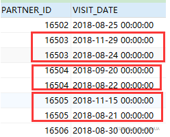
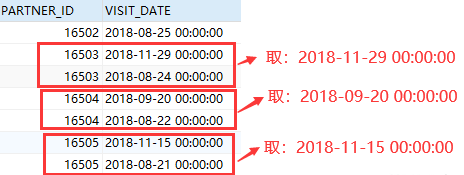

### 分页

oracle 的分页需要额外用 <font color='red'>ROWNUM</font> 列，数据库特性自带。

~~~sql
        SELECT s.*
        FROM (SELECT ROWNUM rn,t.*
              FROM student t
              where ROWNUM <= #{edge}
             ) s
        WHERE s.rn > #{offset}
~~~

先用一次子查询获取 row num 列，并且获取了 0-edge 行数据

最外查询设置偏移量 offset

那么返回的数据行只有 0ffset - edge


### 分组排序

假设审核日志，获取某个东西审核日志最新的一条


①原表效果：**外表主键，时间（VISIT_DATE）不同**

 


②分组排序后取第一条的效果：**【实现对编号去重，且取访问时间最新的一条数据】**




~~~sql
SELECT * 
FROM(
    SELECT ROW_NUMBER()over(PARTITION by 分组列 ORDER BY 排序列 DESC) as RN[,VI.分组列,VI.排序列]
    FROM ~tableName~ VI
) dual  WHERE RN=1
~~~


### 字符

~~~sql
# 查看oracle server端字符集
select userenv('language') from dual;

# 查看表的字符集
select distinct(userenv('language')) from tableName;
~~~

如果显示 **SIMPLIFIED CHINESE_CHINA.ZHS16GBK** ，一个汉字占用两个字节

如果显示 **SIMPLIFIED CHINESE_CHINA.AL32UTF8**， 一个汉字占用三个字节

可以用以下语句查询一个汉字占用的字节长度

```sql
select lengthb('你') from dual;
```


# Group By

## （2）合计、小计

有时会合计分组的数据，合计和小计

~~~sql
GROUP BY ROLLUP (t2.ND, t2.bm)
~~~

只要合计

~~~sql
GROUP BY ROLLUP ((t2.ND, t2.bm))
~~~


# NVL

判空

```sql
NVL(expression, value_if_null)
NVL2(expression, value_if_not_null, value_if_null)
```


# Decode

Oracle 的 `DECODE` 函数是用于根据给定的表达式和一系列比较值进行条件判断并返回对应的结果。在你的代码中，使用了 `bjfp.cprs = bjfp.fprs` 作为表达式，这将返回一个布尔值（TRUE 或 FALSE）。然后，你试图将这个布尔值作为 `DECODE` 函数的表达式，这是不正确的。`DECODE` 函数的表达式应该是一个具体的值或列。

如果你想要将 `bjfp.cprs` 和 `bjfp.fprs` 的比较结果转换为 1 或 0，你可以使用 `CASE` 表达式来实现：

```sql
SELECT CASE WHEN bjfp.cprs = bjfp.fprs THEN 1 ELSE 0 END AS comparison_result
FROM bjfp;
```


# LISTAGG（分组聚合）

```sql
SELECT
  department,
  LISTAGG(employee, ', ') WITHIN GROUP (ORDER BY employee) AS employees
FROM
  employees_table
GROUP BY
  department;
```

将每个部门的员工姓名连接成一个字符串，并使用逗号和空格作为分隔符。WITHIN GROUP子句用于指定连接的顺序。


# INSTR（子串位置）

返回子串在字符串出现的位置

~~~sql
SELECT instr(str, subStr) FROM dual
~~~


# Single-Row Functions（单行函数）

单行函数为查询的表或视图的每一行返回单个结果行。这些函数可以出现在SELECT列、WHERE子句、START WITH和CONNECT BY子句以及HAVING子句中。


## 数字函数

数值函数接受数值输入并返回数值。大多数数值函数返回精确到38位十进制数字的NUMBER值。超越函数COS、COSH、EXP、LN、LOG、SIN、SINH、SQRT、TAN、TANH精确到36位十进制数字。超越函数ACOS、ASIN、ATAN和ATAN2精确到30位十进制数字。数值函数为:

- [ABS](https://docs.oracle.com/en/database/oracle/oracle-database/18/sqlrf/ABS.html#GUID-D8D3489A-44EA-4FEC-A6F0-B5E312FFC231)

- [ACOS](https://docs.oracle.com/en/database/oracle/oracle-database/18/sqlrf/ACOS.html#GUID-B4C70DD5-B908-4130-975A-6CFD5C1AC1F9)

- [ASIN](https://docs.oracle.com/en/database/oracle/oracle-database/18/sqlrf/ASIN.html#GUID-809ACB4E-9FDA-4943-B234-DDB32522A523)

- [ATAN](https://docs.oracle.com/en/database/oracle/oracle-database/18/sqlrf/ATAN.html#GUID-12E8F1AA-54D0-4A19-8648-27094946C588)

- [ATAN2](https://docs.oracle.com/en/database/oracle/oracle-database/18/sqlrf/ATAN2.html#GUID-D34E671B-F3C0-4390-A2D8-ABB702B4B5D3)

- [BITAND](https://docs.oracle.com/en/database/oracle/oracle-database/18/sqlrf/BITAND.html#GUID-EADBED75-6AC5-4FBE-991A-E3B4D260F73B)

- [CEIL](https://docs.oracle.com/en/database/oracle/oracle-database/18/sqlrf/CEIL.html#GUID-6DCC9AFB-9B80-4C27-AF63-5AA3B1E43660) -向上取整

- [COS](https://docs.oracle.com/en/database/oracle/oracle-database/18/sqlrf/COS.html#GUID-C008F067-C6DC-4C13-9B7F-5A385415363A)

- [COSH](https://docs.oracle.com/en/database/oracle/oracle-database/18/sqlrf/COSH.html#GUID-A48CD625-5238-4259-9A1F-0FDBFD19841E)

- [EXP](https://docs.oracle.com/en/database/oracle/oracle-database/18/sqlrf/EXP.html#GUID-414FB4AE-03B5-41AD-AE33-E3755EFED0A0)

- [FLOOR](https://docs.oracle.com/en/database/oracle/oracle-database/18/sqlrf/FLOOR.html#GUID-67F61AC7-C097-4397-A122-213157BF584F)- 向下取整

- [LN](https://docs.oracle.com/en/database/oracle/oracle-database/18/sqlrf/LN.html#GUID-DCC9EDAA-D308-4145-8E05-8D06A5EF5F6F)

- [LOG](https://docs.oracle.com/en/database/oracle/oracle-database/18/sqlrf/LOG.html#GUID-3739F356-A4A0-4D0D-A4EB-9725ACA05CD1)

- [MOD](https://docs.oracle.com/en/database/oracle/oracle-database/18/sqlrf/MOD.html#GUID-E12A3928-2C50-45B0-B8C3-82432C751B8C) - 返回两数相除的余数

- [NANVL](https://docs.oracle.com/en/database/oracle/oracle-database/18/sqlrf/NANVL.html#GUID-3C094646-2A70-41F5-984C-9BC0FB31494A) - 处理NVN（非法数字）

- [POWER](https://docs.oracle.com/en/database/oracle/oracle-database/18/sqlrf/POWER.html#GUID-D280B322-D2C3-46D0-8076-C88F16CBEDC2) - 将一个数指定次方

  ```sql
  SELECT POWER(3, 2) FROM DUAL;
  -- 9
  ```

- [REMAINDER](https://docs.oracle.com/en/database/oracle/oracle-database/18/sqlrf/REMAINDER.html#GUID-430D4C4A-5779-4EBB-90C5-4D7CA7E73556) - 返回两数相除的余数

  ```sql
  SELECT REMAINDER(10, 3) FROM dual;
  -- 结果: 1
  ```

- [ROUND (number)](https://docs.oracle.com/en/database/oracle/oracle-database/18/sqlrf/ROUND-number.html#GUID-849F6C45-0D72-4464-9C0F-8B6822BA85E1) - 将一个数值四舍五入到指定的小数位数

  ~~~sql
  SELECT ROUND(3.14159, 2) FROM dual;
  -- 结果: 3.14
  SELECT ROUND(3.14159) FROM dual;
  -- 结果: 3
  SELECT ROUND(6.78, -1) FROM dual;
  -- 结果: 10
  SELECT ROUND(6.78, 0) FROM dual;
  -- 结果: 7
  
  ~~~

- [SIGN](https://docs.oracle.com/en/database/oracle/oracle-database/18/sqlrf/SIGN.html#GUID-08B75521-B5F5-4658-A005-4B4441C82945) - 接受一个数字作为参数，

  - 如果数字小于0，则`SIGN`函数返回-1
  - 如果数字等于0，则`SIGN`函数返回0
  - 如果数字大于0，则`SIGN`函数返回1

  ~~~sql
  SELECT SIGN(-23) FROM dual;
  -- 结果: -1
  SELECT SIGN(0) FROM dual;
  -- 结果: 0
  SELECT SIGN(23) FROM dual;
  -- 结果: 1
  
  ~~~

- [SIN](https://docs.oracle.com/en/database/oracle/oracle-database/18/sqlrf/SIN.html#GUID-2AF4895F-5D23-4165-89D5-B1D404ED99BF)

- [SINH](https://docs.oracle.com/en/database/oracle/oracle-database/18/sqlrf/SINH.html#GUID-1EB8626B-4D84-4EAD-BD23-1A97F186FD4A)

- [SQRT](https://docs.oracle.com/en/database/oracle/oracle-database/18/sqlrf/SQRT.html#GUID-E28C0B65-AAD8-4077-A82E-2FB4CD261CCA)

- [TAN](https://docs.oracle.com/en/database/oracle/oracle-database/18/sqlrf/TAN.html#GUID-473E2008-5951-4FC8-A356-14D3D085B8AA)

- [TANH](https://docs.oracle.com/en/database/oracle/oracle-database/18/sqlrf/TANH.html#GUID-8DD0B75F-1BDB-4E41-8C6D-FB5B2908AF80)

- [TRUNC (number)](https://docs.oracle.com/en/database/oracle/oracle-database/18/sqlrf/TRUNC-number.html#GUID-911AE7FE-E04A-471D-8B0E-9C50EBEFE07D)- 用于截断日期或数字的值。它接受一个日期或数字作为参数，并将其截断到指定的单位。

  （1）日期值

  ```sql
  SELECT TRUNC(SYSDATE, 'MM') result FROM dual;
  -- 结果: 本月的第一天
  
  SELECT TRUNC(SYSDATE, 'Q') result FROM dual;
  -- 结果: 本季度的第一天
  
  SELECT TRUNC(TO_DATE('04-Aug-2017 15:35:32', 'DD-Mon-YYYY HH24:MI:SS')) result FROM dual;
  -- 结果: 日期被截断到午夜
  ```

  - `'CC'`：截断到世纪的开始日期。
  - `'YYYY'`：截断到年份的开始日期。
  - `'YYY'`：截断到年份的开始日期，忽略世纪。
  - `'YY'`：截断到年份的开始日期，忽略世纪和年。
  - `'Y'`：截断到年份的开始日期，忽略世纪、年和月。
  - `'Q'`：截断到季度的开始日期。
  - `'MONTH'`：截断到月份的开始日期。
  - `'MON'`：截断到月份的开始日期，返回缩写的月份名称。
  - `'MM'`：截断到月份的开始日期。
  - `'W'`：截断到一周的开始日期。
  - `'IW'`：截断到ISO标准的一周的开始日期。
  - `'D'`：截断到一天的开始日期。
  - `'DDD'`：截断到一年中的第几天的开始日期。
  - `'DAY'`：截断到一周中的第几天的开始日期。
  - `'DY'`：截断到一周中的第几天的开始日期，返回缩写的星期几名称。

  （2）数字

  ```sql
  SELECT TRUNC(15.79, 1) "Truncate" FROM dual;
  -- 结果: 15.7
  
  SELECT TRUNC(15.79, -1) "Truncate" FROM dual;
  -- 结果: 10
  ```

- [WIDTH_BUCKET](https://docs.oracle.com/en/database/oracle/oracle-database/18/sqlrf/WIDTH_BUCKET.html#GUID-5E9058E5-A91F-45ED-A90D-E21355D19A88) - 这个函数通常用于创建等宽直方图，以便对数据进行分组或分析

  根据输入值在指定范围内的位置，返回相应的桶号

  ~~~sql
  WIDTH_BUCKET(expr, min_value, max_value, num_buckets)
  ~~~

  - `expr`：输入值
  - `min_value`和`max_value`：
  - `num_buckets`：解析为指定桶的数量的常量表达式。这个表达式必须求值为正整数。

  `WIDTH_BUCKET`函数的工作原理如下：

  1. 首先，函数计算出每个桶的宽度。宽度的计算方式是将范围的大小（`max_value - min_value`）除以桶的数量（`num_buckets`）。
  2. 然后，函数将输入值减去范围下限（`min_value`），并将结果除以桶的宽度。这将给出一个相对于范围的位置，表示输入值在范围内的位置。
  3. 最后，函数将这个相对位置向上取整，得到桶号。如果相对位置小于等于0，函数返回0，表示下溢桶。如果相对位置大于等于桶的数量，函数返回`num_buckets`+1，表示上溢桶。否则，函数返回相对位置的整数部分作为桶号。

  示例：

  ```sql
  SELECT WIDTH_BUCKET(7, 1, 12, 3) FROM DUAL;
  
  WIDTH_BUCKET(7, 1, 12, 3)
  ------------------------
                         2
  ```

  在这个例子中，我们使用`WIDTH_BUCKET`函数将值7分配到1到12的范围内，分为3个桶。计算过程如下：

  1. 桶的宽度为`(12 - 1) / 3 = 3.6667`
  2. 相对位置为`(7 - 1) / 3.6667 = 1.7143`
  3. 向上取整得到桶号2。

  因此，函数返回2，表示值7位于第2个桶中


## 字符函数

### 返回字符值

如果输入参数是CHAR或VARCHAR2，则返回的值是VARCHAR2；如果输入参数为NCHAR或NVARCHAR2，则返回值为NVARCHAR2。

函数返回的值的长度受返回数据类型的最大长度的限制。对于返回CHAR或VARCHAR2的函数，如果返回值的长度超过限制，则Oracle数据库将其截断并返回结果而不显示错误消息；对于返回CLOB值的函数，如果返回值的长度超过限制，则Oracle抛出错误并不返回数据。

返回字符值的字符函数有:

- [CHR](https://docs.oracle.com/en/database/oracle/oracle-database/18/sqlrf/CHR.html#GUID-35FEE007-D49C-4562-A904-041186AC8928) - 输入数字，返回对应字符集的字符（如：ASCALL字符集，输入65返回A）

- [CONCAT](https://docs.oracle.com/en/database/oracle/oracle-database/18/sqlrf/CONCAT.html#GUID-D8723EA5-C93A-45C3-83FB-1F3D2A4CEAF2)

- [INITCAP](https://docs.oracle.com/en/database/oracle/oracle-database/18/sqlrf/INITCAP.html#GUID-9FE9E0EE-D6B6-4C2C-BDEF-4FF4E1314560) - 将单词每个首字母变成大写

- [LOWER](https://docs.oracle.com/en/database/oracle/oracle-database/18/sqlrf/LOWER.html#GUID-C8682D4C-9BED-48AC-B73A-1D70BF307F48)

- [LPAD](https://docs.oracle.com/en/database/oracle/oracle-database/18/sqlrf/LPAD.html#GUID-0C27B59A-A6CF-43D3-BF4B-07A3D0F2CE20)

  在字符串的左侧填充指定的字符或字符序列，使其达到指定的长度

  ```
  LPAD(源字符串, 目标长度 [, 填充字符串]);
  ```

  - `源字符串`是要填充的字符串。
  - `目标长度`是要填充到的长度。
  - `填充字符串`是可选参数，用于指定填充时使用的字符或字符序列。如果未指定，则默认使用一个空格。

  如果`目标长度`小于`源字符串`的长度，则LPAD()函数会将`源字符串`截断为`目标长度`而不进行填充。

- [LTRIM](https://docs.oracle.com/en/database/oracle/oracle-database/18/sqlrf/LTRIM.html#GUID-81B3D53C-0BBC-4485-B057-C8012CD6E40F)

  从字符串的左侧删除指定的字符或字符序列

  ```
  LTRIM(源字符串 [, 要删除的字符]);
  ```

  - `源字符串`是要进行操作的字符串。
  - `要删除的字符`是可选参数，用于指定要从左侧删除的字符或字符序列。如果未指定，则默认删除空格。

  LTRIM()函数会从`源字符串`的左侧开始删除指定的字符或字符序列，直到遇到一个不匹配的字符为止。

- [NCHR](https://docs.oracle.com/en/database/oracle/oracle-database/18/sqlrf/NCHR.html#GUID-3A1BDD54-6C0B-4067-99C5-A439C0F8D561)

- [NLS_INITCAP](https://docs.oracle.com/en/database/oracle/oracle-database/18/sqlrf/NLS_INITCAP.html#GUID-42C1581B-B5AA-4D4C-A489-BC5B38A754FD)

- [NLS_LOWER](https://docs.oracle.com/en/database/oracle/oracle-database/18/sqlrf/NLS_LOWER.html#GUID-96944213-377E-461C-9F02-2DC4EC2B1649)

- [NLS_UPPER](https://docs.oracle.com/en/database/oracle/oracle-database/18/sqlrf/NLS_UPPER.html#GUID-91D6302F-4DE2-49FA-8837-D46D3FD58DF8)

- [NLSSORT](https://docs.oracle.com/en/database/oracle/oracle-database/18/sqlrf/NLSSORT.html#GUID-781C6FE8-0924-4617-AECB-EE40DE45096D)

- [REGEXP_REPLACE](https://docs.oracle.com/en/database/oracle/oracle-database/18/sqlrf/REGEXP_REPLACE.html#GUID-EA80A33C-441A-4692-A959-273B5A224490)

  高级的替换函数，用于使用正则表达式模式替换字符串中匹配的字符序列

  ```
  REGEXP_REPLACE(源字符串, 正则表达式模式 [, 替换字符串 [, 开始位置 [, 第n次出现 [, 匹配参数 ] ] ] ] )
  ```

  - `源字符串`是要进行操作的字符串。
  - `正则表达式模式`是用于匹配字符串的模式。
  - `替换字符串`是要替换匹配的字符串的字符串。
  - `开始位置`是可选参数，用于指定开始搜索的位置。如果未指定，则默认从字符串的起始位置开始搜索。
  - `第n次出现`是可选参数，用于指定要替换的模式的第n次出现。如果未指定，则默认替换所有匹配的模式。
  - `匹配参数`是可选参数，用于修改REGEXP_REPLACE函数的匹配行为。

  REGEXP_REPLACE()函数返回一个替换了匹配模式的字符串。

  示例：

  ```sql
  -- 将字符串中的所有数字替换为 'X'
  SELECT REGEXP_REPLACE('abc123def456', '[0-9]', 'X') FROM DUAL;
  -- 输出：'abcXXXdefXXX'
  
  -- 将字符串中的第一个元音字母替换为 'Z'
  SELECT REGEXP_REPLACE('TechOnTheNet', '[aeiou]', 'Z', 1, 1) FROM DUAL;
  -- 输出：'TzchOnTheNet'
  
  -- 查询特定列不为数值的数据
  SELECT * FROM DUAL WHERE regexp_replace(列名,'^[-\+]?\d+(\.\d+)?$','') is not null
  ```

- [REGEXP_SUBSTR](https://docs.oracle.com/en/database/oracle/oracle-database/18/sqlrf/REGEXP_SUBSTR.html#GUID-2903904D-455F-4839-A8B2-1731EF4BD099)

  基于正则表达式模式从字符串中提取子字符串

  ```
  REGEXP_SUBSTR(源字符串, 正则表达式模式 [, 开始位置 [, 第n次出现 [, 匹配参数 [, 子表达式 ] ] ] ] )
  ```

  - `源字符串`是要进行操作的字符串。
  - `正则表达式模式`是用于匹配字符串的模式。
  - `开始位置`是可选参数，用于指定开始搜索的位置。如果未指定，则默认从字符串的起始位置开始搜索。
  - `第n次出现`是可选参数，用于指定要提取的模式的第n次出现。如果未指定，则默认提取第一个匹配的模式。
  - `匹配参数`是可选参数，用于修改REGEXP_SUBSTR函数的匹配行为。
  - `子表达式`是可选参数，用于指定要提取的子匹配模式。

  `REGEXP_SUBSTR()`函数返回一个字符串值，该值是匹配正则表达式模式的子字符串。

  示例：

  ```sql
  -- 提取字符串中的第一个元音字母
  SELECT REGEXP_SUBSTR('TechOnTheNet', '[aeiou]', 1, 1, 'i') FROM DUAL;
  -- 输出：'e'
  
  -- 提取字符串中的第二个元音字母
  SELECT REGEXP_SUBSTR('TechOnTheNet', '[aeiou]', 1, 2, 'i') FROM DUAL;
  -- 输出：'O'
  
  -- 提取URL中的域名部分
  SELECT REGEXP_SUBSTR('http://www.oracle.com/products', 'http://([[:alnum:]]+\.?){3,4}/?') FROM DUAL;
  -- 输出：'http://www.oracle.com/'
  ```

- [REPLACE](https://docs.oracle.com/en/database/oracle/oracle-database/18/sqlrf/REPLACE.html#GUID-1A79BDDF-2D3B-4AD4-98E7-985B2E59DA6B)

  将字符串中的所有指定子字符串替换为另一个字符串

  ```
  REPLACE(源字符串, 要替换的子字符串 [, 替换字符串])
  ```

  - `源字符串`是要进行操作的字符串。
  - `要替换的子字符串`是要在源字符串中替换的子字符串。
  - `替换字符串`是可选参数，用于指定替换子字符串的字符串。如果未指定，则默认将子字符串替换为空字符串。

- [RPAD](https://docs.oracle.com/en/database/oracle/oracle-database/18/sqlrf/RPAD.html#GUID-064CFCAE-5902-49F9-800E-0AF311AEF595) - 效果和LPAD一样，但是在右边填充

- [RTRIM](https://docs.oracle.com/en/database/oracle/oracle-database/18/sqlrf/RTRIM.html#GUID-95A7DAFB-F7AB-48F4-BE24-64B3C7A840AA) - 效果和LTRIM一样，但是在右边删除

- [SOUNDEX](https://docs.oracle.com/en/database/oracle/oracle-database/18/sqlrf/SOUNDEX.html#GUID-9C43625B-70CA-4B43-AE22-5EC2A02192F8)

- [SUBSTR](https://docs.oracle.com/en/database/oracle/oracle-database/18/sqlrf/SUBSTR.html#GUID-C8A20B57-C647-4649-A379-8651AA97187E)

  ```sql
  SUBSTR( str, start_position [, substring_length] );
  ```

  - `str`是要提取子字符串的源字符串
  - `start_position`是开始提取的位置
  - `substring_length`是要提取的子字符串的长度（可选）

  示例：

  ```sql
  SELECT SUBSTR('Hello, World!', 8, 5) AS result FROM dual;
  -- 'World!'
  
  SELECT SUBSTR('Hello, World!', -6) AS result FROM dual;
  -- 'World'
  ```

- [TRANSLATE](https://docs.oracle.com/en/database/oracle/oracle-database/18/sqlrf/TRANSLATE.html#GUID-80F85ACB-092C-4CC7-91F6-B3A585E3A690)

  字符替换

  ```
  TRANSLATE( string1, string_to_replace, replacement_string );
  ```

  - `string1`是要进行字符替换的源字符串
  - `string_to_replace`是要被替换的字符
  - `replacement_string`是替换后的字符

  示例：

  ```sql
  SELECT TRANSLATE('SQL*Plus User''s Guide', ' */''', '___') FROM dual;
  -- SQL_Plus_Users_Guide
  ```

- [TRANSLATE ... USING](https://docs.oracle.com/en/database/oracle/oracle-database/18/sqlrf/TRANSLATE-USING.html#GUID-EC8DE4D2-4F24-456D-A2E7-AD8F82E3A148)

- [TRIM](https://docs.oracle.com/en/database/oracle/oracle-database/18/sqlrf/TRIM.html#GUID-00D5C77C-19B1-4894-828F-066746235B03)

- [UPPER](https://docs.oracle.com/en/database/oracle/oracle-database/18/sqlrf/UPPER.html#GUID-0518FB26-7FE5-43B9-AB31-9352F9F6029C)


### 返回数值

返回数值的字符函数可以接受任何字符数据类型作为参数。

- [ASCII](https://docs.oracle.com/en/database/oracle/oracle-database/18/sqlrf/ASCII.html#GUID-871D4171-FF70-475E-BC82-9B8F46239A5D) - 传入一个字符，返回ASCLL码；传入多个没用

- [INSTR](https://docs.oracle.com/en/database/oracle/oracle-database/18/sqlrf/INSTR.html#GUID-47E3A7C4-ED72-458D-A1FA-25A9AD3BE113) 

  在字符串中搜索子字符串，并找到子字符串在字符串中的位置。如果找到与子字符串相等的子字符串，则该函数返回一个整数，表示该子字符串第一个字符的位置。如果找不到这样的子字符串，则函数返回0

  ```
  INSTR(string, substring, [position, [occurrence]])
  ```

  - `string`：要搜索的字符串。
  - `substring`：要查找的子字符串。
  - `position`：可选参数，指定搜索开始的位置。默认值为1，表示从字符串的第一个字符开始搜索。
  - `occurrence`：可选参数，指定要查找的子字符串的第几个出现。默认值为1，表示查找第一个出现的子字符串。

- [LENGTH](https://docs.oracle.com/en/database/oracle/oracle-database/18/sqlrf/LENGTH.html#GUID-8F97F652-5AE8-4457-AFD7-7A6F25551E0C)

- [REGEXP_COUNT](https://docs.oracle.com/en/database/oracle/oracle-database/18/sqlrf/REGEXP_COUNT.html#GUID-5148AF2E-9CED-497D-A78D-3A7847A45276)

  计算字符串中指定模式的出现次数

  ```
  REGEXP_COUNT(string, pattern [, start_position [, match_parameter ] ])
  ```

  - `string`：要搜索的字符串。
  - `pattern`：要匹配的模式。
  - `start_position`：可选参数，指定开始搜索的位置，默认为1。
  - `match_parameter`：可选参数，指定匹配的方式，如大小写敏感或不敏感，默认为'c'，表示大小写敏感。

  示例：

  ```sql
  SELECT REGEXP_COUNT('My dogs have dags', 'd.g') FROM DUAL;
  -- 2，因为字符串中有两个匹配模式'd.g'，分别是'dog'和'dag'。
  
  SELECT REGEXP_COUNT('John Doe', 'E', 1, 'i') FROM DUAL;
  -- 1，因为字符串中有一个匹配模式'E'，不区分大小写。
  
  SELECT REGEXP_COUNT('John Doe', 'do', 1, 'i') FROM DUAL;
  -- 1，因为字符串中有一个匹配模式'do'，不区分大小写。
  
  SELECT REGEXP_COUNT('John Doe', 'an', 1, 'c') FROM DUAL;
  -- 0，因为字符串中没有匹配模式'an'，区分大小写。
  ```

- [REGEXP_INSTR](https://docs.oracle.com/en/database/oracle/oracle-database/18/sqlrf/REGEXP_INSTR.html#GUID-D21B53A1-83E2-4722-9BBB-638470715DD6)

  在字符串中搜索满足正则表达式模式的子串，并返回子串的开始位置或结束位置

  ```
  REGEXP_INSTR(string, pattern [, start_position [, nth_appearance [, return_option [, match_parameter [, sub_expression ] ] ] ] ] )
  ```

  - `string`：要搜索的字符串。
  - `pattern`：要匹配的正则表达式模式。
  - `start_position`：可选参数，指定开始搜索的位置，默认为1。
  - `nth_appearance`：可选参数，指定匹配模式的第n个出现，默认为1。
  - `return_option`：可选参数，指定返回开始位置还是结束位置，默认为0（开始位置）。
  - `match_parameter`：可选参数，指定匹配的方式，如大小写敏感或不敏感，默认为'c'，表示大小写敏感。
  - `sub_expression`：可选参数，指定正则表达式模式中的子表达式。

  REGEXP_INSTR函数返回一个整数，表示匹配子串的位置。如果未找到匹配的子串，返回0。


### Character Set Functions（字符集函数）

字符集函数返回有关字符集的信息。字符集功能如下:

- [NLS_CHARSET_DECL_LEN](https://docs.oracle.com/en/database/oracle/oracle-database/18/sqlrf/NLS_CHARSET_DECL_LEN.html#GUID-5F0939C0-4AFB-4CEA-9899-BDE85B9B2F11)
- [NLS_CHARSET_ID](https://docs.oracle.com/en/database/oracle/oracle-database/18/sqlrf/NLS_CHARSET_ID.html#GUID-733B03A0-CD66-4645-A323-401A176499E3)
- [NLS_CHARSET_NAME](https://docs.oracle.com/en/database/oracle/oracle-database/18/sqlrf/NLS_CHARSET_NAME.html#GUID-5DCFB255-92AD-4E94-9344-73B7918C106C)


## 时间函数

- [ADD_MONTHS](https://docs.oracle.com/en/database/oracle/oracle-database/18/sqlrf/ADD_MONTHS.html#GUID-B8C74443-DF32-4B7C-857F-28D557381543)
- [CURRENT_DATE](https://docs.oracle.com/en/database/oracle/oracle-database/18/sqlrf/CURRENT_DATE.html#GUID-96795097-D6F0-4288-90E7-9D7C49B4F6E5)
- [CURRENT_TIMESTAMP](https://docs.oracle.com/en/database/oracle/oracle-database/18/sqlrf/CURRENT_TIMESTAMP.html#GUID-CBD42B84-869D-45C7-9FFC-001DD7712097)
- [DBTIMEZONE](https://docs.oracle.com/en/database/oracle/oracle-database/18/sqlrf/DBTIMEZONE.html#GUID-F2368F72-7065-462F-80B9-E115F5A48025)
- [EXTRACT (datetime)](https://docs.oracle.com/en/database/oracle/oracle-database/18/sqlrf/EXTRACT-datetime.html#GUID-36E52BF8-945D-437D-9A3C-6860CABD210E)
- [FROM_TZ](https://docs.oracle.com/en/database/oracle/oracle-database/18/sqlrf/FROM_TZ.html#GUID-84384FF7-6462-480C-BC40-60087016857B)
- [LAST_DAY](https://docs.oracle.com/en/database/oracle/oracle-database/18/sqlrf/LAST_DAY.html#GUID-296C7C02-7FB9-4AAC-8927-6A79320CE0C6)
- [LOCALTIMESTAMP](https://docs.oracle.com/en/database/oracle/oracle-database/18/sqlrf/LOCALTIMESTAMP.html#GUID-3C3D1F29-5F53-41F2-B2D6-A3767DFB22CA)
- [MONTHS_BETWEEN](https://docs.oracle.com/en/database/oracle/oracle-database/18/sqlrf/MONTHS_BETWEEN.html#GUID-E4A1AEC0-F5A0-4703-9CC8-4087EB889952)
- [NEW_TIME](https://docs.oracle.com/en/database/oracle/oracle-database/18/sqlrf/NEW_TIME.html#GUID-1D1CC7DE-CA2A-4BEC-B404-89FD19EE36AC)
- [NEXT_DAY](https://docs.oracle.com/en/database/oracle/oracle-database/18/sqlrf/NEXT_DAY.html#GUID-01B2CC7A-1A64-4A74-918E-26158C9096F6)
- [NUMTODSINTERVAL](https://docs.oracle.com/en/database/oracle/oracle-database/18/sqlrf/NUMTODSINTERVAL.html#GUID-5A7392A8-7976-4465-8839-A65EFF1A80B6)
- [NUMTOYMINTERVAL](https://docs.oracle.com/en/database/oracle/oracle-database/18/sqlrf/NUMTOYMINTERVAL.html#GUID-B98B21AA-44F7-4A9D-A646-6775A1D5F46D)
- [ORA_DST_AFFECTED](https://docs.oracle.com/en/database/oracle/oracle-database/18/sqlrf/ORA_DST_AFFECTED.html#GUID-EE288E4B-DE55-4104-813C-11E28F7B474A)
- [ORA_DST_CONVERT](https://docs.oracle.com/en/database/oracle/oracle-database/18/sqlrf/ORA_DST_CONVERT.html#GUID-3A991FB0-0E98-48F5-902F-55C6FCA8DA13)
- [ORA_DST_ERROR](https://docs.oracle.com/en/database/oracle/oracle-database/18/sqlrf/ORA_DST_ERROR.html#GUID-02FAF3EC-D90A-42FB-A212-513314AD774A)
- [ROUND (date)](https://docs.oracle.com/en/database/oracle/oracle-database/18/sqlrf/ROUND-date.html#GUID-C6D342D0-6068-4986-A759-70EF4599EC41)
- [SESSIONTIMEZONE](https://docs.oracle.com/en/database/oracle/oracle-database/18/sqlrf/SESSIONTIMEZONE.html#GUID-2A243878-C1C5-4B7C-81DE-D8B024796EAB)
- [SYS_EXTRACT_UTC](https://docs.oracle.com/en/database/oracle/oracle-database/18/sqlrf/SYS_EXTRACT_UTC.html#GUID-C540A8C8-72B1-46AF-A9AA-18D011763AD8)
- [SYSDATE](https://docs.oracle.com/en/database/oracle/oracle-database/18/sqlrf/SYSDATE.html#GUID-807F8FC5-D72D-4F4D-B66D-B0FE1A8FA7D2)
- [SYSTIMESTAMP](https://docs.oracle.com/en/database/oracle/oracle-database/18/sqlrf/SYSTIMESTAMP.html#GUID-FCED18CE-A875-4D5D-9178-3DE4FA956516)
- [TO_CHAR (datetime)](https://docs.oracle.com/en/database/oracle/oracle-database/18/sqlrf/TO_CHAR-datetime.html#GUID-0C3EEFD1-AE3D-452D-BF23-2FC95664E78F)
- [TO_DSINTERVAL](https://docs.oracle.com/en/database/oracle/oracle-database/18/sqlrf/TO_DSINTERVAL.html#GUID-DEBB41BD-9438-4558-A53E-428CE93C05D3)
- [TO_TIMESTAMP](https://docs.oracle.com/en/database/oracle/oracle-database/18/sqlrf/TO_TIMESTAMP.html#GUID-57E09334-E3CC-4CA2-809E-F0909458BCFA)
- [TO_TIMESTAMP_TZ](https://docs.oracle.com/en/database/oracle/oracle-database/18/sqlrf/TO_TIMESTAMP_TZ.html#GUID-3999303B-89CA-4AA3-9817-458F36ADC9DC)
- [TO_YMINTERVAL](https://docs.oracle.com/en/database/oracle/oracle-database/18/sqlrf/TO_YMINTERVAL.html#GUID-5DEBA096-7AC3-4B18-A4BE-D36FC9BDB450)
- [TRUNC (date)](https://docs.oracle.com/en/database/oracle/oracle-database/18/sqlrf/TRUNC-date.html#GUID-BC82227A-2698-4EC8-8C1A-ABECC64B0E79)
- [TZ_OFFSET](https://docs.oracle.com/en/database/oracle/oracle-database/18/sqlrf/TZ_OFFSET.html#GUID-D2007072-34C2-4971-BD2B-64D93A3D7A31)


## 比较函数

从一组值中确定最大值和最小值（因为是单行函数，所以不用分组）

- [GREATEST](https://docs.oracle.com/en/database/oracle/oracle-database/18/sqlrf/GREATEST.html#GUID-06B88B22-8466-44B6-93C7-50B222122ECE)

  ~~~sql
  select GREATEST(expr1 [, expr2, ... expr_n]) from dual;
  ~~~

  如果表达式的数据类型不同，所有表达式都会被转换为`expr1`的数据类型后进行比较

  ```sql
  -- 数字
  SELECT GREATEST(2, 5, 12, 3) FROM DUAL;
  -- 12
  
  -- 一个字符被认为比另一个字符大，取决于字符集中的值更高
  SELECT GREATEST('apples', 'oranges', 'bananas') FROM DUAL;
  
  -- 比较日期 
  SELECT GREATEST(DATE '2020-01-01', DATE '2021-01-01') FROM DUAL;
  -- 2021-01-01
  ```

  

- [LEAST](https://docs.oracle.com/en/database/oracle/oracle-database/18/sqlrf/LEAST.html#GUID-0198D71B-051A-41D9-8E9C-599E24692556)


## 类型转换函数

函数名的形式遵循约定的数据类型TO数据类型

- [ASCIISTR](https://docs.oracle.com/en/database/oracle/oracle-database/18/sqlrf/ASCIISTR.html#GUID-B6128485-4E86-4851-860F-AC03981E2388)

  将字符串中的每个字符转换为它的ASCII值

  ```sql
  SELECT ASCIISTR('abc') FROM DUAL;
  -- 616263
  ```

- [BIN_TO_NUM](https://docs.oracle.com/en/database/oracle/oracle-database/18/sqlrf/BIN_TO_NUM.html#GUID-BF061402-D7F0-4557-B7D4-1CEE6E80F3B2)

  将二进制字符串转换为数字

  ```sql
  SELECT BIN_TO_NUM('1010') FROM DUAL;
  -- 10
  ```

- [CAST](https://docs.oracle.com/en/database/oracle/oracle-database/18/sqlrf/CAST.html#GUID-5A70235E-1209-4281-8521-B94497AAEF75)

  将一种数据类型转换为另一种数据类型。函数的语法是`CAST(value AS type)`，其中`value`是你想要转换的值，`type`是你想要转换到的数据类型。

  ```sql
  SELECT CAST('123' AS NUMBER) FROM DUAL;
  ```

- [CHARTOROWID](https://docs.oracle.com/en/database/oracle/oracle-database/18/sqlrf/CHARTOROWID.html#GUID-F9C63933-F680-465D-AB22-6B8B882B5CF7)

- [COMPOSE](https://docs.oracle.com/en/database/oracle/oracle-database/18/sqlrf/COMPOSE.html#GUID-A16E7D53-E7F8-46A6-B3F8-BA322D129019)

  用于返回一个Unicode字符串，函数的语法是`COMPOSE(string)`

  可以使用`COMPOSE`函数和`UNISTR`函数来创建一个包含特殊字符的Unicode字符串

  ```sql
  SELECT COMPOSE('a' || UNISTR('\0303')) FROM DUAL;
  -- ã
  ```

  因为`UNISTR('\0303')`是Unicode字符`ã`的代码点，`COMPOSE`函数将字符'a'和Unicode字符'\0303'组合在一起

- [CONVERT](https://docs.oracle.com/en/database/oracle/oracle-database/18/sqlrf/CONVERT.html#GUID-C8BA0657-61C8-4964-A4CB-9292390853F6)

  将一种数据类型转换为另一种数据类型

  ```sql
  SELECT CONVERT('123', 'NUMBER') FROM DUAL;
  -- 123
  ```

  这将返回`123`，因为字符串`'123'`被转换为了数字`123`。

  注意：在Oracle中，`CONVERT`函数在某些情况下可能不会按预期工作。例如，它不能用于将日期和时间数据类型转换为字符串。在这种情况下，你应该使用`TO_CHAR`函数。

- [DECOMPOSE](https://docs.oracle.com/en/database/oracle/oracle-database/18/sqlrf/DECOMPOSE.html#GUID-3E772756-F12C-4827-99A5-F7CF4F11A25A)

- [HEXTORAW](https://docs.oracle.com/en/database/oracle/oracle-database/18/sqlrf/HEXTORAW.html#GUID-8571556F-C219-4814-A854-9F01581FFBDF)

- [NUMTODSINTERVAL](https://docs.oracle.com/en/database/oracle/oracle-database/18/sqlrf/NUMTODSINTERVAL.html#GUID-5A7392A8-7976-4465-8839-A65EFF1A80B6)

  返回一个时间间隔

  ~~~sql
  -- 返回一个间隔100秒的时间
  SELECT NUMTODSINTERVAL(100, 'SECOND') FROM DUAL;
  -- 0 0:1:40.0
  ~~~

  语法`NUMTODSINTERVAL(n, interval_unit)`，n是一个数值

  interval_unit是间隔单位，必须是以下

  - 'DAY'
  - 'HOUR'
  - 'MINUTE'
  - 'SECOND'

- [NUMTOYMINTERVAL](https://docs.oracle.com/en/database/oracle/oracle-database/18/sqlrf/NUMTOYMINTERVAL.html#GUID-B98B21AA-44F7-4A9D-A646-6775A1D5F46D)

  ```sql
  -- 间隔三年
  SELECT NUMTOYMINTERVAL(3, 'YEAR') FROM DUAL;
  -- 3-0
  ```

  语法`NUMTODSINTERVAL(n, interval_unit)`，n是一个数值

  interval_unit是间隔单位，必须是以下

  - 'YEAR'
  - 'MONTH'

- [RAWTOHEX](https://docs.oracle.com/en/database/oracle/oracle-database/18/sqlrf/RAWTOHEX.html#GUID-F86E3B5B-7FEE-47FD-A0C2-2FC55DC21C9E)

- [RAWTONHEX](https://docs.oracle.com/en/database/oracle/oracle-database/18/sqlrf/RAWTONHEX.html#GUID-5657B113-24CE-4DC6-BD11-63135B7DB009)

- [ROWIDTOCHAR](https://docs.oracle.com/en/database/oracle/oracle-database/18/sqlrf/ROWIDTOCHAR.html#GUID-67998E5B-376A-45B5-B20B-1A87E5D370C1)

- [ROWIDTONCHAR](https://docs.oracle.com/en/database/oracle/oracle-database/18/sqlrf/ROWIDTONCHAR.html#GUID-3178A4DA-2534-4A93-A819-7C14208AE9B5)

- [SCN_TO_TIMESTAMP](https://docs.oracle.com/en/database/oracle/oracle-database/18/sqlrf/SCN_TO_TIMESTAMP.html#GUID-BCB0C8EE-0E03-4A61-A41A-69975FAC1803)

- [TIMESTAMP_TO_SCN](https://docs.oracle.com/en/database/oracle/oracle-database/18/sqlrf/TIMESTAMP_TO_SCN.html#GUID-58796E1A-9943-4966-96E6-78B636BD2859)

- [TO_BINARY_DOUBLE](https://docs.oracle.com/en/database/oracle/oracle-database/18/sqlrf/TO_BINARY_DOUBLE.html#GUID-0BA2E065-8006-426C-A3CB-1F6B0C8F283C)

- [TO_BINARY_FLOAT](https://docs.oracle.com/en/database/oracle/oracle-database/18/sqlrf/TO_BINARY_FLOAT.html#GUID-66A51BE2-BE4A-4B99-9C37-73B110452D27)

- [TO_BLOB (bfile)](https://docs.oracle.com/en/database/oracle/oracle-database/18/sqlrf/TO_BLOB-bfile.html#GUID-232A1599-53C9-464B-904F-4DBA336B4EBC)

- [TO_BLOB (raw)](https://docs.oracle.com/en/database/oracle/oracle-database/18/sqlrf/TO_BLOB-raw.html#GUID-C4308DB1-5BFE-48F0-99E5-9E03B80B4585)

- [TO_CHAR (bfile|blob)](https://docs.oracle.com/en/database/oracle/oracle-database/18/sqlrf/TO_CHAR-bfile-blob.html#GUID-F12F3C5A-8E3C-4FE1-BD7D-4AC0B79EA5A5)

- [TO_CHAR (character)](https://docs.oracle.com/en/database/oracle/oracle-database/18/sqlrf/TO_CHAR-character.html#GUID-EC078E16-11FE-4ABE-AE05-DA9AC1B4BEBC)

- [TO_CHAR (datetime)](https://docs.oracle.com/en/database/oracle/oracle-database/18/sqlrf/TO_CHAR-datetime.html#GUID-0C3EEFD1-AE3D-452D-BF23-2FC95664E78F)

  ~~~sql
  SELECT TO_CHAR(sysdate, 'yyyy/mm/dd') FROM DUAL;
  -- 2023/11/27
  SELECT TO_CHAR(sysdate, 'FMMonth DD, YYYY') FROM DUAL; -- 使用'FM'前缀来压缩日期字符串中的零和空格
  -- 11月 27, 2023
  SELECT TO_CHAR(sysdate, 'DY, DD MONTH YYYY') FROM DUAL;
  -- 星期一, 27 11月 2023
  
  WITH dates AS (
   SELECT date'2015-01-01' d FROM dual union
   SELECT date'2015-01-10' d FROM dual union
   SELECT date'2015-02-01' d FROM dual
  )
  ~~~

- [TO_CHAR (number)](https://docs.oracle.com/en/database/oracle/oracle-database/18/sqlrf/TO_CHAR-number.html#GUID-00DA076D-2468-41AB-A3AC-CC78DBA0D9CB)

  将数值类型转换为`VARCHAR2`数据类型的字符串

  ```sql
  SELECT TO_CHAR(-10000,'L99G999D99MI') "Amount" FROM DUAL;
  ```

  "9"表示数字，"G"表示千位分隔符，"D"表示小数点，"MI"表示负号

  ```sql
  SELECT TO_CHAR(-10000,'L99G999D99MI',
    'NLS_NUMERIC_CHARACTERS = '',.''  -- 使用逗号作为小数点，使用点作为千位分隔符
    NLS_CURRENCY = ''￥'' ') "Amount"  -- 增加前缀
  FROM DUAL;
  -- ￥10.000,00-
  ```

  

- [TO_CLOB (bfile|blob)](https://docs.oracle.com/en/database/oracle/oracle-database/18/sqlrf/TO_CLOB-bfile-blob.html#GUID-FD7D58FE-B97C-4B75-85A9-5F82FB1DE96A)

- [TO_CLOB (character)](https://docs.oracle.com/en/database/oracle/oracle-database/18/sqlrf/TO_CLOB-character.html#GUID-82E2FAD3-B0C8-4A06-A882-26211EE0524C)

- [TO_DATE](https://docs.oracle.com/en/database/oracle/oracle-database/18/sqlrf/TO_DATE.html#GUID-D226FA7C-F7AD-41A0-BB1D-BD8EF9440118)

- [TO_DSINTERVAL](https://docs.oracle.com/en/database/oracle/oracle-database/18/sqlrf/TO_DSINTERVAL.html#GUID-DEBB41BD-9438-4558-A53E-428CE93C05D3)

- [TO_LOB](https://docs.oracle.com/en/database/oracle/oracle-database/18/sqlrf/TO_LOB.html#GUID-35810313-029E-4CB8-8C27-DF432FA3C253)

- [TO_MULTI_BYTE](https://docs.oracle.com/en/database/oracle/oracle-database/18/sqlrf/TO_MULTI_BYTE.html#GUID-58A9F91A-5B1E-4C14-8F48-046F176E2F4A)

- [TO_NCHAR (character)](https://docs.oracle.com/en/database/oracle/oracle-database/18/sqlrf/TO_NCHAR-character.html#GUID-539E9F5C-CB47-4BCE-B468-C34CF6BABDC5)

- [TO_NCHAR (datetime)](https://docs.oracle.com/en/database/oracle/oracle-database/18/sqlrf/TO_NCHAR-datetime.html#GUID-C40DBBC2-B9F2-49D8-8775-DDA99FF41EAC)

- [TO_NCHAR (number)](https://docs.oracle.com/en/database/oracle/oracle-database/18/sqlrf/TO_NCHAR-number.html#GUID-B0FA1B2F-3285-46C4-96DA-3C7AED48987C)

- [TO_NCLOB](https://docs.oracle.com/en/database/oracle/oracle-database/18/sqlrf/TO_NCLOB.html#GUID-56CEB237-8515-4030-A5D5-016CBC5FA6BB)

- [TO_NUMBER](https://docs.oracle.com/en/database/oracle/oracle-database/18/sqlrf/TO_NUMBER.html#GUID-D4807212-AFD7-48A7-9AED-BEC3E8809866)

- [TO_SINGLE_BYTE](https://docs.oracle.com/en/database/oracle/oracle-database/18/sqlrf/TO_SINGLE_BYTE.html#GUID-36364630-C62C-46C5-B29B-EFE3DFB5AA6D)

- [TO_TIMESTAMP](https://docs.oracle.com/en/database/oracle/oracle-database/18/sqlrf/TO_TIMESTAMP.html#GUID-57E09334-E3CC-4CA2-809E-F0909458BCFA)

- [TO_TIMESTAMP_TZ](https://docs.oracle.com/en/database/oracle/oracle-database/18/sqlrf/TO_TIMESTAMP_TZ.html#GUID-3999303B-89CA-4AA3-9817-458F36ADC9DC)

- [TO_YMINTERVAL](https://docs.oracle.com/en/database/oracle/oracle-database/18/sqlrf/TO_YMINTERVAL.html#GUID-5DEBA096-7AC3-4B18-A4BE-D36FC9BDB450)

- [TREAT](https://docs.oracle.com/en/database/oracle/oracle-database/18/sqlrf/TREAT.html#GUID-037C0CD3-C256-4A02-80E0-C6F15147C5BF)

- [UNISTR](https://docs.oracle.com/en/database/oracle/oracle-database/18/sqlrf/UNISTR.html#GUID-AAF757DB-6E5D-4548-9E36-6B36BB0BD83E)

- [VALIDATE_CONVERSION](https://docs.oracle.com/en/database/oracle/oracle-database/18/sqlrf/VALIDATE_CONVERSION.html#GUID-DC485EEB-CB6D-42EF-97AA-4487884CB2CD)


## 编解码函数

- [DECODE](https://docs.oracle.com/en/database/oracle/oracle-database/18/sqlrf/DECODE.html#GUID-39341D91-3442-4730-BD34-D3CF5D4701CE)

  嵌入if-then-else逻辑

  ```sql
  DECODE (e , s1, r1[, s2, r2], ...,[,sn,rn] [, d]);
  ```

  其中，`e`是要比较的表达式，`s1`、`s2`、...、`sn`是要与`e`比较的值，`r1`、`r2`、...、`rn`是如果`e`等于`s1`、`s2`、...、`sn`时返回的值，`d`是如果`e`不等于任何`s`时返回的默认值

  ```sql
  SELECT name, DECODE ( student_id, 1, 'Tom', 2, 'Mike', 3, 'Harry', 'Jim') result
  FROM students;
  ```

  这将返回每个学生的名字和ID，如果学生ID等于1，则返回'Tom'，如果学生ID等于2，则返回'Mike'，如果学生ID等于3，则返回'Harry'，否则返回'Jim'

- [DUMP](https://docs.oracle.com/en/database/oracle/oracle-database/18/sqlrf/DUMP.html#GUID-A05793C9-B35D-4BA7-B68C-E3693BCF47A5)

  查找值的数据类型，长度和内部表示

  ```
  DUMP ( expression [, return_format] [, start_position] [, length] )
  ```

  其中，`expression`是要操作的表达式，`return_format`是返回的格式，`start_position`是开始位置，`length`是长度

  ```sql
  SELECT DUMP('ABC') FROM dual;
  -- Typ=96 Len=3: 65,66,67
  SELECT DUMP('ABC', 10) FROM dual;
  -- Typ=96 Len=3: 65,66,67
  SELECT DUMP('ABC', 10, 1, 2) FROM dual;
  -- Typ=96 Len=3: 65,66
  ```
  
- [ORA_HASH](https://docs.oracle.com/en/database/oracle/oracle-database/18/sqlrf/ORA_HASH.html#GUID-0349AFF5-0268-43CE-8118-4F96D752FDE6)

- [STANDARD_HASH](https://docs.oracle.com/en/database/oracle/oracle-database/18/sqlrf/STANDARD_HASH.html#GUID-4A68DACE-CFCF-443B-8651-B6CEAA7C4FD7)

- [VSIZE](https://docs.oracle.com/en/database/oracle/oracle-database/18/sqlrf/VSIZE.html#GUID-CDDB2A17-9398-4AF8-96FB-4297DDA2665B)

  返回字符串的字节长度


## *NULL*相关函数

- [COALESCE](https://docs.oracle.com/en/database/oracle/oracle-database/18/sqlrf/COALESCE.html#GUID-3F9007A7-C0CA-4707-9CBA-1DBF2CDE0C87)

  返回一组数据中第一个非`NULL`的值

  ~~~sql
  COALESCE(e1, e2, ..., en)
  -- e1、e2、...、en是要比较的表达式
  ~~~

- [LNNVL](https://docs.oracle.com/en/database/oracle/oracle-database/18/sqlrf/LNNVL.html#GUID-FBCCE9B1-614E-45FA-8EE1-DFAA4F936867)

  当条件的一个或两个操作数可能为空时，LNNVL提供了一种简洁的方法来计算条件。该函数只能在查询的WHERE子句中使用。

  它接受一个条件作为参数，如果条件为FALSE或UNKNOWN则返回TRUE，如果条件为TRUE则返回FALSE

  ~~~sql
  WITH data AS (
      SELECT 1000 prod_id, 20 qty, NULL reorder_nevel FROM DUAL
      UNION
      SELECT 1001 prod_id, 30 qty, 40 reorder_nevel FROM DUAL
      UNION
      SELECT 1002 prod_id, 80 qty, 60 reorder_nevel FROM DUAL
  )
  SELECT *
         FROM data
  WHERE lnnvl(qty >= REORDER_NEVEL);
  
  -- 1000,20,null
  -- 1001,30,40
  ~~~

- [NANVL](https://docs.oracle.com/en/database/oracle/oracle-database/18/sqlrf/NANVL.html#GUID-3C094646-2A70-41F5-984C-9BC0FB31494A)

  如果表达式的值为`NaN`，则返回指定的值

  ~~~sql
  nanvl(expr,  value_if_nan)
  ~~~

- [NULLIF](https://docs.oracle.com/en/database/oracle/oracle-database/18/sqlrf/NULLIF.html#GUID-445FC268-7FFA-4850-98C9-D53D88AB2405)

  用于比较两个表达式的值。如果两个表达式的值相等，则返回`NULL`，否则返回第一个表达式的值。

  ~~~sql
  NULLIF(expr1, expr2)
  ~~~

- [NVL](https://docs.oracle.com/en/database/oracle/oracle-database/18/sqlrf/NVL.html#GUID-3AB61E54-9201-4D6A-B48A-79F4C4A034B2)

  表达式的值为`NULL`，则返回指定的值，否则返回表达式的值

  ~~~sql
  nvl(expr, value_if_null)
  ~~~

- [NVL2](https://docs.oracle.com/en/database/oracle/oracle-database/18/sqlrf/NVL2.html#GUID-414D6E81-9627-4163-8AC2-BD24E57742AE)

  用于处理`NULL`值。它接受三个参数，如果第一个参数为`NULL`，则返回第二个参数，否则返回第三个参数。

  ~~~sql
  NVL2(expr, value_if_not_null, value_if_null)
  ~~~


## 环境和*ID*函数

- [CON_DBID_TO_ID](https://docs.oracle.com/en/database/oracle/oracle-database/18/sqlrf/CON_DBID_TO_ID.html#GUID-9F38A14F-8E6A-4A4A-96D5-52E4480A8926)

- [CON_GUID_TO_ID](https://docs.oracle.com/en/database/oracle/oracle-database/18/sqlrf/CON_GUID_TO_ID.html#GUID-F93F257F-BB58-427D-9E19-A22E43DB288F)

- [CON_NAME_TO_ID](https://docs.oracle.com/en/database/oracle/oracle-database/18/sqlrf/CON_NAME_TO_ID.html#GUID-714E0914-5018-4E32-AB1E-134FDD0B28FE)

- [CON_UID_TO_ID](https://docs.oracle.com/en/database/oracle/oracle-database/18/sqlrf/CON_UID_TO_ID.html#GUID-14BE69F3-8519-4676-90CD-374152981901)

- [ORA_INVOKING_USER](https://docs.oracle.com/en/database/oracle/oracle-database/18/sqlrf/ORA_INVOKING_USER.html#GUID-FAE7B186-C40D-48BB-A2C9-AB7EE3878BF1)

- [ORA_INVOKING_USERID](https://docs.oracle.com/en/database/oracle/oracle-database/18/sqlrf/ORA_INVOKING_USERID.html#GUID-91F09A40-96CD-4759-8EDF-4C54219E8E83)

- [SYS_CONTEXT](https://docs.oracle.com/en/database/oracle/oracle-database/18/sqlrf/SYS_CONTEXT.html#GUID-B9934A5D-D97B-4E51-B01B-80C76A5BD086)

- [SYS_GUID](https://docs.oracle.com/en/database/oracle/oracle-database/18/sqlrf/SYS_GUID.html#GUID-761E36B4-32DA-497D-8829-3D4653381F9B)

  生成并返回一个由16字节组成的全局唯一标识符(RAW值)。在大多数平台上，生成的标识符由主机标识符、调用函数的进程或线程的进程或线程标识符以及该进程或线程的非重复值(字节序列)组成。

- [SYS_TYPEID](https://docs.oracle.com/en/database/oracle/oracle-database/18/sqlrf/SYS_TYPEID.html#GUID-4E3D45A1-7433-495D-9062-88505A1496E0)

- [UID](https://docs.oracle.com/en/database/oracle/oracle-database/18/sqlrf/UID.html#GUID-DFDC8E24-B911-4C42-B4B1-853E964D3644)

  UID返回一个唯一标识会话用户(登录的用户)的整数

- [USER](https://docs.oracle.com/en/database/oracle/oracle-database/18/sqlrf/USER.html#GUID-AD0B927B-EFD4-4246-89B4-2D55AB3AF531)

- [USERENV](https://docs.oracle.com/en/database/oracle/oracle-database/18/sqlrf/USERENV.html#GUID-AC3C8AEF-A988-41C4-9242-69B54E5941D2)


# 行转列

## 固定

列在*PIVOT*里写死


~~~sql
WITH age_data AS (SELECT t2.ND,
                         t2.bm,
                         CASE
                             WHEN t2.age <= 18 THEN '18-'
                             WHEN t2.age = 19 THEN '19'
                             WHEN t2.age = 20 THEN '20'
                             WHEN t2.age = 21 THEN '21'
                             WHEN t2.age = 22 THEN '22'
                             WHEN t2.age >= 23 THEN '23+'
                             END AS age_group
                  FROM (SELECT lcdy.ND,
                               bm.BMMC AS bm,
                               NVL2(xs.SFZJH, EXTRACT(YEAR FROM SYSDATE) - TO_NUMBER(SUBSTR(xs.SFZJH, 7, 4)), 0) AS age
                        FROM ZHXG_YX_LCGL_LCYYFW lcyyfw
                                 LEFT JOIN ZHXG_XSXX_XSJBXX xs ON lcyyfw.XSID = xs.PKID
                                 LEFT JOIN ZHXG_XTGL_JCSJ_BMXX bm ON bm.PKID = xs.BMID
                                 LEFT JOIN ZHXG_YX_LCGL_LCDY lcdy ON lcdy.PKID = lcyyfw.LCID
                        WHERE lcdy.ND = (SELECT SJDM FROM VC_ZHXG_XTGL_SJGL_DQND v1)
                          AND lcdy.ZT = '1'
                          AND xs.PKID IS NOT NULL) t2),
     pivot_data AS (SELECT ND,
                           bm,
                           age_group,
                           COUNT(*) AS count
                    FROM age_data
                    GROUP BY ND, bm, age_group)
SELECT *
FROM pivot_data
    PIVOT (
    SUM(count)
    FOR age_group IN (
        '18-' AS "18-",
        '19' AS "19",
        '20' AS "20",
        '21' AS "21",
        '22' AS "22",
        '23+' AS "23+"))
ORDER BY ND, bm;
~~~


## 动态

值有哪些，列就有多少


~~~sql
DECLARE
    v_alias      VARCHAR2(2000);
    v_sql_select VARCHAR2(4000);
    v_sql_create VARCHAR2(4000);
BEGIN
    SELECT LISTAGG('''' || age || '''' || ' as ' || '"' || age || '"', ',') WITHIN GROUP (ORDER BY age)
    INTO v_alias
    FROM (SELECT DISTINCT NVL2(xs.SFZJH, EXTRACT(YEAR FROM SYSDATE) - TO_NUMBER(SUBSTR(xs.SFZJH, 7, 4)), 0) AS age
          FROM ZHXG_YX_LCGL_LCYYFW lcyyfw
                   LEFT JOIN ZHXG_XSXX_XSJBXX xs ON lcyyfw.XSID = xs.PKID
                   LEFT JOIN ZHXG_XTGL_JCSJ_BMXX bm ON bm.PKID = xs.BMID
                   LEFT JOIN ZHXG_YX_LCGL_LCDY lcdy ON lcdy.PKID = lcyyfw.LCID
          WHERE lcdy.ND = (SELECT SJDM FROM VC_ZHXG_XTGL_SJGL_DQND v1)
            AND lcdy.ZT = '1'
            AND xs.PKID IS NOT NULL);

    v_sql_select :=
                'WITH age_data AS (SELECT lcdy.ND,
                               bm.BMMC AS bm,
                               NVL2(xs.SFZJH, EXTRACT(YEAR FROM SYSDATE) - TO_NUMBER(SUBSTR(xs.SFZJH, 7, 4)), 0) AS age
                        FROM ZHXG_YX_LCGL_LCYYFW lcyyfw
                                 LEFT JOIN ZHXG_XSXX_XSJBXX xs ON lcyyfw.XSID = xs.PKID
                                 LEFT JOIN ZHXG_XTGL_JCSJ_BMXX bm ON bm.PKID = xs.BMID
                                 LEFT JOIN ZHXG_YX_LCGL_LCDY lcdy ON lcdy.PKID = lcyyfw.LCID
                        WHERE lcdy.ND = (SELECT SJDM FROM VC_ZHXG_XTGL_SJGL_DQND v1)
                          AND lcdy.ZT = ''1''
                          AND xs.PKID IS NOT NULL),
                     pivot_data AS (SELECT ND,
                                           bm,
                                           age,
                                           COUNT(*) AS count
                                    FROM age_data
                                    GROUP BY ND, bm, age)
                SELECT *
                FROM pivot_data
                    PIVOT (
                    SUM(count)
                    FOR age IN (' || v_alias || '))
                ORDER BY ND, bm';

    v_sql_create := 'create or replace view yls_nl_summary as ' || v_sql_select || ' with read only';

    EXECUTE IMMEDIATE v_sql_create;

EXCEPTION
    WHEN OTHERS THEN
        DBMS_OUTPUT.PUT_LINE('异常');
END;
~~~


**存在缺陷：**由于上方语句只执行一次就固定了视图的建表语句，也就是说视图的列是固定了，后续的值多了或少了，视图的列都不会有变化。当出现了60岁的数据，不会新增一列


# 聚合函数

- [ANY_VALUE](https://docs.oracle.com/en/database/oracle/oracle-database/23/sqlrf/ANY_VALUE.html#GUID-A3C47D5E-B145-40B2-93D2-CA3BA65C2D81)

  返回组内第一个非空的数据，函数的参数支持 ALL 以及 DISTINCT 关键字，但是它们并不会影响结果。

  ANY_VALUE 函数是 Oracle 19c 新增的一个聚合函数，可以为分组操作之后的每个组返回一个任意值，可以解决查询字段不属于 GROUP BY 字段的问题。随着数据量的增加，它的性能比 GROUP BY 子句增加字段或者使用 MIN 或者 MAX 函数更好。

- [APPROX_COUNT](https://docs.oracle.com/en/database/oracle/oracle-database/23/sqlrf/APPROX_COUNT.html#GUID-7D07E04A-3F9A-425E-BADE-EDA9C6162E9C)

- [APPROX_COUNT_DISTINCT](https://docs.oracle.com/en/database/oracle/oracle-database/23/sqlrf/APPROX_COUNT_DISTINCT.html#GUID-50055A05-0187-4481-AFE5-2414F7227713)

- [APPROX_COUNT_DISTINCT_AGG](https://docs.oracle.com/en/database/oracle/oracle-database/23/sqlrf/APPROX_COUNT_DISTINCT_AGG.html#GUID-EEDA9388-A066-422A-B5C0-639A3076A10B)

- [APPROX_COUNT_DISTINCT_DETAIL](https://docs.oracle.com/en/database/oracle/oracle-database/23/sqlrf/APPROX_COUNT_DISTINCT_DETAIL.html#GUID-8FBD2881-743D-425E-A104-472A720DEF50)

- [APPROX_MEDIAN](https://docs.oracle.com/en/database/oracle/oracle-database/23/sqlrf/APPROX_MEDIAN.html#GUID-F6A11DF2-121A-4057-9D0B-BF1A221B5622)

- [APPROX_PERCENTILE](https://docs.oracle.com/en/database/oracle/oracle-database/23/sqlrf/APPROX_PERCENTILE.html#GUID-70D54091-EE2F-4283-A10B-1AB5A1242FE2)

- [APPROX_PERCENTILE_AGG](https://docs.oracle.com/en/database/oracle/oracle-database/23/sqlrf/APPROX_PERCENTILE_AGG.html#GUID-72A1DAB0-4A3E-42BF-9E20-92273AD62E11)

- [APPROX_PERCENTILE_DETAIL](https://docs.oracle.com/en/database/oracle/oracle-database/23/sqlrf/APPROX_PERCENTILE_DETAIL.html#GUID-F9A0B9B5-671F-43CA-9FA7-69A2DD174F54)

- [APPROX_RANK](https://docs.oracle.com/en/database/oracle/oracle-database/23/sqlrf/APPROX_RANK.html#GUID-4F20978C-3188-4225-863D-0F7A25FD78FD)

- [APPROX_SUM](https://docs.oracle.com/en/database/oracle/oracle-database/23/sqlrf/APPROX_SUM.html#GUID-AC2A72A7-24E5-4FB8-B012-BD35CB560D6B)

- [AVG](https://docs.oracle.com/en/database/oracle/oracle-database/23/sqlrf/AVG.html#GUID-B64BCBF1-DAA0-4D88-9821-2C4D3FDE5E4A)

- [BIT_AND_AGG](https://docs.oracle.com/en/database/oracle/oracle-database/23/sqlrf/BIT_AND_AGG.html#GUID-82497098-6D77-48D3-89EF-C1041BF8A258)

- [BIT_OR_AGG](https://docs.oracle.com/en/database/oracle/oracle-database/23/sqlrf/BIT_OR_AGG.html#GUID-18B0E3CB-1C90-4625-8E36-B422FA4E04A8)

- [BIT_XOR_AGG](https://docs.oracle.com/en/database/oracle/oracle-database/23/sqlrf/BIT_XOR_AGG.html#GUID-1563FB7E-9CC9-4D03-859E-BE336AF01F1D)

- [BOOLEAN_AND_AGG](https://docs.oracle.com/en/database/oracle/oracle-database/23/sqlrf/boolean_and_agg.html#GUID-AF3C1A26-C7A1-4BD2-B15C-86B761D4D8D9)

- [BOOLEAN_OR_AGG](https://docs.oracle.com/en/database/oracle/oracle-database/23/sqlrf/boolean_or_agg.html#GUID-C3E187DE-BD26-4440-B0AD-51342FFA4775)

- [CHECKSUM](https://docs.oracle.com/en/database/oracle/oracle-database/23/sqlrf/checksum.html#GUID-3F55C5DF-F23A-4B2F-BC6F-E03B34B78BA8)

- [COLLECT](https://docs.oracle.com/en/database/oracle/oracle-database/23/sqlrf/COLLECT.html#GUID-A0A74602-2A97-449B-A3EC-847D38D3DA90)

- [CORR](https://docs.oracle.com/en/database/oracle/oracle-database/23/sqlrf/CORR.html#GUID-E73AF5E2-38A4-436A-955C-5122C079F49C)

- [CORR_*](https://docs.oracle.com/en/database/oracle/oracle-database/23/sqlrf/CORR_A.html#GUID-B2DED35A-2ECE-4DF0-BDA4-28F28B7BCA23)

- [COUNT](https://docs.oracle.com/en/database/oracle/oracle-database/23/sqlrf/COUNT.html#GUID-AEF08B79-024D-4E3A-B362-9715FB011776)

- [COVAR_POP](https://docs.oracle.com/en/database/oracle/oracle-database/23/sqlrf/COVAR_POP.html#GUID-D728D05F-D2E3-405C-986F-088B8353553A)

- [COVAR_SAMP](https://docs.oracle.com/en/database/oracle/oracle-database/23/sqlrf/COVAR_SAMP.html#GUID-7850B9E1-83A4-41CB-8F17-DCD2E2A70C95)

- [CUME_DIST](https://docs.oracle.com/en/database/oracle/oracle-database/23/sqlrf/CUME_DIST.html#GUID-B12C577C-A63C-4D19-8E18-FCCBBFBF8278)

- [DENSE_RANK](https://docs.oracle.com/en/database/oracle/oracle-database/23/sqlrf/DENSE_RANK.html#GUID-BB66F574-09DF-4594-87A4-ABD83E8DC3FE)

- [EVERY](https://docs.oracle.com/en/database/oracle/oracle-database/23/sqlrf/every.html#GUID-C34D8A50-3050-4F32-941A-8C2512DEC62D)

- [FIRST](https://docs.oracle.com/en/database/oracle/oracle-database/23/sqlrf/FIRST.html#GUID-85AB9246-0E0A-44A1-A7E6-4E57502E9238)

- [GROUP_ID](https://docs.oracle.com/en/database/oracle/oracle-database/23/sqlrf/GROUP_ID.html#GUID-3A5A9C15-1B67-4FD7-AC41-EE8349B2E834)

- [GROUPING](https://docs.oracle.com/en/database/oracle/oracle-database/23/sqlrf/GROUPING.html#GUID-82E6084A-0BDF-4587-A40E-36899783F073)

- [GROUPING_ID](https://docs.oracle.com/en/database/oracle/oracle-database/23/sqlrf/GROUPING_ID.html#GUID-E20A5B8E-73B6-42FD-8AFB-DD3CD6D6DC61)

- [JSON_ARRAYAGG](https://docs.oracle.com/en/database/oracle/oracle-database/23/sqlrf/JSON_ARRAYAGG.html#GUID-6D56077D-78DE-4CC0-9498-225DDC42E054)

- [JSON_OBJECTAGG](https://docs.oracle.com/en/database/oracle/oracle-database/23/sqlrf/JSON_OBJECTAGG.html#GUID-09422D4A-936C-4D38-9991-C64101283D98)

- [KURTOSIS_POP](https://docs.oracle.com/en/database/oracle/oracle-database/23/sqlrf/KURTOSIS_POP.html#GUID-F820DFF7-B758-460E-AECC-053915069B9F)

- [KURTOSIS_SAMP](https://docs.oracle.com/en/database/oracle/oracle-database/23/sqlrf/KURTOSIS_SAMP.html#GUID-487DE503-A015-415F-B6CD-F9D095B91178)

- [LAST](https://docs.oracle.com/en/database/oracle/oracle-database/23/sqlrf/LAST.html#GUID-4E16BC0E-D3B8-4BA4-8F97-3A08891A85CC)

- [LISTAGG](https://docs.oracle.com/en/database/oracle/oracle-database/23/sqlrf/LISTAGG.html#GUID-B6E50D8E-F467-425B-9436-F7F8BF38D466)

  组合元素拼接，非常有用

- [MAX](https://docs.oracle.com/en/database/oracle/oracle-database/23/sqlrf/MAX.html#GUID-E5372020-A6DA-44BF-93BE-DA8C3F74CD01)

- [MEDIAN](https://docs.oracle.com/en/database/oracle/oracle-database/23/sqlrf/MEDIAN.html#GUID-DE15705A-AC18-4416-8487-B9E1D70CE01A)

- [MIN](https://docs.oracle.com/en/database/oracle/oracle-database/23/sqlrf/MIN.html#GUID-F7F04E18-1AD8-4D15-9491-4622AD847A74)

- [PERCENT_RANK](https://docs.oracle.com/en/database/oracle/oracle-database/23/sqlrf/PERCENT_RANK.html#GUID-66A868F5-9EBA-482A-BF8C-09300B9EE165)

- [PERCENTILE_CONT](https://docs.oracle.com/en/database/oracle/oracle-database/23/sqlrf/PERCENTILE_CONT.html#GUID-CA259452-A565-41B3-A4F4-DD74B66CEDE0)

- [PERCENTILE_DISC](https://docs.oracle.com/en/database/oracle/oracle-database/23/sqlrf/PERCENTILE_DISC.html#GUID-7C34FDDA-C241-474F-8C5C-50CC0182E005)

- [RANK](https://docs.oracle.com/en/database/oracle/oracle-database/23/sqlrf/RANK.html#GUID-0950BD34-C994-41DA-A8F9-34B3FE53BBBA)

- [REGR_ (Linear Regression) Functions](https://docs.oracle.com/en/database/oracle/oracle-database/23/sqlrf/REGR_-Linear-Regression-Functions.html#GUID-A675B68F-2A88-4843-BE2C-FCDE9C65F9A9)

- [SKEWNESS_POP](https://docs.oracle.com/en/database/oracle/oracle-database/23/sqlrf/SKEWNESS_POP.html#GUID-DF34158F-B681-4933-BA27-0A3885A9F43C)

- [SKEWNESS_SAMP](https://docs.oracle.com/en/database/oracle/oracle-database/23/sqlrf/SKEWNESS_SAMP.html#GUID-E71D9AEC-0AAA-4A6C-BF70-29EE9AD8F7EC)

- [STATS_BINOMIAL_TEST](https://docs.oracle.com/en/database/oracle/oracle-database/23/sqlrf/STATS_BINOMIAL_TEST.html#GUID-3DDCDC0C-0DB2-479F-A6EB-E9FC0063ABF4)

- [STATS_CROSSTAB](https://docs.oracle.com/en/database/oracle/oracle-database/23/sqlrf/STATS_CROSSTAB.html#GUID-AA0958AE-FF56-4970-B880-23426E0B7E6D)

- [STATS_F_TEST](https://docs.oracle.com/en/database/oracle/oracle-database/23/sqlrf/STATS_F_TEST.html#GUID-9E2A91FC-5BB3-449A-810C-DA6CB52B56ED)

- [STATS_KS_TEST](https://docs.oracle.com/en/database/oracle/oracle-database/23/sqlrf/STATS_KS_TEST.html#GUID-ADE2ACB3-C852-499F-8892-E4AA101EC80D)

- [STATS_MODE](https://docs.oracle.com/en/database/oracle/oracle-database/23/sqlrf/STATS_MODE.html#GUID-10BDACE0-C435-4E3F-BC50-FD1A41C0F508)

- [STATS_MW_TEST](https://docs.oracle.com/en/database/oracle/oracle-database/23/sqlrf/STATS_MW_TEST.html#GUID-77AF4F10-D4DC-45A9-94E8-F4F648F81222)

- [STATS_ONE_WAY_ANOVA](https://docs.oracle.com/en/database/oracle/oracle-database/23/sqlrf/STATS_ONE_WAY_ANOVA.html#GUID-CC614CE5-56CB-4A54-8571-6FEAD2D2E75F)

- [STATS_T_TEST_*](https://docs.oracle.com/en/database/oracle/oracle-database/23/sqlrf/STATS_T_TEST_.html#GUID-B570D6F6-E4D7-4033-AC83-7E76F2E9CC2A)

- [STATS_WSR_TEST](https://docs.oracle.com/en/database/oracle/oracle-database/23/sqlrf/STATS_WSR_TEST.html#GUID-80A8A9A9-7CD9-4358-B628-6D67BD42BA5B)

- [STDDEV](https://docs.oracle.com/en/database/oracle/oracle-database/23/sqlrf/STDDEV.html#GUID-CA0C3B1F-1A4C-4CFB-ADAB-D90216C4E099)

- [STDDEV_POP](https://docs.oracle.com/en/database/oracle/oracle-database/23/sqlrf/STDDEV_POP.html#GUID-4F804DE5-7E20-4E08-A1BA-32DBB167B34B)

- [STDDEV_SAMP](https://docs.oracle.com/en/database/oracle/oracle-database/23/sqlrf/STDDEV_SAMP.html#GUID-7B2A708E-E73A-4CFE-978E-3F9C4BD37467)

- [SUM](https://docs.oracle.com/en/database/oracle/oracle-database/23/sqlrf/SUM.html#GUID-5610BE2C-CFE5-446F-A1F7-B924B5663220)

- [SYS_OP_ZONE_ID](https://docs.oracle.com/en/database/oracle/oracle-database/23/sqlrf/SYS_OP_ZONE_ID.html#GUID-947900CE-F4E0-43B5-B30C-4FDDA3913F17)

- [SYS_XMLAGG](https://docs.oracle.com/en/database/oracle/oracle-database/23/sqlrf/SYS_XMLAGG.html#GUID-BEDD241D-360A-46A2-AEBF-C8B70E465D75)

- [TO_APPROX_COUNT_DISTINCT](https://docs.oracle.com/en/database/oracle/oracle-database/23/sqlrf/TO_APPROX_COUNT_DISTINCT.html#GUID-42A18FFB-C992-44A0-AC3E-F4BBF005846F)

- [TO_APPROX_PERCENTILE](https://docs.oracle.com/en/database/oracle/oracle-database/23/sqlrf/TO_APPROX_PERCENTILE.html#GUID-463702B2-9199-41ED-AE03-865CABAD3E23)

- [VAR_POP](https://docs.oracle.com/en/database/oracle/oracle-database/23/sqlrf/VAR_POP.html#GUID-B62FB4A4-BD1F-47B0-B412-31A98B70C2E4)

- [VAR_SAMP](https://docs.oracle.com/en/database/oracle/oracle-database/23/sqlrf/VAR_SAMP.html#GUID-314D5831-0E26-4ABF-9F46-35F78F97DA52)

- [VARIANCE](https://docs.oracle.com/en/database/oracle/oracle-database/23/sqlrf/VARIANCE.html#GUID-EC33717A-2509-402D-B3BB-7EECB2E4ED8B)

- [XMLAGG](https://docs.oracle.com/en/database/oracle/oracle-database/23/sqlrf/XMLAGG.html#GUID-BCD1D755-5E26-4F73-BA22-521C30D275DA)


# 锁表

（1）首先查看数据库中哪些表被锁了，找到session ID：

~~~sql
SELECT b.OWNER,
       b.OBJECT_NAME,
       a.SESSION_ID,
       a.LOCKED_MODE
FROM V$LOCKED_OBJECT a,
     DBA_OBJECTS b
WHERE b.OBJECT_ID = a.OBJECT_ID;
~~~

OWNER ：数据表的所有者用户

OBJECT_NAME： 被锁住的表名

SESSION_ID： 会话ID

LOCKED_MODE： 锁级别

锁级别分为6级：

1级锁有：Select

2级锁有：Select for update,Lock For Update,Lock Row Share

3级锁有：Insert, Update, Delete, Lock Row Exclusive

4级锁有：Create Index, Lock Share

5级锁有：Lock Share Row Exclusive 

6级锁有：Alter table, Drop table, Drop Index, Truncate table, Lock Exclusive


（2）再执行该语句，查看会话id

~~~sql
SELECT b.USERNAME, 
       b.SID, 
       b.SERIAL#, 
       LOGON_TIME
FROM V$LOCKED_OBJECT a
LEFT JOIN V$SESSION b ON a.SESSION_ID = b.SID
ORDER BY b.LOGON_TIME;
~~~


（3）杀会话

```sql
alter system kill session 'sid,serial#';
```

例子：

alter system kill session '20,30153'; -----这个是我刚才杀死会话前的执行语句

如果有ora-00031错误，则在后面加immediate;

alter system kill session '20,30153' immediate;


~~~
{
  "zhxg_yxgl_tjcx_hjblywxcx:menu": "",
  "ly-sm-student-svc_stuGradePointMng_update": "",
  "zhxg_lxxt_xxcj_zdgl:delete": "",
  "ly-sm-enrollment-website-cms-svc_college_lb": "",
  "ly-sm-student-svc_taskPublish_update": "",
  "ly-sm-punish-svc_punishmentManage_view": "",
  "zhxg-xgdw-deputySecretaryMng_design": "",
  "ly-sm-work-study_studyMng_stuManage_export": "",
  "ly-sm-pc-svc_insertUserInfo": "",
  "ly-sm-medical-insurance-svc_medicalRecord_insert": "",
  "ly-sm-student-svc_gnyxy_studentMatch_menu": "",
  "ly-sm-student-svc_report_menu": "",
  "ly-sm-common-resource-svc_scholarship_all": "",
  "zhxg_wjdc_wjfb_wjdx:delete": "",
  "ly-sm-student-loan-svc_hkgl_update": "",
  "zhxg_yxgl_jcsj_wbdxsgl:menu": "",
  "ly-yl-associations-svc_stzcdj_menu": "",
  "zhxg-xgdw-svc_taskPublish_changeStatus": "",
  "ly-sm-enrollment-website-cms-svc_pictureclassify_delete": "",
  "ly-sm-work-study_teaMng_gwsqsh_menu": "",
  "ly-sm-student-loan-svc_dkDelay_import": "",
  "zhxg_xszz_zzrw:add": "",
  "zhxg_xszz_zzmdgl:menu": "",
  "ly-sm-work-study_statisticsMng_collworkSummary_menu": "",
  "ly-sm-tuition-waiver-svc_tuitionWaiverType_processSet": "",
  "ly-sm-daily-mgr-svc_lateRollCall_menu": "",
  "zhxg_lxxt_jkgl_jkdy:update": "",
  "ly-sm-gyrcgl-svc_gyrcgl_wjdj_detail": "",
  "zhxg_yxxt_tjcx_yymxsq:details": "",
  "ly-sm-fwgl-svc-informNotice_view": "",
  "ly-sm-enrollment-website-cms-svc_pictureclassify_lb": "",
  "zhxg-xgdw-student-leaders_add": "",
  "ly-sm-student-svc_studentPhotoMng_delete": "",
  "ly-sm-gyrcgl-svc_gyrcgl_wsjc_pbbgl_detail": "",
  "ly-sm-bpm-expansion-svc_process_menu": "",
  "ly-sm-medical-insurance-svc_medicalInfoRelease_update": "",
  "ly-sm-common-resource-svc_xgdw_all": "",
  "zhxg_yxgl_jcsj_sjhmwh:delete": "",
  "ly-yl-volunteer-svc_activityRegister_insert": "",
  "ly-yl-second-classroom-svc-czxy_projectManagement_import": "",
  "zhxg_tykfzpt_template_demoexample:edit": "",
  "ly-sm-scholarship-svc_xnjxj_jxgl_update": "",
  "zhxg_gyrcgl_wxxx:view": "",
  "zhxg_lxxt_lxlcgl:button_copy": "",
  "zhxg_xgdw_jsgl:delete": "",
  "ly-zhxg-xtgl-svc_parameterSettingItem_add": "",
  "zhxg_gyxt_roomMsgMng:tree_szfjsfbz": "",
  "ly-sm-scholarship-svc-hjpx-batchUpdateJx": "",
  "zhxg_yxgl_swbl_xfjm:revoke": "",
  "zhxg_lxxt_bdgl:button_update": "",
  "zhxg_yxgl_tjcx_hjbltjcx:export": "",
  "zhxg_wjdc_wjfb_pfbz:delete": "",
  "zhxg_lxxt_hjfp:delete": "",
  "zhxg_gyxt_tjcx_xycqtj:export": "",
  "ly-sm-mgr-manual-svc_checkManual_detail": "",
  "zhxg_yxgl_swbl_xfjm:plshtg": "",
  "ly-sm-ydyx-yxgzsssjtj": "",
  "ly-sm-medical-insurance-svc_caseSummary_importYbjfmx": "",
  "zhxg_gyxt_tjcx_zycqtj:export": "",
  "ly-sm-enrollment-website-cms-svc_basicInfo_hqjbxx": "",
  "zhxg_xtgl_bmxx:button_delete": "",
  "zhxg_yxgl_fwwgl_lxfs:multi_delete": "",
  "ly-sm-pc-svc_onlineBooking_appointment": "",
  "ly-sm-enrollment-website-cms-svc_enrollmentPlan_delete": "",
  "ly-sm-common-resource-svc_bpm_all": "",
  "ly-sm-enrollment-website-cms-svc_professional_delete": "",
  "ly-yl-cyl-svc_qtxszz_gbzwsz_updateZt": "",
  "ly-sm-enrollment-website-cms-svc_friendLink_delete": "",
  "zhxg_yxgl_jcsj_xssjgl:detail": "",
  "ly-sm-gyrcgl-svc_gyrcgl_wsjc_pbbrwgl_detail": "",
  "ly-sm-daily-mgr-svc_fiveOneJsInfo_gnyxy_menu": "",
  "zhxg_yxgl_fwwgl_ztwh:update": "",
  "ly-sm-student-svc_stuGeneralInfoQuery_export": "",
  "ly-sm-student_svc_stuInfoCorrectionMng_query_export": "",
  "ly-sm-gyrcgl-svc_gyrcgl_wjdj_menu": "",
  "ly-sm-student-svc_studentInfoCollectSummary_bj": "",
  "zhxg_yxgl_tjcx_zsxxcx:menu": "",
  "zhxg_xgdw_zwdy:*": "",
  "zhxg_zsgl_lcjk_zyzs:update_state": "",
  "zhxg_yxgl_fwwgl_shwpgl:menu": "",
  "zhxg_lxxt_hjywxbl:button_cc": "",
  "zhxg_fwgl_home:zhxg_xtgl": "",
  "ly-sm-student_svc_stuInfoCorrectionQuery_apply": "",
  "zhxg_gyxs_zxcw:menu": "",
  "ly-sm-daily-mgr-svc_jjrlfx_djfb_change": "",
  "ly-sm-student-svc_studentInfoCollectView_view": "",
  "ly-sm-work-study_workmng_postReqMng_editWorkManger": "",
  "ly-sm-work-study_salaryMng_collegeSalaryCheck_menu": "",
  "zhxg_xtgl_bmxx:update": "",
  "ly-sm-enrollment-mgt-svc_studentPhotoMng_batchDownload": "",
  "zhxg_xgdw_zwdy:add": "",
  "zhxg_yxgl_swbl_lstdtj:export": "",
  "ly-sm-student-svc_stuGradePointMng_import": "",
  "zhxg_xtgl_major:button_delete": "",
  "zhxg_xgdw_zwdy_rowOpen": "",
  "zhxg_fdykh_assessment_svc_ScoreRule_insert": "",
  "ly-sm-scholarship-svc_scholarshipWorkMng_menu": "",
  "zhxg_wjdc_wjfb:menu": "",
  "ly-zhxg-xtgl-svc_departmentMng_menu": "",
  "ly-sm-common-resource-svc_counselor_assessment_all": "",
  "ly-sm-medical-insurance-svc_cancelConfirmList_menu": "",
  "zhxg_sm_dynamicForm_interface-menu": "",
  "zhxg_lxxt_dsplsh:batchProcess": "",
  "ly-zhxg-xtgl-svc_parameterSettingItem_menu": "",
  "ly-sm-comprehensive-evaluation-svc_studentScoreMng_menu": "",
  "ly-yl-cyl-tytygl-tymdhz-menu": "",
  "ly-sm-student-loan-svc_hkgl_import": "",
  "zhxg_xgdw_jsgl_update": "",
  "ly-sm-bpm-expansion-svc_process_delete": "",
  "zhxg_fdykh_khrwfb_cprymd_export": "",
  "ly-sm-student-loan-svc_dksqmd_update": "",
  "zhxg_xtgl_xqxx:add": "",
  "zhxg_yxgl_tjcx_lstdblcx:menu": "",
  "zhxg_gyxt_tjcx_xszsqk:menu": "",
  "zhxg_yxgl_swbl_yymxsqsh:menu": "",
  "zhxg_lxxt_bdgl:button_get": "",
  "zhxg-xgdw-svc_taskPublish_view": "",
  "ly-yl-cyl-svc_zzgl_update": "",
  "ly-sm-daily-mgr-svc_jjrlfx_fxqr_export": "",
  "zhxg_xtgl_major:menu": "",
  "zhxg_lxxt_lxxsgl:delete": "",
  "ly-sm-gyrcgl-svc_gyrcgl_qszgl_export": "",
  "ly-yl-associations-svc_stjrsh_menu": "",
  "ly-sm-student-svc_stuGeneralInfoQuery_design": "",
  "ly-sm-ydyx-gxybdtj": "",
  "zhxg_gyxt_tjcx_xssshmc:export": "",
  "ly-sm-honorary-title-svc_honoraryTitleMng_update": "",
  "ly-sm-student-svc_studentPracticeDataMng_singleRecoverRead": "",
  "zhxg-xgdw-svc_teacherInfoCollectView_menu": "",
  "ly-sm-student-sxwhfxdj_delete": "",
  "ly-yl-cyl-svc_qtzz_mdgl_update": "",
  "zhxg_gyxt_cwgl:menu": "",
  "ly-zhxg-jfxxtj": "",
  "zhxg_sm_qualification_qualification-menu": "",
  "zhxg_fdykh_khglbf_update": "",
  "ly-sm-daily-mgr-svc_infoRelease_insertLxyy": "",
  "ly-sm-student-svc_schoolRollChangeTransfer_export": "",
  "ly-sm-scholarship-svc_xnjxj_rwgl_menu": "",
  "zhxg_yxgl_tjcx_hjblcx:*": "",
  "ly-sm-student-stuFileManage_impl": "",
  "ly-pd-file-repo-svc_fileManagerMgt_query": "",
  "ly-sm-enrollment-website-cms-svc_schoolView_sort": "",
  "ly-sm-enrollment-website-cms-svc_templateSelect_tempPreview": "",
  "ly-sm-daily-mgr-svc_alertInfoRelease_insert": "",
  "ly-sm-holiday-svc_myAskForLeaveRecord_updateStatus": "",
  "ly-sm-pc-svc_consultants_export": "",
  "zhxg_xtgl_bmxx:get": "",
  "ly-sm-student-loan-svc_dkDelay_insert": "",
  "ly-sm-scholarship-svc-mdmng-menu": "",
  "zhxg_wjdc_tkgl:menu": "",
  "ly-sm-difficult-student-svc_difficultStudentAudit_gxmd_insert": "",
  "ly-sm-punish-svc_punishmentTypeMng_add": "",
  "ly-sm-enrollment-website-cms-svc_friendLink_lb": "",
  "zhxg_gyxt_cwfp:cxfp": "",
  "zhxg_yxgl_swbl_lstd:*": "",
  "ly-sm-enrollment-website-cms-svc_commonresource_all": "",
  "ly-sm-daily-mgr-svc_classFailStatistics_menu": "",
  "ly-sm-work-study_workReg_workload_save": "",
  "zhxg_sm_dynamicForm_businessfield-add": "",
  "ly-sm-daily-mgr-svc_jjrlfx_djfb_delete": "",
  "zhxg_lxxt_lxhjgl:get": "",
  "ly-sm-mobile-honorary-student-menu": "",
  "ly-sm-daily-mgr-svc_mentorsManage_import": "",
  "ly_sm_enrollment_mgt_svc_noticeMng_template_add": "",
  "ly-sm-scholarship-svc_scholarshipWorkMng_restoreTask": "",
  "ly-sm-gyrcgl-svc_gyrcgl_lsxxfb_insert": "",
  "ly-sm-gyrcgl-svc_gyrcgl_cqrwfb_menu": "",
  "ly-sm-gyrcgl-svc_gyrcgl_wgdj_menu": "",
  "zhxg_yxgl_tjcx_bdtjcx:school": "",
  "zhxg_tykfzpt_worktem:view": "",
  "ly-sm-work-study_workmng_postRelease_edit": "",
  "zhxg-xgdw-student-leaders_menu": "",
  "zhxg_yxgl_tjcx_hkqyxxcx:menu": "",
  "zhxg_gyxt_tjcx_zslsjlcx:export": "",
  "ly-yl-cyl-svc_zzgl_leave": "",
  "ly-sm-work-study_salaryMng_collegeSalaryCheck_back": "",
  "ly-sm-pc-svc_consultationResult_check": "",
  "zhxg_yxgl_fwwgl_xqdt:multi_delete": "",
  "ly-sm-pc-svc_appointmentReply_insert": "",
  "zhxg_lxxt_jkgl_jkdy:jkjkzt": "",
  "zhxg_fdykh_assessment-svc_khzb_delete": "",
  "ly-sm-gyrcgl-svc_gyrcgl_wsjc_schoolRank": "",
  "ly-sm-work-study_studyMng_stuPostMng_delete": "",
  "ly-yl-cyl-svc_mdgl_update": "",
  "zhxg_jfxt_yssj:generateData": "",
  "zhxg_xgdw_zwdy:close": "",
  "zhxg-xgdw-svc_taskPublish_add": "",
  "ly-sm-pc-svc_archivesType_add": "",
  "ly-sm-party-building-svc_activityMng_deleteByMulti": "",
  "ly-sm-mobile-svc_evaluation_student": "",
  "zhxg-xgdw-postDefinition_update": "",
  "ly-yl-cyl-svc_lssjgl_lszzgl_menu": "",
  "ly-yl-associations-svc_stzcdj_cygl_insert": "",
  "ly-sm-pc-svc_commonresource_all": "",
  "zhxg_lxxt_lxhjgl:delete": "",
  "zhxg_fwgl_home:zhxg_xgdw": "",
  "zhxg-xgdw-counselorMng_authorization": "",
  "ly-sm-enrollment-website-cms-svc_enrollmentScore_delete": "",
  "zhxg_gyxt_hdsb:sb": "",
  "zhxg-xgdw-trainRecordQuery_view": "",
  "ly-sm-scholarship-svc_scholarshipDefine_query": "",
  "ly-yl-cyl-svc_xshzz_zzgl_insert": "",
  "zhxg_xtgl_major:update": "",
  "ly-sm-enrollment-website-cms-svc_myVideo_lb": "",
  "ly-sm-daily-mgr-svc_summaryView_menu": "",
  "ly-sm-work-study_salaryMng_finalCheck_export": "",
  "ly-sm-daily-mgr-svc_alertInfoRelease_menu": "",
  "zhxg_tykfzpt_document:edit": "",
  "ly-pd-questionnaire_maintainQuestionbank_newbuild": "",
  "ly-sm-student-svc_schoolRollChangeMng_view": "",
  "ly-sm-work-study-svc-teacher-menu": "",
  "counselor-assessment-svc_assessmentResults_countResult": "",
  "ly-yl-cyl-svc_twjs_addRoleMember": "",
  "ly-sm-work-study_studyMng_collStuManage_export": "",
  "zhxg_lxxt_bltj:print": "",
  "ly-sm-comprehensive-evaluation-svc_evaluationMng_manage": "",
  "zhxg_gyxt_roomMsgMng:export": "",
  "ly-sm-daily-behaviour-svc_studentMng_menu": "",
  "zhxg_xtgl_xxxx:update": "",
  "ly_sm_enrollment_mgt_svc_zssjgl_zssjdr_save": "",
  "ly-sm-scholarship-svc-tccj-menu": "",
  "ly-sm-student-zyfl_batchSetting": "",
  "zhxg_yxgl_fwwgl_zxwd:menu": "",
  "ly-sm-scholarship-svc_scholarshipWinnersStatistics_export": "",
  "ly-sm-enrollment-website-cms-svc_admissionQuery_view": "",
  "zhxg_yxxt_xxcj_bdgl:button_add": "",
  "zhxg_lxxt_bjtj:export": "",
  "zhxg_yxgl_fwwgl_ksdh:updateState": "",
  "zhxg_jfxt_yxxt_zxjfgl_jfcssz:menu": "",
  "zhxg_lxxt_lxrwdd:operateScheduled": "",
  "ly-sm-daily-mgr-svc_alertInfoRelease_update": "",
  "ly-sm-comprehensive-evaluation-svc_evaluationProcess_add": "",
  "zhxg_sm_dynamicForm_exportTemplate-update": "",
  "ly-sm-honorary-title-svc_personApplyQuery_menu": "",
  "zhxg_yxgl_tjcx_xsxxcx:detail": "",
  "ly-sm-daily-mgr-svc_stuAlertCategory_menu": "",
  "zhxg_tykfzpt_template_codetemplate:view": "",
  "ly-sm-mobile-holiday-query-menu": "",
  "zhxg_fdykh_khrwfb_khmd_export": "",
  "zhxg_yxgl_fwwgl_lxfs:update": "",
  "ly-sm-common-resource-svc_gygl_all": "",
  "ly-sm-student-svc_studentPhotoMng_menu": "",
  "ly-sm-pc-svc_consultationResult_menu": "",
  "zhxg_fwgl_home:zhxg_xszz": "",
  "zhxg_lxxt_hjywxbl:delete": "",
  "ly-sm-honorary-title-svc_judgesMng_menu": "",
  "ly-sm-enrollment-website-cms-svc_videoclassify_update": "",
  "zhxg-xgdw-deputySecretary_add": "",
  "counselor-assessment-extraPoint_export": "",
  "zhxg_gyxt_tjcx_xszsxxcx:menu": "",
  "ly-sm-work-study_workmng_postmng_delete": "",
  "ly-sm-enrollment-website-cms-svc_pictures_add": "",
  "ly-yl-cyl-svc_twjs_updateRoleMember": "",
  "ly-sm-gyrcgl-svc_gyrcgl_wjdj_mylist": "",
  "ly-sm-daily-mgr-svc_mentorsManage_menu": "",
  "zhxg_lxxt_lxlcgl:add": "",
  "ly-sm-student-loan-svc_hkgl_insert": "",
  "ly-sm-gyrcgl-svc_gyrcgl_wsjc_jcdj_menu": "",
  "ly-sm-student-grant-svc_grantsWinnersQuery_gxmd_menu": "",
  "zhxg_lxxt_lxlcgl:button_add": "",
  "ly-zhxg-xtgl-svc_majorMng_updateStatus": "",
  "ly-sm-daily-behaviour-svc_Result_view": "",
  "ly-sm-student-loan-svc_dkmx_delete": "",
  "ly-yl-volunteer-svc_register_delete": "",
  "ly-sm-work-study_blackList_menu": "",
  "ly-sm-daily-mgr-svc_lateRollCall_export": "",
  "zhxg_gyxt_roomMsgMng:tree_szfjsx": "",
  "zhxg_gyxt_roomMsgMng:menu": "",
  "ly-sm-enrollment-mgt-svc_taskCreation_menu": "",
  "ly-sm-honorary-title-svc_evaluationWorkMng_view": "",
  "zhxg_zsgl_lcgl_lcpz:update": "",
  "zhxg_lxxt_zytj:print": "",
  "zhxg_xgdw_zwdy:delete": "",
  "ly-sm-gyrcgl-svc_dayStudentQuery_export": "",
  "ly-sm-work-study_blackList_add": "",
  "ly-sm-student-grant-svc_grantsApplyList_gxmd_export": "",
  "ly-sm-punish-svc_punishmentQuery_menu": "",
  "ly-yl-cyl-svc_zzgl_insert": "",
  "ly-sm-work-study_teaMng_gwsqsh_down": "",
  "ly-sm-student-loan-svc_dkyq_insert": "",
  "ly-sm-student-svc_stuClassifiedInfoQuery_export": "",
  "ly-sm-comprehensive-evaluation-svc_evaluationMng_promulgateRollback": "",
  "zhxg_fwgl_home:zhxg_xsxx": "",
  "zhxg_yxgl_tjcx_bdtjcx:xybdtj_export": "",
  "zhxg_lxxs_xxcj:menu": "",
  "ly-sm-daily-mgr-svc_guidanceSummary_zzj_ck": "",
  "ly-sm-medical-insurance-svc_caseSummary_update": "",
  "ly-sm-daily-behaviour-svc_Register_personal": "",
  "zhxg_yxxt_dxfs_dxmb:button_output": "",
  "ly-sm-student-grant-svc_grantsWorkMng_menu": "",
  "zhxg_sm_qualification_qualificationClassification-delete": "",
  "zhxg_lxxt_lxhjbl:update": "",
  "ly-sm-pc-svc_dutyInfoMng_time_add": "",
  "ly-sm-scholarship-svc-mdsh-menu": "",
  "ly-sm-honorary-title-svc_evaluationWorkMng_stuDelete": "",
  "ly-sm-scholarship-svc_scholarshipWorkMng_nameMng": "",
  "ly-sm-enrollment-website-cms-svc_videoclassify_zt": "",
  "ly-sm-gyrcgl-svc_gyrcgl_wggl_wgrctj_detail": "",
  "zhxg_lxxt_xxcjcx:print": "",
  "zhxg_sm_qualification_tag-delete": "",
  "ly-sm-scholarship-svc_scholarshipApplyQuery_application": "",
  "ly-sm-daily-mgr-svc_jjrlfx_djcx_view": "",
  "zhxg_lxxt_hjywxgl:cancel": "",
  "ly-sm-daily-mgr-svc_setFunctionary_add": "",
  "zhxg_xtgl_csszgl_csszx:*": "",
  "zhxg_lxxt_xxcj_zdgl:menu": "",
  "ly-sm-comprehensive-evaluation-svc_hbzyy_zcjgtj_export": "",
  "ly_sm_enrollment_mgt_svc_zsgl_zszygl:add": "",
  "ly-sm-work-study_studyMng_stuPostMng_exit": "",
  "ly-sm-work-study_statisticsMng_stuworkSummary_menu": "",
  "zhxg_zsgl_lcgl_hjfp:add": "",
  "zhxg_yxgl_lcgl_lcpz:update": "",
  "zhxg-xgdw-teacherInfoMng_menu": "",
  "ly-sm-comprehensive-evaluation-svc_evaluationResult_cxsf_update": "",
  "zhxg_xszz_zzxmgl:flgl": "",
  "zhxg_sm_dynamicForm_interface-update": "",
  "ly-sm-mobile-vacationsStaySchool-student_menu": "",
  "zhxg_gyxt_roomMsgMng:ztgl": "",
  "zhxg-hardship-assistance-Result_export": "",
  "ly-sm-enrollment-website-cms-svc_pictureclassify_zt": "",
  "ly-sm-daily-mgr-svc_mentorsManage_add": "",
  "zhxg_yxgl_fwwgl_dhlmgl:button_view": "",
  "ly-yl-cyl-svc_lssjgl_lrtxgb_delete": "",
  "zhxg_yxgl_fwwgl_bdpc_student:export": "",
  "zhxg_yxgl_fwwgl_xxfbxy:add": "",
  "ly-sm-pc-svc_consultationType_add": "",
  "ly-sm-tuition-waiver-svc_tuitionWaiver_update": "",
  "ly-zhxg-xtgl-svc_classMng_delete": "",
  "ly-sm-student-loan-svc_dksqmd_insert": "",
  "ly-yl-cyl-svc_xshzz_mdgl_delete": "",
  "ly-sm-bpm-expansion-svc_nodeTemplate-delete": "",
  "ly-sm-student-loan-svc_dkyq_import": "",
  "ly-sm-medical-insurance-svc_reimbursementList_import": "",
  "zhxg_yxxt_zxjfgl_jffagl:update": "",
  "zhxg_yxgl_tjcx_hjblcx:export": "",
  "zhxg_gyxt_tjcx_wgtj:menu": "",
  "zhxg_yxgl_lcgl_hjgl:update": "",
  "ly-sm-work-study_studyMng_stuPostMng_add": "",
  "ly-sm-pc-svc_counselorInfoMng_dutySchedule": "",
  "ly-sm-student-grant-svc_grantsAuditList_gxmd_deleteByHjmdid": "",
  "zhxg-xgdw-assignPost_delete": "",
  "zhxg_yxgl_jcsj_xssjgl:initPassWord": "",
  "ly-sm-work-study_studyMng_stuJob_menu": "",
  "ly-sm-student-zzy_import": "",
  "pub_stuinfo_student:menu": "",
  "ly-sm-comprehensive-evaluation-svc_evaluationProcess_copy": "",
  "ly-sm-student-svc_schoolInfoCollectNJ_export": "",
  "ly-sm-mobile-svc_holiday_teacher": "",
  "ly-yl-cyl-svc_xshzz_zzgl_update": "",
  "ly-sm-class-placement-svc_xsfbbxh_menu": "",
  "ly-yl-cyl-twzz-tyxxgl-import": "",
  "zhxg_yxgl_tjcx_zzbdtjcx:menu": "",
  "zhxg_zzzs_lqtj_dzlqt:export": "",
  "zhxg_sm_dynamicForm_fieldLibrary-delete": "",
  "zhxg_yxgl_jcsj_volunteer:export": "",
  "ly-sm-student-svc_stuAcademicManage_xsxxmx_export": "",
  "zhxg_yxgl_fwwgl_xxfb:menu": "",
  "ly-sm-student-svc_studentPracticeDataMng_MultiRecoverRead": "",
  "ly-sm-gyrcgl-svc_gyrcgl_wsjc_jcdj_uncheckedRooms": "",
  "ly-sm-work-study_statisticsMng_schworkSummary_menu": "",
  "ly-zhxg-xtgl-svc_classMng_menu": "",
  "ly-sm-medical-insurance-svc_reimbursementList_menu": "",
  "ly-sm-enrollment-mgt-svc_enrollMng_update": "",
  "zhxg_yxgl_fwwgl_xxfb:udpate": "",
  "zhxg_yxgl_jcsj_xhfp:divideNumbers": "",
  "ly-sm-medical-insurance-svc_cancelConfirmList_delete": "",
  "ly-sm-student-stuFileManage_export": "",
  "zhxg_yxgl_swbl_zytz:xzdelete": "",
  "zhxg_gyxt_roomMsgMng:add_ldlc": "",
  "zhxg_xtgl_codebase:updateContent": "",
  "ly-sm-holiday-svc_askForLeaveRecordSelect_menu": "",
  "ly-sm-work-study_salaryMng_salaryPay_statistics": "",
  "zhxg_xtgl_codebase:operateStatus": "",
  "ly-sm-student-zzy_update": "",
  "ly-sm-scholarship-svc-tccj-delete": "",
  "ly-sm-scholarship-svc_scholarshipWorkMng_cancelName": "",
  "zhxg_yxxt_xxcj_bdgl:menu": "",
  "zhxg-xgdw-assessment-Evaluation-statistics-menu": "",
  "ly-sm-student-svc_stuCommentShow_menu": "",
  "ly-sm-student-loan-svc-openapi-all": "",
  "ly-yl-cyl-svc_lssjgl_lstygl_delete": "",
  "ly-sm-gyrcgl-svc_gyrcgl_wjdj_delete": "",
  "zhxg_gyxt_zsxxql:menu": "",
  "zhxg_yxxt_swbl_xlxwrzyjsysh:button_output": "",
  "ly-sm-medical-insurance-svc_medicalRecord_update": "",
  "ly-yl-volunteer-svc_activityRegister_update": "",
  "zhxg_fdykh_khrwfb_update": "",
  "ly-xgdw-svc_teacherPhoto_upload": "",
  "ly-sm-work-study_outSchool_deleteGW": "",
  "ly-sm-student-grant-svc_grantsTypeMng_processSet": "",
  "ly-sm-enrollment-website-cms-svc_professional_zt": "",
  "ly-sm-enrollment-website-cms-svc_lyController_deleteByMulti": "",
  "zhxg_fwgl_home:zhxg_zzzs": "",
  "ly-sm-pc-svc_appointmentReply_detail": "",
  "ly-sm-punish-svc_perPunishmentQuery_export": "",
  "ly-sm-punish-svc_violationitemMng_open": "",
  "ly-sm-counselor-assessment-svc_extraPoint_menu": "",
  "ly-sm-daily-mgr-svc_assignMentors_qxfp": "",
  "zhxg_yxgl_tjcx_hjblxqcx:export": "",
  "cxsf_difficultStuStatistics_grade_menu": "",
  "zhxg_jfxt_sfxm:add": "",
  "ly-sm-student-grant-svc_report_menu": "",
  "zhxg_lxxt_lxlcgl:update": "",
  "zhxg_yxgl_fwwgl_xxfb:fl_updateState": "",
  "ly-sm-comprehensive-evaluation-svc_EvaluationItem_link": "",
  "zhxg_yxgl_yxxc:manualRead": "",
  "zhxg-xgdw-counselorInformation_menu": "",
  "ly-sm-student-svc_studentInfoMng_menu": "",
  "ly-sm-enrollment-mgt-svc_studentPhotoMng_upload": "",
  "ly-sm-student-grant-svc_grantsWorkMng_insert": "",
  "pub_stuinfo_StudentPhoto:import": "",
  "ly-sm-counselor-assessment-svc-examinationFollow_export": "",
  "zhxg_zsgl_xsgl_xsyh:reset": "",
  "ly-zhxg-xtgl-svc_time_addSchoolYear": "",
  "ly-sm-medical-insurance-svc_medicalInfoRelease_updateFbzt": "",
  "ly-sm-student-svc_studentInfoMng_design": "",
  "ly-sm-work-study_blackList_export": "",
  "zhxg_sm_dynamicForm_fieldClassification-update": "",
  "ly-sm-difficult-student-svc_difficultStuWorkMng_update": "",
  "ly-sm-class-placement-svc_xsfbbxh_zrxsxxk": "",
  "ly-zhxg-cwxxtj": "",
  "ly-sm-daily-mgr-svc_infoRelease_update": "",
  "zhxg_lxxt_lxxsgl:button_add": "",
  "zhxg_yxgl_sstj_bxcc:menu": "",
  "ly-sm-work-study_salaryMng_salaryReport_extract": "",
  "ly-yl-cyl-svc_qtzz_zzgl_update": "",
  "zhxg_tykfzpt_inday:export": "",
  "ly-sm-student-stuStateMng-menu": "",
  "ly-sm-punish-svc_punishmentQuery_export": "",
  "ly-sm-student-loan-svc_dkmx_menu": "",
  "zhxg_fwgl_home:zhxg_kfz": "",
  "ly-sm-work-study_czjdxstj_import": "",
  "ly-sm-scholarship-svc_scholarshipWorkMng_insertName": "",
  "ly-sm-daily-mgr-svc_stuCardReissue_Confirm": "",
  "ly-sm-daily-mgr-svc_setFunctionary_delete": "",
  "ly-sm-gyrcgl-svc_gyrcgl_xwzstj_menu": "",
  "zhxg_lxxt_bljg:lxwcqk": "",
  "zhxg-xgdw-class-teacher_import": "",
  "ly-yl-cyl-twzz-twzzjg-disband": "",
  "zhxg_lxxt_hjfp:button_delete": "",
  "pub_stuinfo_teach:export": "",
  "ly-sm-enrollment-website-cms-svc_articleMgr_rm": "",
  "zhxg-xgdw-teacherInfoMng_query": "",
  "zhxg-xgdw-counselor_add": "",
  "ly-sm-mobile-teacher-reviewApplication_menu": "",
  "zhxg_yxgl_swbl_lstd:delete": "",
  "ly-sm-punish-svc_punishmentManage_discharge": "",
  "zhxg_xszz_zzxmgl:fl_add": "",
  "ly-sm-medical-insurance-svc_medicalInsuranceLevel_insert": "",
  "ly-yl-associations-svc_stzcdj_cygl_importCyxx": "",
  "zhxg_lxxt_bljg:exportExcel": "",
  "ly-sm-daily-mgr-svc_alertInfoRelease_sxmd": "",
  "zhxg-xgdw-postRecord_menu": "",
  "ly-sm-work-study_salaryMng_auditProcess_menu": "",
  "zhxg_yxgl_yxxc:apotApply": "",
  "zhxg_xszz_zzrw:*": "",
  "zhxg_tykfzpt_document:view": "",
  "ly-sm-medical-insurance-svc_medicalInsuranceLevel_delete": "",
  "zhxg_yxgl_fwwgl_sytp:add": "",
  "ly-sm-gyrcgl-svc_gyrcgl_ssswjjl_menu": "",
  "ly-sm-student-svc_stuChangeInfoQuery_menu": "",
  "ly-sm-daily-mgr-svc_stuCardReissue_Export": "",
  "ly-sm-work-study_salaryMng_collegeSalaryCheck_export": "",
  "ly-sm-medical-insurance-svc_medicalRecord_import": "",
  "zhxg_tykfzpt_document:del": "",
  "ly_sm_enrollment_mgt_svc_noticeMng_template_update": "",
  "ly-sm-gyrcgl-svc_gyrcgl_wsjc_pbbrwgl_finish": "",
  "ly-yl-second-classroom-svc-czxy_qualityDevelopment_delete": "",
  "zhxg_lxxs_tzgg:menu": "",
  "ly-yl-volunteer-svc_TeamInfo_menu": "",
  "ly-sm-daily-mgr-svc_termSummary_menu": "",
  "zhxg_lxxt_xxfb_xyhxxwh:*": "",
  "ly-yl-second-classroom-svc-czxy_projectManagement_insert": "",
  "zhxg_yxgl_swbl_zpsh:button_pass": "",
  "ly-yl-volunteer-svc_activityRegister_import": "",
  "ly-sm-work-study_workmng_postReqMng_addWorkManger": "",
  "zhxg_yxxt_zxjfgl_jffagl:editCs": "",
  "zhxg_yxgl_fwwgl_zyzgl:delete": "",
  "zhxg_gyxt_cwgl:update_state": "",
  "zhxg_sm_qualification_staticvalue-menu": "",
  "zhxg_yxgl_swbl_lstd:menu": "",
  "ly-zhxg-xtgl-svc_parameterSettingItem_update": "",
  "zhxg_gyxt_tsdj:menu": "",
  "ly-sm-mgr-manual-svc_writeManual_menu": "",
  "ly-sm-student-loan-svc_dkyq_delete": "",
  "zhxg_sm_qualification_qualification-update": "",
  "zhxg-xgdw-trainRecordMng_add": "",
  "ly-sm-gyrcgl-svc_gyrcgl_wjdj_wjdj": "",
  "zhxg_lxxt_lxhjbl:button_hj": "",
  "ly-yl-ground-facilities-svc_equipmentSetting_delete": "",
  "ly-sm-student-zzy_delete": "",
  "ly-sm-scholarship-svc_xnjxj_jxgl_menu": "",
  "ly-sm-comprehensive-evaluation-svc_evaluationTask_menu": "",
  "ly-yl-associations-svc_stzcdj_update": "",
  "ly-sm-scholarship-svc_xnjxj_rwgl_insert": "",
  "zhxg_yxgl_fwwgl_ksdh:view": "",
  "ly-sm-enrollment-website-cms-svc_articleMgr_delete": "",
  "ly-sm-common-resource-svc_questionnaire_all": "",
  "zhxg_sm_dynamicForm_businessfield-update": "",
  "ly-sm-gyrcgl-svc_gyrcgl_wsjc_pbbgl_delete": "",
  "ly-sm-common-resource-svc_fwgl_all": "",
  "ly-sm-fwgl_all": "",
  "ly-yl-cyl-twzz-tyxxgl-insert": "",
  "ly-sm-student-loan-svc_dkyq_update": "",
  "ly-sm-daily-mgr-svc_stuAlertList_view": "",
  "pub_stuinfo_stuDataSend:menu": "",
  "ly-yl-ground-facilities-svc_venueSummary_showInfo": "",
  "ly-sm-common-resource-svc_student_all": "",
  "zhxg_lxxt_jkgl_jkdy:view": "",
  "ly-sm-lxxs_all": "",
  "ly-yl-cyl-svc_xshzz_zzgl_delete": "",
  "ly-sm-scholarship-svc_xnjxj_jxgl_insert": "",
  "ly-sm-punish-svc_violationitemMng_menu": "",
  "ly-yl-volunteer-svc_teamInfo_cygl": "",
  "ly-sm-work-study_workmng_postReqMng_menu": "",
  "ly-sm-student-svc_studentSports_export": "",
  "zhxg_xgdw_jsgl:open": "",
  "zhxg_gyxt_roomMsgMng:ztqy": "",
  "ly-sm-gyrcgl-svc_gyrcgl_lsxxfb_update": "",
  "ly-sm-work-study_outSchool_setTime": "",
  "zhxg_yxgl_rlsb:close": "",
  "ly-yl-cyl-qtxszz-xszzjg-disband": "",
  "ly-sm-work-study_workReg_workload_edit": "",
  "zhxg_lxxt_jkgl_jkywx:menu": "",
  "ly-yl-ground-facilities-svc_venueSetting_delete": "",
  "zhxg_wjdc_wjtj:menu": "",
  "ly-sm-student-svc_studentInfoMng_jxslimport": "",
  "zhxg-hardship-assistance-GrantManagement_export": "",
  "zhxg_gyxt_roomMsgMng:scfj": "",
  "zhxg_yxxt_xxcj_zdgl:menu": "",
  "ly-sm-work-study_salaryMng_salaryReport_manual_extract": "",
  "zhxg_xszz_zzrw:update": "",
  "zhxg_xgdw_xsgz:update": "",
  "ly-sm-scholarship-svc-tccj-import": "",
  "zhxg_yxxt_dxfs_dxmb:update": "",
  "zhxg_lxxt_lxhjgl:button_view": "",
  "ly-sm-student-loan-svc_dkDelay_menu": "",
  "zhxg_fwgl_home:zhxg_qgjx": "",
  "zhxg_xtgl_xqxx:button_delete": "",
  "zhxg_yxgl_fwwgl_syljgl:button_delete": "",
  "ly-yl-cyl-svc_twzz_menu": "",
  "hblg_qgzx": "",
  "zhxg_yxgl_fwwgl_bdlc:add": "",
  "zhxg_tykfzpt_inday:delete": "",
  "ly-sm-daily-mgr-svc_gradeFailStatistics_menu": "",
  "ly-sm-student-svc_schoolRollChangeTransfer_view": "",
  "zhxg_xtgl_csszgl_cssz:menu": "",
  "zhxg_wjdc_wjdt:insert": "",
  "ly-sm-medical-insurance-svc_medicalInsuranceLevel_get": "",
  "ly-zhxg-xtgl-svc_accessoryMng_menu": "",
  "ly-yl-volunteer-svc_myTeamMgr_viewLscy": "",
  "ly-sm-honorary-title-svc_collectiveApplyQuery_menu": "",
  "ly-sm-enrollment-mgt-svc_taskPrint_szwydy": "",
  "ly-sm-student-loan-svc_studentLoan_delete": "",
  "ly-sm-enrollment-website-cms-svc_templateSelect_initTemplate": "",
  "ly-yl-cyl-svc_lssjgl_lrtxgb_export": "",
  "ly-sm-holiday-svc_askForLeaveRecord_menu": "",
  "zhxg_gyxt_roomMsgMng:tree_delete": "",
  "ly-sm-gyrcgl-svc_gyrcgl_sxsfxrw_save": "",
  "ly-yl-cyl-svc_mdgl_insert": "",
  "ly_sm_enrollment_mgt_svc_zsgl_zszygl:menu": "",
  "ly-sm-enrollment-website-cms-svc_articleMgr_zd": "",
  "ly-sm-tuition-waiver-svc_tuitionWaiverStandard_update": "",
  "zhxg_yxgl_rlsb:rlsb": "",
  "ly-sm-common-resource-svc_student_grant_all": "",
  "zhxg-xgdw-svc_teacherInfoCollectView_back": "",
  "ly-sm-enrollment-mgt-svc_taskCreation_delete": "",
  "ly-sm-gyrcgl-svc_gyrcgl_wsjc_pbbgl_menu": "",
  "zhxg_xgdw_jsgl:menu": "",
  "ly_sm_enrollment_mgt_svc_zssjgl_xgzydmdz_edit": "",
  "ly-yl-cyl-svc_qtzz_menu": "",
  "ly-sm-tuition-waiver-svc_tuitionWaiverStandard_export": "",
  "zhxg_jfxt_sfxm:update": "",
  "zhxg_tykfzpt_inday:add": "",
  "ly-zhxg-xtgl-svc_schoolMng_update": "",
  "zhxg_sm_dynamicForm_fieldClassification-menu": "",
  "ly-sm-punish-svc_perPunishmentQuery_menu": "",
  "zhxg-xgdw-counselorInformation_selectCounselorINF": "",
  "ly-sm-daily-mgr-svc_jjrlfx_lfxtj_menu": "",
  "zhxg_wjdc_wjfb:add": "",
  "zhxg_lxxt_jkgl_jkywx:delete": "",
  "ly-sm-work-study_salaryMng_salaryReport_menu": "",
  "zhxg_fwgl_home:zhxg_jfxt": "",
  "ly-sm-student-loan-svc_dkmx_insert": "",
  "ly-sm-medical-insurance-svc_applyInfoSearch_menu": "",
  "zhxg_yxgl_swbl_zytz:detail": "",
  "ly-sm-mgr-manual-svc_manualTypeMng_edit": "",
  "zhxg_fdykh_khrwfb_khmd_add": "",
  "zhxg_yxgl_fwwgl_bdlc:delete": "",
  "zhxg_yxgl_tjcx_bdtjcx:zybdtj_export": "",
  "ly-sm-class-placement-svc_fbbxhgz_update": "",
  "ly-sm-enrollment-website-cms-svc_articleMgr_zt": "",
  "zhxg_gyxt_tjcx_xssshmc:menu": "",
  "ly-sm-work-study_studyMng_myPost_menu": "",
  "ly-yl-associations-svc_stzcdj_cygl_update": "",
  "ly-sm-student-svc_taskPublish_view": "",
  "zhxg_zsgl_lcjk_zyzs:view_info_update_state": "",
  "zhxg_yxgl_fwwgl_shwpgl:updateStatus": "",
  "ly-yl-associations-svc_stzcdj_cygl_updateLscy": "",
  "zhxg_yxgl_jcsj_xssjgl:add": "",
  "ly-sm-difficult-student-svc_difficultStuWorkMng_menu": "",
  "zhxg_zsgl_lcgl_lcpz:detail": "",
  "ly-yl-ground-facilities-svc_venueSummary_menu": "",
  "zhxg_xszz_zzxmgl:fl_delete": "",
  "ly-sm-mobile-gxmd-zxss-menu": "",
  "zhxg-xgdw-assignPost_menu": "",
  "ly-sm-medical-insurance-svc_reimbursementList_insert": "",
  "ly-sm-conscription-svc_enlistRegistrationMng_view": "",
  "zhxg_tykfzpt_template_codetemplate:del": "",
  "zhxg_yxgl_fwwgl_xqdt:menu": "",
  "zhxg_tykfzpt_template_demoexample:add": "",
  "ly-sm-gyrcgl-svc_gyrcgl_sswjdj_save": "",
  "counselor-assessment-svc_assessmentResults_export": "",
  "zhxg-xgdw-trainRecordMng_export": "",
  "zhxg_yxxt_zxjfgl_jffagl:delete": "",
  "ly-sm-work-study_workmng_postRelease_release": "",
  "zhxg_jfxt_xcjf:print": "",
  "ly-sm-gyrcgl-svc_gyrcgl_qszgl_menu": "",
  "zhxg-hardship-assistance-WorkManagement_add": "",
  "ly-sm-enrollment-website-cms-svc_professional_up": "",
  "ly-sm-daily-mgr-svc_stuCardReissue_Add": "",
  "ly-sm-daily-mgr-svc_guidanceSummary_xsxqzj_py": "",
  "ly-yl-cyl-twzz-twzzjg-update": "",
  "zhxg_yxgl_yxxc:submit": "",
  "zhxg_yxgl_jcsj_hkandbxxxcx:detail": "",
  "zhxg_jfxt_sfxm:updateStatus": "",
  "zhxg_gyxt_zzxfpz:menu": "",
  "zhxg-xgdw-classPost-menu": "",
  "ly-yl-volunteer-svc_activityRegister_delete": "",
  "zhxg_yxxt_zxjfgl_jffagl:saveCs": "",
  "ly-sm-daily-mgr-svc_fiveOneSetTask_gnyxy_menu": "",
  "zhxg_yxgl_fwwgl_lxfs:delete": "",
  "ly-sm-student-grant-svc_grantsAuditList_gxmd_export": "",
  "ly-zhxg-xgdw-svc_assessmentEvaluation_import": "",
  "zhxg_yxgl_tjcx_hjblcx:import": "",
  "zhxg-xgdw-assignPost_zwcj": "",
  "pub_stuinfo_StudentPhoto:download": "",
  "ly-sm-work-study_blackList_update": "",
  "ly-sm-medical-insurance-svc_medicalRecord_delete": "",
  "zhxg_gyxs_zxcw:save": "",
  "ly-sm-pc-svc_appointmentReply_query": "",
  "ly-sm-daily-mgr-svc_jjrlfx_djcx_menu": "",
  "ly-sm-student-loan-svc_dkxxfb_delete": "",
  "zhxg_yxgl_tjcx_sszsxxcx:menu": "",
  "ly-zhxg-xtgl-svc_majorMng_delete": "",
  "zhxg_xsxx_wbdxsgl:export": "",
  "ly-sm-common-resource-svc_daily_mgr_all": "",
  "zhxg_yxgl_rlsb:update": "",
  "ly-sm-comprehensive-evaluation-svc_promulgate_menu": "",
  "zhxg_jfxt_sfxm:*": "",
  "ly-zhxg-xtgl-svc_serviceConfiguration_update": "",
  "zhxg_yxgl_swbl_zytz:add": "",
  "ly-sm-scholarship-svc_scholarshipApplyQuery_export": "",
  "zhxg_fdykh_assessment_svc_ScoreRule_view": "",
  "zhxg_yxgl_bjxhfp_bjfp:menu": "",
  "zhxg_xszz_zzrw:delete": "",
  "ly-sm-fwgl-svc-informNotice_insert": "",
  "zhxg_wjdc_wjfb_pfbz:edit": "",
  "ly-sm-daily-mgr-svc_assignMentors_import": "",
  "ly-sm-daily-behaviour-svc_statistics_menu": "",
  "ly-sm-honorary-title-svc_evaluationWorkMng_stuExport": "",
  "zhxg_yxgl_jcsj_gmbxxxcx:detail": "",
  "ly-sm-daily-mgr-svc_jjrlfx_fxqr_view": "",
  "ly-sm-lxxt_all": "",
  "zhxg_zsgl_lcgl_lcpz:delete": "",
  "ly-sm-pc-svc_consultationRegister_edit": "",
  "ly-yl-volunteer-svc_historyTeamsInfo_view": "",
  "ly-sm-enrollment-website-cms-svc_sourceOfStudents_update": "",
  "ly-sm-pc-svc_appointmentReply_add": "",
  "zhxg_yxgl_fwwgl_lxfs:update_state": "",
  "ly-sm-pc-svc_xlwjsb_update": "",
  "ly-sm-student-svc_stuGeneralInfoQuery_menu": "",
  "ly-sm-honorary-title-svc_personWinnersList_impl": "",
  "zhxg_lxxt_zytj:menu": "",
  "ly-sm-student-svc_studentStatusRegister_export": "",
  "ly-sm-pc-svc_consultationType_menu": "",
  "ly-sm-difficult-student-svc_difficultStudentAudit_gxmd_back": "",
  "ly-sm-class-placement-svc_fbbxhgz_menu": "",
  "ly-sm-student-grant-svc_grantsApplyList_gxmd_menu": "",
  "ly-sm-difficult-student-svc_difficultStudentView_gxmd_export": "",
  "ly-yl-cyl-svc_twjs_savePrivileges": "",
  "zhxg_yxgl_lcgl_lcpz:copy": "",
  "ly-sm-difficult-student-svc_difficultStudentApply_gxmd_back": "",
  "ly-yl-cyl-svc_xshzz_gbzwsz_updateZt": "",
  "ly-sm-gyrcgl-svc_gyrcgl_ssswjjl_delete": "",
  "ly-sm-punish-svc_punishmentTypeMng_delete": "",
  "zhxg-xgdw-class-teacher_grant": "",
  "ly-sm-work-study_workReg_workload_export": "",
  "ly-sm-enrollment-website-cms-svc_columnMgr_zt": "",
  "ly-sm-gyrcgl-svc_xzzxwj_update": "",
  "ly-sm-enrollment-website-cms-svc_pictures_delete": "",
  "zhxg_gyxt_cwfp:button_output": "",
  "zhxg_xszz_zzmdgl:cxmd": "",
  "ly-sm-tuition-waiver-svc_tuitionWaiverStandard_menu": "",
  "ly-sm-student-loan-svc_dksqmd_downloadSydzm": "",
  "ly-sm-enrollment-mgt-svc_taskPrint_export": "",
  "zhxg_xszz_zzxmgl:nr_delete": "",
  "ly-zhxg-xtgl-svc_schoolMng_menu": "",
  "zhxg_fwgl_home:menu": "",
  "zhxg_yxgl_fwwgl_zzbd:detail": "",
  "ly-yl-volunteer-svc_commonresource_all": "",
  "ly-sm-enrollment-website-cms-svc_basicInfo_xgdh": "",
  "ly-yl-cyl-qtxszz-xszzjg-menu": "",
  "zhxg_gyxt_cwfp:cwfp": "",
  "zhxg_zsgl_lcgl_hjfp:reset": "",
  "ly-sm-gyrcgl-svc_gyrcgl_wsjc_pbjlgl_delete": "",
  "zhxg-xgdw-studentWork_menu": "",
  "ly-sm-conscription-svc_veteranRegistrationMng_delete": "",
  "zhxg_yxgl_tjcx_jxfzcx:menu": "",
  "zhxg-hardship-assistance-applyview_menu": "",
  "ly-sm-student_svc_stuInfoCorrectionQuery_detail": "",
  "ly-yl-cyl-svc_qtzz_zzgl_export": "",
  "ly-sm-enrollment-website-cms-svc_enrollmentScore_import": "",
  "ly_sm_enrollment_mgt_svc_zsgl_zszygl:import": "",
  "ly-sm-medical-insurance-svc_reimbursementList_insertYbbx": "",
  "zhxg_gyxt_tjcx_bjcqtj:export": "",
  "ly-sm-work-study_workmng_postmng_addStuFzr": "",
  "ly-sm-student-svc_studentPhotoMng_download": "",
  "zhxg_lxxt_ywxdy:get": "",
  "ly-sm-pc-svc_consultants_menu": "",
  "ly-sm-gyrcgl-svc_gyrcgl_wsjc_pbbgl_switch": "",
  "zhxg_xgdw_zwdy:set": "",
  "ly-sm-mobile-svc_homePage_menu": "",
  "zhxg_lxxt_lxhjbl:menu": "",
  "zhxg_lxxt_lxxsgl:menu": "",
  "ly-sm-work-study_workmng_postmng_addWorkManager": "",
  "ly-zhxg-xtgl-svc_userMng_delete": "",
  "ly-yl-volunteer-svc_register_view": "",
  "ly-sm-work-study_workReg_workload_menu": "",
  "ly-sm-difficult-student-svc_difficultStudentAudit_gxmd_menu": "",
  "zhxg_lxxt_yxtj:export": "",
  "zhxg_lxxt_ywxdy:update": "",
  "ly-sm-punish-svc_punishmentManage_dcjc": "",
  "ly-sm-gyrcgl-svc_gyrcgl_cqjlgl_detail": "",
  "ly-sm-scholarship-svc_scholarshipStudentQuery_export": "",
  "ly-sm-difficult-student-svc_difficultStudentApply_gxmd_menu": "",
  "ly-pd-file-repo-svc_fileDownloadMgt_update": "",
  "zhxg-xgdw-svc_taskPublish_update": "",
  "ly-sm-student-svc_studentStatusRegister_volumeSet": "",
  "ly-yl-cyl-svc_xshzz_mdgl_update": "",
  "ly-sm-student-svc_studentPhotoMng_batchUpload": "",
  "ly-sm-student-loan-svc_dkDelay_delete": "",
  "zhxg_fwgl_home:zhxg_tyzf": "",
  "ly-sm-enrollment-website-cms-svc_hotColumn_value": "",
  "zhxg-gyxt-cyxx-search": "",
  "ly-yl-associations-svc_wgldst_menu": "",
  "ly-sm-enrollment-website-cms-svc_columnVisit_lb": "",
  "zhxg_yxxt_xxfb_xybdap:bmxy": "",
  "ly-yl-cyl-svc_qtzz_zzgl_inport": "",
  "ly-yl-cyl-svc_qtxszz_gbzwsz_update": "",
  "ly-yl-cyl-qtxszz-xszzjg-export": "",
  "zhxg_sm_dynamicForm_businessfield-delete": "",
  "ly-sm-medical-insurance-svc_medicalInsuranceLevel_menu": "",
  "ly-sm-comprehensive-evaluation-svc_evaluationResult_view": "",
  "zhxg_yxgl_rlsb:menu": "",
  "ly-yl-volunteer-svc_teamToCheck_menu": "",
  "zhxg_xszz_zzmdgl:addYb": "",
  "zhxg_zsgl_lqtj_dzlqtj:menu": "",
  "zhxg_yxgl_fwwgl_xxfbfl:fl_delete": "",
  "ly-sm-difficult-student-svc_difficultStudentAudit_gxmd_delete": "",
  "ly-sm-pc-svc_dutyInfoMng_place_delete": "",
  "zhxg_xtgl_bmxx:delete": "",
  "ly-sm-mobile-xsxx-teacher_menu": "",
  "ly-sm-daily-behaviour-svc_Register_term": "",
  "zhxg-xgdw-teacherInfoMng_add": "",
  "zhxg_lxxt_dsplsh:menu": "",
  "zhxg_sm_dynamicForm_exportTemplate-delete": "",
  "zhxg_yxgl_jcsj_ssfpfwgl:menu": "",
  "zhxg-xgdw-svc_teacherInfoCollectView_view": "",
  "ly-sm-medical-insurance-svc_reimbursementList_delete": "",
  "zhxg_gyxt_ldgly:szldgly": "",
  "zhxg_lxxt_lxxsgl:add": "",
  "ly-sm-medical-insurance-svc_caseSummary_menu": "",
  "ly-sm-daily-mgr-svc_classAlertStatistics_menu": "",
  "ly-sm-daily-mgr-svc_lateRollCall_delete": "",
  "ly-yl-cyl-svc_twzz_tgzwsz_update": "",
  "zhxg-hardship-assistance-GrantManagement_import": "",
  "ly-sm-enrollment-website-cms-svc_professional_down": "",
  "zhxg_yxgl_swbl_xfjm:bh": "",
  "zhxg_gyxt_kshcyfp_menu": "",
  "zhxg_jfxt_sssj:menu": "",
  "ly-sm-enrollment-website-cms-svc_columnMgr_up": "",
  "ly-zhxg-xslbtj": "",
  "ly-sm-work-study_workmng_postmng_menu": "",
  "ly-sm-mobile-xsxxcj-student_menu": "",
  "zhxg_gyxt_hdsb:menu": "",
  "ly-sm-daily-mgr-svc_stuAlertCategory_insert": "",
  "zhxg_gyxt_cyfp:cyfp": "",
  "ly-yl-second-classroom-svc-czxy_projectManagement_delete": "",
  "ly-sm-conscription-svc_enlistRegistrationMng_delete": "",
  "ly-sm-scholarship-svc_scholarshipWorkMng_exportName": "",
  "ly-sm-tuition-waiver-svc_tuitionWaiverSumList_export": "",
  "zhxg_sm_dynamicForm_businessfield-menu": "",
  "ly-sm-scholarship-svc_scholarshipWinnersStatistics_menu": "",
  "zhxg_wjdc_wjgl:edit": "",
  "zhxg_yxgl_swbl_zytz:review": "",
  "ly-sm-student-svc_stuRegistrationStatistics_export": "",
  "zhxg-xgdw-svc_collect_menu": "",
  "zhxg_lxxt_lxlcgl:button_managerStu": "",
  "zhxg_yxgl_fwwgl_bdlc:get": "",
  "zhxg_yxgl_tjcx_yjsdjbxxcx:button_import": "",
  "zhxg_yxgl_tjcx_shypcx:menu": "",
  "zhxg_yxgl_tjcx_bdqkcx:export": "",
  "ly_sm_enrollment_mgt_svc_zssjgl_zssjdr_menu": "",
  "zhxg_xtgl_csszgl_csszx:status": "",
  "ly-sm-student-loan-svc_dkmx_update": "",
  "zhxg_lxxt_lxhjgl:update": "",
  "ly-sm-student-grant-svc_grantsAuditList_gxmd_insert": "",
  "ly-sm-scholarship-svc_xnjxj_jxgl_delete": "",
  "ly-sm-punish-svc_violationitemMng_add": "",
  "ly-sm-enrollment-website-cms-svc_templateSelect_wzdj": "",
  "ly-yl-cyl-tytygl-tymdhz-insert": "",
  "ly-sm-enrollment-website-cms-svc_admissionQuery_insert": "",
  "zhxg_yxgl_tjcx_ywxblcx:menu": "",
  "ly-sm-work-study_outSchool_deleteStudent": "",
  "ly-yl-volunteer-svc_teamInfo_insert": "",
  "ly-sm-student-svc_studentPhotoMng_export": "",
  "ly-sm-common-resource-svc_work_study_all": "",
  "ly-sm-tuition-waiver-svc_tuitionWaiver_delete": "",
  "zhxg_xtgl_xxxx:add": "",
  "ly-zhxg-xtgl-svc_campusMng_delete": "",
  "zhxg_yxgl_tjcx_hkqyxxcx:export": "",
  "zhxg_yxgl_swbl_zytz:xzimport": "",
  "zhxg_xtgl_bjxx:button_import": "",
  "ly-sm-student-svc_schoolInfoCollectBJ_export": "",
  "ly-sm-conscription-svc_veteranRegistrationMng_impl": "",
  "zhxg_xtgl_bmxx:button_import": "",
  "ly-yl-cyl-svc_qtxszz_gbzwsz_insert": "",
  "ly-sm-work-study_workmng_postReqMng_export": "",
  "ly-sm-student_svc_stuInfoCorrectionMng_auditProcess_menu": "",
  "ly-sm-enrollment-website-cms-svc_videoclassify_delete": "",
  "ly-sm-conscription-svc_enlistRegistrationMng_update": "",
  "ly-sm-honorary-title-svc_evaluationWorkMng_add": "",
  "zhxg_jfxt_sssj:updateStatus": "",
  "ly-sm-medical-insurance-svc_reimbursementList_update": "",
  "ly-sm-daily-mgr-svc_infoRelease_get": "",
  "ly-sm-student-grant-svc_grantsWorkMng_exportName": "",
  "zhxg_jfxt_yssj:menu": "",
  "ly-sm-work-study_ygqk_xsygqk_menu": "",
  "zhxg_xgdw_xsgz:*": "",
  "zhxg_xgdw_xsgz_delete": "",
  "zhxg_lxxt_xxcj_zdgl:update": "",
  "ly-sm-difficult-student-svc_difficultStuApply_menu": "",
  "ly-sm-daily-mgr-svc_lateRollCall_update": "",
  "zhxg_yxgl_lcgl_hjfp:menu": "",
  "ly-sm-common-resource-svc_xtgl_all": "",
  "zhxg_zsgl_lcjk_hjbl:qxlq": "",
  "ly-sm-scholarship-svc_mfyl_menu": "",
  "ly-sm-class-placement-svc_xsfbbxh_bxh": "",
  "zhxg_lxxt_lxxsgl:*": "",
  "ly-sm-student-svc_studentInfoMng_jshlExport": "",
  "zhxg_yxgl_tjcx_yjsdjbxxcx:details": "",
  "zhxg_yxgl_tjcx_xsxxcx:menu": "",
  "zhxg_yxxt_dxfs_dxfsgl:menu": "",
  "ly-sm-enrollment-website-cms-svc_pictureclassify_update": "",
  "ly-sm-work-study_salaryMng_auditProcess_add": "",
  "zhxg_sm_dynamicForm_printCenter-export": "",
  "zhxg-hardship-assistance-WorkManagement_updateZt": "",
  "ly-sm-bpm-expansion-svc_process_view": "",
  "zhxg_lxxt_lxhjgl:menu": "",
  "ly-yl-cyl-svc_twzz_tgzwsz_updateZt": "",
  "y-sm-medical-insurance-svc_medicalInfoRelease_updateFbzt": "",
  "ly-sm-scholarship-svc_scholarshipWinnersQuery_export": "",
  "ly-sm-pc-svc_zxyydj_menu": "",
  "zhxg_yxxt_tjcx_xlxwrzcx:button_output": "",
  "zhxg_yxgl_tjcx_bdtjcx:sydbdtj_export": "",
  "ly-sm-mgr-manual-svc_queryManual_detail": "",
  "zhxg_fwgl_home:zhxg_xygl": "",
  "ly-yl-associations-svc_wgldst_update": "",
  "ly-sm-pc-svc_archivesType_menu": "",
  "ly-sm-daily-mgr-svc_guidanceSummary_xsxqzj_ck": "",
  "ly-sm-punish-svc_punishmentManage_import": "",
  "ly-sm-student-stuStateMng-import": "",
  "zhxg-xgdw-classPost-export": "",
  "zhxg_yxgl_fwwgl_xqdt:update": "",
  "ly-sm-daily-behaviour-svc_Register_import": "",
  "zhxg-xgdw-counselorMng_menu": "",
  "zhxg-xgdw-trainRecordMng_menu": "",
  "ly-yl-associations-svc_wgldst_setLsry": "",
  "ly-sm-student-grant-svc_grantsAuditList_gxmd_archive": "",
  "zhxg_yxgl_rlsb:register": "",
  "zhxg_xtgl_bjxx:delete": "",
  "ly-sm-mobile-svc_punish_menu": "",
  "ly-sm-daily-behaviour-svc_statistics_export": "",
  "zhxg_lxxt_ywxdy:button_update": "",
  "ly-yl-associations-svc_stzcdj_insert": "",
  "ly-sm-student-grant-svc_grantsWorkMng_clear": "",
  "ly-sm-work-study_salaryMng_finalCheck_checkPass": "",
  "zhxg_tykfzpt_inday:menu": "",
  "ly-sm-work-study_czjdxstj_delete": "",
  "zhxg_lxxt_hjfp:update": "",
  "ly-yl-cyl-svc_qtzz_mdgl_insert": "",
  "zhxg_xtgl_bjxx:openClose": "",
  "zhxg_gyxt_tjcx_zycqtj:menu": "",
  "zhxg_fdykh_khglbf_delete": "",
  "ly-zhxg-xtgl-svc_campusMng_menu": "",
  "ly-sm-medical-insurance-svc_medicalInfoRelease_delete": "",
  "ly-sm-honorary-title-svc_honoraryTitleMng_add": "",
  "ly-sm-student-svc_studentInfoMng_update": "",
  "ly-sm-student-loan-svc_syddk_insert": "",
  "ly-sm-gyrcgl-svc_gyrcgl_wsjc_schoolRank_menu": "",
  "ly-zhxg-xtgl-svc_time_addYear": "",
  "ly-sm-enrollment-website-cms-svc_college_update": "",
  "ly-sm-common-resource-svc_medical_insurance_all": "",
  "zhxg_lxxt_jkgl_jkdy:jkzt": "",
  "zhxg_xtgl_xxxx:*": "",
  "ly-sm-gyrcgl-svc_gyrcgl_wjtj_menu": "",
  "zhxg_gyxtH5_cyxx:menu": "",
  "zhxg_yxgl_fwwgl_zyzgl:menu": "",
  "ly-sm-mgr-manual-svc_manualTypeMng_add": "",
  "ly-yl-cyl-svc_twjs_updateRole": "",
  "ly-sm-enrollment-website-cms-svc_basicInfo_xgjbxx": "",
  "zhxg_wjdc_wjgl:add": "",
  "ly-sm-work-study_salaryAdjust_updateGzltzState": "",
  "zhxg-xgdw-svc_taskPublish_menu": "",
  "ly-sm-scholarship-svc_xnjxj_jxgl_pxgzsz": "",
  "ly-sm-difficult-student-svc_difficultStuWorkMng_delete": "",
  "ly-sm-daily-behaviour-svc_ItemMng_menu": "",
  "ly-sm-student-svc_collect_save": "",
  "ly-sm-scholarship-svc_scholarshipWorkMng_publish": "",
  "zhxg_fdykh_khrwfb_cprymd_delete": "",
  "ly-sm-daily-mgr-svc_stuAlertList_menu": "",
  "ly-sm-student-loan-svc_studentLoan_menu": "",
  "ly-sm-enrollment-website-cms-svc_functionColumn_menu": "",
  "zhxg_yxgl_yxxc:menu": "",
  "zhxg_sm_dynamicForm_fieldClassification-delete": "",
  "ly-sm-class-placement-svc_xsfbbxh_sdwt": "",
  "ly-yl-associations-svc_stzcdj_cygl_cklscy_exportCyxx": "",
  "zhxg_yxgl_fwwgl_ksdh:menu": "",
  "ly-zhxg-xtgl-svc_departmentMng_updateStatus": "",
  "ly-sm-gyrcgl-svc_xzzxwj_delete": "",
  "ly-sm-enrollment-website-cms-svc_pictures_update": "",
  "zhxg-xgdw-trainRecordQuery_menu": "",
  "ly-sm-difficult-student-svc_difficultStuWorkMng_process": "",
  "ly-sm-common-resource-svc_holiday_all": "",
  "zhxg_yxgl_bjxhfp_xhfp:menu": "",
  "zhxg_yxxt_zxjfgl_jfcssz:update": "",
  "zhxg_lxxt_lxtjcx:menu": "",
  "ly-yl-cyl-twzz-tyxxgl-updateTyxx": "",
  "ly-sm-pc-svc_zdgzxs_menu": "",
  "ly-sm-difficult-student-svc_difficultStuApply_export": "",
  "ly-pd-file-repo-svc_fileUploadMgt_query": "",
  "ly-zhxg-xtgl-svc_time_updateStatus": "",
  "zhxg-xgdw-svc_teacherInfoCollectSummary_tj": "",
  "ly-sm-work-study_studyMng_outSchool_menu": "",
  "zhxg_lxxt_zytj:export": "",
  "ly-sm-gyrcgl-svc_gyrcgl_adjustDorm_ssdd_insert": "",
  "zhxg-xgdw-student-leaders_view_student": "",
  "ly-sm-student-svc_collect_menu": "",
  "xgydyx_teacher:FreshmanRegistrationLogin": "",
  "ly-sm-difficult-student-svc_difficultStudentApply_gxmd_delete": "",
  "zhxg-xgdw-svc_taskPublish_delete": "",
  "zhxg_sm_qualification_tag-update": "",
  "ly-sm-class-placement-svc_xzbjcx_menu": "",
  "ly-sm-student-grant-svc_grantsWinnersQuery_gxmd_export": "",
  "ly-sm-daily-mgr-svc_guidanceSummary_zzj_tx": "",
  "zhxg_zsgl_lcgl_hjfp:menu": "",
  "zhxg_gyxt_tsgl:menu": "",
  "ly-yl-cyl-tytygl-tymdhz-import": "",
  "ly-sm-student-loan-svc_dkyq_menu": "",
  "zhxg_xtgl_bmxx:button_add": "",
  "zhxg_lxxt_xxcj_zdgl:add": "",
  "zhxg-xgdw-counselorMng_import": "",
  "zhxg-xgdw-assignPost_setPosition": "",
  "pub_stuinfo_stuDataSend:update": "",
  "zhxg_yxgl_tjcx_lstdblcx:export": "",
  "zhxg_jfxt_xcjf:updateSsStatus": "",
  "ly-yl-cyl-twzz-twzzjg-export": "",
  "ly-sm-difficult-student-svc_report_menu": "",
  "ly-sm-work-study_workmng_postReqMng_delete": "",
  "ly-sm-mobile-scholarship-teacher-menu": "",
  "zhxg_yxgl_fwwgl_xxfb:updateZdztStateMulti": "",
  "ly-sm-student-svc_stuCommentStatistics_export": "",
  "zhxg-xgdw-fdyxx_menu": "",
  "zhxg_gyxt_gyrcgl_wgdj:update": "",
  "ly-sm-student-svc_studentInfoStatisticsReport_menu": "",
  "ly-sm-scholarship-svc_lstd_export": "",
  "ly-sm-scholarship-svc_scholarshipStudentQuery_menu": "",
  "zhxg_lxxt_bljg:print": "",
  "ly-sm-enrollment-website-cms-svc_friendLink_add": "",
  "zhxg_yxgl_jcsj_xssjgl:menu": "",
  "ly-zhxg-xtgl-svc_majorMng_update": "",
  "zhxg-hardship-assistance-GrantManagement_add": "",
  "zhxg_tykfzpt_worktem:menu": "",
  "zhxg_yxgl_fwwgl_dhlmgl:updateState": "",
  "ly-sm-student-sxwhfxdj_get": "",
  "zhxg_lxxt_bltj:ywxbltj": "",
  "ly-sm-gyrcgl-svc_gyrcgl_sxsfxrw_update": "",
  "ly-sm-work-study_workmng_postmng_editWorkManager": "",
  "ly-sm-medical-insurance-svc_medicalInsuranceLevel_deleteByMulti": "",
  "zhxg_yxgl_fwwgl_ksdh:delete": "",
  "zhxg_xgdw_jsgl:add": "",
  "zhxg-hardship-assistance-WorkManagement_menu": "",
  "zhxg_lxxt_jkgl_jkdy:add": "",
  "zhxg_yxgl_jcsj_sjhmwh:update": "",
  "zhxg_sm_qualification_qualification-clearTag": "",
  "counselor-assessment-extraPoint_delete": "",
  "zhxg_xszz_zzxmfz:menu": "",
  "ly-sm-difficult-student-svc_difficultStuResult_DataUpdate": "",
  "zhxg_yxgl_fwwgl_zzbd:add": "",
  "ly-sm-enrollment-website-cms-svc_admissionQuery_import": "",
  "zhxg_lxxt_jkgl_jkdy:jkjksz": "",
  "zhxg_yxgl_fwwgl_zzbd:delete": "",
  "zhxg_gyxt_pltsbl:clean": "",
  "ly-sm-student-svc_studentPracticeDataMng_menu": "",
  "zhxg-xgdw-teacherInfoMng_import": "",
  "ly-sm-daily-mgr-svc_stuCardReissue": "",
  "ly-yl-volunteer-svc_teamInfo_import": "",
  "zhxg_yxgl_swbl_zytz:menu": "",
  "zhxg_yxxt_tjcx_xlxwrzcx:details": "",
  "zhxg_yxgl_tjcx_yymxsqcx:menu": "",
  "zhxg_xtgl_codebase:menu": "",
  "zhxg_yxgl_tjcx_ywxblcx:export": "",
  "zhxg_yxgl_fwwgl_shwpgl:add": "",
  "zhxg_fwgl_home:zhxg_jygl": "",
  "ly-sm-gyrcgl-svc_gyrcgl_qszgl_import": "",
  "ly-sm-enrollment-website-cms-svc_myVideo_delete": "",
  "ly-sm-daily-mgr-svc_infoRelease_deleteLxyy": "",
  "ly-yl-ground-facilities-svc_equipmentSetting_updateZT": "",
  "ly-sm-gyrcgl-svc_gyrcgl_sswjdj_userid_list": "",
  "zhxg_lxxt_lxhjbl:delete": "",
  "zhxg_gyxt_cwgl:sxsz": "",
  "ly-zhxg-xtgl-svc_codebase_delete": "",
  "ly-yl-cyl-svc_twjs_importRoleMember": "",
  "ly-yl-associations-svc_wjrdst_menu": "",
  "zhxg_tykfzpt_worktem:del": "",
  "zhxg_xtgl_codebase_leftTree:delete": "",
  "ly-yl-cyl-svc_xshzz_mdgl_inport": "",
  "ly-sm-enrollment-website-cms-svc_bannerMgr_add": "",
  "ly-sm-party-building-svc_activityMng_insert": "",
  "ly-zhxg-xtgl-svc_campusMng_update": "",
  "ly-sm-student-svc_studentInfoMng_delete": "",
  "ly-sm-student-svc_schoolRollChangeTransfer_update": "",
  "ly-sm-work-study_czjdxstj_menu": "",
  "ly-sm-hardship-assistance-czxy_socialDonationApply_import": "",
  "zhxg_yxxt_tjcx_yymxsq:sh": "",
  "ly-sm-work-study_salaryMng_salaryReport_report": "",
  "ly-yl-cyl-svc_zzgl_export": "",
  "ly-sm-enrollment-mgt-svc_studentPhotoMng_menu": "",
  "ly-sm-daily-mgr-svc_assignMentors_fp": "",
  "ly-sm-honorary-title-svc_commonresource_all": "",
  "zhxg_jfxt_sfbz:setChargeStandard": "",
  "zhxg_yxgl_fwwgl_zzbd:multiDelete": "",
  "zhxg_yxgl_fwwgl_zxwd:get": "",
  "ly-sm-comprehensive-evaluation-svc_studentEvaluation_menu": "",
  "counselor-assessment-extraPoint_add": "",
  "zhxg_fwgl_home:zhxg_yxwz": "",
  "ly-sm-work-study_studyMng_collStuManage_menu": "",
  "ly-sm-common-resource-svc_mobile_all": "",
  "ly-sm-student-loan-svc_dksq_update": "",
  "ly-yl-cyl-svc_lssjgl_lszzgl_export": "",
  "zhxg_yxgl_fwwgl_xxfb:multiple_delete": "",
  "zhxg_zsgl_xsgl_xsyh:update_state": "",
  "ly-sm-pc-svc_preRegistration_menu": "",
  "zhxg_yxgl_jcsj_xssjgl:delete": "",
  "zhxg_yxwz:common": "",
  "zhxg_lxxt_xxzs:edit": "",
  "zhxg_yxgl_tjcx_zzbdblcx:export": "",
  "ly-zhxg-xtgl-svc_majorMng_menu": "",
  "zhxg_gyxt_tjcx_gyzsqk:menu": "",
  "ly-sm-pc-svc_consultationRegister_add": "",
  "zhxg_gyxt_ldgly:scldgly": "",
  "zhxg_lxxt_jkgl_jkdy:jkjkxq": "",
  "ly-sm-enrollment-website-cms-svc_templateSelect_tempPublish": "",
  "ly-yl-cyl-svc_lssjgl_lrtxgb_menu": "",
  "zhxg_sm_qualification_staticvalue-update": "",
  "ly-sm-fwgl-svc-informNotice_audit": "",
  "ly-sm-work-study-hnny_salaryAdjust_gzl_update": "",
  "ly-sm-student-svc_taskPublish_add": "",
  "ly-yl-associations-svc_stzcdj_cyglBtn": "",
  "ly-yl-cyl-qtxszz-xszzjg-update": "",
  "ly-sm-student-loan-svc_syddk_import": "",
  "ly-yl-cyl-tytygl-tyxxfb-delete": "",
  "zhxg_gyxt_tjcx_ldcqtj:export": "",
  "ly-yl-cyl-xshzz-xshzzjg-dissolution": "",
  "ly-sm-pc-svc_consultationRegister_zj": "",
  "zhxg_fwgl_home:zhxg_yxxt": "",
  "ly-sm-gyrcgl-svc_gyrcgl_lfdj_add": "",
  "ly-sm-comprehensive-evaluation-svc_evaluationMng_promulgate": "",
  "zhxg_yxgl_fwwgl_xxfb:fl_udpate": "",
  "ly-yl-cyl-svc_xshzz_menu": "",
  "ly-sm-enrollment-website-cms-svc_schoolView_insert": "",
  "zhxg-hardship-assistance-WorkManagement_setPdlc": "",
  "ly-sm-student-svc_schoolRollChangeTransfer_add": "",
  "ly-sm-enrollment-self-mgt-svc_hxgjjg_all": "",
  "ly-sm-daily-mgr-svc_applyCheck_menu": "",
  "zhxg_yxgl_lcgl_hjgl:detail": "",
  "zhxg_yxgl_swbl_xfjm:sh": "",
  "zhxg_fdykh_khrwfb_updateState": "",
  "ly-sm-gyrcgl-svc_gyrcgl_lsxxfb_jqls_query": "",
  "ly-sm-enrollment-mgt-svc_taskPrint_dyyl": "",
  "ly-sm-enrollment-website-cms-svc_myVideo_update": "",
  "zhxg_gyxt_gyrcgl_wgdj:view": "",
  "zhxg_yxgl_swbl_xlxwrzyxsh:menu": "",
  "ly-yl-cyl-twzz-tyxxgl-menu": "",
  "zhxg_xszz_zzxmgl:menu": "",
  "zhxg_lxxt_hjywxgl:batchBtn": "",
  "ly-zhxg-xtgl-svc_time_addMonth": "",
  "zhxg_yxgl_tjcx_shypcx:export": "",
  "ly-zhxg-xtgl-svc_campusMng_updateStatus": "",
  "ly-sm-student-svc_abnormalChangeStudentQuery_view": "",
  "zhxg_lxxt_xxfb_xyhxxwh:button_show": "",
  "zhxg_update_password": "",
  "ly-sm-student-zyfl_update": "",
  "ly-sm-difficult-student-svc_difficultStudentAudit_gxmd_export": "",
  "ly-sm-work-study_postReviewSummary_menu": "",
  "ly-sm-scholarship-svc_scholarshipDefine_menu": "",
  "ly-sm-scholarship-svc-xssb-view-apply": "",
  "ly-zhxg-xtgl-svc_departmentMng_delete": "",
  "ly-sm-punish-svc_punishmentStatistics_year": "",
  "ly-sm-difficult-student-svc_difficultStudentAudit_gxmd_update": "",
  "ly-sm-bpm-expansion-svc_nodeParam-menu": "",
  "ly-sm-daily-mgr-svc_stuAlertCategory_updateZt": "",
  "ly-sm-student-svc_studentInfoCollectSummary_menu": "",
  "zhxg_xtgl_major:button_add": "",
  "ly-sm-pc-svc_consultationRegister_view": "",
  "zhxg_gyxt_tjcxh5_zsxxcx:menu": "",
  "ly-sm-difficult-student-svc_difficultStuResult_add": "",
  "zhxg_yxgl_fwwgl_zyzgl:add": "",
  "zhxg-xgdw-deputySecretaryMng_import": "",
  "zhxg_yxgl_fwwgl_dhlmgl:button_delete": "",
  "zhxg_xtgl_csszgl_csszx:menu": "",
  "ly-sm-student-svc_stuGradePointMng_deleteFjsx": "",
  "ly-sm-holiday-svc_resumptionFromLeave_view": "",
  "zhxg_yxgl_swbl_zytz:insert": "",
  "ly-yl-second-classroom-svc-czxy_projectSummaryView_export": "",
  "zhxg_yxgl_jcsj_xhfp:resetDivide": "",
  "zhxg_xtgl_xxxx:uploadImg": "",
  "ly-sm-conscription-svc_veteranRegistrationMng_export": "",
  "zhxg_lxxt_bljg:ywxblqk": "",
  "ly-sm-work-study_workmng_postplan_setNum": "",
  "zhxg_xtgl_xqxx:update": "",
  "zhxg_yxgl_fwwgl_dhlmgl:button_add": "",
  "ly-yl-cyl-svc_qtxszz_gbzwsz_menu": "",
  "ly-sm-honorary-title-svc_judgesMng_delete": "",
  "zhxg_yxgl_yxxc:cancel": "",
  "zhxg-xgdw-postDefinition_changeStatus": "",
  "zhxg_lxxt_lxhjbl:add": "",
  "zhxg_gyxt_gyrcgl_wgdj:delete": "",
  "ly-sm-work-study_salaryMng_salaryPay_menu": "",
  "zhxg_lxxt_lxlcgl:button_ylywxsz": "",
  "ly-sm-bpm-expansion-svc_process_update": "",
  "ly-sm-difficult-student-svc_difficultStudentApply_gxmd_export": "",
  "zhxg_gyxt_roomMsgMng:import": "",
  "zhxg-xgdw-assignPost_autoAdd": "",
  "ly-sm-student-zyfl_export": "",
  "zhxg_gyxt_tsdj:add": "",
  "zhxg-xgdw-teaGeneralInfoQuery_design": "",
  "ly-yl-second-classroom-svc-czxy_projectManagement_menu": "",
  "zhxg_gyxt_hdsb:update": "",
  "ly-yl-associations-svc_stzcdj_importStxx": "",
  "zhxg_gyxt_yxxt_xsssrz_menu": "",
  "ly-sm-work-study_salaryMng_salaryPay_delete": "",
  "ly-sm-student-grant-svc_grantsTypeMng_update": "",
  "ly-sm-honorary-title-svc_judgesMng_set": "",
  "ly-sm-gyrcgl-svc_gyrcgl_wsjc_pbjlgl_export": "",
  "pub_stuinfo_social:export": "",
  "ly-sm-work-study_studyMng_stuPostMng_edit": "",
  "ly-sm-comprehensive-evaluation-svc_evaluationMng_publication": "",
  "ly-sm-conscription-svc_veteranRegistrationMng_update": "",
  "zhxg_yxgl_jcsj_volunteer:menu": "",
  "ly-yl-second-classroom-svc-czxy_projectManagement_update": "",
  "ly-sm-scholarship-svc_scholarshipWorkMng_clear": "",
  "zhxg_gyxt_cyfp:menu": "",
  "ly-sm-gyrcgl-svc_gyrcgl_wsjc_pbbrwgl_cancel": "",
  "ly-sm-student-grant-svc_grantsWorkMng_viewHistory": "",
  "ly-sm-daily-mgr-svc_jjrlfx_djfb_qxlbgl": "",
  "ly-sm-gyrcgl-svc_gyrcgl_wsjc_wspbjgpm_menu": "",
  "ly-sm-medical-insurance-svc_gradeInsured_menu": "",
  "ly-sm-student-svc_taskPublish_delete": "",
  "zhxg_yxgl_fwwgl_dhlmgl:button_update": "",
  "ly-zhxg-xgdw-svc_assessmentEvaluation_add": "",
  "zhxg_tykfzpt_modal:menu": "",
  "zhxg_lxxt_ydlx:xldrb": "",
  "ly-sm-comprehensive-evaluation-svc_evaluationResult_cxsfMenu_xq": "",
  "ly-sm-student_svc_stuInfoCorrectionQuery_menu": "",
  "ly-sm-comprehensive-evaluation-svc_evaluationResult_cxsfMenu_xn": "",
  "ly-zhxg-xtgl-svc_userMng_addTeacher": "",
  "zhxg_xgdw_zwfp:fp": "",
  "ly-yl-cyl-svc_lssjgl_lszzgl_delete": "",
  "ly-sm-punish-svc_punishmentStatistics_total": "",
  "ly-sm-student-zyfl_delete": "",
  "zhxg_fwgl_home:zhxg_xywz": "",
  "ly-sm-student-loan-svc_dkDelay_update": "",
  "ly-sm-enrollment-mgt-svc_commonresource_all": "",
  "zhxg_lxxt_bltj:export": "",
  "ly-sm-student-loan-svc_hkgl_delete": "",
  "ly_sm_enrollment_mgt_svc_zssjgl_zssjdr_import": "",
  "zhxg-xgdw-postDefinition_batchDel": "",
  "ly-sm-medical-insurance-svc_medicalInsuranceLevel_updateStatus": "",
  "ly-sm-difficult-student-svc_difficultStudentView_gxmd_menu": "",
  "zhxg_yxxt_swbl_xlxwrzyjsysh:button_plsh": "",
  "ly-sm-student-grant-svc_grantsWorkMng_publish": "",
  "zhxg_yxxt_zxjfgl_jfcssz:delete": "",
  "zhxg_xtgl_csszgl_cssz:save": "",
  "zhxg_yxgl_sstj:*": "",
  "ly-zhxg-xtgl-svc_departmentMng_add": "",
  "ly-sm-scholarship-svc-hjpx-syncEvaluationResult": "",
  "zhxg_yxgl_fwwgl_syljgl:button_add": "",
  "zhxg_sm_qualification_staticvalue-delete": "",
  "zhxg-xgdw-teaGeneralInfoQuery_view": "",
  "ly-yl-cyl-tytygl-tyxxfb-update": "",
  "ly-sm-holiday-svc_myAskForLeaveRecord_view": "",
  "ly-pd-questionnaire_maintainQuestionbank_delete": "",
  "ly-sm-work-study_studyMng_insert": "",
  "ly-yl-cyl-twzz-tyxxgl-updateHistory": "",
  "ly-sm-pc-svc_dutyInfoMng_place_add": "",
  "zhxg_yxgl_tjcx_bdtjcx:bjbdtj_export": "",
  "zhxg_lxxt_ydlx:lxlcblqk": "",
  "zhxg_fwgl_home:zhxg_xlzx": "",
  "ly-sm-work-study_workmng_postplan_setNoLimit": "",
  "ly-sm-student-svc_abnormalChangeStudentQuery_update": "",
  "zhxg_sm_qualification_qualification-addTag": "",
  "zhxg_xtgl_xqxx:delete": "",
  "ly-sm-enrollment-website-cms-svc_friendLink_update": "",
  "zhxg_jfxt_hjsj:menu": "",
  "ly-sm-scholarship-svc-scholarshipWinningStatistics-menu": "",
  "zhxg_yxxt_swbl_xlxwrzyjsysh:details": "",
  "ly-sm-student-zyfl_menu": "",
  "ly-sm-student-sxwhfxdj_update": "",
  "ly-sm-student-grant-svc_grantsWorkMng_insertName": "",
  "ly-zhxg-xtgl-svc_departmentMng_update": "",
  "ly-zhxg-xtgl-svc_codebase_update": "",
  "pub_stuinfo_teach:menu": "",
  "ly-sm-daily-mgr-svc_stuCardReissue-menu": "",
  "ly-sm-student-svc_studentStatusRegister_oneKeyRegister": "",
  "zhxg_yxgl_tjcx_zzbdtjcx:export": "",
  "ly-zhxg-xtgl-svc_codebase_treeInsert": "",
  "zhxg-xgdw-class-teacher_add": "",
  "zhxg_lxxt_xxfb_xyhxxwh:send": "",
  "ly-sm-student-svc_schoolRollChangeMng_menu": "",
  "ly-sm-daily-mgr-svc_lateRollCall_add": "",
  "ly-pd-questionnaire_questionnaireStatistics_fillin": "",
  "ly-sm-gyrcgl-svc_gyrcgl_wsjc_schoolRank_sameRooms": "",
  "ly-sm-enrollment-website-cms-svc_onlineConsultant_delete": "",
  "ly-sm-daily-mgr-svc_jjrlfx_fxqr_confirm": "",
  "ly-sm-student-sxwhfxdj_export": "",
  "ly-sm-student-svc_schoolRollChangeTransfer_delete": "",
  "ly-yl-cyl-svc_zzgl_delete": "",
  "ly-sm-student-svc_abnormalChangeStudentQuery_export": "",
  "ly-sm-work-study_studyMng_": "",
  "ly-sm-work-study_czjdxstj_export": "",
  "zhxg_lxxt_ydlx:yldrb": "",
  "ly-sm-enrollment-website-cms-svc_pictures_lb": "",
  "comprehensive_evaluation_evaluationTotalScore_export": "",
  "zhxg_yxgl_sstj:menu": "",
  "ly-sm-enrollment-website-cms-svc_hotColumn_cz": "",
  "ly-sm-daily-mgr-svc_setFunctionary_menu": "",
  "ly-sm-gyrcgl-svc_gyrcgl_qszgl_edit": "",
  "zhxg_lxxt_lxlcgl:get": "",
  "ly-sm-student-loan-svc_dksq_menu": "",
  "ly-sm-fwgl-svc-informNotice_delete": "",
  "ly-sm-scholarship-svc-xssb-menu": "",
  "zhxg_fdykh_khrwfb_delete": "",
  "zhxg_lxxt_xxfb_xyhxxwh:add": "",
  "ly-yl-cyl-svc_xshzz_zzgl_export": "",
  "zhxg_yxxt_zxjfgl_jffagl:add": "",
  "zhxg_yxgl_wbfw_xsxx:menu": "",
  "ly-yl-cyl-svc_mdgl_inport": "",
  "ly-sm-difficult-student-svc_difficultStuWorkMng_updateSfqy": "",
  "zhxg_gyxtH5_cyxx:list": "",
  "ly-sm-comprehensive-evaluation-svc_scoreDetail_menu": "",
  "ly-sm-comprehensive-evaluation-svc_hbzyy_zcjgtj_menu": "",
  "ly-sm-gyrcgl-svc_gyrcgl_ssswjjl_mobile_menu": "",
  "ly-sm-student-loan-svc_dkxxfb_insert": "",
  "ly-sm-mobile-scholarship-student-menu": "",
  "ly-sm-gyrcgl-svc_gyrcgl_wsjc_jcdj_checkedRooms": "",
  "zhxg_lxxt_hjfp:menu": "",
  "zhxg_yxgl_tjcx_xsxxcx:export": "",
  "zhxg-xgdw-assignPost_zzjg": "",
  "zhxg_yxgl_tjcx_zsxxcx:export": "",
  "zhxg-hardship-assistance-GrantManagement_menu": "",
  "ly-sm-student-grant-svc_grantsWinnersQuery_gxmd_update": "",
  "ly-sm-pc-svc_consultationRegister_zdgz": "",
  "zhxg_yxgl_swbl_lstd:review": "",
  "ly-sm-student-svc_stuClassifiedInfoQuery_menu": "",
  "ly-sm-student-grant-svc_grantsListQuery_menu": "",
  "aaa": "",
  "zhxg_yxgl_fwwgl_xxfb:updateFbztState": "",
  "ly-zhxg-xtgl-svc_classMng_updateStatus": "",
  "ly-yl-cyl-svc_qtzz_zzgl_delete": "",
  "zhxg_yxgl_fwwgl_xxfb:operateFl": "",
  "zhxg_tykfzpt_template_demoexample:del": "",
  "ly-sm-student-svc_stuCommentMng_menu": "",
  "zhxg_gyxt_ldgly:menu": "",
  "zhxg_jfxt_xsjftj:menu": "",
  "zhxg_gyxt_roomMsgMng:xgfj": "",
  "ly-sm-scholarship-svc_mfyl_insert": "",
  "ly-sm-class-placement-svc_fbbxhgz_bxh_create": "",
  "zhxg_tykfzpt_template_codetemplate:add": "",
  "zhxg_yxgl_lcgl_hjgl:menu": "",
  "ly-sm-gyrcgl-svc_gyrcgl_wsjc_overlook": "",
  "ly-pd-questionnaire_designQuestionnaire_save": "",
  "zhxg_yxgl_swbl_xfjm:plshbtg": "",
  "ly-yl-volunteer-svc_myTeamMgr_insert": "",
  "zhxg_yxgl_fwwgl_sytp:multi_delete": "",
  "zhxg_lxxt_lxlcgl:button_get": "",
  "zhxg_gyxt_cwgl:plsccw": "",
  "ly-sm-conscription-svc_veteranRegistrationMng_add": "",
  "ly-sm-student-svc_taskPublish_menu": "",
  "ly-sm-work-study_workmng_postRelease_menu": "",
  "ly-sm-scholarship-svc-hjpx-import": "",
  "ly-sm-comprehensive-evaluation-svc_evaluationProcess_menu": "",
  "ly-sm-pc-svc_appointmentReply_zxrl_menu": "",
  "ly-sm-student-svc_stuByjdManage_menu": "",
  "zhxg_jfxt_sfxm:delete": "",
  "zhxg_zsgl_lcgl_hjgl:delete": "",
  "zhxg_jfxt_xsqfcx:menu": "",
  "ly-sm-student-zzy_export": "",
  "ly-sm-student_svc_stuInfoCorrectionMng_auditProcess_delete": "",
  "ly-sm-common-resource-svc_daily_behaviour_all": "",
  "zhxg_lxxs_xslx:print": "",
  "zhxg_yxgl_jcsj_volunteer:import": "",
  "ly-sm-comprehensive-evaluation-svc_statistics_menu": "",
  "zhxg_yxgl_lcgl_hjgl:delete": "",
  "ly-sm-enrollment-website-cms-svc_columnMgr_down": "",
  "zhxg_yxgl_fwwgl_zzbd:addQztj": "",
  "zhxg_jfxt_xnjftj:menu": "",
  "ly-sm-daily-mgr-svc_setFunctionary_update": "",
  "ly-sm-conscription-svc_enlistRegistrationMng_export": "",
  "ly-sm-conscription-svc_enlistRegistrationMng_impl": "",
  "ly-yl-cyl-svc_twzz_tgzwsz_menu": "",
  "zhxg_yxgl_fwwgl_bdpc:menu": "",
  "ly-sm-work-study_salaryMng_auditProcess_delete": "",
  "ly-sm-pc-svc_dutyInfoMng_place_update": "",
  "zhxg_jfxt_sfxm:menu": "",
  "zhxg_zsgl_lcgl_hjgl:menu": "",
  "zhxg_fwgl_home:zhxg_jywz": "",
  "ly-sm-common-resource-svc_difficult_all": "",
  "ly-sm-scholarship-svc_scholarshipWinnersQuery_Update": "",
  "zhxg_yxgl_tjcx_xsjfxxcx:menu": "",
  "zhxg_yxgl_fwwgl_zzbd:update": "",
  "zhxg_sm_dynamicForm_interface-delete": "",
  "ly-sm-student-grant-svc_grantsTypeMng_delete": "",
  "ly-sm-honorary-title-svc_personWinnersList_menu": "",
  "ly-sm-difficult-student-svc_difficultStuWorkMng_export": "",
  "ly-yl-cyl-svc_twjs_menu": "",
  "zhxg_yxgl_swbl_lstd_hj:menu": "",
  "ly-sm-student-grant-svc_grantsApplyList_gxmd_insert": "",
  "ly-sm-work-study_salaryMng_salaryReport_edit": "",
  "ly-sm-mobile-svc_difficut_student-menu": "",
  "ly-sm-difficult-student-svc_difficultStudentApply_gxmd_update": "",
  "ly-sm-difficult-student-svc_difficultStudentApply_gxmd_difficultStuSB": "",
  "zhxg_jfxt_yxxt_zxjfgl_jffagl:menu": "",
  "ly-sm-student-grant-svc_grantsTypeMng_menu": "",
  "ly-sm-enrollment-website-cms-svc_admissionQuery_kq": "",
  "ly-pd-file-repo-svc_fileUploadMgt_insert": "",
  "zhxg_xszz_zzxmfz:add": "",
  "zhxg_gyxt_roomMsgMng:szfjsfbz": "",
  "ly-sm-student-svc_schoolRollChangeMng_impl": "",
  "zhxg_lxxt_bltj:hjwctj": "",
  "zhxg_gyxt_zzxf:menu": "",
  "ly-sm-punish-svc_punishmentManage_delete": "",
  "ly-sm-gyrcgl-svc_gyrcgl_wsjc_pbbrwgl_save": "",
  "ly-sm-gyrcgl-svc_gyrcgl_sxsfxrw_delete": "",
  "ly-sm-student-svc_schoolRollChangeMng_add": "",
  "ly-sm-work-study_studyMng_update": "",
  "ly-sm-student_svc_stuInfoCorrectionMng_approval_pass": "",
  "zhxg_tykfzpt_template_demoexample:menu": "",
  "zhxg_lxxt_ywxdy:button_delete": "",
  "zhxg_xgdw_zwdy:update": "",
  "ly-zhxg-xtgl-svc_codebase_updateStatus": "",
  "zhxg_yxxt_swbl_xlxwrz:details": "",
  "ly-yl-cyl-twzz-twzzjg-menu": "",
  "ly-sm-pc-svc_zxyydj_export": "",
  "zhxg_gyxt_cwfp:tableView": "",
  "ly-sm-bpm-expansion-svc_nodeTemplate-update": "",
  "ly-yl-second-classroom-svc-czxy_qualityDevelopment_info": "",
  "zhxg_gyxt_roomMsgMng:*": "",
  "zhxg_yxgl_jcsj_sjhmwh:menu": "",
  "ly-sm-scholarship-svc_lstdmx:export": "",
  "ly-sm-pc-svc_dutyInfoMng_menu": "",
  "zhxg_xgdw_zwdy:setYh": "",
  "zhxg_yxgl_tjcx_hjblxqcx:menu": "",
  "ly-sm-honorary-title-svc_honoraryTitleMng_processSet": "",
  "zhxg_yxgl_jcsj_xhfp:menu": "",
  "zhxg_yxgl_fwwgl_bdpc:add": "",
  "ly-sm-pc-svc_archivesType_delete": "",
  "zhxg_yxgl_jcsj_xssjgl:updatPassWord": "",
  "zhxg_yxgl_tjcx_yjsdjbxxcx:menu": "",
  "ly-sm-work-study-svc-SalaryReportController_approve": "",
  "zhxg_lxxt_hjywxbl:update": "",
  "ly-sm-scholarship-svc-tccj-edit": "",
  "ly-sm-holiday-svc_resumptionFromLeave_menu": "",
  "ly-sm-gyrcgl-svc_gyrcgl_wsjc_jcdj_detail": "",
  "ly-yl-ground-facilities-svc_equipmentSetting_update": "",
  "zhxg_yxgl_fwwgl_xqdt:delete": "",
  "ly-sm-work-study_studyMng_stuJob_view": "",
  "zhxg_yxxt_xxcj_zdgl:button_output": "",
  "ly-sm-enrollment-mgt-svc_taskCreation_update": "",
  "ly-sm-common-resource-svc_jfxt_all": "",
  "ly-yl-volunteer-svc_activityRegister_export": "",
  "zhxg_xszz_zzmdgl:updateYbmd": "",
  "ly-sm-enrollment-website-cms-svc_articleMgr_add": "",
  "ly-sm-tuition-waiver-svc_tuitionWaiverStandard_delete": "",
  "zhxg_gyxt_cwfp:button_import": "",
  "ly-yl-associations-svc_stzcdj_cygl_viewLscy": "",
  "ly-sm-enrollment-website-cms-svc_articleVisit_lb": "",
  "zhxg_ydyx:common": "",
  "zhxg_jfxt_jmsjgl:menu": "",
  "ly-sm-pc-svc_consultationType_changeStatus": "",
  "ly-sm-gyrcgl-svc_gyrcgl_cqxmgl_menu": "",
  "zhxg_gyxt_tsgl:add": "",
  "zhxg_wjdc_wjfb_wjdx:add": "",
  "zhxg_fdykh_khrwfb_menu": "",
  "zhxg_lxxt_lxxsgl:button_get": "",
  "zhxg_yxgl_yxxc:autoRead": "",
  "zhxg_fwgl_home:zhxg_zsxt": "",
  "pub_stuinfo_social:menu": "",
  "zhxg_lxxt_extinterface:*": "",
  "zhxg_lxxt_xxfb_zqjyxxwh:menu": "",
  "zhxg_xtgl_bjxx:menu": "",
  "zhxg_xszz_zzmdgl:ybmd": "",
  "zhxg-xgdw-svc_collect_save": "",
  "ly-yl-cyl-svc_mdgl_export": "",
  "ly-zhxg-xtgl-svc_classMng_import": "",
  "ly-yl-associations-svc_commonresource_all": "",
  "ly-sm-student-grant-svc_grantsWorkMng_cancelName": "",
  "ly-yl-associations-svc_stflgl_menu": "",
  "ly-sm-gyrcgl-svc_gyrcgl_wgdj_delete": "",
  "ly-sm-pc-svc_xldack_menu": "",
  "ly-yl-cyl-tytygl-tyxxfb-insert": "",
  "ly-sm-difficult-student-svc_difficultStudentApply_gxmd_import": "",
  "ly-sm-scholarship-svc_report_menu": "",
  "ly-sm-medical-insurance-svc_cancelConfirmList_update": "",
  "zhxg_xtgl_xxxx:delete": "",
  "ly-sm-comprehensive-evaluation-svc_evaluationTask_add": "",
  "ly-pd-questionnaire_questionnaireSort_insert": "",
  "ly-yl-volunteer-svc_myJoinTeam_menu": "",
  "zhxg_sm_qualification_qualificationClassification-update": "",
  "zhxg_gyxt_tjcx_bjcqtj:menu": "",
  "ly-yl-ground-facilities-svc_equipmentSetting_insert": "",
  "ly-sm-pc-svc_onlineBooking_cancel": "",
  "zhxg_yxgl_jcsj_xszpgl:menu": "",
  "zhxg_jfxt_xcjf:*": "",
  "ly-yl-associations-svc_wgldst_view": "",
  "zhxg_wjdc_wjfb:delete": "",
  "ly-sm-difficult-student-svc_difficultStuResult_menu": "",
  "zhxg_lxxt_hjywxgl:output": "",
  "ly-sm-common-resource-svc_manual_all": "",
  "ly-sm-student-svc_studentInfoMng_menu_bwc": "",
  "ly-sm-mgr-manual-svc_writeManual_write": "",
  "ly-sm-student-zzy_add": "",
  "ly-sm-student-grant-svc_grantsApplyList_gxmd_update": "",
  "zhxg_lxxt_yxtj:print": "",
  "ly-sm-comprehensive-evaluation-svc_init_fs": "",
  "ly-sm-enrollment-website-cms-svc_sourceOfStudents_delete": "",
  "zhxg_fwgl_home:zhxg_jyqy": "",
  "zhxg_yxxt_xxcj_zdgl:update": "",
  "ly-sm-gyrcgl-svc_gyrcgl_lfdj_update": "",
  "ly-sm-student-svc_schoolRollChangeMng_delete": "",
  "ly-sm-daily-mgr-svc_stuCardReissue_Import": "",
  "ly-sm-gyrcgl-svc_gyrcgl_lfdj_qrcode": "",
  "zhxg_lxxt_ywxdy:delete": "",
  "ly-sm-mobile-stu-holidayToSchool-menu": "",
  "ly-sm-gyrcgl-svc_gyrcgl_adjustDormStu_tsgl_insert": "",
  "ly-sm-gyrcgl-svc_gyrcgl_wsjc_pbbrwgl_list": "",
  "zhxg_yxgl_ems:import": "",
  "ly-zhxg-xsbdtj": "",
  "ly-sm-student-grant-svc_grantsAuditList_gxmd_back": "",
  "zhxg_fdykh_assessment-svc_khzb_update": "",
  "ly-yl-cyl-xshzz-xshzzjg-update": "",
  "ly-sm-enrollment-mgt-svc_studentPhotoMng_delete": "",
  "ly-yl-cyl-svc_twjs_addRole": "",
  "ly-sm-medical-insurance-svc_cancelConfirmList_sure": "",
  "ly-zhxg-xtgl-svc_majorMng_import": "",
  "ly-yl-cyl-svc_zzgl_inport": "",
  "ly-yl-cyl-svc_lssjgl_lstygl_menu": "",
  "zhxg_lxxt_xxfb_zqjyxxwh:button_update": "",
  "ly-zhxg-xtgl-svc_serviceConfiguration_delete": "",
  "zhxg_lxxt_xxfb_xyhxxwh:button_delete": "",
  "zhxg_gyxt_cwgl:fpcy": "",
  "ly_sm_enrollment_mgt_svc_noticeMng_template_menu": "",
  "ly-sm-student-loan-svc_dkxxfb_update": "",
  "ly-yl-cyl-svc_xshzz_gbzwsz_delete": "",
  "ly-sm-party-building-svc_activityMng_update": "",
  "ly-zhxg-xtgl-svc_majorMng_add": "",
  "zhxg_gyxt_cwfp:zdfp": "",
  "zhxg_gyxt_cyfp:cxfp": "",
  "ly-sm-gyrcgl_zddj_import": "",
  "ly-pd-file-repo-svc_fileUploadMgt_update": "",
  "ly-yl-ground-facilities-svc_venueSetting_insert": "",
  "ly-sm-daily-mgr-svc_jjrlfx_djcx_export": "",
  "zhxg_gyxt_tjcx_xycqtj:menu": "",
  "ly-sm-scholarship-svc_mfyl_import": "",
  "ly-sm-student-svc_taskPublish_changeStatus": "",
  "ly-sm-daily-mgr-svc_infoRelease_delete": "",
  "zhxg_fwgl_home:zhxg_zswz": "",
  "zhxg_lxxt_jkgl_jkdy:test": "",
  "zhxg_tykfzpt_document:menu": "",
  "zhxg-xgdw-trainRecordMng_import": "",
  "ly-yl-second-classroom-svc-czxy_qualityDevelopment_menu": "",
  "ly-sm-work-study_teaMng_gwsqsh_sh": "",
  "zhxg_yxxt_dxfs_dxmb:menu": "",
  "ly-yl-volunteer-svc_historyTeamsInfo_menu": "",
  "ly-sm-student-svc_taskPublish_synchro": "",
  "ly-sm-student-grant-svc_grantsWinnersQuery_gxmd_import": "",
  "ly-sm-medical-insurance-svc_medicalInsuranceLevel_getDcxx": "",
  "zhxg_yxgl_fwwgl_bdpc:export": "",
  "ly-pd-questionnaire_enrollmentQuestionnaireStatistics_view": "",
  "zhxg_yxgl_swbl_lstd:export": "",
  "zhxg-xgdw-fdyxx_export": "",
  "ly-sm-work-study_blackList_delete": "",
  "ly-sm-student-grant-svc_grantsWinnersQuery_gxmd_insert": "",
  "zhxg_xgdw_xsgz:menu": "",
  "ly-sm-student-svc_studentPhotoMng_batchDownload": "",
  "zhxg_xszz_zzmdgl:cxJgmd": "",
  "ly-sm-class-placement-svc_xsfbbxh_fb": "",
  "zhxg_yxgl_fwwgl_xxfb:add": "",
  "ly-yl-associations-svc_lsstxx_delete": "",
  "zhxg_xszz_zzmdgl:deleteYbmd": "",
  "pub_stuinfo_stuDataSend:send": "",
  "ly-sm-daily-mgr-svc_applyCheck_show": "",
  "ly-sm-comprehensive-evaluation-svc_evaluationMng_menu": "",
  "ly-pd-file-repo-svc_fileDownloadMgt_delete": "",
  "ly-yl-volunteer-svc_myTeamMgr_menu": "",
  "zhxg_gyxt_gyrcgl_wgdj:add": "",
  "ly-sm-work-study_salaryMng_salaryReport_manual_report": "",
  "ly-sm-gyrcgl-svc_dayStudentQuery_menu": "",
  "ly-sm-enrollment-mgt-svc_enrollMng_delete": "",
  "zhxg_yxgl_lcgl_hjfp:reset": "",
  "ly-sm-class-placement-svc_fbbxhgz_fb_create": "",
  "zhxg_zsgl_lcjk_lckz:update_state": "",
  "ly-yl-associations-svc_stzcdj_cygl_cklscy_delete": "",
  "ly-sm-punish-svc_punishmentStatistics_menu": "",
  "ly-sm-enrollment-mgt-svc_taskPrint_zjdy": "",
  "ly-yl-volunteer-svc_myTeamMgr_update": "",
  "ly_sm_enrollment_mgt_svc_zsgl_zszygl:delete": "",
  "ly-sm-medical-insurance-svc_medicalRecord_menu": "",
  "ly-sm-student-svc_stuAcademicManage_hzxx_export": "",
  "ly_sm_enrollment_mgt_svc_xtgl_cssz:menu": "",
  "ly-yl-cyl-svc_xshzz_zzgl_leave": "",
  "zhxg_sm_qualification_qualificationClassification-add": "",
  "zhxg-xgdw-teacherPhotoMng_menu": "",
  "ly-sm-student-svc_stuCommentMng_import": "",
  "ly-sm-daily-behaviour-svc_studentMng_delete": "",
  "ly-sm-gyrcgl-svc_gyrcgl_wgtj_wgtjcx": "",
  "zhxg_yxgl_fwwgl_zzbd:update_state": "",
  "ly-sm-daily-mgr-svc_jjrlfx_fxqr_menu": "",
  "ly-pd-questionnaire_maintainQuestionbank_maintainQuestionbank": "",
  "zhxg_tykfzpt_worktem:add": "",
  "ly-sm-punish-svc_punishmentStatisticsTotal_export": "",
  "ly-sm-scholarship-svc_lstdmx_menu": "",
  "zhxg_yxxt_xxcj_bdgl:button_update": "",
  "zhxg_lxxt_bjtj:menu": "",
  "ly-sm-comprehensive-evaluation-svc_innerEvaluation_menu": "",
  "ly-sm-enrollment-website-cms-svc_videoclassify_add": "",
  "ly-sm-honorary-title-svc_honoraryTitleMarkResult_menu": "",
  "ly-sm-honorary-title-svc_honoraryTitleMng_delete": "",
  "zhxg-xgdw-class-teacher_delete": "",
  "ly-sm-student-grant-svc_grantsAuditList_gxmd_menu": "",
  "zhxg_fdykh_assessment_svc_ScoreRule_menu": "",
  "ly_sm_enrollment_mgt_svc_zssjgl_qhtfymck_menu": "",
  "ly-sm-enrollment-website-cms-svc_admissionQuery_qr": "",
  "zhxg_zsgl_lcjk_hjbl:shhj": "",
  "ly-sm-hardship-assistance-svc_commonresource_all": "",
  "ly-sm-enrollment-website-cms-svc_onlineConsultant_zt": "",
  "ly-sm-gyrcgl-svc_gyrcgl_wgdj_edit": "",
  "ly-sm-scholarship-svc_scholarshipDefine_insert": "",
  "zhxg_gyxt_tsdj:view": "",
  "zhxg_yxgl_rlsb:delete": "",
  "zhxg_zsgl_lcgl_hjgl:add": "",
  "zhxg_yxgl_swbl_zytz:export": "",
  "ly-yl-cyl-svc_twjs_deleteRoleMember": "",
  "zhxg_xtgl_codebase_leftTree:update": "",
  "ly-sm-student-grant-svc_grantsApplyList_gxmd_zxjXyRecall": "",
  "ly-sm-difficult-student-svc_difficultStudentAudit_gxmd_cancelReduction": "",
  "zhxg_sm_dynamicForm_exportTemplate-menu": "",
  "ly-sm-daily-mgr-svc_jjrlfx_djfb_menu": "",
  "zhxg_sm_dynamicForm_fieldClassification-add": "",
  "ly-sm-daily-behaviour-svc_studentMng_autoSync": "",
  "zhxg_gyxt_cwfp:sdfp": "",
  "zhxg_yxgl_jcsj_xszpgl:upload": "",
  "ly-sm-enrollment-website-cms-svc_bannerMgr_lb": "",
  "zhxg_xtgl_bjxx:update": "",
  "ly-sm-daily-mgr-svc_lateRollCall_import": "",
  "ly-yl-cyl-qtxszz-xszzjg-import": "",
  "ly-sm-class-placement-svc_xsfbbxh_qxfb": "",
  "ly-yl-volunteer-svc_historyTeamsInfo_delete": "",
  "ly-sm-tuition-waiver-svc_tuitionWaiverType_menu": "",
  "ly-sm-enrollment-mgt-svc_taskCreation_view": "",
  "ly-sm-medical-insurance-svc_cancelConfirmList_get": "",
  "zhxg_zsgl_lcjk_lckz:menu": "",
  "ly-sm-mgr-manual-svc_manualTypeMng_open": "",
  "ly-sm-comprehensive-evaluation-svc_evaluationTask_edit": "",
  "ly-pd-file-repo-svc_fileManagerMgt_insert": "",
  "ly-sm-enrollment-website-cms-svc_pictures_down": "",
  "ly-sm-daily-behaviour-svc_Register_menu": "",
  "ly-sm-enrollment-mgt-svc_taskPrint_szwwdy": "",
  "zhxg_lxxt_xxcjcx:export": "",
  "ly-sm-work-study_studyMng_schStuManage_menu": "",
  "ly-sm-daily-mgr-svc_jjrlfx_djfb_add": "",
  "ly-sm-scholarship-svc_xnjxj_jxgl_hjblsz": "",
  "ly-sm-scholarship-svc-mdmng-mdview": "",
  "zhxg_wjdc_wjgl:sjwj": "",
  "ly-zhxg-xtgl-svc_codebase_treeUpdate": "",
  "ly-sm-work-study_workmng_postplan_menu": "",
  "zhxg_fdykh_khzx_operate": "",
  "ly-zhxg-xgdw-svc_assessmentEvaluation_view": "",
  "zhxg-hardship-assistance-GrantManagement_delete": "",
  "ly-sm-work-study_workmng_postReqMng_edit": "",
  "ly-sm-scholarship-svc_scholarshipDefine_update": "",
  "ly-sm-work-study_studyMng_stuJob_gwck": "",
  "zhxg_gyxt_pltsbl:menu": "",
  "ly-sm-comprehensive-evaluation-svc_evaluationResult_export": "",
  "ly-sm-comprehensive-evaluation-svc_evaluationResult_cxsfMenu_zyf": "",
  "zhxg_yxxt_swbl_xlxwrz:sh": "",
  "ly-yl-associations-svc_stzcdj_cygl_viewCyxx": "",
  "zhxg_gyxt_tsdj_ldgly_get": "",
  "zhxg_yxxt_dxfs_dxmb:state": "",
  "ly-sm-difficult-student-svc_difficultStudentApply_gxmd_insert": "",
  "zhxg_lxxt_lxhjgl:add": "",
  "ly-sm-daily-mgr-svc_buildingStatistics_menu": "",
  "ly-sm-bpm-expansion_audit_panel-swzx": "",
  "zhxg_lxxt_xxcjcx:menu": "",
  "ly-sm-gyrcgl-svc_xzzxwj_muen": "",
  "zhxg_tykfzpt_template_codetemplate:menu": "",
  "ly-sm-enrollment-website-cms-svc_pictures_zt": "",
  "zhxg_yxgl_swbl_xlxwrzyjsysh:menu": "",
  "zhxg_sm_dynamicForm_fieldLibrary-add": "",
  "zhxg_gyxt_cwfp:figureView": "",
  "ly-sm-enrollment-website-cms-svc_articleMgr_update": "",
  "ly-sm-punish-svc_perPunishmentQuery_tcjc": "",
  "ly-sm-gyrcgl-svc_gyrcgl_wxxx_menu": "",
  "ly-sm-student-grant-svc_grantsAuditList_gxmd_cancelReduction": "",
  "ly-sm-student-svc_studentInfoCollectView_back": "",
  "ly-sm-student-svc_studentStatusRegister_menu": "",
  "zhxg_xszz_zzmdgl:jgmd": "",
  "ly-yl-cyl-twzz-tyxxgl-view": "",
  "zhxg_xszz_zzxmgl:xm_delete": "",
  "ly-sm-enrollment-website-cms-svc_professional_update": "",
  "zhxg_lxxt_ydlx:fdyrb": "",
  "zhxg_jfxt_sfbz:enable": "",
  "ly-sm-work-study_salaryMng_auditProcess_edit": "",
  "ly-yl-cyl-svc_lssjgl_lstygl_export": "",
  "ly-yl-cyl-xshzz-xshzzjg-import": "",
  "zhxg_xszz_zzxmgl:xm_add": "",
  "ly-sm-student-svc_abnormalChangeStudentQuery_menu": "",
  "zhxg_gyxt_tjcx_sszsxxcx:export": "",
  "ly-sm-work-study_studyMng_stuPostMng_export": "",
  "ly-sm-medical-insurance-svc_cancelConfirmList_insert": "",
  "ly-sm-honorary-title-svc_evaluationWorkMng_update": "",
  "zhxg_wjdc_wjdt:view": "",
  "zhxg_yxgl_fwwgl_zyzgl:export": "",
  "ly-sm-punish-svc_punishmentManage_ssqr": "",
  "ly-zhxg-xtgl-svc_parameterSettingItem_delete": "",
  "zhxg_lxxt_lxhjbl:*": "",
  "ly-zhxg-xtgl-svc_userMng_updateStatus": "",
  "zhxg_yxgl_tjcx_xffzcx:menu": "",
  "zhxg_gyxt_tjcxh5_zsxxcx:list": "",
  "ly-sm-honorary-title-svc_evaluationWorkMng_stuAdd": "",
  "zhxg_fdykh_khrwfb_add": "",
  "zhxg-xgdw-class-teacher_menu": "",
  "zhxg_lxxt_lxhjgl:button_update": "",
  "zhxg_lxxt_lxxsgl:update": "",
  "zhxg_yxgl_tjcx_hjbltjcx:menu": "",
  "ly-yl-second-classroom-svc-czxy_qualityDevelopment_import": "",
  "ly-sm-student-loan-svc_studentLoan_update": "",
  "ly-sm-punish-svc_violationitemMng_update": "",
  "zhxg-xgdw-deputySecretaryMng_authorization": "",
  "zhxg-hardship-assistance-WorkManagement_delete": "",
  "ly-sm-work-study_ygqk_gwygqk_menu": "",
  "zhxg_tykfzpt_inday:view": "",
  "ly-sm-enrollment-mgt-svc_enrollMng_menu": "",
  "ly-sm-pc-svc_assistantBooking_menu": "",
  "zhxg_yxgl_tjcx_zzbdblcx:menu": "",
  "ly-sm-difficult-student-svc_difficultStuResult_insertKnsRdk": "",
  "ly-sm-bpm-expansion-svc_audit_plhtBtn": "",
  "zhxg_fwgl_home:zhxg_sxjy": "",
  "zhxg-xgdw-student-leaders_delete": "",
  "zhxg_gyxt_tjcx_sszsxxcx:menu": "",
  "ly-zhxg-xtgl-svc_userMng_menu": "",
  "zhxg_yxxt_tjcx_yymxsqcx:details": "",
  "ly-sm-scholarship-svc-scholarshipStuList-tjmd": "",
  "ly-sm-daily-mgr-svc_guidanceSummary_menu": "",
  "ly-sm-student-loan-svc_studentLoan_import": "",
  "ly-sm-enrollment-website-cms-svc_basicInfo_dhsy": "",
  "zhxg_xtgl_time:updateStatus": "",
  "ly-sm-bpm-expansion-svc_nodeParam-delete": "",
  "ly-yl-cyl-svc_twzz_tgzwsz_delete": "",
  "zhxg_xszz_zzmdgl:deleteJgmd": "",
  "ly-sm-conscription-svc_veteranRegistrationMng_menu": "",
  "ly-sm-gyrcgl-svc_gyrcgl_wjtj_wjtjck": "",
  "zhxg_yxgl_lcgl_lcpz:add": "",
  "zhxg_yxgl_jscs_lqcx:menu": "",
  "zhxg_lxxt_lxxsgl:button_delete": "",
  "ly-sm-student-grant-svc_grantsAuditList_gxmd_update": "",
  "zhxg-xgdw-teacherInfoMng_batchDel": "",
  "ly-yl-second-classroom-svc-czxy_qualityDevelopment_update": "",
  "ly-sm-medical-insurance-svc_classInsured_menu": "",
  "ly-yl-volunteer-svc_register_import": "",
  "zhxg_yxgl_yxxc:*": "",
  "zhxg_xtgl_major:button_operation": "",
  "zhxg_yxgl_fwwgl_syljgl:updateState": "",
  "ly-yl-cyl-xshzz-xshzzjg-insert": "",
  "ly-yl-cyl-svc_qtzz_zzlx": "",
  "ly-sm-student-svc_studentInfoMng_hbdximport": "",
  "ly-yl-cyl-svc_twzz_tgzwsz_insert": "",
  "ly-sm-difficult-student-svc_difficultStuResult_update": "",
  "zhxg_yxgl_fwwgl_shwpgl:update": "",
  "ly-sm-difficult-student-svc_difficultStuResult_import": "",
  "ly-sm-scholarship-svc_scholarshipWorkMng_update": "",
  "zhxg_gyxt_zsxxql:xxql": "",
  "zhxg_xtgl_xqxx:menu": "",
  "zhxg_lxxt_bjtj:print": "",
  "comprehensive_evaluation_evaluationTotalScore_menu": "",
  "ly-zhxg-xtgl-svc_time_menu": "",
  "ly-sm-work-study_studyMng_stuPostMng_makeLeaveTime": "",
  "zhxg_xtgl_bmxx:button_operation": "",
  "ly-sm-punish-svc_punishmentStatistics_term": "",
  "ly-sm-enrollment-website-cms-svc_college_delete": "",
  "ly-sm-daily-behaviour-svc_studentMng_sync": "",
  "zhxg_xszz_zzxmfz:update": "",
  "ly_sm_enrollment_mgt_svc_zssjgl_xgzydmdz_menu": "",
  "ly-yl-associations-svc_stflgl_insert": "",
  "ly-yl-cyl-svc_xshzz_zzgl_inport": "",
  "zhxg_xszz_zzxmgl:nr_add": "",
  "zhxg_yxxt_tjcx_yymxsq:button_output": "",
  "ly-sm-enrollment-website-cms-svc_pictures_up": "",
  "ly-sm-enrollment-website-cms-svc_onlineConsultant_rm": "",
  "ly-sm-daily-mgr-svc_assignMentors_menu": "",
  "ly-sm-mobile-svc_punish_teacher": "",
  "zhxg_yxgl_jcsj_yxxszpgl:batchUpload": "",
  "ly-sm-common-resource-svc_yxxt_all": "",
  "ly-sm-gyrcgl-svc_gyrcgl_wsjc_isFjidForYhid": "",
  "ly-sm-work-study_studyMng_stuManage_menu": "",
  "ly-sm-gyrcgl-svc_gyrcgl_cqjlgl_save": "",
  "zhxg_yxgl_tjcx_xffzcx:export": "",
  "ly-yl-cyl-svc_xshzz_mdgl_export": "",
  "counselor-assessment-extraPoint_edit": "",
  "ly-sm-enrollment-website-cms-svc_columnMgr_lb": "",
  "ly-zhxg-xtgl-svc_campusMng_add": "",
  "ly-sm-mgr-manual-svc_manualTypeMng_menu": "",
  "zhxg_zsgl_lcjk_zyzs:menu": "",
  "zhxg_yxgl_fwwgl_shwpgl:delete": "",
  "zhxg_fwgl_home:zhxg_fbfxh": "",
  "ly-yl-volunteer-svc_activityRegister_menu": "",
  "ly-sm-tuition-waiver-svc_tuitionWaiverType_update": "",
  "zhxg_gyxt_cwgl:plqy": "",
  "ly-yl-volunteer-svc_teamToCheck_audit": "",
  "ly-sm-daily-mgr-svc_alertInfoRelease_viewList": "",
  "zhxg_yxgl_tjcx_bdqkcx:menu": "",
  "zhxg_yxgl_rlsb:add": "",
  "zhxg_xszz_zzxmgl:nr_update": "",
  "ly-yl-cyl-qtxszz-xszzjg-insert": "",
  "zhxg_xtgl_xqxx:button_operation": "",
  "zhxg_yxgl_fwwgl_syljgl:button_update": "",
  "zhxg-xgdw-student-leaders_update": "",
  "zhxg_gyxt_roomMsgMng:tree_update": "",
  "ly-sm-student_svc_stuInfoCorrectionMng_auditProcess_add": "",
  "ly-sm-daily-mgr-svc_summaryView_xqzj_ck": "",
  "ly-sm-daily-mgr-svc_alertInfoRelease_delete": "",
  "ly-sm-medical-insurance-svc_medicalInfoRelease_add": "",
  "zhxg_lxxt_hjfp:add": "",
  "ly-xgdw-svc_teacherPhoto_batchDownload": "",
  "ly-sm-mobile-honorary-teacher-menu": "",
  "zhxg_xszz_zzxmgl:fl_update": "",
  "ly-sm-work-study-svc-student-menu": "",
  "ly-yl-cyl-svc_qtxszz_gbzwsz_delete": "",
  "ly-sm-tuition-waiver-svc_tuitionWaiverSumList_menu": "",
  "ly-sm-scholarship-svc-hjpx-getAdjustResult": "",
  "zhxg_xtgl_major:add": "",
  "zhxg-xgdw-teaGeneralInfoQuery_update": "",
  "ly-sm-common-resource-svc_punish_all": "",
  "ly-sm-student-svc_stuGeneralInfoQuery_view": "",
  "ly-sm-comprehensive-evaluation-svc_evaluationResult_menu": "",
  "ly-sm-pc-svc_consultationStatistics_menu": "",
  "zhxg_lxxt_lxhjgl:button_delete": "",
  "zhxg_wjdc_wjfb:editfbzt": "",
  "ly-sm-daily-mgr-svc_stuCardReissue_Update": "",
  "ly-sm-punish-svc_punishmentManage_menu": "",
  "ly-sm-enrollment-website-cms-svc_enrollmentPlan_import": "",
  "ly-sm-daily-mgr-svc_infoRelease_getAll": "",
  "ly-sm-work-study_salaryMng_collegeSalaryCheck_checkPass": "",
  "ly-sm-enrollment-website-cms-svc_templateSelect_yl": "",
  "ly-sm-comprehensive-evaluation-svc_statistics_export": "",
  "zhxg_yxgl_fwwgl_bdlc:update": "",
  "ly-yl-cyl-xshzz-xshzzjg-menu": "",
  "ly-sm-pc-svc_appointmentReply_menu": "",
  "ly-sm-medical-insurance-svc_medicalInfoRelease_menu": "",
  "ly-sm-counselor-assessment-common-center": "",
  "zhxg-xgdw-deputySecretaryMng_menu": "",
  "ly-sm-medical-insurance-svc_cancelConfirmList_import": "",
  "zhxg_xszz_zzxmgl:nrgl": "",
  "zhxg-xgdw-counselorMng_view": "",
  "ly-sm-enrollment-website-cms-svc_college_add": "",
  "ly-sm-bpm-expansion-svc_nodeParam-update": "",
  "ly-yl-cyl-svc_xshzz_gbzwsz_insert": "",
  "ly-sm-student-svc_studentPhotoMng_menu_bwc": "",
  "zhxg_gyxt_tjcx_historyzsxx:menu": "",
  "ly-sm-punish-svc_perPunishmentQuery_tcss": "",
  "ly-sm-hardship-assistance-czxy_socialDonationApply_getQzbt": "",
  "zhxg_sm_qualification_qualification-delete": "",
  "zhxg-xgdw-assignPost-import": "",
  "ly-zhxg-xtgl-svc_parameterSetting_menu": "",
  "ly-sm-student-loan-svc_dkxxfb_menu": "",
  "ly-sm-comprehensive-evaluation-svc_evaluationResult_cxsf_delete": "",
  "ly-sm-tuition-waiver-svc_tuitionWaiverType_delete": "",
  "ly-sm-fwgl-svc-informNotice_auditMd": "",
  "ly-sm-daily-mgr-svc_stuAlertCategory_view": "",
  "ly-sm-class-placement-svc_commonresource_all": "",
  "ly-zhxg-xtgl-svc_userMng_addStudent": "",
  "ly-zhxg-xtgl-svc_schoolMng_delete": "",
  "ly-yl-volunteer-svc_myTeamMgr_import": "",
  "ly-sm-fwgl-svc-informNotice_menu": "",
  "ly-sm-pc-svc_counselorInfoMng_menu": "",
  "ly-sm-punish-svc_punishmentManage_dccf": "",
  "ly-yl-cyl-xshzz-xshzzjg-synchronize": "",
  "ly-sm-scholarship-svc-tccj-add": "",
  "ly-sm-student-grant-svc_grantsWorkMng_restoreTask": "",
  "ly-sm-student-grant-svc_grantsApplyList_gxmd_import": "",
  "zhxg_yxgl_fwwgl_xxfb:updateZdztState": "",
  "zhxg_xgdw_zwfp:menu": "",
  "zhxg-xgdw-teaPersonalInfoMng_menu": "",
  "ly-sm-pc-svc_xlwjsb_menu": "",
  "ly-sm-student-svc_schoolInfoCollectZY_export": "",
  "zhxg_yxgl_fwwgl_lxfs:menu": "",
  "zhxg_gyxt_roomMsgMng:ckfj": "",
  "ly-sm-work-study_salaryMng_adjustCollegeSalary_menu": "",
  "zhxg_xszz_zzmdgl:updateJgmd": "",
  "ly-yl-ground-facilities-svc_venueSetting_update": "",
  "ly-yl-volunteer-svc_register_insert": "",
  "ly-sm-student-grant-svc_grantsListQuery_import": "",
  "ly-sm-honorary-title-svc_honoraryTitleMng_menu": "",
  "ly-sm-pc-svc_consultants_reload": "",
  "zhxg_yxgl_tjcx_gmbxxxcx:export": "",
  "zhxg_xtgl_major:button_import": "",
  "ly-sm-student_svc_stuInfoCorrectionMng_approval_reject": "",
  "ly-sm-enrollment-website-cms-svc_onlineConsultant_lb": "",
  "ly-sm-student-svc_stuGradePointMng_delete": "",
  "zhxg_zsgl_lcgl_lcpz:menu": "",
  "zhxg_fwgl_home:zhxg_pjpy": "",
  "ly-sm-medical-insurance-svc_collegeInsured_menu": "",
  "zhxg_yxgl_tjcx_xsjfxxcx:export": "",
  "zhxg_xtgl_time:addSchoolYear": "",
  "zhxg_xszz_zzmdgl:*": "",
  "ly-zhxg-xtgl-svc_classMng_update": "",
  "ly-sm-student_svc_stuInfoCorrectionMng_approval_menu": "",
  "ly-sm-work-study_ygqk_bmygqk_export": "",
  "ly-sm-student-svc_studentInfoMng_add": "",
  "zhxg_yxgl_jcsj_xssjgl:updatIdCard": "",
  "ly-sm-student-svc_stuAcademicManage_menu": "",
  "ly-sm-pc-svc_onlineBooking_menu": "",
  "zhxg_yxxt_xxcj_bdgl:button_get": "",
  "ly-sm-pc-svc_waitRegistration_menu": "",
  "zhxg_yxgl_lcgl_hjfp:*": "",
  "ly-zhxg-xtgl-svc_parameterSettingItem_updateStatus": "",
  "ly-sm-work-study_studyMng_stuJob_sqgw": "",
  "zhxg_sm_dynamicForm_printCenter-menu": "",
  "ly-sm-scholarship-svc_scholarshipWinnersQuery_menu": "",
  "zhxg_xszz_zzxmgl:xm_update": "",
  "zhxg_zsgl_lcjk_lckz:view_info_update_state": "",
  "ly-sm-scholarship-svc-scholarshipStuList-menu": "",
  "ly_sm_enrollment_mgt_svc_noticeMng_template_delete": "",
  "ly-sm-student-grant-svc_grantsWorkMng_nameMng": "",
  "ly-sm-gyrcgl-svc_gyrcgl_xwzsmd_menu": "",
  "zhxg-xgdw-teaGeneralInfoQuery_export": "",
  "zhxg_jfxt_sfbz:menu": "",
  "ly-sm-gyrcgl-svc_gyrcgl_wgtj_menu": "",
  "ly-sm-punish-svc_punishmentTypeMng_update": "",
  "ly-sm-daily-mgr-svc_lateRollCall_see": "",
  "ly-sm-enrollment-website-cms-svc_templateSelect_tempStage": "",
  "zhxg_yxgl_swbl_zpsh:menu": "",
  "zhxg_yxgl_fwwgl_sytp:update_state": "",
  "zhxg_xgdw_xsgz:add": "",
  "ly-sm-daily-mgr-svc_collegeAlertStatistics_menu": "",
  "ly-sm-student-svc_studentInfoCollectView_menu": "",
  "ly-sm-pc-svc_xlwjsb_delete": "",
  "ly-sm-student-svc_schoolInfoCollectYX_export": "",
  "zhxg_yxgl_fwwgl_xqdt:add": "",
  "zhxg_yxgl_fwwgl_ksdh:add": "",
  "ly-yl-cyl-xshzz-xshzzjg-disband": "",
  "ly-yl-cyl-svc_xshzz_mdgl_leave": "",
  "ly-sm-daily-mgr-svc_mentorsManage_delete": "",
  "ly-sm-enrollment-website-cms-svc_basicInfo_dhxy": "",
  "zhxg_sm_dynamicForm_fieldLibrary-menu": "",
  "zhxg_lxxt_xxfb_zqjyxxwh:*": "",
  "ly-yl-cyl-tytygl-tyxxfb-menu": "",
  "zhxg_yxxt_dxfs_dxmb:delete": "",
  "ly-yl-cyl-svc_qtzz_zzgl_menu": "",
  "ly-sm-gyrcgl-svc_gyrcgl_wsjc_pbjlgl_menu": "",
  "zhxg_lxxt_ywxdy:button_add": "",
  "zhxg_gyxt_tjcx_jqlsrycx:menu": "",
  "ly-sm-daily-mgr-svc_fiveOneXsInfo_gnyxy_menu": "",
  "zhxg_yxgl_tjcx_xsxxcjcx:menu": "",
  "zhxg_yxgl_jscs_lqcx:import": "",
  "ly-sm-punish-svc_perPunishmentRelieve_menu": "",
  "zhxg_yxgl_lcgl_lcpz:manage": "",
  "zhxg_comprehensive_evaluation_password": "",
  "ly-sm-enrollment-website-cms-svc_articleMgr_tjwl": "",
  "ly-sm-scholarship-svc_scholarshipDefine_delete": "",
  "ly-sm-tuition-waiver-svc_tuitionWaiverStandard_add": "",
  "zhxg_lxxt_bdgl:button_add": "",
  "ly-sm-student_svc_stuInfoCorrectionMng_query_menu": "",
  "zhxg_gyxt_cwgl:pljy": "",
  "zhxg_xtgl_xxxx:menu": "",
  "ly-sm-work-study_salaryMng_salaryPay_add": "",
  "ly-sm-student-stuStateMng-update": "",
  "ly-sm-gyrcgl-svc_gyrcgl_cqjlgl_grjc_menu": "",
  "ly-sm-daily-mgr-svc_jjrlfx_fxqr_mult_confirm": "",
  "ly-pd-file-repo-svc_fileManagerMgt_delete": "",
  "zhxg_lxxt_bdgl:menu": "",
  "zhxg_yxxt_tjcx_yymxsq:plsh": "",
  "ly-sm-pc-svc_counselorInfoMng_add": "",
  "zhxg_xtgl_time:addYear": "",
  "pub_stuinfo_student:add": "",
  "ly-sm-daily-mgr-svc_collegeStatistics_menu": "",
  "ly-sm-work-study-hnny_salaryAdjust_getGzltz": "",
  "ly-sm-work-study_workmng_postplan_singleSetNoLimit": "",
  "ly-sm-enrollment-mgt-svc_taskCreation_add": "",
  "ly-sm-holiday-svc_myAskForLeaveRecord_menu": "",
  "ly-sm-pc-svc_dutyInfoMng_time_delete": "",
  "ly-sm-punish-svc_violationitemMng_delete": "",
  "ly-sm-honorary-title-svc_collectiveWinnersList_menu": "",
  "ly-sm-mgr-manual-svc_checkManual_menu": "",
  "ly-sm-mgr-manual-svc_checkManual_check": "",
  "zhxg_xtgl_yhxx:menu": "",
  "zhxg_lxxt_bdgl:button_managerStu": "",
  "ly-sm-difficult-student-svc_difficultStuResult_export": "",
  "zhxg_yxgl_swbl_lstd:add": "",
  "ly-sm-work-study_workmng_pjzbgl_menu": "",
  "zhxg_zsgl_lcjk_hjbl:menu": "",
  "ly-sm-student-loan-svc_hkgl_menu": "",
  "ly-sm-daily-mgr-svc_guidanceSummary_ck": "",
  "ly-pd-questionnaire_maintainQuestionbank_edit": "",
  "zhxg_fwgl_home:common": "",
  "zhxg_yxgl_swbl_zytz:xzupdate": "",
  "zhxg_wjdc_wjgl:menu": "",
  "zhxg_wjdc_wjfb_kqck:edit": "",
  "zhxg_lxxt_yxtj:menu": "",
  "ly-sm-work-study_workmng_postmng_deleteWorkManager": "",
  "pub_stuinfo_student:detail": "",
  "ly-pd-questionnaire_designQuestionnaire_preview": "",
  "ly-sm-student-svc_abnormalChangeStudentQuery_design": "",
  "ly-sm-enrollment-website-cms-svc_onlineConsultant_hf": "",
  "zhxg_gyxt_tjcx_xszsxxcx:export": "",
  "ly-sm-comprehensive-evaluation-svc_evaluationResult_cxsfMenu_bys": "",
  "zhxg_lxxt_hjywxgl:accept": "",
  "zhxg_yxgl_fwwgl_zyzgl:import": "",
  "zhxg_yxgl_fwwgl_shwpgl:updateFlags": "",
  "ly-sm-work-study_studyMng_stuJob_gwsq": "",
  "ly-sm-enrollment-mgt-svc_taskPrint_menu": "",
  "zhxg_zsgl_lcjk_hjbl:detail": "",
  "ly-yl-associations-svc_stzcdj_cygl_exportCyxx": "",
  "ly-sm-enrollment-website-cms-svc_templateSelect_menu": "",
  "ly-sm-work-study_studyMng_stuPostMng_import": "",
  "ly-sm-student-svc_studentSports_menu": "",
  "ly-yl-cyl-svc_qtzz_mdgl_menu": "",
  "ly-sm-student-sxwhfxdj_menu": "",
  "ly-sm-student-sxwhfxdj_insert": "",
  "ly-zhxg-xtgl-svc_departmentMng_import": "",
  "zhxg-xgdw-deputySecretaryMng_view": "",
  "zhxg_yxgl_swbl_lstdtj:menu": "",
  "zhxg_lxxt_xxfb_zqjyxxwh:delete": "",
  "zhxg_lxxt_hjywxgl:import": "",
  "ly-yl-cyl-svc_qtzz_zzgl_insert": "",
  "ly-sm-student-svc_studentInfoStatisticsReport_export": "",
  "ly-sm-daily-mgr-svc_stuCardReissue_Delete": "",
  "zhxg_yxgl_tjcx_hkqy:menu": "",
  "zhxg_lxxt_jkgl_jkywx:ywxgl": "",
  "ly-sm-bpm-expansion-svc_nodeTemplate-add": "",
  "ly-xgdw-svc_teacherPhoto_delete": "",
  "ly-sm-student-svc_stuCommentStatistics_menu": "",
  "zhxg_xtgl_yhxx:add": "",
  "ly-sm-student-svc_stuGradePointMng_showFjsx": "",
  "ly-sm-student-loan-svc_dkmx_import": "",
  "ly-sm-student-grant-svc_grantsApplyQuery_application": "",
  "ly-sm-scholarship-svc_mfyl_delete": "",
  "ly-sm-honorary-title-svc_evaluationWorkMng_updateStatus": "",
  "ly-sm-daily-mgr-svc_collegeFailStatistics_menu": "",
  "ly-sm-common-resource-svc_dynamicForm_all": "",
  "ly-sm-work-study_workmng_postmng_importGw": "",
  "ly-sm-student-svc_schoolRollChangeTransfer_menu": "",
  "zhxg_yxgl_lcgl_hjgl:add": "",
  "ly-sm-work-study_studyMng_getPjzb": "",
  "ly-sm-comprehensive-evaluation-svc_studentScoreMng_import": "",
  "zhxg_fdykh_khrwfb_cprymd_add": "",
  "zhxg_sm_dynamicForm_fieldLibrary-update": "",
  "ly-sm-student-svc_stuChangeStatistics_menu": "",
  "ly-sm-pc-svc_xldack_view": "",
  "ly-zhxg-xtgl-svc_time_addWeek": "",
  "zhxg_gyxt_dgtsdj:add": "",
  "ly-yl-cyl-svc_mdgl_delete": "",
  "ly-yl-volunteer-svc_myTeamMgr_delete": "",
  "ly-sm-student-svc_stuAcademicManage_export": "",
  "ly-sm-student-grant-svc_grantsApplyQuery_menu": "",
  "ly-sm-tuition-waiver-svc_tuitionWaiverType_add": "",
  "ly-yl-volunteer-svc_register_export": "",
  "ly-sm-work-study_workmng_postmng_export": "",
  "zhxg_lxxs_ydlx:lxxx": "",
  "ly-zhxg-xtgl-svc_codebase_menu": "",
  "zhxg_zsgl_lcjk_lckz:view_info": "",
  "zhxg-xgdw-fdydbqk_menu": "",
  "ly-yl-volunteer-svc_myJoinTeam_view": "",
  "zhxg_jfxt_xcjf:add": "",
  "zhxg_fdykh_assessment_svc_ScoreRule_delete": "",
  "ly-yl-cyl-twzz-twzzjg-import": "",
  "zhxg_yxgl_lcgl_lcpz:delete": "",
  "ly-sm-punish-svc_perPunishmentQuery_view": "",
  "ly-sm-pc-svc_insertRegistrationInfo": "",
  "ly-sm-honorary-title-svc_evaluationWorkMng_menu": "",
  "cxsf_difficultStuStatistics_department_menu": "",
  "ly-sm-daily-mgr-svc_infoRelease_updateStatus": "",
  "ly-sm-student_svc_stuInfoCorrectionQuery_recall": "",
  "ly-sm-gyrcgl-svc_gyrcgl_lsxxfb_applicable": "",
  "ly-sm-student-grant-svc_grantsTypeMng_insert": "",
  "ly-sm-gyrcgl-svc_gyrcgl_wgdj_add": "",
  "zhxg_lxxt_xxfb_xyhxxwh:delete": "",
  "zhxg_xtgl_xxxx:get": "",
  "zhxg-xgdw-postDefinition_menu": "",
  "ly-sm-enrollment-website-cms-svc_myVideo_down": "",
  "ly-sm-holiday-svc_askForLeaveRecordSelect_export": "",
  "ly-sm-work-study_blackList_import": "",
  "ly-sm-punish-svc_punishmentManage_add": "",
  "ly-sm-student-svc_studentInfoCollectView_Processview": "",
  "ly-pd-file-repo-svc_fileUploadMgt_delete": "",
  "ly-yl-ground-facilities-svc_equipmentSummary_menu": "",
  "ly-sm-student-svc_studentInfoMng_hbmzdximport": "",
  "ly-sm-conscription-svc_enlistRegistrationMng_add": "",
  "zhxg_yxxt_swbl_xlxwrzyjsysh:sh": "",
  "ly-sm-daily-mgr-svc_infoRelease_insertAndDelete": "",
  "ly-yl-associations-svc_lsstxx_menu": "",
  "ly-pd-file-repo-svc_fileManagerMgt_update": "",
  "zhxg_xtgl_xqxx:button_update": "",
  "zhxg-xgdw-trainRecordMng_delete": "",
  "ly-sm-tuition-waiver-svc_applyQuery_menu": "",
  "ly-sm-holiday-svc_askForLeaveRecord_export": "",
  "zhxg_gyxt_tjcx_ldcqtj:menu": "",
  "ly-sm-mobile-grant-teacher-menu": "",
  "zhxg_yxgl_tjcx_xsxxcjcx:export": "",
  "ly-sm-pc-svc_xlwjsb_view": "",
  "ly-sm-student-svc_schoolRollChangeMng_update": "",
  "zhxg-xgdw-teaGeneralInfoQuery_menu": "",
  "pub_stuinfo_family:menu": "",
  "zhxg_sm_qualification_qualification-add": "",
  "pub_stuinfo_StudentPhoto:menu": "",
  "zhxg-xgdw-counselorMng_design": "",
  "ly-sm-work-study_salaryMng_finalCheck_back": "",
  "ly-sm-student-svc_StuChangeStatistics_export": "",
  "ly-sm-pc-svc_consultationRegister_delete": "",
  "ly-sm-enrollment-website-cms-svc_professional_lb": "",
  "zhxg_lxxt_bljg:menu": "",
  "ly-sm-student_svc_stuInfoCorrectionMng_auditProcess_edit": "",
  "zhxg_xtgl_major:delete": "",
  "ly-sm-student-grant-svc_grantsWinnersQuery_export": "",
  "ly-sm-mobile-svc_punish_student": "",
  "ly-sm-pc-svc_zdgzxs_view": "",
  "ly-sm-enrollment-website-cms-svc_bannerMgr_update": "",
  "ly-yl-cyl-svc_mdgl_leave": "",
  "zhxg_jfxt_hjsj:add": "",
  "ly-sm-gyrcgl-svc_gyrcgl_lsxxfb_delete": "",
  "ly-yl-cyl-twzz-tyxxgl-shift": "",
  "ly-sm-pc-svc_consultationResult_referral": "",
  "ly-sm-daily-mgr-svc_stuAlertCategory_update": "",
  "ly-sm-work-study_outSchool_addGW": "",
  "zhxg_wjdc_wjfb_pfbz:add": "",
  "ly-sm-mobile-zhcp-teacher-menu": "",
  "ly-sm-gyrcgl-svc_gyrcgl_wgtj_view": "",
  "zhxg_yxxt_xxcj_zdgl:delete": "",
  "ly-sm-scholarship-svc_scholarshipDefine_processSet": "",
  "study_workmng_postmng_importFzr": "",
  "zhxg_yxgl_fwwgl_bdpc:delete": "",
  "zhxg_wjdc_wjfb:refreshObject": "",
  "ly-sm-work-study_outSchool_exportStudent": "",
  "ly-sm-mobile-stu-xsxxtj-menu": "",
  "ly-sm-scholarship-svc_lstdtj_menu": "",
  "y-sm-medical-insurance-svc_medicalInfoRelease_delete": "",
  "zhxg_yxgl_yxxc:autoHandle": "",
  "zhxg_xgdw_jsgl:import": "",
  "ly-yl-cyl-svc_xshzz_mdgl_menu": "",
  "ly-sm-enrollment-website-cms-svc_schoolView_delete": "",
  "zhxg_sm_dynamicForm_printCenter-preview": "",
  "ly-sm-gyrcgl-svc_gyrcgl_cqjlgl_deleteByMulti": "",
  "ly-sm-enrollment-website-cms-svc_myVideo_add": "",
  "zhxg_yxgl_tjcx_hjblcx:menu": "",
  "ly-sm-student-loan-svc_syddk_menu": "",
  "zhxg_gyxt_tjcx_wgtj:view": "",
  "ly-yl-volunteer-svc_teamInfo_jsTd": "",
  "ly-yl-second-classroom-svc-czxy_qualityDevelopment_insert": "",
  "zhxg_xtgl_major:button_update": "",
  "ly-sm-gyrcgl-svc_gyrcgl_lfdj_export": "",
  "ly-sm-enrollment-website-cms-svc_articleMgr_lb": "",
  "zhxg_zsgl_lcjk_hjbl:lq": "",
  "zhxg_xtgl_csszgl_csszx:update": "",
  "zhxg_lxxt_xxfb_xyhxxwh:button_update": "",
  "ly-sm-pc-svc_consultationType_update": "",
  "zhxg-xgdw-fdydbqk_export": "",
  "ly-sm-enrollment-website-cms-svc_columnMgr_add": "",
  "zhxg_zsgl_xsgl_xsyh:menu": "",
  "zhxg_zsgl_lcgl_hjgl:update": "",
  "zhxg_yxgl_swbl_zytz:delete": "",
  "ly-sm-work-study_studyMng_schStuManage_export": "",
  "ly-sm-student_svc_stuInfoCorrectionMng_approval_detail": "",
  "zhxg_tykfzpt_template_codetemplate:edit": "",
  "ly-yl-second-classroom-svc-czxy_projectSummaryView_menu": "",
  "ly-sm-hardship-assistance-czxy_socialDonationApply_deleteByMulti": "",
  "zhxg_yxgl_fwwgl_xqdt:update_state": "",
  "ly-sm-enrollment-website-cms-svc_admissionQuery_value": "",
  "ly-zhxg-xtgl-svc_codebase_add": "",
  "zhxg_yxgl_jcsj_sjhmwh:add": "",
  "zhxg_fwgl_home:zhxg_zhcp": "",
  "ly-sm-conscription-svc_enlistRegistrationMng_menu": "",
  "ly-sm-student-grant-svc_grantsWinnersQuery_gxmd_deleteByHjmdid": "",
  "zhxg_yxgl_fwwgl_sytp:menu": "",
  "zhxg_gyxt_roomMsgMng:szfjsx": "",
  "ly-sm-gyrcgl-svc_gyrcgl_cqjlgl_zxjc": "",
  "zhxg_yxgl_fwwgl_lxfs:add": "",
  "zhxg-xgdw-postDefinition_add": "",
  "ly-sm-scholarship-svc_scholarshipWorkMng_insert": "",
  "zhxg_lxxt_hjywxbl:get": "",
  "ly-sm-scholarship-svc_xnjxj_rwgl_delete": "",
  "ly-zhxg-xtgl-svc_schoolMng_add": "",
  "ly-yl-volunteer-svc_myTeamMgr_setLscy": "",
  "zhxg_lxxt_lxlcgl:button_operation": "",
  "zhxg_yxxt_xxcj_bdgl:button_delete": "",
  "pub_stuinfo_family:export": "",
  "zhxg_xszz_zzxmfz:delete": "",
  "zhxg_zsgl_lcgl_lcpz:add": "",
  "ly-sm-daily-mgr-svc_gradeAlertStatistics_menu": "",
  "zhxg_xsxx_wbdxsgl:menu": "",
  "zhxg_gyxt_roomMsgMng:tree_view": "",
  "ly-yl-ground-facilities-svc_equipmentSummary_updateQrzt": "",
  "zhxg_yxgl_tjcx_sszsxxcx:export": "",
  "ly-sm-student-zyfl_import": "",
  "zhxg_sm_qualification_staticvalue-add": "",
  "zhxg_lxxt_lxlcgl:delete": "",
  "zhxg_yxxt_tjcx_yymxsqcx:button_output": "",
  "ly-zhxg-xtgl-svc_time_addSemester": "",
  "ly-yl-cyl-xshzz-xshzzjg-export": "",
  "zhxg_fdykh_khrwfb_khmd_delete": "",
  "ly-sm-enrollment-mgt-svc_studentPhotoMng_batchUpload": "",
  "zhxg_tykfzpt_inday:edit": "",
  "ly-sm-student-svc_studentSports_import": "",
  "zhxg_lxxt_ywxdy:add": "",
  "ly-sm-student-svc_studentPracticeDataMng_add": "",
  "ly-sm-comprehensive-evaluation-svc_evaluationResult_cxsf_insert": "",
  "ly-sm-student-svc_report_menu_bwc": "",
  "zhxg_yxgl_fwwgl_zyzgl:update": "",
  "ly-sm-gyrcgl-svc_gyrcgl_wsjc_pbrwgl_menu": "",
  "ly-sm-work-study_statisticsMng_departworkSummary_menu": "",
  "zhxg_lxxt_bltj:lxwctj": "",
  "ly-sm-enrollment-website-cms-svc_pictureclassify_add": "",
  "ly-yl-ground-facilities-svc_venueSetting_updateZT": "",
  "ly-sm-bpm-expansion-svc_nodeParam-add": "",
  "ly-sm-daily-mgr-svc_applyCheck_import": "",
  "ly-sm-common-resource-svc_programmer_all": "",
  "zhxg_gyxt_cwfp:menu": "",
  "ly-sm-work-study_workmng_postmng_edit": "",
  "zhxg_lxxt_lxlcgl:menu": "",
  "zhxg-xgdw-student-leaders_import": "",
  "ly-sm-comprehensive-evaluation-svc_evaluationResult_cxsf_import": "",
  "zhxg_yxgl_lcgl_lcpz:status": "",
  "ly-sm-enrollment-mgt-svc_taskPrint_apcdy": "",
  "ly-sm-mobile-roster-student-menu": "",
  "ly-sm-gyrcgl-svc_gyrcgl_sxsfxsq_menu": "",
  "zhxg_yxwz_module_common": "",
  "ly-zhxg-xtgl-svc_serviceConfiguration_menu": "",
  "ly-sm-scholarship-svc-mdmng-view": "",
  "ly-sm-pc-svc_consultationType_delete": "",
  "zhxg_yxxt_xxcj_zdgl:add": "",
  "ly-yl-ground-facilities-svc_venueSetting_menu": "",
  "ly-sm-enrollment-website-cms-svc_bannerMgr_delete": "",
  "ly-sm-pc-svc_archivesType_update": "",
  "ly-sm-medical-insurance-svc_medicalInsuranceLevel_update": "",
  "zhxg_yxgl_fwwgl_ztwh:delete": "",
  "ly-yl-cyl-twzz-twzzjg-synchronize": "",
  "zhxg_yxgl_fwwgl_ksdh:multiple_delete": "",
  "ly-xgdw-svc_teacherPhoto_batchUpload": "",
  "zhxg_lxxt_lxxsgl:button_output": "",
  "ly-yl-cyl-svc_xshzz_gbzwsz_update": "",
  "zhxg-xgdw-svc_teacherInfoCollectSummary_menu": "",
  "zhxg_sm_dynamicForm_interface-add": "",
  "zhxg_tykfzpt_worktem:edit": "",
  "ly_sm_enrollment_mgt_svc_xtgl_cssz:save": "",
  "ly-yl-cyl-svc_qtzz_zzgl_leave": "",
  "ly-sm-work-study_salaryMng_finalCheck_queryDetail": "",
  "ly-yl-cyl-svc_zzgl_menu": "",
  "zhxg_lxxt_xxzs:menu": "",
  "ly-sm-work-study_workmng_postReqMng_deleteWorkManger": "",
  "zhxg_lxxt_bdgl:button_delete": "",
  "zhxg_lxxs_xxcj:save": "",
  "ly-sm-medical-insurance-svc_caseSummary_importBcbmd": "",
  "ly-sm-scholarship-svc_xnjxj_rwgl_update": "",
  "zhxg_zsgl_lcjk_zyzs:view_info": "",
  "zhxg_lxxs_extinterface:*": "",
  "zhxg_jfxt_yssj:update": "",
  "ly_sm_enrollment_mgt_svc_zssjgl_zssjdr_clear": "",
  "ly-sm-enrollment-website-cms-svc_templateSelect_xzcmb": "",
  "ly-sm-gyrcgl-svc_gyrcgl_wsjc_jcdj_save": "",
  "zhxg_yxgl_fwwgl_ksdh:udpate": "",
  "zhxg_lxxt_hjfp:get": "",
  "zhxg_yxgl_swbl_lstd:update": "",
  "ly-sm-enrollment-mgt-svc_studentPhotoMng_download": "",
  "ly-sm-difficult-student-svc_difficultStuWorkMng_insertKns": "",
  "ly-sm-gyrcgl-svc_gyrcgl_lsxxfb_menu": "",
  "ly-sm-medical-insurance-svc_majorInsured_menu": "",
  "ly-sm-common-resource-svc_tuition_waiver_all": "",
  "ly-sm-pc-svc_consultants_search": "",
  "zhxg_wjdc_wjgl:ylwj": "",
  "ly-sm-student-grant-svc_grantsMngList_gxmd_export": "",
  "zhxg_lxxt_xxfb_xyhxxwh:menu": "",
  "ly-sm-student-sxwhfxdj_import": "",
  "zhxg_yxgl_lcgl_lcpz:*": "",
  "ly-zhxg-xtgl-svc_classMng_updateClassification": "",
  "zhxg_zsgl_lcgl_lcpz:status": "",
  "ly-sm-conscription-svc_veteranRegistrationMng_view": "",
  "ly-sm-class-placement-svc_xsxxgl_menu": "",
  "zhxg_yxgl_bjxhfp_xhfpsh:menu": "",
  "zhxg_xtgl_codebase:update": "",
  "ly-zhxg-xtgl-svc_codebase_treeDelete": "",
  "zhxg-xgdw-counselorInformation_selectCounselorINFPlus": "",
  "ly-sm-daily-mgr-svc_stuCardReissue_menu": "",
  "zhxg-xgdw-postDefinition_delete": "",
  "ly-sm-student-svc_stuGradePointMng_updateFjsx": "",
  "ly-sm-counselor-assessment-svc_assessmentResults_menu": "",
  "ly-sm-tuition-waiver-svc_tuitionWaiverStandard_import": "",
  "ly-sm-student-grant-svc_grantsListQuery_add": "",
  "zhxg_gyxt_gyrcgl_wgdj:menu": "",
  "zhxg_fwgl_home:zhxg_gyxs": "",
  "ly-sm-honorary-title-svc_honoraryTitleMark_menu": "",
  "ly-sm-pc-svc_consultationRegister_menu": "",
  "zhxg_fwgl_home:zhxg_gyxt": "",
  "zhxg_lxxt_hjfp:button_handle": "",
  "ly-sm-enrollment-website-cms-svc_columnMgr_update": "",
  "ly-sm-class-placement-svc_xsxxgl_deleteBatch": "",
  "zhxg_lxxt_lxhjbl:get": "",
  "ly-sm-gyrcgl-svc_xzzxwj_insert": "",
  "ly-sm-difficult-student-svc_difficultStudentAudit_gxmd_archive": "",
  "ly-sm-student-zzy_menu": "",
  "zhxg_fdykh_assessment_svc_ScoreRule_update": "",
  "ly-sm-pc-svc_counselorInfoMng_update": "",
  "zhxg_xtgl_time:menu": "",
  "zhxg_xtgl_bmxx:menu": "",
  "ly-sm-student-grant-svc_grantsApplyList_gxmd_zxjXyApply": "",
  "ly-sm-gyrcgl-svc_gyrcgl_jqlssq_menu": "",
  "ly-sm-mgr-manual-svc_manualTypeMng_delete": "",
  "ly-sm-class-placement-svc_xsxxgl_cqxsSelect": "",
  "ly-pd-file-repo-svc_fileDownloadMgt_query": "",
  "ly-sm-enrollment-website-cms-svc_columnMgr_delete": "",
  "zhxg_gyxt_cwgl:cxfp": "",
  "zhxg_gyxt_tjcx_zslsjlcx:menu": "",
  "zhxg_yxxt_swbl_xlxwrz:button_plsh": "",
  "ly-sm-enrollment-website-cms-svc_myVideo_up": "",
  "ly-sm-gyrcgl_zddj_insert": "",
  "zhxg_lxxt_xxfb_zqjyxxwh:button_delete": "",
  "ly-yl-cyl-svc_xshzz_mdgl_insert": "",
  "ly-sm-student-grant-svc_grantsMngList_gxmd_menu": "",
  "zhxg_yxgl_rlsb:view": "",
  "ly-yl-volunteer-svc_register_menu": "",
  "zhxg_yxgl_swbl_zytz:whzy": "",
  "zhxg_lxxt_lxhjgl:button_add": "",
  "ly-sm-work-study_studyMng_stuJob_ckxq": "",
  "zhxg_sm_qualification_qualificationClassification-menu": "",
  "zhxg_yxgl_fwwgl_bdpc:update": "",
  "ly-sm-enrollment-website-cms-svc_admissionQuery_update": "",
  "zhxg_yxgl_tjcx_bdtjcx:menu": "",
  "zhxg_lxxt_jkgl_jkdy:menu": "",
  "zhxg_xgdw_zwdy:open": "",
  "zhxg_xtgl_bjxx:add": "",
  "ly-sm-student-svc_taskPublish_assign": "",
  "ly-sm-scholarship-svc_scholarshipWinnersQuery_Cancel": "",
  "ly-zhxg-xgdw-svc_assessmentEvaluation_export": "",
  "ly-sm-gyrcgl-svc_gyrcgl_ssswjjl_view": "",
  "zhxg_yxgl_fwwgl_xxfb:fl_add": "",
  "ly-sm-gyrcgl-svc_gyrcgl_wgdj_view": "",
  "zhxg-xgdw-postDefinition_setWorkSave": "",
  "zhxg_yxgl_fwwgl_zxwd:delete": "",
  "zhxg_xtgl_time:update": "",
  "ly-sm-mobile-svc_holiday_student": "",
  "zhxg_gyxt_dgtsdj:menu": "",
  "ly-xgdw-svc_teacherPhoto_download": "",
  "ly-sm-work-study_workReg_workload_import": "",
  "zhxg_sm_qualification_tag-menu": "",
  "ly-yl-volunteer-svc_activityRegister_view": "",
  "zhxg_wjdc_wjgl:delete": "",
  "ly-sm-student_svc_stuInfoCorrectionMng_approval_export": "",
  "zhxg_tykfzpt_auth:menu": "",
  "zhxg-hardship-assistance-Result_menu": "",
  "zhxg_yxgl_lcgl_lcpz:menu": "",
  "ly-sm-medical-insurance-svc_reimbursementList_get": "",
  "zhxg_fdykh_khglbf_menu": "",
  "ly-sm-daily-mgr-svc_infoRelease_menu": "",
  "ly_sm_enrollment_mgt_svc_zsgl_zszygl:operation": "",
  "ly-sm-student-svc_stuGeneralInfoQuery_update": "",
  "ly-sm-tuition-waiver-svc_tuitionWaiver_import": "",
  "ly-pd-file-repo-svc_fileDownloadMgt_insert": "",
  "ly-sm-student-svc_stuGradePointMng_menu": "",
  "zhxg_lxxt_jkgl_jkdy:delete": "",
  "ly-sm-common-resource-svc_yl-cyl_all": "",
  "zhxg_jfxt_hjsj:delete": "",
  "ly-yl-cyl-svc_qtzz_mdgl_inport": "",
  "ly-sm-gyrcgl-svc_gyrcgl_adjustDorm_menu": "",
  "ly-sm-gyrcgl-svc_gyrcgl_lfdj_menu": "",
  "zhxg_sm_dynamicForm_exportTemplate-add": "",
  "ly-sm-daily-mgr-svc_guidanceSummary_tx": "",
  "zhxg-xgdw-teaClassifiedInfoQuery_menu": "",
  "ly-yl-cyl-svc_xshzz_gbzwsz_menu": "",
  "ly-yl-volunteer-svc_register_update": "",
  "zhxg_jfxt_xcjf:menu": "",
  "cxsf_difficultStuStatistics_class_menu": "",
  "ly-sm-student-svc_stuRegistrationStatistics_menu": "",
  "ly-sm-scholarship-svc_lstdtj:export": "",
  "ly-yl-cyl-twzz-twzzjg-insert": "",
  "zhxg_yxxt_zxjfgl_jfcssz:menu": "",
  "zhxg_xszz_zzrw:menu": "",
  "ly-sm-student-grant-svc_grantsApplyQuery_export": "",
  "ly-sm-bpm-expansion-svc_nodeTemplate-sort": "",
  "zhxg_lxxt_xxcj_zdgl:button_output": "",
  "ly-sm-pc-svc_dutyInfoMng_time_update": "",
  "ly-sm-student-grant-svc_grantsApplyList_gxmd_deleteByHjmdid": "",
  "zhxg-xgdw-teaClassifiedInfoQuery_export": "",
  "ly-sm-work-study_workmng_postReqMng_report": "",
  "ly-sm-work-study_outSchool_addStudent": "",
  "zhxg-xgdw-postDefinition_setWork": "",
  "ly-sm-student-svc_schoolRollChangeMng_export": "",
  "zhxg_common_query": "",
  "ly-sm-comprehensive-evaluation-svc_scoreDetail_export": "",
  "zhxg_yxxt_zxjfgl_jfcssz:add": "",
  "ly-yl-cyl-twzz-twzzjg-dissolution": "",
  "zhxg_yxgl_jcsj_xszpgl:download": "",
  "zhxg_xtgl_yhxx:delete": "",
  "pub_stuinfo_student:delete": "",
  "ly-yl-cyl-qtxszz-xszzjg-dissolution": "",
  "ly-pd-questionnaire_questionnaireSort_update": "",
  "zhxg_tykfzpt_document:add": "",
  "ly-sm-holiday-svc_resumptionFromLeave_updateStatus": "",
  "zhxg_tykfzpt_tree:menu": "",
  "zhxg_yxgl_tjcx_gmbxxxcx:menu": "",
  "zhxg_yxgl_ems:menu": "",
  "ly-sm-scholarship-svc_lstd_menu": "",
  "ly-sm-enrollment-mgt-svc_enrollMng_import": "",
  "zhxg_xtgl_codebase:delete": "",
  "ly-sm-student-loan-svc_syddk_update": "",
  "zhxg_lxxt_lxrwdd:menu": "",
  "zhxg-xgdw-svc_taskPublish_assign": "",
  "ly-sm-bpm-expansion-svc_nodeTemplate-menu": "",
  "zhxg_jfxt_xyjftj:menu": "",
  "ly-zhxg-xtgl-svc_time_update": "",
  "ly-zhxg-xtgl-svc_classMng_add": "",
  "zhxg_yxxt_zxjfgl_jffagl:menu": "",
  "zhxg_gyxs_zxcw:*": "",
  "ly-sm-work-study_studyMng_stuPostMng_menu": "",
  "ly-sm-comprehensive-evaluation-svc_promulgate_export": "",
  "ly-sm-gyrcgl-svc_gyrcgl_lfdj_delete": "",
  "zhxg_xtgl_xqxx:button_add": "",
  "ly-sm-gyrcgl-svc_gyrcgl_cqjlgl_menu": "",
  "ly-sm-enrollment-website-cms-svc_basicInfo_tjdh": "",
  "ly-sm-gyrcgl-svc_gyrcgl_wsjc_pbbrwgl_delete": "",
  "ly-sm-enrollment-website-cms-svc_hotColumn_qr": "",
  "zhxg_tykfzpt_inday:multiDelete": "",
  "zhxg_jfxt_sfxm:updateSfsh": "",
  "zhxg_jfxt_yssj:delete": "",
  "zhxg-xgdw-trainRecordMng_edit": "",
  "zhxg_yxgl_fwwgl_syljgl:menu": "",
  "zhxg_xsxx_wbdxsgl:reason": "",
  "zhxg-hardship-assistance-WorkManagement_edit": "",
  "zhxg_jfxt_yssj:add": "",
  "zhxg-xgdw-postRecord_ckxq": "",
  "ly-yl-associations-svc_stzcdj_dissolve": "",
  "ly-sm-work-study_salaryMng_salaryReport_manual_export": "",
  "ly-sm-work-study_salaryMng_salaryPay_edit": "",
  "ly-zhxg-xgdw-svc_assessmentEvaluation_delete": "",
  "zhxg_fdykh_assessment-svc_khzb_menu": "",
  "ly-yl-ground-facilities-svc_venueSetting_updateKfsj": "",
  "zhxg_jfxt_jmsjgl:updateStatus": "",
  "zhxg_lxxt_hjywxbl:button_yesno": "",
  "ly-yl-cyl-svc_lssjgl_menu": "",
  "ly-yl-associations-svc_stflgl_delete": "",
  "ly-sm-pc-svc_xlwjsb_add": "",
  "zhxg_xtgl_csszgl_csszx:delete": "",
  "ly-sm-scholarship-svc_scholarshipWorkMng_viewHistory": "",
  "zhxg_xtgl_csszgl_csszx:add": "",
  "zhxg_xgdw_zwdy:menu": "",
  "ly-sm-work-study_workmng_postmng_add": "",
  "zhxg_yxgl_fwwgl_xxfb:view": "",
  "ly-sm-scholarship-svc_scholarshipApplyQuery_menu": "",
  "zhxg_fwgl_home:zhxg_gqt": "",
  "zhxg_gyxt_tsgl:view": "",
  "ly-sm-comprehensive-evaluation-svc_evaluationProcess_delete": "",
  "ly-sm-class-placement-svc_xsfbbxh_qxbxh": "",
  "zhxg_yxgl_fwwgl_dhlmgl:menu": "",
  "zhxg_yxgl_fwwgl_xxfb:fl_multiple_delete": "",
  "ly-yl-cyl-svc_mdgl_menu": "",
  "zhxg_xtgl_time:addStudyWeek": "",
  "ly-sm-punish-svc_punishmentQuery_view": "",
  "ly-sm-fwfl-svc-common-resource": "",
  "ly-sm-work-study_salaryMng_salaryReport_export": "",
  "ly-sm-punish-svc_punishmentSystem_menu": "",
  "ly-sm-scholarship-svc-hjpx-autoEvaluate": "",
  "ly-yl-cyl-svc_qtzz_mdgl_export": "",
  "ly-sm-daily-mgr-svc_infoRelease_insert": "",
  "zhxg_fdykh_khzx_menu": "",
  "ly-sm-student-svc_studentInfoCollectSummary_yx": "",
  "ly-sm-work-study_ygqk_bmygqk_menu": "",
  "ly-sm-student-loan-svc_dksqmd_deleteByMulti": "",
  "ly-sm-student-grant-svc_grantsWorkMng_update": "",
  "zhxg_xtgl_time:addMonth": "",
  "ly-yl-associations-svc_wgldst_viewLsry": "",
  "ly-yl-associations-svc_wgldst_insert": "",
  "ly-yl-cyl-tytygl-tymdhz-delete": "",
  "zhxg_xtgl_bmxx:add": "",
  "zhxg_wjdc_wjgl:editzt": "",
  "zhxg_yxgl_swbl_lstd:detail": "",
  "ly-sm-scholarship-svc_mfyl_update": "",
  "ly-sm-enrollment-website-cms-svc_videoclassify_lb": "",
  "zhxg_zsgl_tjcx_xslqtj:menu": "",
  "ly-sm-mobile-grant-student-menu": "",
  "ly-sm-student-svc_stuFileManage_menu": "",
  "zhxg_fdykh_assessment-svc_khzb_insert": "",
  "ly-sm-daily-mgr-svc_stuAlertCategory_delete": "",
  "zhxg_yxgl_fwwgl_ztwh:menu": "",
  "ly-sm-student-svc_stuGradePointMng_insertFjsx": "",
  "zhxg_lxxt_xxfb_zqjyxxwh:send": "",
  "ly-sm-daily-mgr-svc_summaryView_zzj_ck": "",
  "zhxg_yxgl_fwwgl_sytp:delete": "",
  "ly-yl-ground-facilities-svc_commonresource_all": "",
  "ly-yl-associations-svc_stflgl_update": "",
  "ly-sm-student-svc_studentInfoCollectSummary_zy": "",
  "ly-sm-comprehensive-evaluation-svc_evaluationTask_delete": "",
  "zhxg_yxgl_jcsj_ssfpfwgl:update": "",
  "pub_stuinfo_student:button_import": "",
  "ly-pub-stuinfo-svc_taskPublish_assign": "",
  "ly-sm-student-loan-svc_dksqmd_menu": "",
  "ly-sm-mgr-manual-svc_queryManual_menu": "",
  "ly-zhxg-xtgl-svc_parameterSetting_save": "",
  "zhxg_wjdc_wjfb:edit": "",
  "ly-sm-enrollment-website-cms-svc_admissionQuery_delete": "",
  "ly-pd-questionnaire_designSingleQuestionnaire_save": "",
  "ly-sm-daily-behaviour-svc_Register_delete": "",
  "ly-yl-cyl-svc_twjs_deleteRole": "",
  "zhxg_yxgl_fwwgl_ztwh:add": "",
  "ly-sm-medical-insurance-svc_medicalRecord_get": "",
  "zhxg_xtgl_codebase_leftTree:insert": "",
  "zhxg_lxxt_xxfb_zqjyxxwh:add": "",
  "ly-sm-scholarship-svc-xssb-view": "",
  "zhxg_xtgl_bmxx:button_update": "",
  "ly-sm-common-resource-svc_qualification_all": "",
  "zhxg_yxgl_fwwgl_ksdh:edit": "",
  "zhxg_yxgl_jcsj_wbdxsgl:reason": "",
  "ly-sm-daily-behaviour-svc_Register_view": "",
  "ly-yl-ground-facilities-svc_equipmentSetting_menu": "",
  "zhxg_lxxt_bltj:menu": "",
  "ly-sm-tuition-waiver-svc_tuitionWaiver_insert": "",
  "zhxg_xtgl_yhxx:update": "",
  "ly-sm-tuition-waiver-svc_tuitionWaiver_menu": "",
  "ly-sm-daily-behaviour-svc_Result_menu": "",
  "ly-sm-work-study_ygqk_gwygqk_export": "",
  "ly-sm-student_svc_stuInfoCorrectionMng_query_detail": "",
  "zhxg_yxgl_fwwgl_zzbd:addYlhj": "",
  "zhxg_lxxt_lxlcgl:button_update": "",
  "zhxg_lxxt_log:menu": "",
  "zhxg_fdykh_assessment-svc_khzb_preview": "",
  "zhxg_xszz_zzmdgl:addJgmd": "",
  "ly-sm-honorary-title-svc_honoraryTitleResultMng_update": "",
  "zhxg-xgdw-teacherInfoMng_delete": "",
  "counselor-assessment-extraPoint_import": "",
  "ly-sm-punish-svc_punishmentTypeMng_open": "",
  "zhxg_yxgl_lcgl_hjfp:add": "",
  "ly-sm-punish-svc_punishmentManage_update": "",
  "ly-sm-enrollment-website-cms-svc_professional_add": "",
  "zhxg_yxgl_bjxhfp_bjfpsh:menu": "",
  "ly-zhxg-xtgl-svc_serviceConfiguration_add": "",
  "ly-sm-daily-mgr-svc_stuAlertList_export": "",
  "zhxg_yxgl_tjcx_xlxwrzcx:menu": "",
  "zhxg_jfxt_yssj:sync": "",
  "ly-sm-punish-svc_punishmentTypeMng_menu": "",
  "ly-sm-comprehensive-evaluation-svc_EvaluationItem_operation": "",
  "zhxg_yxgl_fwwgl_xxfb:delete": "",
  "ly-sm-student-svc_stuGradePointMng_add": "",
  "ly-sm-gyrcgl-svc_gyrcgl_sxsfxrw_menu": "",
  "zhxg-xgdw-teacherInfoMng_export": "",
  "ly-zhxg-xgdw-svc_assessmentEvaluation_update": "",
  "ly-sm-work-study_ygqk_xsygqk_export": "",
  "zhxg_sm_qualification_tag-add": "",
  "ly-sm-comprehensive-evaluation-svc_evaluationProcess_update": "",
  "ly-sm-punish-svc_punishmentManage_export": "",
  "zhxg_fwgl_home:zhxg_lxxs": "",
  "zhxg_fwgl_home:zhxg_lxxt": "",
  "zhxg_lxxt_hjywxgl:menu": "",
  "zhxg_lxxt_lxxsgl:get": "",
  "zhxg_lxxt_lxlcgl:button_delete": "",
  "zhxg_gyxt_roomMsgMng:xzfj": "",
  "zhxg_yxgl_fwwgl_zzbd:menu": "",
  "zhxg_gyxt_pltsbl:*": "",
  "zhxg_lxxs_xslx:menu": "",
  "ly-zhxg-xtgl-svc_schoolMng_uploadImage": "",
  "zhxg_lx_common:*": "",
  "ly-sm-student-svc_studentPhotoMng_upload": "",
  "ly-sm-conscription-svc_commonresource_all": "",
  "ly-sm-gyrcgl-svc_gyrcgl_sxsfxsq_export": "",
  "ly-yl-cyl-svc_xshzz_zzgl_menu": "",
  "ly-sm-gyrcgl-svc_gyrcgl_wjdj_edit": "",
  "ly-sm-difficult-student-svc_difficultStuApply_application": "",
  "zhxg_fdykh_khglbf_insert": "",
  "zhxg-xgdw-teacherInfoMng_update": "",
  "ly-sm-hardship-assistance-czxy_socialDonationApply_menu": "",
  "zhxg_jfxt_sfbz:audit": "",
  "ly-sm-counselor-assessment-svc-examinationFollow_menu": "",
  "ly-sm-enrollment-website-cms-svc_basicInfo_scdh": "",
  "zhxg_yxxt_xxcj_bdgl:updateStatus": "",
  "zhxg_wjdc_wjdt:menu": "",
  "ly-yl-volunteer-svc_teamInfo_update": "",
  "ly-yl-cyl-svc_qtzz_mdgl_leave": "",
  "zhxg_yxgl_swbl_xfjm:menu": "",
  "zhxg_yxgl_fwwgl_bdlc:menu": "",
  "ly-sm-enrollment-website-cms-svc_sourceOfStudents_insert": "",
  "zhxg_xtgl_time:addTerm": "",
  "zhxg_lxxt_xxfb_zqjyxxwh:button_show": "",
  "ly-sm-student-grant-svc_grantsWinnersQuery_menu": "",
  "zhxg_yxgl_tjcx_jxfzcx:export": "",
  "ly-yl-cyl-svc_qtzz_mdgl_delete": "",
  "zhxg-xgdw-trainRecordStatistics_menu": "",
  "ly-sm-student-svc_stuCommentMng_update": "",
  "zhxg_yxgl_lcgl_lcpz:detail": "",
  "zhxg_fwgl_home:*": "",
  "zhxg_lxxt_ydlx:*": "",
  "zhxg_yxgl_fwwgl_sytp:update": "",
  "ly-sm-student-svc_studentInfoMng_import": "",
  "ly-sm-work-study_workmng_postReqMng_reportWorkInfo": "",
  "ly-sm-student-svc_studentInfoMng_view": "",
  "pub_stuinfo_student:update": "",
  "ly-sm-comprehensive-evaluation_zhcp_all": "",
  "ly-pd-questionnaire_questionnaireSort_delete": "",
  "ly-sm-class-placement-svc_fbbxhgz_deleteBatch": "",
  "zhxg_xtgl_xqxx:get": "",
  "ly-zhxg-xgdw-svc_assessmentEvaluation_menu": "",
  "ly-sm-gyrcgl-svc_gyrcgl_wsjc_pbbgl_save": "",
  "ly-yl-associations-svc_wgldst_import": "",
  "ly-sm-comprehensive-evaluation-svc_evaluationResult_hbzyyexportdy": "",
  "zhxg_lxxt_bljg:hjwcqk": "",
  "zhxg_gyxt_tjcx_historyzsxx:export": "",
  "zhxg-hardship-assistance-GrantManagement_edit": "",
  "ly-sm-student-zyfl_add": "",
  "ly-yl-cyl-tytygl-tymdhz-update": "",
  "zhxg_yxxt_dxfs_fsjl:menu": "",
  "zhxg_yxxt_swbl_xlxwrz:button_output": "",
  "ly-sm-daily-behaviour-svc_Register_update": "",
  "zhxg_yxgl_fwwgl_bdlc:updateStatus": "",
  "ly-sm-student-loan-svc_syddk_delete": ""
}
~~~

