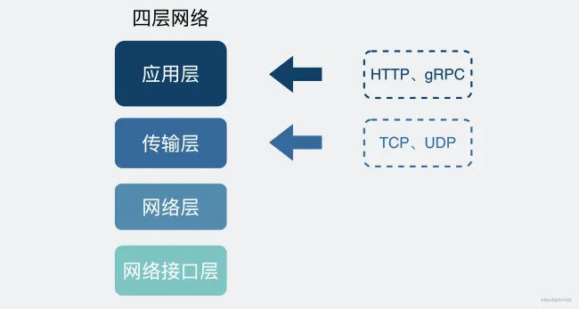
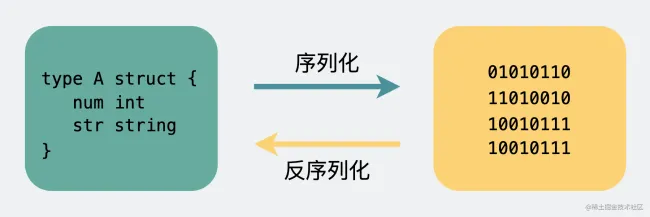

# Dubbo


# RPC


# Netty

## 核心组件


### Bytebuf

 `readIndex`指向下一个要读取的字节

 `writeIndex`指向下一个可以写入的字节空间

```xml
      +-------------------+------------------+------------------+
      | discardable bytes |  readable bytes  |  writable bytes  |
      |                   |     (CONTENT)    |                  |
      +-------------------+------------------+------------------+
      |                   |                  |                  |
      0      <=      readerIndex   <=   writerIndex    <=    capacity
```


### **Bootstrap - C\S 启动类**

Bootstrap 和 ServerBootStrap 是创建客户端和服务端启动器的工厂类


### **EventLoopGroup - 线程组** 

Netty 使用 Reactor 模式监听客户端连接

```java
EventLoopGroup bossGroup = new NioEventLoopGroup();
EventLoopGroup workerGroup = new NioEventLoopGroup();
```


[《Reactor模式》](https://link.zhihu.com/?target=https%3A//mp.weixin.qq.com/s/vWbbn1qXRFVva8Y9yET18Q)中，服务端要使用两个线程池：

- bossGroup 用于监听客户端连接，专门负责与客户端创建连接，并把连接注册到 workerGroup 的 Selector 中。
- workerGroup用于处理每一个连接发生的读写事件


### Channel

客户端 Bootstrap 的 `connect() ` 连接服务端后，返回一个 `Channel` 接口对象同服务端绑定。


### option()、childOption()

option()设置的是服务端用于接收进来的连接，也就是boosGroup线程。

childOption()是提供给父管道接收到的连接，也就是workerGroup线程。

SocketChannel参数，也就是childOption()常用的参数：

- **SO_RCVBUF** Socket参数，TCP数据接收缓冲区大小。
- **TCP_NODELAY** TCP参数，立即发送数据，默认值为Ture。
- **SO_KEEPALIVE** Socket参数，连接保活，默认值为False。启用该功能时，TCP会主动探测空闲连接的有效性。

ServerSocketChannel参数，也就是option()常用参数：

- **SO_BACKLOG** Socket参数，服务端接受连接的队列长度，如果队列已满，客户端连接将被拒绝。默认值，Windows为200，其他为128。


### 流水线

ChannelPipeline是Netty处理请求的责任链，ChannelHandler则是具体处理请求的处理器。

#### **ChannelHandler**

**消息的具体处理器，主要负责处理客户端/服务端接收和发送的数据**

**ChannelHandler 主要分为处理入站数据的 `ChannelInboundHandler` 和出站数据的 `ChannelOutboundHandler` 接口**

****

**Netty 以适配器的形式提供了大量默认的 `ChannelHandler` 实现，主要目的是为了简化程序开发的过程，我们只需要 重写我们关注的事件和方法就可以了。 通常我们会以继承的方式使用以下适配器和抽象:**

- **`ChannelHandlerAdapter`**
- **`ChannelInboundHandlerAdapter`**
- **`ChannelDuplexHandler`**
- **`ChannelOutboundHandlerAdapter`**


##### **数据编码**

****


#### **ChannelPipeline**

**当 Channel 被创建时，它会被自动地分配到它专属的 ChannelPipeline。 一个 Channel 包含一个 ChannelPipeline。 ChannelPipeline 为 ChannelHandler 的链，一个 pipeline 上可以有多个 ChannelHandler**

****

**我们可以在 ChannelPipeline 上通过 `addLast()` 方法添加一个或者多个`ChannelHandler` （一个数据或者事件可能会被多个 Handler 处理） 。当一个 ChannelHandler 处理完之后就将数据交给下一个 ChannelHandler ：**

```java
b.group(eventLoopGroup)
    .handler(new ChannelInitializer<SocketChannel>() {
	@Override
    protected void initChannel(SocketChannel ch) {
        ch.pipeline().addLast(new NettyKryoDecoder(kryoSerializer, RpcResponse.class));
        ch.pipeline().addLast(new NettyKryoEncoder(kryoSerializer, RpcRequest.class));
        ch.pipeline().addLast(new KryoClientHandler());
    }
});
```


# 传输协议

## 有 HTTP 为什么要有 RPC？

### 从 TCP 聊起

作为一个程序员，假设我们需要在 A 电脑的进程发一段数据到 B 电脑的进程，我们一般会在代码里使用 socket 进行编程。

这时候，我们可选项一般也就**TCP 和 UDP 二选一。TCP 可靠，UDP 不可靠。** 除非是马总这种神级程序员（早期 QQ 大量使用 UDP），否则，只要稍微对可靠性有些要求，普通人一般无脑选 TCP 就对了。

类似下面这样。

```ini
fd = socket(AF_INET,SOCK_STREAM,0);
```

其中`SOCK_STREAM`，是指使用**字节流**传输数据，说白了就是**TCP 协议**。

在定义了 socket 之后，我们就可以愉快的对这个 socket 进行操作，比如用`bind()`绑定 IP 端口，用`connect()`发起建连。


在连接建立之后，我们就可以使用`send()`发送数据，`recv()`接收数据。

光这样一个纯裸的 TCP 连接，就可以做到收发数据了，那是不是就够了？

不行，这么用会有问题。

### 使用纯裸 TCP 会有什么问题

八股文常背，TCP 是有三个特点，**面向连接**、**可靠**、基于**字节流**。


字节流可以理解为一个双向的通道里流淌的二进制数据，也就是 **01 串** 。纯裸 TCP 收发的这些 01 串之间是 **没有任何边界** 的，你根本不知道到哪个地方才算一条完整消息。


正因为这个没有任何边界的特点，所以当我们选择使用 TCP 发送 **"夏洛"和"特烦恼"** 的时候，接收端收到的就是 **"夏洛特烦恼"** ，这时候接收端没发区分你是想要表达 **"夏洛"+"特烦恼"** 还是 **"夏洛特"+"烦恼"** 。


这就是所谓的 **粘包问题**，之前也写过一篇专门的[文章open in new window](https://mp.weixin.qq.com/s/0-YBxU1cSbDdzcZEZjmQYA)聊过这个问题。

需要在这个基础上加入一些 **自定义的规则** ，用于区分 **消息边界** 。

于是我们会把每条要发送的数据都包装一下，比如加入 **消息头** ，消息头里写清楚一个完整的包长度是多少，根据这个长度可以继续接收数据，截取出来后它们就是我们真正要传输的 **消息体** 。


而这里头提到的 **消息头** ，还可以放各种东西，比如消息体是否被压缩过和消息体格式之类的，只要上下游都约定好了，互相都认就可以了，这就是所谓的 **协议。**

每个使用 TCP 的项目都可能会定义一套类似这样的协议解析标准，他们可能 **有区别，但原理都类似**。

**于是基于 TCP，就衍生了非常多的协议，比如 HTTP 和 RPC。**


### HTTP 和 RPC

#### RPC 其实是一种调用方式

我们回过头来看网络的分层图。



**TCP 是传输层的协议** ，而基于 TCP 造出来的 HTTP 和各类 RPC 协议，它们都只是定义了不同消息格式的 **应用层协议** 而已。

**HTTP**（**H**yper **T**ext **T**ransfer **P**rotocol）协议又叫做 **超文本传输协议** 。我们用的比较多，平时上网在浏览器上敲个网址就能访问网页，这里用到的就是 HTTP 协议。


而 **RPC**（**R**emote **P**rocedure **C**all）又叫做 **远程过程调用**，它本身并不是一个具体的协议，而是一种 **调用方式** 。

举个例子，我们平时调用一个 **本地方法** 就像下面这样。


```ini
 res = localFunc(req)
```


如果现在这不是个本地方法，而是个**远端服务器**暴露出来的一个方法`remoteFunc`，如果我们还能像调用本地方法那样去调用它，这样就可以**屏蔽掉一些网络细节**，用起来更方便，岂不美哉？


```ini
res = remoteFunc(req)
```


基于这个思路，大佬们造出了非常多款式的 RPC 协议，比如比较有名的`gRPC`，`thrift`。

值得注意的是，虽然大部分 RPC 协议底层使用 TCP，但实际上 **它们不一定非得使用 TCP，改用 UDP 或者 HTTP，其实也可以做到类似的功能。**

到这里，我们回到文章标题的问题。

#### 那既然有 RPC 了，为什么还要有 HTTP 呢？

其实，TCP 是 **70 年** 代出来的协议，而 HTTP 是 **90 年代** 才开始流行的。而直接使用裸 TCP 会有问题，可想而知，这中间这么多年有多少自定义的协议，而这里面就有 **80 年代** 出来的`RPC`。

所以我们该问的不是 **既然有 HTTP 协议为什么要有 RPC** ，而是 **为什么有 RPC 还要有 HTTP 协议?**

现在电脑上装的各种联网软件，比如 xx 管家，xx 卫士，它们都作为客户端（Client） 需要跟服务端（Server） 建立连接收发消息，此时都会用到应用层协议，在这种 Client/Server (C/S) 架构下，它们可以使用自家造的 RPC 协议，因为它只管连自己公司的服务器就 ok 了。

但有个软件不同，浏览器（Browser） ，不管是 Chrome 还是 IE，它们不仅要能访问自家公司的**服务器（Server）** ，还需要访问其他公司的网站服务器，因此它们需要有个统一的标准，不然大家没法交流。于是，HTTP 就是那个时代用于统一 **Browser/Server (B/S)** 的协议。

也就是说在多年以前，**HTTP 主要用于 B/S 架构，而 RPC 更多用于 C/S 架构。但现在其实已经没分那么清了，B/S 和 C/S 在慢慢融合。** 很多软件同时支持多端，比如某度云盘，既要支持**网页版**，还要支持**手机端和 PC 端**，如果通信协议都用 HTTP 的话，那服务器只用同一套就够了。而 RPC 就开始退居幕后，一般用于公司内部集群里，各个微服务之间的通讯。

那这么说的话，**都用 HTTP 得了，还用什么 RPC？**

仿佛又回到了文章开头的样子，那这就要从它们之间的区别开始说起。


#### HTTP 和 RPC 有什么区别

我们来看看 RPC 和 HTTP 区别比较明显的几个点。

##### 服务发现

首先要向某个服务器发起请求，你得先建立连接，而建立连接的前提是，你得知道 **IP 地址和端口** 。这个找到服务对应的 IP 端口的过程，其实就是 **服务发现**。

在 **HTTP** 中，你知道服务的域名，就可以通过 **DNS 服务** 去解析得到它背后的 IP 地址，默认 **80 端口**。

而 **RPC** 的话，就有些区别，一般会有专门的中间服务去保存服务名和 IP 信息，比如 **Consul、Etcd、Nacos、ZooKeeper，甚至是 Redis**。想要访问某个服务，就去这些中间服务去获得 IP 和端口信息。由于 DNS 也是服务发现的一种，所以也有基于 DNS 去做服务发现的组件，比如 **CoreDNS**。

可以看出服务发现这一块，两者是有些区别，但不太能分高低。


##### 底层连接形式

以主流的 **HTTP1.1** 协议为例，其默认在建立底层 TCP 连接之后会一直保持这个连接（**keep alive**），之后的请求和响应都会复用这条连接。

而 **RPC** 协议，也跟 HTTP 类似，也是通过建立 TCP 长链接进行数据交互，但不同的地方在于，RPC 协议一般还会再建个 **连接池**，在请求量大的时候，建立多条连接放在池内，要发数据的时候就从池里取一条连接出来，用完放回去，下次再复用，可以说非常环保。


由于连接池有利于提升网络请求性能，所以不少编程语言的网络库里都会给 HTTP 加个连接池，比如 Go 就是这么干的。

可以看出这一块两者也没太大区别，所以也不是关键。


##### 传输的内容

基于 TCP 传输的消息，说到底，无非都是 **消息头 Header 和消息体 Body。**

**Header** 是用于标记一些特殊信息，其中最重要的是 **消息体长度**。

**Body** 则是放我们真正需要传输的内容，而这些内容只能是二进制 01 串，毕竟计算机只认识这玩意。所以 TCP 传字符串和数字都问题不大，因为字符串可以转成编码再变成 01 串，而数字本身也能直接转为二进制。但结构体呢，我们得想个办法将它也转为二进制 01 串，这样的方案现在也有很多现成的，比如 **JSON，Protocol Buffers (Protobuf)** 。

这个将结构体转为二进制数组的过程就叫 **序列化** ，反过来将二进制数组复原成结构体的过程叫 **反序列化**。



对于主流的 HTTP1.1，虽然它现在叫超文本协议，支持音频视频，但 HTTP 设计 初是用于做网页文本展示的，所以它传的内容以字符串为主。Header 和 Body 都是如此。在 Body 这块，它使用 **JSON** 来 **序列化** 结构体数据。

我们可以随便截个图直观看下。


可以看到这里面的内容非常多的冗余，显得非常啰嗦。最明显的，像 Header 里的那些信息，其实如果我们约定好头部的第几位是 `Content-Type`，就不需要每次都真的把 `Content-Type` 这个字段都传过来，类似的情况其实在 Body 的 JSON 结构里也特别明显。

而 RPC，因为它定制化程度更高，可以采用体积更小的 Protobuf 或其他序列化协议去保存结构体数据，同时也不需要像 HTTP 那样考虑各种浏览器行为，比如 302 重定向跳转啥的。**因此性能也会更好一些，这也是在公司内部微服务中抛弃 HTTP，选择使用 RPC 的最主要原因。**


当然上面说的 HTTP，其实 **特指的是现在主流使用的 HTTP1.1**，`HTTP2`在前者的基础上做了很多改进，所以 **性能可能比很多 RPC 协议还要好**，甚至连`gRPC`底层都直接用的`HTTP2`。

那么问题又来了。


#### 为什么既然有了 HTTP2，还要有 RPC 协议？

这个是由于 HTTP2 是 2015 年出来的。那时候很多公司内部的 RPC 协议都已经跑了好些年了，基于历史原因，一般也没必要去换了。

### 总结

- 纯裸 TCP 是能收发数据，但它是个无边界的数据流，上层需要定义消息格式用于定义 **消息边界** 。于是就有了各种协议，HTTP 和各类 RPC 协议就是在 TCP 之上定义的应用层协议。
- **RPC 本质上不算是协议，而是一种调用方式**，而像 gRPC 和 Thrift 这样的具体实现，才是协议，它们是实现了 RPC 调用的协议。目的是希望程序员能像调用本地方法那样去调用远端的服务方法。同时 RPC 有很多种实现方式，**不一定非得基于 TCP 协议**。
- 从发展历史来说，**HTTP 主要用于 B/S 架构，而 RPC 更多用于 C/S 架构。但现在其实已经没分那么清了，B/S 和 C/S 在慢慢融合。** 很多软件同时支持多端，所以对外一般用 HTTP 协议，而内部集群的微服务之间则采用 RPC 协议进行通讯。
- RPC 其实比 HTTP 出现的要早，且比目前主流的 HTTP1.1 性能要更好，所以大部分公司内部都还在使用 RPC。
- **HTTP2.0** 在 **HTTP1.1** 的基础上做了优化，性能可能比很多 RPC 协议都要好，但由于是这几年才出来的，所以也不太可能取代掉 RPC。


RPC 是一种调用方式，此处协议指的是 RPC 过程中用到的协议。

传输过程中，RPC请求不会把所有的二进制数据整体一下子传输到服务端中，中间可能会被拆分为好几个数据包，也可能会合并其它请求的数据包（同一个TCP连接上的数据），如何拆分合并，取决于系统参数配置和TCP窗口大小。

对于服务方来说，它会在TCP通道中收到很多的二进制数据，那它怎么识别出哪些二进制数据是第一个请求的呢？

所以，在发送的数据包中加入==协议==，协议标识数据开始与结束，就是每一个数据包的边界。按照协议分割的数据包发送到服务端也能识别，并且很好的复原。


## 协议设计

上面说了，由于 TCP 存在粘包问题，需要协议确定边界。

1）固定一个长度（比如4字节）用来保存请求数据大小


2）服务端需要反序列化，存入序列化方式，以及其他一些内容...


## 协议升级

定长的协议头会有啥问题。如果我们升级为新请求，往协议头里面多加 2bit 的参数并放在协议头最后。当用新的协议发出请求，而没有升级的应用受到请求后还是会按照原来的方式读取协议头，就会发生错误。

> 把参数加在不定长的协议体里面行不行，而且协议体里面也会放入一些扩展属性。但是协议体里面的内容都是经过序列化了的，要获取到参数值，需要把整个协议体里面的数据反序列化一遍，导致代价很高。

 

那为了保证能平滑地升级改造前后的协议，就需要设计一种可支持扩展的协议：


# SPI 扩展

可扩展性是一种设计理念，代表了对未来的一种预想，希望在现有的架构基础上，当未来某些方面发生变化的时候，我们能够以最小的改动来适应这种变化。

可扩展性的优点主要表现在模块之间的解耦，符合 Open-Close 原则（对扩展开放，对修改关闭）。系统增加新功能时，不需要对现有系统的结构和代码进行修改，仅仅新增一个扩展即可。

一般来说，系统会采用 Factory、IoC、OSGI 等方式管理扩展(插件)生命周期。考虑到 Dubbo 的适用面，不想强依赖 Spring 等 IoC 容器。 而自己造一个小的 IoC 容器，也觉得有点过度设计，所以选择最简单的 Factory 方式管理扩展(插件)。


## Dubbo 扩展的特性

Dubbo 中的扩展能力是从 JDK 标准的 SPI 扩展点发现机制加强而来，它改进了 JDK 标准的 SPI 以下问题：

- JDK 标准的 SPI 会一次性实例化扩展点所有实现，如果有扩展实现初始化很耗时，但如果没用上也加载，会很浪费资源。
- 如果扩展点加载失败，连扩展点的名称都拿不到了。比如：JDK 标准的 ScriptEngine，通过 getName() 获取脚本类型的名称，但如果 RubyScriptEngine 因为所依赖的 jruby.jar 不存在，导致 RubyScriptEngine 类加载失败，这个失败原因被吃掉了，和 ruby 对应不起来，当用户执行 ruby 脚本时，会报不支持 ruby，而不是真正失败的原因。

用户能够基于 Dubbo 提供的扩展能力，很方便基于自身需求扩展其他协议、过滤器、路由等。下面介绍下 Dubbo 扩展能力的特性。

- 按需加载。Dubbo 的扩展能力不会一次性实例化所有实现，而是用那个扩展类则实例化那个扩展类，减少资源浪费。
- 增加扩展类的 IOC 能力。Dubbo 的扩展能力并不仅仅只是发现扩展服务实现类，而是在此基础上更进一步，如果该扩展类的属性依赖其他对象，则 Dubbo 会自动的完成该依赖对象的注入功能。
- 增加扩展类的 AOP 能力。Dubbo 扩展能力会自动的发现扩展类的包装类，完成包装类的构造，增强扩展类的功能。
- 具备动态选择扩展实现的能力。Dubbo 扩展会基于参数，在运行时动态选择对应的扩展类，提高了 Dubbo 的扩展能力。
- 可以对扩展实现进行排序。能够基于用户需求，指定扩展实现的执行顺序。
- 提供扩展点的 Adaptive 能力。该能力可以使的一些扩展类在 consumer 端生效，一些扩展类在 provider 端生效。

从 Dubbo 扩展的设计目标可以看出，Dubbo 实现的一些例如动态选择扩展实现、IOC、AOP 等特性，能够为用户提供非常灵活的扩展能力。

## Dubbo 自定义扩展

### 扩展接口

```
org.apache.dubbo.rpc.cluster.LoadBalance
```

### 扩展配置

```xml
<dubbo:protocol loadbalance="xxx" />
<!-- 缺省值设置，当<dubbo:protocol>没有配置loadbalance时，使用此配置 -->
<dubbo:provider loadbalance="xxx" />
```

### 已知扩展

- `org.apache.dubbo.rpc.cluster.loadbalance.RandomLoadBalance`
- `org.apache.dubbo.rpc.cluster.loadbalance.RoundRobinLoadBalance`
- `org.apache.dubbo.rpc.cluster.loadbalance.LeastActiveLoadBalance`
- `org.apache.dubbo.rpc.cluster.loadbalance.ConsistentHashLoadBalance`
- `org.apache.dubbo.rpc.cluster.loadbalance.ShortestResponseLoadBalance`

### 扩展示例

Maven 项目结构：

```fallback
src
 |-main
    |-java
        |-com
            |-xxx
                |-XxxLoadBalance.java (实现LoadBalance接口)
    |-resources
        |-META-INF
            |-dubbo
                |-org.apache.dubbo.rpc.cluster.LoadBalance (纯文本文件，内容为：xxx=com.xxx.XxxLoadBalance)
```

XxxLoadBalance.java：

```java
package com.xxx;
 
import org.apache.dubbo.rpc.cluster.LoadBalance;
import org.apache.dubbo.rpc.Invoker;
import org.apache.dubbo.rpc.Invocation;
import org.apache.dubbo.rpc.RpcException; 
 
public class XxxLoadBalance implements LoadBalance {
    public <T> Invoker<T> select(List<Invoker<T>> invokers, Invocation invocation) throws RpcException {
        // ...
    }
}
```

META-INF/dubbo/org.apache.dubbo.rpc.cluster.LoadBalance：

```fallback
xxx=com.xxx.XxxLoadBalance
```


