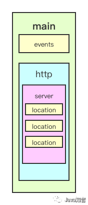

# Inverse Of Control

将程序对象的创建和依赖关系的管理委托给外部容器，当需要使用对象时使用<span style='font-size:20px'>*<u>依赖注入（Dependency Injection</u>*</span>从容器获得对象。业务对象（pojo）和配置元数据（Configuration）共同作用创建出符合业务场景的对象存入容器中待使用。


## Bean


### 生命周期

（1）aware回调接口是在正常的Bean属性之后，但在 `InitializingBean.afterPropertiesSet()` 或自定义 `init-method` 等初始化回调之前调用的。

> aware接口会将你的代码与Spring API捆绑在一起，并且不遵循反转控制的风格。因此，我们建议那些需要对容器进行编程访问的基础设施Bean使用这些接口。

（2）`BeanPostProcessor` 

`BeanPostProcessor` 接口定义了回调方法，可以实现这些方法来提供自己的（或覆盖容器的默认）实例化逻辑、依赖性解析逻辑等。如果想在Spring容器完成实例化、配置和初始化Bean之后实现一些自定义逻辑，可以插入一个或多个自定义 `BeanPostProcessor` 实现。

配置多个 `BeanPostProcessor` 通过设置 `order` 属性控制这些 `BeanPostProcessor` 实例的运行顺序。


1. **`postProcessBeforeDestruction()`** methods of DestructionAwareBeanPostProcessors

2. DisposableBean's **`destroy()`**

3. a custom destroy-method definition（Bean 定义的销毁方法）


1. ***Aware 感知接口*** 

   回调接口，可以设置或者赋予一些特性。

   ~~~java
   public class MyApplicationContextAware implements ApplicationContextAware {
       // 接收回调的 applicationContext 对象
       private ApplicationContext applicationContext;
   
       @Override
       public void setApplicationContext(ApplicationContext applicationContext) throws BeansException {
           this.applicationContext = applicationContext;
       }
   }
   ~~~

   

2. **BeanPostProcessor**

   

3. **Bean自定义初始化和销毁方法**

   不建议使用**InitializingBean**、**DisposableBean**接口，因为和Spring耦合

   1. ***@Bean 注解定义***

      ~~~java
      @Configuration
      public class MainConfig {
          
          @Bean(initMethod = "init",destroyMethod = "destroy")
          public Car car() {
              return new Car();
          }
      }
      ~~~

      ***@PostConstruct*** 、 ***@ProDestory*** （<span style='color: green; font-size: 24px'>推荐使用</span>）

      ~~~java
      @Component
      public class Book {
      
          @PostConstruct
          public void init() {}
          
          @PreDestroy
          public void destory() {}
      }
      ~~~

   2. 默认的初始化和销毁方法名称init、initialize、dispose，不用添加注解。可以和***@PostConstruct*** 、 ***@ProDestory***同时使用，将会一起生效

      ```java
      @Component
      public class Book {
      
          public void init() {}
      
          public void destory() {}
      }
      ```


### 循环依赖

~~~java
public class A { 
    private B b;
}

public class B {
    private A a;
}
~~~


A 和 B 相互依赖，实例化 A 的时候知道它依赖了 B，那么就会转头实例化 B，在实例化 B 时又发现了它依赖 A，相互依赖，不断掉头去实例化另一方，就会无线循环。

<span style='font-size: 20px'>✔ 解决方法</span>：容器发现 B 依赖于 A 时，容器会获取 A 对象的<span style='font-size:21px'>早期引用</span>，把它注入到 B 中，让 B 先完成实例化，A 随之完成实例化。


# Aspect Orient Programming

不修改源代码的前提下，去为系统中的业务组件添加某种通用功能。


### 代理对象生成时机

通常发生在初始化后，但若是存在循环依赖，将提前生成代理对象。假设发生了循环依赖，并且代理对象不提前生成，创建 B 的时候注入的是未代理的 A；到 A 执行完属性填充，再生成代理对象，放入容器中，此时 B 中的 A 和容器中被代理的 A 不是同一个对象，出现了问题。


### 多切面执行顺序

1、通常使用`@Order` 注解直接定义切面顺序

```java
// 值越小优先级越高
@Order(3)
@Component
@Aspect
public class LoggingAspect implements Ordered {
```

**2、实现`Ordered` 接口重写 `getOrder` 方法。**

```java
@Component
@Aspect
public class LoggingAspect implements Ordered {

    // ....

    @Override
    public int getOrder() {
        // 返回值越小优先级越高
        return 1;
    }
}
```


> **Spring AOP不能对哪些类进行增强？**
>
> 1. Spring AOP只能对IoC容器中的Bean进行增强，对于不受容器管理的对象不能增强。
> 2. 由于CGLib采用动态创建子类的方式生成代理对象，所以不能对final修饰的类进行代理。
>
> **JDK动态代理和CGLIB有什么区别？**
>
> JDK动态代理，是Java提供的动态代理技术，可以在运行时创建接口的代理实例。Spring AOP默认采用这种方式，在接口的代理实例中织入代码。
>
> CGLib动态代理采用底层的字节码技术，在运行时创建子类代理的实例。当目标对象不存在接口时，Spring AOP就会采用这种方式，在子类实例中织入代码。
>
> **既然有没有接口都可以用CGLIB，为什么Spring还要使用JDK动态代理？**
>
> 在性能方面，CGLib创建的代理对象比JDK动态代理创建的代理对象高很多。但是，CGLib在创建代理对象时所花费的时间比JDK动态代理多很多。所以，对于单例的对象因为无需频繁创建代理对象，采用CGLib动态代理比较合适。反之，对于多例的对象因为需要频繁的创建代理对象，则JDK动态代理更合适。
>


## 三级缓存

| 缓存 | map                   | 存储对象                                                     |
| ---- | --------------------- | ------------------------------------------------------------ |
| 一   | SingletonObjects      | 成品 Bean                                                    |
| 二   | EarlySingletonObjects | <span style='font-size:22px'>循环依赖</span>时，存放从三级缓存获取的半成品 Bean；<span style='font-size: 22px'>如果存在代理</span>，那么从三级缓存获取的是 AOP 生成的代理对象 |
| 三   | SingletonFactories    | 半成品 Bean（单例）                                          |


## 设计模式

- 单例

- 工厂

- 代理

- 模板方法

- 包装器设计模式

- **观察者模式:** Spring 事件驱动模型

- **适配器模式** : Spring AOP 的增强或通知(Advice)使用到了适配器模式、spring MVC 中也是用到了适配器模式适配 Controller
- ......


## 事务

事务是逻辑上的一组操作，要么都执行，要么都不执行。Spring 中可以使用声明式和编程式来使用事务。


### 事务属性

1.隔离级别 —— 读未提交、读已提交、可重读和串行化

2.传播行为 — 事务方法之间相互调用，遵循的行为守则

- require（默认）：存在事务加入；不存在则创建一个

- require_new：无论是否存在事务，都开启一个新的事务

- nested：存在事务，创建一个子事务；不存在则创建一个。子事务回滚不会影响父事务和同级事务的回滚；父事务回滚则子事务跟着回滚。

- mandatory：存在事务，加入；不存在则抛出异常

- supports：存在事务，加入；不存在就以非事务的方式运行

- not_supports：以非事务的方式运行，存在事务则将其挂起

- never：以非事务的方式运行，存在事务则抛出异常

3.超时 —— int 值，单位秒，默认值为 -1 表示永不超时

4.只读 —— 只读事务不涉及数据的修改，数据库会提供一些优化手段。一次执行多条查询语句，应该启用事务支持

5.回滚规则

遇到 RuntimeException、Error 会回滚事务，遇到 CheckedException 不会回滚。在 @Transactional 加上 rollbackFor = Exception.class 让事务在遇到 checkedException 时也回滚

```java
@Transactional(rollbackFor= MyException.class)
```


### 事务管理器

PlatformTransactionManager：开启、关闭、回滚事务


### 事务状态

~~~java
public interface TransactionStatus{
    boolean isNewTransaction(); // 是否是新的事务
    
    boolean hasSavepoint(); // 是否有恢复点
    
    void setRollbackOnly();  // 设置为只回滚
    
    boolean isRollbackOnly(); // 是否为只回滚
    
    boolean isCompleted; // 是否已完成
}
~~~


### 失效场景

外部方法没有被 `@Transactional `修饰， 内部调用有 `@Transactional` 注解的方法，内部方法的事务会失效。

这是由于`Spring AOP`代理的原因造成的，因为只有当 `@Transactional` 注解的方法在类以外被调用的时候，Spring 事务管理才生效。

~~~java
@Service
public class MyService {

    private void method1() {
         method2();
         //......
    }
    
    @Transactional
    public void method2() {
        //......
    }
}
~~~

<span style='font-size: 22px'>解决办法</span>

✔️避免同一类中自调用

✔️使用 AspectJ 取代 Spring AOP


# SpringMVC

Model（模型）

View（视图）

Controller（控制器）


## 组件

<span style='font-size: 22px'>DispatcherServlet </span>—— 接收请求并分配，最终回应客户端

<span style='font-size: 22px'>HandlerMapping</span> —— 依据请求路径匹配 **Handler（处理器）** ，将请求涉及到的 **Interceptor（拦截器）** 和 **Handler** 一起封装

<span style='font-size: 22px'>HandlerAdapter</span> —— 对匹配到的 **handler** 进行适配

<span style='font-size: 22px'>Handler</span> —— 处理请求，返回一个逻辑（logic）视图

<span style='font-size: 22px'>ViewResolver</span> —— 对逻辑视图进行解析、渲染


1. dispatcherServlet 拦截请求

2. 调用 handlerMapping 根据请求的路径匹配 handler，并将涉及的 interceptor 一起封装

3. 封装的对象交由 handlerAdapter 进行适配，然后调用 handler

4. Handler 执行后生成 ModelAndView（逻辑视图）

5. ViewResolver 对 ModelAndView 进行解析渲染

6. DispaterServlet 对 *viewResolver* 处理后的数据附着在视图上（传统的前后端不分离，返回 html 页面给客户）

7. 返回响应


## HTTP 注解

1. ***@RestController***

   作用于 Controller 层类上，方法的返回值填入 ResponseBody 中 。

   ~~~java
   @RestController
   public class LoginController{}
   ~~~

   

2. ***@RequestMapping***

   作用在 controller 层的方法，配置请求路径与执行方法的映射。

   ~~~java
   @RequestMapping("/login")
   public Response login() {
       
   }
   ~~~

   常用属性：

   - value —— 路径，多个路径使用 {，，} 

   - method —— 请求类型

     

3. ***@PathVaribale***

   作用在方法参数上，路径参数与方法参数做映射。

   ~~~java
   @RequestMapping("/user/{id}")
   public Response login(@PathVaribale("id") Integer id) {}
   ~~~

   

4. ***@RequestParam***

   作用在方法参数，与 Get 请求的参数名称做映射。

   ~~~java
   @GetMapping("/login")
   public Response login(@RequestParam("username") String username, 
                         @RequestParam("password") String password) {}
   ~~~

   可选属性：

   - value： 参数名字，可以为表单名称不匹配的参数做绑定

   - required： 是否必传，默认是true

   - defaultValue： 默认值，表示如果请求中没有同名参数时的默认值


5. ***@RequestBody***

   1. 方法 —— 执行结果直接写入响应体
   2. 方法参数 —— 将请求体的 JSON 映射到对象

   ~~~java
   @RestController
   public class LoginController{
       
       @PostMapping("/login")
       public Response login(@RequestBody LoginDTO loginDto) {}
   }
   ~~~

   > Get 请求没有 RequestBody


# SpringBoot

[SpringBoot中文文档](https://springdoc.cn/spring-boot/)


## 配置文件

配置文件优先级，要使用*bootstrap*需要引入依赖

1. bootstrap.properties
2. bootstrap.yml
3. application.properties
4. application.yml

*bootstrap*依赖的作用是可以指定配置中心，可以从配置中心获取额外的配置，而*application*不可以，因为时机慢


### 配置生效

1. 创建多个配置文件，命名形式 application-{profile}.yml

1. 指定*application.yml*生效的配置文件

   ~~~yml
   spring:
   	profiles:
   		active: {profile}
   ~~~

   指定*Bean*的生效环境
   
   ~~~java
   @Service
   @Profile("dev")
   public class DevService implements SomeService {}
   
   @Service
   @Profile("prod")
   public class ProdService implements SomeService {}
   ~~~


### 配置占位符

（1）`${}`可以引用之前定义的配置，如果之前不存在*username*的配置，在 `:`之后设置默认值

~~~yml
app:
  name: "MyApp"
  description: "${app.name} is a Spring Boot application written by ${username:Unknown}"
~~~

（2）`@@`引用*pom.xml*文件的属性

~~~xml
<properties>
    <java.version>21</java.version>
</properties>
~~~

*yml*用两个@@引用

~~~yml
app:
  java:
    version: "@java.version@"
~~~


### 配置映射JavaBean

（1）创建配置类，映射yml文件

~~~java
@ConfigurationProperties("my.service")
public class MyProperties {

    private boolean enabled;

    private InetAddress remoteAddress;
    
    private final Security security = new Security();

    // getters / setters...

    public static class Security {

        private String username;

        private String password;

        // 默认是 USER
        private List<String> roles = new ArrayList<>(Collections.singleton("USER"));

        // getters / setters...

    }
    
}
~~~

`properties.yml`中配置

~~~yml
my:
  service:
    remote-address: 192.168.1.1
    security:
      username: "admin"
      roles:
      - "USER"
      - "ADMIN"
~~~


（2）配置类实例化为Bean

在任意的`@Configuration`注解的类中使用`@EnableConfigurationProperties({配置类类名}.class)`注解可以将配置类实例化为Bean，然后就能在任意地方注入

也可以在启动类中用` @ConfigurationPropertiesScan({ "com.example.app", "com.example.another" })`扫描包名将配置类实例化（不推荐）


（3）使用

~~~java
@Service
public class MyService {

    @Resource
    private MyProperties properties;

    public void openConnection() {
        Server server = new Server(this.properties.getRemoteAddress());
        server.start();
        // ...
    }
}
~~~


### 常用配置

（1）数据库初始化*SQL*

~~~yml
spring:
  ###################### 提供SQL初始化脚本 #####################
  sql:
    init:
      schema-locations: classpath:db/schema-h2.sql  # schema代表表结构SQL
      data-locations: classpath:db/data-h2.sql      # data代表表数据SQL
~~~


## Starter

1. 创建项目，引入 SpringBoot-starter 起步依赖

2. 新建一个类声明为*Bean*

3. 在 resources 包下创建 `META-INF/spring.factories`

   

4. 在另外的项目引入其依赖


## 启动流程

*Springboot*启动时配置

~~~yml
spring:
  ###################### 启动配置 #####################
  main:
  	log-startup-info: false # 关闭启动时日志打印
    banner-mode: console
    lazy-initialization: true # 懒加载-Bean在需要时被创建，而不是在应用程序启动时就创建
~~~


<span style='font-size: 24px'>@SpringBootApplication</span>

作用是三个注解的总和

- @EnableAutoConfiguration —— 自动装配

- @ComponentScan —— 扫描 Bean

- @SpringBootConfiguration —— Configuration 子注解，注册额外的 bean 或导入其他配置类


### Banner

通过在 classpath 中添加 `banner.txt` 文件或通过将 `spring.banner.location` 属性设置为该文件的位置来自定义*banner*，如果该文件的编码不是UTF-8，你可以通过 `spring.banner.charset` 属性设置其字符编码


### 状态检测

Spring Boot对常用的 “liveness” 和 “readiness” 可用性状态提供了支持

1. 使用*actuator*，状态将作为健康端点组（health endpoint groups）暴露出来

2. 将 `ApplicationAvailability` 接口注入到Bean

   ~~~java
   @Configuration
   public class ApplicationStatus {
   
       @Resource
       private ApplicationAvailability applicationAvailability;
   
       public String printApplicationState() {
           LivenessState livenessState = applicationAvailability.getState(LivenessState.class);
           ReadinessState readinessState = applicationAvailability.getState(ReadinessState.class);
   		....
   }
   ~~~

#### Liveness State

"Liveness" 状态不应该基于外部检查，比如健康检查

Spring Boot应用程序的内部状态大多由Spring `ApplicationContext` 表示。如果 application context 已成功启动，Spring Boot就认为应用程序处于有效状态。一旦context被刷新，应用程序就被认为是活的

#### Readiness State

当为*failing*表示暂时不接受流量，这通常发生在启动期间，当 `CommandLineRunner` 和 `ApplicationRunner` 组件还在被处理的时候，或者是应用程序觉得目前负载已经到了极限，不能再处理额外的请求的时候。


#### 状态监听

当应用程序中断而无法恢复时，我们还可以更新应用程序的状态

```java
@Component
public class LocalCacheVerifier {
    
	@Resource
    private ApplicationEventPublisher eventPublisher;

    public void checkLocalCache() {
        try {
            // ...
        }
        catch (CacheCompletelyBrokenException ex) {
            AvailabilityChangeEvent.publish(this.eventPublisher, ex, LivenessState.BROKEN);
        }
    }

}
```

监听`AvailabilityChangeEvent`事件，随时更新状态

~~~java
@Component
public class ReadinessStateListener {

    /**
     * 可以将应用程序的 "Readiness" 状态导出到一个文件，实现实时监听
     */
    @EventListener
    public void onStateChange(AvailabilityChangeEvent<ReadinessState> event) {
        switch (event.getState()) {
            case ACCEPTING_TRAFFIC:
                ....
                break;
            case REFUSING_TRAFFIC:
                ...
                break;
        }
    }
}
~~~


### 启动事件


### 启动报错

启动报错提示，实现`FailureAnalyzer`或继承`AbstractFailureAnalyzer<T>`

~~~java
public class ProjectConstraintViolationFailureAnalyzer extends AbstractFailureAnalyzer<Exception> {

    @Override
    protected FailureAnalysis analyze(Throwable rootFailure, Exception cause) {
        if (cause instanceof ApplicationContextException) {
            if (cause.getCause() instanceof PortInUseException) {
                String message = "端口已被使用，请切换另外的端口号启动！";
                return new FailureAnalysis(message, "请使用不同的端口号.", cause);
            }
        }

        // 有必要可以继续处理其它错误
        return null;
    }
}
~~~

在`META-INF`下`spring.factories`注册为*Bean*


### 启动后扩展

`ApplicationRunner`和`CommandLineRunner`提供一个*run()* 方法，在`SpringApplication.run(…)` 执行完之前被调用

~~~java
@Component
@Order(1) // 实现多个CommandLineRunner时，指定执行顺序
public class ApplicationArgumentsCommandLineRunner implements CommandLineRunner {

    @Override
    public void run(String... args) throws NamingException {
        ...
    }
}
~~~


## Interceptor（拦截器）

*Spring*拦截器，对*Controller*层方法起拦截作用

（1）实现`HandlerInterceptor`

~~~java
public interface HandlerInterceptor {

    default boolean preHandle(HttpServletRequest request, 
                              HttpServletResponse response, 
                              Object handler) throws Exception {
        return true;
    }

    default void postHandle(HttpServletRequest request, 
                            HttpServletResponse response, 
                            Object handler, 
                            @Nullable ModelAndView modelAndView) throws Exception {
    }

    default void afterCompletion(HttpServletRequest request, 
                                 HttpServletResponse response, 
                                 Object handler, 
                                 @Nullable Exception ex) throws Exception {
    }
}
~~~

（2）实现 ***WebMvcConfigurer*** 接口，在 `addInterceptors()` 方法注册拦截器，可选匹配的拦截路径

~~~java
@Configuration
public class WebConfig implements WebMvcConfigurer {

    @Override
    public void addInterceptors(InterceptorRegistry registry) {
        registry.addInterceptor(new LanguageInterceptor());
    }
}
~~~


## Servelt

### Listener

事件监听器，在业务触发时用代码设定发布一个事件，该事件的监听器们就会工作

（1）自定义事件（或使用Springboot提供的事件）继承 `ApplicationEvent`，ApplicationEvent 继承了Java的事件对象`EventObject`

~~~java
public class MyEvent extends ApplicationEvent {

    // EventObject提供一个Object类型的data，用于事件携带数据（方便业务），所以可以创建自己的事件data对象
    public MyEvent(Object source) {
        super(source);
    }
}
~~~

（2）使用`@EventListener`注解在方法上，也可以实现`ApplicationListener<T>`去监听事件

~~~java
@Slf4
@Component
public class MyEventListener {

    /**
     * 参数类型是具体的事件
     */
    @EventListener
    public void log(MyEvent event) {
        log.info("[MyEvent] log.");
    }
}
~~~

（3）使用*Springboot*的`ApplicationEventPublisher`发布事件

```java
@Service
public class ServiceImpl implements Service {
    
    @Resource
    private ApplicationEventPublisher applicationEventPublisher;

    @Override
    public PlaceOrderResVO placeOrder(PlaceOrderReqVO reqVO) {
        //事件携带的消息
        Object eventMessage = new PlaceOrderEventMessage();
        //发布事件
        applicationEventPublisher.publishEvent(new MyEvent(eventMessage));
		.....
    }
}
```


### Filter

拦截访问web资源的request与response，也可以对静态资源进行拦截，从而实现一些特殊的功能

~~~java
public interface Filter {

    public default void init(FilterConfig filterConfig) throws ServletException {}

    public void doFilter(ServletRequest request, 
                         ServletResponse response,
                         FilterChain chain) throws IOException, ServletException;

    public default void destroy() {}
}
~~~


拦截器和过滤器的不同：

1. 拦截器可以使用Spring的Bean

2. 过滤器的实现基于回调函数，拦截器（代理模式）的实现基于反射


## *HTTP*参数校验

spring-boot 版本大于 2.3.x，需要手动引入依赖，校验失败抛出 `MethodArgumentNotValidException` 异常

```xml
<dependency>
    <groupId>org.hibernate</groupId>
    <artifactId>hibernate-validator</artifactId>
    <version>6.0.1.Final</version>
</dependency>
```


1. #### requestBody

   ```java
   @Data
   public class UserDTO {
       @NotNull
       private String userName;
   }
   ```

   方法参数上声明校验注解

   ```java
   @PostMapping("/save")
   public Result saveUser(@RequestBody @Validated UserDTO userDTO) {
       return Result.ok();  // 校验通过，才会执行业务逻辑处理
   }
   ```

   

2. #### requestParam/PathVariable

   1. Controller 类上使用 @Validated 注解
   2. 方法参数使用校验注解

   ```java
   @RestController
   @Validated
   public class UserController {
   
       @GetMapping("{userId}")
       public Result detail(@PathVariable("userId") @Min(10000000000000000L) Long userId) {
           // 校验通过，才会执行业务逻辑处理
   
       }
   
   
       @GetMapping("getByAccount")
       public Result getByAccount(@Length(min = 6, max = 20) @NotNull String  account) {
           // 校验通过，才会执行业务逻辑处理
       }
   }
   ```

   > 可用于任何 Bean 的方法上，原理是 AOP


### 分组检验

多个方法需要使用同一个DTO类来接收参数，而不同方法的校验规则很可能是不一样的

保存User的时候，UserId是可空的，但是更新User的时候，UserId的值必须>=10000000000000000L

~~~java
@Data
public class UserDTO {

    @Min(value = 10000000000000000L, groups = Update.class)
    private Long userId;

    @NotNull(groups = {Save.class, Update.class})
    @Length(min = 2, max = 10, groups = {Save.class, Update.class})
    private String userName;

    /**
     * 保存的时候校验分组
     */
    public interface Save {}

    /**
     * 更新的时候校验分组
     */
    public interface Update {}
}
~~~

*@Validated*注解上指定校验分组

~~~java
@PostMapping("/save")
public Result saveUser(@RequestBody @Validated(UserDTO.Save.class) UserDTO userDTO {}

@PostMapping("/update")
public Result updateUser(@RequestBody @Validated(UserDTO.Update.class) UserDTO userDTO) {}
~~~


### 嵌套校验

*DTO*类里面的字段都是基本数据类型和String类型

但是实际场景中，有可能某个字段也是一个对象

~~~java
@Data
public class UserDTO {

    @Min(value = 10000000000000000L, groups = Update.class)
    private Long userId;

    /**
     * @Valid 注解
     */
    @NotNull(groups = {Save.class, Update.class})
    @Valid   
    private Job job;

    @Data
    public static class Job {
        
        @Min(value = 1, groups = Update.class)
        private Long jobId;

        @NotNull(groups = {Save.class, Update.class})
        @Length(min = 2, max = 10, groups = {Save.class, Update.class})
        private String jobName;
    }

    public interface Save {}

    public interface Update {}
}
~~~

还有就是嵌套集合校验会对集合里面的每一项都进行校验，例如`List<Job>`字段会对这个list里面的每一个Job对象都进行校验


### 集合校验

如果请求体*RequestBody*直接传递了*json*数组给后台，并希望对数组中的每一项都进行参数校验。

需要自定义*list*集合来接收参数，并声明*@Valid*注解

~~~java
public class ValidationList<E> implements List<E> {

    // @Delegate是lombok注解
    @Delegate 
    @Valid
    public List<E> list = new ArrayList<>();

    // 必须重写
    @Override
    public String toString() {
        return list.toString();
    }
}
~~~

> <font color='red'>**@Delegate**</font>注解受lombok版本限制，1.18.6以上版本可支持。如果校验不通过，会抛出NotReadablePropertyException，同样可以**使用统一异常进行处理**。


比如，我们需要一次性保存多个User对象，Controller层的方法可以这么写：

~~~java
@PostMapping("/saveList")
public Result saveList(@RequestBody @Validated(UserDTO.Save.class) ValidationList<UserDTO> userList) {
    // 校验通过，才会执行业务逻辑处理
    return Result.ok();
}
~~~


### 自定义校验

自定义校验注解

~~~java
@Target({METHOD, FIELD, ANNOTATION_TYPE, CONSTRUCTOR, PARAMETER})
@Retention(RUNTIME)
@Documented
@Constraint(validatedBy = {EncryptIdValidator.class})
public @interface EncryptId {

    // 默认错误消息
    String message() default "加密id格式错误";

    // 分组
    Class<?>[] groups() default {};

    // 负载
    Class<? extends Payload>[] payload() default {};
}
~~~

实现 ConstraintValidator 接口编写约束校验器

~~~java
public class EncryptIdValidator implements ConstraintValidator<EncryptId, String> {

    private static final Pattern PATTERN = Pattern.compile("^[a-f\\d]{32,256}$");

    @Override
    public boolean isValid(String value, ConstraintValidatorContext context) {
        // 不为null才进行校验
        if (value != null) {
            Matcher matcher = PATTERN.matcher(value);
            return matcher.find();
        }
        return true;
    }
}
~~~

*@EncryptI*d进行参数校验了！


### 编程式校验

上面的示例都是基于注解来实现自动校验的，在某些情况下，我们可能希望以编程方式调用验证。这个时候可以注入javax.validation.Validator对象，然后再调用其api。

~~~java
@Autowired
private javax.validation.Validator globalValidator;

// 编程式校验
@PostMapping("/saveWithCodingValidate")
public Result saveWithCodingValidate(@RequestBody UserDTO userDTO) {
    Set<ConstraintViolation<UserDTO>> validate = globalValidator.validate(userDTO, UserDTO.Save.class);
    // 如果校验通过，validate为空；否则，validate包含未校验通过项
    if (validate.isEmpty()) {
        // 校验通过，才会执行业务逻辑处理

    } else {
        for (ConstraintViolation<UserDTO> userDTOConstraintViolation : validate) {
            // 校验失败，做其它逻辑
            System.out.println(userDTOConstraintViolation);
        }
    }
    return Result.ok();
}
~~~

### 快速失败(Fail Fast)

Spring Validation默认会校验完所有字段，然后才抛出异常。可以通过一些简单的配置，开启Fali Fast模式，一旦校验失败就立即返回。

~~~java
@Bean
public Validator validator() {
    ValidatorFactory validatorFactory = Validation.byProvider(HibernateValidator.class)
            .configure()
            // 快速失败模式
            .failFast(true)
            .buildValidatorFactory();
    return validatorFactory.getValidator();
}
~~~


## 异常统一处理

```java
@RestControllerAdvice(basePackages = "com.better.passjavaquestion.controller")
public class GlobalExceptionHandler {

    @ExceptionHandler(value = MethodArgumentNotValidException.class)
    public R handle(MethodArgumentNotValidException e) {
       ......
   }
}
```

## 响应体统一处理

~~~java
@ControllerAdvice
public class ResponseHandler implements ResponseBodyAdvice {
 
    @Override
    public boolean supports(MethodParameter returnType, Class converterType) {
        //直接为true，所有返回结果都应该检验
        return true;
    }
 
    @Override
    public Object beforeBodyWrite(Object body, 
                                  MethodParameter returnType, 
                                  MediaType selectedContentType, 
                                  Class selectedConverterType, 
                                  ServerHttpRequest request, 
                                  ServerHttpResponse response) {

    }
}
~~~


## 异步任务

（1）@Async 标志为一个异步方法

```java
@Async
public void hello() throws InterruptedException {
    Thread.sleep(6000);
    System.out.println("nihao");
}
```

（2）启动类允许开启异步 `@EnableAsync`

（3）自定义线程池

`@Async`的默认线程池为 `SimpleAsyncTaskExecutor`默认每次调用都会创建一个新的线程

（3.1）继承 AsyncConfigurerSupport（实现了AsyncConfigurer）

~~~java
@Configuration
@Slf4j
public class SpringAsyncConfigurer extends AsyncConfigurerSupport {

    @Bean
    public ThreadPoolTaskExecutor asyncExecutor() {
        ThreadPoolTaskExecutor threadPool = new ThreadPoolTaskExecutor();
        threadPool.setCorePoolSize(10);
        threadPool.setMaxPoolSize(30);
        threadPool.setWaitForTasksToCompleteOnShutdown(true);
        threadPool.setAwaitTerminationSeconds(60 * 15);
        return threadPool;
    }

    @Override
    public Executor getAsyncExecutor() {
        return asyncExecutor();
    }

    @Override
    public AsyncUncaughtExceptionHandler getAsyncUncaughtExceptionHandler() {
        return (ex, method, params) -> log.error(String.format("[async] task{} error:", method), ex);
    }
}
~~~

（3.2）配置由自定义的 TaskExecutor 替代内置的任务执行器

```java
@Slf4j
@Service
public class OrderLogListener  {

    @EventListener
    @Async("asyncExecutor")
    public void orderLog(PlaceOrderEvent event) {
        log.info("[afterPlaceOrder] log.");
    }
}
```

配置线程池

~~~java
@Configuration
public class TaskPoolConfig {

    @Bean(name = "asyncExecutor")
    public Executor taskExecutor() {
        ThreadPoolTaskExecutor executor = new ThreadPoolTaskExecutor();
        //随便写的一些配置
        executor.setCorePoolSize(10);
        executor.setMaxPoolSize(20);
        executor.setQueueCapacity(200);
        executor.setKeepAliveSeconds(60);
        executor.setThreadNamePrefix("asyncExecutor-");
        executor.setRejectedExecutionHandler(new ThreadPoolExecutor.CallerRunsPolicy());
        return executor;
    }
}
~~~

使用@Async 注解的时候，指定线程池，推荐使用这种方式，因为在项目里，尽量做到线程池隔离，不同的任务使用不同的线程池


## 失败循环重试

```xml
 <dependency>
  <groupId>org.springframework.retry</groupId>
  <artifactId>spring-retry</artifactId>
 </dependency>
```

启动类注解`@EnableRetry`

```java
@EnableRetry
@SpringBootApplication
public class HelloApplication {
	...
}
```

方法上添加`@Retryable`

```java
import com.mail.elegant.service.TestRetryService;
import org.springframework.retry.annotation.Backoff;
import org.springframework.retry.annotation.Retryable;
import org.springframework.stereotype.Service;
import java.time.LocalTime;
 
@Service
public class TestRetryServiceImpl implements TestRetryService {
 
    @Override
    @Retryable(value = Exception.class,
               maxAttempts = 3,
               backoff = @Backoff(delay = 2000,multiplier = 1.5))
    public int test(int code) throws Exception{
        System.out.println("test被调用,时间："+LocalTime.now());
          if (code==0){
              throw new Exception("情况不对头！");
          }
        System.out.println("test被调用,情况对头了！");
 
        return 200;
    }
}
```

参数含义：

- `value`：抛出指定异常才会重试
- `include`：和value一样，默认为空，当exclude也为空时，默认所有异常
- `exclude`：指定不处理的异常
- `maxAttempts`：最大重试次数，默认3次
- `backoff`：重试等待策略，默认使用`@Backoff`，`@Backoff`的value默认为1000L，我们设置为2000L；`multiplier`（指定延迟倍数）默认为0，表示固定暂停1秒后进行重试，如果把`multiplier`设置为1.5，则第一次重试为2秒，第二次为3秒，第三次为4.5秒。


> **当重试耗尽时还是失败？**
>
> `@Recover`注解，用于@Retryable重试失败后的回调处理处理方法。
>
> 如果不需要回调方法，可以直接不写回调方法，那么实现的效果是，重试次数完了后，如果还是没成功没符合业务判断，就抛出异常。
>


`@Recover`

```java
@Recover
public int recover(Exception e, int code){
   System.out.println("回调方法执行！！！！");
   //记日志到数据库 或者调用其余的方法
    return 400;
}
```

可以看到传参里面写的是 `Exception e`，这个是作为回调的接头暗号（重试次数用完了，还是失败，我们抛出这个`Exception e`通知触发这个回调方法）。


对于`@Recover`注解的方法，需要特别注意的是：

- 方法的返回值必须与`@Retryable`方法一致
- 方法的第一个参数，必须是Throwable类型的，建议是与`@Retryable`配置的异常一致，其他的参数，需要哪个参数，写进去就可以了（`@Recover`方法中有的）
- 该回调方法与重试方法写在同一个实现类里面


**注意事项**

- 由于是基于AOP实现，所以不支持类里自调用方法
- 如果重试失败需要给`@Recover`注解的方法做后续处理，那这个重试的方法不能有返回值，只能是void
- 方法内不能使用`try catch`，只能往外抛异常
- `@Recover`注解来开启重试失败后调用的方法(注意,需跟重处理方法在同一个类中)，此注解注释的方法参数一定要是`@Retryable`抛出的异常，否则无法识别，可以在该方法中进行日志处理。


## WebSocket

[WebSocket - Web APIs | MDN (mozilla.org)](https://developer.mozilla.org/en-US/docs/Web/API/WebSocket)


## SpringBoot 所有扩展点

### 1）ApplicationContextInitializer

在应用上下文初始化前做点事情

```java
public class TestApplicationContextInitializer implements ApplicationContextInitializer {
    @Override
    public void initialize(ConfigurableApplicationContext applicationContext) {
        System.out.println("[ApplicationContextInitializer]");
    }
}
```

三种方式使其生效

- 在启动类中用 springApplication.addInitializers(new TestApplicationContextInitializer()) 语句加入
- 配置文件加入 context.initializer.classes=实现类全限定名
- `spring.factories` 中加入org.springframework.context.ApplicationContextInitializer=实现类全限定名

### 2）BeanDefinitionRegistryPostProcessor

在读取项目中的 Bean 定义信息之后执行

使用场景：动态注册 beanDefinition，可以加载 classpath 之外的 bean

```java
public class TestBeanDefinitionRegistryPostProcessor implements BeanDefinitionRegistryPostProcessor {
    @Override      
    public void postProcessBeanDefinitionRegistry(BeanDefinitionRegistry registry) throws BeansException {}
      
    @Override      
    public void postProcessBeanFactory(ConfigurableListableBeanFactory beanFactory) throws BeansException {}
}
```

### 3）BeanFactoryPostProcessor

在读取项目中的 Bean 定义信息之后，实例化 bean 之前执行

使用场景：修改已经注册的 Bean 的元信息

```java
public class TestBeanFactoryPostProcessor implements BeanFactoryPostProcessor {
    @Override      
    public void postProcessBeanFactory(ConfigurableListableBeanFactory beanFactory) throws BeansException {}
}
```


### 4）InstantiationAwareBeanPostProcessor 

5个注入点

1. postProcessBeforeInstantiation：实例化前

2. postProcessAfterInstantiation：实例化后

3. postProcessPropertyValues：属性注入（**依赖注入**）触发

4. postProcessBeforeInitialization：初始化前，相当于把 bean 注入 springContext 前

5. postProcessAfterInitialization：初始化后，相当于把 bean 注入 springContext 后

### 5）SmartInstantiationAwareBeanPostProcessor

3个注入点

1. **predictBeanType**：发生在 postProcessBeforeInstantiation 之前，预测 Bean 的类型

2. **determineCandidateConstructors**：发生在 postProcessBeforeInstantiation 之后，确定该 bean 的构造函数

3. ***getEarlyBeanReference***：发生在 postProcessAfterInstantiation 之后，当出现 <span style='font-size: 24px'>循环依赖</span> 的场景，提前暴露回调方法返回一个早期引用

### 6）BeanFactoryAware

发生在 bean 的实例化之后，注入属性之前，也就是Setter之前。

```java
public class TestBeanFactoryAware implements BeanFactoryAware {
    @Override      
    public void setBeanFactory(BeanFactory beanFactory) throws BeansException {}
}
```


### 7）ApplicationContextAwareProcessor

触发在属性填充之后，初始化之前

1. ***EnvironmentAware***—— 获得系统内的所有参数

2. ***EmbeddedValueResolverAware***—— 值解析器

3. ***ResourceLoaderAware***—— 获取 **classpath** 内所有的资源对象

4. ***ApplicationEventPublisherAware***—— 发布事件，结合 ApplicationListener 来共同使用，

5. ***MessageSourceAware***—— 国际化

6. ***ApplicationContextAware***

### 8）BeanNameAware

触发点在 bean 的初始化之前，也就是 postProcessBeforeInitialization 之前

### 9）@PostConstruct

bean 初始化阶段，如果对一个方法标注了 @PostConstruct，会先调用这个方法

```java
public class BeanA {
    @PostConstruct
    public void init(){}
}
```

### 10）InitializingBean


### 11）FactoryBean

定制 Bean 的实例化逻辑

```java
public class TestFactoryBean implements FactoryBean<TestFactoryBean.TestFactoryInnerBean> {
      
    @Override      
    public TestFactoryBean.TestFactoryInnerBean getObject() throws Exception {
        System.out.println("[FactoryBean] getObject");
        return new TestFactoryBean.TestFactoryInnerBean();
    }
      
    @Override      
    public Class<?> getObjectType() {
        return TestFactoryBean.TestFactoryInnerBean.class;
    }
      
    @Override      
    public boolean isSingleton() {
        return true;
    }
      
    public static class TestFactoryInnerBean{
      
    }
}
```

### 12）SmartInitializingSingleton

容器管理的所有单例对象（非懒加载对象）初始化完成之后调用的回调接口，触发时机是 postProcessAfterInitialization 后

```java
public class TestSmartInitializingSingleton implements SmartInitializingSingleton {
    @Override      
    public void afterSingletonsInstantiated() {}
}
```

### 13）CommandLineRunner

触发时机为项目启动完毕后，如有多个 CommandLineRunner 利用 @Order 来排序

```java
public class TestCommandLineRunner implements CommandLineRunner {
    @Override
    public void run(String... args) throws Exception {}
}
```

### 14）DisposableBean

对象销毁时执行

```java
public class NormalBeanA implements DisposableBean {
    @Override      
    public void destroy() throws Exception {}
}
```

### 15）ApplicationListener

监听器，用于监听事件（Event），触发时机可以穿插在业务方法执行过程中。

spring 的内部事件发生在启动和调用中，利用 ApplicationListener 的特性，做内置事件的监听器达到和 Bean 触发点大致相同的事情。


主要的内置事件：

- **ContextRefreshedEvent**

  ApplicationContext 被初始化或刷新时，该事件被发布。这也可以在 ConfigurableApplicationContext 接口中使用 refresh()方法来发生。此处的初始化是指：所有的Bean被成功装载，后处理Bean被检测并激活，所有Singleton Bean 被预实例化，ApplicationContext容器已就绪可用。

- **ContextStartedEvent** —— 使用 ConfigurableApplicationContext 的 start() 方法启动 ApplicationContext时，该事件被发布

- **ContextStoppedEvent** —— stop() 停止 ApplicationContext 时，发布这个事件

- **ContextClosedEvent** —— close() 方法关闭 ApplicationContext 时，该事件被发布

- **RequestHandledEvent**

  这是一个 web-specific 事件，告诉所有 bean HTTP 请求已经被服务。只能应用于使用DispatcherServlet的Web应用。在使用Spring作为前端的MVC控制器时，当Spring处理用户请求结束后，系统会自动触发该事件


# 幂等性

任意多次请求均与一次请求执行的结果相同，也就是说对于一个接口而言，无论调用了多少次，最终得到的结果都是一样的。实现幂等性是需要代价的，因此需要衡量业务是否需要，或者某些接口本身就是幂等性也不用额外实现幂等。


<span style='font-size: 24px'>实现幂等性的要求</span>

每个请求操作必须有唯一的 ID， ID 是表示此业务是否被执行过的关键凭证。每次执行业务之前必须要先判断此业务是否已经被处理过。第一次业务处理完成之后，要把此业务处理的状态进行保存，比如存储到 Redis 中或者是数据库中，这样才能防止业务被重复处理。


#### **1. 前端拦截**

前端拦截是指通过 Web 站点的页面进行请求拦截，比如在用户点击完“提交”按钮后，我们可以把按钮设置为不可用或者隐藏状态，避免用户重复点击。

懂行的程序员或者黑客可以直接绕过页面的 JS 执行，直接模拟请求后端的接口，因此除了前端拦截一部分正常的误操作之外，后端的验证必不可少。


#### **2. 数据库实现**

数据库实现幂等性的方案有三个：

- 通过悲观锁来实现幂等性
- 通过唯一索引来实现幂等性
- 通过乐观锁来实现幂等性

**① 悲观锁**

使用悲观锁实现幂等性，一般是配合事务一起来实现，在没有使用悲观锁时，我们通常的执行过程是这样的，首先来判断数据的状态，执行 SQL 如下：

```javascript
select status from table_name where ;
```

然后再进行添加操作：

```javascript
insert into table_name (id) values ('xxx');
```

最后再进行状态的修改：

```javascript
update table_name set status='xxx';
```

但这种情况因为是非原子操作，所以在高并发环境下可能会造成一个业务被执行两次的问题，当一个程序在执行中时，而另一个程序也开始状态判断的操作。因为第一个程序还未来得及更改状态，所以第二个程序也能执行成功，这就导致一个业务被执行了两次。

在这种情况下我们就可以使用悲观锁来避免问题的产生，实现 SQL 如下所示：

```javascript
begin;  # 1.开始事务
select * from table_name where for update; # 2.查询状态
insert into table_name (id) values ('xxx'); # 3.添加操作
update table_name set status='xxx'; # 4.更改操作
commit; # 5.提交事务
```

在实现的过程中需要注意以下两个问题：

- 如果使用的是 [MySQL 数据库](https://cloud.tencent.com/product/cdb?from=20065&from_column=20065)，必须选用 innodb 存储引擎，因为 innodb 支持事务；
- id 字段一定要是主键或者是唯一索引，不然会锁表，影响其他业务执行。


**② 唯一索引**

执行业务之前，先执行插入操作，唯一字段就是业务的 ID。出现插入失败表示为重复提交。

```javascript
CREATE TABLE `table_name` (
  `id` int NOT NULL AUTO_INCREMENT,
  `orderid` varchar(32) NOT NULL DEFAULT '' COMMENT '唯一id',
  PRIMARY KEY (`id`),
  UNIQUE KEY `uq_orderid` (`orderid`) COMMENT '唯一约束'
) ENGINE=InnoDB;
```


**③ 乐观锁**

乐观锁是指在执行数据操作时（update、insert）进行加锁操作，其他时间不加锁，因此相比于整个执行过程都加锁的悲观锁来说，它的执行效率要高很多。

乐观锁可以通过**版本号**来实现，例如以下 SQL：

```javascript
update table_name set version=version+1 where version=0;
```


#### **3. JVM 锁实现**

JVM 锁实现是指通过 JVM 提供的内置锁如 Lock 或者是 synchronized 来实现幂等性。使用 JVM 锁来实现幂等性的一般流程为：首先通过 Lock 对代码段进行加锁操作，然后再判断此订单是否已经被处理过，如果未处理则开启事务执行订单处理，处理完成之后提交事务并释放锁，执行流程如下图所示：


JVM 锁存在的最大问题在于，它只能应用于单机环境，因为 Lock 本身为单机锁，所以它就不适应于分布式多机环境。


#### **4. 分布式锁实现**

分布式锁实现幂等性的逻辑是，在每次执行方法之前先判断是否可以获取到分布式锁，如果可以，则表示为第一次执行方法，否则直接舍弃请求即可，执行流程如下图所示：


# 日志

## 日志等级

- TRACE

  最详细的调试信息

- DEBUG

  

- INFO

  关键信息，比如程序的启动、运行日志等。通常在生产环境中开启 INFO 级别的日志记录。

- WARN

  警告信息，提示程序可能会出现一些异常或者错误

- ERROR

  错误信息，通常表示程序出现了一些不可预料的错误。


## 日志插件

- Log4j（1999年诞生）

- SLF4J（2004年诞生）

  严格来说，SLF4J（Simple Logging Facade for Java）并不算一个插件，而是Ceki Gülcü开发的一个日志门面接口。它为Java应用程序提供了统一的日志抽象，使开发人员可以使用一致的API进行日志记录，而不需要直接依赖于特定的日志实现。

- Logback（2009年诞生）

- Log4j 2（2014年诞生）


### 外观模式与SLF4J

SLF4J 的使用

1. 引入依赖

   ```xml
   <dependency>
     <groupId>org.slf4j</groupId>
     <artifactId>slf4j-api</artifactId>
     <version>1.7.32</version>
   </dependency>
   ```

   ```java
   import org.slf4j.Logger;
   import org.slf4j.LoggerFactory;
   
   public class MyClass {
       private static final Logger log = LoggerFactory.getLogger(MyClass.class);
       //...
       public static void main(String[] args) {
           log.info("This is an info message.");
       }
   }
   ```

2. 引用了lombok，使用 SLF4J

   ~~~sql
   import lombok.extern.slf4j.Slf4j;
   
   @Slf4j
   public class MyClass {
       public static void main(String[] args) {
           log.info("This is an info message.");
       }
   }
   ~~~

SLF4J仅仅是个门面，换句话说，仅有接口而没有实现，直接运行打印日志是没有用处的




## 日志实现

- Logback：springboot自带
-  Log4j 2：性能更好


### Logback

 Spring Boot 中在 classpath 的根目录定义 logback-spring.xml

```xml
<?xml version="1.0" encoding="UTF-8"?>
<configuration>
    <!--定义日志文件的存储地址，使用Spring的属性文件配置方式-->
    <springProperty scope="context" name="log.home" source="log.home" defaultValue="logs"/>

    <!--定义日志文件的路径-->
    <property name="LOG_PATH" value="${log.home}"/>

    <!--定义控制台输出-->
    <appender name="console" class="ch.qos.logback.core.ConsoleAppender">
        <encoder>
            <pattern>%-5relative [%thread] %-5level %logger{35} - %msg%n</pattern>
        </encoder>
    </appender>

    <!--定义 INFO 及以上级别信息输出到控制台-->
    <root level="INFO">
        <appender-ref ref="console"/>
    </root>

    <!--定义所有组件的日志级别，如所有 DEBUG-->
    <logger name="com.example" level="DEBUG"/>

    <!-- date 格式定义 -->
    <property name="LOG_DATEFORMAT" value="yyyy-MM-dd"/>

    <!-- 定义日志归档文件名称格式，每天生成一个日志文件 -->
    <property name="ARCHIVE_PATTERN" value="${LOG_PATH}/%d{${LOG_DATEFORMAT}}/app-%d{${LOG_DATEFORMAT}}-%i.log.gz"/>

    <!--定义文件输出，会根据定义的阈值进行切割，支持自动归档压缩过期日志-->
    <appender name="file" class="ch.qos.logback.core.rolling.RollingFileAppender">
        <file>${LOG_PATH}/app.log</file>
        <rollingPolicy class="ch.qos.logback.core.rolling.SizeAndTimeBasedRollingPolicy">
            <!--定义日志文件切割的阈值，本例是 50MB-->
            <maxFileSize>50MB</maxFileSize>
            <!--定义日志文件保留时间，本例是每天生成一个日志文件-->
            <fileNamePattern>${ARCHIVE_PATTERN}</fileNamePattern>
            <maxHistory>30</maxHistory>
            <!-- zip 压缩生成的归档文件 -->
            <timeBasedFileNamingAndTriggeringPolicy class="ch.qos.logback.core.rolling.SizeAndTimeBasedFNATP">
                <maxFileSize>50MB</maxFileSize>
            </timeBasedFileNamingAndTriggeringPolicy>
            <!-- 删除过期文件 -->
            <cleanHistoryOnStart>true</cleanHistoryOnStart>
        </rollingPolicy>
        <encoder>
            <pattern>%d{yyyy-MM-dd HH:mm:ss.SSS} [%thread] %-5level %logger{35} - %msg%n</pattern>
        </encoder>
    </appender>

    <!--定义 ERROR 级别以上信息输出到文件-->
    <logger name="com.example.demo" level="ERROR" additivity="false">
        <appender-ref ref="file"/>
    </logger>

    <!--异步输出日志信息-->
    <appender name="asyncFile" class="ch.qos.logback.classic.AsyncAppender">
        <discardingThreshold>0</discardingThreshold>
        <queueSize>256</queueSize>
        <appender-ref ref="file"/>
    </appender>

    <!--定义INFO及以上级别信息异步输出到文件-->
    <logger name="com.example" level="INFO" additivity="false">
        <appender-ref ref="asyncFile"/>
    </logger>

</configuration>
```

其中，主要包括以下配置：

- **`springProperty`** 定义了 log 文件的存储路径，可以通过 Spring 的属性文件配置方式进行设置，如果没有配置则默认存储在 logs 目录下。
- **asyncAppender** 定义了异步输出日志的方式，对于高并发时，可以使用异步输出来提高系统的性能。
- **discardingThreshold** 定义了异步输出队列的阈值，当队列中的数据量超过此值时，会丢弃最早放入的数据，此处设置为 0 表示队列不会丢弃任何数据。
- **queueSize** 定义了异步输出队列的大小，当队列满时，会等待队列中的数据被消费后再将数据放入队列中，此处设置为 256。


### Log4j 2

对于spring-boot项目，除了引用 Log4j 2 我们还需要先剔除 Logback 的引用

```xml
<dependency>
     <groupId>org.apache.logging.log4j</groupId>
     <artifactId>log4j-slf4j-impl</artifactId>
     <version>2.13.3</version>
</dependency>
```

Log4j2 的配置逻辑和 logback 是类似的，只有些细节不同，比如Logger 的首字母大写等等，最后我们写下这样一个 log4j2.xml

```xml
<?xml version="1.0" encoding="UTF-8"?>
<Configuration status="INFO" monitorInterval="30">
  <Properties>
    <Property name="logPath">logs</Property>
  </Properties>
  <Appenders>
    <Console name="Console" target="SYSTEM_OUT">
      <PatternLayout pattern="%d{ISO8601} [%t] %-5level %logger{36} - %msg%n" />
    </Console>
    <RollingFile name="File" fileName="${logPath}/example.log"
                 filePattern="${logPath}/example-%d{yyyy-MM-dd}-%i.log">
      <PatternLayout pattern="%d{ISO8601} [%t] %-5level %logger{36} - %msg%n"/>
      <Policies>
        <SizeBasedTriggeringPolicy size="10 MB"/>
      </Policies>
      <DefaultRolloverStrategy max="4"/>
    </RollingFile>
  </Appenders>
  <Loggers>
    <Logger name="com.zhanfu.child" level="DEBUG">
      <AppenderRef ref="File"/>
      <AppenderRef ref="Console"/>
    </Logger>
    <Logger name="com.zhanfu" level="INFO">
      <AppenderRef ref="File"/>
      <AppenderRef ref="Console"/>
    </Logger>
    <Root level="WARN">
      <AppenderRef ref="Console" />
    </Root>
  </Loggers>
</Configuration>
```

- Properties

部分定义了一个 logPath 属性，方便在其他地方引用。

- Appenders

定义了两个 Appender：Console 和 RollingFile，分别将日志输出到控制台和文件中。RollingFile 使用了 RollingFileAppender，并设置了日志滚动策略和默认的备份文件数量。

- Loggers

定义了三个 Logger：com.zhanfu.child 的日志级别为 DEBUG，com.zhanfu 的日志级别为INFO，Root Logger 的日志级别为 WARN。并指定了两个 Appender：Console 和 File。


# logback

https://logback.qos.ch/manual/configuration.html


## 配置

### logger

`<logger>`仅采用一个强制*`name`*属性，两个可选*`level`*属性和`additivity`属性

- `name`指定包的路径，在包下的日志都会被打印
- `level`指定打印级别
- `additivity`忽视继承

`<logger>`元素可以包含零个或多个 `<appender-ref>`元素， `<appender-ref>`指定打印的地方，如控制台还是文件

> *appender-ref* 元素*ref*  属性指定*appender*的*name*属性，表示`logger`使用此*appender*的定义的格式打印日志


### root

它支持单一属性，即`level`属性，它不允许任何其他属性。
与元素类似`<logger>`， `<root>`元素可以包含零个或多个 `<appender-ref>`元素。

~~~xml
<root level="DEBUG">
    <appender-ref ref="STDOUT" />
  </root>
~~~


**例子**
设置记录器或根记录器的级别就像声明它并设置其级别一样简单，如下一个示例所示。假设我们不再有兴趣查看来自属于“chapters.configuration”包的任何组件的任何 DEBUG 消息。以下配置文件显示了如何实现这一点。

~~~xml
<configuration>

  <appender name="STDOUT" class="ch.qos.logback.core.ConsoleAppender">
    <encoder>
      <pattern>%d{HH:mm:ss.SSS} [%thread] %-5level %logger{36} -%kvp- %msg%n</pattern>
    </encoder>
  </appender>

  <!-- 包的记录级别 -->
  <logger name="chapters.configuration" level="INFO"/>
  <!-- 可以单独设置包下的类的记录Level -->
  <logger name="chapters.configuration.Foo" level="DEBUG" />
  
  <!-- 默认记录级别 DEBUG -->
  <root level="DEBUG">
    <appender-ref ref="STDOUT" />
  </root>

</configuration>
~~~


### appender

控制日志的打印格式，`<appender>`有两个必要属性name和class

- `name`
- `class`指定appender实现类的全限定名


#### 实现类

##### ConsoleAppender

　　把日志添加到控制台，有以下子节点：

　　<encoder>：对日志进行格式化

　　<target>：字符串 *System.out* 或者 *System.err* ，默认 *System.out* ；

```xml
<configuration>  
  
  <appender name="STDOUT" class="ch.qos.logback.core.ConsoleAppender">  
    <encoder>  
      <pattern>%-4relative [%thread] %-5level %logger{35} - %msg %n</pattern>  
    </encoder>  
  </appender>  
  
  <root level="DEBUG">  
    <appender-ref ref="STDOUT" />  
  </root>  
</configuration>
```


##### FileAppender

把日志添加到文件

　　<file>：被写入的文件名，可以是相对目录，也可以是绝对目录，如果上级目录不存在会自动创建，没有默认值。

　　<append>：如果是 true，日志被追加到文件结尾，如果是 false，清空现存文件，默认是true。

　　<encoder>：对记录事件进行格式化

　　<prudent>：如果是 true，日志会被安全的写入文件，即使其他的FileAppender也在向此文件做写入操作，效率低，默认是 false。

```xml
<configuration>  
  
  <appender name="FILE" class="ch.qos.logback.core.FileAppender">  
    <file>testFile.log</file>  
    <append>true</append>  
    <encoder>  
      <pattern>%-4relative [%thread] %-5level %logger{35} - %msg%n</pattern>  
    </encoder>  
  </appender>  
          
  <root level="DEBUG">  
    <appender-ref ref="FILE" />  
  </root>  
</configuration>
```


#### encoder

负责两件事，一是把日志信息转换成字节数组，二是把字节数组写入到输出流。

目前**PatternLayoutEncoder** 是唯一有用的且默认的**encoder** ，有一个<pattern>节点，用来设置日志的输入格式。使用“%”加“转换符”方式，如果要输出“%”，则必须用“\”对“\%”进行转义。

~~~xml
<encoder>   
   <pattern>%-4relative [%thread] %-5level %logger{35} - %msg%n</pattern>   
</encoder>
~~~

**（1）转换符说明：**


**（2）格式修饰符，与转换符共同使用：**可选的格式修饰符位于“%”和转换符之间。

- 可选修饰符是**左对齐** 标志，符号是减号“-”；
- **最小宽度** 修饰符，用十进制数表示。如果字符小于最小宽度，则左填充或右填充，默认是左填充（即右对齐），填充符为空格。如果字符大于最小宽度，字符永远不会被截断。
- **最大宽度** 修饰符，符号是点号"."后面加十进制数。如果字符大于最大宽度，则从前面截断。点符号“.”后面加减号“-”在加数字，表示从尾部截断。

　　例如：%-4relative 表示，将输出从程序启动到创建日志记录的时间 进行左对齐 且最小宽度为4。


