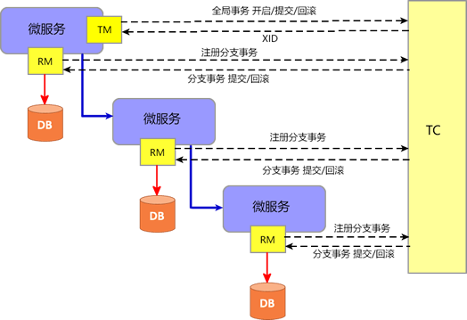

# 微服务

微服务体积小，复杂度低，专注于做好一件事。

将传统的单体式架构（ALL IN ONE）拆分为多个小型服务，每个服务都可以独立部署。服务之间的通信经过抽象，让不同编程语言的产品之间也可相互通信，完成业务所需要的通信。


# Spring Cloud

一系列微服务解决方案、框架的集合，将市面上成熟的、经过验证的微服务框架整合起来，并通过 SpringBoot 的思想进行再封装（屏蔽掉其中复杂配置和实现原理），为开发人员提供简单易用的微服务架构

~~~mermaid
flowchart TD;
	Eureka-->A(((服务中心)))
	Nacos-->I
	Nacos-->A
	Config-->I(((配置中心)))
	Ribbon-->|LoadBalancer负载均衡|B
	Feign--声明式-->B
	A===B(((服务调用)))
	Hystrix-->|停止维护|C
	Sentinel-->C
	B===C(((熔断降级)))
~~~

~~~mermaid
flowchart TD;
	Gateay-->D(((网关)))
	Seata-->E(((分布式事务)))
	Rocket-->F(((消息队列)))
	OSS-->G(((对象存储)))
	Dubbo-->H(((RPC)))
~~~

# 服务中心

## Eureka

古希腊语，意为“发现了”


1. 创建 Maven 项目

   主工程使用 dependencyManagement 声明 Spring Cloud 的统一版本，后续*moudle*引入*SpringCloud*组件不需要声明版本

   ~~~xml
   <properties>
       ...
   </properties>
   
   <dependencyManagement>
       <dependencies>
           <dependency>
               <groupId>org.springframework.cloud</groupId>
               <artifactId>spring-cloud-dependencies</artifactId>
               <version>Hoxton.SR12</version>
               <type>pom</type>
               <scope>import</scope>
           </dependency>
       </dependencies>
   </dependencyManagement>
   ~~~

2. ### 创建 common Module

   公共模块创建一个实体，其他微服务模块引入公共模块

   ```java
   @Data
   public class Dept {
       private Integer deptNo;
       private String deptName;
       private String dbSource;
   }
   ```
   
3. ### 搭建 Eureka Server

   搭建服务中心

   ```xml
   <dependency>
       <groupId>org.springframework.cloud</groupId>
       <artifactId>spring-cloud-starter-netflix-eureka-server</artifactId>
   </dependency>
   ```

   application.yml

   ```yml
   server:
     port: 7001
     
   eureka:
     instance:
       hostname: localhost                
     client:
       register-with-eureka: false        # 不向注册中心注册本服务
       fetch-registry: false              # false表示本服务就是注册中心
       service-url:
         defaultZone: http://${eureka.instance.hostname}:${server.port}/eureka/
         # 集群，使用逗号（,）分割多个地址
         # defaultZone: http://eureka7001.com:7001/eureka/,http://eureka7002.com:7002/eureka/
   ```

   启动类上使用 `@EnableEurekaServer` ，访问 http://localhost:7001/

   >配置多个 Eureka Server，实现注册中心的相互注册及监控

4. ### 搭建微服务并注册

   ```xml
   <!--引入 Eureka Client 的依赖-->
   <dependency>
       <groupId>org.springframework.cloud</groupId>
       <artifactId>spring-cloud-starter-netflix-eureka-client</artifactId>
   </dependency>
   ```

   application.yml

   ```yml
   server:
     port: 8001
     
   spring:
     application:
       name: serviceName  #微服务名称
   
   eureka:
     client: 
       service-url:
       # 将本服务注册到eureka
         defaultZone: http://localhost:7001/eureka/
         # defaultZone: http://eureka7001.com:7001/eureka/,http://eureka7002.com:7002/eureka/
     instance:
       instance-id: provider-8001 #服务名称信息
       prefer-ip-address: true  #显示访问路径的 ip 地址
   ```

   启动类 `@EnableEurekaClient`


### 自我保护机制

Eureka Server 在一段时间内没有接收到 Eureka Client 的心跳，会启动自我保护机制，不会直接从服务注册表中移除该服务，这样当服务恢复时不需要再次注册，弊端是自我保护机制期间，服务消费者就很容易获取到已经不存在的服务进而出现调用失败的情况

默认开启，如果想要关闭：

```yml
eureka:
  server:
    enable-self-preservation: false # false 关闭 Eureka 的自我保护机制，默认是开启,一般不建议大家修改
```


## [Nacos](https://nacos.io/zh-cn/index.html)

具备服务中心、配置中心的功能，C/S 架构


1. ### 搭建 Server

   下载 [Nacos Server](https://github.com/alibaba/nacos/releases)进入 bin 目录，打开终端

   单机模式启动

   ```bash
   startup.cmd -m standalone
   # 或者
   ./startup.cmd -m standalone
   ```

   访问 [Nacos 界面](http://localhost:8848/nacos)

2. ### 服务注册

   系统中向 Server 注册服务或者调用服务的微服务都是 Client

   先注册一个服务

   ~~~xml
   <dependency>
       <groupId>com.alibaba.cloud</groupId>
       <artifactId>spring-cloud-starter-alibaba-nacos-discovery</artifactId>
   </dependency>
   ~~~

   ~~~yml
   server:
     port: 8001
   
   spring:
     application:
       name: provider
     cloud:
       nacos:
         discovery:
           server-addr: 127.0.0.1:8848
   ~~~

   启动类 `@EnableDiscoveryClient`

   ```java
   @RestController
   public class DeptController {
   
       @GetMapping(value = "/nacosClient")
       public String getPayment(@PathVariable("id") Integer id) {
           return "okok";
       }
   }
   ```

   启动之后就将服务注册到 Nacos Server 上了

3. ### 服务调用

   ~~~xml
   <dependency>
       <groupId>com.alibaba.cloud</groupId>
       <artifactId>spring-cloud-starter-alibaba-nacos-discovery</artifactId>
   </dependency>
   
   <!--新版本的 Nacos discovery 都已经移除了 Ribbon ，引入组件 loadbalancer 进行服务调用 -->
   <dependency>
       <groupId>org.springframework.cloud</groupId>
       <artifactId>spring-cloud-loadbalancer</artifactId>
   </dependency>
   ~~~

   ~~~yml
   server:
     port: 8801
     
   spring:
     application:
       name: consumer
     cloud:
       nacos:
         discovery:
           server-addr: 127.0.0.1:8848
   ~~~

   启动类 `@EnableDiscoveryClient`

   ```java
   @Configuration
   public class ApplicationContextBean {
   
       @Bean
       @LoadBalanced
       public RestTemplate getRestTemplate() {
           return new RestTemplate();
       }
   }
   
   ```

   ```java
   @RestController
   public class DeptController_Consumer {
   
       @Resource
       private RestTemplate restTemplate;
   
       @GetMapping("/consumer")
       public String getDeptById() {
           // 127.0.0.1:8001 应该替换为Provider 的 spring.application.name 值
           return restTemplate.getForObject("http://127.0.0.1:8001/nacosClient/", String.class);
       }
   }
   ```


   访问 http://localhost:8801/consumer

# 配置中心

## Nacos

1. ### 访问 [Nacos](http://localhost:8848/nacos) 添加配置文件

   配置文件命名依据

   ```
   ${prefix}-${spring.profiles.active}.${file-extension}
   ```

   **${prefix}** —— 默认 spring.application.name，配置 spring.cloud.nacos.config.prefix 覆盖默认值 

   **${spring.profiles.active}** —— 环境（dev、test、prod ）,没有指定环境的 Profile 时，命名格式变成 ${prefix}.${file-extension}

   **${file-extension}** —— 配置文件后缀（properties | yaml）

   ```
   Data ID:        config.yaml
   
   Group  :        DEFAULT_GROUP
   
   配置格式:        YAML
   
   配置内容:        config:
                     info: SangYU
   ```

   

2. ### 从 Nacos Server 获取配置

   <!--Spring Cloud 2020 及以后的版本默认不启用 bootstrap 配置，引入-->

   ```xml
   <dependency>
       <groupId>com.alibaba.cloud</groupId>
       <artifactId>spring-cloud-starter-alibaba-nacos-config</artifactId>
   </dependency>
   
   <dependency>
       <groupId>com.alibaba.cloud</groupId>
       <artifactId>spring-cloud-starter-alibaba-nacos-discovery</artifactId>
   </dependency>
   
   <dependency>
       <groupId>org.springframework.cloud</groupId>
       <artifactId>spring-cloud-starter-bootstrap</artifactId>
   </dependency>
   ```

   ```yml
   server:
     port: 3377
   spring:
     application:
       name: ServiceName
       
     cloud:
       nacos:
         discovery:
           server-addr: 127.0.0.1:8848
         config:
           server-addr: 127.0.0.1:8848 # Nacos 作为配置中心
           prefix: config				# 对应 Nacos Server 配置文件的名称，默认是spring.application.name
           file-extension: yaml        # 指定 yaml 格式的配置
           
           namespace: ......... 		# 命名空间
           group: ......... 			# 分组
   ```

   Controller 层

   ~~~java
   @RestController
   @RefreshScope
   public class ConfigClientController {
       
       @Value("${config.info}")
       private String configInfo;
   
       @GetMapping("/config/info")
       public String getConfigInfo(){
           return configInfo;
       }
   }
   ~~~

   启动类 `@EnableDiscoveryClient`


# 服务调用

## Ribbon

基于 RestTemplate  的客户端负载均衡器

```xml
<!--Spring Cloud Ribbon 依赖-->
<dependency>
    <groupId>org.springframework.cloud</groupId>
    <artifactId>spring-cloud-starter-netflix-ribbon</artifactId>
</dependency>
```

```yml
server:
  port: 80

eureka:
  client:
    register-with-eureka: false  # 不需要将自己注册到服务注册中心
    fetch-registry: true         # 获取可用服务列表
    service-url:
      defaultZone: http://eureka7001.com:7001/eureka
```

```java
@Configuration
public class ConfigBean {
    
    @Bean
    @LoadBalanced
    public RestTemplate getRestTemplate() {
        return new RestTemplate();
    }
    
    // 负载均衡
    @Bean
    public IRule myRule() {
        return  new RandomRule();
    }
}
```

```java
@RestController
public class DeptController_Consumer {

    //Service Provider 的 application.name
    private static final String REST_URL_PROVIDER_PREFIX = "http://serviceName";

    @Autowired
    private RestTemplate restTemplate;

	...业务
}
```

由于此服务只有一个提供者，需要再建立相同服务的提供者，才可进行负载均衡。


## OpenFeign

集成了 Ribbon 实现客户端负载均衡，并且是声明式的服务调用

| 注解                | 说明                                                         |
| ------------------- | ------------------------------------------------------------ |
| @FeignClient        | name = “{spring.application.name}” 绑定 Service Provider 提供的服务<br>path = "/base/path" 指定基础路径 |
| @EnableFeignClients | 启动类开启 OpenFeign，扫描 @FeignClient 注解的接口，生成代理并注册到 Spring 容器中 |


```xml
<!--Eureka Client 依赖-->
<dependency>
    <groupId>org.springframework.cloud</groupId>
    <artifactId>spring-cloud-starter-netflix-eureka-client</artifactId>
</dependency>
<!-- Ribbon 依赖-->
<dependency>
    <groupId>org.springframework.cloud</groupId>
    <artifactId>spring-cloud-starter-netflix-ribbon</artifactId>
</dependency>
<!--添加 OpenFeign 依赖-->
<dependency>
    <groupId>org.springframework.cloud</groupId>
    <artifactId>spring-cloud-starter-openfeign</artifactId>
</dependency>
```

```yml
server:
  port: 80

eureka:
  client:
    register-with-eureka: false
    fetch-registry: true
    service-url:
      defaultZone: http://eureka7001.com:7001/eureka/
```

绑定其他微服务提供的服务，接口中定义的每个方法都与服务提供者中 Controller 定义的服务方法对应

```java
@Component
@FeignClient(value = "serviceName")
public interface FeignService {
    
    @RequestMapping(value = "/dept/get/{id}", method = RequestMethod.GET)
    public .. get(@PathVariable("id") int id);

}
```

controller 层发起服务调用

```java
@RestController
public class Consumer2 {
    
    @Resource
    private FeignService feignService;

	...
}
```

启动类上添加 `@EnableFeignClients`


### 超时控制

OpenFeign 客户端的默认超时时间为 1 秒钟，如果服务端处理请求的时间超过 1 秒就会报错。

```yml
ribbon:
  ReadTimeout: 6000         # 建立连接后，服务器读取到可用资源的时间
  ConnectionTimeout: 6000   # 建立连接所用的时间
```

### 日志增强

```yml
logging:
  level:
    xxx.xxx.xxx.service.FeignService: debug
```

以上配置的含义就是，OpenFeign 以 debug 级别监控 nxxx.xxx.xxx.service.FeignService 接口


配置了监控的接口，需要配置监控的内容：

```java
@Configuration
public class ConfigBean {
    
    @Bean
    Logger.Level feginLoggerLevel() {
        return Logger.Level.FULL;
    }
}
```

Logger.Level 的具体级别如下：

1. NONE
2. BASIC —— 仅记录请求方法、URL 以及响应状态码和执行时间。
3. HEADERS —— BASIC 基础上，还会记录请求和响应的头信息。
4. FULL —— 记录所有请求与响应的明细


# 熔断降级

## Hystrix

意为“豪猪”，豪猪长满背刺，使它拥有强大的自保能力

当一个服务提供者出现故障，故障会沿着调用链疯狂蔓延，最终导致系统瘫痪，所以需要在故障期间对服务调用进行限流、熔断等操作，避免故障蔓延

<span style='font-size: 22px'>主要功能</span>

1. **断路器（Circuit Breaker）**: Hystrix 提供了断路器模式的实现，用于防止故障在整个系统中的传播。当某个服务或依赖出现故障时，Hystrix 可以自动切断对该服务的请求，避免对系统的进一步负载，并提供快速失败的响应。
2. **回退机制（Fallback）**: Hystrix 允许开发人员定义备选方案（fallback），当主要服务不可用时，可以执行备选方案以提供部分功能或默认值。这样可以避免用户直接面对错误或等待过长的响应时间。
3. **请求缓存和请求合并**: 通过请求缓存，可以避免重复发送相同的请求，减少对后端服务的压力和网络开销。通过请求合并，可以将多个请求合并为一个批量请求，减少通信开销并提高性能。
4. **实时监控**
5. **线程池隔离**: Hystrix 通过线程池隔离机制，为每个依赖服务分配独立的线程池。这样可以避免某个依赖服务的故障影响到整个系统的线程池，提高系统的稳定性和可靠性。
6. **超时和资源限制**: Hystrix 允许设置请求的超时时间和资源限制，当请求超过预设的时间或资源限制时，Hystrix 可以快速失败并触发回退机制，避免对系统资源的过度占用。


### 监控

开启自保，首先要知道当前处境，因此需要对系统进行监控

Hystrix Dashboard 会记录通过 Hystrix 发起的请求的执行信息，并以统计报表的形式展示给用户，包括每秒执行请求的数量、成功请求的数量和失败请求的数量等

```xml
<!--hystrix-dashboard 监控的依赖-->
<dependency>
    <groupId>org.springframework.cloud</groupId>
    <artifactId>spring-cloud-starter-netflix-hystrix-dashboard</artifactId>
</dependency>
```

```yml
server:
  port: 9002  #端口号

hystrix:
  dashboard:
    proxy-stream-allow-list:
      - "localhost"
```

配置监控界面

```java
@Configuration
public class HystrixDashboardConfig {
    
    @Bean
    public ServletRegistrationBean getServlet() {
        HystrixMetricsStreamServlet streamServlet = new HystrixMetricsStreamServlet();
        ServletRegistrationBean registrationBean = new ServletRegistrationBean(streamServlet);
        registrationBean.setLoadOnStartup(1);
        
        //访问路径
        registrationBean.setName("hystrix.stream");
        registrationBean.addUrlMappings("/actuator/hystrix.stream");
        return registrationBean;
    }
}
```

启动类 `@EnableHystrixDashboard`

http://eureka7001.com:9002/hystrix 熔断器监控页面

localhost:8004//actuator/hystrix.stream 监控地址


### 断路器

某个服务不可用或者响应太久时，为了保护系统的整体可用性，熔断器会暂时切断请求对该服务的调用


1. 监控微服务间调用的状况，当失败调用到一定比例，启动断路机制
2. 启动休眠时间窗，在这个时间窗内，服务降级逻辑充当业务主逻辑。
3. 请求再次调用该服务，直接调用降级逻辑快速地返回失败响应。
4. 休眠时间窗结束，Hystrix 会进入半熔断转态，允许部分请求对服务原来的主业务逻辑进行调用，并监控其调用成功率。
5. 如果调用成功率达到预期，则说明服务已恢复正常，Hystrix 进入熔断关闭状态，服务原来的主业务逻辑恢复；否则 Hystrix 重新进入熔断开启状态，休眠时间窗口重新计时，继续重复第 2 到第 5 步。

```java
public interface CircuitBreakerService {

    public String deptCircuitBreaker(Integer id);
}
```

CircuitBreakerService 的实现类重写方法

```java
@Override
@HystrixCommand(
    fallbackMethod = "fallback", 
    commandProperties = {
        //开启熔断器
        @HystrixProperty(name = "circuitBreaker.enabled", value = "true"),
        //统计时间窗
    	@HystrixProperty(name = "metrics.rollingStats.timeInMilliseconds", value = "1000"), 
        //统计时间窗内请求次数
        @HystrixProperty(name = "circuitBreaker.requestVolumeThreshold", value = "10"), 
        //在统计时间窗口期以内，请求失败率达到 60% 时进入熔断状态
        @HystrixProperty(name = "circuitBreaker.errorThresholdPercentage", value = "60"), 
        //休眠时间窗口期
        @HystrixProperty(name = "circuitBreaker.sleepWindowInMilliseconds", value = "10000")})
public String circuitBreaker(Integer id) {
    if (id < 0) {
        throw new RuntimeException("id 不能是负数！");
    }
    return "调用成功";
}

public String fallback(Integer id) {
    return "降级" + id;
}
```

| 参数                                     | 描述                                                         |
| ---------------------------------------- | ------------------------------------------------------------ |
| metrics.rollingStats.timeInMilliseconds  | 统计时间窗。                                                 |
| circuitBreaker.requestVolumeThreshold    | 统计时间窗内，请求总数必须到达一定的数量级                   |
| circuitBreaker.errorThresholdPercentage  | 请求总数在统计时间窗内超过了请求总数阀值，且请求调用出错率超过一定的比例，Hystrix 将熔断器打开。 |
| circuitBreaker.sleepWindowInMilliseconds | 休眠时间窗结束，熔断器会自动进入半熔断状态。                 |


controller

```java
@RequestMapping(value = "/hystrix/circuit/{id}")
public String circuitBreaker(@PathVariable("id") Integer id){
    return circuitBreakerService.circuitBreaker(id);
}
```


### 服务降级

#### 服务端降级

```xml
<!--添加 Spring Boot 的监控模块-->
<dependency>
    <groupId>org.springframework.boot</groupId>
    <artifactId>spring-boot-starter-actuator</artifactId>
</dependency>
<!-- eureka 客户端-->
<dependency>
    <groupId>org.springframework.cloud</groupId>
    <artifactId>spring-cloud-starter-netflix-eureka-client</artifactId>
</dependency>
<!--hystrix 依赖-->
<dependency>
    <groupId>org.springframework.cloud</groupId>
    <artifactId>spring-cloud-starter-netflix-hystrix</artifactId>
</dependency>
```

```java
public interface Service1 {
    
    // hystrix 熔断器示例 ok
    public String info_Ok(Integer id);
    
    //hystrix 熔断器超时案例
    public String info_Timeout(Integer id);
}
```

```java
@Service("service1")
public class Service1Impl implements Service1 {
    
    @Override
    public String info_Ok(Integer id) {
        return "ok";
    }
    
    // 方法超过 @HystrixProperty 设定值，调用 fallbackMethod 指定的方法
    @HystrixCommand(fallbackMethod = "fallbackMethod", commandProperties = {@HystrixProperty(name = "execution.isolation.thread.timeoutInMilliseconds", value = "5000")})
    @Override
    public String info_Timeout(Integer id) {
        int outTime = 6;
        try {
            TimeUnit.SECONDS.sleep(outTime);
        } catch (InterruptedException e) {
            e.printStackTrace();
        }
        return " 耗时: " + outTime;
    }
    
    public String fallbackMethod() {
       return  "稍后再试！";
    }
}
```

controll 调用 service 方法

```java
@RestController
@Slf4j
public class DeptController {
    
    @Autowired
    private Service1Impl service1Impl;
    
    @RequestMapping(value = "/hystrix/ok/{id}")
    public String deptInfo_Ok(@PathVariable("id") Integer id) {
        return service1Impl.info_Ok(id);
    }
    
    // Hystrix 服务超时降级
    @RequestMapping(value = "/hystrix/timeout/{id}")
    public String deptInfo_Timeout(@PathVariable("id") Integer id) {
        return service1Impl.info_Timeout(id);
    }
}
```

主启动类上，使用 `@EnableCircuitBreaker`

#### 客户端降级

通常情况下在客户端进行服务降级，当客户端调用的服务端的服务不可用时，客户端直接进行服务降级处理，避免其线程被长时间、不必要地占用。

```xml
<!--hystrix 依赖-->
<dependency>
    <groupId>org.springframework.cloud</groupId>
    <artifactId>spring-cloud-starter-netflix-hystrix</artifactId>
</dependency>
```

```yml
feign:
  hystrix:
    enabled: true #开启客户端 hystrix
```

```java
@Component
@FeignClient(value = "serviceName")
public interface HystrixService {
    
    @RequestMapping(value = "/hystrix/ok/{id}")
    public String info_Ok(@PathVariable("id") Integer id);
    
    @RequestMapping(value = "/hystrix/timeout/{id}")
    public String info_Timeout(@PathVariable("id") Integer id);
}
```

```java
@Slf4j
@RestController
public class HystrixController_Consumer {
    
    @Resource
    private HystrixService hystrixService;
    
    @RequestMapping(value = "/consumer/hystrix/ok/{id}")
    public String deptInfo_Ok(@PathVariable("id") Integer id) {
        return hystrixService.iInfo_Ok(id);
    }

    @RequestMapping(value = "/consumer/hystrix/timeout/{id}")
    @HystrixCommand(fallbackMethod = "timeoutHandler")
    public String deptInfo_Timeout(@PathVariable("id") Integer id) {
        return hystrixService.info_Timeout(id);
    }
    
    public String timeoutHandler(Integer id) {
        return "deptInfo_Timeout 出错，服务已被降级！;
    }
}
```

`@EnableEurekaClient` 

`@EnableCircuitBreaker`

#### 全局降级

@DefaultProperties 通过其 defaultFallback 属性指定一个全局的降级方法

```java
@Slf4j
@RestController
@DefaultProperties(defaultFallback = "global_FallbackMethod") 
public class HystrixController_Consumer {
    
    @Resource
    private HystrixService hystrixService;
	
    public String global_FallbackMethod() {
        return "降级";
    }
    
    @RequestMapping(value = "/consumer/hystrix/timeout/{id}")
    @HystrixCommand
    public String deptInfo_Timeout(@PathVariable("id") Integer id) {
        String s = hystrixService.info_Timeout(id);
        log.info(s);
        return s;
    }
}
```

> **注意**：降级（FallBack）方法必须与其对应的业务方法在同一个类中，否则无法生效
>
> ​	 全局降级方法的优先级低于业务方法指定其降级方法

#### 解耦降级逻辑

不管是业务方法指定的降级方法还是全局降级方法，它们都必须和业务方法在同一个类中才能生效，业务逻辑与降级逻辑耦合度极高。

```java
@Component
public class HystrixFallBackService implements HystrixService {
    
    @Override
    public String deptInfo_Ok(Integer id) {
        return "ok";
    }
    @Override
    public String deptInfo_Timeout(Integer id) {
        return "降级";
    }
}
```

> **注意**： @Component 注解

在 HystrixService 标注的 @FeignClient 注解中添加 fallback 属性

~~~java
@Component
@FeignClient(value = "serviceName", fallback = HystrixFallBackService.class)
public interface DeptHystrixService {
	....
}
~~~

## Sentinel

实时监控，以流量为切入点提供流量控制、熔断降级和负载保护等功能

将服务里的内容定义为资源，并对资源设定规则

```xml
<!--Snetinel 依赖-->
<dependency>
    <groupId>com.alibaba.cloud</groupId>
    <artifactId>spring-cloud-starter-alibaba-sentinel</artifactId>
</dependency>
```

```yml
server:
  port: 8401
  
spring:
  application:
    name: sentinel-service
    
  cloud:
    nacos:
      discovery:
        server-addr: localhost:1111
    sentinel:
      transport:
        dashboard: localhost:8080
        port: 8719
```

```java
@RestController
public class SentinelFlowLimitController {
    
    @GetMapping("/testA")
    public String testA() {
        return "a";
    }
    @GetMapping("/testB")
    public String testB() {
        return "b";
    }
}
```

启动类 `@EnableDiscoveryClient`


### 监控

[Sentinel Dashboard](https://github.com/alibaba/Sentinel/releases) 是一个 jar 包，打开终端启动

```
java -jar sentinel-dashboard-xxx.jar
```

### 资源定义

1. 使用 @SentinelResource  注解定义资源 

2. 使用 SphU 类，tra-catch 风格

   ```java
   public String testAbySphU() {
       Entry entry = null;
       try {
           entry = SphU.entry("testAbySphU");
           return "testA--ok：";
       } catch (BlockException e1) {
           return "testA 服务被限流";
       } finally {
           if (entry != null) entry.exit();
       }
   }
   ```

3. 使用 SphO 类，if-else 风格

   ```java
   public String testBbySphO() {
       if (SphO.entry("testBbySphO")) {
           try {
               return "testB--ok";
           } finally {
               SphO.exit();
           }
       } else {
           return "testB 服务被限流";
       }
   }
   ```


### 资源规则

一个资源可以创建多条流控规则，Sentinel 会遍历这些规则，直到有规则触发限流

1. Dashboard 设定

2. FlowRuleManager 类的 loadRules() 方法

   ~~~java
   private static void initFlowRules() {
       List<FlowRule> rules = new ArrayList<>();	// 存储多条流控规则
       FlowRule rule = new FlowRule(); 			// 创建一条规则
       rule.setResource("testD-resource");			//资源名称
       rule.setGrade(RuleConstant.FLOW_GRADE_QPS);	//限流阈值的类型
       rule.setCount(2);
       rules.add(rule);
       FlowRuleManager.loadRules(rules);
   }
   ~~~


### 熔断器

与 Hystrix 熔断器大概一致


# 网关

一个系统往往由多个微服务组成，而这些服务可能部署在不同机房、不同地区、不同域名下。这种情况下，客户端（例如手机、浏览器、软件工具等）想要直接请求这些服务，就要知道它们的 IP 和端口号等信息，很复杂并且缺点很多

- 维护大量的服务器地址
- 跨域请求
- 身份认证的难度大


网关是一个搭建客户端和微服务之间的服务，像是系统的门面，提供对系统访问的唯一入口


✅ 只需知道网关地址，降低用户和系统耦合度

✅ 节流

✅ 权限验证

✅ 流量监控

.....

## Gateway

网关如此庞大，负责全部微服务的请求转发，因此需要配置请求的转发规则，即路由规则

### 路由规则

由四部分组成

- ID
- URI
- 一组 Predicate —— 根据请求信息进行路由转发
- 一组 Filter —— 对请求和相应进行修改

由此可见，路由规则必须配置 Predicate


<!--特别注意：在 gateway 网关服务中不能引入 spring-boot-starter-web 的依赖，否则会报错-->

```xml
<!-- Spring cloud gateway 网关依赖-->
<dependency>
    <groupId>org.springframework.cloud</groupId>
    <artifactId>spring-cloud-starter-gateway</artifactId>
</dependency>
<!--Eureka 客户端-->
<dependency>
    <groupId>org.springframework.cloud</groupId>
    <artifactId>spring-cloud-starter-netflix-eureka-client</artifactId>
</dependency>
```

```yml
server:
  port: 9527
spring:
  application:
    name: Gateway
  cloud:
    gateway: #网关路由配置
      routes:
        - id: provider_dept_list_routh   # 路由 id,唯一
          uri: http://localhost:8001     # 路由目标
          predicates:
            - Path=/**/**
            - Method=GET
eureka:
  instance:
    instance-id: gateway-9527
    hostname: gateway
  client:
    fetch-registry: true
    register-with-eureka: true
    service-url:
      defaultZone: http://eureka7001.com:7001/eureka/
```

启动类 `@EnableEurekaClient` 


### 动态路由

配置文件中 Route 的 uri 地址修改为以下形式

```yml
uri: lb://service-name
```

- lb：协议

- service-name：服务名

  > 根据服务名，便可开启负载均衡


# 分布式事务

## [Seata](https://seata.io/zh-cn/docs/overview/what-is-seata.html)

C/S 架构


**XID** —— 全局事务 ID

**TC (Transaction Coordinator)** - 事务协调者（Seata Server），维护全局和分支事务的状态，驱动全局事务提交或回滚

**TM (Transaction Manager)** - 事务管理器（Seata Client），定义全局事务的范围：开始全局事务、提交或回滚全局事务

**RM (Resource Manager)** - 资源管理器（Seata Client），与 TC 交谈以注册分支事务和报告分支事务的状态，并驱动分支事务提交或回滚。




### [Seata Server](https://github.com/seata/seata/releases)

| 数据存储模式 | 说明                                                         | 准备工作     |
| ------------ | ------------------------------------------------------------ | ------------ |
| file         | 文件存储模式，默认存储模式；  该模式为单机模式，全局事务的会话信息在内存中读写，并持久化本地文件 root.data，性能较高 |              |
| db           | 数据库存储模式；  该模式为高可用模式，全局事务会话信息通过数据库共享，性能较低。 | 建数据库表   |
| redis        | 缓存处处模式；  Seata Server 1.3 及以上版本支持该模式，性能较高，但存在事务信息丢失风险, | redis 持久化 |


<span style='font-size: 24px'>DB 模式</span>

1. 创建一个 seata 的数据库，根据[DB SQL](https://github.com/seata/seata/tree/develop/script/server)建表

2. 编辑 DB 模式所需要的配置，根据 [Seata Server 配置文件](https://github.com/seata/seata/tree/develop/script/config-center)目录下的 config.txt 修改

   ```properties
   store.mode=db
   store.db.datasource = druid
   store.db.dbType = mysql
   
   store.db.driverClassName=com.mysql.cj.jdbc.Driver
   store.db.url=jdbc:mysql://127.0.0.1:3306/seata?useSSL=false&characterEncoding=UTF-8&useUnicode=true&serverTimezone=UTC 
   store.db.user=root 
   store.db.password=123456
   
   # 自定义事务分组
   service.vgroupMapping.service-order-group=default 
   service.vgroupMapping.service-storage-group=default
   service.vgroupMapping.service-account-group=default 
   ```

3. 修改配置文件，将 Seate Server 的服务和配置中心修改为 Nacos

   ```
   registry {
     type = "nacos"
     nacos {
       application = "seata-server"
       serverAddr = "127.0.0.1:1111" # 修改 nacos 的地址
       group = "SEATA_GROUP"
       namespace = ""
       cluster = "default"
       username = ""
       password = ""
     }
   }
   config {
     type = "nacos"
     nacos {
       serverAddr = "127.0.0.1:1111" # 修改为使用的 nacos 服务器地址
       namespace = ""
       group = "SEATA_GROUP"
       username = "nacos"
       password = "nacos"
       #不使用 seataServer.properties 方式配置
       #dataId = "seataServer.properties"
     }
   }
   ```

4. 配置了 Nacos 为配置中心后，可以将数据存储模式的相关配置上传到 Nacos

   在[Seata Server 配置中心](https://github.com/seata/seata/tree/develop/script/config-center)选定注册中心文件夹，右键鼠标选择 Git Bush Here

   ```
   sh nacos-config.sh -h 127.0.0.1 -p 8848  -g SEATA_GROUP -u nacos -w nacos
   ```

   > 上传前先确保 Nacos 服务器已启动

   当 Git 命令窗口出现以下执行日志时，则说明配置上传成功，注释不会被上传，所以显示失败6个

   

5. bin 目录下的启动脚本 seata-server.bat ，启动 Seata Server


### Seata Client

[配置参考](https://github.com/seata/seata/tree/develop/script/client)

```yml
seata:
  config:
    type: nacos
    nacos:
      server-addr: 127.0.0.1:8848
      group : "SEATA_GROUP"
      namespace: ""
      username: "nacos"
      password: "nacos"
```


### AT 模式

2PC 的演变版本，默认方案

> AT 模式需要为每一个业务数据库建立一张表 [undo_log](https://github.com/seata/seata/tree/develop/script/client/at/db)


- 一阶段：业务数据和回滚日志记录在同一个本地事务中提交，释放本地锁和连接资源。
- 二阶段：
  - 提交异步化，非常快速地完成。
  - 回滚通过一阶段的回滚日志进行反向补偿。


<span style='font-size: 22px'>写隔离</span>

一阶段本地事务提交前，需要拿到<span style='font-size: 20px'>全局锁</span>，获取<span style='font-size: 20px'>全局锁</span>的尝试被限制在一定范围内，超出范围将放弃，并回滚本地事务，释放本地锁

eg：两个全局事务 t1 和 t2，分别对 a 表的 m 字段进行更新操作

不回滚的情况：

~~~mermaid
sequenceDiagram
	note left of t1: t1 先开始，拿到本地锁修改数据<br>获取全局锁进行本地事务提交
	t1->>t2: t1 释放了本地锁
	note right of t2: t2 开始执行本地事务<br>尝试获取全局锁进行本地事务提交
	loop
		t2->>t2 :t1 尚未释放全局锁，t2 循环重试
	end
	note left of t1: t1 完成了全局事务提交
	t1->>t2: t1 释放了全局锁
	note right of t2: t2 本地事务提交
~~~

存在事务回滚情况下：

~~~mermaid
sequenceDiagram
	note left of t1: t1 先开始，拿到本地锁修改数据<br>获取全局锁进行本地事务提交
	t1->>t2: t1 释放了本地锁
	note right of t2: t2 开始执行本地事务<br>尝试获取全局锁进行本地事务提交
	loop
		t2->>t2 :t1 尚未释放全局锁，t2 循环重试
	end
	rect rgb(255, 0, 0)
	note left of t1: 全局事务回滚<br>需要获取本地锁，进行本地事务回滚
	loop
		t1->>t1 :t2 尚未释放本地锁，t1 循环重试获取
	end
	end
	loop
		t2->>t2 :t2 还在尝试获取全局锁，即将放弃
	end
	t2->>t1: t2 获取不到全局锁，放弃事务<br>本地事务回滚，释放了本地锁
	note left of t1: t1 完成本地事务回滚
~~~

<span style='font-size: 22px'>读隔离</span>

在数据库本地事务隔离级别读已提交或以上的基础上，AT 模式的默认全局隔离级别是读未提交

如若要求全局的读已提交，目前 Seata 的方式是通过 SELECT FOR UPDATE 语句的代理

~~~mermaid
sequenceDiagram
	note left of t1: t1 先开始，拿到本地锁修改数据<br>获取全局锁进行本地事务提交
	t1->>t2: t1 释放了本地锁
	note right of t2: t2 想要查询此数据，需要获取全局锁
	loop
		t2->>t2 :t1 尚未释放全局锁<br>t2 释放本地锁，回滚SELECT FOR UPDATE的执行<br>重试
	end
	note left of t1: t1 完成了全局事务提交 | 全局事务回滚
	t1->>t2: t1 释放了全局锁
	note right of t2: t2 查询到了数据
~~~

出于总体性能上的考虑，Seata 目前的方案并没有对所有 SELECT 语句都进行代理，仅针对 FOR UPDATE 的 SELECT 语句。

### TCC 模式

AT 模式会自动提交或回滚，因此需要数据库支持事务的 ACID 操作，而 TCC 模式不依赖于底层数据库的事务支持，自定义一阶段和二阶段操作逻辑

### [Saga 模式](https://seata.io/zh-cn/docs/user/saga.html)

长事务解决方案，在Saga模式中，业务流程中每个参与者都提交本地事务，当出现某一个参与者失败则补偿前面已经成功的参与者，一阶段正向服务和二阶段补偿服务都由业务开发实现


理论基础：Hector & Kenneth 发表论⽂ Sagas （1987）

✅ 一阶段提交本地事务，无锁，高性能

✅ 事件驱动架构，参与者可异步执行，高吞吐

✅ 补偿服务易于实现

❌ 不保证隔离性[用户文档


### XA 模式

强一致性


### 事务分组

事务分组：seata的资源逻辑，可以按微服务的需要，在应用程序（客户端）对自行定义事务分组，每组取一个名字。

应用程序（客户端）使用时可以指定事务分组与 Seata 集群的映射关系。


事务分组如何确定 Seata Server 集群？

1. 配置中心上传事务分组对应的 Seata Server集群名

   ```
   service.vgroupMapping.{事务分组}=TCCluster
   ```

   具体配置

   ```
   service.vgroupMapping.sangyu=TCCluster
   ```

2. Seata Client 中 yml配置事务分组

   ```yml
   spring:
   	cloud:
        alibaba:
         seata:
           tx-service-group: sangyu  #设置事务分组
   ```

3. Seata Client 在启动时，会从 application.yml 的配置中获取事务分组：`sangyu`

4. 使用事务分组 `sangyu` 根据`service.vgroupMapping.{事务分组}`拼接成`service.vgroupMapping.sangyu`，并在配置中心获取该配置的值

5. 获得集群名称后，应用通过一定的前后缀 + 集群名称去构造服务名。

6. 得到服务名后，去注册中心去拉取服务列表，获得后端真实的 TC 服务列表。


### 示例

电商系统为例，演示一个订单过程。

电商系统中用户下单购买一件商品，需要3个服务提供支持：

- Order（订单服务）：创建和修修改订单
- Storage（库存服务）：对指定的商品扣除库存
- Account（账户服务）：扣除账户余额


3个微服务分别使用各不同的数据库，架构图如下：


当用购买一件商品，服务调用流程如下：

1. 调用Order服务，创建一条订单数据，订单状态位“未完成”
2. 调用 Storage服务，扣除商品库存
3. 调用Account服务，扣减账户余额
4. 调用Order服务，将订单状态修改为“已完成”


#### Order服务

1）创建数据库实例seata_order

~~~sql
create database seata_order
~~~


一条订单数据，包含的内容有:

| id   | 用户id | 商品id | 商品数量 | 金额 | 订单状态 |
| ---- | ------ | ------ | -------- | ---- | -------- |

~~~sql
create table t_order(
    `id` bigint not null auto_increment,
    `user_id` bigint not null comment '用户id',
    `product_id` bigint not null comment '商品id',
    `count` int default null COMMENT '数量',
    `money` decimal(11,0) DEFAULT NULL COMMENT '金额',
    `status` INT DEFAULT NULL COMMENT '订单状态：0-未完成；1-完成',
    PRIMARY KEY (`id`)
) AUTO_INCREMENT = 32
~~~


回滚日志

~~~sql
CREATE TABLE `undo_log` (
  `branch_id` bigint NOT NULL COMMENT 'branch transaction id',
  `xid` varchar(128) NOT NULL COMMENT 'global transaction id',
  `context` varchar(128) NOT NULL COMMENT 'undo_log context,such as serialization',
  `rollback_info` longblob NOT NULL COMMENT 'rollback info',
  `log_status` int NOT NULL COMMENT '0:normal status,1:defense status',
  `log_created` datetime(6) NOT NULL COMMENT 'create datetime',
  `log_modified` datetime(6) NOT NULL COMMENT 'modify datetime',
  UNIQUE KEY `ux_undo_log` (`xid`,`branch_id`)
) ENGINE=InnoDB DEFAULT CHARSET=utf8 ;
~~~


2）在主工程 spring-cloud-alibaba-demo 下，创建一个名为 spring-cloud-alibaba-seata-order-1011 的 Spring Boot 模块，并在其 pom.xml 中添加以下依赖，内容如下。

~~~xml
<?xml version="1.0" encoding="UTF-8"?>
<project xmlns="http://maven.apache.org/POM/4.0.0" xmlns:xsi="http://www.w3.org/2001/XMLSchema-instance"
         xsi:schemaLocation="http://maven.apache.org/POM/4.0.0 https://maven.apache.org/xsd/maven-4.0.0.xsd">
    <modelVersion>4.0.0</modelVersion>

    <parent>
        <artifactId>spring-cloud-alibaba-demo</artifactId>
        <groupId>com.example</groupId>
        <version>1.0-SNAPSHOT</version>
    </parent>

    <groupId>com.example</groupId>
    <artifactId>spring-cloud-alibaba-seata-order-1011</artifactId>
    <version>0.0.1-SNAPSHOT</version>
    <name>spring-cloud-alibaba-seata-order-1011</name>
    <description>spring-cloud-alibaba-seata-order-1011</description>
    <properties>
        <java.version>1.8</java.version>
    </properties>
    <dependencies>

		<!--nacos服务注册中心-->
        <dependency>
            <groupId>com.alibaba.cloud</groupId>
            <artifactId>spring-cloud-starter-alibaba-nacos-discovery</artifactId>
        </dependency>

        <dependency>
            <groupId>org.springframework.boot</groupId>
            <artifactId>spring-boot-starter-web</artifactId>
        </dependency>

        <!--引入 OpenFeign 的依赖-->
        <dependency>
            <groupId>org.springframework.cloud</groupId>
            <artifactId>spring-cloud-starter-openfeign</artifactId>
        </dependency>
        <dependency>
            <groupId>org.springframework.cloud</groupId>
            <artifactId>spring-cloud-loadbalancer</artifactId>
        </dependency>
        
        <!--引入 seata 依赖-->
        <dependency>
            <groupId>com.alibaba.cloud</groupId>
            <artifactId>spring-cloud-starter-alibaba-seata</artifactId>
        </dependency>

        <dependency>
            <groupId>org.springframework.boot</groupId>
            <artifactId>spring-boot-devtools</artifactId>
            <scope>runtime</scope>
            <optional>true</optional>
        </dependency>
        <dependency>
            <groupId>org.projectlombok</groupId>
            <artifactId>lombok</artifactId>
            <optional>true</optional>
        </dependency>
        <dependency>
            <groupId>org.springframework.boot</groupId>
            <artifactId>spring-boot-starter-test</artifactId>
            <scope>test</scope>
        </dependency>


        <dependency>
            <groupId>junit</groupId>
            <artifactId>junit</artifactId>
            <version>4.12</version>
        </dependency>
        <dependency>
            <groupId>mysql</groupId>
            <artifactId>mysql-connector-java</artifactId>
            <version>5.1.49</version>
        </dependency>
        <dependency>
            <groupId>ch.qos.logback</groupId>
            <artifactId>logback-core</artifactId>
        </dependency>
        <dependency>
            <groupId>org.mybatis.spring.boot</groupId>
            <artifactId>mybatis-spring-boot-starter</artifactId>
            <version>2.2.0</version>
        </dependency>
        <!--添加 Spring Boot 的监控模块-->
        <!-- https://mvnrepository.com/artifact/org.springframework.boot/spring-boot-starter-actuator -->
        <dependency>
            <groupId>org.springframework.boot</groupId>
            <artifactId>spring-boot-starter-actuator</artifactId>
        </dependency>
        <!--SpringCloud ailibaba sentinel -->
        <dependency>
            <groupId>com.alibaba.cloud</groupId>
            <artifactId>spring-cloud-starter-alibaba-sentinel</artifactId>
        </dependency>
        
        <!--配置中心 nacos-->
        <dependency>
            <groupId>com.alibaba.cloud</groupId>
            <artifactId>spring-cloud-starter-alibaba-nacos-config</artifactId>
        </dependency>
    </dependencies>
    
    <build>
        <plugins>
            <!--mybatis自动生成代码插件-->
            <plugin>
                <groupId>org.mybatis.generator</groupId>
                <artifactId>mybatis-generator-maven-plugin</artifactId>
                <version>1.4.0</version>
                <configuration>
                    <configurationFile>src/main/resources/mybatis-generator/generatorConfig.xml</configurationFile>
                    <verbose>true</verbose>
                    <!-- 是否覆盖，true表示会替换生成的JAVA文件，false则不覆盖 -->
                    <overwrite>true</overwrite>
                </configuration>
                <dependencies>
                    <!--mysql驱动包-->
                    <dependency>
                        <groupId>mysql</groupId>
                        <artifactId>mysql-connector-java</artifactId>
                        <version>8.0.19</version>
                    </dependency>
                    <dependency>
                        <groupId>org.mybatis.generator</groupId>
                        <artifactId>mybatis-generator-core</artifactId>
                        <version>1.4.0</version>
                    </dependency>
                </dependencies>
            </plugin>
            <plugin>
                <groupId>org.springframework.boot</groupId>
                <artifactId>spring-boot-maven-plugin</artifactId>
            </plugin>
        </plugins>
    </build>
</project>

~~~

\3. 配置 bootstrap.yml

```yml
spring:
  cloud:
    ## Nacos认证信息
    nacos:
      config:
        username: nacos
        password: nacos
        context-path: /nacos
        server-addr: 127.0.0.1:1111 # 设置配置中心服务端地址
        namespace:   # seata 配置 Nacos 配置中心时的namespace。需要注意，如果使用 public 的 namcespace ，请不要填写这个值，直接留空即可
```

\4. 配置 application.yml

```yml
spring:
  application:
    name: dianshang-order #服务名

  datasource:
    driver-class-name: com.mysql.jdbc.Driver
    url: jdbc:mysql://localhost:3306/seata_order?useSSL=false&useUnicode=true&characterEncoding=utf-8&serverTimezone=UTC
    username: root
    password: 123456

  cloud:
    nacos:
      discovery:
        username: nacos
        password: nacos
        server-addr: 127.0.0.1:1111 #nacos 服务器地址
        namespace: public #nacos 命名空间

    sentinel:
      transport:
        dashboard: localhost:8080
        port: 8719

    alibaba:
      seata:
      #自定义服务群组，该值必须与 Nacos 配置中的 service.vgroupMapping.{my-service-group}=default 中的 {my-service-group}相同
        tx-service-group: service-order-group

server:
  port: 1011

seata:
  application-id: ${spring.application.name}
  tx-service-group: service-order-group
  
  service:
    grouplist:
    #Seata 服务器地址
      seata-server: 127.0.0.1:8091
      
  registry:
    type: nacos
    nacos:
      server-addr: 127.0.0.1:1111
      
  config:
    type: nacos
    nacos:
      server-addr: 127.0.0.1:1111

feign:
  sentinel:
    enabled: true

management:
  endpoints:
    web:
      exposure:
        include: "*"

mybatis:
  mapper-locations: classpath:mapper/*.xml
  type-aliases-package: com.example.springcloudalibabaseataorder1011.pojo

```


\5.  Order 的实体类

```java
@Data
@AllArgsConstructor
@NoArgsConstructor
@Getter
@Setter
public class Order {
    private Long id;
    private Long userId;
    private Long productId;
    private Integer count;
    private BigDecimal money;
    private Integer status;
}

```


\6. OrderMapper 的 Mapper 接口，代码如下。

```java
@Mapper
public interface OrderMapper {
    int deleteByPrimaryKey(Long id);
    
    int insert(Order record);
    
    int create(Order order);
    
    int insertSelective(Order record);
    
    //2 修改订单状态，从零改为1
    void update(@Param("userId") Long userId, @Param("status") Integer status);
    
    Order selectByPrimaryKey(Long id);
    
    int updateByPrimaryKeySelective(Order record);
    
    int updateByPrimaryKey(Order record);
}

```


\7. OrderMapper.xml 

```xml
<?xml version="1.0" encoding="utf-8" ?>
<!DOCTYPE mapper PUBLIC "-//mybatis.org//DTD Mapper 3.0//EN"
        "http://mybatis.org/dtd/mybatis-3-mapper.dtd" >
<mapper namespace="com.example.springcloudalibabaseataorder1011.mapper.OrderMapper">
    <resultMap id="BaseResultMap" type="com.example.springcloudalibabaseataorder1011.pojo.Order">
        <id column="id" jdbcType="BIGINT" property="id"/>
        <result column="user_id" jdbcType="BIGINT" property="userId"/>
        <result column="product_id" jdbcType="BIGINT" property="productId"/>
        <result column="count" jdbcType="INTEGER" property="count"/>
        <result column="money" jdbcType="DECIMAL" property="money"/>
        <result column="status" jdbcType="INTEGER" property="status"/>
    </resultMap>
    <sql id="Base_Column_List">
        id
        , user_id, product_id, count, money, status
    </sql>
    <select id="selectByPrimaryKey" parameterType="java.lang.Long" resultMap="BaseResultMap">
        select
        <include refid="Base_Column_List"/>
        from t_order
        where id = #{id,jdbcType=BIGINT}
    </select>
    <delete id="deleteByPrimaryKey" parameterType="java.lang.Long">
        delete
        from t_order
        where id = #{id,jdbcType=BIGINT}
    </delete>
    <insert id="insert" parameterType="com.example.springcloudalibabaseataorder1011.pojo.Order">
        insert into t_order (id, user_id, product_id,
                             count, money, status)
        values (#{id,jdbcType=BIGINT}, #{userId,jdbcType=BIGINT}, #{productId,jdbcType=BIGINT},
                #{count,jdbcType=INTEGER}, #{money,jdbcType=DECIMAL}, #{status,jdbcType=INTEGER})
    </insert>
    <insert id="insertSelective" parameterType="com.example.springcloudalibabaseataorder1011.pojo.Order">
        insert into t_order
        <trim prefix="(" suffix=")" suffixOverrides=",">
            <if test="id != null">
                id,
            </if>
            <if test="userId != null">
                user_id,
            </if>
            <if test="productId != null">
                product_id,
            </if>
            <if test="count != null">
                count,
            </if>
            <if test="money != null">
                money,
            </if>
            <if test="status != null">
                status,
            </if>
        </trim>
        <trim prefix="values (" suffix=")" suffixOverrides=",">
            <if test="id != null">
                #{id,jdbcType=BIGINT},
            </if>
            <if test="userId != null">
                #{userId,jdbcType=BIGINT},
            </if>
            <if test="productId != null">
                #{productId,jdbcType=BIGINT},
            </if>
            <if test="count != null">
                #{count,jdbcType=INTEGER},
            </if>
            <if test="money != null">
                #{money,jdbcType=DECIMAL},
            </if>
            <if test="status != null">
                #{status,jdbcType=INTEGER},
            </if>
        </trim>
    </insert>
    <insert id="create" parameterType="com.example.springcloudalibabaseataorder1011.pojo.Order">
        insert into t_order (user_id, product_id,
                             count, money, status)
        values (#{userId,jdbcType=BIGINT}, #{productId,jdbcType=BIGINT},
                #{count,jdbcType=INTEGER}, #{money,jdbcType=DECIMAL}, #{status,jdbcType=INTEGER})
    </insert>
    <update id="updateByPrimaryKeySelective" parameterType="com.example.springcloudalibabaseataorder1011.pojo.Order">
        update t_order
        <set>
            <if test="userId != null">
                user_id = #{userId,jdbcType=BIGINT},
            </if>
            <if test="productId != null">
                product_id = #{productId,jdbcType=BIGINT},
            </if>
            <if test="count != null">
                count = #{count,jdbcType=INTEGER},
            </if>
            <if test="money != null">
                money = #{money,jdbcType=DECIMAL},
            </if>
            <if test="status != null">
                status = #{status,jdbcType=INTEGER},
            </if>
        </set>
        where id = #{id,jdbcType=BIGINT}
    </update>
    <update id="updateByPrimaryKey" parameterType="com.example.springcloudalibabaseataorder1011.pojo.Order">
        update t_order
        set user_id    = #{userId,jdbcType=BIGINT},
            product_id = #{productId,jdbcType=BIGINT},
            count      = #{count,jdbcType=INTEGER},
            money      = #{money,jdbcType=DECIMAL},
            status     = #{status,jdbcType=INTEGER}
        where id = #{id,jdbcType=BIGINT}
    </update>
    <update id="update">
        update t_order
        set status = 1
        where user_id = #{userId}
          and status = #{status};
    </update>

</mapper>

```

\8.OrderService

```java
public interface OrderService {
    /**
     * 创建订单数据
     * @param order
     */
    CommonResult create(Order order);
}
```

AccountService

```java
@FeignClient(value = "dianshang-account")
public interface AccountService {
    @PostMapping(value = "/account/decrease")
    CommonResult decrease(@RequestParam("userId") Long userId, @RequestParam("money") BigDecimal money);
}
```

StoregeService

```java
@FeignClient(value = "dianshang-storage")
public interface StorageService {
    @PostMapping(value = "/storage/decrease")
    CommonResult decrease(@RequestParam("productId") Long productId, @RequestParam("count") Integer count);
}
```

为什么在order服务里包含了这两个其他服务的service？

因为这两个另外的服务是自动在此order服务里调用的，需要有此引用，使用openFeign声明式调用，value参数值与其服务名一致（spring.application.name）。


\9. OrderServiceImpl

```java
@Service
@Slf4j
public class OrderServiceImpl implements OrderService {
    @Resource
    private OrderMapper orderMapper;
    @Resource
    private StorageService storageService;
    @Resource
    private AccountService accountService;
    /**
     * 创建订单->调用库存服务扣减库存->调用账户服务扣减账户余额->修改订单状态
     * 简单说：下订单->扣库存->减余额->改订单状态
     */
    @Override
    @GlobalTransactional(name = "fsp-create-order", rollbackFor = Exception.class)
    public CommonResult create(Order order) {
        log.info("----->开始新建订单");
        //1 新建订单
        order.setUserId(new Long(1));
        order.setStatus(0);
        orderMapper.create(order);
        //2 扣减库存
        log.info("----->订单服务开始调用库存服务，开始扣减库存");
        storageService.decrease(order.getProductId(), order.getCount());
        log.info("----->订单微服务开始调用库存，扣减库存结束");
        //3 扣减账户
        log.info("----->订单服务开始调用账户服务，开始从账户扣减商品金额");
        accountService.decrease(order.getUserId(), order.getMoney());
        log.info("----->订单微服务开始调用账户，账户扣减商品金额结束");
        //4 修改订单状态，从零到1,1代表已经完成
        log.info("----->修改订单状态开始");
        orderMapper.update(order.getUserId(), 0);
        log.info("----->修改订单状态结束");
        log.info("----->下订单结束了------->");
        return new CommonResult(200, "订单创建成功","");
    }
}
```


\10.OrderController 

```java
@RestController
public class OrderController {
    
    @Autowired
    private OrderService orderService;
    
    @GetMapping("/order/create/{productId}/{count}/{money}")
    public CommonResult create(@PathVariable("productId") Integer productId, @PathVariable("count") Integer count
            , @PathVariable("money") BigDecimal money) {
        Order order = new Order();
        order.setProductId(productId.longValue());
        order.setCount(count);
        order.setMoney(money);
        return orderService.create(order);
    }
}

```


\11. 主启动类代码如下。

```java
@EnableDiscoveryClient
@EnableFeignClients
@SpringBootApplication(scanBasePackages = "com.example")
public class SpringCloudAlibabaSeataOrder1011Application {

    public static void main(String[] args) {
        SpringApplication.run(SpringCloudAlibabaSeataOrder1011Application.class, args);
    }

}

```


#### 库存Storage服务

\1. 在 MySQL 数据库中，新建一个名为 seata-storage 的数据库实例，并通过以下 SQL 语句创建 2 张表：t_storage（库存表）和 undo_log（回滚日志表）。

```sql
-- ----------------------------
-- Table structure for t_storage
-- ----------------------------
DROP TABLE IF EXISTS `t_storage`;
CREATE TABLE `t_storage` (
  `id` bigint NOT NULL AUTO_INCREMENT,
  `product_id` bigint DEFAULT NULL COMMENT '产品id',
  `total` int DEFAULT NULL COMMENT '总库存',
  `used` int DEFAULT NULL COMMENT '已用库存',
  `residue` int DEFAULT NULL COMMENT '剩余库存',
  PRIMARY KEY (`id`)
) ENGINE=InnoDB AUTO_INCREMENT=2 DEFAULT CHARSET=utf8;

-- ----------------------------
-- Records of t_storage
-- ----------------------------
INSERT INTO `t_storage` VALUES ('1', '1', '100', '0', '100');

-- Table structure for undo_log
-- ----------------------------
DROP TABLE IF EXISTS `undo_log`;
CREATE TABLE `undo_log` (
  `branch_id` bigint NOT NULL COMMENT 'branch transaction id',
  `xid` varchar(128) NOT NULL COMMENT 'global transaction id',
  `context` varchar(128) NOT NULL COMMENT 'undo_log context,such as serialization',
  `rollback_info` longblob NOT NULL COMMENT 'rollback info',
  `log_status` int NOT NULL COMMENT '0:normal status,1:defense status',
  `log_created` datetime(6) NOT NULL COMMENT 'create datetime',
  `log_modified` datetime(6) NOT NULL COMMENT 'modify datetime',
  UNIQUE KEY `ux_undo_log` (`xid`,`branch_id`)
) ENGINE=InnoDB DEFAULT CHARSET=utf8 COMMENT='AT transaction mode undo table';
```


\2. 在主工程 spring-cloud-alibaba-demo 下，创建一个名为 spring-cloud-alibaba-seata-storage-8006 的 Spring Boot 模块，并在其 pom.xml 中添加以下依赖，内容如下。

```xml
<?xml version="1.0" encoding="UTF-8"?>
<project xmlns="http://maven.apache.org/POM/4.0.0" xmlns:xsi="http://www.w3.org/2001/XMLSchema-instance"
         xsi:schemaLocation="http://maven.apache.org/POM/4.0.0 https://maven.apache.org/xsd/maven-4.0.0.xsd">
    <modelVersion>4.0.0</modelVersion>
    <parent>
        <artifactId>spring-cloud-alibaba-demo</artifactId>
        <groupId>com.example</groupId>
        <version>1.0-SNAPSHOT</version>
    </parent>

    <artifactId>spring-cloud-alibaba-seata-storage-1012</artifactId>
    <version>0.0.1-SNAPSHOT</version>
    <name>spring-cloud-alibaba-seata-storage-1012</name>
    <description>spring-cloud-alibaba-seata-storage-1012</description>
    <properties>
        <java.version>1.8</java.version>
    </properties>


    <dependencies>
        <dependency>
            <groupId>com.alibaba.cloud</groupId>
            <artifactId>spring-cloud-starter-alibaba-nacos-discovery</artifactId>
        </dependency>

        <dependency>
            <groupId>com.alibaba.cloud</groupId>
            <artifactId>spring-cloud-starter-alibaba-nacos-config</artifactId>
        </dependency>

        <dependency>
            <groupId>org.springframework.boot</groupId>
            <artifactId>spring-boot-starter-web</artifactId>
        </dependency>
        <!--引入 OpenFeign 的依赖-->
        <dependency>
            <groupId>org.springframework.cloud</groupId>
            <artifactId>spring-cloud-starter-openfeign</artifactId>
        </dependency>
        <dependency>
            <groupId>org.springframework.cloud</groupId>
            <artifactId>spring-cloud-loadbalancer</artifactId>
        </dependency>
        <!--seata 依赖-->
        <dependency>
            <groupId>com.alibaba.cloud</groupId>
            <artifactId>spring-cloud-starter-alibaba-seata</artifactId>
        </dependency>

        <dependency>
            <groupId>org.springframework.boot</groupId>
            <artifactId>spring-boot-devtools</artifactId>
            <scope>runtime</scope>
            <optional>true</optional>
        </dependency>
        <dependency>
            <groupId>org.projectlombok</groupId>
            <artifactId>lombok</artifactId>
            <optional>true</optional>
        </dependency>

        <dependency>
            <groupId>org.springframework.boot</groupId>
            <artifactId>spring-boot-starter</artifactId>
        </dependency>

        <dependency>
            <groupId>org.springframework.boot</groupId>
            <artifactId>spring-boot-starter-test</artifactId>
            <scope>test</scope>
        </dependency>

        <dependency>
            <groupId>junit</groupId>
            <artifactId>junit</artifactId>
            <version>4.12</version>
        </dependency>
        <dependency>
            <groupId>mysql</groupId>
            <artifactId>mysql-connector-java</artifactId>
            <version>8.0.19</version>
        </dependency>
        <dependency>
            <groupId>ch.qos.logback</groupId>
            <artifactId>logback-core</artifactId>
        </dependency>
        <dependency>
            <groupId>org.mybatis.spring.boot</groupId>
            <artifactId>mybatis-spring-boot-starter</artifactId>
            <version>2.2.0</version>
        </dependency>

        <!--添加 Spring Boot 的监控模块-->
        <!-- https://mvnrepository.com/artifact/org.springframework.boot/spring-boot-starter-actuator -->
        <dependency>
            <groupId>org.springframework.boot</groupId>
            <artifactId>spring-boot-starter-actuator</artifactId>
        </dependency>
        <!--SpringCloud ailibaba sentinel -->
        <dependency>
            <groupId>com.alibaba.cloud</groupId>
            <artifactId>spring-cloud-starter-alibaba-sentinel</artifactId>
        </dependency>

    </dependencies>

    <build>
        <plugins>
            <!--mybatis自动生成代码插件-->
            <plugin>
                <groupId>org.mybatis.generator</groupId>
                <artifactId>mybatis-generator-maven-plugin</artifactId>
                <version>1.4.0</version>
                <configuration>
                    <configurationFile>src/main/resources/mybatis-generator/generatorConfig.xml</configurationFile>
                    <verbose>true</verbose>
                    <!-- 是否覆盖，true表示会替换生成的JAVA文件，false则不覆盖 -->
                    <overwrite>true</overwrite>
                </configuration>
                <dependencies>
                    <!--mysql驱动包-->
                    <dependency>
                        <groupId>mysql</groupId>
                        <artifactId>mysql-connector-java</artifactId>
                        <version>5.1.49</version>
                    </dependency>
                    <dependency>
                        <groupId>org.mybatis.generator</groupId>
                        <artifactId>mybatis-generator-core</artifactId>
                        <version>1.4.0</version>
                    </dependency>
                </dependencies>
            </plugin>
            <plugin>
                <groupId>org.springframework.boot</groupId>
                <artifactId>spring-boot-maven-plugin</artifactId>
            </plugin>
        </plugins>
    </build>
</project>

```


\3. bootstrap.yml

```yml
spring:
  cloud:
    ## Nacos认证信息
    nacos:
      config:
        username: nacos
        password: nacos
        context-path: /nacos
        server-addr: 127.0.0.1:1111 # 设置配置中心服务端地址
        namespace:

```


\4. 在 spring-cloud-alibaba-seata-storage-8006 的类路径（/resources 目录）下，创建一个配置文件 application.yml，配置内容如下。

```yml
spring:
  application:
    name: dianshang-storage
  datasource:
    driver-class-name: com.mysql.jdbc.Driver
    url: jdbc:mysql://localhost:3306/seata_storage?useSSL=false&useUnicode=true&characterEncoding=utf-8&serverTimezone=UTC
    username: root
    password: 123456

  cloud:
    nacos:
      discovery:
        server-addr: 127.0.0.1:1111
        namespace: public
        username:
        password:
    sentinel:
      transport:
        dashboard: 127.0.0.1:8080
        port: 8719
    alibaba:
      seata:
        tx-service-group: service-storage-group
server:
  port: 1012
seata:
  application-id: ${spring.application.name}
  tx-service-group: service-storage-group
  service:
    grouplist:
      seata-server: 127.0.0.1:8091
  registry:
    type: nacos
    nacos:
      server-addr: 127.0.0.1:1111
  config:
    type: nacos
    nacos:
      server-addr: 127.0.0.1:1111
feign:
  sentinel:
    enabled: true
management:
  endpoints:
    web:
      exposure:
        include: "*"
###################################### MyBatis ?? ######################################
mybatis:
  mapper-locations: classpath:mapper/*.xml


```


\5. Storage 的实体类

```java
@Data
@AllArgsConstructor
@NoArgsConstructor
@Setter
@Getter
public class CommonResult {

    private int code;
    private String message;
    private String data;
}

```

CommonResult

```java
@Data
@AllArgsConstructor
@NoArgsConstructor
@Setter
@Getter
public class CommonResult {

    private int code;
    private String message;
    private String data;
}

```


\6. StorageMapper 

```java
@Mapper
public interface StorageMapper {
    Storage selectByProductId(Long productId);
    int decrease(Storage record);
}

```


\7. StorageMapper.xml

```xml
<?xml version="1.0" encoding="utf-8" ?>
<!DOCTYPE mapper PUBLIC "-//mybatis.org//DTD Mapper 3.0//EN"
        "http://mybatis.org/dtd/mybatis-3-mapper.dtd" >
<mapper namespace="com.example.springcloudalibabaseatastorage1012.mapper.StorageMapper">
    <resultMap id="BaseResultMap" type="com.example.springcloudalibabaseatastorage1012.pojo.Storage">
        <id column="id" jdbcType="BIGINT" property="id"/>
        <result column="product_id" jdbcType="BIGINT" property="productId"/>
        <result column="total" jdbcType="INTEGER" property="total"/>
        <result column="used" jdbcType="INTEGER" property="used"/>
        <result column="residue" jdbcType="INTEGER" property="residue"/>
    </resultMap>
    <sql id="Base_Column_List">
        id
        , product_id, total, used, residue
    </sql>
    <update id="decrease" parameterType="com.example.springcloudalibabaseatastorage1012.pojo.Storage">
        update t_storage
        <set>
            <if test="total != null">
                total = #{total,jdbcType=INTEGER},
            </if>
            <if test="used != null">
                used = #{used,jdbcType=INTEGER},
            </if>
            <if test="residue != null">
                residue = #{residue,jdbcType=INTEGER},
            </if>
        </set>
        where product_id = #{productId,jdbcType=BIGINT}
    </update>
    <select id="selectByProductId" parameterType="java.lang.Long" resultMap="BaseResultMap">
        select
        <include refid="Base_Column_List"/>
        from t_storage
        where product_id = #{productId,jdbcType=BIGINT}
    </select>
</mapper>

```


\8. StorageService 的 Service 接口

```java
public interface StorageService {
    int decrease(Long productId, Integer count);
}

```


\9.  StorageServiceImpl

```java
@Service
@Slf4j
public class StorageServiceImpl implements StorageService {
    @Resource
    StorageMapper storageMapper;
    @Override
    public int decrease(Long productId, Integer count) {
        log.info("------->storage-service 中扣减库存开始");
        log.info("------->storage-service 开始查询商品是否存在");
        Storage storage = storageMapper.selectByProductId(productId);
        if (storage != null && storage.getResidue() >= count) {
            Storage storage2 = new Storage();
            storage2.setProductId(productId);
            storage.setUsed(storage.getUsed() + count);
            storage.setResidue(storage.getTotal() - storage.getUsed());
            int decrease = storageMapper.decrease(storage);
            log.info("------->storage-service 扣减库存成功");
            return decrease;
        } else {
            log.info("------->storage-service 库存不足，开始回滚！");
            throw new RuntimeException("库存不足，扣减库存失败！");
        }
    }
}
```


\10.StorageController

```java
@RestController
@Slf4j
public class StorageController {
    @Resource
    private StorageService storageService;
    @Value("${server.port}")
    private String serverPort;

    @PostMapping(value = "/storage/decrease")
    CommonResult decrease(@RequestParam("productId") Long productId, @RequestParam("count") Integer count) {
        int decrease = storageService.decrease(productId, count);
        CommonResult result;
        if (decrease > 0) {
            result = new CommonResult(200, "from mysql,serverPort:  " + serverPort, decrease + "");
        } else {
            result = new CommonResult(505, "from mysql,serverPort:  " + serverPort, "库存扣减失败");
        }
        return result;
    }
}
```


\11. 主启动类的代码如下。

```java
@EnableDiscoveryClient
@EnableFeignClients
@SpringBootApplication(scanBasePackages = "com.example")
public class SpringCloudAlibabaSeataStorage1012Application {

    public static void main(String[] args) {
        SpringApplication.run(SpringCloudAlibabaSeataStorage1012Application.class, args);
    }

}
```


#### 搭建账户Account服务

\1. 在 MySQL 数据库中，新建一个名为 seata-account 的数据库实例，并通过以下 SQL 语句创建 2 张表：t_account（账户表）和 undo_log（回滚日志表）。

```sql
DROP TABLE IF EXISTS `t_account`;
CREATE TABLE `t_account` (
  `id` bigint NOT NULL AUTO_INCREMENT COMMENT 'id',
  `user_id` bigint DEFAULT NULL COMMENT '用户id',
  `total` decimal(10,0) DEFAULT NULL COMMENT '总额度',
  `used` decimal(10,0) DEFAULT NULL COMMENT '已用余额',
  `residue` decimal(10,0) DEFAULT '0' COMMENT '剩余可用额度',
  PRIMARY KEY (`id`)
) ENGINE=InnoDB AUTO_INCREMENT=2 DEFAULT CHARSET=utf8;

-- ----------------------------
-- Records of t_account
-- ----------------------------
INSERT INTO `t_account` VALUES ('1', '1', '1000', '0', '1000');

-- ----------------------------
-- Table structure for undo_log
-- ----------------------------
DROP TABLE IF EXISTS `undo_log`;
CREATE TABLE `undo_log` (
  `branch_id` bigint NOT NULL COMMENT 'branch transaction id',
  `xid` varchar(128) NOT NULL COMMENT 'global transaction id',
  `context` varchar(128) NOT NULL COMMENT 'undo_log context,such as serialization',
  `rollback_info` longblob NOT NULL COMMENT 'rollback info',
  `log_status` int NOT NULL COMMENT '0:normal status,1:defense status',
  `log_created` datetime(6) NOT NULL COMMENT 'create datetime',
  `log_modified` datetime(6) NOT NULL COMMENT 'modify datetime',
  UNIQUE KEY `ux_undo_log` (`xid`,`branch_id`)
) ENGINE=InnoDB DEFAULT CHARSET=utf8;
```


\2. 在主启动类 spring-cloud-alibaba-seata-account-8007 下，创建一个名为 spring-cloud-alibaba-seata-account-8007 的 Spring Boot 模块，并在其 pom.xml 中添加以下依赖，代码如下。

```xml
<?xml version="1.0" encoding="UTF-8"?>
<project xmlns="http://maven.apache.org/POM/4.0.0" xmlns:xsi="http://www.w3.org/2001/XMLSchema-instance"
         xsi:schemaLocation="http://maven.apache.org/POM/4.0.0 https://maven.apache.org/xsd/maven-4.0.0.xsd">
    <modelVersion>4.0.0</modelVersion>
    <parent>
        <artifactId>spring-cloud-alibaba-demo</artifactId>
        <groupId>com.example</groupId>
        <version>1.0-SNAPSHOT</version>
    </parent>

    <artifactId>spring-cloud-alibaba-seata-account-1013</artifactId>
    <version>0.0.1-SNAPSHOT</version>
    <name>spring-cloud-alibaba-seata-account-1013</name>
    <description>spring-cloud-alibaba-seata-account-1013</description>
    <properties>
        <java.version>1.8</java.version>
    </properties>
    <dependencies>
        <!--nacos 服务注册中心-->
        <dependency>
            <groupId>com.alibaba.cloud</groupId>
            <artifactId>spring-cloud-starter-alibaba-nacos-discovery</artifactId>
            <exclusions>
                <exclusion>
                    <groupId>org.springframework.cloud</groupId>
                    <artifactId>spring-cloud-starter-netflix-ribbon</artifactId>
                </exclusion>
            </exclusions>
        </dependency>
        <dependency>
            <groupId>org.springframework.boot</groupId>
            <artifactId>spring-boot-starter-web</artifactId>
        </dependency>
        <!--引入 OpenFeign 的依赖-->
        <dependency>
            <groupId>org.springframework.cloud</groupId>
            <artifactId>spring-cloud-starter-openfeign</artifactId>
        </dependency>
        <dependency>
            <groupId>org.springframework.cloud</groupId>
            <artifactId>spring-cloud-loadbalancer</artifactId>
        </dependency>
        <!--seata-->
        <dependency>
            <groupId>com.alibaba.cloud</groupId>
            <artifactId>spring-cloud-starter-alibaba-seata</artifactId>
        </dependency>
        <dependency>
            <groupId>org.springframework.boot</groupId>
            <artifactId>spring-boot-devtools</artifactId>
            <scope>runtime</scope>
            <optional>true</optional>
        </dependency>
        <dependency>
            <groupId>org.projectlombok</groupId>
            <artifactId>lombok</artifactId>
            <optional>true</optional>
        </dependency>
        <dependency>
            <groupId>org.springframework.boot</groupId>
            <artifactId>spring-boot-starter-test</artifactId>
            <scope>test</scope>
        </dependency>
        <dependency>
            <groupId>junit</groupId>
            <artifactId>junit</artifactId>
            <version>4.12</version>
        </dependency>
        <dependency>
            <groupId>mysql</groupId>
            <artifactId>mysql-connector-java</artifactId>
            <version>5.1.49</version>
        </dependency>
        <dependency>
            <groupId>ch.qos.logback</groupId>
            <artifactId>logback-core</artifactId>
        </dependency>
        <dependency>
            <groupId>org.mybatis.spring.boot</groupId>
            <artifactId>mybatis-spring-boot-starter</artifactId>
            <version>2.2.0</version>
        </dependency>
        <!--添加 Spring Boot 的监控模块-->
        <!-- https://mvnrepository.com/artifact/org.springframework.boot/spring-boot-starter-actuator -->
        <dependency>
            <groupId>org.springframework.boot</groupId>
            <artifactId>spring-boot-starter-actuator</artifactId>
        </dependency>
        <!--SpringCloud ailibaba sentinel -->
        <dependency>
            <groupId>com.alibaba.cloud</groupId>
            <artifactId>spring-cloud-starter-alibaba-sentinel</artifactId>
        </dependency>
        <dependency>
            <groupId>com.alibaba.cloud</groupId>
            <artifactId>spring-cloud-starter-alibaba-nacos-config</artifactId>
        </dependency>
    </dependencies>
    <build>
        <plugins>
            <!--mybatis自动生成代码插件-->
            <plugin>
                <groupId>org.mybatis.generator</groupId>
                <artifactId>mybatis-generator-maven-plugin</artifactId>
                <version>1.4.0</version>
                <configuration>
                    <configurationFile>src/main/resources/mybatis-generator/generatorConfig.xml</configurationFile>
                    <verbose>true</verbose>
                    <!-- 是否覆盖，true表示会替换生成的JAVA文件，false则不覆盖 -->
                    <overwrite>true</overwrite>
                </configuration>
                <dependencies>
                    <!--mysql驱动包-->
                    <dependency>
                        <groupId>mysql</groupId>
                        <artifactId>mysql-connector-java</artifactId>
                        <version>8.0.19</version>
                    </dependency>
                    <dependency>
                        <groupId>org.mybatis.generator</groupId>
                        <artifactId>mybatis-generator-core</artifactId>
                        <version>1.4.0</version>
                    </dependency>
                </dependencies>
            </plugin>
            <plugin>
                <groupId>org.springframework.boot</groupId>
                <artifactId>spring-boot-maven-plugin</artifactId>
            </plugin>
        </plugins>
    </build>

</project>

```


\3.  bootstrap.yml，配置内容如下。

```yml
spring:
  cloud:
    ## Nacos认证信息
    nacos:
      config:
        username: nacos
        password: nacos
        context-path: /nacos
        server-addr: 127.0.0.1:1111 # 设置配置中心服务端地址
        namespace:  

```


\4.  application.yml，配置内容如下。

```yml
spring:
  application:
    name: dianshang-account
  datasource:
    driver-class-name: com.mysql.jdbc.Driver
    url: jdbc:mysql://localhost:3306/seata_account?useSSL=false&useUnicode=true&characterEncoding=utf-8&serverTimezone=UTC
    username: root
    password: 123456
  cloud:
    nacos:
      discovery:
        server-addr: 127.0.0.1:1111
        namespace: public
        username:
        password:
    sentinel:
      transport:
        dashboard: 127.0.0.1:8080
        port: 8719
    alibaba:
      seata:
        tx-service-group: service-account-group
server:
  port: 1013
seata:
  application-id: ${spring.application.name}
  tx-service-group: service-account-group
  service:
    grouplist:
      seata-server: 127.0.0.1:8091
  registry:
    type: nacos
    nacos:
      server-addr: 127.0.0.1:1111
  config:
    type: nacos
    nacos:
      server-addr: 127.0.0.1:1111
feign:
  sentinel:
    enabled: true
management:
  endpoints:
    web:
      exposure:
        include: "*"
###################################### MyBatis ?? ######################################
mybatis:
  mapper-locations: classpath:mapper/*.xml

```


\5. Account 的实体类

```java
@Data
@AllArgsConstructor
@NoArgsConstructor
@Setter
@Getter
public class Account {
    private Long id;
    private Long userId;
    private BigDecimal total;
    private BigDecimal used;
    private BigDecimal residue;

}

```


\6. 在 net.biancheng.c.mapper 包下，创建一个名为 AccountMapper 的接口，代码如下。

```java
@Mapper
public interface AccountMapper {
    Account selectByUserId(Long userId);
    int decrease(Long userId, BigDecimal money);
}

```


\7. AccountMapper.xml 的 MyBatis 映射文件，代码如下。

```xml
<?xml version="1.0" encoding="utf-8" ?>
<!DOCTYPE mapper PUBLIC "-//mybatis.org//DTD Mapper 3.0//EN"
        "http://mybatis.org/dtd/mybatis-3-mapper.dtd" >
<mapper namespace="com.example.springcloudalibabaseataaccount1013.mapper.AccountMapper">
    <resultMap id="BaseResultMap" type="com.example.springcloudalibabaseataaccount1013.pojo.Account">
        <id column="id" jdbcType="BIGINT" property="id"/>
        <result column="user_id" jdbcType="BIGINT" property="userId"/>
        <result column="total" jdbcType="DECIMAL" property="total"/>
        <result column="used" jdbcType="DECIMAL" property="used"/>
        <result column="residue" jdbcType="DECIMAL" property="residue"/>
    </resultMap>
    <sql id="Base_Column_List">
        id
        , user_id, total, used, residue
    </sql>
    <select id="selectByUserId" resultType="com.example.springcloudalibabaseataaccount1013.pojo.Account">
        select
        <include refid="Base_Column_List"/>
        from t_account
        where user_id = #{userId,jdbcType=BIGINT}
    </select>
    <update id="decrease">
        UPDATE t_account
        SET residue = residue - #{money},
            used    = used + #{money}
        WHERE user_id = #{userId};
    </update>
</mapper>

```


\8.  AccountService 的接口，代码如下。

```java
public interface AccountService {
    /**
     * 扣减账户余额
     *
     * @param userId 用户id
     * @param money  金额
     */
    int decrease(@RequestParam("userId") Long userId, @RequestParam("money") BigDecimal money);
}

```


\9. 在 net.biancheng.c.service.impl 包下，创建 AccountService 的实现类 AccountServiceImpl，代码如下。

```java
@Service
@Slf4j
public class AccountServiceImpl implements AccountService {
    @Resource
    AccountMapper accountMapper;
    @Override
    public int decrease(Long userId, BigDecimal money) {
        log.info("------->account-service 开始查询账户余额");
        Account account = accountMapper.selectByUserId(userId);
        log.info("------->account-service 账户余额查询完成，" + account);
        if (account != null && account.getResidue().intValue() >= money.intValue()) {
            log.info("------->account-service 开始从账户余额中扣钱！");
            int decrease = accountMapper.decrease(userId, money);
            log.info("------->account-service 从账户余额中扣钱完成");
            return decrease;
        } else {
            log.info("账户余额不足，开始回滚！");
            throw new RuntimeException("账户余额不足！");
        }
    }
}

```


9.AccountController

```java
@RestController
@Slf4j
public class AccountController {

    @Resource
    private AccountService accountService;

    @Value("${server.port}")
    private String serverPort;

    @PostMapping(value = "/account/decrease")
    CommonResult decrease(@RequestParam("userId") Long userId, @RequestParam("money") BigDecimal money) {
        int decrease = accountService.decrease(userId, money);
        CommonResult result;
        if (decrease > 0) {
            result = new CommonResult(200, "from mysql,serverPort:  " + serverPort, decrease + "");
        } else {
            result = new CommonResult(505, "from mysql,serverPort:  " + serverPort, "账户扣除余额失败");
        }
        return result;
    }
}
```


\10. 主启动类代码如下。

```java
@EnableDiscoveryClient
@EnableFeignClients
@SpringBootApplication(scanBasePackages = "com.example")
public class SpringCloudAlibabaSeataAccount1013Application {

    public static void main(String[] args) {
        SpringApplication.run(SpringCloudAlibabaSeataAccount1013Application.class, args);
    }

}

```


#### 启动

依次启动 Nacos Server（集群）和 Seata Server（集群），最后启动 spring-cloud-alibaba-seata-order-1011，当控制台出现以下日志时，说明该服务已经成功连接上 Seata Server（TC）。


 同理，其他两个服务也是如此。

使用浏览器访问“http://localhost:8005/order/create/1/2/20”，结果如下。


再查看数据库是否保持一致性即可。


测试余额不足：[localhost:1011/order/create/1/100/1000](http://localhost:1011/order/create/1/1000/10000)

```
Whitelabel Error Page
This application has no explicit mapping for /error, so you are seeing this as a fallback.

Mon Aug 01 12:24:22 CST 2022
There was an unexpected error (type=Internal Server Error, status=500).
[500] during [POST] to [http://dianshang-storage/storage/decrease?productId=1&count=95] [StorageService#decrease(Long,Integer)]: [{"timestamp":"2022-08-01T04:24:22.388+00:00","status":500,"error":"Internal Server Error","trace":"java.lang.RuntimeException: 库存不足，扣减库存失败！\r\n\tat com.example.springcloudalibabaseatastorage1012.servi... (5765 bytes)]
feign.FeignException$InternalServerError: [500] during [POST] to [http://dianshang-storage/storage/decrease?productId=1&count=95] [StorageService#decrease(Long,Integer)]: [{"timestamp":"2022-08-01T04:24:22.388+00:00","status":500,"error":"Internal Server Error","trace":"java.lang.RuntimeException: 库存不足，扣减库存失败！\r\n\tat com.example.springcloudalibabaseatastorage1012.servi... (5765 bytes)]
```


库存服务中

```
2022-08-01 12:24:22.045  INFO 73872 --- [nio-1012-exec-1] c.e.s.service.impl.StorageServiceImpl    : ------->storage-service 中扣减库存开始
2022-08-01 12:24:22.045  INFO 73872 --- [nio-1012-exec-1] c.e.s.service.impl.StorageServiceImpl    : ------->storage-service 开始查询商品是否存在
2022-08-01 12:24:22.351  INFO 73872 --- [nio-1012-exec-1] c.e.s.service.impl.StorageServiceImpl    : ------->storage-service 库存不足，开始回滚！
2022-08-01 12:24:22.371 ERROR 73872 --- [nio-1012-exec-1] o.a.c.c.C.[.[.[/].[dispatcherServlet]    : Servlet.service() for servlet [dispatcherServlet] in context with path [] threw exception [Request processing failed; nested exception is java.lang.RuntimeException: 库存不足，扣减库存失败！] with root cause

java.lang.RuntimeException: 库存不足，扣减库存失败！
```

数据库无变化


#### @GlobalTransactional

当调用 @GlobalTransaction 注解的方法时，TM 会先向 TC 注册全局事务，TC 生成一个全局唯一的 XID，返回给 TM。

@GlobalTransactional 注解既可以在类上使用，也可以在类方法上使用，该注解的使用位置决定了全局事务的范围，具体关系如下：

- 在类中某个方法使用时，全局事务的范围就是该方法以及它所涉及的所有服务。
- 在类上使用时，全局事务的范围就是这个类中的所有方法以及这些方法涉及的服务。

此次电商订单业务在OrderServiceImpl中使用了@GlobalTransaction


# 对象存储

## OSS

文件上传在系统中用的很频繁，所以我们需要将上传的文件进行存储，传统的将文件上传到本机已不适用分布式系统。自己搭建文件服务器有复杂性和维护成本。所以我们可以采用市面上成熟的文件存储服务，如阿里云的OSS对象存储服务。


每个 OSS 的用户都会用到上传服务。Web 端常见的上传方法是用户在浏览器或 APP 端上传文件到应用服务器，应用服务器再把文件上传到 OSS。具体流程如下图所示。

 

和数据直传到 OSS 相比，以上方法有三个缺点：

- 上传慢：用户数据需先上传到应用服务器，之后再上传到OSS。网络传输时间比直传到OSS多一倍。如果用户数据不通过应用服务器中转，而是直传到OSS，速度将大大提升。而且OSS采用BGP带宽，能保证各地各运营商之间的传输速度。
- 扩展性差：如果后续用户多了，应用服务器会成为瓶颈。
- 费用高：需要准备多台应用服务器。由于OSS上传流量是免费的，如果数据直传到OSS，不通过应用服务器，那么将能省下几台应用服务器。


#### 技术方案

##### 服务端签名后直传

采用JavaScript客户端直接签名（参见[JavaScript客户端签名直传](https://help.aliyun.com/document_detail/31925.html#concept-frd-4gy-5db)）时，AccessKeyID和AcessKeySecret会暴露在前端页面，因此存在严重的安全隐患。因此，OSS提供了服务端签名后直传的方案。


原理介绍：


服务端签名后直传的原理如下：

1. 用户发送上传Policy请求到应用服务器。
2. 应用服务器返回上传Policy和签名给用户。
3. 用户直接上传数据到OSS。


#### 实现

开通ailiyun，控制台去到OSS页面，创建Bucket。

去到RAM，创建用户，API访问，保存两个关键信息。


分配 管理对象存储服务（OSS）权限


##### 上传图片示例

1) 安装SDK

在Maven项目中加入依赖项，哪个微服务用到就放在哪里

```xml
https://help.aliyun.com/document_detail/32009.html?spm=a2c4g.11186623.6.769.2c5145dc4TUgTa
<dependency>
    <groupId>com.aliyun.oss</groupId>
    <artifactId>aliyun-sdk-oss</artifactId>
    <version>3.8.0</version>
</dependency>
```

2) 上传文件到OSS

```java
    @Test
    void testUploadByOss() throws FileNotFoundException {
        // Endpoint以杭州为例，其它Region请按实际情况填写。
        String endpoint = "http://oss-cn-shenzhen.aliyuncs.com";
        // 阿里云主账号AccessKey拥有所有API的访问权限，风险很高。强烈建议您创建并使用RAM账号进行API访问或日常运维，请登录 https://ram.console.aliyun.com 创建RAM账号。
        String accessKeyId = "LTAI5tGBKjrEh3MBf9cncmp9";
        String accessKeySecret = "jAVFfevg82WctgrDXLyKUIZqZZD43J";
        String bucketName = "sangyu-passjava";

        // <yourObjectName>上传文件到OSS时需要指定包含文件后缀在内的完整路径，例如abc/efg/123.jpg。
        String localFile = "C:\\Users\\yls91\\Desktop\\image\\原神\\战双CG_热砂白贝.png";
        String fileKeyName = "战双CG_热砂白贝.png";
        // 创建OSSClient实例。
        OSS ossClient = new OSSClientBuilder().build(endpoint, accessKeyId, accessKeySecret);

        InputStream inputStream = new FileInputStream(localFile);
        ossClient.putObject(bucketName, fileKeyName, inputStream);

        // 关闭OSSClient。
        ossClient.shutdown();
    }
```

上传成功！！


3.整合Spring Cloud Alicloud OSS

[1) passjava-common项目引入spring-cloud-starter-alicloud-oss依赖](http://www.passjava.cn/#/02.PassJava架构篇/12.SpringCloud整合OSS对象存储?id=_1-passjava-common项目引入spring-cloud-starter-alicloud-oss依赖)

> 不能放在common模块

```xml
<dependency>
    <groupId>com.alibaba.cloud</groupId>
    <artifactId>spring-cloud-starter-alicloud-oss</artifactId>
</dependency>
```

[2) 配置alicloud oss](http://www.passjava.cn/#/02.PassJava架构篇/12.SpringCloud整合OSS对象存储?id=_2-配置alicloud-oss)

```yaml
spring:
  cloud:
    alicloud:
      access-key: xxxx
      secret-key: xxxx
      oss:
        endpoint: oss-cn-beijing.aliyuncs.com
```

[3）测试上传](http://www.passjava.cn/#/02.PassJava架构篇/12.SpringCloud整合OSS对象存储?id=_3）测试上传)

```java
@Autowired
OSSClient ossClient;

@Test
void testUploadByAlicloudOss() throws FileNotFoundException {
    String bucketName = "passjava";
    String localFile = "C:\\Users\\Administrator\\Pictures\\coding_java.png";
    String fileKeyName = "coding_java.png";
    InputStream inputStream = new FileInputStream(localFile);
    ossClient.putObject(bucketName, fileKeyName, inputStream);
    ossClient.shutdown();
}
```


# 消息队列

## RabbitMQ

~~~xml
<dependency>
  <groupId>org.springframework.boot</groupId>
  <artifactId>spring-boot-starter-amqp</artifactId>
</dependency>
~~~

~~~yml
spring:
  rabbitmq:
    host: 127.0.0.1
    port: 5672
    username: guest
    password: guest
    virtual-host: /example
~~~

定义配置

~~~java
  @Configuration
  public class RabbitmqConfig {
      @Resource
      private ConnectionFactory connectionFactory;
      @Bean
      public RabbitAdmin rabbitAdmin() {
          RabbitAdmin rabbitAdmin = new RabbitAdmin(connectionFactory);
          rabbitAdmin.setAutoStartup(true);
          return rabbitAdmin;
      }
      // 定义队列、交换机和绑定的代码
  }

~~~


（1）Producer（生产者）发送消息一般需要消息体和标签，标签用来表述这条消息，比如一个交换器的名称和一个路由键。生产者把消息交由RabbitMO， RabbitMQ 之后会根据标签把消息发送给感兴趣的消费者（Consumer）。

~~~java
@RestController
public class RabbitmqController {

  @Resource
  RabbitTemplate rabbitTemplate;

  @GetMapping("/sendDirectMessage")
  public String sendDirectMessage() {

      Map<String, Object> map = new HashMap<>();
      ...
      rabbitTemplate.convertAndSend("directExchange", "directRouting", map);
      return "ok";
  }
  // 其他消息生产者的代码
}
~~~


（2）Consumer（消费者）连接到 RabbitMQ 服务器，订阅队列

~~~java
@Component
public class RabbitmqReceiver {
    
  @RabbitListener(queues = "topicFirstQueue")
  public void receiveTopicFirstMsg(Map message) {
      ...
  }
  // 其他消息消费者的代码
}
~~~


（3）队列 

用于存储消息，消费者可以从队列中获取消息并消费。多个消费者可以订阅同一个队列，这时队列中的消息会被**平均分摊**（Round-Robin，即轮询）给多个消费者进行处理，而不是每个消费者都收到所有的消息并处理，RabbitMQ 不支持队列层面的广播消费。


（4）交换器、路由键、绑定

生产者将消息发送到 Exchange（交换器），由交换器将消息路由到一个或者多个队列中，交换器类型有fanout、direct、topic、headers四种。

生产者将消息发给交换器的时候，一般会指定一个 RoutingKey，用来指定这个消息的路由规则，而这个 Routing Key 需要与交换器类型和绑定键（BindingKey）联合使用才能最终生效。 在交换器类型和绑定键（BindingKey）固定的情况下，生产者可以在发送消息给交换器时，通过指定 RoutingKey 来决定消息流向哪里。


