# Tomcat

Web 服务器，与客户端建立连接，接收 HTTP 请求并交由 Servlet 容器处理，Servlet 容器将 HTTP 请求转发至具体 Servlet 执行

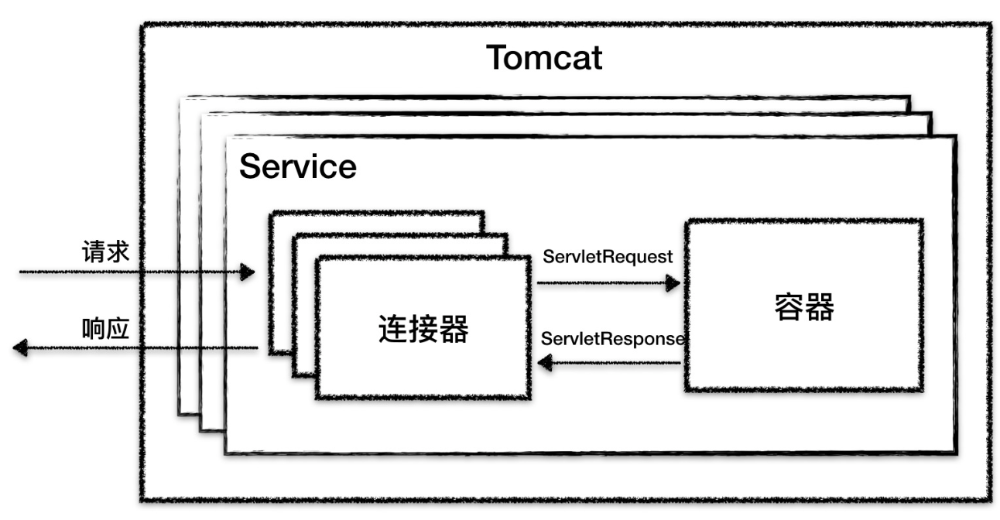

## 连接器

监听网络端口接收请求

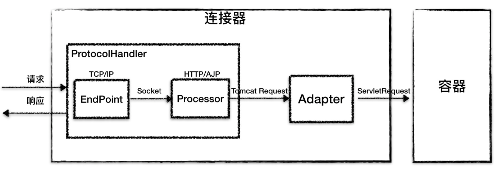

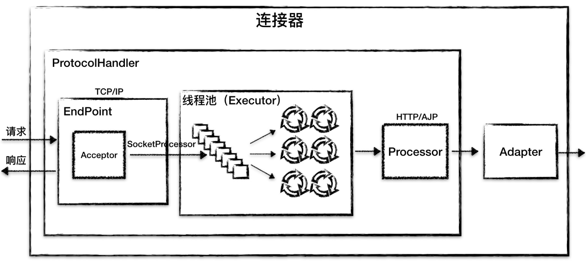

## 容器

4 种容器

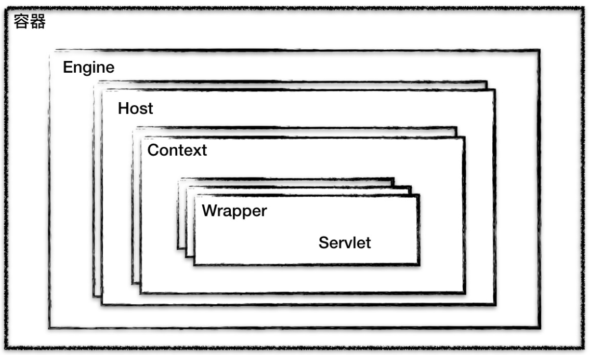


- Wrapper 表示一个 Servlet
- Context 表示一个 Web 程序
- Host 表示一个虚拟机主机，或者说一个站点，可以给 Tomcat 配置多个虚拟主机地址，一个虚拟主机可以部署多个 Web 程序
- Engine 表示引擎，用来管理多个虚拟站点，一个 Service 只能有一个 Engine


server.xml 配置文件加深 Tomcat 容器的理解 。

Tomcat 采用了组件化的设计， 它的构成组件都是可配置的 。

 最外层的是 Server, 其他组件按照一定的格式要求配置在这个顶层容器中 。

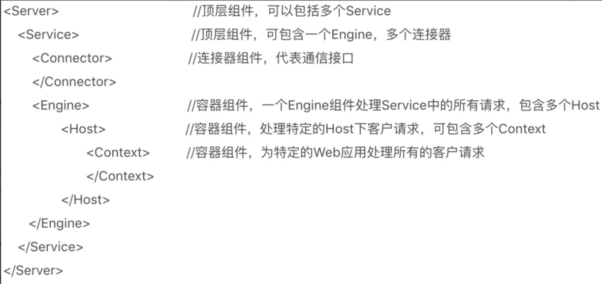


## 定位 Servlet

Tomcat 是如何确定 request 是由哪一个 Wrapper 下 Servlet 执行？


**Mapper** 组件：保存了 Web 的应用信息，也就是 Servlet 和访问路径的**映射关系**。

- Host 容器配置域名
- Context 容器里的 Web 应用路径
- Wrapper 容器里的 Servlet 映射的路径


可以想象成一个多层次的 Map，映射关系通常是使用一个类似 hash 的方法，映射到唯一的地方存储。

request 的信息就包含了 Map 的 Key ，通过 Key 可以直接定位找到对应的 Value。（value 存储路径或者其它信息都可以）


**注意：** 一个 Request 的 URL 只会定位到一个 Wrapper 容器，也就是一个 Servlet。


**示例：**

 有一个网购系统 ， 有面向网站管理人员的后台管理系统 ， 还有面向终端客户的在线购物系统 。 这两个系统跑在同一个 Tomcat 上 ， 为了隔离它们的访问域名配置了两个虚拟域名 `manage.shopping.com` 和 `user.shopping. com`


假如有用户访问一个 URL， 比如图中的 http://user.shopping.com/8080/order/buy，Tomcat 如何将个 URL 定位到一个 ServIet 呢 ？

- **协议、端口**：8080 端口会被 Http 连接器接收，连接器是有归属的 Service，因此找到了 Service。而 Service 都会一个确定的 Engine。
- **域名**：根据域名 `user.shopping.com` 确定了 Host，Mapper 会找到对应图中的 Host2
- **URL 路径确定 Context 容器**
- URL 路径找到 Wrapper（Servlet）：Context 确定后，Mapper 根据 Web.xml 配置的 Servlet 映射路径找到具体 Servlet（Wrapper）


## 打破 Java 双亲委派机制

**Tomcat 自定义类加载器**打破双亲委托机制的目的是为了优先加载 Web 应用目录下的类 ， 然后再加载其他目录下的类 ， 这也是 Servlet规范的推荐做法 。

要打破双亲委托机制 ， 要继承 ClassLoader 抽象类并且要重写它的 loadC1ass 方法 ， 因为 ClassLoader 的默认实现就是双亲委托

 


## 类加载器架构

思考三个问题：

- tomcat 启动了两个 web 程序，两个 web 有一个同名的 Servlet，但是功能不同。Tomcat 需要同时加载这两个和管理这两个同名的 Servlet ，保证它们不会冲突，因此 Web 程序之间的类需要隔离。

  

- 假如两个 web 程序都依赖了第三方 jar 包，假设 jar 是 spring。那么如何只让 tomcat 只加载一次 spring 的 jar 包？

  不可能让 tomcat 的 jvm 加载两次 spring 的 jar 包，内存多也不能这么用。

  并且，两个 web 程序共享 spring 的 jar 包。

  

- 如何隔离 tomcat 本身的类和 Web 应用的类？


解决如上问题，Tomcat 设计出了以下类加载机制：


第一个问题：**Web 应用之间的类如何隔离？**

Java 默认的类加载器 AppClassLoader ，遇到同名的类会返回第一次加载的同名类，在它看来这是同一个，不区别同名类。


Tomcat 写了 WebAppClassLoader 用于区分同名类，给 **每一个 Web 程序一个 `WebClassLoader` 实例**。

Tomcat 中一个 Context 组件相当于一个 Web 程序，因此 **每个 Context 负责创建和维护一个 `WebClassLoader` 加载器实例。** 

通过不同的 `WebClassLoader` 加载同名的 Servlet，这是可以的。相当于在 JVM 中，通过不同的 `WebClassLoader` 实例为不同的 Web 程序各自创建自己的类空间，进行隔离区分。


第二个问题：**如何共享相同第三方依赖的 jar 包？**

双亲委派机制下，所有的类都会优先让父类进行加载。


因此，可以利用双亲委派机制可以 **将共享的类放到父加载器中加载**。Tomcat 设计者也是基于此思想设计了 **`SharedClassLoader`**  作为 **`WebClassLoader`** 加载器的父加载器，因此两个 Web 程序就可以共享相同第三方依赖的 jar 包。


第三个问题：**如何隔离 Tomcat 本身的类和 Web 程序的类？**

通过前二个问题的解答，应该可以得到一点思路：***共享—父子关系类加载器，隔离那么应该是兄弟关系（平级）。***


所以 Tomcat 设计了 **`CatelinaClassLoader`** 用于加载 Tomcat 本身的类。

但如果 Tomcat 和 Web 程序有共同使用的类呢？

同理，共享则创建类加载器 **`CommonsClassLoader`**  作为 **`CatelinaClassLoader`** 和 **`SharedClassLoader`** 类加载器的父类加载。


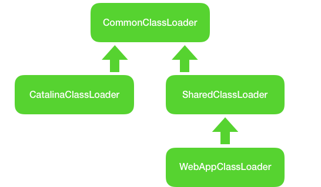


# WebSocket

WebSocket 最大特点是服务端主动向客户端发送消息，客户端也可以主动向服务端发送消息，是真正的双方平等通信。

属于 “ 服务端推送技术” 的一种。

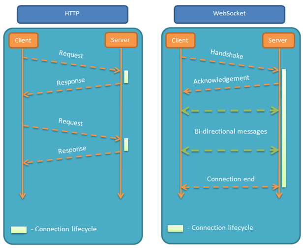


其他特点：

- 基于 TCP，服务端易实现

- 良好兼容 HTTP，默认端口也是 80 和 443。握手阶段采用 HTTP 协议，因此握手时不容易屏蔽，能通过各种 HTTP 代理服务器。

- 可发送文本，也可以发送二进制数据。数据量小、性能开销小、通信高效

- 没有同源限制[^同源]，客户端可以与任意服务器通信。

- 协议标识符 `ws`（如果加密，则为`wss`），服务器网址就是 URL。

  ```
  ws://example.com:80/some/path
  ```

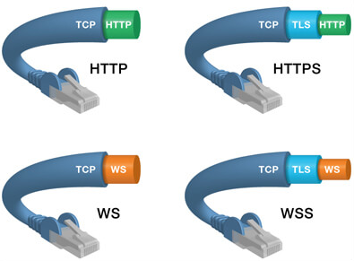


[^同源]: http 有同源限制，因此会产生跨域问题


https://cloud.tencent.com/developer/article/1887095

**握手过程：**

WebSocket 协议属于应用层协议，它依赖于传输层的 TCP 协议。WebSocket 通过 HTTP/1.1 协议的 101 状态码进行握手。


HTTP 完成握手有几个好处：

*1）*首先：让 WebSocket 与现有 HTTP 基础设施兼容——使得 WebSocket 服务器可以运行在 80 和 443 端口上，这通常是对客户端唯一开放的端口；

*2）*其次：让我们可以重用并扩展 HTTP 的 Upgrade 流，为其添加自定义的 WebSocket 首部，以完成协商。


具体分析一下握手过程。

客户端请求：

```http
GET ws://echo.websocket.org/ HTTP/1.1
Host: echo.websocket.org
Origin: file://
Connection: Upgrade
Upgrade: websocket
Sec-WebSocket-Version: 13
Sec-WebSocket-Key: Zx8rNEkBE4xnwifpuh8DHQ==
Sec-WebSocket-Extensions: permessage-deflate; client_max_window_bits

//已忽略部分 HTTP 请求头。
```

- *1）*Connection：必须设置 Upgrade，表示客户端希望连接升级；
- *2）*Upgrade：字段必须设置 websocket，表示希望升级到 WebSocket 协议；
- *3）*Sec-WebSocket-Version：表示支持的 WebSocket 版本。RFC6455 要求使用的版本是 13，之前草案的版本均应当弃用；
- *4）*Sec-WebSocket-Key：是随机的字符串，服务器端会用这些数据来构造出一个 SHA-1 的信息摘要；
- *5）*Sec-WebSocket-Extensions：用于协商本次连接要使用的 WebSocket 扩展：客户端发送支持的扩展，服务器通过返回相同的首部确认自己支持一个或多个扩展；
- *6）*Origin：字段是可选的，通常用来表示在浏览器中发起此 WebSocket 连接所在的页面，类似于 Referer。但是，与 Referer 不同的是，Origin 只包含了协议和主机名称。

**针对上述第4）点：**把 “*Sec-WebSocket-Key*” 加上一个特殊字符串 “*258EAFA5-E914-47DA-95CA-C5AB0DC85B11*”，然后计算 SHA-1 摘要，之后进行 Base64 编码，将结果做为 “*Sec-WebSocket-Accept*” 头的值，返回给客户端。如此操作，可以尽量避免普通 HTTP 请求被误认为 WebSocket 协议。


服务端响应

```http
HTTP/1.1 101 Web Socket Protocol Handshake ①
Connection: Upgrade ②
Upgrade: websocket ③
Sec-WebSocket-Accept: 52Rg3vW4JQ1yWpkvFlsTsiezlqw= ④

//已忽略部分 HTTP 响应头。
```

- *①* 101 响应码确认升级到 WebSocket 协议；
- *②* 设置 Connection 头的值为 “Upgrade” 来指示这是一个升级请求（HTTP 协议提供了一种特殊的机制，这一机制允许将一个已建立的连接升级成新的、不相容的协议）；
- *③* Upgrade 头指定一项或多项协议名，按优先级排序，以逗号分隔。这里表示升级为 WebSocket 协议；
- *④* 签名的键值验证协议支持。


## 前端

[WebSocket - Web APIs | MDN (mozilla.org)](https://developer.mozilla.org/en-US/docs/Web/API/WebSocket)


**`WebSocket（）`**构造函数返回一个新的[`WebSocket`](https://developer.mozilla.org/en-US/docs/Web/API/WebSocket)对象。

<h4>语法</h4>

```js
new WebSocket(url)
new WebSocket(url, protocols)
```


<h4>参数</h4>

- `url`

  要连接到的 URL;这应该是 WebSocket 服务器所指向的 URL 会回应。

- `protocols` 自选

  单个协议字符串或协议字符串数组。这些字符串是 用于指示子协议，以便单个服务器可以实现多个 WebSocket 子协议（例如，您可能希望一台服务器能够处理 不同类型的交互取决于指定的）。`protocol`如果省略，则默认使用空数组，即`[]`


<h4>webSocket 对象属性</h4>

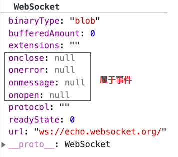

WebSocket 可以传输文本、二进制数据。


使用二进制数据时，为 `WebSocket.binaryType`  赋值， 有两种选择：

- [`Blob`](https://developer.mozilla.org/en-US/docs/Web/API/Blob) 对象用于二进制数据。默认值。
- [`ArrayBuffer`](https://developer.mozilla.org/en-US/docs/Web/JavaScript/Reference/Global_Objects/ArrayBuffer)对象用于二进制数据。

~~~js
// Create WebSocket connection.
const socket = new WebSocket("ws://localhost:8080");

// Change binary type from "blob" to "arraybuffer"
socket.binaryType = "arraybuffer";

// Listen for messages
socket.addEventListener("message", (event) => {
  if (event.data instanceof ArrayBuffer) {
    // binary frame
    const view = new DataView(event.data);
    console.log(view.getInt32(0));
  } else {
    // text frame
    console.log(event.data);
  }
});
~~~


read-only 属性 `bufferedAmount` 返回使用 `send ()` 调用排队但尚未传输到网络的数据字节数。

一旦发送了所有排队的数据，此值将重置为零。当连接关闭时，此值不会重置为零; 如果继续调用 send () ，则此值将继续攀升。


read-only 属性 `extensions ` 返回服务器选择的扩展名。这当前只是空字符串或由连接协商的扩展名列表。


read-only 属性 `protocol` 返回服务器选择的子协议的名称。

这将是在创建 WebSocket 对象时在 protocol 参数中指定的字符串之一，如果没有建立连接，则返回空字符串。


read-only 属性 `ReadyState` 返回 WebSocket 连接的当前状态。

| Value | State        | Description                  |
| :---- | :----------- | :--------------------------- |
| `0`   | `CONNECTING` | 套接字已创建。连接尚未打开。 |
| `1`   | `OPEN`       | 连接已打开，准备通信         |
| `2`   | `CLOSING`    | 连接正在关闭                 |
| `3`   | `CLOSED`     | 连接已经关闭 or 无法打开     |


read-only 属性 URL 返回由构造函数解析的 WebSocket 的绝对 URL。


**示例**

~~~html
<!DOCTYPE html>
<html>
  <head>
    <meta charset="UTF-8"/>
    <meta name="viewport"content="width=device-width, initial-scale=1.0"/>
    <title>WebSocket 发送二进制数据示例</title>
    <style>
      .block {
        flex: 1;
      }
    </style>
  </head>
  <body>
    <h3>WebSocket 发送二进制数据示例</h3>
    <div style="display: flex;">
      <div class="block">
        <p>待发送的数据：<button onclick="send()">发送</button></p>
        <textarea id="sendMessage"rows="5"cols="15"></textarea>
      </div>
      <div class="block">
        <p>接收的数据：</p>
        <textarea id="receivedMessage" rows="5" cols="15"></textarea>
      </div>
    </div>

    <script>
      const sendMsgContainer = document.querySelector("#sendMessage");
      const receivedMsgContainer = document.querySelector("#receivedMessage");
      const socket = new WebSocket("ws://localhost:8001/ws");

      // 监听连接成功事件
      socket.addEventListener("open", function(event) {
        console.log("连接成功，可以开始通讯");
      });

      // 监听消息
      socket.addEventListener("message", async function(event) {
        console.log("Message from server ", event.data);
        const receivedData = event.data;
        if(receivedData instanceof Blob) {
          receivedMsgContainer.value = await receivedData.text();
        } else{
          receivedMsgContainer.value = receivedData;
        }
      });

      function send() {
        const message = sendMsgContainer.value;
        if(socket.readyState !== WebSocket.OPEN) {
          console.log("连接未建立，还不能发送消息");
          return;
        }
        const blob = new Blob([message], { type: "text/plain"});
        if(message) socket.send(blob);
      }
    </script>
  </body>
</html>
~~~


## 后端

**简单实现**

~~~java
@Configuration
@EnableWebSocket
public class MyWebSocketConfig {
    @Bean
    public ServerEndpointExporter serverEndpoint() {
        return new ServerEndpointExporter();
    }
}
~~~

~~~java
@Slf4j
@Component
@ServerEndpoint(value = "/endpoint")
public class WebScoketEndpoint {
    @OnOpen
    public void onOpen(Session session) {
        log.info("客户端：{}连接成功", session.getId());
    }

    @OnClose
    public void onClose(Session session) {
        log.info("客户端：{}连接断开", session.getId());

    }

    @OnError
    public void onError(Throwable error) {
        System.out.println("onError......" + error.getMessage());

    }

    @OnMessage
    public String onMsg(String message, Session session) {
//        log.info("从客户端：{} 收到<--:{}", session.getId(), message);
        String send = message.toUpperCase();
        String result = "客户：%s您好，来自server 的消息:%s";
        result = String.format(result, session.getId(), send);
        return "来自server 的消息：" + result;
    }

}
~~~


报错！！！ 无法找到 bean

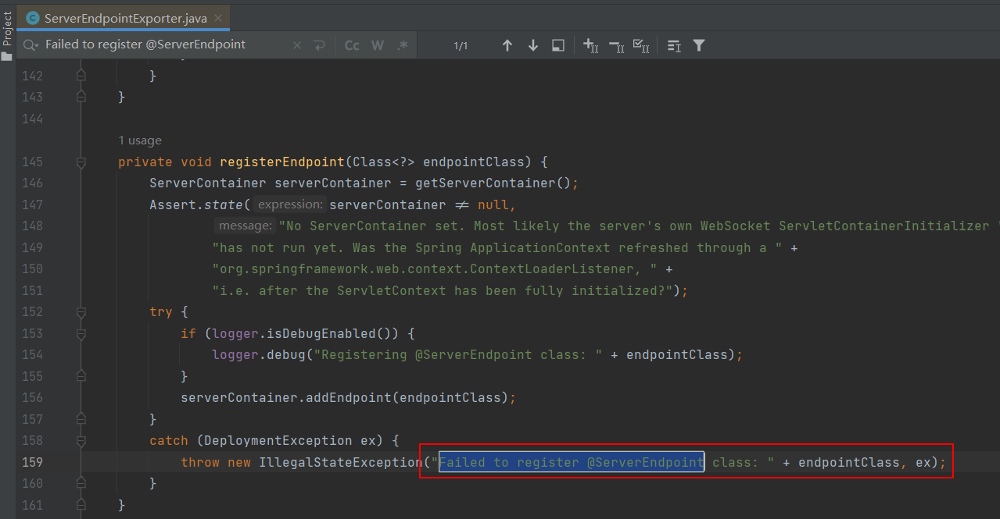

在 `addEndpoint(...)` 中捕获到错误，点进去看

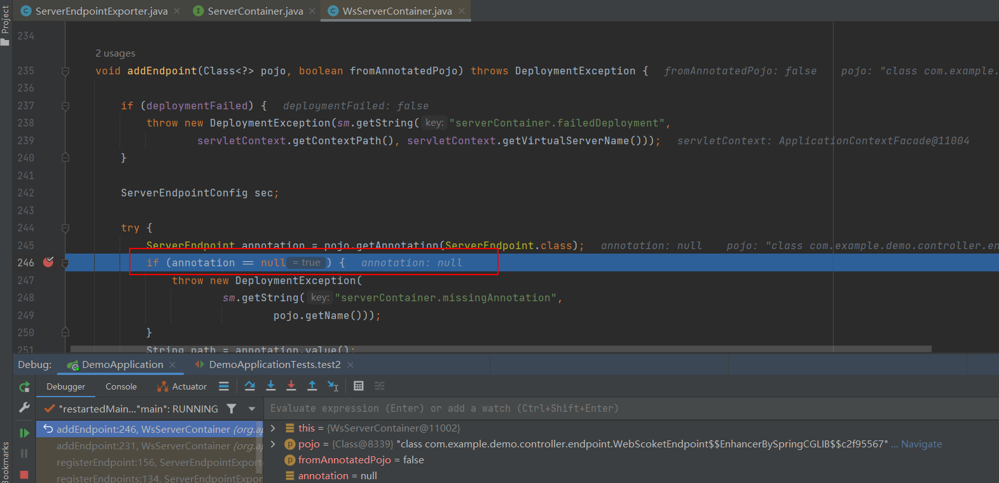

<font color='red'>找到了错误！！ 找不到类中的注解信息</font>

那为什么找不到呢？？


回到 `ServerEndpointExporter` 类中，可以看到是从 Spring 容器中获取的

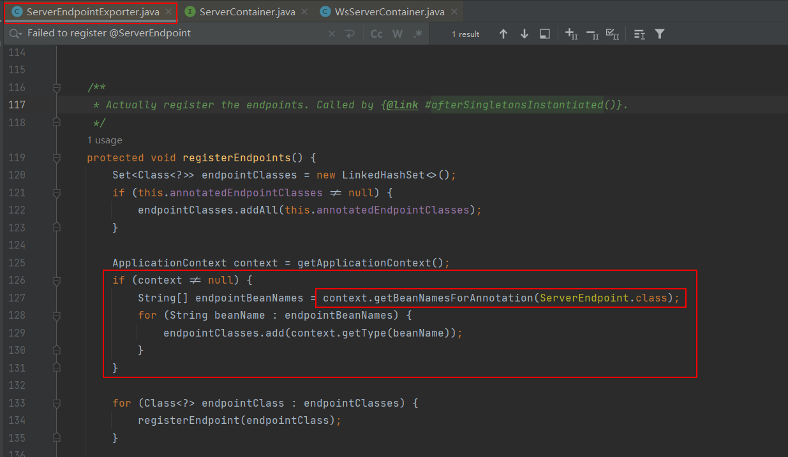


那么问题来了，为什么获取不到注解信息呢
回头看报错信息

```shell
Caused by: javax.websocket.DeploymentException: Cannot deploy POJO class [com.example.demo.controller.endpoint.WebScoketEndpoint$$EnhancerBySpringCGLIB$$f15a0e54] as it is not annotated with @ServerEndpoint
```

发现一个很眼熟的东西 **<font color='red'>CGLIB</font>** 。这是一个代理类，这是怎么回事？！

原来是因为在项目中使用了aop来打印方法的参数

而 endpoint 注解修饰的类在切面的范围中，所以生成了代理类。


**验证一下：**是不是因为使用了 AOP，代理后导致的问题。新建一个项目不使用 aop


发现 cglib 代理类中， 0  个注解信息

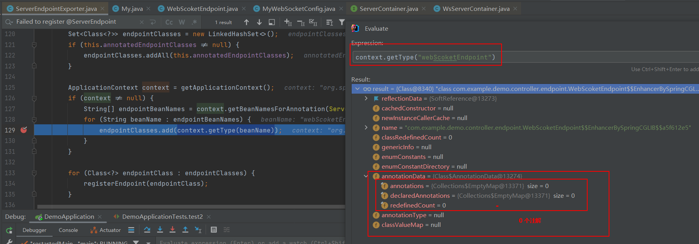


查看父类

> cglib  通过生成子类的方式进行代理，因此进入父类，也就是原始类

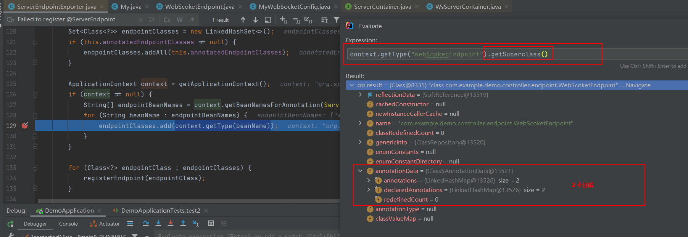

发现注解出现了！！！！


那么就是生成代理时，没获取到注解的信息。为什么获取不到呢？？？

 点进去 **<font color='cornflowerblue'>ServerEndpoint</font>** 看看

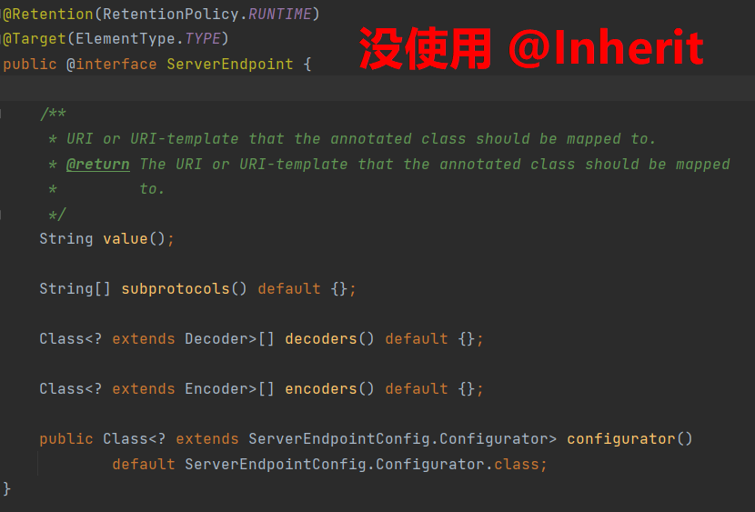

**@Inherit  作用：继承父类时，<font color='red'>继承父类的注解</font>** 


### 正确实现

~~~java
@Component
@Slf4j
public class MyWebSocket extends AbstractWebSocketHandler {


    @Override
    public void afterConnectionEstablished(WebSocketSession session) throws Exception {
        log.info("用户已连接：{}", session.getId());
    }

    @Override
    public void handleMessage(WebSocketSession session, WebSocketMessage<?> message) throws Exception {
        super.handleMessage(session, message);
    }

    @Override
    protected void handleTextMessage(WebSocketSession session, TextMessage message) throws Exception {
        super.handleTextMessage(session, message);
    }

    @Override
    protected void handleBinaryMessage(WebSocketSession session, BinaryMessage message) throws Exception {
        log.info(message.toString());
    }

    @Override
    protected void handlePongMessage(WebSocketSession session, PongMessage message) throws Exception {
        super.handlePongMessage(session, message);
    }

    @Override
    public void handleTransportError(WebSocketSession session, Throwable exception) throws Exception {
        super.handleTransportError(session, exception);
    }

    @Override
    public void afterConnectionClosed(WebSocketSession session, CloseStatus status) throws Exception {
        log.info(status.getReason());
    }

    @Override
    public boolean supportsPartialMessages() {
        return super.supportsPartialMessages();
    }
}
~~~

~~~java
@EnableWebSocket
@Configuration
public class WebSocketConfig implements WebSocketConfigurer {

    @Resource
    private MyWebSocket myWebSocket;

    @Override
    public void registerWebSocketHandlers(WebSocketHandlerRegistry registry) {
        registry.addHandler(myWebSocket, "ws")
                .setAllowedOrigins("*");
    }

}
~~~


# Nginx

[2万字总结，体系化带你全面认识 Nginx ！ (qq.com)](https://mp.weixin.qq.com/s/8u7yCMOfxnoPVwWSb2lFsQ)

`Nginx` 的安装信息

```shell
# Nginx配置文件
/etc/nginx/nginx.conf # nginx 主配置文件
/etc/nginx/nginx.conf.default

# 可执行程序文件
/usr/bin/nginx-upgrade
/usr/sbin/nginx

# nginx库文件
/usr/lib/systemd/system/nginx.service # 用于配置系统守护进程
/usr/lib64/nginx/modules # Nginx模块目录

# 帮助文档
/usr/share/doc/nginx-1.16.1
/usr/share/doc/nginx-1.16.1/CHANGES
/usr/share/doc/nginx-1.16.1/README
/usr/share/doc/nginx-1.16.1/README.dynamic
/usr/share/doc/nginx-1.16.1/UPGRADE-NOTES-1.6-to-1.10

# 静态资源目录
/usr/share/nginx/html/404.html
/usr/share/nginx/html/50x.html
/usr/share/nginx/html/index.html

# 存放Nginx日志文件
/var/log/nginx
```

主要关注的文件夹有两个：

1. `/etc/nginx/conf.d/` 是子配置项存放处， `/etc/nginx/nginx.conf` 主配置文件会默认把这个文件夹中所有子配置项都引入；
2. `/usr/share/nginx/html/` 静态文件都放在这个文件夹，也可以根据你自己的习惯放在其他地方；


## 常用命令

`systemctl` 系统命令：

~~~shell
# 开机配置
systemctl enable nginx # 开机自动启动
systemctl disable nginx # 关闭开机自动启动

# 启动Nginx
systemctl start nginx # 启动Nginx成功后，可以直接访问主机IP，此时会展示Nginx默认页面

# 停止Nginx
systemctl stop nginx

# 重启Nginx
systemctl restart nginx

# 重新加载Nginx
systemctl reload nginx

# 查看 Nginx 运行状态
systemctl status nginx

# 查看Nginx进程
ps -ef | grep nginx

# 杀死Nginx进程
kill -9 pid # 根据上面查看到的Nginx进程号，杀死Nginx进程，-9 表示强制结束进程
~~~

`Nginx` 应用程序命令：

```shell
nginx -s reload  # 向主进程发送信号，重新加载配置文件，热重启
nginx -s reopen  # 重启 Nginx
nginx -s stop    # 快速关闭
nginx -s quit    # 等待工作进程处理完成后关闭
nginx -T         # 查看当前 Nginx 最终的配置
nginx -t         # 检查配置是否有问题
nginx -V		 # 版本
```


## 配置文件结构

~~~shell
##################
# main - 全局配置 #
##################
user  nginx;                        		# 运行用户，默认即是nginx，可以不进行设置
worker_processes  auto;             		# Nginx 进程数，一般设置为和 CPU 核数一样
error_log  /var/log/nginx/error.log warn;   # Nginx 的错误日志存放目录
pid        /var/run/nginx.pid;      		

#############################################
# events - 配置影响 Nginx 服务器与用户的网络连接 #
#############################################
events {
    use epoll;     			   # 使用epoll的I/O模型(Nginx会自动选择一个最适合你操作系统的)
    worker_connections 1024;   # 每个进程允许最大并发数
}

##########################################################
# http - 配置代理，缓存，日志定义等绝大多数功能和第三方模块的配置 #
##########################################################
http { 
    # 日志打印格式
    log_format  main  '$remote_addr - $remote_user [$time_local] "$request" '
                      '$status $body_bytes_sent "$http_referer" '
                      '"$http_user_agent" "$http_x_forwarded_for"';

    access_log  /var/log/nginx/access.log  main;   # Nginx访问日志存放位置

    sendfile            on;   # 开启高效传输模式
    tcp_nopush          on;   # 减少网络报文段的数量
    tcp_nodelay         on;
    keepalive_timeout   65;   # 保持连接的时间，也叫超时时间，单位秒
    types_hash_max_size 2048;

    include             /etc/nginx/mime.types;      # 文件扩展名与类型映射表
    default_type        application/octet-stream;   # 默认文件类型

    include /etc/nginx/conf.d/*.conf;   # 加载子配置项
    
    #######################################################
    # server - 配置虚拟主机的相关参数，http块中可以有多个server #
    #######################################################
    server {
         listen       80;       # 配置监听的端口
         server_name  localhost;    # 配置的域名

		 ###############################
         # location - 用于配置匹配的 uri #
         ###############################
         location / {
          root   /usr/share/nginx/html;  # 网站根目录
          index  index.html index.htm;   # 默认首页文件
          deny 172.168.22.11;   # 禁止访问的ip地址，可以为all
          allow 172.168.33.44；# 允许访问的ip地址，可以为all
         }

         error_page 500 502 503 504 /50x.html;  # 默认50x对应的访问页面
         error_page 400 404 error.html;   # 同上
    }
}
~~~

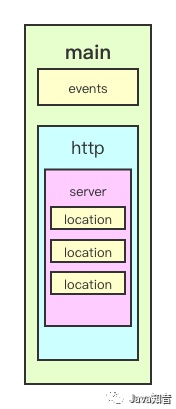

`upstream` 配置后端服务器具体地址，负载均衡配置不可或缺的部分，在上面并未配置


### main

`user` 指定 *woker* 子进程的属主和属组

```shell
# 语法
user USERNAME [GROUP]
user nginx lion; # 用户是nginx;组是lion
```

`pid` 指定 *master* 主进程的 `pid` 文件存放路径

```shell
pid /opt/nginx/logs/nginx.pid # master主进程的的pid存放在nginx.pid的文件
```

`daemon`指定运行模式

~~~shell
daemon off; # 默认是on，后台运行模式
~~~

*woker* 子进程相关配置

```shell
# 子进程异常终止后的core文件，用于记录分析问题
worker_rlimit_core 50M; 			# 存放大小限制
working_directory /opt/nginx/tmp; 	# 存放目录

# 子进程数量
worker_processes 4; 				# 如果为auto则与当前cpu物理核心数一致
worker_rlimit_nofile 20480; 		# 定义了每个worker进程可以打开的最大文件描述符数量。文件描述符是操作系统用来标识进程打开的文件或网络连接的句柄。在Nginx中，每个worker进程需要两个文件描述符，一个用于与客户端的连接，另一个用于与上游服务器的连接。worker_rlimit_nofile的值通常应该是events块中worker_connections的两倍

# 将每个worker子进程与cpu物理核心绑定，优势在于避免同一个子进程在不同的CPU核心上切换，缓存失效，降低性能。但其并不能真正的避免进程切换。
worker_cpu_affinity 0001 0010 0100 1000;

# 优先级
worker_priority -10; 				# 120-10=110，110就是最终的优先级

# 超时退出时间
worker_shutdown_timeout 5s;
# 调整时间间隔越大，系统调用越少，有利于性能提升
timer_resolution 100ms;
```


### event

`use`选择事件驱动模型

~~~shell
use [select、poll、kqueue、epoll、/dev/poll、eventport]; # 不推荐配置它，让nginx自己选择
~~~

`worker_connections`定义了每个worker进程可以同时处理的最大连接数，通常是`main`块中`worker_rlimit_nofile`的值一半

`accept_mutex`负载均衡互斥锁

~~~shell
accept_mutex on # 默认是off关闭的，这里推荐打开
~~~


### upstream

在`http`中，用于定义上游服务器（后台服务器）

在 `upstream` 内可使用的指令：

- `server` 定义上游服务器地址；

- `zone` 定义共享内存，用于跨 `worker` 子进程；

- `keepalive` 对上游服务启用长连接；

- `keepalive_requests` 一个长连接最多请求 `HTTP` 的个数；

- `keepalive_timeout` 空闲情形下，一个长连接的超时时长；

- `hash` 哈希负载均衡算法；

- `ip_hash` 每个访客固定访问一个后端服务器

  ~~~shell
  upstream resinserver{
     ip_hash;
     server 192.168.1.10:8080;
     server 192.168.1.11:8080;
  }
  
  ~~~

- `least_conn` 最少连接数负载均衡算法；

- `least_time` 最短响应时间负载均衡算法；

- `random` 随机负载均衡算法；


定义地址

```shell
server address [parameters]
```

`parameters` 可选值：

- `weight=number` 权重，默认为1，weight越大，负载的权重就越大
- `max_conns=number` 上游服务器的最大并发连接数；
- `fail_timeout=time` max_fails次失败后，暂停的时间
- `max_fails=numer` 允许请求失败的次数默认为1。当超过最大次数时，返回proxy_next_upstream模块定义的错误
- `backup` 备份服务器，仅当其他服务器都不可用时才会启用；
- `down` 标记服务器长期不可用，离线维护；


`keepalive`限制每个 `worker` 子进程与上游服务器空闲长连接的最大数量

`keepalive_requests`单个长连接可以处理的最多 `HTTP` 请求个数

`keepalive_timeout`空闲长连接的最长保持时间


```shell
upstream back_end{
 server 127.0.0.1:8081 weight=3 max_conns=1000 fail_timeout=10s max_fails=2;
  keepalive 32;
  keepalive_requests 50;
  keepalive_timeout 30s;
}
```

> 注意，当upstream中只有一个 server 时，max_fails 和 fail_timeout 参数可能不会起作用。weight\backup 不能和 ip_hash 关键字一起使用


### server

指定虚拟主机域名。

```shell
server_name name1 name2 name3

# 示例：
server_name www.nginx.com;
```

域名匹配的四种写法：

- 精确匹配： `server_name www.nginx.com` ;
- 左侧通配： `server_name *.nginx.com` ;
- 右侧统配： `server_name  www.nginx.*` ;
- 正则匹配： `server_name ~^www\.nginx\.*$` ;

匹配优先级：**「精确匹配 > 左侧通配符匹配 > 右侧通配符匹配 > 正则表达式匹配」**


`server_name` 配置实例：

1、配置本地  `DNS` 解析 `vim /etc/hosts` （ `macOS` 系统）

```
# 添加如下内容，其中 121.42.11.34 是阿里云服务器IP地址
121.42.11.34 www.nginx-test.com
121.42.11.34 mail.nginx-test.com
121.42.11.34 www.nginx-test.org
121.42.11.34 doc.nginx-test.com
121.42.11.34 www.nginx-test.cn
121.42.11.34 fe.nginx-test.club
```

[注意] 这里使用的是虚拟域名进行测试，因此需要配置本地 `DNS` 解析，如果使用阿里云上购买的域名，则需要在阿里云上设置好域名解析。

2、配置阿里云 `Nginx` ，`vim /etc/nginx/nginx.conf`

```shell
# 这里只列举了http端中的sever端配置

# 左匹配
server {
 listen 80;
 server_name *.nginx-test.com;
 root /usr/share/nginx/html/nginx-test/left-match/;
 location / {
  index index.html;
 }
}

# 正则匹配
server {
 listen 80;
 server_name ~^.*\.nginx-test\..*$;
 root /usr/share/nginx/html/nginx-test/reg-match/;
 location / {
  index index.html;
 }
}

# 右匹配
server {
 listen 80;
 server_name www.nginx-test.*;
 root /usr/share/nginx/html/nginx-test/right-match/;
 location / {
  index index.html;
 }
}

# 完全匹配
server {
 listen 80;
 server_name www.nginx-test.com;
 root /usr/share/nginx/html/nginx-test/all-match/;
 location / {
  index index.html;
 }
}
```

3、访问分析

- 当访问 `www.nginx-test.com` 时，都可以被匹配上，因此选择优先级最高的“完全匹配”；
- 当访问 `mail.nginx-test.com` 时，会进行“左匹配”；
- 当访问 `www.nginx-test.org` 时，会进行“右匹配”；
- 当访问 `doc.nginx-test.com` 时，会进行“左匹配”；
- 当访问 `www.nginx-test.cn` 时，会进行“右匹配”；
- 当访问 `fe.nginx-test.club` 时，会进行“正则匹配”；


### location

（1）路径配置

~~~shell
location [ = | ~ | ~* | ^~ ] uri {
 ...
}

server {
  listen 80;
  server_name www.nginx-test.com;
  
  # 只有当访问 www.nginx-test.com/match_all/ 时才会匹配到/usr/share/nginx/html/match_all/index.html
  location = /match_all/ {
      root /usr/share/nginx/html
      index index.html
  }
  
  # 当访问 www.nginx-test.com/1.jpg 等路径时会去 /usr/share/nginx/images/1.jpg 找对应的资源
  location ~ \.(jpeg|jpg|png|svg)$ {
  		root /usr/share/nginx/images;
  }
  
  # 当访问 www.nginx-test.com/bbs/ 时会匹配上 /usr/share/nginx/html/bbs/index.html
  location ^~ /bbs/ {
   		root /usr/share/nginx/html;
    	index index.html index.htm;
  }
}
~~~

匹配规则：

- `=` 精确匹配；
- `~` 正则匹配，区分大小写；
- `~*` 正则匹配，不区分大小写；
- `^~` 匹配到即停止搜索；

匹配优先级： `=` > `^~` >  `~` > `~*` > 不带任何字符


（2） location 中的反斜线

~~~shell
# 先找是否有 test 目录，有则找 test 目录下的 index.html ；没有则找是否有 test 文件
location /test {
 ...
}

# 没有 test 目录不会去找 test 文件
location /test/ {
 ...
}
~~~


`alias`指定静态资源目录位置

```shell
location /image {
 alias /opt/nginx/static/image/; # 末尾一定要添加 /
}

# 当用户访问 www.test.com/image/1.png 时，实际在服务器找的路径是 /opt/nginx/static/image/1.png
```

`return`停止处理请求，直接返回响应码或重定向到其他 *URL* ， *location* 中后续指令将不会被执行

~~~shell
# 语法
return code [text];
return code URL;
return URL;

# 例如
location / {
 return 404; # 直接返回状态码
}

location / {
 return 404 "pages not found"; # 返回状态码 + 一段文本
}

location / {
 return 302 /bbs ; # 返回状态码 + 重定向地址
}

location / {
 return https://www.baidu.com ; # 返回重定向地址
}
~~~

`rewrite`根据指定正则表达式匹配规则，重写 *URL*

```shell
# 语法：
rewrite 正则表达式 要替换的内容 [flag];
上下文：server、location、if

rewirte /images/(.*\.jpg)$ /pic/$1; 
# $1是一个特殊的变量，它表示正则表达式中第一对括号 () 匹配到的内容
# 请求的 URL 是 /images/example.jpg，那么 rewrite /images/(.*) /pics/$1; 这个规则会将这个 URL 重写为 /pics/example.jpg
```

`flag` 可选值的含义：

- `last` 重写后的 `URL` 发起新请求，再次进入 `server` 段，重试 `location` 的中的匹配；
- `break` 直接使用重写后的 `URL` ，不再匹配其它 `location` 中语句；
- `redirect` 返回302临时重定向；
- `permanent` 返回301永久重定向；

```shell
server{
  listen 80;
  server_name fe.lion.club; # 要在本地hosts文件进行配置
  root html;
  
  location /search {
   	rewrite ^/(.*) https://www.baidu.com redirect;
  }
  
  location /images {
   	rewrite /images/(.*) /pics/$1;
  }
  
  location /pics {
   	rewrite /pics/(.*) /photos/$1;
  }
  
  location /photos {
  
  }
}
```

按照这个配置分析：

- 当访问 `fe.lion.club/search` 时，会自动帮我们重定向到 `https://www.baidu.com`。
- 当访问 `fe.lion.club/images/1.jpg` 时，第一步重写 `URL` 为 `fe.lion.club/pics/1.jpg` ，找到 `pics` 的 `location` ，继续重写 `URL` 为 `fe.lion.club/photos/1.jpg` ，找到 `/photos` 的 `location` 后，去 `html/photos` 目录下寻找 `1.jpg` 静态资源。


`proxy_pass`用于配置代理服务器

URL 参数原则

1. URL 必须以 http 或 https 开头；
2. URL 中可以携带变量；
3. URL 中是否带 URI ，会直接影响发往上游请求的 URL 

~~~shell
location /bbs/{
  	proxy_pass http://192.168.100.33:8081 
	proxy_pass http://192.168.100.33:8081/ 	# 带 / 时请求到达上游应用服务器的 URL 不会携带 /bbs
}
~~~


### *root*属性

指定静态资源目录位置，它可以写在 `http` 、 `server` 、 `location` 等配置中

```shell
root path

location /image {
 root /opt/nginx/static;
}

# 当用户访问 www.test.com/image/1.png 时，实际在服务器找的路径是 /opt/nginx/static/image/1.png
```

`root` 会将定义路径与 `URI` 叠加， `alias` 则只取定义路径


### *if*指令

```shell
语法：if (condition) {...}

上下文：server、location

示例：
if($http_user_agent ~ Chrome){
  rewrite /(.*)/browser/$1 break;
}
```

`condition` 判断条件：

- `$variable` 仅为变量时，值为空或以0开头字符串都会被当做 `false` 处理；
- `=` 或 `!=` 相等或不等；
- `~` 正则匹配；
- `! ~` 非正则匹配；
- `~*` 正则匹配，不区分大小写；
- `-f` 或 `! -f` 检测文件存在或不存在；
- `-d` 或 `! -d` 检测目录存在或不存在；
- `-e` 或 `! -e` 检测文件、目录、符号链接等存在或不存在；
- `-x` 或 `! -x` 检测文件可以执行或不可执行；

实例：

```shell
server {
  listen 8080;
  server_name localhost;
  root html;
  
  location / {
   if ( $uri = "/images/" ){
     rewrite (.*) /pics/ break;
    }
  }
}
```

当访问 `localhost:8080/images/` 时，会进入 `if` 判断里面执行 `rewrite` 命令


### *autoindex*属性

用户请求以 `/` 结尾时，列出目录结构，可用于搭建静态资源下载网站

```shell
server {
  listen 80;
  server_name fe.lion-test.club;
  
  location /download/ {
    root /opt/source;
    
    autoindex on; # 打开 autoindex，，可选参数有 on | off
    autoindex_exact_size on; # 修改为off，以KB、MB、GB显示文件大小，默认为on，以bytes显示出⽂件的确切⼤⼩
    autoindex_format html; # 以html的方式进行格式化，可选参数有 html | json | xml
    autoindex_localtime off; # 显示的⽂件时间为⽂件的服务器时间。默认为off，显示的⽂件时间为GMT时间
  }
}
```

当访问 `fe.lion.com/download/` 时，会把服务器 `/opt/source/download/` 路径下的文件展示出来，如下图所示：

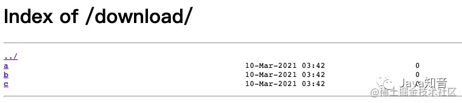

### 变量

常用变量

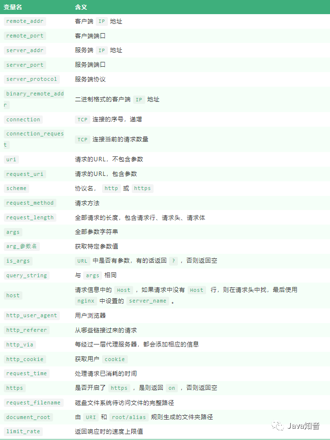

实例演示 `var.conf` ：

```shell
server{
 listen 8081;
 server_name var.lion-test.club;
 root /usr/share/nginx/html;
 
 location / {
  return 200 "
        remote_addr: $remote_addr
        remote_port: $remote_port
        server_addr: $server_addr
        server_port: $server_port
        server_protocol: $server_protocol
        binary_remote_addr: $binary_remote_addr
        connection: $connection
        uri: $uri
        request_uri: $request_uri
        scheme: $scheme
        request_method: $request_method
        request_length: $request_length
        args: $args
        arg_pid: $arg_pid
        is_args: $is_args
        query_string: $query_string
        host: $host
        http_user_agent: $http_user_agent
        http_referer: $http_referer
        http_via: $http_via
        request_time: $request_time
        https: $https
        request_filename: $request_filename
        document_root: $document_root
        ";
 }
}
```

访问 `http://var.lion-test.club:8081/test?pid=121414&cid=sadasd` 时，由于 `Nginx` 中写了 `return` 方法，因此 `chrome` 浏览器会默认为我们下载一个文件，下面展示的就是下载的文件内容：

```
remote_addr: 27.16.220.84
remote_port: 56838
server_addr: 172.17.0.2
server_port: 8081
server_protocol: HTTP/1.1
binary_remote_addr: 茉
connection: 126
uri: /test/
request_uri: /test/?pid=121414&cid=sadasd
scheme: http
request_method: GET
request_length: 518
args: pid=121414&cid=sadasd
arg_pid: 121414
is_args: ?
query_string: pid=121414&cid=sadasd
host: var.lion-test.club
http_user_agent: Mozilla/5.0 (Macintosh; Intel Mac OS X 10_14_0) AppleWebKit/537.36 (KHTML, like Gecko) Chrome/88.0.4324.182 Safari/537.36
http_referer: 
http_via: 
request_time: 0.000
https: 
request_filename: /usr/share/nginx/html/test/
document_root: /usr/share/nginx/html
```

可查阅文档看更多的变量


## 代理

局域网中的电脑用户想要直接访问网络是不可行的，只能通过代理服务器来访问

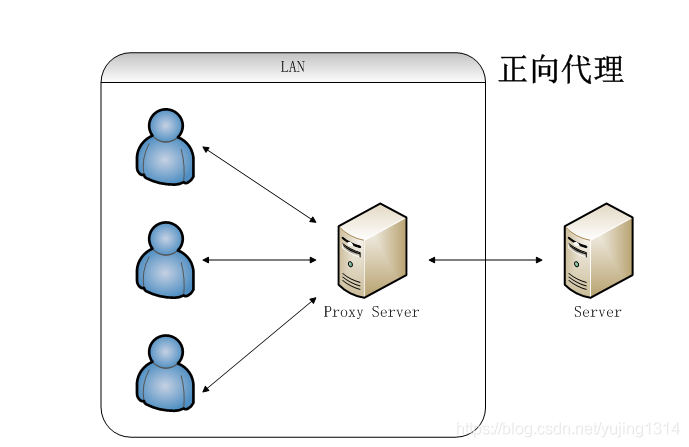


用户的请求会发送到反向代理服务器，反向代理服务器去选择目标服务器获取数据，然后再返回到客户端

- 隐藏真实服务器的IP
- 加密 SSL
- 通过缓存静态资源，加速 Web 请求
- 负载均衡

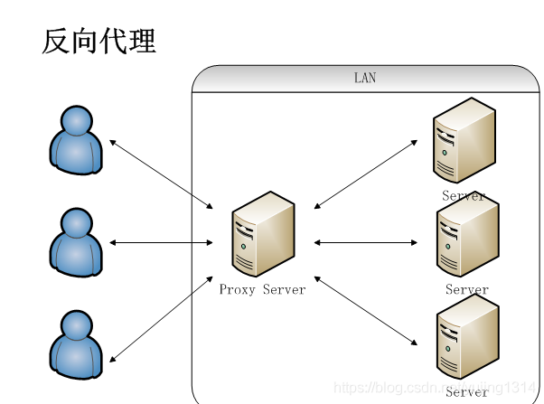


## 负载均衡

客户端发送多个请求到服务器，服务器处理请求，有一些可能要与数据库进行交互，服务器处理完毕之后，再将结果返回给客户端


但是当大量数据，而且多个用户同时请求时，高并发情况下，单个服务器无法处理那么多的请求，即便升级服务器配置也无济于事，所以增加服务器数量，构建集群，将请求分发到各个服务器上，将原来请求集中到单个服务器的情况改为请求分发到多个服务器，降低单个服务器的压力

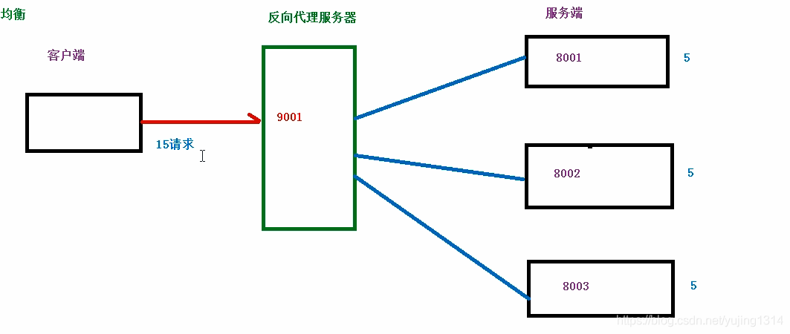

`Nginx` 实现负载均衡的策略：

- 轮询策略：默认情况下采用的策略，将所有客户端请求轮询分配给服务端。这种策略是可以正常工作的，但是如果其中某一台服务器压力太大，出现延迟，会影响所有分配在这台服务器下的用户。
- 最小连接数策略：将请求优先分配给压力较小的服务器，它可以平衡每个队列的长度，并避免向压力大的服务器添加更多的请求。
- 最快响应时间策略：优先分配给响应时间最短的服务器。
- 客户端 `ip` 绑定策略：来自同一个 `ip` 的请求永远只分配一台服务器，有效解决了动态网页存在的 `session` 共享问题。

> upstream 、proxy_pass两个配置是反向代理和负载均衡的重要点


## 动静分离

为了加快网站的解析速度，可以把动态页面和静态页面交给不同的服务器来解析，降低单个服务器的压力

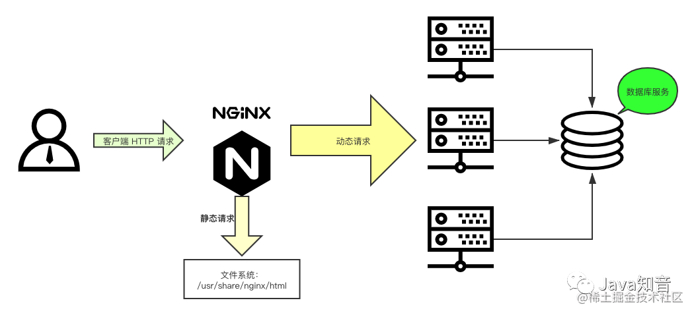


## 图片服务器

1. ***nginx.conf***

   ```conf
   server {
       listen 9901;
       server_name www.castingstar.xyz;
   
       localtion /images/ {
               alias /var/www/images/;
               autoindex on;
       }
   }
   ```


## Linux 部署

nginx 位置：***/etc/nginx***

静态文件存放位置：***/usr/share/nginx/html***


## 二级域名部署

在 nginx 目录下创建两个目录，一个目录存放需要部署项目 nginx 配置文件，一个目录存放项目

1. 创建目录 /etc/nginx/sites-available 存放项目配置文件，项目配置文件命名形式如 admin.castingstar.xyz.conf | fornt.castingstar.xyz.conf
2. 创建目录 /etc/nginx/sites-enabled 存放打包后的项目


## 错误检测

1. 配置文件 ***nginx.conf***

   验证Nginx配置文件的语法：

   ```shell
   sudo nginx -t
   ```

   如果配置文件有错误，将会显示错误信息，您需要根据错误提示进行修复。如果配置文件语法正确，则可以尝试重新加载Nginx服务：

   ```shell
   sudo systemctl reload nginx
   ```

   如果这仍然无法解决问题，您可以尝试查看系统日志文件以获取更多信息：

   ```shell
   sudo journalctl -xe
   ```

   这将显示系统日志文件的最后几行，其中可能包含有关Nginx服务启动失败的详细信息。

   
