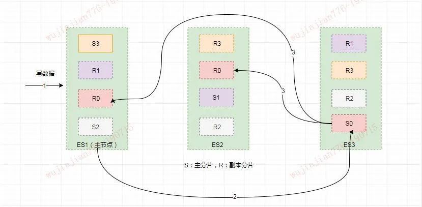
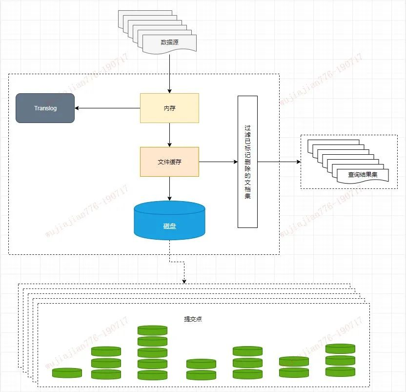
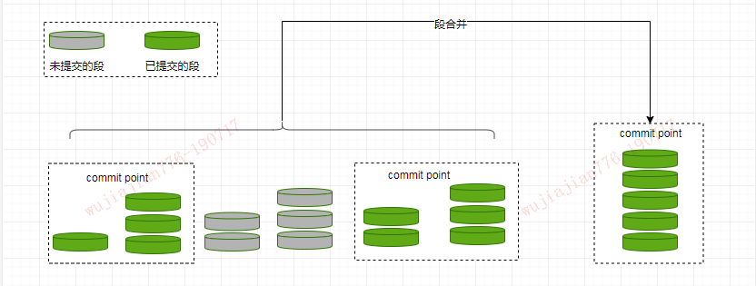
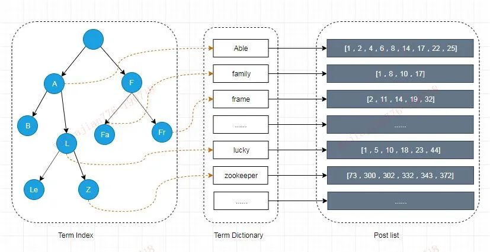
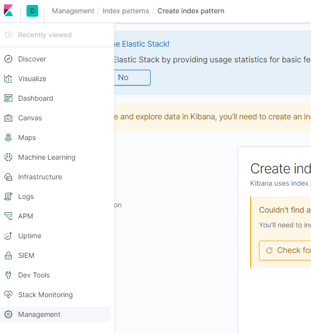
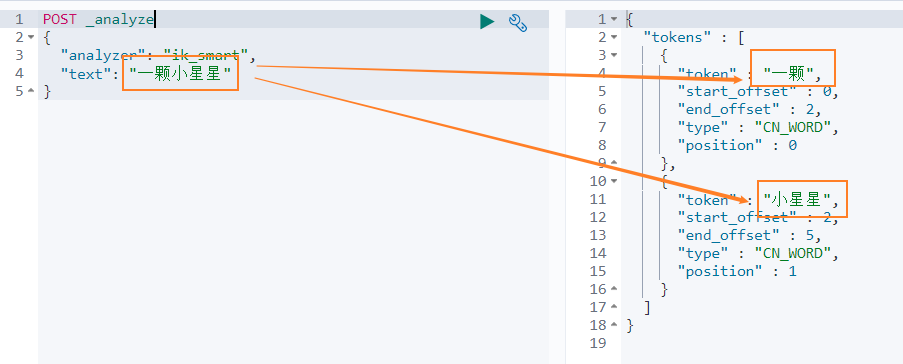
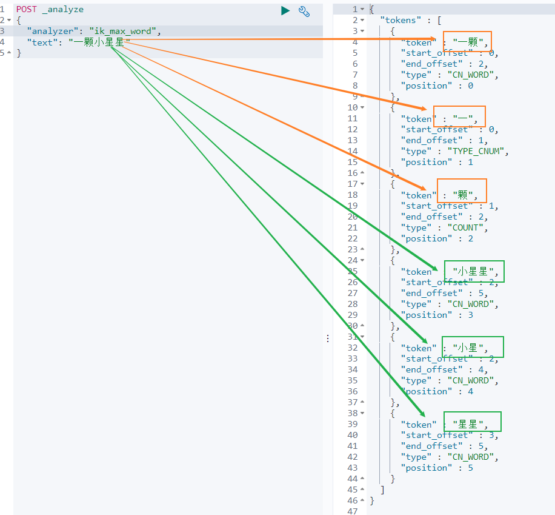
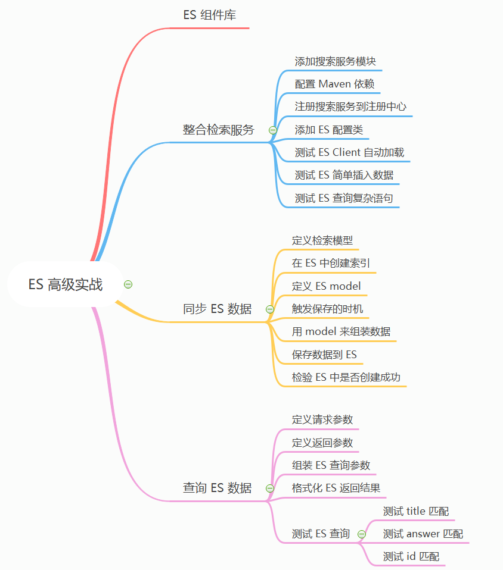
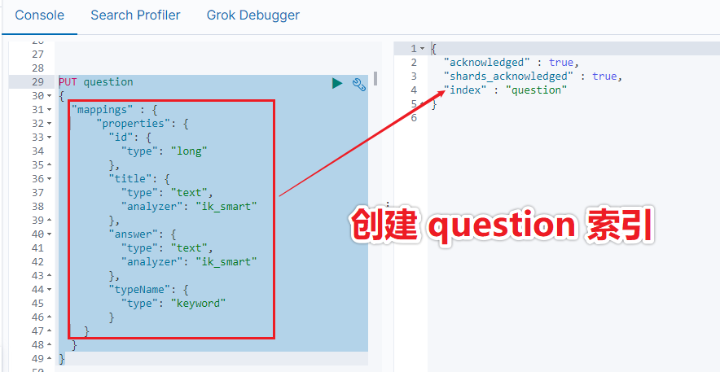
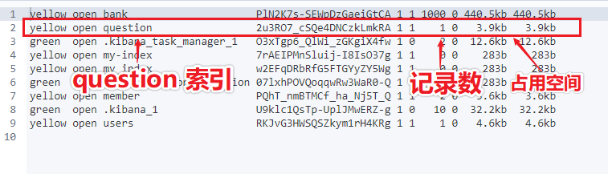

## 结构化数据

由二维表结构来逻辑表达和实现的数据，通过关系型数据库进行存储和管理

## 非结构化数据

可称为全文数据，不定长或无固定格式，不适于由数据库二维表来表现，包括所有格式的办公文档、XML、HTML、Word 文档，邮件，各类报表、图片和咅频、视频信息等

## 数据检索

对结构化和非结构化数据的搜索是不一样的，结构化具备一定的规律可以按照规律查询，对于非结构化的数据的查询可以使用顺序扫描和全文检索

<span style='font-size: 24px'>全文检索</span>是将非结构化数据经过加工变得具备结构进行检索


# Lucene

最好的全文检索工具包，以它为基础构建的全文检索引擎

-  Solr 
-  Elasticsearch


# 倒排索引

三份数据文档

- Java is the best programming language.
- PHP is the best programming language.
- Javascript is the best programming language.

<span style='font-size: 24px'>分词器</span>将每个文档的内容域拆分成单独的词，创建不重复单词的次数排序列表，并列出单词在哪个文档

```
Term          Doc_1    Doc_2   Doc_3
-------------------------------------
Java        |   X   |        |
is          |   X   |   X    |   X
the         |   X   |   X    |   X
best        |   X   |   X    |   X
programming |   x   |   X    |   X
language    |   X   |   X    |   X
PHP         |       |   X    |
Javascript  |       |        |   X
-------------------------------------
```


核心术语

- **词条（Term）：**索引里面最小的存储和查询单元，对于英文来说是一个单词，对于中文是一个词

- **词典（Term Dictionary）：**词条 Term 的集合

- **倒排表（Post list）：**一个文档通常由多个词组成，倒排表记录的是某个词在哪些文档里出现过以及出现的位置

- <span style='font-size: 22px'>倒排文件（Inverted File</span>—— 倒排表存放地


# ElasticSearch

分布式、可扩展、近实时的搜索与数据分析引擎，使用 RESTful API 进行操作


## 集群（Cluster）

自身实现了集群管理功能

1. 节点设置名称
2. 配置集群名，集群名相同即为同一个集群


<span style='font-size: 24px'>发现集群</span>

默认不加入集群，一台机器上自动组成集群

elasticsearch.yml 配置集群的部分节点列表，联系上其中一个则自动加入集群

```yml
discovery.zen.ping.unicast.hosts: ["host1", "host2:port"]
```


<span style='font-size: 24px'>节点角色</span>

```yml
node.master: true //是否候选主节点
node.data: true  //是否数据节点
```


<span style='font-size: 24px'>选主</span>

集群数量随意，选主需要配置最小同意节点数

~~~yml
discovery.zen.minimum_master_nodes：[候选主节点的个数/2 + 1]
~~~

<span style='font-size: 20px'>❌</span> 脑裂原因

- **网络问题：**集群延迟导致重新选举，多出来了主节点
- **节点负载：** 是主节点的同时又是数据节点，负载过高产生延迟导致重新选举，多出来了主节点
- **内存回收：**主节点的角色既为 Master 又为 Data，当 Data 节点上的 ES 进程占用的内存较大，引发 JVM 的大规模内存回收，造成 ES 进程失去响应。

✅ 候选主节点不是数据节点

✅ 适当调大响应时间，减少误判 

~~~yml
discovery.zen.ping_timeout：3s[默认]
~~~


## 分片（Shards）

自身实现，当索引上的数据量太大的时候，通过水平拆分的方式将一个索引上的数据拆分出来分配到不同的分片上

创建索引的时候需要指定分片的数量【一旦确定就不能修改】，通过**路由**来确定具体写入哪一个分片中

```http
PUT /myIndex
{
   "settings" : {
      "number_of_shards" : 5,   	-- 创建 5 个主分片
      "number_of_replicas" : 1  	-- 每个分片创建一个副本
   }
}
```


<span style='font-size: 24px'>副本</span>

一个分片可以有零到多个副本，分片和副本分片是不会在同一个节点上的，所以副本分片数的最大值是 N-1（其中 N 为节点数）

写操作在分片上面完成后会同步到副本，ES 写操作是并发的，通过乐观锁为文档添加 _version （版本号），文档被修改时版本号递增


<span style='font-size: 24px'>映射（Mapping）</span>

描述了索引中字段的存储类型、分词方式和是否存储等信息

ES 对于字段类型可以不指定然后动态对字段类型猜测，也可以在创建索引时具体指定字段的类型【精确】


所以创建索引的时候一个完整的格式应该是指定分片和副本数以及 Mapping 的定义，如下：

```http
PUT my_index 
{
   "settings" : {
      "number_of_shards" : 5,
      "number_of_replicas" : 1
   }
  "mappings": {
    "_doc": { 
      "properties": { 
        "title":    { "type": "text"  }, 
        "name":     { "type": "text"  }, 
        "age":      { "type": "integer" },  
        "created":  {
          "type":   "date", 
          "format": "strict_date_optional_time||epoch_millis"
        }
      }
    }
  }
}
```


# Usage

## 安装使用

1. 下载解压
2. 目录下运行 bin/elasticsearch 启动,默认在 9200 端口运行
3. 请求 curl http://localhost:9200/ 或者浏览器输入 http://localhost:9200

```json
{
  "name" : "U7fp3O9",
  "cluster_name" : "elasticsearch",
  "cluster_uuid" : "-Rj8jGQvRIelGd9ckicUOA",
  "version" : {
    "number" : "6.8.1",
    "build_flavor" : "default",
    "build_type" : "zip",
    "build_hash" : "1fad4e1",
    "build_date" : "2019-06-18T13:16:52.517138Z",
    "build_snapshot" : false,
    "lucene_version" : "7.7.0",
    "minimum_wire_compatibility_version" : "5.6.0",
    "minimum_index_compatibility_version" : "5.0.0"
  },
  "tagline" : "You Know, for Search"
}
```


## 集群状态

GET /_cluster/health

```http
{
  "cluster_name" : "hhhhh",
  "status" : "yellow",
  "timed_out" : false,
  "number_of_nodes" : 1,
  "number_of_data_nodes" : 1,
  "active_primary_shards" : 9,
  "active_shards" : 9,
  "relocating_shards" : 0,
  "initializing_shards" : 0,
  "unassigned_shards" : 5,
  "delayed_unassigned_shards" : 0,
  "number_of_pending_tasks" : 0,
  "number_of_in_flight_fetch" : 0,
  "task_max_waiting_in_queue_millis" : 0,
  "active_shards_percent_as_number" : 64.28571428571429
}
```

- 绿色
- **黄色：**预警，主分片功能正常，但至少有一个副本是不能正常工作的
- **红色：**集群不可正常使用。某个或某些分片及其副本异常不可用，这时集群的查询操作还能执行，但是返回的结果会不准确。对于分配到这个分片的写入请求将会报错，最终会导致数据的丢失。

当集群状态为红色时，它将会继续从可用的分片提供搜索请求服务，但是你需要尽快修复那些未分配的分片


## ES 机制原理

ES 的基本概念和基本操作介绍完了之后，我们可能还有很多疑惑：

- 它们内部是如何运行的？
- 主分片和副本分片是如何同步的？
- 创建索引的流程是什么样的？
- ES 如何将索引数据分配到不同的分片上的？以及这些索引数据是如何存储的？
- 为什么说 ES 是近实时搜索引擎而文档的 CRUD (创建-读取-更新-删除) 操作是实时的？
- 以及 Elasticsearch 是怎样保证更新被持久化在断电时也不丢失数据？
- 还有为什么删除文档不会立刻释放空间？


### 写索引原理

下图描述了 3 个节点的集群，共拥有 12 个分片，其中有 4 个主分片（S0、S1、S2、S3）和 8 个副本分片（R0、R1、R2、R3），每个主分片对应两个副本分片，节点 1 是主节点（Master 节点）负责整个集群的状态。


写索引是只能写在主分片上，然后同步到副本分片。这里有四个主分片，一条数据 ES 是根据什么规则写到特定分片上的呢？

这条索引数据为什么被写到 S0 上而不写到 S1 或 S2 上？那条数据为什么又被写到 S3 上而不写到 S0 上了？

首先这肯定不会是随机的，否则将来要获取文档的时候我们就不知道从何处寻找了。


**实际上，这个过程是根据下面这个公式决定的：**

```
shard = hash(routing) % number_of_primary_shards
```

Routing 是一个可变值，默认是文档的 _id ，也可以设置成一个自定义的值。

Routing 通过 Hash 函数生成一个数字，然后这个数字再除以 number_of_primary_shards （主分片的数量）后得到余数。


这就解释了为什么我们要在创建索引的时候就确定好主分片的数量并且永远不会改变这个数量：因为如果数量变化了，那么所有之前路由的值都会无效，文档也再也找不到了。


由于在 ES 集群中每个节点通过上面的计算公式都知道集群中的文档的存放位置，所以每个节点都有处理读写请求的能力。


在一个写请求被发送到某个节点后，该节点即为前面说过的协调节点，协调节点会根据路由公式计算出需要写到哪个分片上，再将请求转发到该分片的主分片节点上。




假如此时数据通过路由计算公式取余后得到的值是<font color='red'> `shard=hash(routing)%4=0`</font>

**则具体流程如下：**

- 客户端向 ES1 节点（协调节点）发送写请求，通过路由计算公式得到值为 0，则当前数据应被写到主分片 S0 上。
- ES1 节点将请求转发到 S0 主分片所在的节点 ES3，ES3 接受请求并写入到磁盘。
- 并发将数据复制到两个副本分片 R0 上，其中通过乐观并发控制数据的冲突。一旦所有的副本分片都报告成功，则节点 ES3 将向协调节点报告成功，协调节点向客户端报告成功。


### 存储原理

上面介绍了在 ES 内部索引的写处理流程，这个流程是在 ES 的内存中执行的，数据被分配到特定的分片和副本上之后，最终是存储到磁盘上的，这样在断电的时候就不会丢失数据。


具体的存储路径可在配置文件 <font color='red'>`../config/elasticsearch.yml `</font>中进行设置，默认存储在安装目录的 Data 文件夹下。


建议不要使用默认值，因为若 ES 进行了升级，则有可能导致数据全部丢失：

```yml
path.data: /path/to/data  //索引数据
path.logs: /path/to/logs  //日志记录
```


#### **①分段存储**

索引文档以段的形式存储在磁盘上，何为段？索引文件被拆分为多个子文件，则每个子文件叫作段，每一个段本身都是一个倒排索引，并且段具有不变性，一旦索引的数据被写入硬盘，就不可再修改。

```
索引
- 段
- 段
- .....
```

在底层采用了分段的存储模式，使它在读写时几乎完全避免了锁的出现，大大提升了读写性能。


段被写入到磁盘后会生成一个提交点，提交点是一个用来记录所有提交后段信息的文件。


一个段一旦拥有了提交点，就说明这个段只有读的权限，失去了写的权限。相反，当段在内存中时，就只有写的权限，而不具备读数据的权限，意味着不能被检索。


段的概念提出主要是因为：**在早期全文检索中为整个文档集合建立了一个很大的倒排索引，并将其写入磁盘中。**


如果索引有更新，就需要重新全量创建一个索引来替换原来的索引。这种方式在数据量很大时效率很低，并且由于创建一次索引的成本很高，所以对数据的更新不能过于频繁，也就不能保证时效性。


<font color='red'>**索引文件分段存储并且不可修改，那么新增、更新和删除如何处理呢？**</font>

- **新增，**新增很好处理，由于数据是新的，所以只需要对当前文档新增一个段就可以了。

  

- **删除，**由于不可修改，所以对于删除操作，不会把文档从旧的段中移除而是通过新增一个 .del 文件，文件中会列出这些被删除文档的段信息。

  

  这个被标记删除的文档仍然可以被查询匹配到， 但它会在最终结果被返回前从结果集中移除。

  

- **更新，**不能修改旧的段来进行反映文档的更新，其实更新相当于是删除和新增这两个动作组成。会将旧的文档在 .del 文件中标记删除，然后文档的新版本被索引到一个新的段中。

  

  可能两个版本的文档都会被一个查询匹配到，但被删除的那个旧版本文档在结果集返回前就会被移除。


**段被设定为不可修改具有一定的优势也有一定的缺点，优势主要表现在：**

- 不需要锁。如果你从来不更新索引，你就不需要担心多进程同时修改数据的问题。
- 一旦索引被读入内核的文件系统缓存，便会留在哪里，由于其不变性。只要文件系统缓存中还有足够的空间，那么大部分读请求会直接请求内存，而不会命中磁盘。这提供了很大的性能提升。
- 其它缓存(像 Filter 缓存)，在索引的生命周期内始终有效。它们不需要在每次数据改变时被重建，因为数据不会变化。
- 写入单个大的倒排索引允许数据被压缩，减少磁盘 I/O 和需要被缓存到内存的索引的使用量。


**缺点如下：**

- 当对旧数据进行删除时，旧数据不会马上被删除，而是在 .del 文件中被标记为删除。而旧数据只能等到段更新时才能被移除，这样会造成大量的空间浪费。
- 若有一条数据频繁的更新，每次更新都是新增新的标记旧的，则会有大量的空间浪费。
- 每次新增数据时都需要新增一个段来存储数据。当段的数量太多时，对服务器的资源例如文件句柄的消耗会非常大。
- 在查询的结果中包含所有的结果集，需要排除被标记删除的旧数据，这增加了查询的负担。


#### **②延迟写策略**

说了存储的形式，那么索引写入到磁盘的过程是怎样的？是否是直接调 Fsync 物理性地写入磁盘？


答案是显而易见的，如果是直接写入到磁盘上，磁盘的 I/O 消耗上会严重影响性能。


那么当写数据量大的时候会造成 ES 停顿卡死，查询也无法做到快速响应。如果真是这样 ES 也就不会称之为近实时全文搜索引擎了。


为了提升写的性能，ES 并没有每新增一条数据就增加一个段到磁盘上，而是采用延迟写的策略。


每当有新增的数据时，就将其先写入到内存中，在内存和磁盘之间是文件系统缓存。


当达到默认的时间（1 秒钟）或者内存的数据达到一定量时，会触发一次刷新（Refresh），将内存中的数据生成到一个新的段上并缓存到文件缓存系统 上，稍后再被刷新到磁盘中并生成提交点。


这里的内存使用的是 ES 的 JVM 内存，而文件缓存系统使用的是操作系统的内存。


新的数据会继续的被写入内存，但内存中的数据并不是以段的形式存储的，因此不能提供检索功能。


由内存刷新到文件缓存系统的时候会生成新的段，并将段打开以供搜索使用，而不需要等到被刷新到磁盘。


在 Elasticsearch 中，写入和打开一个新段的轻量的过程叫做 **Refresh （即 jvm内存刷新到文件缓存系统）**。


默认情况下每个分片会每秒自动刷新一次。这就是为什么我们说 Elasticsearch 是近实时搜索，因为文档的变化并不是立即对搜索可见，但会在一秒之内变为可见。


我们也可以手动触发 Refresh，`POST /_refresh` 刷新所有索引，`POST /nba/_refresh` 刷新指定的索引。


**Tips：**尽管刷新是比提交轻量很多的操作，它还是会有性能开销。当写测试的时候， 手动刷新很有用，但是不要在生产>环境下每次索引一个文档都去手动刷新。而且并不是所有的情况都需要每秒刷新。


如果我们用 ES 存储日志时，更想要优化的是索引速度而不是近实时的搜索，因此不必需要尽可能快的 reflash。

这时可以在创建索引时在 Settings 中通过调大 <font color='red'>`refresh_interval = "30s" `</font> 的值 ， 降低每个索引的刷新频率，设值时需要注意后面带上时间单位，否则默认是毫秒。当 `refresh_interval=-1` 时表示关闭索引的自动刷新。


虽然通过延时写的策略可以减少数据往磁盘上写的次数提升了整体的写入能力，但是我们知道文件缓存系统也是内存空间，属于操作系统的内存，只要是内存都存在断电或异常情况下丢失数据的危险。

为了避免丢失数据，Elasticsearch 添加了事务日志（Translog），事务日志记录了所有还没有持久化到磁盘的数据。




<font color='red'>**添加了事务日志后整个写索引的流程如上图所示：**</font>

- 一个新文档被索引之后，先被写入到内存中，但是为了防止数据的丢失，会追加一份数据到事务日志中。

  

  不断有新的文档被写入到内存，同时也都会记录到事务日志中。这时新数据还不能被检索和查询。

  

- 当达到默认的刷新时间或内存中的数据达到一定量后，会触发一次 Refresh，将内存中的数据以一个新段形式刷新到文件缓存系统中并清空内存。这时虽然新段未被提交到磁盘，但是可以提供文档的检索功能且不能被修改。

  

- 随着新文档索引不断被写入，当日志数据大小超过 512M 或者时间超过 30 分钟时，会触发一次 Flush。

  

  内存中的数据被写入到一个新段同时被写入到文件缓存系统，文件系统缓存中数据通过 Fsync 刷新到磁盘中，生成提交点，日志文件被删除，创建一个空的新日志。


通过这种方式当断电或需要重启时，ES 不仅要根据提交点去加载已经持久化过的段，还需要工具 Translog 里的记录，把未持久化的数据重新持久化到磁盘上，避免了数据丢失的可能。


#### **③段合并**

由于自动刷新流程每秒会创建一个新的段 ，这样会导致短时间内的段数量暴增。而段数目太多会带来较大的麻烦。


每一个段都会消耗文件句柄、内存和 CPU 运行周期。更重要的是，每个搜索请求都必须轮流检查每个段然后合并查询结果，所以段越多，搜索也就越慢。


Elasticsearch 通过在后台定期进行段合并来解决这个问题。小的段被合并到大的段，然后这些大的段再被合并到更大的段。


段合并的时候会将那些旧的已删除文档从文件系统中清除。被删除的文档不会被拷贝到新的大段中。合并的过程中不会中断索引和搜索。



合并结束后老的段会被删除，新的段被 Flush 到磁盘，同时写入一个包含新段且排除旧的和较小的段的新提交点，新的段被打开可以用来搜索。


段合并的计算量庞大， 而且还要吃掉大量磁盘 I/O，段合并会拖累写入速率，如果任其发展会影响搜索性能。


Elasticsearch 在默认情况下会对合并流程进行资源限制，所以搜索仍然有足够的资源很好地执行。


## 性能优化


### 存储设备

磁盘在现代服务器上通常都是瓶颈。Elasticsearch 重度使用磁盘，你的磁盘能处理的吞吐量越大，你的节点就越稳定。


优化磁盘 I/O ：

- **使用 SSD。**比机械磁盘优秀多了。
- **使用 RAID 0。**条带化 RAID 会提高磁盘 I/O，代价显然就是当一块硬盘故障时整个就故障了。不要使用镜像或者奇偶校验 RAID 因为副本已经提供了这个功能。
- **另外，使用多块硬盘，**并允许 Elasticsearch 通过多个 path.data 目录配置把数据条带化分配到它们上面。
- **不要使用远程挂载的存储，**比如 NFS 或者 SMB/CIFS。这个引入的延迟对性能来说完全是背道而驰的。
- **如果你用的是 EC2，当心 EBS。**即便是基于 SSD 的 EBS，通常也比本地实例的存储要慢。


### 内部索引优化



Elasticsearch 为了能快速找到某个 Term，先将所有的 Term 排个序，然后根据二分法查找 Term，时间复杂度为 logN，就像通过字典查找一样，这就是 Term Dictionary。


现在再看起来，似乎和传统数据库通过 B-Tree 的方式类似。但是如果 Term 太多，Term Dictionary 也会很大，放内存不现实，于是有了 Term Index。


就像字典里的索引页一样，A 开头的有哪些 Term，分别在哪页，可以理解 Term Index是一棵树。


这棵树不会包含所有的 Term，它包含的是 Term 的一些前缀。通过 Term Index 可以快速地定位到 Term Dictionary 的某个 Offset，然后从这个位置再往后顺序查找。


在内存中用 FST 方式压缩 Term Index，FST 以字节的方式存储所有的 Term，这种压缩方式可以有效的缩减存储空间，使得 Term Index 足以放进内存，但这种方式也会导致查找时需要更多的 CPU 资源。


对于存储在磁盘上的倒排表同样也采用了压缩技术减少存储所占用的空间。


### 调整配置参数

**参数建议如下：**

- 给每个文档指定有序的具有压缩良好的序列模式 ID，避免随机的 UUID-4 这样的 ID，这样的 ID 压缩比很低，会明显拖慢 Lucene。

  

- 对于那些不需要聚合和排序的索引字段禁用 Doc values。Doc Values 是有序的基于 document=>field value 的映射列表。

  

- 不需要做模糊检索的字段使用 Keyword 类型代替 Text 类型，这样可以避免在建立索引前对这些文本进行分词。

  

- 如果你的搜索结果不需要近实时的准确度，考虑把每个索引的 index.refresh_interval 改到 30s 。

  如果你是在做大批量导入，导入期间你可以通过设置这个值为 -1 关掉刷新，还可以通过设置 index.number_of_replicas: 0 关闭副本。别忘记在完工的时候重新开启它。

  

- 避免深度分页查询建议使用 Scroll 进行分页查询。普通分页查询时，会创建一个 from+size 的空优先队列，每个分片会返回 from+size 条数据，默认只包含文档 ID 和得分 Score 给协调节点。

  如果有 N 个分片，则协调节点再对（from+size）×n 条数据进行二次排序，然后选择需要被取回的文档。当 from 很大时，排序过程会变得很沉重，占用 CPU 资源严重。

  

- 减少映射字段，只提供需要检索，聚合或排序的字段。其他字段可存在其他存储设备上，例如 Hbase，在 ES 中得到结果后再去 Hbase 查询这些字段。

  

- 创建索引和查询时指定路由 Routing 值，这样可以精确到具体的分片查询，提升查询效率。路由的选择需要注意数据的分布均衡。


### JVM 调优

- 确保堆内存最小值（ Xms ）与最大值（ Xmx ）的大小是相同的，防止程序在运行时改变堆内存大小。

  

  Elasticsearch 默认安装后设置的堆内存是 1GB。可通过 ../config/jvm.option 文件进行配置，但是最好不要超过物理内存的50%和超过 32GB。

  

- GC 默认采用 CMS 的方式，并发但是有 STW 的问题，可以考虑使用 G1 收集器。

  

- ES 非常依赖文件系统缓存（Filesystem Cache），快速搜索。一般来说，应该至少确保物理上有一半的可用内存分配到文件系统缓存。


# Kibana

ES 数据可视化平台。


# 安装

## 安装ES

### [1 ) 下载镜像文件](http://www.passjava.cn/#/02.PassJava架构篇/14.Elasticsearch原理?id=_1-下载镜像文件)

```sh
docker pull elasticsearch:7.4.2
```

### 2 ) 创建实例

映射配置文件

```sh
配置映射文件夹
mkdir -p /mydata/elasticsearch/config

配置映射文件夹
mkdir -p /mydata/elasticsearch/data

设置文件夹权限任何用户可读可写
chmod 777 /mydata/elasticsearch -R

配置 http.host
echo "http.host: 0.0.0.0" >> /mydata/elasticsearch/config/elasticsearch.yml
```

启动 elasticsearch 容器

```sh
docker run --name elasticsearch -p 9200:9200 -p 9300:9300 \
-e "discovery.type"="single-node" \
-e ES_JAVA_OPTS="-Xms64m -Xmx128m" \
-v /mydata/elasticsearch/config/elasticsearch.yml:/usr/share/elasticsearch/config/elasticsearch.yml \
-v /mydata/elasticsearch/data:/usr/share/elasticsearch/data \
-v /mydata/elasticsearch/plugins:/usr/share/elasticsearch/plugins \
-d elasticsearch:7.4.2复制复制失败复制成功
```

访问 elasticsearch 服务

访问：[http://192.168.56.10:9200](http://192.168.56.10:9200/)

返回的 reponse

```json
{
  "name" : "8448ec5f3312",
  "cluster_name" : "elasticsearch",
  "cluster_uuid" : "xC72O3nKSjWavYZ-EPt9Gw",
  "version" : {
    "number" : "7.4.2",
    "build_flavor" : "default",
    "build_type" : "docker",
    "build_hash" : "2f90bbf7b93631e52bafb59b3b049cb44ec25e96",
    "build_date" : "2019-10-28T20:40:44.881551Z",
    "build_snapshot" : false,
    "lucene_version" : "8.2.0",
    "minimum_wire_compatibility_version" : "6.8.0",
    "minimum_index_compatibility_version" : "6.0.0-beta1"
  },
  "tagline" : "You Know, for Search"
}复制复制失败复制成功
```

访问：http://192.168.56.10:9200/_cat 访问节点信息

```sh
127.0.0.1 62 90 0 0.06 0.10 0.05 dilm * 8448ec5f3312复制复制失败复制成功
```


## 搭建 Kibana 环境

```sh
docker pull kibana:7.4.2

docker run --name kibana -e ELASTICSEARCH_HOSTS=http://192.168.56.10:9200 -p 5601:5601 -d kibana:7.4.2
复制复制失败复制成功
```

访问 kibana: http://192.168.56.10:5601/




## 中文分词

版本一致

```
https://github.com/medcl/elasticsearch-analysis-ik/releases/download/v7.4.2/elasticsearch-analysis-ik-7.4.2.zip

```

```shell
docker exec -it <容器 id> /bin/bash
```

进入bin目录 找到[elasticsearch](https://so.csdn.net/so/search?q=elasticsearch&spm=1001.2101.3001.7020)-plugin


在bin文件中运行 

```shell
./elasticsearch-plugin install https://github.com/medcl/elasticsearch-analysis-ik/releases/download/v7.4.2/elasticsearch-analysis-ik-7.4.2.zip
```

 下载ik[分词](https://so.csdn.net/so/search?q=分词&spm=1001.2101.3001.7020)器 之后的话就是重启镜像 然后访问kibana


### 模式

ik 分词器有两种模式

- 智能分词模式 ( ik_smart )
- 最大组合分词模式 ( ik_max_word )

我们先看下 `智能分词` 模式的效果。比如对于 `一颗小星星` 进行中文分词，得到的两个词语：`一颗`、`小星星`

我们在 Dev Tools Console 输入如下查询

```json
POST _analyze
{
  "analyzer": "ik_smart",
  "text": "一颗小星星"
}复制复制失败复制成功
```

得到如下结果，被分词为 一颗和小星星。



再来看下 `最大组合分词模式`。输入如下查询语句。

```json
POST _analyze
{
  "analyzer": "ik_max_word",
  "text": "一颗小星星"
}复制复制失败复制成功
```

`一颗小星星` 被分成了 6 个词语：一颗、一、颗、小星星、小星、星星。




# 实战




PassJava 这个项目可以用来配置题库，如果我们想通过关键字来搜索题库，该怎么做呢？

类似于百度搜索，输入几个关键字就可以搜到关联的结果，我们这个功能也是类似，通过 Elasticsearch 做检索引擎，后台管理界面和小程序作为搜索入口，只需要在小程序上输入关键字，就可以检索相关的题目和答案。

首先我们需要把题目和答案保存到 ES 中，在存之前，第一步是定义索引的模型，如下所示，模型中有 `title` 和 `answer` 字段，表示题目和答案。

```json
"id": {
    "type": "long"
},
"title": {
    "type": "text",
    "analyzer": "ik_smart"
},
"answer": {
    "type": "text",
    "analyzer": "ik_smart"
},
"typeName": {
    "type": "keyword"
}复制复制失败复制成功
```

### [3.2 在 ES 中创建索引](http://www.passjava.cn/#/02.PassJava架构篇/15.Elasticsearch实战?id=_32-在-es-中创建索引)

上面我们已经定义了索引结构，接着就是在 ES 中创建索引。

在 Kibana 控制台中执行以下语句：

```sh
PUT question
{
    "mappings" : {
        "properties": {
              "id": {
                  "type": "long"
              },
              "title": {
                  "type": "text",
                  "analyzer": "ik_smart"
              },
              "answer": {
                  "type": "text",
                  "analyzer": "ik_smart"
              },
              "typeName": {
                  "type": "keyword"
              }
        }
  }
}复制复制失败复制成功
```

执行结果如下所示：



我们可以通过以下命令来查看 question 索引是否在 ES 中：

```sh
GET _cat/indices
```

执行结果如下图所示：



### [3.3 定义 ES model](http://www.passjava.cn/#/02.PassJava架构篇/15.Elasticsearch实战?id=_33-定义-es-model)

passjava-common中定义类对应索引模型

```java
@Data
public class QuestionEsModel {
    private Long id;
    private String title;
    private String answer;
    private String typeName;
}
```

