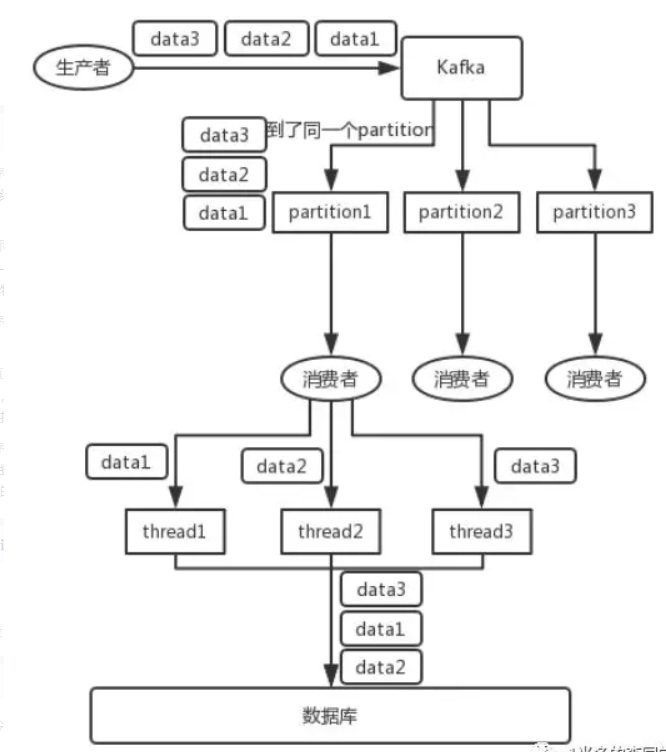
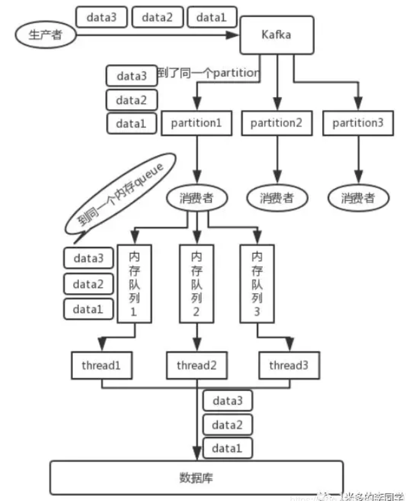
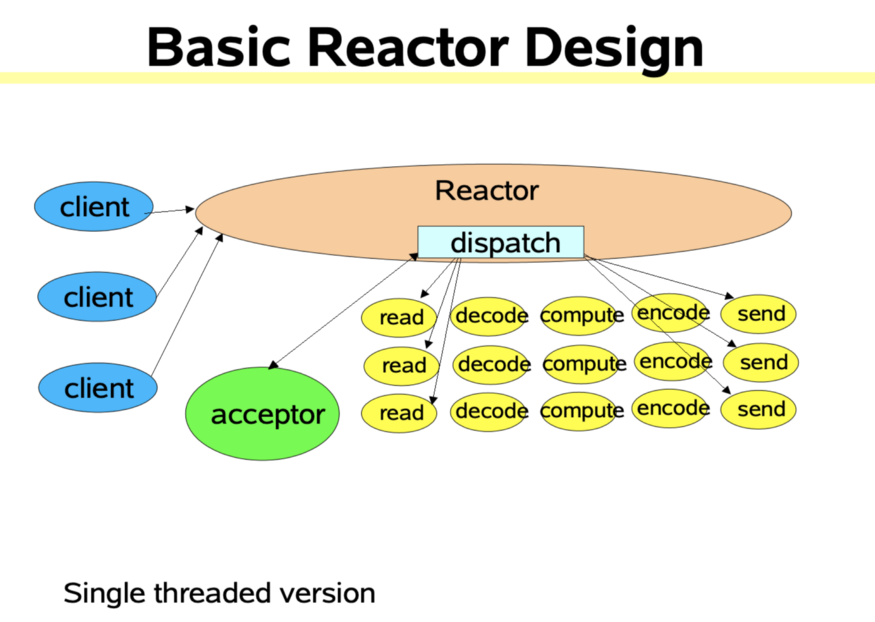
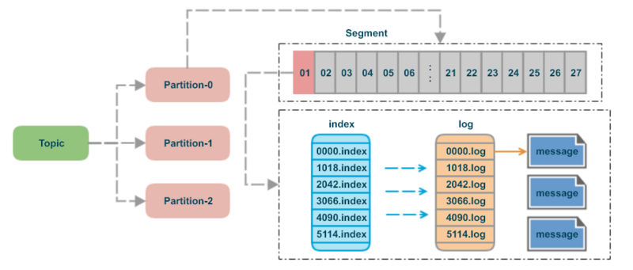

# 介绍

## 什么是事件流？

事件流是人体中枢神经系统的数字等价物。它是“永远在线”世界的技术基础，在这个世界里，企业越来越多地由软件定义和自动化，软件用户越来越多地使用软件。

从技术上讲，事件流是实时捕获数据的实践，这些数据来源包括数据库、传感器、移动设备、云服务以及事件流形式的软件应用程序; 持久地存储这些事件流以备日后检索; 实时地以及回顾性地操作、处理和响应事件流; 根据需要将事件流路由到不同的目的地技术。因此，事件流可以确保数据的连续流和解释，从而使正确的信息在正确的地点、正确的时间出现。


## 我可以使用事件流做什么？

事件流应用于跨越大量行业和组织的各种用例。

它的许多例子包括:

​	实时处理实时支付和金融交易，如在证券交易所、银行和保险中。

​	实时跟踪和监控汽车、卡车、车队和货运，如物流和汽车行业。

​	不断地从物联网设备或其他设备(如工厂和风力发电场)中获取和分析传感器数据。

​	收集并立即响应客户交互和订单，例如零售、酒店和旅游行业以及移动应用程序。

​	监测病人在医院的护理情况，预测病情变化，以确保在紧急情况下及时治疗。

​	连接、存储和提供公司不同部门生产的数据。

​	作为数据平台、事件驱动架构和微服务的基础。


## Apache Kafka 是一个事件流平台，这是什么意思？

Kafka 结合了三个关键功能，这样你就可以通过一个经过实战考验的解决方案来实现端到端的事件流用例:

- 发布(写)和订阅(读)事件流，包括从其他系统连续导入/导出数据。
- 可以持久和可靠地存储事件流，可以存储多长时间就存储多长时间。
- 处理事件发生时或回顾性地处理事件流。

所有这些功能都是以分布式的、高度可伸缩的、弹性的、容错的和安全的方式提供的。卡夫卡可以部署在裸金属硬件、虚拟机和容器上，也可以部署在内部和云中。您可以在自我管理您的卡夫卡环境和使用各种供应商提供的完全管理的服务之间进行选择。


## 简而言之，卡夫卡是如何工作的？

Kafka 是一个分布式系统，由服务器和客户端组成，它们通过高性能的 TCP 网络协议进行通信。它可以部署在裸机硬件、虚拟机和本地容器以及云环境中。

**服务器**: Kafka 作为一个或多个服务器的集群运行，这些服务器可以跨越多个数据中心或云区域。其中一些服务器形成存储层，称为代理。其他服务器运行卡夫卡连接，以不断导入和导出数据作为事件流，将卡夫卡与您现有的系统，如关系数据库以及其他卡夫卡集群集成。为了让您实现关键任务用例，Kafka 集群具有高度的可伸缩性和容错性: 如果其中任何一台服务器出现故障，其他服务器将接管它们的工作，以确保在不丢失任何数据的情况下连续运行。

**客户机**: 它们允许您编写分布式应用程序和微服务，这些应用程序和微服务可以并行、大规模地、以容错的方式读取、写入和处理事件流，即使在出现网络问题或机器故障的情况下也是如此。Kafka 提供了一些这样的客户端，这些客户端由 Kafka 社区提供的几十个客户端增强: 客户端可用于 Java 和 Scala，包括更高级别的 Kafka Streams 库，可用于 Go、 Python、 C/C + + 和许多其他编程语言以及 REST API。


> 简而言之，Kafka Server 称之为 代理（broker），多个 broker 一起工作形成集群保证高可用。
>
> Kafka Client 称之为 客户机，可以生产消息和消费信息。


## 主要概念和术语

一个事件记录了世界上或者你的生意中“发生了什么”的事实。它在文档中也称为记录或消息。当你读或写数据给卡夫卡，你这样做的形式的事件。从概念上讲，事件具有键、值、时间戳和可选的元数据头。下面是一个例子:

事件键: “ Alice”

事件值: “付给 Bob 200美元”

事件时间戳: “2020年6月25日下午2:06”

**生产者**是那些向卡夫卡发布(写入)事件的客户端应用程序，而消费者是那些订阅(读取和处理)这些事件的客户端应用程序。在卡夫卡中，生产者和消费者是完全解耦的，彼此是不可知的，这是实现卡夫卡著名的高可伸缩性的关键设计元素。例如，生产者从不需要等待消费者。卡夫卡提供了各种各样的保证，比如一次性精确处理事件的能力。

事件被组织起来并持久地存储在**主题**中。非常简单，主题类似于文件系统中的文件夹，事件就是该文件夹中的文件。一个示例主题名称可以是“ pay”。卡夫卡中的主题总是多生产者和多订阅者: 一个主题可以有零个、一个或多个生产者向其写入事件，也可以有零个、一个或多个订阅这些事件的消费者。主题中的事件可以根据需要随时阅读ーー与传统的消息传递系统不同，事件在使用后不会被删除。相反，您可以通过每个主题的配置设置定义卡夫卡应该保留您的事件多长时间，之后旧的事件将被丢弃。卡夫卡的性能在数据大小方面实际上是恒定的，因此长时间存储数据是完全可以的。

主题是**分区**的，这意味着一个主题分布在位于不同卡夫卡**代理**的许多“桶”上。这种数据的分布式放置对于可伸缩性非常重要，因为它允许客户机应用程序同时从/向多个代理读写数据。当一个新事件发布到一个主题时，它实际上被追加到该主题的一个分区中。具有相同事件键的事件(例如，一个客户或车辆 ID)被写入同一个分区，卡夫卡保证给定主题分区的任何使用者将总是以与写入事件完全相同的顺序读取该分区的事件。


图: 这个示例主题有四个分区 P1-P4。通过将事件通过网络写入主题的分区，两个不同的生产者客户机独立地向主题发布新事件。具有相同键的事件(用图中的颜色表示)被写入到相同的分区中。注意，如果适当的话，两个生产者都可以写入同一个分区。


为了使您的数据具有容错性和高可用性，每个主题都可以**被复制**，甚至可以跨地理区域或数据中心复制，因此总是有多个代理拥有数据副本，以防万一出现问题，您需要对代理进行维护，等等。一个常见的生产设置是 3 的复制因子，也就是说，您的数据总是有三个副本。此复制是在主题分区级别上执行的。

这本入门书应该足够做一个介绍了。如果您感兴趣，文档的设计部分将详细解释卡夫卡的各种概念。


## 卡夫卡的 API

除了用于管理和管理任务的命令行工具之外，Kafka 还有5个用于 Java 和 Scala 的核心 API:

- [Admin API](https://kafka.apache.org/documentation.html#adminapi) 用于管理和检查主题、代理和其他卡夫卡对象。
- 发布(写)一个事件流到一个或多个卡夫卡主题的 [Producer API](https://kafka.apache.org/documentation.html#producerapi)
- 用于订阅(读取)一个或多个主题并处理生成给它们的事件流的 [Consumer API](https://kafka.apache.org/documentation.html#consumerapi)
- 用于实现流处理应用程序和微服务的 [Kafka Streams API](https://kafka.apache.org/documentation/streams)。它提供了处理事件流的高级函数，包括转换、聚合和连接等有状态操作、窗口、基于事件时间的处理等等。从一个或多个主题读取输入，以便将输出生成到一个或多个主题，从而有效地将输入流转换为输出流。
- [Kafka Connect API](https://kafka.apache.org/documentation.html#connect) 用于构建和运行可重用的数据导入/导出连接器，这些连接器使用(读取)或生成(写入)来自外部系统和应用程序的事件流，以便它们能够与 Kafka 集成。例如，连接到 PostgreSQL 这样的关系数据库的连接器可能会捕获对一组表的每一次更改。然而，在实践中，您通常不需要实现自己的连接器，因为卡夫卡社区已经提供了数百个现成的连接器。


## 接下来该怎么办

- 要获得与卡夫卡的实践经验，按照 [Quickstart](https://kafka.apache.org/quickstart)
- 要更详细地了解卡夫卡，请阅读文献[Documentation](https://kafka.apache.org/documentation/)。您还可以选择卡夫卡的书籍和学术论文[Kafka books and academic papers](https://kafka.apache.org/books-and-papers)
- 浏览用例[Use Cases](https://kafka.apache.org/powered-by)，了解其他用户在我们的世界范围的社区是如何获得卡夫卡的价值。
- 加入当地的[卡夫卡聚会小组](https://kafka.apache.org/events)，观看来自 [Kafka Summit的卡夫卡社区主要会议的演讲](https://kafka-summit.org/past-events/)。


# 架构


# 消费顺序


卡夫卡保证给定主题分区的任何使用者将总是以与写入事件完全相同的顺序读取该分区的事件，如果一个Topic只有一个Partition，那么这个Topic对应consumer的消费必然是有序的。

消费者使用一个线程消费多个 partition 时，对于每一 partition 的消费顺序都是有序的，但是吞吐量低；若使用多线程消费，会出现消费顺序的不一致。



三个线程同时消费一个 partision 会出现问题，应该设定一个标准：每一个线程负责一个 prtition。


解决方案：
写N个queue，将具有相同key的数据都存储在同一个queue，然后对于N个线程，每个线程分别消费一个queue即可。




# 重平衡

一个 partition 只能被一个 consumer 消费

一个 consumer 可以消费多个 partition

消费者们以 Consumer Group 的形式消费 Topic 下的 partision，重平衡就一个 Consumer Group 下的所有 Consumer 如何达成一致来分配 Topic 的每个 partition。


**出现时机**

- 订阅的 Topic 发生变更，包括 Partition 发生变更
- 某个  Consumer Group  突然加入或者退出了一个 Consumer
- ......


# 丢失消息

## Producer lost msg

生产者没有设置相应的策略，发送过程中丢失数据。


**方案：**

`acks=all`，则一定不会丢失数据。

leader 接收到消息，所有 follower 都同步成功，才认定消费者发送消息成功。

`retries = MAX`  失败则无限重试。


## Kafka lost msg

比较常见的一个场景，某个 broker 宕机了，重新选举 partition 的 leader 时。如果此时follower 还没来得及同步数据，它就少了一部分数据。


**方案：**4个参数

- topic  设置  `replication.factor >= 2`  即每个 partition 至少有2个副本。
- kafka Server 设置 `min.insync.replicas >= 2`  即一个 leader 至少有 2 个follower 是数据同步的。
- Producer 设置 `acks=all` 
- Producer 设置  `retries= MAX`


## Consumer lost msg

Consumer 拉取到了 partition 的某个消息之后，会自动提交了 `offset` 表示消费了这个消息。

准备进行真正消费的时候，突然挂掉了，消息实际上并没有被消费，但是 `offset` 却被自动提交了。


**方案：**

手动提交 `offset`

> 消费和提交不是原子的，存在消费后宕机了没有提交，导致的重复消费。


# 重复消费

每个消息写进去，都有一个 `offset`，consumer 消费了消息之后，会提交 offset ，下次从 `offset` 开始消费。


上面提到重复消费的原因是：消息消费后，宕机了，未能及时提交 offset


**方案：**

幂等性


# 高可用

## 多副本

一个 Topic 有多个 partition，就是说一个话题也是有分类的。

每个 partition 有许多的副本，数据冗余来保持数据的高可用。

partition 的副本中有一个 Leader ，其它是 Follower ，每个副本分布在不同的 Broker（Kafka Server）中，单点故障后此份数据仍有备份。


## ISR 机制

ISR 中的 Follower 都是一定时间内与 Leader 保持有效连接的。

Follower 周期性地向 Leader 发送 FetchRequest ，发送间隔配置在`replica.fetch.wait.max.ms`中，默认值为 500

```javascript
public class FetchRequest {
    private final short versionId;
    private final int correlationId;
    private final String clientId;
    private final int replicaId;
    // Follower容忍的最大等待时间: 到点Leader立即返回结果，默认值500
    private final int maxWait;    
    // Follower容忍的最小返回数据大小：当Leader有足够数据时立即返回，兜底等待maxWait返回，默认值1
    private final int minBytes;   
    private final Map<TopicAndPartition, PartitionFetchInfo> requestInfo;  // Follower中各Partititon对应的LEO及获取数量
}
```

 Leader 维护 ISR 列表并将 ISR 的变更同步至 ZooKeeper，被移出 ISR 的 Follower 会继续向 Leader 发 FetchRequest 请求，试图再次跟上 Leader 重新进入 ISR


**「Unclean 领导者选举」**

当 Kafka 中`unclean.leader.election.enable = trur`  且 ISR 中所有副本均宕机的情况下，才允许 ISR 外的副本被选为 Leader，此时会丢失部分已应答的数据

好处是， Leader 一直存在，虽然丢失部分数据，但不至于停止对外提供服务，因此提升了高可用性


## ACK 机制

生产者发送消息中包含 acks 字段，该字段代表 Leader 应答生产者前 Leader 收到的应答数

**「acks=0」**

生产者无需等待服务端的任何确认，消息被添加到生产者套接字缓冲区后就视为已发送，因此 acks=0 不能保证服务端已收到消息


**「acks=1」**

 `Partition Leader` 接收到消息而且写入本地磁盘了，就认为成功了


**「acks=all」**

ISR 中的副本收到就算成功


**「结论：」**

发送的 acks=1 和 0 消息会出现丢失情况，为不丢失消息可配置生产者`acks=all` & `replication.factory >= 2` & `min.insync.replicas >= 2`


## 故障恢复机制

集群中的 Broker 中选出一个 Controller，负责 Partition 的 Leader 选举以及 Replica 的重新分配

Kafka 使用 ZooKeeper 存储 Broker、Topic 等状态数据，Kafka 集群中的 Controller 和 Broker 会在 ZooKeeper 指定节点上注册 Watcher(事件监听器)，以便在特定事件触发时，由 ZooKeeper 将事件通知到对应 Broker

#### **Broker**

**「当 Broker 发生故障后，由 Controller 负责选举受影响 Partition 的新 Leader 并通知到相关 Broker」**

- 当 Broker 出现故障与 ZooKeeper 断开连接后，该 Broker 在 ZooKeeper 对应的 znode 会自动被删除，ZooKeeper 会触发 Controller 注册在该节点的 Watcher；
- Controller 从 ZooKeeper 的`/brokers/ids`节点上获取宕机 Broker 上的所有 Partition；
- Controller 再从 ZooKeeper 的`/brokers/topics`获取所有 Partition 当前的 ISR；
- 对于宕机 Broker 是 Leader 的 Partition，Controller 从 ISR 中选择幸存的 Broker 作为新 Leader；
- 最后 Controller 通过 LeaderAndIsrRequest 请求向的 Broker 发送 LeaderAndISRRequest 请求。


#### **Controller**

集群中的 Controller 也会出现故障，因此 Kafka 让所有 Broker 都在 ZooKeeper 的 Controller 节点上注册一个 Watcher

Controller 发生故障时对应的 Controller 临时节点会自动删除，此时注册在其上的 Watcher 会被触发，所有活着的 Broker 都会去竞选成为新的Controller


# 性能


## 顺序写

**磁盘慢？**


完成一次磁盘 IO，需要经过`寻道`、`旋转`和`数据传输`三个步骤。

1. 寻道时间：将读写磁头移动至正确的磁道上所需要的时间
2. 旋转延迟：盘片旋转将请求数据所在的扇区移动到读写磁头下方所需要的时间
3. 数据传输时间：简单计算时可忽略时间
4. 

因此，省去寻道、旋转可以极大地提高磁盘读写的性能。

顺序写文件，基本减少了磁盘`寻道`和`旋转`的次数。

Kafka 中每个分区是一个有序的，不可变的消息序列，新的消息不断追加到 Partition 的末尾，在 Kafka 中 Partition 只是一个逻辑概念，Kafka 将 Partition 划分为多个 Segment，每个 Segment 对应一个物理文件，Kafka 对 segment 文件追加写，这就是顺序写文件。


**为什么 Kafka 可以使用追加写的方式呢？**

说白了，Kafka 就是一个`Queue`，而 Redis 就是一个`HashMap`。

`Queue`和`Map`的区别是什么？

`Queue` 是 FIFO 的，数据是有序的；`HashMap`数据是无序的，是随机读写的。Kafka 的不可变性，有序性使得 Kafka 可以使用追加写的方式写文件。


## 零拷贝

传统文件传输过程：

- CPU 发出对应的指令给磁盘控制器，然后返回；
- 磁盘控制器收到指令后，开始准备数据，会把数据放入到磁盘控制器的内部缓冲区中，然后产生一个**中断**；
- CPU 收到中断信号后，停下手头的工作，接着把磁盘控制器的缓冲区的数据一次一个字节地读进自己的寄存器，然后再把寄存器里的数据写入到内存，而在数据传输的期间 CPU 是无法执行其他任务的。


明显问题：数据传输过程，都要需要 CPU 亲自参与搬运数据的过程，而且这个过程，CPU 是不能做其他事情的。大量数据非常慢


#### DMA

因为数据传输过程cpu不能做其他事情， DMA 直接内存访问（Direct Memory Access）应运而生，在进行 I/O 设备和内存的数据传输的时候，数据搬运的工作全部交给 DMA 控制器，而 CPU 不再参与任何与数据搬运相关的事情，这样 CPU 就可以去处理别的事务。


CPU 在这个过程中也是必不可少的


#### DMA + 传统文件传输

如果服务端要提供文件传输的功能，我们能想到的最简单的方式是：将磁盘上的文件读取出来，然后通过网络协议发送给客户端。

传统 I/O 的工作方式是，数据读取和写入是从用户空间到内核空间来回复制，而内核空间的数据是通过操作系统层面的 I/O 接口从磁盘读取或写入。

代码通常如下，一般会需要两个系统调用：

```c
read(file, tmp_buf, len);
write(socket, tmp_buf, len);
```

两行代码 但是发生了很多事情


发生了 4 次用户态与内核态的上下文切换

因为发生了两次系统调用，一次调用，两次切换态。上下文切换一次切换需要耗时几十纳秒到几微秒，高并发影响性能。

要想提高文件传输的性能，就需要减少「用户态与内核态的上下文切换」和「内存拷贝」的次数。


#### 优化文件传输的性能

> 先来看看，如何减少「用户态与内核态的上下文切换」的次数呢？

读取磁盘数据的时候，之所以要发生上下文切换，这是因为用户空间没有权限操作磁盘或网卡，内核的权限最高，这些操作设备的过程都需要交由操作系统内核来完成，所以一般要通过内核去完成某些任务的时候，就需要使用操作系统提供的系统调用函数。

而一次系统调用必然会发生 2 次上下文切换：首先从用户态切换到内核态，当内核执行完任务后，再切换回用户态交由进程代码执行。

所以，**要想减少上下文切换到次数，就要减少系统调用的次数**。


> 再来看看，如何减少「数据拷贝」的次数？

在前面我们知道了，传统的文件传输方式会历经 4 次数据拷贝，而且这里面，「从内核的读缓冲区拷贝到用户的缓冲区里，再从用户的缓冲区里拷贝到 socket 的缓冲区里」，这个过程是没有必要的。

因为文件传输的应用场景中，在用户空间我们并不会对数据「再加工」，所以数据实际上可以不用搬运到用户空间，因此**用户的缓冲区是没有必要存在的**。


#### **引出零拷贝**

维基百科是这样介绍零拷贝的：

零复制（英语：Zero-copy；也译零拷贝）技术是指计算机执行操作时，CPU 不需要先将数据从某处内存复制到另一个特定区域。这种技术通常用于通过网络传输文件时节省 CPU 周期和内存带宽。

在 OS 层面上的 `Zero-copy` 通常指避免在 `用户态(User-space)` 与 `内核态(Kernel-space)` 之间来回拷贝数据。


**实现**

- mmap + write
- sendfile

##### mmap + write

`read()` 系统调用的过程中会把内核缓冲区的数据拷贝到用户的缓冲区里，于是为了减少这一步开销，我们可以用 `mmap()` 替换 `read()` 系统调用函数。

```c
buf = mmap(file, len);
write(sockfd, buf, len);
```

`mmap()` 系统调用函数会直接把内核缓冲区里的数据「**映射**」到用户空间，这样，操作系统内核与用户空间就不需要再进行任何的数据拷贝操作。


使用 `mmap()` 来代替 `read()`， 可以减少一次数据拷贝的过程。

但这还不是最理想的零拷贝，因为仍然需要通过 CPU 把内核缓冲区的数据拷贝到 socket 缓冲区里，而且仍然需要 4 次上下文切换，因为系统调用还是 2 次。


##### sendfile

在 Linux 内核版本 2.1 中，提供了一个专门发送文件的系统调用函数 `sendfile()`

```c
#include <sys/socket.h>
ssize_t sendfile(int out_fd, int in_fd, off_t *offset, size_t count);
```

它的前两个参数分别是目的端和源端的文件描述符，后面两个参数是源端的偏移量和复制数据的长度，返回值是实际复制数据的长度。

如果不需要将数据传送到用户空间，只是用于传送就可使用`sendfile()`

- 直接把内核缓冲区里的数据拷贝到 socket 缓冲区里
- 不再拷贝到用户态


进阶，如果网卡支持 SG-DMA（*The Scatter-Gather Direct Memory Access*）技术，可以减少CPU 把内核缓冲区里的数据拷贝到 socket 缓冲区的过程。

 Linux命令，查看网卡是否支持 scatter-gather 特性：

```bash
$ ethtool -k eth0 | grep scatter-gather
scatter-gather: on
```

对于网卡支持 SG-DMA 技术， `sendfile()` 过程发生了变化：

- 第一步，通过 DMA 将磁盘上的数据拷贝到内核缓冲区里；
- 第二步，缓冲区描述符和数据长度传到 socket 缓冲区，这样网卡的 SG-DMA 控制器就可以直接将内核缓存中的数据拷贝到网卡的缓冲区里


这就是所谓的**零拷贝（Zero-copy）技术，因为我们没有在内存层面去拷贝数据，也就是说全程没有通过 CPU 来搬运数据，所有的数据都是通过 DMA 来进行传输的。**。

零拷贝技术的文件传输方式相比传统文件传输的方式，减少了 2 次上下文切换和数据拷贝次数，**只需要 2 次上下文切换和数据拷贝次数，就可以完成文件的传输，而且 2 次的数据拷贝过程，都不需要通过 CPU，2 次都是由 DMA 来搬运。**

所以，总体来看，**零拷贝技术可以把文件传输的性能提高至少一倍以上**。


Kafka 利用了「零拷贝」技术，从而大幅提升了 I/O 的吞吐率

它调用了 Java NIO 库里的 `transferTo` 方法：

```java
@Overridepublic 
long transferFrom(FileChannel fileChannel, long position, long count) throws IOException { 
    return fileChannel.transferTo(position, count, socketChannel);
}
```

如果 Linux 系统支持 `sendfile()` 系统调用，那么 `transferTo()` 实际上最后就会使用到 `sendfile()` 系统调用函数。


常见的零拷贝思路主要有三种：

- 直接 I/O：数据直接跨过内核，在用户地址空间与 I/O 设备之间传递，内核只是进行必要的虚拟存储配置等辅助工作；
- 用户空间不需要读数据，需要传送：当应用程序不需要对数据进行访问时，则可以避免将数据从内核空间拷贝到用户空间；
- 写时复制：数据不需要提前拷贝，而是当需要修改的时候再进行部分拷贝。


## PageCache

前面文件传输过程，第一步都是先需要先把磁盘文件数据拷贝「内核缓冲区」里，这个「内核缓冲区」实际上是**磁盘高速缓存（PageCache）**

读写磁盘速度远远慢于读写内存，如果把「读写磁盘」替换成「读写内存」，速度将大大提升。所以 DMA 把磁盘里的数据搬运到内存里。

但是，内存空间远比磁盘要小，选择哪些磁盘数据拷贝到内存呢？

程序运行的时候，具有「局部性」，所以通常，刚被访问的数据在短时间内再次被访问的概率很高，于是我们可以用 **PageCache 来缓存最近被访问的数据**，当空间不足时淘汰最久未被访问的缓存。

所以，读磁盘数据的时候，优先在 PageCache 找，如果数据存在则可以直接返回；如果没有，则从磁盘中读取，然后缓存 PageCache 中。

还有一点，读取磁盘数据的时候，需要找到数据所在的位置，但是对于机械磁盘来说，就是通过磁头旋转到数据所在的扇区，再开始「顺序」读取数据，但是旋转磁头这个物理动作是非常耗时的，为了降低它的影响，**PageCache 使用了「预读功能」**。

比如，假设 read 方法每次只会读 `32 KB` 的字节，虽然 read 刚开始只会读 0 ～ 32 KB 的字节，但内核会把其后面的 32～64 KB 也读取到 PageCache，这样后面读取 32～64 KB 的成本就很低，如果在 32～64 KB 淘汰出 PageCache 前，进程读取到它了，收益就非常大。

所以，PageCache 的优点主要是两个：

- 缓存最近被访问的数据；
- 预读功能；

这两个做法，将大大提高读写磁盘的性能。

**但是，在传输大文件（GB 级别的文件）的时候，PageCache 会不起作用，那就白白浪费 DMA 多做的一次数据拷贝，造成性能的降低，即使使用了 PageCache 的零拷贝也会损失性能**

这是因为如果你有很多 GB 级别文件需要传输，每当用户访问这些大文件的时候，内核就会把它们载入 PageCache 中，于是 PageCache 空间很快被这些大文件占满。

另外，由于文件太大，可能某些部分的文件数据被再次访问的概率比较低，这样就会带来 2 个问题：

- PageCache 由于长时间被大文件占据，其他「热点」的小文件可能就无法充分使用到 PageCache，于是这样磁盘读写的性能就会下降了；
- PageCache 中的大文件数据，由于没有享受到缓存带来的好处，但却耗费 DMA 多拷贝到 PageCache 一次；

所以，针对大文件的传输，不应该使用 PageCache，也就是说不应该使用零拷贝技术，因为可能由于 PageCache 被大文件占据，而导致「热点」小文件无法利用到 PageCache，这样在高并发的环境下，会带来严重的性能问题。


拓展：大文件传输用什么方式实现？

当调用 read 方法读取文件时，进程实际上会阻塞在 read 方法调用，因为要等待磁盘数据的返回，如下图


对于阻塞的问题，可以用异步 I/O 来解决，它工作方式如下图：


它把读操作分为两部分：

- 前半部分，内核向磁盘发起读请求，可以**不等待数据就位就可以返回**，于是进程此时可以处理其他任务；
- 后半部分，当内核将磁盘中的数据拷贝到进程缓冲区后，进程将接收到内核的**通知**，再去处理数据；

而且，异步 I/O 并没有涉及到 PageCache，绕开 PageCache 的 I/O 叫直接 I/O，使用 PageCache 的 I/O 则叫缓存 I/O。

通常，对于磁盘，异步 I/O 只支持直接 I/O。

前面也提到，大文件的传输不应该使用 PageCache，因为可能由于 PageCache 被大文件占据，而导致「热点」小文件无法利用到 PageCache。

于是，**在高并发的场景下，针对大文件的传输的方式，应该使用「异步 I/O + 直接 I/O」来替代零拷贝技术**。

直接 I/O 应用场景常见的两种：

- 应用程序已经实现了磁盘数据的缓存，那么可以不需要 PageCache 再次缓存，减少额外的性能损耗。
- 传输大文件的时候，由于大文件难以命中 PageCache 缓存，而且会占满 PageCache 导致「热点」文件无法充分利用缓存，从而增大了性能开销，因此，这时应该使用直接 I/O。

另外，由于直接 I/O 绕过了 PageCache，就无法享受内核的这两点的优化：

- 内核的 I/O 调度算法会缓存尽可能多的 I/O 请求在 PageCache 中，最后「**合并**」成一个更大的 I/O 请求再发给磁盘，这样做是为了减少磁盘的寻址操作；
- 内核也会「**预读**」后续的 I/O 请求放在 PageCache 中，一样是为了减少对磁盘的操作；

于是，传输大文件的时候，使用「异步 I/O + 直接 I/O」了，就可以无阻塞地读取文件了。

所以，传输文件的时候，我们要根据文件的大小来使用不同的方式：

- 传输大文件的时候，使用「异步 I/O + 直接 I/O」；
- 传输小文件的时候，则使用「零拷贝技术」；


### PageCache


producer 生产消息到 Broker 时，Broker 会使用 pwrite() 系统调用【对应到 Java NIO 的 FileChannel.write() API】按偏移量写入数据，此时数据都会先写入`page cache`。consumer 消费消息时，Broker 使用 sendfile() 系统调用【对应 FileChannel.transferTo() API】，零拷贝地将数据从 page cache 传输到 broker 的 Socket buffer，再通过网络传输。

leader 与 follower 之间的同步，与上面 consumer 消费数据的过程是同理的。

`page cache`中的数据会随着内核中 flusher 线程的调度以及对 sync()/fsync() 的调用写回到磁盘（持久化）。另外，如果 consumer 要消费的消息不在`page cache`里，才会去磁盘读取，并且会顺便预读出一些相邻的块放入 page cache，以方便下一次读取。

因此如果 Kafka producer 的生产速率与 consumer 的消费速率相差不大，那么就能几乎只靠对 broker page cache 的读写完成整个生产 - 消费过程，磁盘访问非常少。


## 网络模型

Kafka 自己实现了网络模型做 RPC。

底层基于 Java NIO，采用和 Netty 一样的 Reactor 线程模型。



Reacotr 模型主要分为三个角色

- Reactor：把 IO 事件分配给对应的 handler 处理
- Acceptor：处理客户端连接事件
- Handler：处理非阻塞的任务


针对传统阻塞 IO 模型的两个问题，Reactor 模型基于池化思想，避免为每个连接创建线程，连接完成后将业务处理交给线程池处理；

基于 IO 复用模型，多个连接共用同一个阻塞对象，不用等待所有的连接。遍历到有新数据可以处理时，操作系统会通知程序，线程跳出阻塞状态，进行业务逻辑处理


Kafka 即基于 Reactor 模型实现了多路复用和处理线程池。其设计如下：


其中包含了一个`Acceptor`线程，用于处理新的连接，`Acceptor` 有 N 个 `Processor` 线程 select 和 read socket 请求，N 个 `Handler` 线程处理请求并相应，即处理业务逻辑。

I/O 多路复用可以通过把多个 I/O 的阻塞复用到同一个 select 的阻塞上，从而使得系统在单线程的情况下可以同时处理多个客户端请求。它的最大优势是系统开销小，并且不需要创建新的进程或者线程，降低了系统的资源开销。


## 批量传输与压缩消息

`Producer` 有两个重要的参数batch.size和linger.ms与批量发送消息有关


**为什么要批量发送消息呢？**

Kafka 的主要场景就是高并发读和高吞吐写，也就说 Kafka 需要写入和读取大量的消息。那有没有一种办法可以让发送和读取消息付出的代价更小呢？一个很简单的手段就是 **批量传输与压缩消息**。批量主要是为了让传输消息的次数变得更少，压缩主要是为了降低网络传输的消耗，提高吞吐量。


在 Kafka 中，Kafka 会对消息进行分组，发送消息之前，会先将消息组合在一起形成消息块，然后 `Producer` 会将消息快一起发送到  `Broker` 。

另外，网络带宽是有限的，我们在网络中传输数据之前往往需要先对其进行压缩。


在 Java 程序员中，生成 `KafkaProducer` 对象的代码可能会像下面这样：

```java
Properties props = new Properties();
props.put("bootstrap.servers", "localhost:9092");
props.put("acks", "all");
props.put("retries", 0);
props.put("batch.size", 16384);
props.put("linger.ms", 1);
props.put("buffer.memory", 33554432);
props.put("key.serializer", "org.apache.kafka.common.serialization.StringSerializer");
props.put("value.serializer", "org.apache.kafka.common.serialization.StringSerializer");
// 开启GZIP压缩
props.put("compression.type", "gzip");
Producer<String, String> producer = new KafkaProducer<>(props);
```


`Broker` 接收到压缩后的消息块之后会依次将压缩后的消息块写入文件中，`Consumer` 同时会依次获取消息块，当消息块到达 `Consumer`  才会对消息块进行解压缩

**Kafka Producer 的执行流程如下图所示** ：


发送消息依次经过以下处理器：

- Serialize ：键、值序列化
- Partition：将消息写入主题的哪个分区，默认情况下遵循 murmur2 算法。自定义分区程序也可以传递给生产者，以控制应将消息写入哪个分区。
- Compress：默认情况下，在 Kafka 生产者中不启用压缩。
- Accumulate：消息累计器。其内部为每个 Partition 维护一个`Deque`双端队列，队列保存将要发送的批次数据，`Accumulate`将数据累计到一定数量，或者在一定过期时间内，便将数据以批次的方式发送出去。记录被累积在主题每个分区的缓冲区中。根据生产者批次大小属性将记录分组。主题中的每个分区都有一个单独的累加器 / 缓冲区。
- Group Send：记录累积器中分区的批次按将它们发送到的代理分组。批处理中的记录基于 `batch.size` 和 `linger.ms` 属性发送到代理。记录由生产者根据两个条件发送。当达到定义的批次大小或达到定义的延迟时间时。

[速度与压缩比如何兼得？压缩算法在构建部署中的优化](https://tech.meituan.com/2021/01/07/pack-gzip-zstd-lz4.html)

Producer、Broker 和 Consumer 使用相同的压缩算法，在 producer 向 Broker 写入数据，Consumer 向 Broker 读取数据时甚至可以不用解压缩，最终在 Consumer 收到消息时才解压，这样节省了大量的网络和磁盘开销。


## partition 提供并发度

一个 Consumer 消费一个 partition，同一个 Group 下的不同 Consumer 并发消费 Topic 下的所有 Paritition。

可以说，每增加一个 Paritition 就增加了一个消费并发度。


Kafka 具有优秀的分区分配算法——StickyAssignor，可以保证分区的分配尽量地均衡，且每一次重分配的结果尽量与上一次分配结果保持一致。这样，整个集群的分区尽量地均衡，各个 Broker 和 Consumer 的处理不至于出现太大的倾斜。


**那是不是分区数越多越好呢？**

当然不是。


#### 分区需要文件句柄

在 kafka 的 broker 中，每个分区都会对照着文件系统的一个目录。在 kafka 的数据日志文件目录中，每个日志数据段都会分配两个文件，一个索引文件和一个数据文件。因此，随着 partition 的增多，需要的文件句柄数急剧增加，必要时需要调整操作系统允许打开的文件句柄数。


#### 客户端 / 服务器端需要使用的内存就越多

客户端 producer 有个参数 batch.size，默认是 16KB。它会为每个分区缓存消息，一旦满了就打包将消息批量发出。看上去这是个能够提升性能的设计。不过很显然，因为这个参数是分区级别的，如果分区数越多，这部分缓存所需的内存占用也会更多。


#### 降低高可用性

分区越多，发生 Broker 宕机，那么恢复时间也将变长


## 文件结构

每个 Topic 又可以分为一个或多个 partition 。每个 partition 各自存在一个记录消息数据的日志文件。

partition 的日志在物理上实际按大小被分成多个 Segment。



- segment file 组成：由 2 大部分组成，分别为 index file 和 data file，此 2 个文件一一对应，成对出现，后缀”.index”和“.log”分别表示为 segment 索引文件、数据文件。
- segment 文件命名规则：partion 全局的第一个 segment 从 0 开始，后续每个 segment 文件名为上一个 segment 文件最后一条消息的 offset 值。数值最大为 64 位 long 大小，19 位数字字符长度，没有数字用 0 填充。


index 采用稀疏索引，这样每个 index 文件大小有限，Kafka 采用`mmap`的方式，直接将 index 文件映射到内存，这样对 index 的操作就不需要操作磁盘 IO。`mmap`的 Java 实现对应 `MappedByteBuffer` 。


Kafka 利用二分法来查找对应 offset 的消息位置：


1. 按照二分法找到小于 offset 的 segment 的.log 和.index
2. 用目标 offset 减去文件名中的 offset 得到消息在这个 segment 中的偏移量。
3. 再次用二分法在 index 文件中找到对应的索引。
4. 到 log 文件中，顺序查找，直到找到 offset 对应的消息。


## 总结

Kafka 是一个优秀的开源项目。其在性能上面的优化做的淋漓尽致，是很值得我们深入学习的一个项目。无论是思想还是实现，我们都应该认真的去看一看，想一想。

**Kafka 性能优化：**

1. 零拷贝网络和磁盘
2. 优秀的网络模型，基于 Java NIO
3. 高效的文件数据结构设计
4. Parition 并行和可扩展
5. 数据批量传输
6. 数据压缩
7. 顺序读写磁盘
8. 无锁轻量级 offset


# 原理

#### **生产者-消费者**


`生产者`-`消费者`是一种设计模式，`生产者`和`消费者`之间通过添加一个`中间组件`来达到解耦。`生产者`向`中间组件`生成数据，`消费者`消费数据。


就像 65 哥读书时给小芳写情书，这里 65 哥就是`生产者`，情书就是`消息`，小芳就是`消费者`。但有时候小芳不在，或者比较忙，65 哥也比较害羞，不敢直接将情书塞小芳手里，于是将情书塞在小芳抽屉中。所以抽屉就是这个`中间组件`。


在程序中我们通常使用`Queue`来作为这个`中间组件`。可以使用多线程向队列中写入数据，另外的消费者线程依次读取队列中的数据进行消费。模型如下图所示：


`生产者`-`消费者`模式通过添加一个中间层，不仅可以解耦生产者和消费者，使其易于扩展，还可以异步化调用、缓冲消息等。


#### **分布式队列**


后来 65 哥和小芳异地了，65 哥在`卷都`奋斗，小芳在`魔都`逛街。于是只能通过`邮局`寄暧昧信了。这样 65 哥、邮局和小芳就成了`分布式`的了。65 哥将信件发给邮局，小芳从邮局拿到 65 哥写的信，再回去慢慢看。


Kafka 的消息`生产者`就是`Producer`，上游消费者进程添加 Kafka Client 创建 Kafka Producer，向 Broker 发送消息，Broker 是集群部署在远程服务器上的 Kafka Server 进程，下游消费者进程引入 Kafka Consumer API 持续消费队列中消息。


因为 Kafka Consumer 使用 Poll 的模式，需要 Consumer 主动拉去消息。所有小芳只能定期去邮局拿信件了(呃，果然主动权都在小芳手上啊)。


#### **主题**


邮局不能只为 65 哥服务，虽然 65 哥一天写好几封信。但也无法挽回邮局的损失。所以邮局是可以供任何人寄信。只需要寄信人写好地址(主题)，邮局建有两地的通道就可以发收信件了。


Kafka 的 Topic 才相当于一个队列，Broker 是所有队列部署的机器。可以按业务创建不同的 Topic，Producer 向所属业务的 Topic 发送消息，相应的 Consumer 可以消费并处理消息。


#### **分区**


由于 65 哥写的信太多，一个邮局已经无法满足 65 哥的需求，邮政公司只能多建几个邮局了，65 哥将信件按私密度分类(分区策略)，从不同的邮局寄送。


同一个 Topic 可以创建多个分区。理论上分区越多并发度越高，Kafka 会根据分区策略将分区尽可能均衡的分布在不同的 Broker 节点上，以避免消息倾斜，不同的 Broker 负载差异太大。分区也不是越多越好哦，毕竟太多邮政公司也管理不过来。


#### **副本**


为防止由于邮局的问题，比如交通断啦，邮车没油啦。导致 65 哥的暧昧信无法寄到小芳手上，使得 65 哥晚上远程跪键盘。邮局决定将 65 哥的信件复制几份发到多个正常的邮局，这样只要有一个邮局还在，小芳就可以收到 65 哥的信了。


Kafka 采用分区副本的方式来保证数据的高可用，每个分区都将建立指定数量的副本数，kakfa 保证同一分区副本尽量分布在不同的 Broker 节点上，以防止 Broker 宕机导致所有副本不可用。Kafka 会为分区的多个副本选举一个作为主副本(Leader)，主副本对外提供读写服务，从副本(Follower)实时同步 Leader 的数据。


#### **多消费者**


哎，65 哥的信件满天飞，小芳天天跑邮局，还要一一拆开看，65 哥写的信又臭又长，让小芳忙得满身大汗。于是小芳啪的一下，很快啊，变出多个分身去不同的邮局取信，这样小芳终于可以挤出额外的时间逛街了。


#### **广播消息**


邮局最近提供了定制明信片业务，每个人都可以设计明信片，同一个身份只能领取一种明信片。65 哥设计了一堆，广播给所有漂亮的小妹妹都可以来领取，美女啪变出的分身也可以来领取，但是同一个身份的多个分身只能取一种明信片。


Kafka 通过 Consumer Group 来实现广播模式消息订阅，即不同 group 下的 consumer 可以重复消费消息，相互不影响，同一个 group 下的 consumer 构成一个整体。


最后我们完成了 Kafka 的整体架构，如下：


### **Zookeeper**

Zookeeper 是一个成熟的分布式协调服务，它可以为分布式服务提供分布式配置、同步服务和命名注册等能力.。

对于任何分布式系统，都需要一种协调任务的方法。Kafka 是使用 ZooKeeper 而构建的分布式系统。

Kafka 将 Broker、Topic 和 Partition 的元数据信息存储在 Zookeeper 上。通过在 Zookeeper 上建立相应的数据节点，并监听节点的变化，Kafka 使用 Zookeeper 完成以下功能：

- Kafka Controller 的 Leader 选举
- Kafka 集群成员管理
- Topic 配置管理
- 分区副本管理

我们看一看 Zookeeper 下 Kafka 创建的节点，即可一目了然的看出这些相关的功能。


### **Controller**

从 Broker 中选举一个 Controller 负责分区 Leader 和 Follower 的管理。

当某个 partition 的 leader 副本发生故障时，由 Controller 负责为该分区选举新的 leader 。

当某个 partition  的 ISR集合发生变化时，由 Controller 负责通知所有 broker 更新其元数据信息。

当使用`kafka-topics.sh` 脚本为某个 topic 增加分区数量时，同样还是由 Controller 负责分区的重新分配。


Kafka 中 Contorller 的选举的工作依赖于 Zookeeper，成功竞选为控制器的 broker 会在 Zookeeper 中创建`/controller`这个临时（EPHEMERAL）节点。


#### **选举过程**


Broker 启动的时候尝试去读取`/controller`节点的`brokerid`的值，如果`brokerid`的值不等于-1，则表明已经有其他的 Broker 成功成为 Controller 节点，当前 Broker 主动放弃竞选；如果不存在`/controller`节点，或者 brokerid 数值异常，当前 Broker 尝试去创建`/controller`这个节点，此时也有可能其他 broker 同时去尝试创建这个节点，只有创建成功的那个 broker 才会成为控制器，而创建失败的 broker 则表示竞选失败。每个 broker 都会在内存中保存当前控制器的 brokerid 值，这个值可以标识为 activeControllerId。


#### **实现**


Controller 读取 Zookeeper 中的节点数据，初始化上下文(Controller Context)，并管理节点变化，变更上下文，同时也需要将这些变更信息同步到其他普通的 broker 节点中。Controller 通过定时任务，或者监听器模式获取 zookeeper 信息，事件监听会更新更新上下文信息，如图所示，Controller 内部也采用生产者-消费者实现模式，Controller 将 zookeeper 的变动通过事件的方式发送给事件队列，队列就是一个`LinkedBlockingQueue`，事件消费者线程组通过消费消费事件，将相应的事件同步到各 Broker 节点。这种队列 FIFO 的模式保证了消息的有序性。


#### **职责**


Controller 被选举出来，作为整个 Broker 集群的管理者，管理所有的集群信息和元数据信息。它的职责包括下面几部分：


1. 处理 Broker 节点的上线和下线，包括自然下线、宕机和网络不可达导致的集群变动，Controller 需要及时更新集群元数据，并将集群变化通知到所有的 Broker 集群节点；
2. 创建 Topic 或者 Topic 扩容分区，Controller 需要负责分区副本的分配工作，并主导 Topic 分区副本的 Leader 选举。
3. 管理集群中所有的副本和分区的状态机，监听状态机变化事件，并作出相应的处理。Kafka 分区和副本数据采用状态机的方式管理，分区和副本的变化都在状态机内会引起状态机状态的变更，从而触发相应的变化事件。


“65 哥：状态机啊，听起来好复杂。 ”


Controller 管理着集群中所有副本和分区的状态机。大家不要被`状态机`这个词唬住了。理解状态机很简单。先理解模型，即这是什么关于什么模型，然后就是模型的状态有哪些，模型状态之间如何转换，转换时发送相应的变化事件。


Kafka 的分区和副本状态机很简单。我们先理解，这分别是管理 Kafka Topic 的分区和副本的。它们的状态也很简单，就是 CRUD，具体说来如下：


##### **分区状态机**


PartitionStateChange，管理 Topic 的分区，它有以下 4 种状态：


1. NonExistentPartition：该状态表示分区没有被创建过或创建后被删除了。
2. NewPartition：分区刚创建后，处于这个状态。此状态下分区已经分配了副本，但是还没有选举 leader，也没有 ISR 列表。
3. OnlinePartition：一旦这个分区的 leader 被选举出来，将处于这个状态。
4. OfflinePartition：当分区的 leader 宕机，转移到这个状态。


我们用一张图来直观的看看这些状态是如何变化的，以及在状态发生变化时 Controller 都有哪些操作：


##### **副本状态机**


ReplicaStateChange，副本状态，管理分区副本信息，它也有 4 种状态：


1. NewReplica: 创建 topic 和分区分配后创建 replicas，此时，replica 只能获取到成为 follower 状态变化请求。
2. OnlineReplica: 当 replica 成为 parition 的 assingned replicas 时，其状态变为 OnlineReplica, 即一个有效的 OnlineReplica。
3. OfflineReplica: 当一个 replica 下线，进入此状态，这一般发生在 broker 宕机的情况下；
4. NonExistentReplica: Replica 成功删除后，replica 进入 NonExistentReplica 状态。


副本状态间的变化如下图所示，Controller 在状态变化时会做出相应的操作：


### **Network**


Kafka 的网络通信模型是基于 NIO 的 Reactor 多线程模型来设计的。其中包含了一个`Acceptor`线程，用于处理新的连接，`Acceptor` 有 N 个 `Processor` 线程 select 和 read socket 请求，N 个 `Handler` 线程处理请求并相应，即处理业务逻辑。下面就是 KafkaServer 的模型图：


