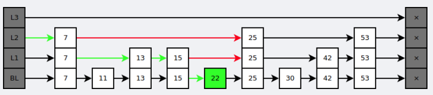
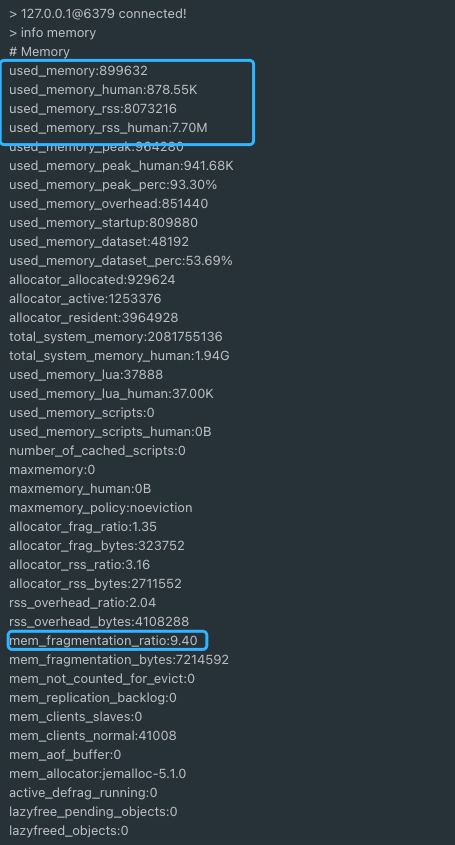

# Redis（远程字典服务器）

缓存

分布式锁

计算速度快

## 分布式锁

<span style='font-size: 24px'>单 Redis 节点</span>

1. SETNX（set if not exist），无过期时间

   ```
   setnx key value
   ```

2. 增加过期时间

   ```
   setnx key value expire key seconds
   ```

   > setnx 和 expire 操作之间不是原子的，设置过期时间可失败

3. 将命令编排一起，成为原子操作

   ```
   set key value nx ex seconds
   ```

4. 解锁

   ```
   del key
   ```

   ❌ 进程A 业务未执行完，锁已经到了过期时间被释放，那么进程B 进入锁业务逻辑执行，当进程完成业务，代码逻辑将促使它释放锁，但是它的锁已经被自动释放，那么它将释放B的锁

   

5. 让进程记住自己的锁，为 Key 赋予 ID。解锁时先获取 Key 的 ID 判断，再释放。

   > 获取、删除命令不是原子的，通过 Lua 脚本将两个命令编排在一起

   ```
   # 加锁 
   set key random-value nx ex seconds   
   
   # 解锁 
   if redis.call("get",KEYS[1]) == ARGV[1]
   then
       return redis.call("del",KEYS[1])
   else
       return 0
   end
   ```


在多节点存在潜在问题是 A 在主节点加了锁，主节点宕机后从节点晋升为主节点， B 在新的主节点加了锁，而宕机的节点恢复后成为了从节点，那么此刻资源将会有两把锁。


<span style='font-size: 24px'>多 Redis 节</span>

- 节点相互独立，不存在主从复制或者集群协调机制
- 加锁以大多数机制
- 解锁向所有发送 DEL 命令

> Redisson 框架


## 缓存

<span style='font-size: 24px'>缓存问题</span>

1. <span style='font-size: 22px'>穿透</span>

   大量请求的 key 不存在于缓存，所有请求都将访问数据库

   ✅ 布隆过滤器

   ✅ 无效的 Key 存进缓存

   

2. <span style='font-size: 22px'>雪崩</span>

   大量 key 同时过期（或是 redis 节点宕机）

   ✅ 过期时间附加随机数

   ✅ 熔断降级

   ✅ 集群

   

3. <span style='font-size: 22px'>击穿</span>

   热点 Key 突然失效，大量请求访问数据库

   ✅ 热点 key 永不过期

   ✅ 互斥锁 —— 热点 key 失效后只有拿到锁的线程可以访问数据库


<span style='font-size: 24px'>Redis 缓存读写策略</span>

数据在更新的情况下才有缓存的修改策略，而缓存更新消耗大，直接删除

<span style='font-size: 24px'>⁉️</span> 先更新数据库？还是先删除缓存？

由于是两步操作并非原子操作，需要对第二步操作加入失败重试机制，第一步操作是由用户发起的，不用引入

1. 先删除缓存

   

   先删除缓存会导致数据不一致

   

2. 先更新数据库

   

   数据一致，但是 B 拿到了旧数据

   但 2、3 之间的时间非常短，因为 Redis 高性能，所以影响小


<span style='font-size: 21px'>延时双删</span>

1. 删除缓存
2. 更新数据库
3. sleep N毫秒
4. 再次删除缓存

阻塞一段时间之后，再次删除缓存，就可以把这个过程中缓存中不一致的数据删除掉

> 读写分离下也适用
>


# 数据类型

## String

数字型字符串支持运算

```bash
--------------`创建`-----------
set k v
setnx k v 			# 如果不存在则创建
setex k v 			# 设定过期时间
append k "1" 		# 为 key 为 k 的值追加，即 v1; 不存在则相当于 set
mset k1 v1 k2 v2 	# 批量

--------------`删除`-----------
del k

--------------`修改`-----------
setrange k 0 "xx"  	# 替换字符串 (从0开始)
incr [number]  		# 加 1
decr [number] 		# 减 1
incrby number 10  	# 自定义增加幅度

--------------`查询`-----------
get k
mget k1 k2 			# 批量获取
getrange k 0 -1 	# 截取字符串 起点 终点【-1全部】
exists k			# 检测是否存在
strlen k			# 查询长度
```

## List

 双向链表

~~~bash
--------------`右`-----------
rpush List v1 [v2] [v3] 	# 添加
rpop List 					# 取出

--------------`左`-----------
lpush List v1 [v2] [v3]
lpop List
lrange List 0 1				# 范围查看元素 [开始] [结束(-1全部）]
llen List					# 链表长度
~~~

## Hash

值也是键值对

1. **常用命令：** `hset,hmset,hexists,hget,hgetall,hkeys,hvals` 
2. **应用场景:** 系统中对象数据的存储

常用操作：

1. `hmset userKey name "guide" description "dev" age "24"`
2. `hexists userKey name` —— 查看 userkey中是否存在name字段
3. `hget userKey name `：获取userKey指定字段name的value
4. `hgetall userKey`：得到 userkey 的全部字段和值
5. `hkeys userKey`：得到key 列表
6. `hvals userKey`：得到value 列表
7. `hset userInfoKey name "GuideGeGe"` ：修改字段对应的值（存在），增加对象（不存在）


## Set

**常用命令：** `sadd,spop,smembers,sismember,scard,sinterstore,sunion` 等

1. `sadd mySet value1 value2  `：sadd添加一个或多个元素
2. `smembers mySet  `：查看 set 中所有的元素
3. `scard mySet`：set中元素数量
4. `sismember mySet value1`：检查某个元素是否存在set 中，只能接收单个元素
5. `sinterstore Set3 Set1 Set2`：求set1和set2的交集 放在set3中


## 有序集合

和 set 相比，多了一个权重参数 score，元素按 score 进行**有序排列**，还可以通过 score 的范围来获取元素的列表

**应用场景：** 需要对数据**根据某个权重进行排序**的场景。如：直播间在线用户列表，各种礼物排行榜，弹幕消息

**常用命令：**

1. `zadd myZset 3.0 v1 2.0 v2 1.0 v3`：添加元素， 3.0 为权重
2. `zscore myZset v1`：查看某个 value 的权重
3. `zcard myZset`：元素数量
4. `zrange  myZset 0 -1`：顺序输出某个范围区间的元素，0 -1 表示输出所有元素
5. `zrevrange myZset 0 1`：逆序输出某个范围区间的元素，0 为 start  1 为 stop
6. `ZREVRANK myZset "v1"`：查看排名


## 其他

### bitmap

1. **介绍：** 连续的二进制数字，通过 bitmap, 只需要一个 bit 位来表示某个元素对应的值或者状态，key 就是对应元素本身 。
2. **常用命令：** `setbit` 、`getbit` 、`bitcount`、`bitop`
3. **应用场景：** 适合需要保存状态信息（比如是否签到、是否登录...）并需要进一步对这些信息进行分析的场景。比如用户签到情况、活跃用户情况、用户行为统计（比如是否点赞过某个视频）

```bash
# SETBIT 会返回之前位的值（默认是 0）这里会生成 7 个位
127.0.0.1:6379> setbit mykey 7 1
(integer) 0
127.0.0.1:6379> setbit mykey 7 0
(integer) 1
127.0.0.1:6379> getbit mykey 7
(integer) 0
127.0.0.1:6379> setbit mykey 6 1
(integer) 0
127.0.0.1:6379> setbit mykey 8 1
(integer) 0
# 通过 bitcount 统计被被设置为 1 的位的数量。
127.0.0.1:6379> bitcount mykey
(integer) 2
```


针对上面提到的一些场景，这里进行进一步说明。

**使用场景一：用户行为分析** 很多网站为了分析你的喜好，需要研究你点赞过的内容。

```bash
# 记录你喜欢过 001 号小姐姐
127.0.0.1:6379> setbit beauty_girl_001 uid 1
```


**使用场景二：统计活跃用户**

使用时间作为 key，然后用户 ID 为 offset，如果当日活跃过就设置为 1

那么我该如何计算某几天/月/年的活跃用户呢(暂且约定，统计时间内只要有一天在线就称为活跃)，有请下一个 redis 的命令

```bash
# 对一个或多个保存二进制位的字符串 key 进行位元操作，并将结果保存到 destkey 上。
# BITOP 命令支持 AND 、 OR 、 NOT 、 XOR 这四种操作中的任意一种参数
BITOP operation destkey key [key ...]
```


初始化数据：

```bash
127.0.0.1:6379> setbit 20210308 1 1
(integer) 0
127.0.0.1:6379> setbit 20210308 2 1
(integer) 0
127.0.0.1:6379> setbit 20210309 1 1
(integer) 0
```


统计 20210308~20210309 总活跃用户数: 1

```bash
127.0.0.1:6379> bitop and desk1 20210308 20210309
(integer) 1
127.0.0.1:6379> bitcount desk1
(integer) 1
```


统计 20210308~20210309 在线活跃用户数: 2

```bash
127.0.0.1:6379> bitop or desk2 20210308 20210309
(integer) 1
127.0.0.1:6379> bitcount desk2
(integer) 2
```

**使用场景三：用户在线状态**

对于获取或者统计用户在线状态，使用 bitmap 是一个节约空间且效率又高的一种方法。

只需要一个 key，然后用户 ID 为 offset，如果在线就设置为 1，不在线就设置为 0


# 数据结构

## 字典

字典是一个散列表结构，使用拉链法解决哈希冲突。

字典中包含两个哈希表，为了方便 重哈希rehash 操作。

> 扩容时，将一个哈希表上的键值对重哈希到另一个哈希表上，完成之后释放空间并交换两个哈希表的角色。


rehash 采用渐进方式，避免一次性执行过多的 rehash 操作给服务器带来过大的负担。

在 rehash 期间，每次对字典执行添加、删除、查找或者更新操作时，都会执行一次渐进式 rehash。

采用渐进式 rehash 会导致字典中的数据分散在两个 dictht 上，因此对字典的查找操作也需要到对应的 dictht 去执行。


## 跳跃表

有序链表：


从该有序表中搜索元素 < 23, 43, 59 > ，需要比较的次数分别为 < 2, 4, 6 >

链表是有序的，但不能使用二分查找。

类似二叉搜索树，可以把一些节点提取出来作为索引。得到如下结构：


 把 < 14, 34, 50, 72 > 提取出来作为一级索引，减少比较次数。

 再从一级索引提取一些元素出来，作为二级索引，变成如下结构：


跳表性质：

(1) 由很多层结构组成

(2) 每一层都是一个有序的链表

(3) 最底层(Level 1)的链表包含所有元素

(4) 如果一个元素出现在 Level i 的链表中，则它在 Level i 之下的链表也都会出现。

(5) 每个节点包含两个指针，一个指向同一链表中的下一个元素，一个指向下面一层的元素。


在查找时，从上层指针开始查找，找到对应的区间之后再到下一层去查找。下图演示了查找 22 的过程。




与红黑树等平衡树，具有以下优点：

- 插入速度快，无需旋转维护平衡
- 易实现
- 支持无锁操作


# 单线程

网络 IO 和数据读写是由一个线程完成，持久化、异步删除和集群数据同步依赖其它线程。

单线程避免了线程切换、竞争所产生的性能消耗。


<span style='font-size: 22px'>事件模型</span>

基于 I/O 多路复用监听多个 Socket 事件，将到达的事件传送给文件事件分派器，分派器会根据 Socket 事件类型调用相应的事件处理器


<span style='font-size: 22px'>时间事件</span>

特定的时间点执行，分为：定时事件、周期性事件。时间事件存放于无序链表中，遍历链表查找出已到达的时间事件，调用相应事件处理器


<span style='font-size: 22px'>事件调度</span>

服务器一直监听者文件事件的套接字才能得到待处理的文件事件，但是不能一直监听，否则时间事件无法在规定的时间内执行，因此 **监听时间** 应该根据距离现在最近的时间事件来决定。


# 过期时间

设定过期时间的 Key 会在<span style='font-size: 18px'>过期字典</span>中存放 Key 和过期时间的值，值得注意的是当 Key 的过期时间到达，但是并没有马上被删除。

Redis 有两种针对过期 Key 的删除策略：

1. <span style='font-size: 22px'>惰性删除</span> —— 再次用到 key 时删除
2. <span style='font-size: 22px'>定期删除</span> —— 每 1 秒 N 检查次，抽样检测过期的 Key，当过期的 Key 的数量在此次抽样数据中达到一定的比例，重复步骤

> Redis 采用的是两种相结合的删除策略


<span style='font-size: 24px'>订单超时失效</span>

**1、** 使用rocketmq、rabbitmq、pulsar等消息队列的延时投递功能；
**2、** 使用redisson提供的DelayedQueue


# 数据淘汰

数据未过期，但是 Redis 存储的数据大小超过设定的内存阈值，将会使用设定的淘汰策略对数据进行删除


<span style='font-size: 22px'>淘汰策略</span>

- 不淘汰

- random - 随机

- ttl - 过期时间最小

- lru - 最近使用的数据会在未来一段时期内仍然被使用，已经很久没有使用的数据大概率在未来很长一段时间仍然不会被使用

  > 不总是准确，一个数据可能刚刚好最近被用了 1 次

- lfu - 最近访问频率少

  > 以 lru 为基础，为每个数据增加一个计数器统计访问次数。先使用访问次数淘汰，次数一致时，根据访问时间淘汰

random、lru、lfu 也可以对<span style='font-size: 20px'>没有设定过期时间</span>的 Key 进行淘汰


# 持久化

将内存中数据存储到硬盘

## RDB

Redis Database 快照形式，使用二进制文件（.rdb）存储了各个数据库的键值对数据等信息。


**优缺点**

 .rdb 二进制文件体积小，恢复数据速度块

缺点就是 BGSAVE 创建子进程代价大，并且不能实时同步操作到 .rdb 导致故障后损失数据量较大。


## AOF

Append Only File 保证数据持久化的实时性，文件（.aof）实时记录了操作的命令，重启时再重新执行AOF文件中的命令来恢复数据。

### 启用

```
appendonly yes         # 启用AOF
appendfilename "appendonly.aof"  # 设置文件名
```

AOF以文本协议格式写入命令，如：

```
*3\r\n$3\r\nset\r\n$5\r\nhello\r\n$5\r\nworld\r\n
```


文本协议格式具有如下的优点：

1. 文本协议具有很好的兼容性；
2. 直接采用文本协议格式，避免二次处理的开销；
3. 文本协议具有可读性，方便直接修改和处理。


### 同步

AOF 解决了实时性的问题，说明它频繁与硬盘交互。而现代操作系统为了提高程序的写入性能，会把针对硬盘的多次写操作优化为一次写操作，也就是

1. 当程序对硬盘文件写入时，系统不会直接把数据写入硬盘，而是先将数据写入内存的缓冲区中
2. 当达到特定的时间周期或缓冲区写满时，系统才会执行flush操作，将缓冲区中的数据冲洗至硬盘中

对于AOF这样的持久化功能来说，冲洗机制将直接影响AOF持久化的实时性的安全，为了消除上述机制的不确定性，Redis向用户提供了 `appendfsync` 选项，来控制系统冲洗AOF的频率；

| 选项     | 同步频率                             |
| -------- | ------------------------------------ |
| always   | 每个命令都同步，严重减低服务器的性能 |
| everysec | 每秒，做多丢失1秒之内的命令          |
| no       | 让操作系统来决定何时同步             |

随着服务器写请求的增多，AOF 文件会越来越大。

Redis 提供了一种将 **`AOF重写`**的特性，能够去除 AOF 文件中的冗余写命令。


### 优缺点

优点是 everysec 选项，损失数据量小

缺点是 .aof 文件体积大，恢复速度慢。


## RDB-AOF 混合持久化

4.0 开始引入 RDB-AOF 混合持久化模式

```
//配置启动
aof-use-rdb-preamble yes
```

工作流程：

- 像执行 BGSAVE命令创建子进程，生成RDB数据，写入AOF文件中
- 后续命令，则以协议文本的方式追加到AOF文件的末尾，即RDB数据之后。


### 优点

通过AOF文件包含的RDB数据来实现快速的数据恢复操作

又可以通过AOF文件包含的AOF数据来将丢失数据的时间窗口限制在1s之内。


# 事务

乐观锁，监控资源时其他的线程可以对资源进行修改，发生修改则拒绝提交事务

watch —— 监控

multi —— 开启事务

exec —— 执行事务

discard —— 放弃事务

```bash
> WATCH USER
OK
> MULTI
> SET USER "哥"
OK
> GET USER
哥
> EXEC
ERR EXEC without MULTI
```


# 高可用

实现Redis的高可用，主要有哨兵和集群两种方式。

## 哨兵

Sentinel 监听集群中的服务器，并在主服务器进入下线状态时，自动从从服务器中选举出新的主服务器。

## 集群

Redis 集群采用虚拟槽分区来实现数据分片，把键根据哈希函数映射到 0-16383槽（2^14^）内。

计算公式为 `slot= CRC16(key) & 16383`，每一个节点负责维护一部分槽以及槽所映射的键值数据。

虚拟槽分区具有如下特点：

1. 解耦数据和节点之间的关系，简化了节点扩容和收缩的难度；
2. 节点自身维护槽的映射关系，不需要客户端或者代理服务维护槽分区元数据；
3. 支持节点、槽、键之间的映射查询，用于数据路由，在线伸缩等场景。


### 功能限制

1. 批量操作。只支持具有相同slot值的key执行批量操作。
2. 事务操作。只支持多key在同一节点上的事务操作。
3. 不能将如 hash、list 映射到不同的节点。
4. 单机下的Redis可以支持16个数据库，集群模式下只能使用一个数据库空间
5. 复制结构只支持一层，从节点只能复制主节点，不支持嵌套树状复制结构。


### 集群通信

在分布式存储中需要提供维护节点元数据信息的机制，元数据是指：节点负责哪些数据，是否出现故障等状态信息。

常见的元数据维护方式分为：集中式和P2P方式。


客户-服务器（C/S）：客户是服务的请求方，服务器是服务的提供方。


对等（P2P）：不区分客户和服务器。


#### P2P —— Gossip

Redis 集群采用 P2P 的 Gossip（流言）协议，Gossip协议的工作原理就是节点彼此不断通信交换信息，一段时间后所有的节点都会知道集群完整的信息，类似流言传播。

通信的大致过程如下：

1. 集群中每个节点都会单独开辟一个TCP通道，用于节点之间彼此通信，通信端口号在基础端口号上加10000；
2. 每个节点在固定周期内通过特定规则选择几个节点发送ping消息；
3. 接收ping消息的节点用pong消息作为响应。

其中，Gossip协议的主要职责就是信息交换，而信息交换的载体就是节点彼此发送的Gossip消息，Gossip消息分为：meet消息、ping消息、pong消息、fail消息等。

- meet消息：用于通知新节点加入，消息发送者通知接受者加入到当前集群。meet消息通信正常完成后，接收节点会加入到集群中并进行周期性的ping、pong消息交换。
- ping消息：集群内交换最频繁的消息，集群内每个节点每秒向多个其他节点发送ping消息，用于检测节点是否在线和交换彼此状态信息。ping消息封装了自身节点和一部分其他节点的状态数据。
- pong消息：当接收到meet、ping消息时，作为响应消息回复给发送方确认消息正常通信。pong消息内封装了自身状态数据，节点也可以向集群内广播自身的pong消息来通知整个集群对自身状态进行更新。
- fail消息：当节点判定集群内另一个节点下线时，会向集群内广播一个fail消息，其他节点接收到fail消息之后把对应节点更新为下线状态。

虽然Gossip协议的信息交换机制具有天然的分布式特性，但它是有成本的。因为Redis集群内部需要频繁地进行节点信息交换，而ping/pong消息会携带当前节点和部分其他节点的状态数据，势必会加重带宽和计算的负担。所以，Redis集群的Gossip协议需要兼顾信息交换的实时性和成本的开销。

- 集群里的每个节点默认每隔一秒钟就会从已知节点列表中随机选出五个节点，然后对这五个节点中最长时间没有发送过PING消息的节点发送PING消息，以此来检测被选中的节点是否在线。
- 如果节点A最后一次收到节点B发送的PONG消息的时间，距离当前时间已经超过了节点A的超时选项设置时长的一半（cluster-node-timeout/2），那么节点A也会向节点B发送PING消息，这可以防止节点A对节点B的信息更新滞后。
- 每个消息主要的数据占用：slots槽数组（2KB）和整个集群1/10的状态数据（10个节点状态数据约1KB）。


# 复制

让一个服务器成为另一个服务器的从服务器。

```
slaveof host port
```

## 连接过程

Redis 使用 `psync命令` 完成主从数据同步。

同步过程分为：

1. 全量复制，用于初次复制
2. 部分复制，用于处理因网络中断等原因造成数据丢失的场景


### 主从链

随着负载不断上升，主服务器可能无法很快地更新所有从服务器，或者重新连接和重新同步从服务器将导致系统超载。为了解决这个问题，可以创建一个中间层来分担主服务器的复制工作。


# 内存碎片

产生原因：

- redis向操作系统申请的内存空间大于数据实际需要存储的内存空间
- 频繁修改redis中的数据也会产生内存碎片，redis删除数据时，不会轻易释放内存返回给操作系统

**查看**

~~~bash
info memory
~~~

参数含义https://redis.io/commands/INFO 



`mem_fragmentation_ratio` （内存碎片率）= `used_memory_rss` (操作系统实际分配给 Redis 的物理内存空间大小) / `used_memory`(Redis 内存分配器为了存储数据实际申请使用的内存空间大小)

`used_memory_rss - used_memory`不是内存碎片的大小！！！这不仅包括内存碎片，还包括其他进程开销，以及共享库、堆栈等的开销


当 `mem_fragmentation_ratio > 1.5` 需要清理内存碎片

查看内存碎片率

```bash
redis-cli -p 6379 info | grep mem_fragmentation_ratio
```


### 清理

Redis4.0-RC3 版本以后自带了内存整理

```bash
config set activedefrag yes
```

具体清理通过两个参数控制

```bash
# 内存碎片占用空间达到 500mb 的时候开始清理
config set active-defrag-ignore-bytes 500mb
# 内存碎片率大于 1.5 的时候开始清理
config set active-defrag-threshold-lower 50
```

通过 Redis 自动内存碎片清理机制可能会对 Redis 的性能产生影响，我们可以通过下面两个参数来减少对 Redis 性能的影响：

```bash
# 内存碎片清理所占用 CPU 时间的比例不低于 20%
config set active-defrag-cycle-min 20
# 内存碎片清理所占用 CPU 时间的比例不高于 50%
config set active-defrag-cycle-max 50
```

另外，重启节点可以做到内存碎片重新整理。如果你采用的是高可用架构的 Redis 集群的话，你可以将碎片率过高的主节点转换为从节点，以便进行安全重启


# linux部署


# Docker部署

一、查询容器名字

```
[root@iZwz9dz9p8ei9kk47dbxxxZ /]# docker ps -a
CONTAINER ID   IMAGE             COMMAND                  CREATED         STATUS         PORTS                                                                     NAMES
91d5c14b4078   redis             "docker-entrypoint.s…"   7 minutes ago   Up 7 minutes   0.0.0.0:6379->6379/tcp, :::6379->6379/tcp                                 distracted_swirles
d6b576cb5b3b   zookeeper:3.5.8   "/docker-entrypoint.…"   3 weeks ago     Up 3 weeks     2888/tcp, 3888/tcp, 0.0.0.0:2181->2181/tcp, :::2181->2181/tcp, 8080/tcp   zookeeper

```

二、进入容器打开Redis测试连通性

```
[root@bogon ~]# docker exec -it myredis /bin/sh
/data # redis-cli -p 6379
127.0.0.1:6379> ping
PONG
127.0.0.1:6379> 
```

三、创建key:value测试

```
127.0.0.1:6379> set ke1 hello
OK
127.0.0.1:6379> get ke1
"hello"
127.0.0.1:6379> 
```

四、退出

```
127.0.0.1:6379> shutdown
```


为现有的redis创建密码或修改密码的方法：

1.查看redis容器id     docker ps -a       

2. 进入redis的容器   docker exec -it 容器ID bash       

3.运行命令：redis-cli

4.查看现有的redis密码：config get requirepass

5.设置redis密码 config set requirepass （为你要设置的密码）

6.若出现(error) NOAUTH Authentication required.错误，则使用 auth 密码 来认证密码


# Springboot 集成

### 依赖

```xml
<!-- redis依赖信息 -->
<dependency>
    <groupId>org.springframework.boot</groupId>
    <artifactId>spring-boot-starter-data-redis</artifactId>
</dependency>

<!--redis客户端 Jedis来操作Redis，只需要将lettuce的依赖替换为Jedis即可。 -->
<dependency>            
    <groupId>redis.clients</groupId>            
    <artifactId>jedis</artifactId>        
</dependency>
```

### 配置

Spring Boot在`org.springframework.boot.autoconfigure.data.redis`包中为redis提供了自动配置。其中定义有：

`RedisAutoConfiguration`

`RedisProperties`

`RedisConnectionConfiguration`

- `JedisConnectionConfiguration`，Jedis连接配置类
- `LettuceConnectionConfiguration`，Lettuce连接配置类


#### `RedisProperties`

定义Redis相关属性后，就会在项目启动时会注入到Redis中去。Redis可以自定义的配置项内容有：

```yml
spring:
  redis:
    host: 120.78.172.214 # 数据库索引（默认为0）
    port: 6379 # 服务器地址
    database: 0 # 端口
    password: redis # 密码（默认为空，为空时不设置该属性）
    timeout: 300000 # 超时时间（毫秒）
    client-type: lettuce # 建议使用lettuce 可以换成jedis，spring默认集成lettuce
    lettuce: # 如果使用jedis客户端，则下面定义的内容需要将lettuce换成jedis
      pool:
        max-active: 10 # 连接池最大连接数（使用负值表示没有限制）
        max-wait: -2 # 最大阻塞等待时间（使用负值表示没有限制）
        max-idle: 10 # 最大空闲连接数
        min-idle: 0 # 最小空闲连接
```


16个数据库：`select num 0-15`选择数据库

清除当前数据库 `flushdb`

清除所有数据库 `FLUSHALL`

