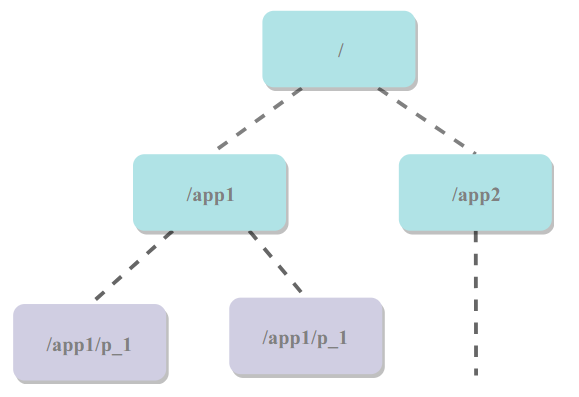
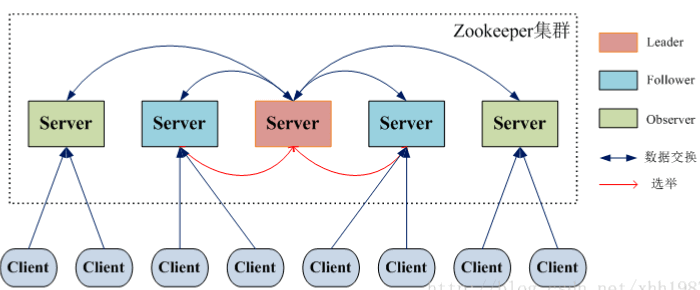

分布式协调服务框架，为分布式系统提供一致性服务。

一致性是通过基于 `Paxos` 算法的 `ZAB` 协议完成的


# 数据模型结构

树，每个节点可以存储数据



节点类型

1. 永久节点
2. 临时节点（只能是叶子节点）
3. 有序节点

```bash
create /node1 1  	# 创建节点及数据
get /node1 			# 获取数据
stat /node1			# 查看节点信息
cZxid = 0x2 							-- 创建时事务id
ctime = Tue Sep 06 18:49:19 UTC 2022  	-- 创建时间
mZxid = 0x2 							-- 上次被修改事务id
mtime = Tue Sep 06 18:49:19 UTC 2022 	-- 上次被修改时间
pZxid = 0x2 							-- 节点的子节点列表上次被修改时的事务id
cversion = 0							-- 子节点版本
dataVersion = 0							-- 节点版本号
aclVersion = 0							-- 节点acl版本号
ephemeralOwner = 0x0					-- 创建时会话id，临时节点专属。持久节点为0
dataLength = 1							-- 数据长度
numChildren = 0							-- 子节点数目，持久节点专属。临时节点无子节点，为0

```

##  ACL（权限控制）

节点的操作权限

- **CREATE** : 能创建子节点
- **READ** ：能获取节点数据和列出其子节点
- **WRITE** : 能设置/更新节点数据
- **DELETE** : 能删除子节点
- **ADMIN** : 能设置节点 ACL 的权限

其中尤其需要注意的是，**CREATE** 和 **DELETE** 这两种权限都是针对 **子节点** 的权限控制。

对于身份认证，提供了以下几种方式：

- **world** ： 默认方式，所有用户都可无条件访问
- **auth** :不使用任何 id，代表任何已认证的用户
- **digest** :用户名:密码认证方式： *username:password* 
- **ip** : 对指定 ip 进行限制


# 监听器（Watcher）

在指定节点上注册一些 Watcher，并且在一些特定事件触发的时候，ZooKeeper 服务端会将事件通知到感兴趣的客户端上去，该机制是 ZooKeeper 实现分布式协调服务的重要特性


# 会话

ZooKeeper 与客户端的之间的一个 TCP 长连接，通过这个连接，客户端能够通过心跳检测与ZooKeeper 保持有效的会话，也能够向 ZooKeeper 服务器发送请求并接受响应，同时还能够通过该连接接收来自ZooKeeper 的 Watcher 事件通知


# 集群


组成 ZooKeeper 服务的服务器都会在内存中维护当前的服务器状态，并且每台服务器之间都互相保持着通信。

集群间通过 ZAB（ZooKeeper Atomic Broadcast）来保持数据的一致性。


## 传统的集群

 Master/Slave 模式（读写分离）

-  Master 提供写服务
- Slave 通过异步复制的方式获取 Master 服务器最新的数据提供读服务


## ZK 集群角色

 ZooKeeper 中没有选择传统的 Master/Slave 概念，而是引入了 Leader、Follower 和 Observer 三种角色



| 角色     | 说明                                                         |
| -------- | ------------------------------------------------------------ |
| Leader   | 读 / 写的服务，负责投票的发起和决议，更新系统状态。          |
| Follower | 提供读服务，如果是写服务则转发给 Leader。选举投票。          |
| Observer | 读服务，如果是写服务则转发给 Leader。不投票，也不参与“过半写成功”策略。在不影响写性能的情况下提升集群的读性能。 |

 Leader 选举：

1. **Leader election（选举阶段）**：节点得到超半数节点的票数，它就可以当选`准leader`
2. **Discovery（发现阶段）** ：followers 跟`准leader` 进行通信，同步 followers 最近接收的事务提议。
3. **Synchronization（同步阶段）** : 将`准leader`上一阶段获取的最新事务提议 ，同步集群中所有的副本。同步成功成为 `leader`。
4. **Broadcast（广播阶段）**: 集群才能正式对外提供事务服务，并且 leader 可以进行**消息广播**。

> 新的服务器启动后加入到集群中时，会自觉地进入数据恢复模式，找到 Leader 与其进行数据同步，参与到消息广播流程中去


## 服务器状态

- **LOOKING** ：寻找 Leader。
- **LEADING** ：Leader 状态
- **FOLLOWING** ：Follower 状态
- **OBSERVING** ：Observer 状态


## 服务器数量

### 过半机制

ZooKeeper 集群在宕掉几个 ZooKeeper 服务器之后，如果剩下的 ZooKeeper 服务器个数 **大于 **宕掉的个数的话整个 ZooKeeper 才依然可用。


### 奇数

2n 和 2n-1 的容忍度是一样的，都是 n-1。

- 3 台，那么最大允许宕掉 1 台 ZooKeeper 服务器
- 4 台的的时候也同样只允许宕掉 1 台。 
- 5 台，那么最大允许宕掉 2 台 ZooKeeper 服务器
- 6 台的的时候也同样只允许宕掉 2 台。

综上，不必增加不必要的 ZooKeeper 呢


## 过半机制防止脑裂

对于一个集群，通常多台机器会部署在不同机房，来提高这个集群的可用性。

保证可用性的同时，会发生一种机房间网络线路故障，导致机房间网络不通，而集群被割裂成几个小集群。这时候子集群各自选主导致“脑裂”的情况。


ZooKeeper 的过半机制导致不可能产生 2 个 leader，因为少于等于一半是不可能产生 leader 的，这就使得不论机房的机器如何分配都不可能发生脑裂


# 使用场景

## 选主

Zookeeper 在高并发的情况下可以保证节点创建的全局唯一性 ，让多个客户端创建一个`相同的临时节点` ，创建成功的就是 master，未创建成功的使用 watcher 监听此节点


## 分布式锁

### 互斥锁

与选主同理

### 读写锁

读写锁需要创建`临时有序节点`。

读锁：获取读锁时，没有比自己小的临时有序节点，或者比自己小的都是读请求，可以获取。

写锁：没有比自己小的临时有序节点，即可获取到锁。


未获取到锁，watcher 监听等待前面节点完成业务释放即可，但是当一个锁释放它会通知所有等待的客户端从而造成 **羊群效应** 。可以让等待的节点只监听他们前面的节点。

具体怎么做呢？让 **读请求监听比自己小的最后一个写请求节点，写请求只监听比自己小的最后一个节点** 


## ID


## 集群管理

`zookeeper` 天然支持的 `watcher` 和 临时节点能很好的实现这些需求。我们可以为每条机器创建临时节点，并监控其父节点，如果子节点列表有变动（我们可能创建删除了临时节点），那么我们可以使用在其父节点绑定的 `watcher` 进行状态监控和回调。

## 注册中心

 **Service Provider** 在 `zookeeper` 中创建一个临时节点并且将自己的 `ip、port、调用方式` 写入节点，当 **Service Consumer** 需要进行调用的时候会 通过注册中心找到相应的服务的地址列表(IP端口) ，并缓存到本地(方便以后调用)，当消费者调用服务时，不会再去请求注册中心，而是直接通过负载均衡算法从地址列表中取一个服务提供者的服务器调用服务。

当服务提供者的某台服务器宕机或下线时，相应的地址会从服务提供者地址列表中移除。同时，注册中心会将新的服务地址列表发送给服务消费者的机器并缓存在消费者本机（当然你可以让消费者进行节点监听，我记得 `Eureka` 会先试错，然后再更新）。


实际上，这些功能的实现基本都得益于 ZooKeeper 可以保存数据的功能，但是 ZooKeeper 不适合保存大量数据，这一点需要注意


# 总结

1. ZooKeeper 本身就是一个分布式程序（只要半数以上节点存活，ZooKeeper 就能正常服务）。
2. 为了保证高可用，最好是以集群形态来部署 ZooKeeper，这样只要集群中大部分机器是可用的（能够容忍一定的机器故障），那么 ZooKeeper 本身仍然是可用的。
3. ZooKeeper 将数据保存在内存中，这也就保证了 高吞吐量和低延迟（内存限制：容量不太大）。
4. ZooKeeper 是高性能的。 在“读”多于“写”的应用程序中尤其地明显，因为“写”会导致所有的服务器间同步状态。（“读”多于“写”是协调服务的典型场景。）
5. ZooKeeper 有临时节点的概念。 当创建临时节点的客户端会话一直保持活动，瞬时节点就一直存在。而当会话终结时，瞬时节点被删除。
6. ZooKeeper 底层其实只提供了两个功能：① 存储 / 读取用户程序提交的数据；② 提供数据节点监听服务


# Docker 使用

docker pull zookeeper

docker run -d -p 2181:2181 --name some-zookeeper --restart always 镜像id

docker exec -it 容器id bash

./bin/zkCli.sh


## 节点命令

##### 1）创建 `create`

- **`create /node1 "node1"`**：根目录下创建节点node1 关联字符串node1
- **`cerate /node1/node1.1 123`**：在node1节点下创建node1.1节点 关联数字123

##### 2）更新 `set`

- **`set /node1 "changed"`**

##### 3）查看 

- **`get /node1`** ：节点内容
- **`stat /node1`**：节点状态

##### 4）查看子节点 `ls`

- **`ls /node1`**：node1下的节点
- **`ls2 /node1`**：节点信息和子节点

##### 5）删除 `delete`

- **`delete /node1/node1.1`**：无子节点才可删除

