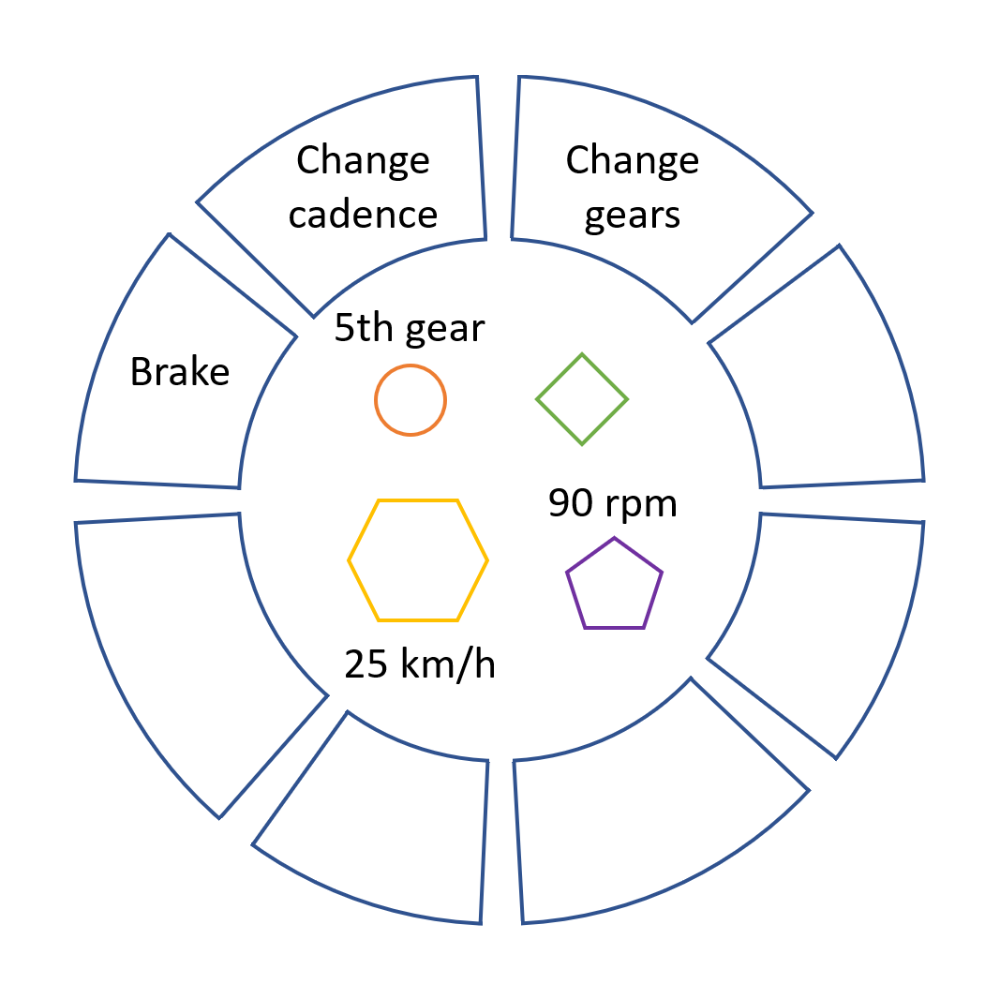

# 命名之道

[https://unbug.github.io/codelf/open in new window](https://unbug.github.io/codelf/)

## 驼峰命名法（CamelCase）

<h5>大驼峰命名（UpperCamelCase）</h5>

- 类名

<h5>小驼峰命名（LowerCamelCase）</h5>

- 方法名
- 参数名
- 成员变量
- 局部变量

##  蛇形命名法（snake_case）

各个单词之间通过下划线 “_” 连接

- 测试方法名
- 常量
- 枚举名

## 串式命名法（kebab-case）

各个单词之间通过连接符 “-” 连接

- 项目文件夹名称

# 面向对象

软件系统的业务是现实生活中的业务在计算机中的映射，现实生活中的业务就是一个个对象协作的过程。

面向对象编程就是按现实业务一样的方式将程序代码按一个个对象进行组织和编写，让计算机系统能够识别和理解用对象方式组织和编写的程序代码，这样就可以把现实生活中的业务对象映射到计算机系统中

<h2>对象</h2>

对象是相关状态和行为的集合。

狗有状态（名字、颜色、品种、饥饿）和行为（吠叫、抓取、摇尾巴）、自行车也有状态（当前档位、当前踏板节奏、当前速度）和行为（换档、改变踏板节奏、踩刹车）

一个软件对象软件对象由状态和相关行为组成。对象将其状态存储在*字段*（某些编程语言中的变量）中，并通过*方法*（某些编程语言中的函数）公开其行为。方法对对象的内部状态进行操作，并充当对象到对象通信的主要机制。隐藏内部状态并要求通过对象的方法执行所有交互被称为*数据封装*——面向对象编程的基本原则。

以自行车为例：

通过归因状态（当前速度、当前踏板节奏和当前档位）并提供更改该状态的方法，该对象仍然可以控制外界如何使用它。例如，如果自行车只有 6 个档位，则换档方法可能会拒绝任何小于 1 或大于 6 的值。

将代码捆绑到单独的软件对象中具有许多好处，包括：

1. 模块化：一个对象的源代码可以独立于其他对象的源代码进行编写和维护。一旦创建，对象就可以轻松地在系统内传递。
2. 信息隐藏：通过仅与对象的方法交互，其内部实现的细节对外界保持隐藏。
3. 代码重用：如果一个对象已经存在（可能是由另一个软件开发人员编写的），您可以在程序中使用该对象。这允许专家实现/测试/调试复杂的、特定于任务的对象，然后您可以信任这些对象在您自己的代码中运行。
4. 可插拔性和调试简便性：如果某个特定对象出现问题，您可以简单地将其从应用程序中删除，然后插入另一个对象作为替换。这类似于解决现实世界中的机械问题。如果螺栓断裂，您需要更换它，而不是整个机器。

## 类

应用程序中，可能存在数千辆其他自行车，它们的品牌和型号都相同。每辆自行车都是根据同一套蓝图制造的，因此包含相同的组件。用面向对象的术语来说，我们说你的自行车是自行车*类对象的一个实例。*类是创建各个对象的蓝图。

## 封装

方法对对象的内部状态进行操作，并充当对象到对象通信的主要机制。隐藏内部状态并要求通过对象的方法执行所有交互被称为*数据封装*。

## 抽象

抽象就是找出一些事物的相似和共性之处，然后将这些事物归为一个类，这个类只考虑这些事物的相似和共性之处，并且会忽略与当前主题和目标无关的那些方面，将注意力集中在与当前目标有关的方面。

> 看到一只蚂蚁和大象，想象出它们的相同之处。
>
> 比如，属性有年龄、四条腿等等，行为有行走、吃饭，然后取和当前系统有关的属性。

## 继承

不同种类的物体通常彼此之间有一定数量的共同点。例如，山地自行车、公路自行车和双人自行车都具有自行车的特征（当前速度、当前踏板节奏、当前档位）。然而，每种自行车还定义了使其与众不同的附加功能：双人自行车有两个座位和两组车把；公路自行车有下降车把；一些山地自行车有一个额外的链环，使它们具有较低的传动比。

面向对象编程允许类从其他类继承常用的状态和行为。

## 多态

是指程序中定义的引用变量所指向的具体类型和通过该引用变量发出的方法调用在编程时并不确定，而是在程序运行期间才确定。

因为在程序运行时才确定具体的类，这样，不用修改源程序代码，就可以让引用变量绑定到各种不同的类实现上，从而导致该引用调用的具体方法随之改变，即不修改程序代码就可以改变程序运行时所绑定的具体代码，让程序可以选择多个运行状态，这就是多态性。

## 接口

对象通过它们公开的方法定义它们与外部世界的交互。方法形成对象与外界的接口；例如，电视机正面的按钮是您与其塑料外壳另一侧的电线之间的接口。您按下“电源”按钮即可打开和关闭电视。

## 类图

| Type   | Description                 | 说明                                                   |
| :----- | :-------------------------- | ------------------------------------------------------ |
| `<|--` | Inheritance（继承）         |                                                        |
| `..|>` | Realization（实现）         |                                                        |
| `*--`  | Composition（组合）         | 组合中整体和部分是强依赖的，整体不存在了部分也不存在了 |
| `o--`  | Aggregation（聚合）         | 整体和部分不是强依赖的，整体不存在了部分还是会存在     |
| `-->`  | Association（联系）         |                                                        |
| `..>`  | Dependency（依赖）          |                                                        |
| `--`   | Link (Solid) —— 链接（硬）  |                                                        |
| `..`   | Link (Dashed) —— 链接（虚） |                                                        |

~~~mermaid
classDiagram
classA <|-- classB: 继承
class interfaceM
<<interface>> interfaceM
interfaceM <|.. classN: 实现
classC *-- classD: 组合
classE o-- classF: 聚合
classG <-- classH: 联系
classK <.. classL: 依赖
classI -- classJ: 硬链接
classO .. classP: 软连接
~~~

### 关联关系 (Association)

表示不同类对象之间有关联，这是一种静态关系，与运行过程的状态无关，在最开始就可以确定。因此也可以用 1 对 1、多对 1、多对多这种关联关系来表示。比如学生和学校就是一种关联关系，一个学校可以有很多学生，但是一个学生只属于一个学校，因此这是一种多对一的关系，在运行开始之前就可以确定。

### 依赖关系 (Dependency)

和关联关系不同的是，依赖关系是在运行过程中起作用的。A 类和 B 类是依赖关系主要有三种形式：

- A 类是 B 类方法的局部变量；
- A 类是 B 类方法的参数；
- A 类向 B 类发送消息，从而影响 B 类发生变化。

## 设计原则

### S.O.L.I.D

| 简写 | 全拼                                | 中文翻译     |
| ---- | ----------------------------------- | ------------ |
| SRP  | The Single Responsibility Principle | 单一责任原则 |
| OCP  | The Open Closed Principle           | 开放封闭原则 |
| LSP  | The Liskov Substitution Principle   | 里氏替换原则 |
| ISP  | The Interface Segregation Principle | 接口分离原则 |
| DIP  | The Dependency Inversion Principle  | 依赖倒置原则 |

### 1. 单一责任原则

> 一个类只负责一类事情 —— ==高内聚，低耦合==

换句话说就是让一个类只负责一件事，当这个类需要做过多事情的时候，就需要分解这个类。

如果一个类承担的职责过多，就等于把这些职责耦合在了一起，一个职责的变化可能会削弱这个类完成其它职责的能力。

### 2. 开放封闭原则

> 类应该对扩展开放，对修改关闭。

扩展就是添加新功能的意思，因此该原则要求在添加新功能时不需要修改代码。

符合开闭原则最典型的设计模式是==装饰者模式==，它可以动态地将责任附加到对象上，而不用去修改类的代码。

### 3. 里氏替换原则

> 子类对象必须能够替换掉所有父类对象 —— java中父类引用指向子类对象

在面向对象的语言中，继承是必不可少的、优秀的语言机制，它主要有以下几个优点：

- 代码共享，减少创建类的工作量，每个子类都拥有父类的方法和属性；
- 提高代码的可重用性；
- 提高代码的可扩展性；
- 提高产品或项目的开放性。

相应的，继承也存在缺点，主要体现在以下几个方面：

- 继承是入侵式的。只要继承，就必须拥有父类的所有属性和方法；
- 降低代码的灵活性。子类必须拥有父类的属性和方法，使子类受到限制；
- 增强了耦合性。当父类的常量、变量和方法修改时，必须考虑子类的修改，这种修改可能造成大片的代码需要重构。

里氏替换表明继承是一种 IS-A 关系，子类需要能够当成父类来使用。

如果不满足这个原则，那么各个子类的行为上就会有很大差异，增加继承体系的复杂度。

### 4. 接口分离原则

> 不应该强迫客户依赖于它们不用的方法。

因此使用多个专门的接口比使用单一的总接口要好。

### 5. 依赖倒置原则

> 高层模块不应该依赖于低层模块，二者都应该依赖于抽象
>
> 抽象不应该依赖于细节
>
> 细节应该依赖于抽象

高层模块包含一个应用程序中重要的策略选择和业务模块，如果高层模块依赖于低层模块，那么低层模块的改动就会直接影响到高层模块，从而迫使高层模块也需要改动。

依赖于抽象意味着：

- 任何变量都不应该持有一个指向具体类的指针或者引用；
- 任何类都不应该从具体类派生；
- 任何方法都不应该覆写它的任何基类中的已经实现的方法。

### 其他常见原则

除了上述的经典原则，在实际开发中还有下面这些常见的设计原则。

| 简写 | 全拼                              | 中文翻译     |
| ---- | --------------------------------- | ------------ |
| LOD  | The Law of Demeter                | 迪米特法则   |
| CRP  | The Composite Reuse Principle     | 合成复用原则 |
| CCP  | The Common Closure Principle      | 共同封闭原则 |
| SAP  | The Stable Abstractions Principle | 稳定抽象原则 |
| SDP  | The Stable Dependencies Principle | 稳定依赖原则 |

#### 1. 迪米特法则

迪米特法则又叫作最少知识原则（Least Knowledge Principle，简写 LKP），就是说一个对象应当对其他对象有尽可能少的了解，不和陌生人说话。

#### 2. 合成复用原则

尽量使用对象组合，而不是通过继承来达到复用的目的。

#### 3. 共同封闭原则

一起修改的类，应该组合在一起（同一个包里）。如果必须修改应用程序里的代码，我们希望所有的修改都发生在一个包里（修改关闭），而不是遍布在很多包里。

#### 4. 稳定抽象原则

最稳定的包应该是最抽象的包，不稳定的包应该是具体的包，即包的抽象程度跟它的稳定性成正比。

#### 5. 稳定依赖原则

包之间的依赖关系都应该是稳定方向依赖的，包要依赖的包要比自己更具有稳定性。
