# 网站灰色

网页端按下 F12，打开开发者模式，用元素选择器定位到 HTML 标签上

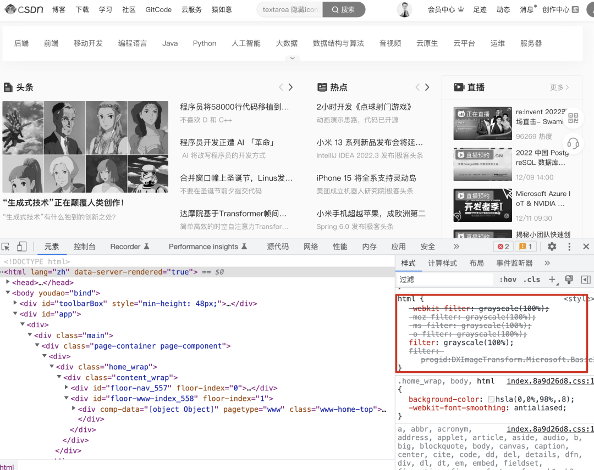


~~~html
-webkit-filter: grayscale(100%);
-moz-filter: grayscale(100%);
-ms-filter: grayscale(100%);
-o-filter: grayscale(100%);

//这一行就搞定
filter: grayscale(100%);

filter: progid:DXImageTransform.Microsoft.BasicImage(grayscale=1);
~~~


# 选择器


### 元素选择器

元素，指的是 HTML 的标签。

~~~css
元素名称 {
    键: 值;
    ...
}

eg: h1 元素文字置为红色
h1 {
    color: red
}
~~~


同时选择多个元素

~~~css
p, li {
    color: green;
}
~~~

会将段落和列表的字体颜色变成 green。


### 类名选择器

我只想修改第二个 *li* 的样式，该如何呢？

~~~html
<ul>
  <li>项目一</li>
  <li class="special">项目二</li>
  <li>项目 <em>三</em></li>
</ul>
~~~


在选择器的开头加个西文句点（.）+ 类名

~~~css
.类名 {
    键: 值;
    ....
}

eg:
.special {
  color: orange;
  font-weight: bold;
}

~~~

这个 `special` 类型可不局限于列表，它可以应用到各种元素上。


1. ***元素 + 类名选择器***

   选择器中，有时 HTML 元素选择器跟类一起出现：

   ~~~css
   li.special {
     color: orange;
     font-weight: bold; 
   }
   ~~~

   这个意思是说，***“选中每个 `special` 类的 `li` 元素”***。

   它对 `<span>` 还有其它元素不起作用了。

   可以把这个元素再添上去就是了：

   ~~~css
   li.special,
   span.special {
     color: orange;
     font-weight: bold;
   }
   ~~~

   

2. ***多个类同时作用于一个html标签时***

   对一个标签同时应用多个类，然后分别指向它们

   ~~~html
   <div class="notebox">
       This is an informational note.
   </div>
   
   <div class="notebox warning">
       This note shows a warning.
   </div>
   
   <div class="notebox danger">
       This note shows danger!
   </div>
   
   <div class="danger">
       This won't get styled — it also needs to have the notebox class
   </div>
   ~~~

   ~~~css
   .notebox {
     border: 4px solid #666;
     padding: .5em;
   }
   
   .notebox.warning {  /* 中间没有空格，直接相连*/
     border-color: orange;
     font-weight: bold;
   }
   
   .notebox.danger {  /* 中间没有空格，直接相连*/
     border-color: red;
     font-weight: bold;
   }
   ~~~

   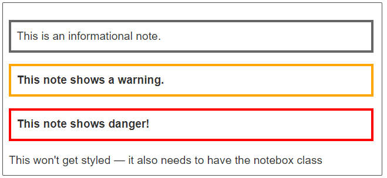


### ID 选择器

***#***

~~~css
#one {
    background-color: yellow;
}

h1#heading {   /* 元素、ID 皆匹配 */
    color: rebeccapurple;
}
~~~


ID 所指特定，会优先于大多数其他选择器。所以很难处理它们。大多数情况下，给一个元素加个类，而不是使用 ID，会更好。


### 属性选择器

基于一个元素自身是否存在（例如`href`）或者基于各式不同的按属性值的匹配，来选取元素。

| 选择器                  | 示例                      | 描述                                                         |
| :---------------------- | :------------------------ | :----------------------------------------------------------- |
| ***[attr]***            | ***a[title]***            | 匹配存在 title 属性的 a 标签                                 |
| ***[attr=value]***      | ***a[href="xxx"]***       | 匹配存在 href 属性且值正为 *xxx* 的 a 标签                   |
| ***[attr~=value]***     | ***p[class~="special"]*** | 匹配带有一个名为 *class* 的属性的 p 元素，其值为 *special*，或者匹配带有一个*class* 属性的元素，其值有一个或者更多，至少有一个和 *special* 匹配。注意，在一列中的好几个值，是用空格隔开的。 |
| ***`[`attr|=value`]`*** | ***div[lang\|="zh"]***    | 匹配带有一个名为 *lang* 的属性的 div 元素，其值可正为 *zh*，或者开始为 *zh*，后面紧随着一个连字符。 |


~~~html
<h1>Attribute presence and value selectors</h1>
<ul>
    <li>Item 1</li>
    <li class="a">Item 2</li>
    <li class="a b">Item 3</li>
    <li class="ab">Item 4</li>
</ul>
~~~

~~~css
li[class] {
    font-size: 200%;
}

li[class="a"] {
    background-color: yellow;
}

li[class~="a"] {
    color: red;
}
~~~

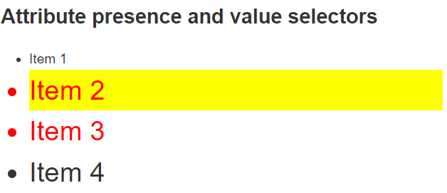


- 使用`li[class]`，我们就能匹配任何有 class 属性的选择器。这匹配了除了第一项以外的所有项。
- `li[class="a"]`匹配带有一个`a`类的选择器，不过不会选中一部分值为`a`而另一部分是另一个用空格隔开的值的类，它选中了第二项。
- `li[class~="a"]`会匹配一个`a`类，不过也可以匹配一列用空格分开、包含`a`类的值，它选中了第二和第三项。


#### 子字符串匹配选择器

让更高级的属性的值的子字符串的匹配变得可行。

例如，如果你有`box-warning`和`box-error`类，想把开头为“box-”字符串的每个物件都匹配上的话，你可以用`[class^="box-"]`来把它们两个都选中。

| 选择器          | 示例                | 描述                                                         |
| :-------------- | :------------------ | :----------------------------------------------------------- |
| `[attr^=value]` | `li[class^="box-"]` | 匹配带有一个名为*attr*的属性的元素，其值开头为*value*子字符串。 |
| `[attr$=value]` | `li[class$="-box"]` | 匹配带有一个名为*attr*的属性的元素，其值结尾为*value*子字符串 |
| `[attr*=value]` | `li[class*="box"]`  | 匹配带有一个名为*attr*的属性的元素，其值的字符串中的任何地方，至少出现了一次*value*子字符串。 |

~~~html
<h1>Attribute substring matching selectors</h1>
<ul>
    <li class="a">Item 1</li>
    <li class="ab">Item 2</li>
    <li class="bca">Item 3</li>
    <li class="bcabc">Item 4</li>
</ul>
~~~

~~~css
li[class^="a"] {
    font-size: 200%;
}

li[class$="a"] {
    background-color: yellow;
}

li[class*="a"] {
    color: red;
}
~~~

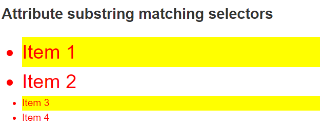

- `li[class^="a"]`匹配了任何值开头为`a`的属性，于是匹配了前两项。
- `li[class$="a"]`匹配了任何值结尾为`a`的属性，于是匹配了第一和第三项。
- `li[class*="a"]`匹配了任何值的字符串中出现了`a`的属性，于是匹配了所有项。


### 包含选择符

根据 HTML 元素的包含关系，设置元素的样式。


比如：有两个  ***em*** 元素 ——一个在段落内，另一个在列表项内。

我要选择在 ***li*** 列表项里面的 *em*

~~~css
元素 元素 {
    键：值；
    ....
}
 # 中间存在一个空格（space）

eg：
li em {
  color: rebeccapurple;
}
~~~


### 相邻选择符

同层级的 HTML 元素设置相同的样式。

~~~css
元素 + 元素 {
    键：值；
    ....
}

eg：
h1 + p {
  font-size: 200%;
}
~~~


### 状态 —> 样式

***a*** 标签具备多种状态：

- 鼠标悬浮
- 点击
- 选中
- ....

可以为其每一种状态设置不同的样式。


~~~css
元素:状态 {
    键：值；
    ....
}

eg:
a:link {
  color: pink;
}

a:visited {
  color: green;
}

a:hover {
  text-decoration: none;  # 移除下划线
}
~~~


### 选择器 + 选择符

~~~css
article p span { ... }

h1 + ul + p { ... }

body h1 + p .special {
  color: yellow;
  background-color: black;
  padding: 5px;
}
~~~


### 全局选择器

星号（`*`）代指的，它选中了文档中的所有内容。


### 兄弟选择器

想选中任何 ***article*** 元素的第一子元素，不论它是什么元素，都给它加粗，我可以将 ***:first-child***

~~~css
article :first-child {

}
~~~


***注意***：

~~~css
article:first-child {
    
}
~~~

此选择器，选中的 *article* 将会是作为其它元素的第一子元素的 *article*


为了避免这种混淆，我们可以向 ***:first-child*** 选择器加入全局选择器

~~~css
article *:first-child {

}
~~~


## 层叠与继承

CSS 代表**层叠样式表**（Cascading Style Sheets），理解第一个词*层叠*（cascade）很重要。

在某些时候，应该产生效果的样式没有生效。通常的原因是你创建了两个应用于同一个元素的规则。

- 与[**层叠**](https://developer.mozilla.org/zh-CN/docs/Web/CSS/Cascade)密切相关的概念是[**优先级**（specificity）](https://developer.mozilla.org/zh-CN/docs/Web/CSS/Specificity)，决定在发生冲突的时候应该使用哪条规则。
- 也有[**继承**](https://developer.mozilla.org/zh-CN/docs/Web/CSS/inheritance)的概念，也就是在默认情况下，一些 css 属性继承当前元素的父元素上设置的值，有些则不继承。


### 优先级

ID选择器 < 元素选择器 < 类名选择器 

~~~css
<p class="special">What color am I?</p>
~~~

~~~css
p {
  color: red;
}

p {
  color: blue;
}
~~~

为 p 选择器定义了两个规则，但是段落最后是蓝色的，*稍后的样式将覆盖以前的样式（**级联**）*。


~~~css
.special {
  color: red;
}

p {
  color: blue;
}
~~~

段落变红


***!important***  无视优先级


***覆盖声明的顺序***

相互冲突的声明将按以下顺序应用，后一种声明将覆盖前一种声明：

1. 用户代理样式表中的声明（浏览器的默认样式）。
2. 用户样式表中的常规声明（由用户设置的自定义样式）。
3. 作者样式表中的常规声明（ web 开发人员设置的样式）。
4. 作者样式表中的 `!important` 声明
5. 用户样式表中的 `!important` 声明
6. 用户代理样式表中的 `!important` 声明


### 层叠


### 继承

父元素上的 CSS 属性是可以被子元素继承的，有些则不能。


不能继承的属性：

1. ***width***
2. margin
3. padding
4. border


设置一个元素的 `color` 和 `font-family`，每个在里面的元素也都会有相同的属性，除非你直接在元素上设置属性。

~~~html
<p>As the body has been set to have a color of blue this is inherited through the descendants.</p>
<p>We can change the color by targeting the element with a selector, such as this 					<span>span</span>.
</p>
~~~

~~~css
body {
    color: blue;
}

span {
    color: black;
}
~~~

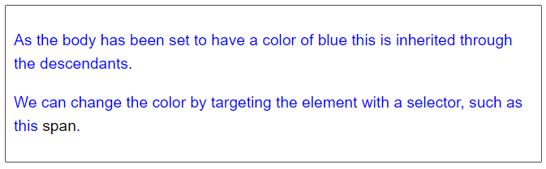


***控制继承的 5 个值***

1. *inherit*

   继承父类的值

   

2. *initial*

   属性的默认值

   

3. *revert (en-US)*

   浏览器对于该属性的默认值

   

4. *revert-layer (en-US)*

   

5. *unset*

   将属性重置为自然值，也就是如果属性是自然继承那么就是 `inherit`，否则和 `initial` 一样

~~~html
<ul>
    <li>Default <a href="#">link</a> color</li>
    <li class="my-class-1">Inherit the <a href="#">link</a> color</li>
    <li class="my-class-2">Reset the <a href="#">link</a> color</li>
    <li class="my-class-3">Unset the <a href="#">link</a> color</li>
</ul>
~~~

~~~css
body {
    color: green;
}
          
.my-class-1 a {
    color: inherit;
}
          
.my-class-2 a {
    color: initial;
}
          
.my-class-3 a {
    color: unset;
}
~~~

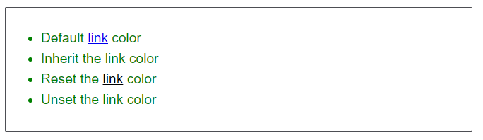


特殊属性 ***all***，它的值可以是其中任意一个（`inherit`、`initial`、`unset` 或 `revert`）


# CSS 引入

 

1. ***外部引入***

   1. 定义一个 css 文件，并且命名（假设为 ***stely.css***）。

      ~~~css
      h1 {
        color: red;
      }
      ~~~

      

   2. 在 HTML 文件头部引入

      ~~~html
      <link rel="stylesheet" href="styles.css">
      
      // 属性 rel，让浏览器知道有 CSS 文档存在
      // 属性 href 指定，寻找 CSS 文件的位置
      ~~~

      

2. ***内部样式***

   不使用外部 CSS 文件，将 CSS 放在 HTML 文件 ***head*** 标签里的 ***style*** 标签之中。

   ~~~html
   <!DOCTYPE html>
   <html>
     <head>
       <meta charset="utf-8">
       <title>My CSS experiment</title>
       <style>
         h1 {
           color: blue;
           background-color: yellow;
           border: 1px solid black;
         }
   
         p {
           color: red;
         }
       </style>
     </head>
     <body>
       <h1>Hello World!</h1>
       <p>This is my first CSS example</p>
     </body>
   </html>
   ~~~

   

3. ***内联样式***

   存在于 HTML 元素的 style 属性之中。

   ~~~html
   <h1 style="color: blue;background-color: yellow;border: 1px solid black;">Hello World!</h1>
   <p style="color:red;">This is my first CSS example</p>
   ~~~

   **除非你有充足的理由，否则不要这样做！** 它难以维护


# 改变元素默认行为


浏览器自带一个包含默认样式的样式表，默认对任何页面有效。

- 标题默认使用大号粗体
- 列表旁总有项目符号
- .....

话说回来，所有现代浏览器的默认样式都没什么差距。


选定那个元素，加一条 CSS 规则即可。

~~~css
li {
  list-style-type: none;
}
~~~


# Function


### *calc()*

允许在 CSS 中进行简单的计算

~~~html
<div class="outer">
    <div class="box">The inner box is 90% - 30px.</div>
</div>
~~~

~~~css
.outer {
  border: 5px solid black;
}

.box {
padding: 10px;
width: calc(90% - 30px);
background-color: rebeccapurple;
color: white;
}
~~~

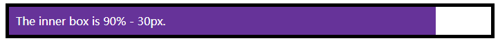


### *transform*()

例如 `rotate()`


# @

@ 是一些特殊的规则，为 CSS 提供了一些关于如何表现的指导。


1. ***@import*** 将额外的样式表导入主 CSS 样式表

   ~~~css
   @import 'styles2.css';
   ~~~

2. ***@media***  通过**媒体查询**（**Media queries**），根据各种设备特征和参数的值或者是否存在来调整您的网站或应用。

   eg: 当屏幕分辨率高于某一数量，或屏幕宽度大于某一宽度时

   ~~~css
   body {
     background-color: pink;
   }
   
   @media (min-width: 30em) {
     body {
       background-color: blue;
     }
   }
   ~~~

   给 `<body>` 元素一个粉红色的背景色。随后使用 *@media* 仅适用于视口大于 30em 的浏览器，如果浏览器的宽度大于 30em，则背景色将为蓝色。


# 浏览器解析

1. 浏览器载入 HTML 文件（比如从网络上获取）。

   

2. 将 HTML 文件转化成一个 DOM（Document Object Model），DOM 是文件在计算机内存中的表现形式，下一节将更加详细的解释 DOM。

   

3. 接下来，浏览器会拉取该 HTML 相关的大部分资源，比如嵌入到页面的图片、视频和 CSS 样式。JavaScript 则会稍后进行处理，简单起见，同时此节主讲 CSS，所以这里对如何加载 JavaScript 不会展开叙述。

   

4. 浏览器拉取到 CSS 之后会进行解析，根据选择器的不同类型（比如 element、class、id 等等）把他们分到不同的“桶”中。浏览器基于它找到的不同的选择器，将不同的规则（基于选择器的规则，如元素选择器、类选择器、id 选择器等）应用在对应的 DOM 的节点中，并添加节点依赖的样式（这个中间步骤称为渲染树）。

   

5. 上述的规则应用于渲染树之后，渲染树会依照应该出现的结构进行布局。

   

6. 网页展示在屏幕上（这一步被称为着色）。

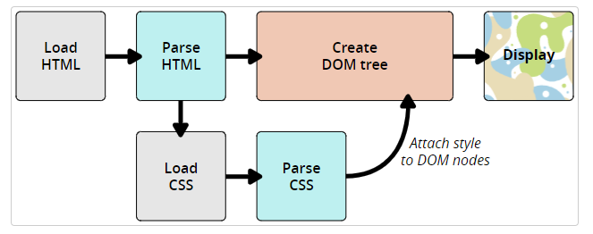


## 关于 DOM

一个 DOM 有一个树形结构，标记语言中的每一个元素、属性以及每一段文字都对应着结构树中的一个节点（Node/DOM 或 DOM node）。

节点由节点本身和其他 DOM 节点的关系定义，有些节点有父节点，有些节点有兄弟节点（同级节点）。


## 真实的 DOM

~~~html
<p>
  Let's use:
  <span>Cascading</span>
  <span>Style</span>
  <span>Sheets</span>
</p>
~~~

在这个 DOM 中，`<p>`元素对应了父节点，它的子节点是一个 text 节点和三个对应了`<span>`元素的节点，`SPAN`节点同时也是他们中的 Text 节点的父节点。


浏览器生成的 DOM 树形结构

```
P
├─ "Let's use:"
├─ SPAN
|  └─ "Cascading"
├─ SPAN
|  └─ "Style"
└─ SPAN
    └─ "Sheets"
```


输出到浏览器：

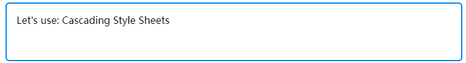


CSS 代码：

```css
span {
  border: 1px solid black;
  background-color: lime;
}
```

浏览器会解析 HTML 并创造一个 DOM，然后解析 CSS。

唯一的选择器就是`span`元素选择器，浏览器处理规则会非常快！把同样的规则直接使用在三个`<span>`标签上，然后渲染出图像到屏幕。


现在的显示如下：

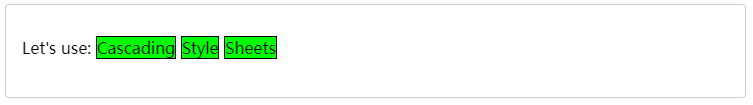


## 无法解析的 CSS

浏览器什么也不会做，继续解析下一个 CSS 样式！


这样做好处多多，代表着你使用最新的 CSS 优化的过程中浏览器遇到无法解析的规则也不会报错。

当你为一个元素指定多个 CSS 样式的时候，浏览器会加载样式表中的最后的 CSS 代码进行渲染（样式表，优先级等请读者自行了解），也正因为如此，你可以为同一个元素指定多个 CSS 样式来解决有些浏览器不兼容新特性的问题（比如指定两个`width`）。

~~~css
.box {
  width: 500px;
  width: calc(100% - 50px);
}
~~~

一些老的浏览器不接收`calc()`作为一个值，就会采用第一个。


# 盒模型

***display: block***

1. ***x 轴***方向占据父元素的所有可用空间
2. 每个盒子都会换行
3.  width 和 height 属性可以发挥作用
4. 内边距（padding）, 外边距（margin）和 边框（border）会将其他元素从当前盒子周围“推开”


默认 block 

- h1
- p


***display: inline***

1. 盒子不会产生换行。
2.  width 和 height 无作用
3. 垂直方向的内边距、外边距以及边框会被应用。但是不会把其他处于 `inline` 状态的盒子推开。
4. 水平方向的内边距、外边距以及边框会被应用。会把其他处于 `inline` 状态的盒子推开。


默认 inline

- a
- span
- em
- strong


CSS 中组成一个块级盒子需要：

- **Content box**: 这个区域是用来显示内容，大小可以通过设置 [`width`](https://developer.mozilla.org/zh-CN/docs/Web/CSS/width) 和 [`height`](https://developer.mozilla.org/zh-CN/docs/Web/CSS/height).
- **Padding box**: 包围在内容区域外部的空白区域；大小通过 [`padding`](https://developer.mozilla.org/zh-CN/docs/Web/CSS/padding) 相关属性设置。
- **Border box**: 边框盒包裹内容和内边距。大小通过 [`border`](https://developer.mozilla.org/zh-CN/docs/Web/CSS/border) 相关属性设置。
- **Margin box**: 这是最外面的区域，是盒子和其他元素之间的空白区域。大小通过 [`margin`](https://developer.mozilla.org/zh-CN/docs/Web/CSS/margin) 相关属性设置。

如下图：


### 标准盒模型

在标准模型中，如果你给盒设置 `width` 和 `height`，实际设置的是 *content box*。padding 和 border 再加上设置的宽高一起决定整个盒子的大小。见下图。

假设定义了 `width`, `height`, `margin`, `border`, and `padding`:

```css
.box {
  width: 350px;
  height: 150px;
  margin: 25px;
  padding: 25px;
  border: 5px solid black;
}
```

如果使用标准模型宽度 = 410px (350 + 25 + 25 + 5 + 5)，高度 = 210px (150 + 25 + 25 + 5 + 5)，padding 加 border 再加 content box。


> **备注：** margin 不计入实际大小 —— 当然，它会影响盒子在页面所占空间，但是影响的是盒子外部空间。盒子的范围到边框为止 —— 不会延伸到 margin。


### 替代（IE）盒模型

css 还有一个替代盒模型。

使用这个模型，所有宽度都是可见宽度，所以内容宽度是该宽度减去边框和填充部分。

使用上面相同的样式得到 (width = 350px, height = 150px).


如果需要使用替代模型

```css
.box {
  box-sizing: border-box;
}
```

如果你希望所有元素都使用替代模式，而且确实很常用，设置 `box-sizing` 在 `<html>` 元素上，然后设置所有元素继承该属性

~~~css
html {
  box-sizing: border-box;
}
*, *::before, *::after {
  box-sizing: inherit;
}
~~~


# 高度

占满可见高度

```css
height: 100vh
```


# 牛逼功能

***has()***

~~~html
<style>
  /* If `em` contains `b` or `u` tags */
  em:has(b, u) {
    color: #f8a100;
  }
</style>

<p>
  I used to have this boss who <em>loved</em>, <strong>loved</strong>, 
  <strong><em>loved</em></strong>, <strong><em><u>loved</u></em></strong> 
  to emphasize words.
</p>
~~~

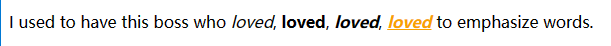
