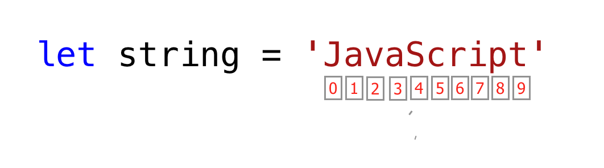

# day 1

# ----------------------------------------------


### `console.log()`

~~~js
// 一个参数
console.log('Hello, World!')

// 多个参数
console.log('Hello', 'World', '!')
console.log('HAPPY', 'NEW', 'YEAR', 2020)
console.log('Welcome', 'to', 30, 'Days', 'Of', 'JavaScript')

// 文本必须在单引号、双引号或反引号内
console.log('Hello, World!')
console.log("Hello, World!")
console.log(`Hello, World!`)
~~~


### 算术

~~~js
console.log(2 + 3) // Addition
console.log(3 - 2) // Subtraction
console.log(2 * 3) // Multiplication
console.log(3 / 2) // Division
console.log(3 % 2) // Modulus - finding remainder
console.log(3 ** 2) // Exponentiation 3 ** 2 == 3 * 3
~~~


### 将 JavaScript 添加到网页

有三种方式：

- 内联 js
- 内部 js
- 外部 js


<h4>内联 js

比如在 `.html` 文件中

~~~html
<!DOCTYPE html>
<html>

<head>
    <title> 30 天学会 JavaScript</title>
</head>

<body>

    <button onclick="alert('Hello World!')">Welcome!</button>

</body>

</html>
~~~

`alert('Hello World!')`  就是内联 js


<h4> 内部脚本

可以写在 `<head>` 、`<body>` 标签中。

~~~html
<!DOCTYPE HTML>
<html>
    
    <head>
        <title> 内部 js</title>
        
        <script>
        	console.log('hello world')
        </script>
    </head>
    
    <body>
        
    </body>
</html>
~~~

~~~html
<!DOCTYPE HTML>
<html>

    <head>
        <title> 内部 js</title>
    </head>

    <body>
        <script>
            console.log('hello world')
        </script>
    </body>
</html>
~~~


<h4> 外部 js

外部 js 的链接调用可以像内部 js 一样，写在  `<head>` 、`<body>` 标签中。

~~~html
<!DOCTYPE html>
<html lang="en">
  <head>
    <script src="introduction.js"></script>
  </head>
    
  <body>
    <script src="introduction.js"></script>
      
     // 引入多个
   	<script src="./helloworld.js"></script>
  </body>
</html>
~~~

*main.js 文件应该在所有其他脚本*的下方。记住这一点非常重要。


### 数据类型

原始数据类型：*String、Number、Boolean、undefined、Null* 和 *Symbol*。


<h4>Number

- 整数：整数（负数、零和正数）示例：... -3、-2、-1、0、1、2、3 ...
- 浮点数：十进制数 示例 ... -3.5、-2.25、-1.0、0.0、1.1、2.2、3.5 ...


<h4>String

单引号、双引号、反引号之间的一个或多个字符的集合。


<h4>Boolean

布尔值是 True 或 False。任何比较都会返回一个布尔值，即 true 或 false。

布尔数据类型是真值或假值。

```js
true // if the light is on, the value is true
false // if the light is off, the value is false
```


<h4>undefined

在 JavaScript 中，如果我们不为变量赋值，则该值是 *undefined*  的。

除此之外，如果一个函数没有返回任何东西，它会返回 *undefined*。

~~~js
let firstName
console.log(firstName) // undefined, because it is not assigned to a value yet
~~~


<h4>Null

Null 在 JavaScript 中表示一个空值。

~~~js
let emptyValue = null
~~~


#### 检查数据类型

要检查某个变量的数据类型，我们使用**typeof**运算符。

~~~js
console.log(typeof 'Asabeneh') // string
console.log(typeof 5) // number
console.log(typeof true) // boolean
console.log(typeof null) // object type
console.log(typeof undefined) // undefined
~~~


### 注释

请记住，JavaScript 中的注释与其他编程语言类似。注释对于使您的代码更具可读性很重要。评论有两种方式：

- *单行注释*
- *多行注释*

```js
// commenting the code itself with a single comment
// let firstName = 'Asabeneh'; single line comment
// let lastName = 'Yetayeh'; single line comment
```

多行注释：

```js
/*
  let location = 'Helsinki';
  let age = 100;
  let isMarried = true;
  This is a Multiple line comment
*/
```


### 变量

变量是数据的容器，变量用于将数据存储在内存位置。

声明变量时，会保留一个内存位置。当一个变量被赋值给一个值（数据）时，内存空间将被该数据填充。


要声明变量，我们使用 *var*、*let* 或 *const* 关键字。

- 对于在不同时间发生变化的变量，我们使用*let*。
- 如果数据根本没有改变，我们使用*const*。比如PI，国名，gravity都不会变，我们可以用*const*。
- 我们不会在这个挑战中使用 var，我也不建议你使用它。这是一种容易出错的声明变量的方式，它有很多泄漏。


规范的变量名称：

1. 不允许除了美元符号（$）和下划线（_）以外的特殊字符
2. 不允许以数字开头
3. 遵循驼峰命名法
4. 变量名称单词间不允许存在空格


# day2 

# ----------------------------------


### 数据类型

数据或值具有数据类型。

数据类型描述数据的特征。


数据类型可以分为两种：

1. 原始数据类型
2. 非原始数据类型（对象引用）


原始数据类型：*String、Number、Boolean、undefined、Null* 和 *Symbol*。

1. Number- 整数、浮点数
2. String - 单引号、双引号或反引号下的任何数据
3. Boolean - 真值或假值
4. Null - 空值或无值
5. undefined - 声明的变量没有值
6. Symbol- 可以由 Symbol 构造函数生成的唯一值


JavaScript 中的非原始数据类型包括：

1. 对象
2. 数组


*原始*数据类型是不可变的（不可修改的）数据类型。一旦创建了原始数据类型，我们就无法修改它。

~~~js
let word = 'gggg'
~~~

如果我们尝试修改存储在变量*word*中的字符串，JavaScript 应该会报错[^不会报错]。

~~~js
word[0] = 'h'
~~~

此表达式不会更改存储在变量*word*中的字符串。

因此，我们可以说字符串是不可修改的，或者换句话说是不可变的。


#### 非原始数据类型

*非原始*数据类型是可修改的或可变的。


让我们通过创建一个数组来查看。

数组可以包含相同或不同的数据类型。

```js
let nums = [1, 2, 3]
nums[0] = 10

console.log(nums)  // [10, 2, 3]
```

如您所见，非原始数据类型的数组是可变的。


非原始数据类型不能按值进行比较，即使两个非原始数据类型具有相同的属性和值，它们也不是严格相等的。

~~~js
let nums = [1, 2, 3]
let numbers = [1, 2, 3]

console.log(nums == numbers)  // false
~~~

~~~js
let userOne = {
name:'Asabeneh',
role:'teaching',
country:'Finland'
}

let userTwo = {
name:'Asabeneh',
role:'teaching',
country:'Finland'
}

console.log(userOne == userTwo) // false
~~~

根据经验，我们不比较非原始数据类型。

> 不要比较数组、函数或对象。


非原始值被称为引用类型，因为它们是通过引用而不是值进行比较的。

两个对象只有在引用相同的底层对象时才严格相等。

~~~js
let nums = [1, 2, 3]
let numbers = nums

console.log(nums == numbers)  // true

let userOne = {
name:'Asabeneh',
role:'teaching',
country:'Finland'
}

let userTwo = userOne

console.log(userOne == userTwo)  // true
~~~


#### 数字

数字是可以进行所有算术运算的整数和小数值。


`Math` 

 Math 对象提供了很多数学上的方法

~~~js
const PI = Math.PI

console.log(PI)                            // 3.141592653589793

// Rounding to the closest number
// if above .5 up if less 0.5 down rounding

console.log(Math.round(PI))                // 3 to round values to the nearest number

console.log(Math.round(9.81))              // 10

console.log(Math.floor(PI))                // 3 rounding down

console.log(Math.ceil(PI))                 // 4 rounding up

console.log(Math.min(-5, 3, 20, 4, 5, 10)) // -5, returns the minimum value

console.log(Math.max(-5, 3, 20, 4, 5, 10)) // 20, returns the maximum value

const randNum = Math.random() // creates random number between 0 to 0.999999
console.log(randNum)

// Let us  create random number between 0 to 10

const num = Math.floor(Math.random () * 11) // creates random number between 0 and 10
console.log(num)

//Absolute value
console.log(Math.abs(-10))      // 10

//Square root
console.log(Math.sqrt(100))     // 10

console.log(Math.sqrt(2))       // 1.4142135623730951

// Power
console.log(Math.pow(3, 2))     // 9

console.log(Math.E)             // 2.718

// Logarithm
// Returns the natural logarithm with base E of x, Math.log(x)
console.log(Math.log(2))        // 0.6931471805599453
console.log(Math.log(10))       // 2.302585092994046

// Returns the natural logarithm of 2 and 10 respectively
console.log(Math.LN2)           // 0.6931471805599453
console.log(Math.LN10)          // 2.302585092994046

// Trigonometry
Math.sin(0)
Math.sin(60)

Math.cos(0)
Math.cos(60)
~~~


**随机数发生器**

JavaScript 数学对象有一个 random() 方法数字生成器，它生成从 0 到 0.999999999 的数字......

```js
let randomNum = Math.random() // generates 0 to 0.999...
```

现在，让我们看看如何使用 random() 方法生成 0 到 10 之间的随机数：

```js
let randomNum = Math.random()         // generates 0 to 0.999
let numBtnZeroAndTen = randomNum * 11

console.log(numBtnZeroAndTen)         // this gives: min 0 and max 10.99

let randomNumRoundToFloor = Math.floor(numBtnZeroAndTen)
console.log(randomNumRoundToFloor)    // this gives between 0 and 10
```


#### 字符串

字符串是文本，位于***单**引号 、**双**引号和**反**引号*下。

~~~js
let space = ' '           // an empty space string
let firstName = 'Asabeneh'
let lastName = 'Yetayeh'
let country = 'Finland'
let city = 'Helsinki'
let language = 'JavaScript'
let job = 'teacher'
let quote = "The saying,'Seeing is Believing' is not correct in 2020."
let quotWithBackTick = `The saying,'Seeing is Believing' is not correct in 2020.`
~~~


将两个或多个字符串连接在一起称为串联。

~~~js
let fullName = firstName + space + lastName; 

// Asabeneh Yetayeh
~~~


##### 长文字串

字符串可以是单个字符或段落或页面。

如果字符串长度太大，一行就放不下。

我们可以在每行的末尾使用反斜杠字符（\）来表示该字符串将在下一行继续。

~~~js
const paragraph = "My name is Asabeneh Yetayeh. I live in Finland, Helsinki.\
I am a teacher and I love teaching. I teach HTML, CSS, JavaScript, React, Redux, \
Node.js, Python, Data Analysis and D3.js for anyone who is interested to learn. \
In the end of 2019, I was thinking to expand my teaching and to reach \
to global audience and I started a Python challenge from November 20 - December 19.\
It was one of the most rewarding and inspiring experience.\
Now, we are in 2020. I am enjoying preparing the 30DaysOfJavaScript challenge and \
I hope you are enjoying too."

console.log(paragraph)
~~~


##### 字符串中的转义序列

在 JavaScript 和其他编程语言中，\ 后跟一些字符是转义序列。让我们看看最常见的转义字符：

- `\n`: 换行
- `\t`制表符，表示8个空格
- `\\`: 反斜杠
- `\'`：单引号 (')
- `\"`: 双引号 (")


控制台输出：

```
I hope everyone is enjoying the 30 Days Of JavaScript challenge.
Do you ?
Days  Topics  Exercises
Day 1 3 5
Day 2 3 5
Day 3 3 5
Day 4 3 5
This is a backslash  symbol (\)
In every programming language it starts with "Hello, World!"
In every programming language it starts with 'Hello, World!'
The saying 'Seeing is Believing' isn't correct in 2020
```


##### 模板文字（模板字符串）

要创建模板字符串，我们使用两个反引号。

我们可以将数据作为表达式注入模板字符串中。

为了注入数据，我们用美元和大括号 `${}` 将表达式括起来


```js
//Syntax
`String literal text`
`String literal text ${expression}`
```

```js
console.log(`The sum of 2 and 3 is 5`)              // statically writing the data
let a = 2
let b = 3
console.log(`The sum of ${a} and ${b} is ${a + b}`) // injecting the data dynamically
```


使用字符串模板或字符串插值方法，我们可以添加表达式，可以是一个值，也可以是一些操作（比较、算术运算、三元运算）。

```js
let a = 2
let b = 3
console.log(`${a} is greater than ${b}: ${a > b}`)
```

~~~js
2 is greater than 3: false
~~~


##### 字符串方法

JavaScript 中的一切都是对象。

字符串是一种原始数据类型，这意味着它一旦创建就无法修改。

字符串对象有很多字符串方法。

有不同的字符串方法可以帮助我们处理字符串。


1. *length*：字符串*长度*方法返回字符串中包含空格的字符数。

   ~~~js
   let js = 'JavaScript'
   console.log(js.length)         // 10
   let firstName = 'Asabeneh'
   console.log(firstName.length)  // 8
   ~~~

   

2. *访问字符串中的字符*。

   在编程中，从0开始计数。

   字符串的第一个索引为零，最后一个索引为字符串的长度减一。

   

   ~~~js
   let string = 'JavaScript'
   let firstLetter = string[0]
   
   console.log(firstLetter)           // J
   
   let secondLetter = string[1]       // a
   let thirdLetter = string[2]
   let lastLetter = string[9]
   
   console.log(lastLetter)            // t
   
   let lastIndex = string.length - 1
   
   console.log(lastIndex)  // 9
   console.log(string[lastIndex])    // t
   ~~~

   

3. *toUpperCase()*：此方法将字符串更改为大写字母。

   

4. *toLowerCase()*：此方法将字符串更改为小写字母。

   

5. *substr()*：它有两个参数，起始索引和要切片的字符数。

   ~~~js
   let string = 'JavaScript'
   console.log(string.substr(4,6))    // Script
   
   let country = 'Finland'
   console.log(country.substr(3, 4))   // land
   ~~~

   

6. *substring()*：它有两个参数，起始索引和停止索引，但它不包括停止索引处的字符。

   ~~~js
   let string = 'JavaScript'
   
   console.log(string.substring(0,4))     // Java
   console.log(string.substring(4,10))    // Script
   console.log(string.substring(4))       // Script
   
   let country = 'Finland'
   
   console.log(country.substring(0, 3))   // Fin
   console.log(country.substring(3, 7))   // land
   console.log(country.substring(3))      // land
   ~~~

   

7. *split()*：split 方法在指定位置拆分字符串。

   ~~~js
   let string = '30 Days Of JavaScript'
   
   console.log(string.split())     // Changes to an array -> ["30 Days Of JavaScript"]
   console.log(string.split(' '))  // Split to an array at space -> ["30", "Days", "Of", "JavaScript"]
   
   let firstName = 'Asabeneh'
   
   console.log(firstName.split())    // Change to an array - > ["Asabeneh"]
   console.log(firstName.split(''))  // Split to an array at each letter ->  ["A", "s", "a", "b", "e", "n", "e", "h"]
   
   let countries = 'Finland, Sweden, Norway, Denmark, and Iceland'
   
   console.log(countries.split(','))  // split to any array at comma -> ["Finland", " Sweden", " Norway", " Denmark", " and Iceland"]
   console.log(countries.split(', ')) //  ["Finland", "Sweden", "Norway", "Denmark", "and Iceland"]
   ~~~

   

8. *trim()*：删除字符串开头或结尾的尾随空格。

   ~~~js
   let string = '   30 Days Of JavaScript   '
   
   console.log(string)
   console.log(string.trim(' '))
   
   let firstName = ' Asabeneh '
   
   console.log(firstName)
   console.log(firstName.trim())  // still removes spaces at the beginning and the end of the string
   ~~~

   ```
      30 Days Of JavasCript   
   30 Days Of JavasCript
     Asabeneh 
   Asabeneh
   ```

   

9. *includes()*：它接受一个子字符串参数，并检查字符串中是否存在子字符串参数。

   *includes()*返回一个布尔值。如果字符串中存在子串，则返回真，否则返回假。

   ~~~js
   let string = '30 Days Of JavaScript'
   
   console.log(string.includes('Days'))     // true
   console.log(string.includes('days'))     // false - it is case sensitive!
   console.log(string.includes('Script'))   // true
   console.log(string.includes('script'))   // false
   console.log(string.includes('java'))     // false
   console.log(string.includes('Java'))     // true
   
   let country = 'Finland'
   
   console.log(country.includes('fin'))     // false
   console.log(country.includes('Fin'))     // true
   console.log(country.includes('land'))    // true
   console.log(country.includes('Land'))    // false
   ~~~

   

10. *replace()*：将旧子字符串和新子字符串作为参数。

    ~~~js
    string.replace(oldsubstring, newsubstring)
    ~~~

    ```js
    let string = '30 Days Of JavaScript'
    console.log(string.replace('JavaScript', 'Python')) // 30 Days Of Python
    
    let country = 'Finland'
    console.log(country.replace('Fin', 'Noman'))       // Nomanland
    ```

    

11. *charAt()*：采用索引并返回该索引处的值

    ~~~js
    string.charAt(index)
    let string = '30 Days Of JavaScript'
    console.log(string.charAt(0))        // 3
    
    let lastIndex = string.length - 1
    console.log(string.charAt(lastIndex)) // t
    ~~~

    

12. *charCodeAt()*：采用索引并返回该索引处值的字符代码（ASCII 数字）

    ~~~js
    string.charCodeAt(index)
    let string = '30 Days Of JavaScript'
    console.log(string.charCodeAt(3))        // D ASCII number is 68
    
    let lastIndex = string.length - 1
    console.log(string.charCodeAt(lastIndex)) // t ASCII is 116
    ~~~

    

13. *indexOf()*：获取一个子字符串，如果该子字符串存在于字符串中，则返回该子字符串的第一个位置，如果不存在，则返回 -1

    ~~~js
    string.indexOf(substring)
    let string = '30 Days Of JavaScript'
    
    console.log(string.indexOf('D'))          // 3
    console.log(string.indexOf('Days'))       // 3
    console.log(string.indexOf('days'))       // -1
    console.log(string.indexOf('a'))          // 4
    console.log(string.indexOf('JavaScript')) // 11
    console.log(string.indexOf('Script'))     //15
    console.log(string.indexOf('script'))     // -1
    ~~~

    

14. *lastIndexOf()*：获取一个子字符串，如果该子字符串存在于字符串中，则返回该子字符串的最后位置，如果不存在，则返回 -1

    ~~~js
    //syntax
    string.lastIndexOf(substring)
    let string = 'I love JavaScript. If you do not love JavaScript what else can you love.'
    
    console.log(string.lastIndexOf('love'))       // 67
    console.log(string.lastIndexOf('you'))        // 63
    console.log(string.lastIndexOf('JavaScript')) // 38
    ~~~

    

15. *concat()*：它需要很多子字符串并将它们连接起来。

    ~~~js
    string.concat(substring, substring, substring)
    let string = '30'
    console.log(string.concat("Days", "Of", "JavaScript")) // 30DaysOfJavaScript
    
    let country = 'Fin'
    console.log(country.concat("land")) // Finland
    ~~~

    c

16. *startsWith*：它接受一个子字符串作为参数，并检查字符串是否以指定的子字符串开头。它返回一个布尔值（真或假）。

    ~~~js
    //syntax
    string.startsWith(substring)
    let string = 'Love is the best to in this world'
    
    console.log(string.startsWith('Love'))   // true
    console.log(string.startsWith('love'))   // false
    console.log(string.startsWith('world'))  // false
    
    let country = 'Finland'
    
    console.log(country.startsWith('Fin'))   // true
    console.log(country.startsWith('fin'))   // false
    console.log(country.startsWith('land'))  //  false
    ~~~

    

17. *endsWith*：它接受一个子字符串作为参数，并检查字符串是否以指定的子字符串结尾。它返回一个布尔值（真或假）

    ~~~js
    string.endsWith(substring)
    let string = 'Love is the most powerful feeling in the world'
    
    console.log(string.endsWith('world'))         // true
    console.log(string.endsWith('love'))          // false
    console.log(string.endsWith('in the world')) // true
    
    let country = 'Finland'
    
    console.log(country.endsWith('land'))         // true
    console.log(country.endsWith('fin'))          // false
    console.log(country.endsWith('Fin'))          //  false
    ~~~

    

18. *search()*：它接受一个子字符串作为参数，并返回第一个匹配项的索引。搜索值可以是字符串或正则表达式模式。

    ~~~js
    string.search(substring)
    let string = 'I love JavaScript. If you do not love JavaScript what else can you love.'
    console.log(string.search('love'))          // 2
    console.log(string.search(/javascript/gi))  // 7
    ~~~

    

19. *match*：它以子字符串或正则表达式模式作为参数，如果匹配则返回一个数组，否则返回 null。

    让我们看看正则表达式模式是什么样的。它以 / 符号开始并以 / 符号结束。

    ~~~js
    let string = 'love'
    let patternOne = /love/     // with out any flag
    let patternTwo = /love/gi   // g-means to search in the whole text, i - case insensitive
    ~~~

    匹配语法

    ~~~js
    // syntax
    string.match(substring)
    let string = 'I love JavaScript. If you do not love JavaScript what else can you love.'
    console.log(string.match('love'))
    ["love", index: 2, input: "I love JavaScript. If you do not love JavaScript what else can you love.", groups: undefined]
    let pattern = /love/gi
    console.log(string.match(pattern))   // ["love", "love", "love"]
    ~~~

    让我们使用正则表达式从文本中提取数字。

    这不是正则表达式部分，不要惊慌！稍后我们将介绍正则表达式。

    ~~~js
    let txt = 'In 2019, I ran 30 Days of Python. Now, in 2020 I am super exited to start this challenge'
    let regEx = /\d+/
    
    // d with escape character means d not a normal d instead acts a digit
    // + means one or more digit numbers,
    // if there is g after that it means global, search everywhere.
    
    console.log(txt.match(regEx))  // ["2", "0", "1", "9", "3", "0", "2", "0", "2", "0"]
    console.log(txt.match(/\d+/g)) // ["2019", "30", "2020"]
    ~~~

    

20. *repeat()*：它接受一个数字作为参数，并返回字符串的重复版本。

    ~~~js
    string.repeat(n)
    ~~~

    ~~~js
    let string = 'love'
    console.log(string.repeat(10)) // lovelovelovelovelovelovelovelovelovelove
    ~~~

    


#### 检查数据类型和转换

检查某个变量的的数据类型，可以使用 *typeof* 关键字

~~~js
// Different javascript data types
// Let's declare different data types

let firstName = 'Asabeneh'      // string
let lastName = 'Yetayeh'        // string
let country = 'Finland'         // string
let city = 'Helsinki'           // string
let age = 250                   // number, it is not my real age, do not worry about it
let job                         // undefined, because a value was not assigned

console.log(typeof 'Asabeneh')  // string
console.log(typeof firstName)   // string
console.log(typeof 10)          // number
console.log(typeof 3.14)        // number
console.log(typeof true)        // boolean
console.log(typeof false)       // boolean
console.log(typeof NaN)         // number
console.log(typeof job)         // undefined
console.log(typeof undefined)   // undefined
console.log(typeof null)        // object
~~~

> ~~~js
> console.log(typeof NaN)         // number
> ~~~
>
> NaN 是 *number* 


##### 更改数据类型（转换）

将一种数据类型转换为另一种数据类型。

使用 *parseInt()*、*parseFloat()*、*Number()*、*+ sign*、*str()* 当我们进行算术运算时，字符串数字应该首先转换为整数或浮点数，否则返回错误。


###### 字符串转整数

可以将字符串数字转换为数字。

引号内的任何数字都是字符串数字。


使用以下方法：

- parseInt()

  ~~~js
  let num = '10'
  let numInt = parseInt(num)
  console.log(numInt) // 10
  ~~~

  

- Number()

  ~~~js
  let num = '10'
  let numInt = Number(num)
  
  console.log(numInt) // 10
  ~~~

  

- Plus sign(+)

  ~~~js
  let num = '10'
  let numInt = +num
  
  console.log(numInt) // 10
  ~~~

  


###### 浮点数到整数

可以将浮点数转换为整数。

- parseInt()

  ~~~js
  let num = '10'
  let numInt = parseInt(num)
  console.log(numInt) // 10
  ~~~

  


# day3  <Booleans,Operators,Date>

# -----------------------------------


### Boolean

*true*或*false*。

任何比较都会返回一个布尔值，该值要么是 true 要么是 false。

~~~js
let isLightOn = true
let isRaining = false
let isHungry = false
let isMarried = true
let truValue = 4 > 3    // true
let falseValue = 4 < 3  // false
~~~


**true 值**

- 除零外，所有数字（正数和负数）都是真实的
- 除空字符串 ('') 外，所有字符串都是真实的
- true


**false 值**

- 0
- 0n
- null
- undefined
- NaN
- false
- '', "", ``, empty string（空字符串）


### Undefined

声明了一个变量并且没有赋值，那么该值将是 *undefined* 的。

一个函数没有返回值，它将是 *undefined* 的。

~~~js
let firstName
console.log(firstName) //not defined, because it is not assigned to a value yet
~~~


### Null

~~~js
let empty = null
console.log(empty) // -> null , means no value
~~~


### Operators <操作符>

JavaScript 中的等号是赋值运算符。它用于分配变量。

```js
let firstName = 'Asabeneh'
let country = 'Finland'
```

#### **赋值运算符**


#### **算术运算符**

算术运算符是数学运算符。

- 加法（+）：a + b
- 减法(-): a - b
- 乘法（*）：a * b
- 除法（/）：a / b
- 模数(%)：a % b
- 指数（**）：a ** b


#### **比较运算符**


`==` 只比较值相同

`===` 既要值相同，也要数据类型相等

~~~js
console.log(3 == '3')           // true，只比价值
console.log(3 === '3')          // false, 比较值和数据类型

console.log(0 == false)         // true, 等效
console.log(0 === false)        // false, 不完全一样
console.log(0 == '')            // true, equivalent
console.log(0 == ' ')           // true, equivalent
console.log(0 === '')           // false, not exactly the same
console.log(1 == true)          // true, equivalent
console.log(1 === true)         // false, not exactly the same
console.log(undefined == null)  // true
console.log(undefined === null) // false
console.log(NaN == NaN)         // false, not equal
console.log(NaN === NaN)        // false
console.log(typeof NaN)         // number
~~~


#### 逻辑运算符

&&（&）、||（|）和 !

- && 运算符只有在两个操作数都为真时才为真
- || 运算符在一个操作数为真时，就为真
- ！运算符将 true 取反为 false，将 false 取反为 true。


~~~js
// && ampersand operator example

const check = 4 > 3 && 10 > 5         // true && true -> true
const check = 4 > 3 && 10 < 5         // true && false -> false
const check = 4 < 3 && 10 < 5         // false && false -> false

// || pipe or operator, example

const check = 4 > 3 || 10 > 5         // true  || true -> true
const check = 4 > 3 || 10 < 5         // true  || false -> true
const check = 4 < 3 || 10 < 5         // false || false -> false

//! Negation examples

let check = 4 > 3                     // true
let check = !(4 > 3)                  //  false
let isLightOn = true
let isLightOff = !isLightOn           // false
let isMarried = !false                // true
~~~


#### 增量运算符

在 JavaScript 中，我们使用增量运算符来增加存储在变量中的值。

增量可以是前增量或后增量。


1. 预增量

   ~~~js
   let count = 0
   console.log(++count)        // 1    简单说，先将自己 + 1，再执行其它
   console.log(count)          // 1
   ~~~

2. 后增量

   ~~~js
   let count = 0
   console.log(count++)        // 0    先执行其它，再将自己 + 1
   console.log(count)          // 1
   ~~~

   


#### 减量运算符

在 JavaScript 中，我们使用递减运算符来减少存储在变量中的值。

减量可以是减量前或减量后。


1. 预递减

   ~~~js
   let count = 0
   console.log(--count) // -1
   console.log(count)  // -1
   ~~~

   

2. 后递减

   ~~~js
   let count = 0
   console.log(count--) // 0
   console.log(count)   // -1
   ~~~

   


#### 三元运算符


#### 运算符优先级

我想建议您从此[链接阅读有关运算符优先级的信息](https://developer.mozilla.org/en-US/docs/Web/JavaScript/Reference/Operators/Operator_Precedence)


### Window 函数


#### `alert()` 

alert() 方法显示一个带有指定消息和一个 OK 按钮的警告框。

是一个内置方法，它接受参数。

~~~js
alert(message)
~~~

~~~js
alert('你已触犯银河正义法！！')
~~~

不要使用太多警报，因为它具有破坏性和烦人性，仅用于测试。


#### `prompt()` 

在浏览器上显示一个带有输入的提示框以获取输入值，输入数据可以存储在变量中。

prompt() 方法有两个参数。第二个参数是可选的。

~~~jss
prompt('required text', 'optional text')
~~~

~~~js
let number = prompt('输入一个数字', '这儿输入')
console.log(number)
~~~


#### `confirm()`

显示一个带有指定消息的对话框，以及一个 OK 和一个 Cancel 按钮。

确认框通常用于请求用户允许执行某些操作。

confirm() 接受一个字符串作为参数。单击“确定”会产生真值，而单击“取消”按钮会产生假值。

~~~js
const agree = confirm('Are you sure you like to delete? ')
console.log(agree) // result will be true or false based on what you click on the dialog box
~~~


> 这些不是所有的窗口方法，我们将有一个单独的部分来深入研究窗口方法。


### Date 对象


**创建时间对象**

~~~js
const now = new Date()
console.log(now) // Sat Jan 04 2020 00:56:41 GMT+0200 (Eastern European Standard Time)
~~~


1. 使用*getTime()*

   给出从 1970 年 1 月 1 日开始的以毫秒为单位的时间。

   它也被称为 Unix 时间。我们可以通过两种方式获取 unix 时间：

   ~~~js
   const now = new Date()
   console.log(now.getTime())
   ~~~

   

2. 用*Date.now()*

   ~~~js
   const allSeconds = Date.now()
   console.log(allSeconds)
   
   const timeInSeconds = new Date().getTime()
   console.log(allSeconds == timeInSeconds) // true
   ~~~


让我们将这些值格式化为人类可读的时间格式。

~~~js
const now = new Date()
const year = now.getFullYear() // return year
const month = now.getMonth() + 1 // return month(0 - 11)
const date = now.getDate() // return date (1 - 31)
const hours = now.getHours() // return number (0 - 23)
const minutes = now.getMinutes() // return number (0 -59)

// 4/1/2020 0:56
console.log(`${date}/${month}/${year} ${hours}:${minutes}`) 
~~~


# day4  <if、switch、?:>

# --------------------------------------

### if


### switch

是**if else if else else**的替代方法。

如果 switch 语句括号中的值与 case 值匹配，则 Case 块运行。

break语句是为了终止执行，所以代码执行不会在条件满足后就往下走。

如果所有情况都不满足条件，则默认块运行。

~~~js
switch(caseValue){
  case 1:
    // code
    break
  case 2:
   // code
   break
  case 3:
   // code
   break
  default:
   // code
}
~~~


###  ?  : 

三元运算符


# day5 `<Array>`

# ----------------------------------------------


数组与变量不同，数组可以存储*多个值*。

数组中的每个值都有一个*索引*，每个索引*在内存地址中都有一个引用*。

每个值都可以通过使用它们的*索引*来访问。

数组的索引*从零开始*，最后一个元素的索引从数组的长度减一。

数组是有序且可变（modifiable）的不同数据类型的集合。

数组允许存储重复的元素和不同的数据类型。

数组可以为空，也可以具有不同的数据类型值。


### 创建 Array

**创建一个空数组**

可以用不同的方式创建数组。

*使用 **const*** 而不是 *let*来声明数组变量是很常见的。

如果您使用 const，则意味着您不再使用该变量名。


1. 使用 Array 构造函数

   ~~~js
   // syntax
   const arr = Array()
   // 或者
   // let arr = new Array()
   console.log(arr) // []
   ~~~

2. 使用方括号 []

   ~~~js
   // syntax
   // This the most recommended way to create an empty list
   const arr = []
   console.log(arr)
   ~~~

   


**创建具有值的数组**

具有初始值的数组。

使用*length*属性来查找数组的长度。

~~~js
const fruits = ['banana', 'orange', 'mango', 'lemon'] // array of strings, fruits

console.log('Fruits:', fruits)
console.log('Number of fruits:', fruits.length)
~~~

```
Fruits: ['banana', 'orange', 'mango', 'lemon']
Number of fruits: 4
```


**数组可以有不同数据类型的元素**

~~~js
const arr = [
    'Asabeneh',
    250,
    true,
    { country: 'Finland', city: 'Helsinki' },
    { skills: ['HTML', 'CSS', 'JS', 'React', 'Python'] }
] // arr containing different data types
console.log(arr)
~~~


**使用 `spilt()` 创建数组**

可以在不同的位置拆分一个字符串，我们可以更改为一个数组。

~~~js
let js = 'JavaScript'
const charsInJavaScript = js.split('')  // 不存在字符，相当于分割每一个字符

console.log(charsInJavaScript) // ["J", "a", "v", "a", "S", "c", "r", "i", "p", "t"]

let companiesString = 'Facebook, Google, Microsoft, Apple, IBM, Oracle, Amazon'
const companies = companiesString.split(',')

console.log(companies) // ["Facebook", " Google", " Microsoft", " Apple", " IBM", " Oracle", " Amazon"]
let txt =
  'I love teaching and empowering people. I teach HTML, CSS, JS, React, Python.'
const words = txt.split(' ')

console.log(words)
// 文本有特殊字符想想你怎么能只得到单词
// ["I", "love", "teaching", "and", "empowering", "people.", "I", "teach", "HTML,", "CSS,", "JS,", "React,", "Python"]
~~~


### 将元素添加到数组

push：将元素添加到现有数组的末尾。

~~~js
// syntax
const arr  = ['item1', 'item2','item3']
arr.push('new item')

console.log(arr) // ['item1', 'item2','item3','new item']
~~~

unshift：在数组的开头添加数组元素。

```js
const numbers = [1, 2, 3, 4, 5]
numbers.unshift(0) // -> add one item from the beginning
console.log(numbers) // -> [0,1,2,3,4,5]
```


pop：删除数组的末尾。

~~~js
const numbers = [1, 2, 3, 4, 5]
numbers.push(6)
console.log(numbers) // -> [1,2,3,4,5,6]

numbers.pop() // -> remove one item from the end
console.log(numbers) // -> [1,2,3,4,5]
~~~

shift：删除数组开头的一个数组元素。

~~~js
const numbers = [1, 2, 3, 4, 5]
numbers.shift() // -> remove one item from the beginning
console.log(numbers) // -> [2,3,4,5]
~~~


### 访问数组项

一个数组的索引是从0开始的。下图清楚地显示了数组中每个元素的索引。


### 修改数组元素

数组是可变的（可修改的）。


### 相关函数

处理数组的一些可用方法：*Array、length、concat、indexOf、slice、splice、join、toString、includes、lastIndexOf、isArray、fill、push、pop、shift、unshift*


Array：数组构造函数，创建一个数组。

```js
const arr = Array() // 创建空数组
console.log(arr)

const eightEmptyValues = Array(8) // 传入数值参数，指定数组的空间大小
console.log(eightEmptyValues) // [empty x 8]
```


fill：用指定值填充所有数组元素

~~~js
const arr = Array() // creates an an empty array
console.log(arr)

const eightXvalues = Array(8).fill('X') // it creates eight element values filled with 'X'
console.log(eightXvalues) // ['X', 'X','X','X','X','X','X','X']

const eight0values = Array(8).fill(0) // it creates eight element values filled with '0'
console.log(eight0values) // [0, 0, 0, 0, 0, 0, 0, 0]

const four4values = Array(4).fill(4) // it creates 4 element values filled with '4'
console.log(four4values) // [4, 4, 4, 4]
~~~


concat：连接两个数组。

~~~js
const firstList = [1, 2, 3]
const secondList = [4, 5, 6]
const thirdList = firstList.concat(secondList)

console.log(thirdList) // [1, 2, 3, 4, 5, 6]
~~~


length：要知道数组的大小

~~~js
const numbers = [1, 2, 3, 4, 5]
console.log(numbers.length) // -> 5 is the size of the array
~~~


indexOf：检查一个项目是否存在于数组中。如果存在则返回索引，否则返回 -1。

~~~js
const numbers = [1, 2, 3, 4, 5]

console.log(numbers.indexOf(5)) // -> 4
console.log(numbers.indexOf(0)) // -> -1
console.log(numbers.indexOf(1)) // -> 0
console.log(numbers.indexOf(6)) // -> -1
~~~

> 检查一个元素是否存在于数组中。

~~~js
// 检查 banana 是否存在于数组

const fruits = ['banana', 'orange', 'mango', 'lemon']
let index = fruits.indexOf('banana')  // 0

if(index === -1){
   console.log('This fruit does not exist in the array')  
} else {
    console.log('This fruit does exist in the array')
}
~~~


lastIndexOf：它给出数组中此项最后一个的位置。如果存在，则返回索引，否则返回 -1。

```js
const numbers = [1, 2, 3, 4, 5, 3, 1, 2]

console.log(numbers.lastIndexOf(2)) // 7
```


includes：检查一个项目是否存在于数组中。如果存在则返回 true ，否则返回 false。

~~~JS
const numbers = [1, 2, 3, 4, 5]

console.log(numbers.includes(5)) // true
console.log(numbers.includes(0)) // false
console.log(numbers.includes(1)) // true
console.log(numbers.includes(6)) // false

const webTechs = [
  'HTML',
  'CSS',
  'JavaScript',
  'React',
  'Redux',
  'Node',
  'MongoDB'
] // List of web technologies

console.log(webTechs.includes('Node'))  // true
console.log(webTechs.includes('C'))     // false
~~~


Array.isArray: 检查数据类型是否为数组

~~~js
const numbers = [1, 2, 3, 4, 5]
console.log(Array.isArray(numbers)) // true

const number = 100
console.log(Array.isArray(number)) // false
~~~


toString：将数组转换为字符串

~~~js
const numbers = [1, 2, 3, 4, 5]
console.log(numbers.toString()) // 1,2,3,4,5

const names = ['Asabeneh', 'Mathias', 'Elias', 'Brook']
console.log(names.toString()) // Asabeneh,Mathias,Elias,Brook
~~~


join：用于连接数组的元素，在join方法中传入的参数会在数组中连接起来，并以字符串的形式返回。

默认情况下，它以逗号连接，但我们可以传递不同的字符串参数，这些参数可以在项目之间连接。

~~~js
const numbers = [1, 2, 3, 4, 5]
console.log(numbers.join()) // 1,2,3,4,5

const names = ['Asabeneh', 'Mathias', 'Elias', 'Brook']

console.log(names.join()) // Asabeneh,Mathias,Elias,Brook
console.log(names.join('')) //AsabenehMathiasEliasBrook
console.log(names.join(' ')) //Asabeneh Mathias Elias Brook
console.log(names.join(', ')) //Asabeneh, Mathias, Elias, Brook
console.log(names.join(' # ')) //Asabeneh # Mathias # Elias # Brook
~~~


slice：将数组切片。它有两个参数：起始位置和结束位置，它不包括结束位置。

~~~js
const numbers = [1,2,3,4,5]

console.log(numbers.slice()) // -> it copies all  item
console.log(numbers.slice(0)) // -> it copies all  item
console.log(numbers.slice(0, numbers.length)) // it copies all  item
console.log(numbers.slice(1,4)) // -> [2,3,4] // it doesn't include the ending position
~~~


Splice：需要三个参数：起始位置、删除次数和添加项数。

~~~js
const numbers = [1, 2, 3, 4, 5]
numbers.splice()
console.log(numbers)                // -> remove all items
~~~

~~~js
const numbers = [1, 2, 3, 4, 5]
numbers.splice(0,1)
console.log(numbers)            // remove the first item
~~~

~~~js
const numbers = [1, 2, 3, 4, 5, 6]
numbers.splice(3, 3, 7, 8, 9)
console.log(numbers.splice(3, 3, 7, 8, 9))  // -> [1, 2, 3, 7, 8, 9] //从第三个开始，删除三次，填充 7，8，9
~~~


reverse：反转数组的顺序。

~~~js
const numbers = [1, 2, 3, 4, 5]
numbers.reverse() // -> reverse array order
console.log(numbers) // [5, 4, 3, 2, 1]

numbers.reverse()
console.log(numbers) // [1, 2, 3, 4, 5]
~~~


sort：将数组元素按升序排列。

~~~js
const webTechs = [
  'HTML',
  'CSS',
  'JavaScript',
  'React',
  'Redux',
  'Node',
  'MongoDB'
]

webTechs.sort()
console.log(webTechs) // ["CSS", "HTML", "JavaScript", "MongoDB", "Node", "React", "Redux"]

webTechs.reverse() // after sorting we can reverse it
console.log(webTechs) // ["Redux", "React", "Node", "MongoDB", "JavaScript", "HTML", "CSS"]
~~~

> 排序有一个回调函数，我们将在接下来的部分中看到我们如何使用带有回调函数的排序。


### 数组的数组

数组可以存储不同的数据类型，包括数组本身。

让我们创建一个数组数组。

~~~js
const firstNums = [1, 2, 3]
const secondNums = [1, 4, 9]

const arrayOfArray =  [[1, 2, 3], [1, 2, 3]]
console.log(arrayOfArray[0]) // [1, 2, 3]
~~~


# day6 `<loops>`

# ----------------------------------------


### for

~~~js
for(let i = 0; i <= 5; i++){
  console.log(i)
}
~~~


### while

~~~js
let i = 0
while (i <= 5) {
  console.log(i)
  i++
}

// 0 1 2 3 4 5
~~~


###  for of 

迭代数组，无法获取到数组索引

~~~js
for (const element of arr) {

}
~~~

~~~js
// 迭代多个数组
for (const x of [arr2,arr]) {

}
~~~


### Break 

跳出循环

~~~js
for(let i = 0; i <= 5; i++){
  if(i == 3){
    break
  }
  console.log(i)
}
~~~


### continue

跳过此轮循环

~~~js
for(let i = 0; i <= 5; i++){
  if(i == 3){
    continue
  }
  console.log(i)
}

// 0 1 2 4 5
~~~


# day7 `<Functions>`

# ----------------------------------------


函数是设计用于执行特定任务的可重用代码块或编程语句。

函数由 Function 关键字，后跟函数名称和一个圆括号 () 组成，圆括号可以带参数。

要将数据存储到函数，函数必须返回某些数据类型，为了获得我们调用或调用函数的值。


函数的好处：

- 干净并且易于阅读
- 可重复使用
- 易于测试


可通过两种方式声明或创建函数：

- *Declaration function*（声明式）
- *Expression function*（表达式）
- *Anonymous function*（匿名式）
- ***Arrow function*（箭头函数）**


#### **没有参数的函数并返回**

~~~js
// 无参函数，返回 2 的平方
function square() {
  let num = 2
  let sq = num * num
  console.log(sq)
}

square() // 4
~~~


#### **函数返回值**

使用 return 关键字返回函数的计算值

~~~js
function printFullName (){
      let firstName = 'Asabeneh'
      let lastName = 'Yetayeh'
      let space = ' '
      let fullName = firstName + space + lastName
      return fullName
}
console.log(printFullName())
~~~


#### **带参数函数**

一个函数中，我们可以传递不同的数据类型（数字、字符串、布尔值、对象、函数）作为参数。

~~~js
// 一个参数的函数
function functionName(parm1) {
  //code goes her
}
functionName(parm1) // 调用时传入参数

function areaOfCircle(r) {
  let area = Math.PI * r * r
  return area
}
console.log(areaOfCircle(10)) // 传入一个参数调用
~~~


#### **具有许多参数的函数**

~~~js
function functionName(parm1, parm2, parm3,...){
  //code goes here
}
functionName(parm1,parm2,parm3,...)
~~~


#### **参数数量不受限制的函数**

有时我们不知道用户要传递多少参数。

因此，我们应该知道如何编写一个可以接受无限数量参数的函数。


在函数声明（常规函数）和箭头函数之间有很大的不同。

1. 声明式函数

   `arguments` 对象，所有传入的参数都会存储在 Function 的 `arguments` 中

   ~~~js
   // 使用 argumnets
   function sumAllNums() {
    console.log(arguments)
   }
   
   sumAllNums(1, 2, 3, 4)
   // Arguments(4) [1, 2, 3, 4, callee: ƒ, Symbol(Symbol.iterator): ƒ]
   ~~~

   测试：声明无参函数，但调用时传入多个参数

   ~~~js
   function sumAllNums() {
     let sum = 0
     for (let i = 0; i < arguments.length; i++) {
       sum += arguments[i]
     }
     return sum
   }
   
   console.log(sumAllNums(1, 2, 3, 4)) // 10
   console.log(sumAllNums(10, 20, 13, 40, 10))  // 93
   console.log(sumAllNums(15, 20, 30, 25, 10, 33, 40))  // 173
   ~~~

   

2. **箭头函数中的参数数量不受限制**

   箭头函数没有 `arguments` 对象。

   为了实现一个在箭头函数中接受无限数量参数的函数，我们使用**扩展运算符（...）**后跟任何参数名称。

   在函数中作为参数传递的任何东西都可以在箭头函数中作为数组访问。

   ~~~js
   // 测试下 arguments
   const sumAllNums = (...args) => {
    // console.log(arguments) 没发现
       
    // 使用扩展运算符
    console.log(args)
   }
   
   sumAllNums(1, 2, 3, 4) // [1, 2, 3, 4]
   ~~~

   

#### **匿名函数**

匿名函数或没有名字

~~~js
const anonymousFun = function() {
  console.log(
    'I am an anonymous function and my value is stored in anonymousFun'
  )
}
~~~


#### **表达式函数**

表达式函数是匿名函数。

在我们创建一个没有名称的函数并将其分配给一个变量之后，要从函数返回一个值，我们应该调用变量。

~~~js
// Function expression
const square = function(n) {
  return n * n
}

console.log(square(2)) // -> 4
~~~


#### **自调用函数**

自调用函数是匿名函数，不需要调用它来返回值。

使用一个圆括号 () 将函数包裹起来，再接一个圆括号调用 ()

~~~js
// 不不要返回值的写法
(function(n) {
  console.log(n * n)
})(2)

// 使用一个变量接收返回值
let squaredNum = (function(n) {
  return n * n
})(10)

console.log(squaredNum)
~~~


#### **箭头函数**

箭头函数使用 `=>` 代替 关键字*function*来声明一个函数。

箭头函数会失去 ***this*** 作用域。

~~~js
// 常规式声明
function square(n) {
    return n * n;    
}

// 箭头式声明，且只有一个参数
const square = n => {
  return n * n
}

// 如果我们在代码块中只有一行，它可以这样写，显式返回
const square = n => n * n  // -> 4
~~~

~~~js
// 箭头函数，且有两个参数 参数数量大于1个需要使用圆括号 （） 包裹参数
const printFullName = (firstName, lastName) => {
  return `${firstName} ${lastName}`
}

console.log(printFullName('Asabeneh', 'Yetayeh'))

// 上面的函数只有 return 语句，因此，我们可以显式地返回它，如下所示。
const printFullName = (firstName, lastName) => `${firstName} ${lastName}`

console.log(printFullName('Asabeneh', 'Yetayeh'))
~~~


#### **带默认值参数的函数**

有时我们将默认值传递给参数，当我们调用函数时，如果我们不传递参数，将使用默认值。

函数声明和箭头函数都可以有一个或多个默认值。

~~~js
// syntax
// Declaring a function
function functionName(param = value) {
  //codes
}
~~~

~~~js
function greetings(name = 'Peter') {
  let message = `${name}, welcome to 30 Days Of JavaScript!`
  return message
}

console.log(greetings())
console.log(greetings('Asabeneh'))
~~~


如何用箭头函数来写上面的函数

```js
// syntax
// Declaring a function
const functionName = (param = value) => {
  //codes
}

// Calling function
functionName()
functionName(arg)

const greetings = (name = 'Peter') => {
  let message = name + ', welcome to 30 Days Of JavaScript!'
  return message
}

console.log(greetings())
console.log(greetings('Asabeneh'))
```


#### this

~~~js
$('.category').click(function () {
    console.log(this)
    console.log($(this))
    console.log($(this).attr('href'))
})
~~~


# day8 `<Objects>`

# ------------------------------------


## Object  Scope 对象作用域

变量是编程的基础部分。我们声明变量来存储不同的数据类型。

要声明一个变量，我们使用关键字*var*、*let*和*const*。


变量可以在不同的范围内声明。

当我们使用 var 或 let 时变量的范围，变量范围可以是：

- Global
- Local

变量可以在全局或局部范围内声明。**任何不带 let、var 或 const 的声明都在全局范围内。**


假设我们有一个 scope.js 文件。

### Window Global Object

在不使用 console.log() 打开浏览器并检查的情况下，如果您在浏览器上写入 a 或 b，您将看到 a 和 b 的值。

这意味着 a 和 b 已经在 Window 中可用。

~~~js
//scope.js
// 声明一个没有let或const的变量使它在window对象中可用，并且在任何地方都可以找到
a = 'JavaScript' 
b = 10 
function letsLearnScope() {
  console.log(a, b)
  if (true) {
    console.log(a, b)
  }
}
console.log(a, b) // 可访问
~~~


### Global scope（全局范围）

可以在同一文件中的每个位置访问全局声明的变量。

但是全球这个词是相对的。它可以是文件的全局变量，也可以是相对于某些代码块的全局变量。

~~~js
//scope.js
let a = 'JavaScript' // 全局范围，在此文件中任一位置可访问
let b = 10
function letsLearnScope() {
  console.log(a, b) // JavaScript 10, accessible
  if (true) {
    let a = 'Python'
    let b = 100
    console.log(a, b) // Python 100
  }
  console.log(a, b)
}
letsLearnScope()
console.log(a, b) // JavaScript 10, accessible
~~~


### Local Scope（局部范围）

声明为 Local Scope 的变量只能在某些代码块中访问。

- Block Scope（块作用域）
- Function Scope（函数作用域）


~~~js
//scope.js
let a = 'JavaScript'
let b = 10

// Function scope
function letsLearnScope() {
  console.log(a, b) // JavaScript 10, accessible
    
  //这个变量是 Function scope，函数内可访问
  let value = false
  
  if (true) {
    // block scope 块作用域
    // 我们可以从函数和函数外访问，但是在if语句中声明的变量将不会在if语句块之外被访问
    let a = 'Python'
    let b = 20
    let c = 30
    let d = 40
    value = !value
    console.log(a, b, c, value) // Python 20 30 true
  }
    
  //这里的 a，b 只能是全局范围的
  console.log(a, b, value) // JavaScript 10 true
}
letsLearnScope()
console.log(a, b) // JavaScript 10, accessible
~~~


用*var*声明的变量仅作用于函数，而用*let*或*const*声明的变量是块作用域（函数块、if 块、循环块等）。

JavaScript 中的块是两个大括号 **`{}`** 之间的代码。


看看使用 *var* 污染了作用域的问题：***var 会污染块级作用域***

~~~js
//scope.js
function letsLearnScope() {
  var gravity = 9.81
  console.log(gravity)

}
console.log(gravity) // Uncaught ReferenceError: gravity is not defined

if (true){
  var gravity = 9.81
  console.log(gravity) // 9.81
}
console.log(gravity)  // 9.81 正常是 undefined

for(var i = 0; i < 3; i++){
  console.log(i) // 0, 1, 2
}
console.log(i) // 3  正常是 undefined
~~~


在 ES6 及更高版本中有*let*和*const*，所以你不会因为*var*的偷偷摸摸而受苦。

~~~js
//scope.js
function letsLearnScope() {
  const gravity = 9.81
  console.log(gravity)
}
console.log(gravity), // Uncaught ReferenceError: gravity is not defined

if (true){
  const  gravity = 9.81
  console.log(gravity) // 9.81
}
console.log(gravity), // Uncaught ReferenceError: gravity is not defined

for(let i = 0; i < 3; i++){
  console.log(i) // 0, 1, 2
}
console.log(i), // Uncaught ReferenceError: gravity is not defined

~~~

范围*let*和*const*是相同的。

根据经验，可以对任何变化的值使用 *let* ，对任何常量值使用 *const*，对数组、对象、箭头函数和函数表达式使用 const。


## Object

一切都可以是对象，对象有属性，属性有值，所以对象是键值对。

要创建对象，我们使用两个大括号 **`{}`**。


**一个空对象**

```js
const person = {}
```


**有属性和值的对象**

```js
const rectangle = {
  length: 20,
  width: 20
}
```


**获取 Object 属性的值**

- 使用 **`.`**后面接对象属性的名称
- 使用方括号和引号，如 person['对象属性的名称']


**创建 Object 的方法**

现在，person 对象具有 getFullName 属性。

getFullName 是 person 对象内部的函数，我们称它为对象方法。

*this*关键字指的是对象本身，我们可以使用这个词*来*访问对象的不同属性的值。

我们**不能将箭头函数用作对象方法**，因为这个词（this）将会指的是箭头函数内的 window 而不是对象本身。

~~~js
const person = {
  firstName: 'Asabeneh',
  lastName: 'Yetayeh',
  getFullName: function() {
    return `${this.firstName} ${this.lastName}`
  }
}

console.log(person.getFullName())// Asabeneh Yetayeh
~~~


**Object 新增属性**

~~~js
const person = {
  firstName: 'Asabeneh',
  lastName: 'Yetayeh',
  age: 250,
  country: 'Finland',
  city: 'Helsinki',
  skills: [
    'HTML',
    'CSS',
    'JavaScript',
    'React',
    'Node',
    'MongoDB',
    'Python',
    'D3.js'
  ],
  getFullName: function() {
    return `${this.firstName} ${this.lastName}`
  }
}
person.nationality = 'Ethiopian'
person.country = 'Finland'
person.title = 'teacher'
person.skills.push('Meteor')
person.skills.push('SasS')
person.isMarried = true

person.getPersonInfo = function() {
  let skillsWithoutLastSkill = this.skills
    .splice(0, this.skills.length - 1)
    .join(', ')
  let lastSkill = this.skills.splice(this.skills.length - 1)[0]

  let skills = `${skillsWithoutLastSkill}, and ${lastSkill}`
  let fullName = this.getFullName()
  let statement = `${fullName} is a ${this.title}.\nHe lives in ${this.country}.\nHe teaches ${skills}.`
  return statement
}
console.log(person)
console.log(person.getPersonInfo())
~~~


## Object 对象 API

有不同的方法来操作一个对象。


*Object.assign*：复制对象而不修改原始对象。

~~~js
const person = {
  firstName: 'Asabeneh',
  age: 250,
  country: 'Finland',
  city:'Helsinki',
  skills: ['HTML', 'CSS', 'JS'],
  title: 'teacher',
  address: {
    street: 'Heitamienkatu 16',
    pobox: 2002,
    city: 'Helsinki'
  },
  getPersonInfo: function() {
    return `I am ${this.firstName} and I live in ${this.city}, ${this.country}. I am ${this.age}.`
  }
}

// 两个参数，一个目标对象，一个是对象。
// {} 代表创建一个空对象
const copyPerson = Object.assign({}, person)
console.log(copyPerson)
~~~


*Object.keys*：获取对象的键或属性作为数组

~~~js
const keys = Object.keys(copyPerson)
console.log(keys) //['firstName', 'age', 'country','city', 'skills','title', 'address', 'getPersonInfo']

const address = Object.keys(copyPerson.address)
console.log(address) //['street', 'pobox', 'city']
~~~


*Object.values*：获取对象的值作为数组


*Object.entries* : 获取数组中的键和值


*hasOwnProperty*：检查对象中是否存在特定键或属性


# day9 `<Higher Function>`

# ----------------------------------------------


高阶函数是将其他函数作为参数或将函数作为值返回的函数。

作为参数传递的函数称为回调。


### Callback <回调>

回调是一个可以作为参数传递给其他函数的函数。

~~~js
// 回调函数，函数名可以是任何名称
const callback = (n) => {
  return n ** 2
}

// 将其他函数作为回调函数的函数
function cube(callback, n) {
  return callback(n) * n
}

console.log(cube(callback, 3))
~~~


让我们看看我们是否使用回调函数。例如*forEach*方法使用回调。

```js
const numbers = [1, 2, 3, 4, 5]
const sumArray = arr => {
  let sum = 0
  const callback = function(element) {
    sum += element
  }
  arr.forEach(callback)
  return sum

}
console.log(sumArray(numbers)) //15
```

上面的例子可以简化如下：

```js
const numbers = [1, 2, 3, 4]

const sumArray = arr => {
  let sum = 0
  arr.forEach(function(element) {
    sum += element
  })
  return sum

}
console.log(sumArray(numbers))
```

```
15
```


### Returning function  <返回函数>

函数作为值返回

~~~js
// Higher order function returning an other function
const higherOrder = n => {
  const doSomething = m => {
    const doWhatEver = t => {
      return 2 * n + 3 * m + t
    }
    return doWhatEver
  }
  return doSomething
}
console.log(higherOrder(2)(3)(10))
~~~


### Setting time <设置时间>

在 JavaScript 中，我们可以在一定的时间间隔内执行一些活动，或者我们可以安排（等待）一段时间来执行一些活动。

- setInterval
- setTimeout


**使用 setInterval 函数设置间隔**

在某个时间间隔内连续执行某些活动。

setInterval 全局方法将回调函数和持续时间作为参数。

持续时间以毫秒为单位，回调将始终在该时间间隔内被调用。

~~~js
// syntax
function callback() {
  // code goes here
}
setInterval(callback, duration)
~~~

~~~js
function sayHello() {
  console.log('Hello')
}
setInterval(sayHello, 1000) // it prints hello in every second, 1000ms is 1s
~~~


**使用 setTimeout 设置时间**

在未来的某个时间执行一些动作。

setTimeout 全局方法将回调函数和等待时间作为参数。

等待时间以毫秒为单位，回调等待该时间量

~~~js
// syntax
function callback() {
  // code goes here
}
setTimeout(callback, duration) // duration in milliseconds
~~~

~~~js
function sayHello() {
  console.log('Hello')
}
setTimeout(sayHello, 2000) // 它在等待2秒后输出hello。
~~~


## 函数式编程 API（内含 Array 操作方法）

最新版本的 JavaScript 没有编写常规循环，而是引入了许多内置方法，可以帮助我们解决复杂的问题。

所有内置方法都采用回调函数。

我们将看到*forEach*、*map*、*filter*、*reduce*、*find*、*every*、*some*和*sort*。


***forEach***：迭代数组元素。

只对数组使用*forEach 。*

它需要一个带有元素、索引参数和数组本身的回调函数。

> 索引和数组可选。

~~~js
arr.forEach(function (element, index, arr) {
  console.log(index, element, arr)
})

// 上面的代码可以使用箭头函数来编写
arr.forEach((element, index, arr) => {
  console.log(index, element, arr)
})

// 上面的代码可以使用箭头函数和显式返回来编写
arr.forEach((element, index, arr) => console.log(index, element, arr))
~~~


~~~js
let sum = 0;
const numbers = [1, 2, 3, 4, 5];
numbers.forEach(num => console.log(num))
console.log(sum)
~~~

```
1
2
3
4
5
```

```js
let sum = 0;
const numbers = [1, 2, 3, 4, 5];
numbers.forEach(num => sum += num)

console.log(sum) //15
```

> element 可以使用 num 代替


```js
const countries = ['Finland', 'Denmark', 'Sweden', 'Norway', 'Iceland']
countries.forEach((element) => console.log(element.toUpperCase()))
```

```
FINLAND
DENMARK
SWEDEN
NORWAY
ICELAND
```


***map***：迭代数组元素并修改数组元素。

它采用带有元素、索引、数组参数的回调函数并返回一个新数组。

~~~js
const modifiedArray = arr.map(function (element, index, arr) {
  return element
})
~~~

~~~js
// 箭头函数
const modifiedArray = arr.map((element,index) => element);

const numbers = [1, 2, 3, 4, 5]
const numbersSquare = numbers.map((num) => num * num)

console.log(numbersSquare)
~~~


***Filter*** : 过滤掉满足过滤条件的项，返回一个新的数组。

~~~js
const countries = [
  'Albania',
  'Bolivia',
  'Canada',
  'Denmark',
  'Ethiopia',
  'Finland',
  'Germany',
  'Hungary',
  'Ireland',
  'Japan',
  'Kenya',
]
~~~

~~~js
// 过滤返回包含 land 的元素
const countriesContainingLand = countries.filter((country) =>
  country.includes('land')
)
console.log(countriesContainingLand)
~~~

```
['Finland', 'Ireland']
```


```js
const countriesHaveFiveLetters = countries.filter(
  (country) => country.length === 5
)
console.log(countriesHaveFiveLetters)
```

```
['Japan', 'Kenya']
```


```js
const scores = [
  { name: 'Asabeneh', score: 95 },
   { name: 'Lidiya', score: 98 },
  { name: 'Mathias', score: 80 },
  { name: 'Elias', score: 50 },
  { name: 'Martha', score: 85 },
  { name: 'John', score: 100 },
]

const scoresGreaterEighty = scores.filter((score) => score.score > 80)
console.log(scoresGreaterEighty)
```

```
[{name: 'Asabeneh', score: 95}, { name: 'Lidiya', score: 98 },{name: 'Martha', score: 85},{name: 'John', score: 100}]
```


***reduce***：Reduce 接受一个回调函数和一个初始值，并返回单个值。

回调函数包括累加值、当前值。

为 *reduce* 定义一个初始值是一种很好的做法。如果我们不指定此参数，默认情况下将获取 array `first value`。如果我们的数组是一个*空数组*，那么`Javascript`就会抛出一个错误。

~~~js
arr.reduce((acc, cur) => {
  // some operations goes here before returning a value
 return 
}, initialValue)
~~~

~~~js
const numbers = [1, 2, 3, 4, 5]
const sum = numbers.reduce((acc, cur) => acc + cur, 0)

console.log(sum)
~~~

```
15
```


***every***：检查所有元素在某个方面是否相似。它返回布尔值

```js
const names = ['Asabeneh', 'Mathias', 'Elias', 'Brook']
const areAllStr = names.every((name) => typeof name === 'string')

console.log(areAllStr) //true


const bools = [true, true, true, true]
const areAllTrue = bools.every((b) => b === true)

console.log(areAllTrue) // true
```


***find*** : 返回第一个满足条件的元素

~~~js
const ages = [24, 22, 25, 32, 35, 18]
const age = ages.find((age) => age < 20)

console.log(age) //18


const names = ['Asabeneh', 'Mathias', 'Elias', 'Brook']
const result = names.find((name) => name.length > 7)

console.log(result) //Asabeneh


const scores = [
  { name: 'Asabeneh', score: 95 },
  { name: 'Mathias', score: 80 },
  { name: 'Elias', score: 50 },
  { name: 'Martha', score: 85 },
  { name: 'John', score: 100 },
]

const score = scores.find((user) => user.score > 80)
console.log(score) //{ name: "Asabeneh", score: 95 }
~~~


***findIndex*** : 返回第一个满足条件的元素的位置

```js
const names = ['Asabeneh', 'Mathias', 'Elias', 'Brook']
const ages = [24, 22, 25, 32, 35, 18]

const result = names.findIndex((name) => name.length > 7)
console.log(result) // 0

const age = ages.findIndex((age) => age < 20)
console.log(age) // 5
```


***some***：检查某些元素是否在某一方面相似。返回 boolean

```js
const names = ['Asabeneh', 'Mathias', 'Elias', 'Brook']
const bools = [true, true, true, true]

const areSomeTrue = bools.some((b) =>  b === true)

console.log(areSomeTrue) //true
```


***sort***：排序方法按升序或降序排列数组元素。

默认情况下，**sort()**方法将值作为字符串进行排序。这适用于字符串数组项，但不适用于数字。

如果数字值被排序为字符串并且它给我们错误的结果。

排序方法修改原数组。*建议在开始使用排序*方法之前复制原始数据。


**排序字符串值**

```js
const products = ['Milk', 'Coffee', 'Sugar', 'Honey', 'Apple', 'Carrot']
console.log(products.sort()) // ['Apple', 'Carrot', 'Coffee', 'Honey', 'Milk', 'Sugar']
// 源数组被修改，也已有序
```


**排序数值**

正如您在下面的示例中看到的，100 在按升序排序后排在第一位。

~~~js
const numbers = [9.81, 3.14, 100, 37]
console.log(numbers.sort()) //[100, 3.14, 37, 9.81]
~~~

Sort 将 items 转换为 string ，因为 '100' 和其他数字比较， 1 其中字符串 '100' 的开头成为最小的。

为了避免这种情况，我们在排序方法中使用了一个比较回调函数，它返回一个负数、零或正数。

~~~js
numbers.sort(function (a, b) {
  return a - b
})
console.log(numbers) // [3.14, 9.81, 37, 100]

numbers.sort(function (a, b) {
  return b - a
})
console.log(numbers) //[100, 37, 9.81, 3.14]
~~~


**排序对象数组**

对数组中的对象进行排序时，取对象中的特定键进行比较。

~~~js
objArr.sort(function (a, b) {
  if (a.key < b.key) return -1
  if (a.key > b.key) return 1
  return 0
})

// or

objArr.sort(function (a, b) {
  if (a['key'] < b['key']) return -1
  if (a['key'] > b['key']) return 1
  return 0
})

const users = [
  { name: 'Asabeneh', age: 150 },
  { name: 'Brook', age: 50 },
  { name: 'Eyob', age: 100 },
  { name: 'Elias', age: 22 },
]
users.sort((a, b) => {
  if (a.age < b.age) return -1
  if (a.age > b.age) return 1
  return 0
})
console.log(users) // sorted ascending
// [{…}, {…}, {…}, {…}]
~~~


# day10 `<Sets and Maps>`

# --------------------------------------------


## Set

Set 是元素的集合。

Set 只能包含独特的元素。


**创建一个空集**

```js
const companies = new Set()
console.log(companies)
Set(0) {}
```

**从数组创建集合**

```js
const languages = [
  'English',
  'Finnish',
  'English',
  'French',
  'Spanish',
  'English',
  'French',
]

const setOfLanguages = new Set(languages)
console.log(setOfLanguages)
Set(4) {"English", "Finnish", "French", "Spanish"}
```

Set 是一个可迭代对象，我们可以遍历每个元素。

```js
const languages = [
  'English',
  'Finnish',
  'English',
  'French',
  'Spanish',
  'English',
  'French',
]

const setOfLanguages = new Set(languages)

for (const language of setOfLanguages) {
  console.log(language)
}
```

```
  English
  Finnish
  French
  Spanish
```


**向集合中添加元素**

```js
const companies = new Set() // creating an empty set
console.log(companies.size) // 0

companies.add('Google') // add element to the set
companies.add('Facebook')
companies.add('Amazon')
companies.add('Oracle')
companies.add('Microsoft')

console.log(companies.size) // 5 elements in the set
console.log(companies)
```

```
Set(5) {"Google", "Facebook", "Amazon", "Oracle", "Microsoft"}
```

我们还可以使用循环将元素添加到集合中。

```js
const companies = ['Google', 'Facebook', 'Amazon', 'Oracle', 'Microsoft']
setOfCompanies = new Set()
for (const company of companies) {
  setOfCompanies.add(company)
}
```

```
Set(5) {"Google", "Facebook", "Amazon", "Oracle", "Microsoft"}
```


**删除集合中的元素**

我们可以使用 delete 方法从集合中删除一个元素。

```js
console.log(companies.delete('Google'))
console.log(companies.size) // 4 elements left in the set
```


**检查集合中的元素**

has 方法可以帮助了解某个元素是否存在于集合中。

```js
console.log(companies.has('Apple')) // false
console.log(companies.has('Facebook')) // true
```


**清除集合**

它从集合中删除所有元素。

```js
companies.clear()
console.log(companies)
Set(0) {}
```


### 并集

可以使用扩展运算符来找到两个集合的并集。让我们找到集合 A 和集合 B (AUB) 的并集

```js
let a = [1, 2, 3, 4, 5]
let b = [3, 4, 5, 6]
let c = [...a, ...b]

let A = new Set(a)
let B = new Set(b)
let C = new Set(c)

console.log(C)
```

```
Set(6) {1, 2, 3, 4, 5,6}
```


### 交集

找到两个集合的交集可以使用过滤器来实现。让我们找到集合 A 和集合 B 的交集 (A ∩ B)

```js
let a = [1, 2, 3, 4, 5]
let b = [3, 4, 5, 6]

let A = new Set(a)
let B = new Set(b)

let c = a.filter((num) => B.has(num))
let C = new Set(c)

console.log(C)
```

```
Set(3) {3, 4, 5}
```


### 差异

要找到两组之间的差异，可以使用过滤器来实现。让我们找出集合 A 和集合 B 的不同点 (A \ B)

```js
let a = [1, 2, 3, 4, 5]
let b = [3, 4, 5, 6]

let A = new Set(a)
let B = new Set(b)

let c = a.filter((num) => !B.has(num))
let C = new Set(c)

console.log(C)
```

```
Set(2) {1, 2}
```


## Map

**创建一个空Map **

```js
const map = new Map()
console.log(map)
```

```
Map(0) {}
```


**从数组创建Map **

```js
countries = [
  ['Finland', 'Helsinki'],
  ['Sweden', 'Stockholm'],
  ['Norway', 'Oslo'],
]
const map = new Map(countries)
console.log(map)
console.log(map.size)
```

```
Map(3) {"Finland" => "Helsinki", "Sweden" => "Stockholm", "Norway" => "Oslo"}
3
```


**向Map 添加值**

```js
const countriesMap = new Map()
console.log(countriesMap.size) // 0
countriesMap.set('Finland', 'Helsinki')
countriesMap.set('Sweden', 'Stockholm')
countriesMap.set('Norway', 'Oslo')

console.log(countriesMap)
console.log(countriesMap.size)
```

```
Map(3) {"Finland" => "Helsinki", "Sweden" => "Stockholm", "Norway" => "Oslo"}
3
```


**从 Map 获取值**

```js
console.log(countriesMap.get('Finland'))
```

```
Helsinki
```


**检查Map 中的键**

使用 *has* 方法检查映射中是否存在键。它返回*true*或*false*。

```js
console.log(countriesMap.has('Finland'))
```

```
true
```


**使用循环从Map 中获取所有值**

```js
for (const country of countriesMap) {
  console.log(country)
}
```

```
(2) ["Finland", "Helsinki"]
(2) ["Sweden", "Stockholm"]
(2) ["Norway", "Oslo"]
```


~~~js
for (const [country, city] of countriesMap){
 console.log(country, city)
}
~~~

```
Finland Helsinki
Sweden Stockholm
Norway Oslo
```


# day11 `<Destructuring and Spreading>`

# ---------------------------------------------


## Destructuring <解构>

解构是一种解包数组和对象，并将其分配给不同的变量的方法。


### 解构 Array

```js
const numbers = [1, 2, 3]
let [numOne, numTwo, numThree] = numbers

console.log(numOne, numTwo, numThree)
//  1 2 3

const names = ['Asabeneh', 'Brook', 'David', 'John']
let [firstPerson, secondPerson, thirdPerson, fourthPerson] = names

console.log(firstPerson, secondPerson,thirdPerson, fourthPerson)
//  Asabeneh Brook David John

Asabeneh Brook David John
const scientificConstants = [2.72, 3.14, 9.81, 37, 100]
let [e, pi, gravity, bodyTemp, boilingTemp] = scientificConstants

console.log(e,pi,gravity, bodyTemp, boilingTemp)
//  2.72 3.14 9.81 37 100
```


如果想跳过数组中的值，我们会使用额外的逗号。

~~~js
const numbers = [1, 2, 3]
let [numOne, , numThree] = numbers //2 is omitted

console.log(numOne, numThree) // 1 3
~~~


如果该索引的数组值未定义，我们可以使用默认值：

~~~js
const names = [undefined, 'Brook', 'David']
let [
  firstPerson = 'Asabeneh',
  secondPerson,
  thirdPerson,
  fourthPerson = 'John'
] = names

console.log(firstPerson, secondPerson, thirdPerson, fourthPerson)   // Asabeneh Brook David John
~~~


我们不能将变量分配给数组中的所有元素。

我们可以解构前几个，我们可以使用**扩展运算符（...）**将剩余的作为数组获取。

~~~js
const nums = [1, 2, 3, 4, 5, 6, 7, 8, 9, 10]
let [num1, num2, num3, ...rest] = nums

console.log(num1, num2, num3)
console.log(rest)
~~~

```
1 2 3
[4, 5, 6, 7, 8, 9, 10]
```


#### 迭代期间解构

```js
const countries = [['Finland', 'Helsinki'], ['Sweden', 'Stockholm'], ['Norway', 'Oslo']]
for (const [country, city] of countries) {
    console.log(country, city)
}
// Finland Helsinki
// Sweden Stockholm
// Norway Oslo


const fullStack = [
    ['HTML', 'CSS', 'JS', 'React'],
    ['Node', 'Express', 'MongoDB']
]
for(const [first, second, third] of fullStack) {
    console.log(first, second, third)
}
// HTML CSS JS
// Node Express MongoDB
```


### 解构 Object

解构的变量名应该和对象的 *key* 或者 *property* 完全一致。

~~~js
const rectangle = {
  width: 20,
  height: 10,
  area: 200
}
let { width, height, area, perimeter } = rectangle

console.log(width, height, area, perimeter) 
// 20 10 200 undefined
~~~


**解构过程中重命名**

~~~js
const rectangle = {
  width: 20,
  height: 10,
  area: 200
}
let { width: w, height: h, area: a, perimeter: p } = rectangle

console.log(w, h, a, p)
~~~

```
20 10 200 undefined
```


如果在对象中找不到该键，则该变量将被分配为未定义。

有时键可能不在对象中，在这种情况下我们可以在声明时给出一个默认值。

~~~js
const rectangle = {
  width: 20,
  height: 10,
  area: 200
}
let { width, height, area, perimeter = 60 } = rectangle

console.log(width, height, area, perimeter) //20 10 200 60
~~~


默认值不会覆盖对象中的值

~~~js
const rectangle = {
  width: 30,
  height: 10,
  area: 200,
  perimeter: 80
}
let { width, height, area, perimeter = 60 } = rectangle
console.log(width, height, area, perimeter) //30 10 200 80
~~~


#### 没有解构的对象，作为 Function 参数

计算矩形的周长

~~~js
const rect = {
  width: 20,
  height: 10
}
const calculatePerimeter = rectangle => {
  return 2 * (rectangle.width + rectangle.height)
}

console.log(calculatePerimeter(rect)) // 60
~~~


获取个人信息

~~~js
//Another Example
const person = {
  firstName: 'Asabeneh',
  lastName: 'Yetayeh',
  age: 250,
  country: 'Finland',
  job: 'Instructor and Developer',
  skills: [
    'HTML',
    'CSS',
    'JavaScript',
    'React',
    'Redux',
    'Node',
    'MongoDB',
    'Python',
    'D3.js'
  ],
  languages: ['Amharic', 'English', 'Suomi(Finnish)']
}
// Let us create a function which give information about the person object without destructuring

const getPersonInfo = obj => {
  const skills = obj.skills
  const formattedSkills = skills.slice(0, -1).join(', ')
  const languages = obj.languages
  const formattedLanguages = languages.slice(0, -1).join(', ')

  personInfo = `${obj.firstName} ${obj.lastName} lives in ${obj.country}. He is  ${
    obj.age
  } years old. He is an ${obj.job}. He teaches ${formattedSkills} and ${
    skills[skills.length - 1]
  }. He speaks ${formattedLanguages} and a little bit of ${languages[2]}.`

  return personInfo
}

console.log(getPersonInfo(person))
~~~

```
Asabeneh Yetayeh lives in Finland. He is  250 years old. He is an Instructor and Developer. He teaches HTML, CSS, JavaScript, React, Redux, Node, MongoDB, Python and D3.js. He speaks Amharic, English and a little bit of Suomi(Finnish).
```


#### 解构的对象作为 Function 参数

~~~js
const calculatePerimeter = ({ width, height }) => {
  return 2 * (width + height)
}

console.log(calculatePerimeter(rect)) // 60
~~~


~~~js
const getPersonInfo = ({
  firstName,
  lastName,
  age,
  country,
  job,
  skills,
  languages
}) => {
  const formattedSkills = skills.slice(0, -1).join(', ')
  const formattedLanguages = languages.slice(0, -1).join(', ')

  personInfo = `${firstName} ${lastName} lives in ${country}. He is ${age} years old. He is an ${job}. He teaches ${formattedSkills} and ${
    skills[skills.length - 1]
  }. He speaks ${formattedLanguages} and a little bit of ${languages[2]}.`

  return personInfo
}


console.log(getPersonInfo(person))
~~~

```
Asabeneh Yetayeh lives in Finland. He is  250 years old. He is an Instructor and Developer. He teaches HTML, CSS, JavaScript, React, Redux, Node, MongoDB, Python and D3.js. He speaks Amharic, English and a little bit of Suomi(Finnish)
```


#### 迭代期间解构

~~~js
const todoList = [
{
  task:'Prepare JS Test',
  time:'4/1/2020 8:30',
  completed:true
},
{
  task:'Give JS Test',
  time:'4/1/2020 10:00',
  completed:false
},
{
  task:'Assess Test Result',
  time:'4/1/2020 1:00',
  completed:false
}
]

for (const {task, time, completed} of todoList){
  console.log(task, time, completed)
}
~~~

```
Prepare JS Test 4/1/2020 8:30 true
Give JS Test 4/1/2020 10:00 false
Assess Test Result 4/1/2020 1:00 false
```


## `...`  传播运算符

### 操作数组

解构数组时，我们使用扩展运算符（...）将其余元素作为数组获取。

~~~js
const nums = [1, 2, 3, 4, 5, 6, 7, 8, 9, 10]
let [num1, num2, num3, ...rest] = nums

console.log(num1, num2, num3)
console.log(rest)
~~~

```
1 2 3
[4, 5, 6, 7, 8, 9, 10]
```

~~~js
const countries = [
  'Germany',
  'France',
  'Belgium',
  'Finland',
  'Sweden',
  'Norway',
  'Denmark',
  'Iceland'
]

let [gem, fra, , ...nordicCountries] = countries

console.log(gem)
console.log(fra)
console.log(nordicCountries)
~~~

```
Germany
France
["Finland", "Sweden", "Norway", "Denmark", "Iceland"]
```


除此之外，我们还使用 `...` 扩展运算符将数组元素扩展到另一个数组。

```js
const evens = [0, 2, 4, 6, 8, 10]
const evenNumbers = [...evens]

const odds = [1, 3, 5, 7, 9]
const oddNumbers = [...odds]

// 使用 ... 复制数组
const wholeNumbers = [...evens, ...odds]

console.log(evenNumbers)
console.log(oddNumbers)
console.log(wholeNumbers)
```

```
[0, 2, 4, 6, 8, 10]
[1, 3, 5, 7, 9]
[0, 2, 4, 6, 8, 10, 1, 3, 5, 7, 9]
```


~~~js
const frontEnd = ['HTML', 'CSS', 'JS', 'React']
const backEnd = ['Node', 'Express', 'MongoDB']
const fullStack = [...frontEnd, ...backEnd]

console.log(fullStack)
~~~

```
["HTML", "CSS", "JS", "React", "Node", "Express", "MongoDB"]
```


### 操作对象

使用扩展运算符复制一个对象

```js
const user = {
  name:'Asabeneh',
  title:'Programmer',
  country:'Finland',
  city:'Helsinki'
}

const copiedUser = {...user}
console.log(copiedUser)
```

```
{name: "Asabeneh", title: "Programmer", country: "Finland", city: "Helsinki"}
```


复制时修改或更改对象

```js
const user = {
  name:'Asabeneh',
  title:'Programmer',
  country:'Finland',
  city:'Helsinki'
}

const copiedUser = {...user, title:'instructor'}
console.log(copiedUser)
```

```
{name: "Asabeneh", title: "instructor", country: "Finland", city: "Helsinki"}
```


### 箭头函数

每当我们想编写一个接受无限数量参数的箭头函数时，我们都会使用扩展运算符。

如果我们使用展开运算符作为参数，调用函数时传递的**参数将变为数组**。

```js
const sumAllNums = (...args) => {
  console.log(args)
}

sumAllNums(1, 2, 3, 4, 5) // [1, 2, 3, 4, 5]


const sumAllNums = (...args) => {
  let sum = 0
  for (const num of args){
    sum += num
  }
  return sum
}

console.log(sumAllNums(1, 2, 3, 4, 5)) // 15
```


# day12 `<RegExp>`

# ------------------------------------


# day13 `<Console Object Methods>`

# ------------------------------------


介绍控制台和控制台对象方法。


### ***console.log()*** 

在浏览器控制台上显示输出。

```js
console.log('30 Days of JavaScript')
```

```
30 Days of JavaScript
```


我们可以替换值，使用 %c 设置占位参数类型。

```js
console.log('%d %s of JavaScript', 30, 'Days')
```

```
30 Days of JavaScript
```


设置 CSS 样式

~~~js
console.log('%c30 Days Of JavaScript', 'color:green') // log output is green

console.log(
  '%c30 Days%c %cOf%c %cJavaScript%c',
  'color:green',
  '',
  'color:red',
  '',
  'color:yellow'
) // log output green red and yellow text
~~~


### *console.warn*()

在浏览器上发出警告。

例如通知或警告弃用包的版本或不良做法。

~~~js
console.warn('This is a warning')
console.warn(
  'You are using React. Do not touch the DOM. Virtual DOM will take care of handling the DOM!'
)
console.warn('Warning is different from error')
~~~


### *console.error*()

显示错误消息。

```js
console.error('This is an error message')
console.error('We all make mistakes')
```


### *console.table*()

将数据显示为控制台上的表格。

console.table() 需要一个必需的参数数据，它必须是一个数组或一个对象，以及一个额外的可选参数列。


简单的数组开始

```js
const names = ['Asabeneh', 'Brook', 'David', 'John']
console.table(names)
```


也检查对象数组的结果。

~~~js
const users = [
  {
    name: 'Asabeneh',
    title: 'Programmer',
    country: 'Finland',
    city: 'Helsinki',
    age: 250
  },
  {
    name: 'Eyob',
    title: 'Teacher',
    country: 'Sweden',
    city: 'London',
    age: 25
  },
  {
    name: 'Asab',
    title: 'Instructor',
    country: 'Norway',
    city: 'Oslo',
    age: 22
  },
  {
    name: 'Matias',
    title: 'Developer',
    country: 'Denmark',
    city: 'Copenhagen',
    age: 28
  }
]
console.table(users)
~~~


### *console.time*()

启动了一个计时器。

需要一个参数来指定计时器的名称，最多可以有 10，000 个计时器。

然后调用 console.timeEnd() 获取耗时。

~~~js
const countries = [
  ['Finland', 'Helsinki'],
  ['Sweden', 'Stockholm'],
  ['Norway', 'Oslo']
]

console.time('Regular for loop')
for (let i = 0; i < countries.length; i++) {
  console.log(countries[i][0], countries[i][1])
}
console.timeEnd('Regular for loop')

console.time('for of loop')
for (const [name, city] of countries) {
  console.log(name, city)
}
console.timeEnd('for of loop')

console.time('forEach loop')
countries.forEach(([name, city]) => {
  console.log(name, city)
})
console.timeEnd('forEach loop')
~~~

~~~js
Finland Helsinki
Sweden Stockholm
Norway Oslo
Regular for loop: 0.34716796875ms
Finland Helsinki
Sweden Stockholm
Norway Oslo
for of loop: 0.26806640625ms
Finland Helsinki
Sweden Stockholm
Norway Oslo
forEach loop: 0.358154296875ms
~~~

根据上面的输出，常规 for 循环比 for of 或 forEach 循环慢。


### *console.info*()

它在浏览器控制台上显示信息消息。

~~~js
console.info('30 Days Of JavaScript challenge is trending on Github')
console.info('30 Days Of fullStack challenge might be released')
console.info('30 Days Of HTML and CSS challenge might be released')
~~~


### *console.assert*()

如果断言为假，则 console.assert() 方法会向控制台写入一条错误消息。

如果断言为真，则什么也不会发生。

第一个参数是断言表达式。如果此表达式为假，将显示断言失败错误消息。

~~~js
console.assert(4 > 3, '4 is greater than 3') // no result
console.assert(3 > 4, '3 is not greater than 4') // Assertion failed: 3 is not greater than 4

for (let i = 0; i <= 10; i += 1) {
  let errorMessage = `${i} is not even`
  console.log('the # is ' + i)
  console.assert(i % 2 === 0, { number: i, errorMessage: errorMessage })
}
~~~


### *console.group*()

console.group() 可以帮助对不同的日志组进行分组。

```js
const names = ['Asabeneh', 'Brook', 'David', 'John']
const countries = [
  ['Finland', 'Helsinki'],
  ['Sweden', 'Stockholm'],
  ['Norway', 'Oslo']
]
const user = {
  name: 'Asabeneh',
  title: 'Programmer',
  country: 'Finland',
  city: 'Helsinki',
  age: 250
}
const users = [
  {
    name: 'Asabeneh',
    title: 'Programmer',
    country: 'Finland',
    city: 'Helsinki',
    age: 250
  },
  {
    name: 'Eyob',
    title: 'Teacher',
    country: 'Sweden',
    city: 'London',
    age: 25
  },
  {
    name: 'Asab',
    title: 'Instructor',
    country: 'Norway',
    city: 'Oslo',
    age: 22
  },
  {
    name: 'Matias',
    title: 'Developer',
    country: 'Denmark',
    city: 'Copenhagen',
    age: 28
  }
]

console.group('Names')
console.log(names)
console.groupEnd()

console.group('Countries')
console.log(countries)
console.groupEnd()

console.group('Users')
console.log(user)
console.log(users)
console.groupEnd()
```


### *console.count()*

它打印调用 console.count() 的次数。

它需要一个字符串标签参数。

计算函数被调用的次数非常有帮助。

~~~js
const func = () => {
  console.count('Function has been called')
}
func()
func()
func()
~~~

```
Function has been called: 1
Function has been called: 2
Function has been called: 3
```


### *console.clear()*

console.clear() 清理浏览器控制台。


# day14 `<error>`

# -----------------------------------------


# day15 `<class>`

# -----------------------------------------


JavaScript 中一切皆对象。

可以通过创建 *class* 来创建对象。


在对象部分，我们看到了如何创建对象字面量。

对象字面量是单例。

如果我们想得到一个类似的对象，我们必须写它。但是，类允许创建许多对象。这有助于减少代码量和代码重复。


### 定义类

~~~js
// syntax
class ClassName {
    //  code goes here
}
~~~


### 类实例化

需要关键字*new*，并在 new 之后调用类名。

~~~js
class Person {
  // code goes here
}
const person = new Person()

console.log(person)
~~~

```
Person {}
```

创建了一个人对象。由于该类没有任何属性，因此该对象也是空的。


使用类构造函数为类传递不同的属性。

### 类构造函数

构造函数是一个内置函数。

构造函数以关键字 constructor 开头，后跟一个括号。在括号内，我们将对象的属性作为参数传递。

使用*this*关键字将构造函数参数附加到类中。

~~~js
class Person {
  constructor(firstName, lastName) {
    console.log(this) // Check the output from here
    this.firstName = firstName
    this.lastName = lastName
  }
}

const person = new Person()

console.log(person)
~~~

```
Person {firstName: undefined, lastName:undefined}
```

对象的所有键都未定义。


每当我们实例化时，我们都应该传递属性的值。这个时候让我们在实例化类的时候传值。

~~~js
const person1 = new Person('Asabeneh', 'Yetayeh')

console.log(person1)
~~~

```
Person {firstName: "Asabeneh", lastName: "Yetayeh"}
```


一旦我们创建了一个类，我们就可以使用该类创建许多对象。

~~~js
const person1 = new Person('Asabeneh', 'Yetayeh')
const person2 = new Person('Lidiya', 'Tekle')
const person3 = new Person('Abraham', 'Yetayeh')

console.log(person1)
console.log(person2)
console.log(person3)
~~~

```
Person {firstName: "Asabeneh", lastName: "Yetayeh"}
Person {firstName: "Lidiya", lastName: "Tekle"}
Person {firstName: "Abraham", lastName: "Yetayeh"}
```


### 构造函数的默认值

构造函数属性可以像其他常规函数一样具有默认值。

~~~js
class Person {
  constructor(
    firstName = 'Asabeneh',
    lastName = 'Yetayeh',
    age = 250,
    country = 'Finland',
    city = 'Helsinki'
  ) {
    this.firstName = firstName
    this.lastName = lastName
    this.age = age
    this.country = country
    this.city = city
  }
}

const person1 = new Person() // it will take the default values
const person2 = new Person('Lidiya', 'Tekle', 28, 'Finland', 'Espoo')

console.log(person1)
console.log(person2)
~~~

```
Person {firstName: "Asabeneh", lastName: "Yetayeh", age: 250, country: "Finland", city: "Helsinki"}
Person {firstName: "Lidiya", lastName: "Tekle", age: 28, country: "Finland", city: "Espoo"}
```


### 类函数

在一个类中，我们可以创建类方法。

~~~js
class Person {
  constructor(firstName, lastName, age, country, city) {
    this.firstName = firstName
    this.lastName = lastName
    this.age = age
    this.country = country
    this.city = city
  }
  getFullName() {
    const fullName = this.firstName + ' ' + this.lastName
    return fullName
  }
}

const person1 = new Person('Asabeneh', 'Yetayeh', 250, 'Finland', 'Helsinki')
const person2 = new Person('Lidiya', 'Tekle', 28, 'Finland', 'Espoo')

console.log(person1.getFullName())
console.log(person2.getFullName())
~~~

~~~js
Asabeneh Yetayeh
test.js:19 Lidiya Tekle
~~~


### getter

get 方法允许我们访问对象的值。

*使用关键字get*后跟一个函数来编写一个 get 方法。

不是直接从对象访问属性，而是使用 getter 来获取值。

~~~js
class Person {
  constructor(firstName, lastName, age, country, city) {
    this.firstName = firstName
    this.lastName = lastName
    this.age = age
    this.country = country
    this.city = city
    this.score = 0
    this.skills = []
  }
  getFullName() {
    const fullName = this.firstName + ' ' + this.lastName
    return fullName
  }
  get getScore() {
    return this.score
  }
  get getSkills() {
    return this.skills
  }
}

const person1 = new Person('Asabeneh', 'Yetayeh', 250, 'Finland', 'Helsinki')
const person2 = new Person('Lidiya', 'Tekle', 28, 'Finland', 'Espoo')

console.log(person1.getScore) // We do not need parenthesis to call a getter method
console.log(person2.getScore)

console.log(person1.getSkills)
console.log(person2.getSkills)
~~~

```
0
0
[]
[]
```


### setter

setter 方法允许我们修改某些属性的值。

*使用关键字set*后跟一个函数来编写一个 setter 方法。

~~~js
class Person {
  constructor(firstName, lastName, age, country, city) {
    this.firstName = firstName
    this.lastName = lastName
    this.age = age
    this.country = country
    this.city = city
    this.score = 0
    this.skills = []
  }
  getFullName() {
    const fullName = this.firstName + ' ' + this.lastName
    return fullName
  }
  get getScore() {
    return this.score
  }
  get getSkills() {
    return this.skills
  }
  set setScore(score) {
    this.score += score
  }
  set setSkill(skill) {
    this.skills.push(skill)
  }
}

const person1 = new Person('Asabeneh', 'Yetayeh', 250, 'Finland', 'Helsinki')
const person2 = new Person('Lidiya', 'Tekle', 28, 'Finland', 'Espoo')

person1.setScore = 1
person1.setSkill = 'HTML'
person1.setSkill = 'CSS'
person1.setSkill = 'JavaScript'

person2.setScore = 1
person2.setSkill = 'Planning'
person2.setSkill = 'Managing'
person2.setSkill = 'Organizing'

console.log(person1.score)
console.log(person2.score)

console.log(person1.skills)
console.log(person2.skills)
~~~

```
1
1
["HTML", "CSS", "JavaScript"]
["Planning", "Managing", "Organizing"]
```


### static <静态>函数

static 关键字定义类的静态方法。

~~~js
class Person {
  constructor(firstName, lastName, age, country, city) {
    this.firstName = firstName
    this.lastName = lastName
    this.age = age
    this.country = country
    this.city = city
    this.score = 0
    this.skills = []
  }

  static favoriteSkill() {
    const skills = ['HTML', 'CSS', 'JS', 'React', 'Python', 'Node']
    const index = Math.floor(Math.random() * skills.length)
    return skills[index]
  }
    
  static showDateTime() {
    let now = new Date()
    let year = now.getFullYear()
    let month = now.getMonth() + 1
    let date = now.getDate()
    let hours = now.getHours()
    let minutes = now.getMinutes()
    if (hours < 10) {
      hours = '0' + hours
    }
    if (minutes < 10) {
      minutes = '0' + minutes
    }

    let dateMonthYear = date + '.' + month + '.' + year
    let time = hours + ':' + minutes
    let fullTime = dateMonthYear + ' ' + time
    return fullTime
  }
}

console.log(Person.favoriteSkill())
console.log(Person.showDateTime())
~~~

```
Node
15.1.2020 23:56
```


### Inheritance <继承>

从 Person 父类创建一个 Student 子类。

~~~js
class Student extends Person {
  saySomething() {
    console.log('I am a child of the person class')
  }
}

const s1 = new Student('Asabeneh', 'Yetayeh', 'Finland', 250, 'Helsinki')
console.log(s1)
console.log(s1.saySomething())
console.log(s1.getFullName())
~~~

```
Student {firstName: "Asabeneh", lastName: "Yetayeh", age: "Finland", country: 250, city: "Helsinki", …}

I am a child of the person class

Asabeneh Yetayeh
```


### 覆盖方法

继承访问了 Person 类中的所有方法，并在 Student 子类中使用了它。

可以自定义父类方法，可以向子类添加额外的属性。


如果我们想自定义方法，如果我们想添加额外的属性，我们也可以使用子类的构造函数。

在构造函数中，我们调用 ***super***() 函数来访问父类的所有属性。


Person 类没有性别，但现在让我们为子类 Student 赋予性别属性。

如果在子类中使用相同的方法名，父方法将被覆盖。


# day16 `<JSON>`

# ---------------------------------------


JSON 代表 JavaScript 对象表示法。

JSON 语法源自 JavaScript 对象表示法语法，但 JSON 格式仅为文本或字符串。

JSON 是一种用于***存储和传输***的轻量级数据格式。

当数据从服务器发送到客户端时，主要使用 JSON。

JSON 是一种更易于使用的 XML 替代方法。


~~~js
{
"users":[
  {
    "firstName":"Asabeneh",
    "lastName":"Yetayeh",
    "age":250,
    "email":"asab@asb.com"
  },
  {
    "firstName":"Alex",
    "lastName":"James",
    "age":25,
    "email":"alex@alex.com"
  },
  {
  "firstName":"Lidiya",
  "lastName":"Tekle",
  "age":28,
  "email":"lidiya@lidiya.com"
  }
]
}
~~~


JSON 对象的键应该用双引号引起来或者它应该是一个字符串。

JavaScript Object 和 JSON 非常相似，我们可以将 JSON 更改为 Object，将 Object 更改为 JSON。

JSON 以大括号开头。


大多数情况下，我们从 HTTP 响应或文件中获取 JSON 数据，但我们可以将 JSON 存储为字符串, 为了演示我们可以更改为 Object。

关键字*JSON* 具有 ***parse**()*和 ***stringify**()* 方法。

- 想要将 JSON 更改为对象时，我们使用*JSON.parse()*解析 JSON 。
- 当我们想将对象更改为 JSON 时，我们使用*JSON.stringify()*。


### *JSON.parse*()

~~~js
JSON.parse(json[, callback])
~~~

callback是一个可选的回调函数

~~~js
JSON.parse(json, (key, value) => {

})
~~~


要格式化名字和姓氏值的键放入。

比方说，我们有兴趣格式化 JSON 数据的 firstName 和 lastName。

~~~js
const usersText = `{
"users":[
  {
    "firstName":"Asabeneh",
    "lastName":"Yetayeh",
    "age":250,
    "email":"asab@asb.com"
  },
  {
    "firstName":"Alex",
    "lastName":"James",
    "age":25,
    "email":"alex@alex.com"
  },
  {
  "firstName":"Lidiya",
  "lastName":"Tekle",
  "age":28,
  "email":"lidiya@lidiya.com"
  }
]
}`

const usersObj = JSON.parse(usersText, (key, value) => {
  let newValue =
    typeof value == 'string' && key != 'email' ? value.toUpperCase() : value
  return newValue
})
console.log(usersObj)
~~~


### *JSON.stringify*()

将对象更改为 JSON 。

stringify 方法接受一个必需参数和两个可选参数。

*replacer* 用作过滤器，*space* 是缩进。

如果我们不想从对象中过滤掉任何键，我们可以传递 undefined。

~~~js
JSON.stringify(obj, replacer, space[, callback])
// callback 是一个可选的回调
~~~


将以下对象转换为字符串。首先让我们保留所有键并让我们有 4 个空格缩进。

~~~js
const users = {
  Alex: {
    email: 'alex@alex.com',
    skills: ['HTML', 'CSS', 'JavaScript'],
    age: 20,
    isLoggedIn: false,
    points: 30
  },
  Asab: {
    email: 'asab@asab.com',
    skills: [
      'HTML',
      'CSS',
      'JavaScript',
      'Redux',
      'MongoDB',
      'Express',
      'React',
      'Node'
    ],
    age: 25,
    isLoggedIn: false,
    points: 50
  },
  Brook: {
    email: 'daniel@daniel.com',
    skills: ['HTML', 'CSS', 'JavaScript', 'React', 'Redux'],
    age: 30,
    isLoggedIn: true,
    points: 50
  },
  Daniel: {
    email: 'daniel@alex.com',
    skills: ['HTML', 'CSS', 'JavaScript', 'Python'],
    age: 20,
    isLoggedIn: false,
    points: 40
  },
  John: {
    email: 'john@john.com',
    skills: ['HTML', 'CSS', 'JavaScript', 'React', 'Redux', 'Node.js'],
    age: 20,
    isLoggedIn: true,
    points: 50
  },
  Thomas: {
    email: 'thomas@thomas.com',
    skills: ['HTML', 'CSS', 'JavaScript', 'React'],
    age: 20,
    isLoggedIn: false,
    points: 40
  },
  Paul: {
    email: 'paul@paul.com',
    skills: [
      'HTML',
      'CSS',
      'JavaScript',
      'MongoDB',
      'Express',
      'React',
      'Node'
    ],
    age: 20,
    isLoggedIn: false,
    points: 40
  }
}

const txt = JSON.stringify(users, undefined, 4)
console.log(txt)
~~~


用户对象有很长的键列表，但我们只对其中的几个感兴趣。

*replacer* 将想要保留的键放在数组中。

~~~js
const user = {
  firstName: 'Asabeneh',
  lastName: 'Yetayeh',
  country: 'Finland',
  city: 'Helsinki',
  email: 'alex@alex.com',
  skills: ['HTML', 'CSS', 'JavaScript', 'React', 'Python'],
  age: 250,
  isLoggedIn: false,
  points: 30
}

const txt = JSON.stringify(user,['firstName', 'lastName', 'country', 'city', 'age'],4)
console.log(txt)
~~~

```
{
    "firstName": "Asabeneh",
    "lastName": "Yetayeh",
    "country": "Finland",
    "city": "Helsinki",
    "age": 250
}
```


# day17 `<Web Storages>` web 存储

# --------------------------------------


## HTML Web Storage

Web Storage（sessionStorage 和 localStorage）是一种新的 HTML5 API，与传统 cookie 相比具有重要优势。


在 HTML5 之前，应用程序数据必须存储在 cookie 中，包含在每个服务器请求中。

Web存储更安全，大量数据可以存储在本地，不影响网站性能。

许多网络浏览器中 cookie 的数据存储限制为每个 cookie 约 4 KB。

We Storages 可以存储更大的数据（至少 5MB）并且永远不会传输到服务器。

来自同一来源或同一个来源的所有站点都可以存储和访问相同的数据。


可以使用 JavaScript 访问存储的数据，这使您能够利用客户端脚本来完成许多传统上涉及服务器端编程和关系数据库的事情。

有两个 Web 存储对象：

- ***Session Storage 会话存储***
- ***Local Storage 本地存储***

localStorage 与 sessionStorage 类似，不同之处在于 localStorage 中存储的数据没有过期时间，而 sessionStorage 中存储的数据会在页面会话结束时（即页面关闭时）被清除。

应该注意的是，存储在 localStorage 或 sessionStorage 中的数据是根据页面的协议。

键和值始终是字符串（请注意，与对象一样，整数键将自动转换为字符串）。


### *Session Storage* 

仅在浏览器选项卡或窗口会话中可用，它旨在将数据存储在单个网页会话中，这意味着如果窗口关闭，会话数据将被删除。

由于 sessionStorage 和 localStorage 有类似的方法，我们将只关注 localStorage。


### *Local Storage*

是 Web 存储 API 的一个部分，用于在浏览器上存储没有过期数据的数据。

即使在浏览器关闭后，数据仍可在浏览器上使用。localStorage 甚至在浏览器会话之间也会保留。

这意味着当浏览器关闭和重新打开时，数据仍然可用，并且在选项卡和窗口之间立即可用。


但是，web Storage 的数据在不同浏览器之间不可用。例如，在 Firefox 中创建的存储对象无法在 Internet Explorer 中访问，就像 cookie 一样。


有五种方法可以处理本地存储： *setItem()、getItem()、removeItem()、clear()、key()*


### web Storage 的用例

- 临时存储数据
- 保存用户放入购物车的产品
- 数据可以在页面请求之间、多个浏览器选项卡之间以及使用 localStorage 的浏览器会话之间可用
- 可以使用localStorage完全离线使用
- 当一些静态数据存储在客户端以最小化后续请求的数量时，Web 存储可以是一个巨大的性能胜利。*甚至图像也可以使用 Base64 编码存储在字符串中。*
- 可用于用户身份验证方法

对于上面提到的示例，使用 localStorage 是有意义的。


在某些情况下，我们希望在窗口关闭后立即删除数据。或者，也许，如果我们不希望应用程序干扰在另一个窗口中打开的同一个应用程序。这些场景最适合使用 sessionStorage。


## Web Storage Object

- ***window.localStorage*** - 存储没有过期日期的数据
- ***window.sessionStorage*** - 存储一个会话的数据（浏览器选项卡关闭时数据丢失）


大多数现代浏览器都支持 Web 存储，但是最好检查浏览器是否支持 localStorage 和 sessionStorage。


- *localStorage* - 显示 localStorage 对象
- *localStorage.clear()* - 删除本地存储中的所有内容
- *localStorage.setItem()* - 将数据存储在 localStorage 中。它需要一个键和一个值参数。
- *localStorage.getItem()* - 显示存储在 localStorage 中的数据。它以一个键作为参数。
- *localStorage.removeItem()* - 从 localStorage 中删除存储的项目。它以 key 作为参数。
- *localStorage.key()* - 显示存储在 localStorage 中的数据。它以索引作为参数。


### 将要被存储的对象转换为 String

数据存储在localStorage中时，它会被存储为一个字符串。

如果我们正在存储一个数组或一个对象，我们应该先将其字符串化以保持格式，否则我们将丢失原始数据的数组结构或对象结构。


在 localStorage 中存储字符串

```js
localStorage.setItem('firstName', 'Asabeneh') // 本身是string，不会转换它
console.log(localStorage)
```

```
Storage {firstName: 'Asabeneh', length: 1}
```


在本地存储中存储号码

```js
localStorage.setItem('age', 200)
console.log(localStorage)
```

```
 Storage {age: '200', firstName: 'Asabeneh', length: 2}
```


将数组存储在 localStorage 中。

如果我们正在存储一个数组、一个对象或对象数组，我们应该先将对象字符串化。

~~~js
const skills = ['HTML', 'CSS', 'JS', 'React']
const skillsJSON = JSON.stringify(skills, undefined, 4)
localStorage.setItem('skills', skillsJSON)

console.log(localStorage)
~~~

```
Storage {age: '200', firstName: 'Asabeneh', skills: 'HTML,CSS,JS,React', length: 3}
```


### 取出的 item 转换为 Object

*使用localStorage.getItem()*方法从本地存储中获取数据。

```js
let skills = localStorage.getItem('skills')

console.log(skills)
```

```
'['HTML','CSS','JS','React']'
```

字符串格式。

让我们使用 JSON.parse() 将其解析为普通数组。

~~~js
let skills = localStorage.getItem('skills')
let skillsObj = JSON.parse(skills, undefined, 4)
console.log(skillsObj)
~~~

```
['HTML','CSS','JS','React']
```


# day18 `<Promises>`

# ----------------------------------------------

## Promise


我们人给定或接收一个 promise（承诺） 去做一些事情在某些时间点上。

如果我们信守诺言，我们会让别人开心，但如果我们不信守诺言，可能会导致不满。


- *Promise* 是异步操作

- 具有异步操作的成功 | 失败的处理程序

- Promise 让异步方法像同步方法一样返回值

  异步方法不是立即返回最终值，而是返回一个在未来某个时间点提供值的承诺


*Promise* 处于以下状态之一：

- pending：初始状态，既没有完成也没有被拒绝。
- fulfilled：表示操作成功完成。
- rejected：表示操作失败。

一个未决的承诺可以用一个值来实现，也可以用一个原因（错误）来拒绝。当这些选项中的任何一个发生时，将调用由 *promise* 的 ***then*** 方法排队的关联处理程序。*（如果在附加相应的处理程序时承诺已经实现或被拒绝，则将调用该处理程序，因此在异步操作完成和其处理程序被附加之间不存在竞争条件。）*

由于 Promise.prototype.then() 和 Promise.prototype.catch() 方法返回承诺，因此可以将它们链接起来。


## Callback

要很好地理解承诺，让我们先了解回调。

从以下代码块中，您会注意到回调和承诺之间的区别。


一个具有两个参数的 callback 函数。第一个参数是 err，第二个是 result。如果 err 参数为 false，则不会出现错误，否则会返回错误。

~~~js
//普通函数，接收一个回调函数作为参数
const doSomething = callback => {
  setTimeout(() => {
    const skills = ['HTML', 'CSS', 'JS']
    callback('It did not go well', skills)
  }, 2000)
}

//回调函数
const callback = (err, result) => {
  if (err) {
    return console.log(err)
  }
  return console.log(result)
}

doSomething(callback)
~~~

String 类型，除了空字符串，其它都是`'It did not go well' == true `

2 秒后  

~~~js
It did not go well
~~~


err 为 false，它将返回 else 块，即结果。

~~~js
const doSomething = callback => {
  setTimeout(() => {
    const skills = ['HTML', 'CSS', 'JS']
    callback(false, skills)
  }, 2000)
}

doSomething((err, result) => {
  if (err) {
    return console.log(err)
  }
  return console.log(result)
})

doSomething(callback)
~~~

~~~js
["HTML", "CSS", "JS"]
~~~


## Promise Constructor Function<Promise 构造函数>

使用 Promise 构造函数创建一个 Promise。

使用关键字`new`后跟单词`Promise`和括号来创建一个新的承诺。

在括号内，它接受一个`callback`函数。

promise 的 callback 函数有两个参数，分别是*`resolve`*和*`reject`*

~~~js
// syntax
const promise = new Promise((resolve, reject) => {
  resolve('success')
  reject('failure')
})
~~~

~~~js
// Promise
const doPromise = new Promise((resolve, reject) => {
  setTimeout(() => {
    const skills = ['HTML', 'CSS', 'JS']
    if (skills.length > 0) {
      resolve(skills)
    } else {
      reject('Something wrong has happened')
    }
  }, 2000)
})

doPromise
  .then(result => console.log(result))
  .catch(error => console.log(error))
~~~

~~~
["HTML", "CSS", "JS"]
~~~


当 promise 被 reject 解决时。

~~~js
// Promise
const doPromise = new Promise((resolve, reject) => {
  setTimeout(() => {
    const skills = ['HTML', 'CSS', 'JS']
    if (skills.includes('Node')) {
      resolve('fullstack developer')
    } else {
      reject('Something wrong has happened')
    }
  }, 2000)
})

doPromise
  .then(result => console.log(result))
  .catch(error => console.log(error))
~~~

```
Something wrong has happened
```


## Fetch<获取> API

Fetch API 提供了一个接口来获取资源（包括通过网络）。


任何使用过 ***XMLHttpRequest*** 的人都会觉得它很熟悉，但新的 API 提供了更强大、更灵活的功能集。

我们将使用 fetch 来请求 url 和 APIS。

除此之外，让我们看看使用 fetch API 访问网络资源时使用 promises 的演示用例。

~~~js
const url = 'https://restcountries.com/v2/all'
fetch(url)
    .then(response => response.json()) // 以JSON形式访问API数据
    .then(data => console.log(data))
    .catch(error => console.error(error)) // 处理错误
~~~


## Async 、await


Async 和 await 是一种处理 promises 的优雅方式。


*Function 前面的 **async***一词意味着该函数将返回一个 ***promise***。

~~~js
const square = async function (n) {
  return n * n
}

square(2)
~~~

```
Promise {<resolved>: 4}
```


如何从 Promise 中获取到值？使用关键字 ***await***

~~~js
const square = async function (n) {
  return n * n
}

console.log(await square(2))
~~~

```
4
```


让我们使用 promise 方法和 async and await 方法获取 API 数据。

***Promise***

~~~js
const url = 'https://restcountries.com/v2/all'
fetch(url)
  .then(response => response.json())
  .then(data => console.log(data))
  .catch(error => console.error(error))
~~~


***async and await*** 

~~~js
const fetchData = async () => {
  try {
    const response = await fetch(url)
    const countries = await response.json()
    console.log(countries)
  } catch (err) {
    console.error(err)
  }
}

fetchData()
~~~


setTimeout 是定时任务，搭配 promise 做到暂停的效果

```js
await new Promise(resolve => setTimeout(resolve, 5000));
```


# day19 `<Closures>` 闭包

# -------------------------------------------

JavaScript 允许在函数中编写函数。


我们可以编写任意多的内部函数。


如果内部函数访问外部函数的变量，则称为闭包。

~~~js
function outerFunction() {
    let count = 0;
    function innerFunction() {
        count++
        return count
    }

    return innerFunction
}
const innerFunc = outerFunction()

console.log(innerFunc())
console.log(innerFunc())
console.log(innerFunc())
~~~

~~~
1
2
3
~~~


更多的内部函数的例子

~~~js
function outerFunction() {
    let count = 0;
    function plusOne() {
        count++
        return count
    }
    function minusOne() {
        count--
        return count
    }

    return {
        plusOne:plusOne(),
        minusOne:minusOne()
    }
}
const innerFuncs = outerFunction()

console.log(innerFuncs.plusOne)
console.log(innerFuncs.minusOne)
~~~

```
1
0
```


# day20 <编写干净的代码>

# -------------------------------------------


JavaScript 风格指南是一套标准，告诉我们应该如何编写和组织 JavaScript 代码。

- 变量和函数使用驼峰命名法
- 变量以字母开头
- 常量、数组、对象、函数使用 ***const***；string 类型使用单引号。单引号变得时髦
- 删除行尾的分号
- 算术运算符、赋值运算符和逗号后的空格
- 箭头函数，而非函数声明
- 如果函数是一行，则显式返回而不是隐式返回
- 对象的最后一个值中没有尾随逗号
- 更喜欢这个 +=, -=, *= /=, **= 而不是更长的版本
- 使用 console.log() 时，最好使用标记字符串打印以识别控制台来自何处


# day21 `<DOM>`

# ----------------------------------------


HTML Document（标签，或文档）被构造成 JavaScript 对象，称之为 ***Document Object Model（文档对象模型）***


每个 HTML 元素都有不同的属性，可以帮助操作它。

可以使用 JavaScript 获取、创建、附加或删除 HTML 元素。

使用 JavaScript 选择 HTML 元素类似于使用 CSS 选择。

要选择一个 HTML 元素，我们使用标签名称、id、类名称或其他属性。


## getting Elements <获取元素>


我们可以使用 JavaScript 访问已经创建的一个或多个元素。


使用不同的方法来访问或获取元素。

下面的代码有四个*h1*元素，让我们看看访问*h1*元素的不同方法。

~~~html
<!DOCTYPE html>
  <html lang="en">
    <head>
      <title>Document Object Model</title>
    </head>
    <body>

     <h1 class='title' id='first-title'>First Title</h1>
     <h1 class='title' id='second-title'>Second Title</h1>
     <h1 class='title' id='third-title'>Third Title</h1>
     <h1></h1>

    </body>
  </html>
~~~


1. **通过标签名称**

   ***getElementsByTagName()***：HTML 标签名称作为参数，返回一个 ***HTMLCollection*** 对象。

   *HTMLCollection* 是一个类似于 HTML 元素对象的数组。

   length 属性提供集合的大小。

   每当我们使用此方法时，我们都会使用索引或循环遍历每个单独的项目来访问各个元素。

   *HTMLCollection* 不支持所有数组方法，因此我们应该使用常规的 for 循环而不是 forEach。

   ~~~js
   // syntax
   document.getElementsByTagName('tagname')
   ~~~

   ~~~js
   const allTitles = document.getElementsByTagName('h1')
   
   console.log(allTitles) //HTMLCollections
   console.log(allTitles.length) // 4
   
   for (let i = 0; i < allTitles.length; i++) {
     console.log(allTitles[i])
   }
   ~~~

   

2. **通过 *<class="">* 类名获取**

   ***getElementsByClassName()***方法返回一个 HTMLCollection 对象。

   ~~~js
   //syntax
   document.getElementsByClassName('classname')
   ~~~

   ~~~js
   const allTitles = document.getElementsByClassName('title')
   
   console.log(allTitles) //HTMLCollections
   console.log(allTitles.length) // 4
   
   for (let i = 0; i < allTitles.length; i++) {
     console.log(allTitles[i])
   }
   ~~~

   

3. **通过 id 获取**

   ***getElementsById()*** 返回 HTML 元素

   我们传递没有 # 作为参数的 id。

   ~~~js
   //syntax
   document.getElementById('id')
   ~~~

   ~~~js
   let firstTitle = document.getElementById('first-title')
   console.log(firstTitle) // <h1>First Title</h1>
   ~~~

   

4. 通过 *querySelector* 方法获取

   ***document.querySelector()*** 可以通过标签名、id 或类名来选择 HTML 或 HTML 元素。

   如果使用标签名称，它只选择第一个元素。

   ~~~js
   let firstTitle = document.querySelector('h1') // 选择第一个 h1 元素
   let firstTitle = document.querySelector('#first-title') // 选择 id 为 first-title
   let firstTitle = document.querySelector('.title') // 选择第一个 class 名为 title 的元素
   ~~~

   

   ***querySelectorAll***：可用于通过标签名称或类来选择 html 元素。

   它返回一个 ***nodeList***，它是一个支持数组方法的类似数组的对象。

   可以使用***for 循环***或***forEach***来遍历每个 nodeList 元素。

   ~~~js
   const allTitles = document.querySelectorAll('h1') // 选择全部可用的 h1 元素
   console.log(allTitles.length) // 4
   for (let i = 0; i < allTitles.length; i++) {
     console.log(allTitles[i])
   }
   
   allTitles.forEach(title => console.log(title))
   
   const allTitles = document.querySelectorAll('.title') // 选择全部 class 名为 title 的元素
   ~~~

   


## adding attribute <添加属性>

在 HTML 的开始标记中添加了一个属性，它提供了有关该元素的附加信息。

常用 HTML 属性：id、class、src、style、href、disabled、title、alt。


为第四个标题添加 id 和 class。

~~~js
const titles = document.querySelectorAll('h1')
titles[3].className = 'title'
titles[3].id = 'fourth-title'
~~~


**使用  *setAttribute()* 添加属性**

*setAttribute()*方法设置任何 html 属性。

它有两个参数，属性类型和属性名称。

~~~js
const titles = document.querySelectorAll('h1')
titles[3].setAttribute('class', 'title')
titles[3].setAttribute('id', 'fourth-title')
~~~


**在没有 setAttribute 的情况下添加属性**

可以使用普通的对象设置方法来设置属性，但这不适用于所有元素。


有些属性是 DOM 对象属性，可以直接设置。例如 id 和 class

~~~js
//another way to setting an attribute
titles[3].className = 'title'
titles[3].id = 'fourth-title'
~~~


**使用 *classList* 添加 *class***

*classList* 是附加附加 *class* 的好方法。

如果存在类，它不会覆盖原始类，而是为元素添加额外的类。

~~~js
titles[3].classList.add('title', 'header-title')
~~~


**使用 *remove* 删除 *class***

与添加类似，我们也可以从元素中删除类。我们可以从元素中删除特定的类。

~~~js
titles[3].classList.remove('title', 'header-title')
~~~


## 向 HTML 元素添加文本


HTML 是开始标记、结束标记和文本内容的构建块。

可以使用属性 ***textContent*** 或 ***innerHTML*** 添加文本内容。


*textContent*属性用于将文本添加到 HTML 元素。

```js
const titles = document.querySelectorAll('h1')
titles[3].textContent = 'Fourth Title'
```


*textContent* 旨在将文本添加到 HTML 元素，但是 innerHTML 可以添加文本或 HTML 元素或元素作为子元素。

~~~html
<!DOCTYPE html>
<html lang="en">
  <head>
    <title>JavaScript for Everyone:DOM</title>
  </head>
  <body>
    <div class="wrapper">
        <h1>Asabeneh Yetayeh challenges in 2020</h1>
        <h2>30DaysOfJavaScript Challenge</h2>
        <ul></ul>
    </div>
    <script>
    const lists = `
    <li>30DaysOfPython Challenge Done</li>
            <li>30DaysOfJavaScript Challenge Ongoing</li>
            <li>30DaysOfReact Challenge Coming</li>
            <li>30DaysOfFullStack Challenge Coming</li>
            <li>30DaysOfDataAnalysis Challenge Coming</li>
            <li>30DaysOfReactNative Challenge Coming</li>
            <li>30DaysOfMachineLearning Challenge Coming</li>`
  const ul = document.querySelector('ul')
  ul.innerHTML = lists
    </script>
  </body>
</html>
~~~


innerHTML 属性还允许我们删除父元素的所有子元素。

而不是使用 removeChild() 我会推荐以下方法。

~~~html
<!DOCTYPE html>
<html lang="en">
  <head>
    <title>JavaScript for Everyone:DOM</title>
  </head>
  <body>
    <div class="wrapper">
        <h1>Asabeneh Yetayeh challenges in 2020</h1>
        <h2>30DaysOfJavaScript Challenge</h2>
        <ul>
            <li>30DaysOfPython Challenge Done</li>
            <li>30DaysOfJavaScript Challenge Ongoing</li>
            <li>30DaysOfReact Challenge Coming</li>
            <li>30DaysOfFullStack Challenge Coming</li>
            <li>30DaysOfDataAnalysis Challenge Coming</li>
            <li>30DaysOfReactNative Challenge Coming</li>
            <li>30DaysOfMachineLearning Challenge Coming</li>
        </ul>
    </div>
    <script>
  const ul = document.querySelector('ul')
  ul.innerHTML = ''
    </script>
  </body>
</html>
~~~


## 添加 CSS 样式

**添加样式颜色**

为标题添加一些样式，如果元素有偶数索引，我们给它绿色，否则为红色。

~~~js
const titles = document.querySelectorAll('h1')
titles.forEach((title, i) => {
  title.style.fontSize = '24px'
  if (i % 2 === 0) {
    title.style.color = 'green'
  } else {
    title.style.color = 'red'
  }
})
~~~


**添加样式 backGroundColor**

~~~js
const titles = document.querySelectorAll('h1')
titles.forEach((title, i) => {
  title.style.fontSize = '24px'
  if (i % 2 === 0) {
    title.style.backgroundColor = 'green'
  } else {
    title.style.backgroundColor = 'red'
  }
})
~~~


正如您所注意到的，当我们在 JavaScript 中使用它时，css 的属性将是驼峰命名法。

以下 CSS 属性从 background-color 更改为 backgroundColor，font-size 更改为 fontSize，font-family 更改为 fontFamily，margin-bottom 更改为 marginBottom。


# day22 `<Manipulating DOM Object>` 操作 DOM

# ---------------------------------------


### 创建一个 HTML 元素

使用 JavaScript 的 ***document.createElement()*** 函数，需要标签名称作为字符串参数

~~~js
// syntax
document.createElement('tagname')
~~~

~~~html
<!DOCTYPE html>
<html>

<head>
    <title>Document Object Model:30 Days Of JavaScript</title>
</head>

<body>

    <script>
        let title = document.createElement('h1')
        title.className = 'title'
        title.style.fontSize = '24px'
        title.textContent = 'Creating HTML element DOM Day 2'

        console.log(title)
    </script>
</body>

</html>
~~~


### 创建多个元素

应该使用循环。使用循环我们可以创建任意数量的 HTML 元素。创建元素后，我们可以为 HTML 对象的不同属性赋值。

~~~html
<!DOCTYPE html>
<html>

<head>
    <title>Document Object Model:30 Days Of JavaScript</title>
</head>

<body>

    <script>
        let title
        for (let i = 0; i < 3; i++) {
            title = document.createElement('h1')
            title.className = 'title'
            title.style.fontSize = '24px'
            title.textContent = i
            console.log(title)
        }
    </script>
</body>

</html>
~~~


### 将子元素附加到父元素

在 HTML 文档上查看创建的元素，我们应该将其作为子元素附加到父元素。


*可以使用 **document.body***访问 HTML 文档主体。

*document.body*支持 ***appendChild**()* 方法。

~~~html
<!DOCTYPE html>
<html>

<head>
    <title>Document Object Model:30 Days Of JavaScript</title>
</head>

<body>

    <script>
        // 创建多个 h1 元素，并附加到父元素上（body）
        let title
        for (let i = 0; i < 3; i++) {
            title = document.createElement('h1')
            title.className = 'title'
            title.style.fontSize = '24px'
            title.textContent = i
            document.body.appendChild(title)
        }
    </script>
</body>
</html>
~~~


### 从父节点中删除子元素

创建 HTML 后，我们可能想要删除一个或多个元素，我们可以使用*removeChild()*方法。

~~~html
<!DOCTYPE html>
<html>

<head>
    <title>Document Object Model:30 Days Of JavaScript</title>
</head>

<body>
    <h1>Removing child Node</h1>
    <h2>Asabeneh Yetayeh challenges in 2020</h1>
    <ul>
        <li>30DaysOfPython Challenge Done</li>
        <li>30DaysOfJavaScript Challenge Done</li>
        <li>30DaysOfReact Challenge Coming</li>
        <li>30DaysOfFullStack Challenge Coming</li>
        <li>30DaysOfDataAnalysis Challenge Coming</li>
        <li>30DaysOfReactNative Challenge Coming</li>
        <li>30DaysOfMachineLearning Challenge Coming</li>
    </ul>

    <script>
        const ul = document.querySelector('ul')
        const lists = document.querySelectorAll('li')
        for (const list of lists) {
            ul.removeChild(list)

        }
    </script>
</body>

</html>
~~~


正如我们在上一节中看到的，有一种更好的方法可以使用方法*innerHTML* properties 来消除所有内部 HTML 元素或父元素的子元素。

~~~html
<!DOCTYPE html>
<html>

<head>
    <title>Document Object Model:30 Days Of JavaScript</title>
</head>

<body>
    <h1>Removing child Node</h1>
    <h2>Asabeneh Yetayeh challenges in 2020</h1>
    <ul>
        <li>30DaysOfPython Challenge Done</li>
        <li>30DaysOfJavaScript Challenge Done</li>
        <li>30DaysOfReact Challenge Coming</li>
        <li>30DaysOfFullStack Challenge Coming</li>
        <li>30DaysOfDataAnalysis Challenge Coming</li>
        <li>30DaysOfReactNative Challenge Coming</li>
        <li>30DaysOfMachineLearning Challenge Coming</li>
    </ul>

    <script>
        const ul = document.querySelector('ul')
        ul.innerHTML = ''
    </script>
</body>

</html>
~~~

上面的代码片段清除了所有的子元素。


# day23 `<Event Listeners>` 事件监听器

# ---------------------------------------------

事件列表：

- click - 当元素被点击时
- dblclick - 当元素双击时
- mouseenter - 当鼠标指向元素时
- mouseleave - 当鼠标指针离开元素时
- mousemove - 当鼠标指针在元素上移动时
- mouseover - 当鼠标指针在元素上移动时
- mouseout - 当鼠标指针离开元素时
- input - 当值输入到输入字段时
- change - 当输入字段的值改变时
- blur - 当元素未聚焦时
- keydown - 当按下一个键时
- keyup - 当一个键弹起时
- keypress - 当我们按下任意键时
- onload - 当浏览器完成加载页面时

我们可以把事件监听器添加到任何的 DOM 对象中。


### addEventListener

使用 ***addEventListener()*** 为 HTML 元素附加事件

*addEventListener()*方法有两个参数，一个事件侦听器类型名称和一个回调函数。

~~~js
selectedElement.addEventListener('eventlistnerName', e => {
  // 回调逻辑
})
~~~

要将事件侦听器附加到元素，首先我们选择该元素，然后附加 addEventListener 方法。

~~~html
<!DOCTYPE html>
<html>
  <head>
    <title>Document Object Model</title>
  </head>

  <body>
    <button>Click Me</button>

    <script>
      const button = document.querySelector('button')
      button.addEventListener('click', e => {

      })
    </script>
  </body>
</html>
~~~


### 内联脚本（inline script）

事件也可以作为***内联脚本（inline script）***直接附加到 HTML 元素。

~~~html
<!DOCTYPE html>
<html>
  <head>
    <title>Document Object Model</title>
  </head>

  <body>
    <button onclick="clickMe()">Click Me</button>
    <script>
      const clickMe = () => {
        alert('We can attach event on HTML element')
      }
    </script>
  </body>
</html>
~~~


### 表单验证

我们通常填写表格，表格接受数据。表单字段是使用输入 HTML 元素创建的。让我们构建一个小应用程序，它允许我们使用两个输入字段、一个按钮和一个 p 标签来计算一个人的身体 mas 指数。

~~~html
<!DOCTYPE html>
<html>
  <head>
    <title>Document Object Model:30 Days Of JavaScript</title>
  </head>

  <body>
    <h1>Body Mass Index Calculator</h1>

    <input type="text" id="mass" placeholder="Mass in Kilogram" />
    <input type="text" id="height" placeholder="Height in meters" />
    <button>Calculate BMI</button>

    <script>
      const mass = document.querySelector('#mass')
      const height = document.querySelector('#height')
      const button = document.querySelector('button')

      let bmi
      button.addEventListener('click', () => {
        bmi = mass.value / height.value ** 2
        alert(`your bmi is ${bmi.toFixed(2)}`)
        console.log(bmi)
      })
    </script>
  </body>
</html>
~~~


### 实时获取表单的值

在上面的示例中，我们设法通过单击按钮从两个输入字段中获取输入值。

如果我们想在不点击按钮的情况下获得价值呢？当字段处于焦点状态时，我们可以使用*change*或*input*事件类型立即从输入字段获取数据。

~~~html
<!DOCTYPE html>
<html>
  <head>
    <title>Document Object Model:30 Days Of JavaScript</title>
  </head>

  <body>
    <h1>Data Binding using input or change event</h1>

    <input type="text" placeholder="say something" />
    <p></p>

    <script>
      const input = document.querySelector('input')
      const p = document.querySelector('p')

      input.addEventListener('input', e => {
        p.textContent = e.target.value
      })
    </script>
  </body>
</html>
~~~


### blur Event <非焦点事件>

与*input*或*change*相比，*blur*事件发生在输入字段不在焦点上时。

~~~html
<!DOCTYPE html>
<html>

<head>
    <title>Document Object Model:30 Days Of JavaScript</title>
</head>

<body>
    <h1>Giving feedback using blur event</h1>

    <input type="text" id="mass" placeholder="say something" />
    <p></p>

    <script>
        const input = document.querySelector('input')
        const p = document.querySelector('p')

        input.addEventListener('blur', (e) => {
            p.textContent = 'Field is required'
            p.style.color = 'red'

        })
    </script>
</body>

</html>
~~~


### keypress  keydown  keyup

可以使用不同的事件侦听器类型访问键盘的所有键号。

使用 keypress 并获取每个键盘键的 keyCode。

~~~html
<!DOCTYPE html>
<html>
  <head>
    <title>Document Object Model:30 Days Of JavaScript</title>
  </head>

  <body>
    <h1>Key events: Press any key</h1>

    <script>
      document.body.addEventListener('keypress', e => {
        alert(e.keyCode)
      })
    </script>
  </body>
</html>
~~~


[^不会报错]: 版本更新优化了吧


# 开发

1. Switch校验

   ~~~js
   switch(false) {
       case checkPassword(pwd):
           return '密码错'
       case checkXxxxx(pwd):
           return '...'
       default 
           return 'login'
   }
   ~~~

   

