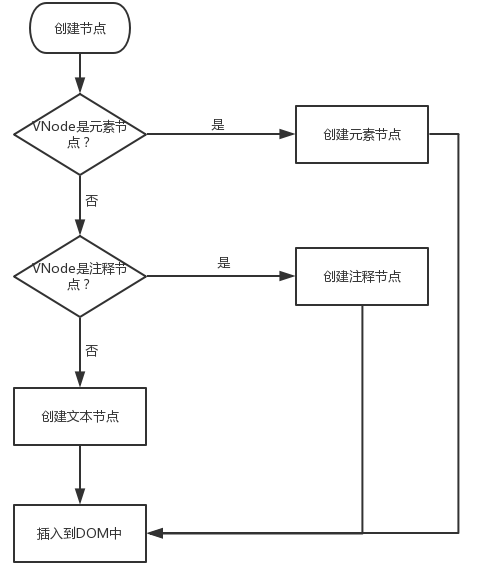

# 源码分析

[逐行剖析 Vue.js 源码 (nlrx-wjc.github.io)](https://nlrx-wjc.github.io/Learn-Vue-Source-Code/)


## 变化侦测

众所周知，Vue 的特点是 **数据双向绑定**，就是数据变动，页面自动刷新。


### Object 的变化侦测

JS 存在 `Object.defineProperty` 方法。


首先，我们定义一个数据对象`car`：

```javascript
let car = {
  'brand':'BMW',
  'price':3000
}
```

使用`Object.defineProperty()`改写上面的例子：

```javascript
let car = {}
let val = 3000

Object.defineProperty(car, 'price', {   //绑定 car 实例的 price 属性，get 和 set 方法监听
  enumerable: true,
  configurable: true,
  get(){
    console.log('price属性被读取了')
    return val
  },
  set(newVal){
    console.log('price属性被修改了')
    val = newVal
  }
})
```


将逻辑封装

<h4>Observer 类监听属性

~~~js
// 源码位置：src/core/observer/index.js

/**
 * Observer类会通过递归的方式把一个对象的所有属性都转化成可观测对象
 */
export class Observer {
  constructor (value) {
    this.value = value
    // 给value新增一个__ob__属性，值为该value的Observer实例
    // 相当于为value打上标记，表示它已经被转化成响应式了，避免重复操作
    def(value,'__ob__',this)
    if (Array.isArray(value)) {
      // 当value为数组时的逻辑
      // ...
    } else {
      this.walk(value)
    }
  }

  walk (obj: Object) {
    const keys = Object.keys(obj)
    for (let i = 0; i < keys.length; i++) {
      defineReactive(obj, keys[i])
    }
  }
}
/**
 * 使一个对象转化成可观测对象
 * @param { Object } obj 对象
 * @param { String } key 对象的key
 * @param { Any } val 对象的某个key的值
 */
function defineReactive (obj,key,val) {
  // 如果只传了obj和key，那么val = obj[key]
  if (arguments.length === 2) {
    val = obj[key]
  }
  if(typeof val === 'object'){
      new Observer(val)
  }
  Object.defineProperty(obj, key, {
    enumerable: true,
    configurable: true,
    get(){
      console.log(`${key}属性被读取了`);
      return val;
    },
    set(newVal){
      if(val === newVal){
          return
      }
      console.log(`${key}属性被修改了`);
      val = newVal;
    }
  })
}
~~~


重新定义`car`:

```javascript
let car = new Observer({
  'brand':'BMW',
  'price':3000
})
```

这样，`car`的两个属性都变得可观测了。


<h4>视图刷新

监听到了数据的变化，那么视图需要更新。

*谁用到了这个数据，那么当这个数据变化时就通知谁。*


对于每一个 **数据** 建立一个依赖数组，数组存放了所有用到这个数据的依赖。

依赖管理器 `Dep `类应运而生，把这个数据所有的依赖都管理起来。

~~~js
// 源码位置：src/core/observer/dep.js
export default class Dep {
  constructor () {
    this.subs = []
  }

  addSub (sub) {
    this.subs.push(sub)
  }
  // 删除一个依赖
  removeSub (sub) {
    remove(this.subs, sub)
  }
  // 添加一个依赖
  depend () {
    if (window.target) {
      this.addSub(window.target)
    }
  }
  // 通知所有依赖更新
  notify () {
    const subs = this.subs.slice()
    for (let i = 0, l = subs.length; i < l; i++) {
      subs[i].update()
    }
  }
}

/**
 * Remove an item from an array
 */
export function remove (arr, item) {
  if (arr.length) {
    const index = arr.indexOf(item)
    if (index > -1) {
      return arr.splice(index, 1)
    }
  }
}
~~~


有了依赖管理器后，在 `getter` 中收集依赖，在 `setter` 中通知依赖更新了，代码如下：

```javascript
function defineReactive (obj,key,val) {
  if (arguments.length === 2) {
    val = obj[key]
  }
  if(typeof val === 'object'){
    new Observer(val)
  }
  const dep = new Dep()  //实例化一个依赖管理器，生成一个依赖管理数组dep
  Object.defineProperty(obj, key, {
    enumerable: true,
    configurable: true,
    get(){
      dep.depend()    // 在getter中收集依赖
      return val;
    },
    set(newVal){
      if(val === newVal){
          return
      }
      val = newVal;
      dep.notify()   // 在setter中通知依赖更新
    }
  })
}
```


<h5>依赖类 watch

谁用到了数据，谁就是依赖，我们就为谁创建一个`Watcher`实例。

之后数据变化时，我们不直接去通知依赖更新，而是通知依赖对应的`Watch`实例，由`Watcher`实例去通知真正的视图。


`Watcher`类的具体实现如下：

```javascript
export default class Watcher {
  constructor (vm,expOrFn,cb) {
    this.vm = vm;
    this.cb = cb;
    this.getter = parsePath(expOrFn)
    this.value = this.get()
  }
  get () {
    window.target = this;
    const vm = this.vm
    let value = this.getter.call(vm, vm)
    window.target = undefined;
    return value
  }
  update () {
    const oldValue = this.value
    this.value = this.get()
    this.cb.call(this.vm, this.value, oldValue)
  }
}

/**
 * Parse simple path.
 * 把一个形如'data.a.b.c'的字符串路径所表示的值，从真实的data对象中取出来
 * 例如：
 * data = {a:{b:{c:2}}}
 * parsePath('a.b.c')(data)  // 2
 */
const bailRE = /[^\w.$]/
export function parsePath (path) {
  if (bailRE.test(path)) {
    return
  }
  const segments = path.split('.')
  return function (obj) {
    for (let i = 0; i < segments.length; i++) {
      if (!obj) return
      obj = obj[segments[i]]
    }
    return obj
  }
}
```

在创建`Watcher`实例的过程中会自动的把自己添加到这个数据对应的依赖管理器中


<h4>监听删除新增

通过 `Object.defineProperty `方法实现了对`object`数据的可观测，但是这个方法仅仅只能观测到`object`数据的取值及设置值，当我们向`object`数据里添加一对新的`key/value`或删除一对已有的`key/value`时，它是无法观测到的。导致当我们对`object`数据添加或删除值时，无法通知依赖，无法驱动视图进行响应式更新。


为了解决这一问题，`Vue`增加了两个全局API:`Vue.set`和`Vue.delete` （全局API）


### Array 的变化侦测

殊途同归，在视图使用到 araay 数据时加入到这个 array 的视图依赖中，并在修改时通知依赖更新。


**问题：**`Array` 无法使用`Object.defineProperty`


但是在 vue 中，定义数据绑定的语法是：

~~~vue
data(){
  return {
    arr:[1,2,3]
  }
}
~~~

`arr` 这个数据始终都存在于一个`object`数据对象（data）中

从`object`数据对象中获取`arr`数据自然就会触发`arr`的`getter`，所以我们就可以在`getter`中收集依赖。

总结一句话就是：**Array型数据还是在getter中收集依赖。**


<h4>变化通知

解决了 array 的依赖收集，那么如何通知依赖更新？


想要通知更新，那只有数组被修改了，那么把 **修改数组的方法重写** ，在不改变其原有功能的同时，增加额外的操作。

```javascript
let arr = [1,2,3]
arr.push(4)
Array.prototype.newPush = function(val){
  console.log('arr被修改了')
  this.push(val)
}
arr.newPush(4)
```


经过整理，`Array`原型中可以改变数组自身内容的方法有7个，分别是：`push`,`pop`,`shift`,`unshift`,`splice`,`sort`,`reverse`。那么源码中的拦截器代码如下：

```javascript
// 源码位置：/src/core/observer/array.js

const arrayProto = Array.prototype
// 创建一个对象作为拦截器
export const arrayMethods = Object.create(arrayProto)

// 改变数组自身内容的7个方法
const methodsToPatch = [
  'push',
  'pop',
  'shift',
  'unshift',
  'splice',
  'sort',
  'reverse'
]

/**
 * Intercept mutating methods and emit events
 */
methodsToPatch.forEach(function (method) {
  const original = arrayProto[method]      // 缓存原生方法
  Object.defineProperty(arrayMethods, method, {
    enumerable: false,
    configurable: true,
    writable: true,
    value:function mutator(...args){
      const result = original.apply(this, args)
      return result
    }
  })
})
```


<h4>深度侦测

前面讲的都是数组自身变化的侦测，比如给数组新增一个元素或删除数组中一个元素。

而在`Vue`中，不论是`Object`型数据还是`Array`型数据所实现的数据变化侦测都是深度侦测，所谓深度侦测就是不但要侦测数据自身的变化，还要侦测数据中所有子数据的变化。

```javascript
let arr = [
  {
    name:'NLRX'，
    age:'18'
  }
]
```

数组中包含了一个对象，如果该对象的某个属性发生了变化也应该被侦测到，这就是深度侦测。


## 虚拟 DOM

用一个`JS`对象来描述一个`DOM`节点

~~~js
<div class="a" id="b">我是内容</div>

{
  tag:'div',        // 元素标签
  attrs:{           // 属性
    class:'a',
    id:'b'
  },
  text:'我是内容',  // 文本内容
  children:[]       // 子元素
}
~~~

把这个`JS`对象就称为是这个真实`DOM`节点的虚拟`DOM`节点。


<h5>虚拟 Dom 的意义？

浏览器的标准就把 `DOM` 设计的非常复杂，所以一个真正的 `DOM` 元素是非常庞大的！！

用 `JS` 的计算性能来换取操作 `DOM` 所消耗的性能。


### VNode

虚拟`DOM`就是用`JS`来描述一个真实的`DOM`节点。

`Vue`中就存在了一个`VNode`类，通过这个类实例化出不同类型的虚拟`DOM`节点

```javascript
// 源码位置：src/core/vdom/vnode.js

export default class VNode {
  constructor (
    tag?: string,
    data?: VNodeData,
    children?: ?Array<VNode>,
    text?: string,
    elm?: Node,
    context?: Component,
    componentOptions?: VNodeComponentOptions,
    asyncFactory?: Function
  ) {
    this.tag = tag                                /*当前节点的标签名*/
    this.data = data        /*当前节点对应的对象，包含了具体的一些数据信息，是一个VNodeData类型，可以参考VNodeData类型中的数据信息*/
    this.children = children  /*当前节点的子节点，是一个数组*/
    this.text = text     /*当前节点的文本*/
    this.elm = elm       /*当前虚拟节点对应的真实dom节点*/
    this.ns = undefined            /*当前节点的名字空间*/
    this.context = context          /*当前组件节点对应的Vue实例*/
    this.fnContext = undefined       /*函数式组件对应的Vue实例*/
    this.fnOptions = undefined
    this.fnScopeId = undefined
    this.key = data && data.key           /*节点的key属性，被当作节点的标志，用以优化*/
    this.componentOptions = componentOptions   /*组件的option选项*/
    this.componentInstance = undefined       /*当前节点对应的组件的实例*/
    this.parent = undefined           /*当前节点的父节点*/
    this.raw = false         /*简而言之就是是否为原生HTML或只是普通文本，innerHTML的时候为true，textContent的时候为false*/
    this.isStatic = false         /*静态节点标志*/
    this.isRootInsert = true      /*是否作为跟节点插入*/
    this.isComment = false             /*是否为注释节点*/
    this.isCloned = false           /*是否为克隆节点*/
    this.isOnce = false                /*是否有v-once指令*/
    this.asyncFactory = asyncFactory
    this.asyncMeta = undefined
    this.isAsyncPlaceholder = false
  }

  get child (): Component | void {
    return this.componentInstance
  }
}
```

`VNode`类中包含了描述一个真实`DOM`节点所需要的一系列属性，通过属性之间不同的搭配，就可以描述出各种类型的真实`DOM`节点。


<h4>VNode 的类型

通过属性之间不同的搭配，`VNode`类可以描述出各种类型的真实`DOM`节点。那么它都可以描述出哪些类型的节点呢？

- 注释节点
- 文本节点
- 元素节点
- 组件节点
- 函数式组件节点
- 克隆节点


<h5>注释节点

注释节点描述起来相对就非常简单了，它只需两个属性就够了，源码如下：

```javascript
// 创建注释节点
export const createEmptyVNode = (text: string = '') => {
  const node = new VNode()
  node.text = text
  node.isComment = true
  return node
}
```

从上面代码中可以看到，描述一个注释节点只需两个属性，分别是：`text`和`isComment`。其中`text`属性表示具体的注释信息，`isComment`是一个标志，用来标识一个节点是否是注释节点。


<h5>文本节点

文本节点描述起来比注释节点更简单，因为它只需要一个属性，那就是`text`属性，用来表示具体的文本信息。源码如下：

```javascript
// 创建文本节点
export function createTextVNode (val: string | number) {
  return new VNode(undefined, undefined, undefined, String(val))
}
```


<h5>克隆节点

克隆节点就是把一个已经存在的节点复制一份出来，它主要是为了做模板编译优化时使用，这个后面我们会说到。关于克隆节点的描述，源码如下：

```javascript
// 创建克隆节点
export function cloneVNode (vnode: VNode): VNode {
  const cloned = new VNode(
    vnode.tag,
    vnode.data,
    vnode.children,
    vnode.text,
    vnode.elm,
    vnode.context,
    vnode.componentOptions,
    vnode.asyncFactory
  )
  cloned.ns = vnode.ns
  cloned.isStatic = vnode.isStatic
  cloned.key = vnode.key
  cloned.isComment = vnode.isComment
  cloned.fnContext = vnode.fnContext
  cloned.fnOptions = vnode.fnOptions
  cloned.fnScopeId = vnode.fnScopeId
  cloned.asyncMeta = vnode.asyncMeta
  cloned.isCloned = true
  return cloned
}
```

从上面代码中可以看到，克隆节点就是把已有节点的属性全部复制到新节点中，而现有节点和新克隆得到的节点之间唯一的不同就是克隆得到的节点`isCloned`为`true`。


<h5>元素节点

相比之下，元素节点更贴近于我们通常看到的真实`DOM`节点，它有描述节点标签名词的`tag`属性，描述节点属性如`class`、`attributes`等的`data`属性，有描述包含的子节点信息的`children`属性等。由于元素节点所包含的情况相比而言比较复杂，源码中没有像前三种节点一样直接写死（当然也不可能写死），那就举个简单例子说明一下：

```javascript
// 真实DOM节点
<div id='a'><span>难凉热血</span></div>

// VNode节点
{
  tag:'div',
  data:{},
  children:[
    {
      tag:'span',
      text:'难凉热血'
    }
  ]
}
```

我们可以看到，真实`DOM`节点中:`div`标签里面包含了一个`span`标签，而`span`标签里面有一段文本。反应到`VNode`节点上就如上所示:`tag`表示标签名，`data`表示标签的属性`id`等，`children`表示子节点数组。


<h5>组件节点

组件节点除了有元素节点具有的属性之外，它还有两个特有的属性：

- componentOptions :组件的option选项，如组件的`props`等
- componentInstance :当前组件节点对应的`Vue`实例


<h5>函数式组件节点

函数式组件节点相较于组件节点，它又有两个特有的属性：

- fnContext:函数式组件对应的Vue实例
- fnOptions: 组件的option选项


<h4>VNode 作用

视图渲染前，将 `Template` 模板先编译成 `VNode` 并且缓存，等到数据变化需要重新渲染时，将新生成的 `VNode` 与前一次缓存的 `VNode` 比对，找出差异的 `VNode`（`DOM-Diff`），然后对其更新。

这就是一次视图更新的过程。


**虚拟`DOM`**，说白了就是以`JS`的计算性能来换取操作真实`DOM`所消耗的性能。

最后探究了`VNode`的作用，有了数据变化前后的`VNode`，我们才能进行后续的`DOM-Diff`找出差异，最终做到只更新有差异的视图，从而达到尽可能少的操作真实`DOM`的目的，以节省性能。


### DOM-Diff

对比新旧两份`VNode`并找出差异的过程就是所谓的`DOM-Diff`过程。`DOM-Diff`算法是整个虚拟`DOM`的核心所在。


<h4>1）pacth

把 `DOM-Diff`过程叫做`patch`过程。

patch,意为“补丁”，即指对旧的`VNode`修补，打补丁从而得到新的`VNode`，非常形象哈。


**以新的VNode为基准，改造旧的oldVNode使之成为跟新的VNode一样，这就是patch过程要干的事**。

> 并不是删除旧的 `VNode`，而是要改造。


<h4>2）生成新节点

`VNode`类可以描述6种类型的节点，而实际上只有3种类型的节点能够被创建并插入到`DOM`中

它们分别是：

- 元素节点
- 文本节点
- 注释节点


所以`Vue`在创建节点的时候会判断在新的`VNode`中有而旧的`oldVNode`中没有的这个节点是属于哪种类型的节点，从而调用不同的方法创建并插入到`DOM`中。

```javascript
// 源码位置: /src/core/vdom/patch.js
function createElm (vnode, parentElm, refElm) {
    const data = vnode.data
    const children = vnode.children
    const tag = vnode.tag
    if (isDef(tag)) {
      vnode.elm = nodeOps.createElement(tag, vnode)   // 创建元素节点
      createChildren(vnode, children, insertedVnodeQueue) // 创建元素节点的子节点
      insert(parentElm, vnode.elm, refElm)       // 插入到DOM中
    } else if (isTrue(vnode.isComment)) {
      vnode.elm = nodeOps.createComment(vnode.text)  // 创建注释节点
      insert(parentElm, vnode.elm, refElm)           // 插入到DOM中
    } else {
      vnode.elm = nodeOps.createTextNode(vnode.text)  // 创建文本节点
      insert(parentElm, vnode.elm, refElm)           // 插入到DOM中
    }
  }
```

> 代码中的`nodeOps`是`Vue`为了跨平台兼容性，对所有节点操作进行了封装，例如`nodeOps.createTextNode()`在浏览器端等同于`document.createTextNode()`




<h4>3）删除节点

某些节点再新的`VNode`中没有而在旧的`oldVNode`中有，那么就需要把这些节点从旧的`oldVNode`中删除。

删除节点非常简单，只需在要删除节点的父元素上调用`removeChild`方法即可。源码如下：

```javascript
function removeNode (el) {
  const parent = nodeOps.parentNode(el)  // 获取父节点
  if (isDef(parent)) {
    nodeOps.removeChild(parent, el)  // 调用父节点的removeChild方法
  }
}
```


<h4>4）更新节点

更新节点就是当某些节点在新的`VNode`和旧的`oldVNode`中都有时，我们就需要细致比较一下，找出不一样的地方进行更新。


**静态节点**

```html
<p>我是不会变化的文字</p>
```

上面这个节点里面只包含了纯文字，没有任何可变的变量，这也就是说，不管数据再怎么变化，只要这个节点第一次渲染了，那么它以后就永远不会发生变化，这是因为它不包含任何变量，所以数据发生任何变化都与它无关。我们把这种节点称之为静态节点。


```javascript
// 更新节点
function patchVnode (oldVnode, vnode, insertedVnodeQueue, removeOnly) {
  // vnode与oldVnode是否完全一样？若是，退出程序
  if (oldVnode === vnode) {
    return
  }
  const elm = vnode.elm = oldVnode.elm

  // vnode与oldVnode是否都是静态节点？若是，退出程序
  if (isTrue(vnode.isStatic) &&
    isTrue(oldVnode.isStatic) &&
    vnode.key === oldVnode.key &&
    (isTrue(vnode.isCloned) || isTrue(vnode.isOnce))
  ) {
    return
  }

  const oldCh = oldVnode.children
  const ch = vnode.children
  // vnode有text属性？若没有：
  if (isUndef(vnode.text)) {
    // vnode的子节点与oldVnode的子节点是否都存在？
    if (isDef(oldCh) && isDef(ch)) {
      // 若都存在，判断子节点是否相同，不同则更新子节点
      if (oldCh !== ch) updateChildren(elm, oldCh, ch, insertedVnodeQueue, removeOnly)
    }
    // 若只有vnode的子节点存在
    else if (isDef(ch)) {
      /**
       * 判断oldVnode是否有文本？
       * 若没有，则把vnode的子节点添加到真实DOM中
       * 若有，则清空Dom中的文本，再把vnode的子节点添加到真实DOM中
       */
      if (isDef(oldVnode.text)) nodeOps.setTextContent(elm, '')
      addVnodes(elm, null, ch, 0, ch.length - 1, insertedVnodeQueue)
    }
    // 若只有oldnode的子节点存在
    else if (isDef(oldCh)) {
      // 清空DOM中的子节点
      removeVnodes(elm, oldCh, 0, oldCh.length - 1)
    }
    // 若vnode和oldnode都没有子节点，但是oldnode中有文本
    else if (isDef(oldVnode.text)) {
      // 清空oldnode文本
      nodeOps.setTextContent(elm, '')
    }
    // 上面两个判断一句话概括就是，如果vnode中既没有text，也没有子节点，那么对应的oldnode中有什么就清空什么
  }
  // 若有，vnode的text属性与oldVnode的text属性是否相同？
  else if (oldVnode.text !== vnode.text) {
    // 若不相同：则用vnode的text替换真实DOM的文本
    nodeOps.setTextContent(elm, vnode.text)
  }
}
```


## 模板编译

把用户写的模板进行编译，就会产生`VNode`。


vue 把写在`<template></template>`标签中的**类似于**原生`HTML`的内容称之为模板。

为什么说是“类似于原生`HTML`的内容”而不是“就是`HTML`的内容”？

**答：**在`<template></template>`标签中除了写一些原生`HTML`的标签，还会写一些变量插值，如，或者写一些`Vue`指令，如`v-on`、`v-if`等。而这些东西都是在原生`HTML`语法中不存在的。


归功于`Vue`的模板编译，`Vue`会把用户在`<template></template>`标签中写的类似于原生`HTML`的内容进行编译，把原生`HTML`的内容找出来，再把非原生`HTML`找出来，经过一系列的逻辑处理生成渲染函数，也就是`render`函数，而`render`函数会将模板内容生成对应的`VNode`，也就是`render`函数的这一段过程称之为模板编译过程。


### `Render()` 函数生成

模板编译内部是怎么把用户写的模板经过处理最终生成`render`函数的呢？


在`<template></template>`标签中写的模板对`Vue`来说就是一堆字符串，那么如何解析这一堆字符串并且从中提取出元素的标签、属性、变量插值等有效信息呢？

这就需要借助一个叫做**抽象语法树**的东西。


一个简单的`HTML`标签的代码被转换成了一个`JS`对象，而这个对象中的属性代表了这个标签中一些关键有效信息。

[在线转换](https://astexplorer.net/)


## 生命周期


大致可分为4个阶段：

- 初始化阶段：为`Vue`实例上初始化一些属性，事件以及响应式数据；
- 模板编译阶段：将模板编译成渲染函数；
- 挂载阶段：将实例挂载到指定的`DOM`上，即将模板渲染到真实`DOM`中；
- 销毁阶段：将实例自身从父组件中删除，并取消依赖追踪及事件监听器；


### 初始化阶段 `new Vue()`

`new` 关键字在 `JS`中表示从一个类中实例化出一个对象来，由此可见， `Vue` 实际上是一个类。

```javascript
// src/core/instance/index.js

function Vue (options) {
  if (process.env.NODE_ENV !== 'production' &&
    !(this instanceof Vue)
  ) {
    warn('Vue is a constructor and should be called with the `new` keyword')
  }
  this._init(options)
}
```

调用原型上的`_init(options)`方法并把用户所写的选项`options`传入。


在`Vue`类定义的下面还有几行代码，其中之一就是：

```javascript
initMixin(Vue)
```

该函数定义位于源码的`src/core/instance/init.js` 中，如下：

```javascript
export function initMixin (Vue) {
  Vue.prototype._init = function (options) {
    const vm = this
    vm.$options = mergeOptions(
        resolveConstructorOptions(vm.constructor),
        options || {},
        vm
    )
    vm._self = vm
    initLifecycle(vm)
    initEvents(vm)
    initRender(vm)
    callHook(vm, 'beforeCreate')
    initInjections(vm) // resolve injections before data/props
    initState(vm)
    initProvide(vm) // resolve provide after data/props
    callHook(vm, 'created')

    if (vm.$options.el) {
      vm.$mount(vm.$options.el)
    }
  }
}
```

可以看到，在`initMixin`函数内部就只干了一件事，那就是给`Vue`类的原型上绑定`_init`方法，同时`_init`方法的定义也在该函数内部。


**所以：**`new Vue()`会执行`Vue`类的构造函数，构造函数内部会执行`_init`方法，所以`new Vue()`所干的事情其实就是`_init`方法所干的事情。


`_init`方法都干了哪些事情？

1）把`Vue`实例赋值给变量`vm`

~~~js
const vm = this
~~~


2）把用户传递的`options`选项与当前构造函数的`options`属性及其父级构造函数的`options`属性进行合并

~~~js
vm.$options = mergeOptions(
    resolveConstructorOptions(vm.constructor),
    options || {},
    vm
)
~~~

得到一个新的`options`选项赋值给`$options`属性，并将`$options`属性挂载到`Vue`实例上


3）调用一些初始化函数来为`Vue`实例初始化一些属性，事件，响应式数据等

~~~java
initLifecycle(vm)       // 初始化生命周期
initEvents(vm)        // 初始化事件
initRender(vm)         // 初始化渲染
callHook(vm, 'beforeCreate')  // 调用生命周期钩子函数
initInjections(vm)   //初始化injections
initState(vm)    // 初始化props,methods,data,computed,watch
initProvide(vm) // 初始化 provide
callHook(vm, 'created')  // 调用生命周期钩子函数
~~~

除了调用初始化函数来进行相关数据的初始化之外，还在合适的时机调用了`callHook`函数来触发生命周期的钩子


4）判断用户是否传入了`el`选项，如果传入了则调用`$mount`函数进入模板编译与挂载阶段，如果没有传入`el`选项，则不进入下一个生命周期阶段，需要用户手动执行`vm.$mount`方法才进入下一个生命周期阶段。

~~~js
if (vm.$options.el) {
    vm.$mount(vm.$options.el)
}
~~~


<h4>属性合并


<h4>触发钩子函数

`src/core/instance/lifecycle.js` 

```javascript
export function callHook (vm: Component, hook: string) {
  const handlers = vm.$options[hook]
  if (handlers) {
    for (let i = 0, j = handlers.length; i < j; i++) {
      try {
        handlers[i].call(vm)
      } catch (e) {
        handleError(e, vm, `${hook} hook`)
      }
    }
  }
}
```

从实例的`$options`中获取到需要触发的钩子名称所对应的钩子函数数组`handlers`。

每个生命周期钩子名称都对应了一个钩子函数数组。然后遍历该数组，将数组中的每个钩子函数都执行一遍。


### 模板编译阶段

初始化阶段各项工作做完之后调用了`vm.$mount`方法，该方法的调用标志着初始化阶段的结束和进入下一个阶段。

该阶段所做的主要工作是获取到用户传入的模板内容并将其编译成渲染函数。


`vue`基于源码构建的有两个版本，一个是`runtime only`(一个只包含运行时的版本)，另一个是`runtime + compiler`(一个同时包含编译器和运行时的完整版本)。而两个版本的区别仅在于后者包含了一个编译器。

在只包含运行时版本（即`vue.runtime.js`）中并不存在该阶段，这是因为当使用`vue-loader`或`vueify`时，`*.vue`文件内部的模板会在构建时预编译成渲染函数，所以是不需要编译的，从而不存在模板编译阶段，由上一步的初始化阶段直接进入下一阶段的挂载阶段。

很明显，编译过程对性能会造成一定的损耗，并且由于加入了编译的流程代码，`Vue`代码的总体积也更加庞大(运行时版本相比完整版体积要小大约 30%)。因此在实际开发中，我们需要借助像`webpack`的`vue-loader`这类工具进行编译，将`Vue`对模板的编译阶段合并到`webpack`的构建流程中，这样不仅减少了生产环境代码的体积，也大大提高了运行时的性能，一举两得。


它们的区别在于在`$mount`方法中是否进行了模板编译。

在只包含运行时版本的`$mount`方法中获取到`DOM`元素后直接进入挂载阶段，而在完整版本的`$mount`方法中是先将模板进行编译，然后回过头调只包含运行时版本的`$mount`方法进入挂载阶段。


### 挂载阶段

挂载阶段所做的主要工作是创建`Vue`实例并用其替换`el`选项对应的`DOM`元素，同时还要开启对模板中数据（状态）的监控，当数据（状态）发生变化时通知其依赖进行视图更新。


在完整版本的`$mount`方法中将模板编译完成之后，会回过头去调只包含运行时版本的`$mount`方法进入挂载阶段，所以要想分析挂载阶段我们必须从只包含运行时版本的`$mount`方法入手。


只包含运行时版本的`$mount`代码如下：

```javascript
Vue.prototype.$mount = function (el,hydrating) {
  el = el && inBrowser ? query(el) : undefined;
  return mountComponent(this, el, hydrating)
};
```

可以看到，在该函数内部首先获取到`el`选项对应的`DOM`元素，然后调用`mountComponent`函数并将`el`选项对应的`DOM`元素传入，进入挂载阶段。那么，下面我们来看下`mountComponent`函数内部都干了些什么。

`mountComponent`函数的定义位于源码的`src/core/instance/lifecycle.js`中，如下：

```javascript
export function mountComponent (vm,el,hydrating) {
    vm.$el = el
    if (!vm.$options.render) {
        vm.$options.render = createEmptyVNode
    }
    callHook(vm, 'beforeMount')

    let updateComponent

    updateComponent = () => {
        vm._update(vm._render(), hydrating)
    }
    new Watcher(vm, updateComponent, noop, {
        before () {
            if (vm._isMounted) {
                callHook(vm, 'beforeUpdate')
            }
        }
    }, true /* isRenderWatcher */)
    hydrating = false

    if (vm.$vnode == null) {
        vm._isMounted = true
        callHook(vm, 'mounted')
    }
    return vm
}
```

可以看到，在该函数中，首先会判断实例上是否存在渲染函数，如果不存在，则设置一个默认的渲染函数`createEmptyVNode`，该渲染函数会创建一个注释类型的`VNode`节点。如下：

```javascript
vm.$el = el
if (!vm.$options.render) {
    vm.$options.render = createEmptyVNode
}
```

然后调用`callHook`函数来触发`beforeMount`生命周期钩子函数，如下：

```javascript
callHook(vm, 'beforeMount')
```

该钩子函数触发后标志着正式开始执行挂载操作。


接下来定义了一个`updateComponent`函数，如下：

```javascript
updateComponent = () => {
    vm._update(vm._render(), hydrating)
}
```

在该函数内部，首先执行渲染函数`vm._render()`得到一份最新的`VNode`节点树，然后执行`vm._update()`方法对最新的`VNode`节点树与上一次渲染的旧`VNode`节点树进行对比并更新`DOM`节点(即`patch`操作)，完成一次渲染。

也就是说，如果调用了`updateComponent`函数，就会将最新的模板内容渲染到视图页面中，这样就完成了挂载操作的一半工作，即图中的上半部分：


为什么说是完成了一半操作呢？这是因为在挂载阶段不但要将模板渲染到视图中，同时还要开启对模板中数据（状态）的监控，当数据（状态）发生变化时通知其依赖进行视图更新。即图中的下半部分：


继续往下看，接下来创建了一个`Watcher`实例，并将定义好的`updateComponent`函数传入。要想开启对模板中数据（状态）的监控，这一段代码是关键，如下：

```javascript
new Watcher(
    vm,                    // 第一个参数
    updateComponent,       // 第二个参数
    noop,                  // 第三个参数
    {                      // 第四个参数
        before () {
          if (vm._isMounted) {
            callHook(vm, 'beforeUpdate')
          }
        }
	},
    true                    // 第五个参数
)
```

可以看到，在创建`Watcher`实例的时候，传入的第二个参数是`updateComponent`函数。


回顾一下我们在数据侦测篇文章中介绍`Watcher`类的时候，`Watcher`类构造函数的第二个参数支持两种类型：函数和数据路径（如`a.b.c`）。如果是数据路径，会根据路径去读取这个数据；如果是函数，会执行这个函数。

一旦读取了数据或者执行了函数，就会触发数据或者函数内数据的`getter`方法，而在`getter`方法中会将`watcher`实例添加到该数据的依赖列表中，当该数据发生变化时就会通知依赖列表中所有的依赖，依赖接收到通知后就会调用第四个参数回调函数去更新视图。

换句话说，上面代码中把`updateComponent`函数作为第二个参数传给`Watcher`类从而创建了`watcher`实例，那么`updateComponent`函数中读取的所有数据都将被`watcher`所监控，这些数据中只要有任何一个发生了变化，那么`watcher`都将会得到通知，从而会去调用第四个参数回调函数去更新视图，如此反复，直到实例被销毁。

这样就完成了挂载阶段的另一半工作。


### 销毁阶段


## 实例方法


### 数据相关方法

与数据相关的实例方法有 3 个，分别是：

- `vm.$set`
- `vm.$delete`
- `vm.$watch`

它们是在`stateMixin`函数中挂载到`Vue`原型上的，代码如下：

```javascript
import { set, del } from "../observer/index";

export function stateMixin(Vue) {
  Vue.prototype.$set = set;
  Vue.prototype.$delete = del;
  Vue.prototype.$watch = function(expOrFn, cb, options) {};
}
```


### 事件相关方法

与事件相关的实例方法有4个，分别是

- `vm.$on` 
- `vm.$emit`
- `vm.$off` 
- `vm.$once`

它们是在`eventsMixin`函数中挂载到`Vue`原型上的，代码如下：

```javascript
export function eventsMixin (Vue) {
    Vue.prototype.$on = function (event, fn) {}
    Vue.prototype.$once = function (event, fn) {}
    Vue.prototype.$off = function (event, fn) {}
    Vue.prototype.$emit = function (event) {}
}
```


# 打包工具

## npm


## [yarn](https://www.yarnpkg.cn/)


# 项目创建

## vue3

~~~shell
# 卸载2.x版本 
npm uninstall vue-cli -g
# 卸载3.x版本 
npm uninstall @vue/cli -g

# 安装命令
npm install -g @vue/cli
# 或者
yarn global add @vue/cli

# 升级全局的 Vue CLI 包
npm update -g @vue/cli
# 或者
yarn global upgrade --latest @vue/cli
~~~

~~~shell
# 创建项目
vue create <project name>
~~~


以图形化界面创建和管理项目

```shell
vue ui
```

[官方文档](https://cli.vuejs.org/zh/)


# Vue3 + TypeScript


# 基本语法


## v-for

 `v-for` 块中可以完整地访问父作用域内的属性和变量。


`v-for` 变量的作用域和下面的 JavaScript 代码很类似：

```js
const parentMessage = 'Parent'
const items = [
  /* ... */
]

items.forEach((item, index) => {
  // 可以访问外层的 `parentMessage`
  // 而 `item` 和 `index` 只在这个作用域可用
  console.log(parentMessage, item.message, index)
})
```


可以在定义 `v-for` 的变量别名时使用解构，和解构函数参数类似：

~~~html
<li v-for="{ message } in items">
  {{ message }}
</li>

<!-- 有 index 索引时 -->
<li v-for="({ message }, index) in items">
  {{ message }} {{ index }}
</li>
~~~


对于多层嵌套的 `v-for`，作用域的工作方式和函数的作用域很类似。每个 `v-for` 作用域都可以访问到父级作用域：

```html
<li v-for="item in items">
  <span v-for="childItem in item.children">
    {{ item.message }} {{ childItem }}
  </span>
</li>
```


你也可以使用 `of` 作为分隔符来替代 `in`，这更接近 JavaScript 的迭代器语法：

```html
<div v-for="item of items"></div>
```


1. **与 *Array [数组]***

   ~~~vue
   <li v-for="(item, index) in items">
     {{ index }} - {{ item.message }}
   </li>
   ~~~

   语法大致是 *(item, index) in items*，括号（）里的参数有两个：

   1. 第一个参数是数组的每一项元素
   2. 第二个对应元素的索引

   而 *items* 表示源数组。

   所有这些参数名称都可以修改，位置决定值。

   

2. 与 ***Object[对象]***

   遍历的顺序会基于对该对象调用 `Object.keys()` 的返回值来决定。

   ~~~html
   <li v-for="(value, key, index) in myObject">
     {{ index }}. {{ key }}: {{ value }}
   </li>
   ~~~

   三个参数：

   1. *value* 对象属性的值
   2. *key* 属性名称
   3. *index* 位置索引

   

3. ***范围值***

   ~~~html
   <span v-for="n in 10">{{ n }}</span>
   ~~~

   接受一个整数值。

   此处 `n` 的初值是从 `1` 开始而非 `0`。

   

4. 与 ***`<Template>`***

   用处是 ***渲染多个 html 标签***

   ~~~html
   <ul>
     <template v-for="item in items">
       <li>{{ item.msg }}</li>
       <li class="divider" role="presentation"></li>
     </template>
   </ul>
   ~~~

   

5. 与 **`v-if`**

   同时使用 `v-if` 和 `v-for` 是**不推荐的**。

   

   当它们同时存在于一个节点上时，`v-if` 比 `v-for` 的优先级更高。

   这意味着 `v-if` 的条件将无法访问到 `v-for` 作用域内定义的变量别名：

   ~~~html
   <!--
    这会抛出一个错误，因为属性 todo 此时
    没有在该实例上定义
   -->
   <li v-for="todo in todos" v-if="!todo.isComplete">
     {{ todo.name }}
   </li>
   ~~~

   在外新包装一层 `<template>` 再在其上使用 `v-for` 可以解决这个问题

   ```html
   <template v-for="todo in todos">
     <li v-if="!todo.isComplete">
       {{ todo.name }}
     </li>
   </template>
   ```


### v-for 渲染数据的更新

***“就地更新”***，当数据项的顺序改变时，Vue 不会随之移动 DOM 元素的顺序，而是就地更新每个元素，确保它们在原本指定的索引位置上渲染。

> 默认模式是高效的，但**只适用于列表渲染输出的结果不依赖子组件状态或者临时 DOM 状态 (例如表单输入值) 的情况**。


***去除“就地更新”***

为每个元素对应的块提供一个唯一的 `key` attribute，以便它可以跟踪每个节点的标识，从而重用和重新排序现有的元素。

~~~html
<div v-for="item in items" :key="item.id">
  <!-- 内容 -->
</div>
~~~

当你使用 `<template v-for>` 时，`key` 应该被放置在这个 `<template>` 容器上：

```html
<template v-for="todo in todos" :key="todo.name">
  <li>{{ todo.name }}</li>
</template>
```

> ***注意：***
>
> `key` 在这里是一个通过 `v-bind` 绑定的特殊 attribute。请不要和[在 `v-for` 中使用对象](https://cn.vuejs.org/guide/essentials/list.html#v-for-with-an-object)里所提到的对象属性名相混淆。


在任何可行的时候为 `v-for` 提供一个 `key` attribute，除非所迭代的 DOM 内容非常简单 (例如：不包含组件或有状态的 DOM 元素)，或者你想有意采用默认行为来提高性能。

`key` 绑定的值期望是一个基础类型的值，例如字符串或 number 类型。不要用对象作为 `v-for` 的 key。


### v-for 赋值 html 标签的 attr

~~~html
<script setup>
import { ref } from 'vue'
import TodoItem from './TodoItem.vue'
  
const newTodoText = ref('')
const todos = ref([
  {
    id: 1,
    title: 'Do the dishes'
  },
  {
    id: 2,
    title: 'Take out the trash'
  },
  {
    id: 3,
    title: 'Mow the lawn'
  }
])

let nextTodoId = 4

function addNewTodo() {
  todos.value.push({
    id: nextTodoId++,
    title: newTodoText.value
  })
  newTodoText.value = ''
}
</script>

<template>
	<form v-on:submit.prevent="addNewTodo">
    <label for="new-todo">Add a todo</label>
    <input
      v-model="newTodoText"
      id="new-todo"
      placeholder="E.g. Feed the cat"
    />
    <button>Add</button>
  </form>
  <ul>
    <todo-item
      v-for="(todo, index) in todos"
      :key="todo.id"
      :title="todo.title"
      @remove="todos.splice(index, 1)"
    ></todo-item>
  </ul>
</template>
~~~


# 组件


## 注册

~~~html
<script>
    export default {
		name: 'HomeView'
	}
</script>
~~~

直接用

~~~html
<script setup>

</script>
~~~


## 自定义组件


### *props*

一个组件需要显式声明它所接受的 props，这样 Vue 才能知道外部传入的哪些是 props，哪些是透传 attribute

~~~html
<script setup>
const props = defineProps(['foo'])
</script>
~~~


除了使用字符串数组来声明 prop 外，还可以使用对象的形式：

```html
<script setup>
defineProps({
  title: String,
  likes: Number
})
```

对于以对象形式声明中的每个属性，key 是 prop 的名称，而值则是该 prop 预期类型的构造函数。

> 对象形式的 props 声明不仅可以一定程度上作为组件的文档，而且如果其他开发者在使用你的组件时传递了错误的类型，也会在浏览器控制台中抛出警告。
>
>  [prop 校验](https://cn.vuejs.org/guide/components/props.html#prop-validation)


TypeScript 使用 `<script setup>`

~~~html
<script setup lang="ts">
defineProps<{
  title?: string
  likes?: number
}>()
</script>
~~~


#### prop 的名称

名字很长，应使用 camelCase 形式

~~~js
defineProps({
  greetingMessage: String
})
~~~


但实际上为了和 HTML attribute 对齐，我们通常会将其写为 kebab-case 形式：

~~~html
<MyComponent greeting-message="hello" />
~~~


#### 静态 vs. 动态 Prop

静态值形式的 props

```html
<BlogPost title="My journey with Vue" />
```


相应地，还有使用 `v-bind` 或缩写 `:` 来进行动态绑定的 props：

```html
<!-- 根据一个变量的值动态传入 -->
<BlogPost :title="post.title" />

<!-- 根据一个更复杂表达式的值动态传入 -->
<BlogPost :title="post.title + ' by ' + post.author.name" />
```


#### 不同的值类型

**任何**类型的值都可以作为 props 的值被传递。


***Number***

```html
<!-- 虽然 `42` 是个常量，我们还是需要使用 v-bind -->
<!-- 因为这是一个 JavaScript 表达式而不是一个字符串 -->
<BlogPost :likes="42" />

<!-- 根据一个变量的值动态传入 -->
<BlogPost :likes="post.likes" />
```


***Boolean***

```html
<!-- 仅写上 prop 但不传值，会隐式转换为 `true` -->
<BlogPost is-published />

<!-- 虽然 `false` 是静态的值，我们还是需要使用 v-bind -->
<!-- 因为这是一个 JavaScript 表达式而不是一个字符串 -->
<BlogPost :is-published="false" />

<!-- 根据一个变量的值动态传入 -->
<BlogPost :is-published="post.isPublished" />
```


***Array***

```html
<!-- 虽然这个数组是个常量，我们还是需要使用 v-bind -->
<!-- 因为这是一个 JavaScript 表达式而不是一个字符串 -->
<BlogPost :comment-ids="[234, 266, 273]" />

<!-- 根据一个变量的值动态传入 -->
<BlogPost :comment-ids="post.commentIds" />
```


***Object***

```html
<!-- 虽然这个对象字面量是个常量，我们还是需要使用 v-bind -->
<!-- 因为这是一个 JavaScript 表达式而不是一个字符串 -->
<BlogPost
  :author="{
    name: 'Veronica',
    company: 'Veridian Dynamics'
  }"
 />

<!-- 根据一个变量的值动态传入 -->
<BlogPost :author="post.author" />
```


***总结：赋值 prop 都需要使用 `：` 进行动态绑定***


#### 一个 Object 绑定多个 prop

使用[没有参数的 `v-bind`](https://cn.vuejs.org/guide/essentials/template-syntax.html#dynamically-binding-multiple-attributes)，即只使用 `v-bind` 而非 `:prop-name`

```js
const post = {
  id: 1,
  title: 'My Journey with Vue'
}
```

```html
<BlogPost v-bind="post" />
```


而这实际上等价于：

```html
<BlogPost :id="post.id" :title="post.title" />
```


#### 单向绑定

所有的 props 都遵循着**单向绑定**原则，props 因父组件的更新而变化，自然地将新的状态向下流往子组件，而不会逆向传递。

这避免了子组件意外修改父组件的状态的情况，不然应用的数据流将很容易变得混乱而难以理解。

另外，每次父组件更新后，所有的子组件中的 props 都会被更新到最新值，***这意味着你不应该在子组件中去更改一个 prop***。


若你这么做了，Vue 会在控制台上向你抛出警告：

```js
const props = defineProps(['foo'])

// ❌ 警告！prop 是只读的！
props.foo = 'bar'
```


导致你想要更改一个 prop 的需求通常来源于以下两种场景：

1. **prop 被用于传入初始值；而子组件想在之后将其作为一个局部数据属性**。在这种情况下，最好是新定义一个局部数据属性，从 props 上获取初始值即可：

   ```jsx
   const props = defineProps(['initialCounter'])
   
   // 计数器只是将 props.initialCounter 作为初始值
   // 像下面这样做就使 prop 和后续更新无关了
   const counter = ref(props.initialCounter)
   ```

2. **需要对传入的 prop 值做进一步的转换**。在这种情况中，最好是基于该 prop 值定义一个计算属性：

   ```js
   const props = defineProps(['size'])
   
   // 该 prop 变更时计算属性也会自动更新
   const normalizedSize = computed(() => props.size.trim().toLowerCase())
   ```


***对象 / 数组类型的 props 的修改***

当对象或数组作为 props 被传入时，虽然子组件无法更改 props 绑定，但仍然**可以**更改对象或数组内部的值。

> ***引用传递***
>
> 在最佳实践中，你应该尽可能避免这样的更改。


#### Prop 校验

~~~js
defineProps({
  // 基础类型检查
  // （给出 `null` 和 `undefined` 值则会跳过任何类型检查）
  propA: Number,
    
  // 多种可能的类型
  propB: [String, Number],
    
  // 必传，且为 String 类型
  propC: {
    type: String,
    required: true
  },
    
  // Number 类型的默认值
  propD: {
    type: Number,
    default: 100
  },
    
  // 对象类型的默认值
  propE: {
    type: Object,
    // 对象或数组的默认值
    // 必须从一个工厂函数返回。
    // 该函数接收组件所接收到的原始 prop 作为参数。
    default(rawProps) {
      return { message: 'hello' }
    }
  },
    
  // 自定义类型校验函数
  propF: {
    validator(value) {
      // The value must match one of these strings
      return ['success', 'warning', 'danger'].includes(value)
    }
  },
    
  // 函数类型的默认值
  propG: {
    type: Function,
    // 不像对象或数组的默认，这不是一个工厂函数。这会是一个用来作为默认值的函数
    default() {
      return 'Default function'
    }
  }
})
~~~

> ***TIP***
>
> `defineProps()` 宏中的参数**不可以访问 `<script setup>` 中定义的其他变量**，因为在编译时整个表达式都会被移到外部的函数中。


一些补充细节：

- 所有 prop 默认都是可选的，除非声明了 `required: true`。
- 除 `Boolean` 外的未传递的可选 prop 将会有一个默认值 `undefined`。
- `Boolean` 类型的未传递 prop 将被转换为 `false`。这可以通过为它设置 `default` 来更改——例如：设置为 `default: undefined` 将与非布尔类型的 prop 的行为保持一致。
- 如果声明了 `default` 值，那么在 prop 的值被解析为 `undefined` 时，无论 prop 是未被传递还是显式指明的 `undefined`，都会改为 `default` 值。

当 prop 的校验失败后，Vue 会抛出一个控制台警告 (在开发模式下)。


校验选项中的 `type` 可以是下列这些原生构造函数：

- `String`
- `Number`
- `Boolean`
- `Array`
- `Object`
- `Date`
- `Function`
- `Symbol`

另外，`type` 也可以是自定义的类或构造函数，Vue 将会通过 `instanceof` 来检查类型是否匹配。

```js
class Person {
  constructor(firstName, lastName) {
    this.firstName = firstName
    this.lastName = lastName
  }
}
```

```js
defineProps({
  author: Person
})
```


### 事件


#### html 标签自定义事件


模板中自定义事件

~~~html
<!-- MyComponent -->
<button @click="$emit('someEvent')">click me</button>
~~~

1. **`$emit()`**  执行事件，需要传入***事件名称***作为参数，多的参数会作为自定义事件的额外参数，自带带过去
2. **`v-on`** 监听事件


使用定义好的组件

~~~html
<MyComponent @some-event="callback" />
~~~

1. ***someEvent*** 是事件定义时的名称，小驼峰命名法
2. ***some-event*** 是监听事件时的名称，横线命名法
3. **`v-on`** （@）监听事件


同样，组件的事件监听器也支持 `.once` 修饰符：

```html
<MyComponent @some-event.once="callback" />
```

> ***TIP***
>
> 和原生 DOM 事件不一样，组件触发的事件**没有冒泡机制**。


#### 事件参数

有时候我们会需要在触发事件时附带一个特定的值。

在这个场景下，我们可以给 `$emit` 提供一个额外的参数：

```html
<button @click="$emit('increaseBy', 1)">
  Increase by 1
</button>
```


然后我们在父组件中监听事件，我们可以先简单写一个内联的箭头函数作为监听器，此函数会接收到事件附带的参数：

```html
<MyButton @increase-by="(n) => count += n" />
```


或者，也可以用一个组件方法来作为事件处理函数：

```html
<MyButton @increase-by="increaseCount" />
```

该方法也会接收到事件所传递的参数：

```js
function increaseCount(n) {
  count.value += n
}
```

> ***TIP***
>
> 所有传入 `$emit()` 的额外参数都会被直接传向监听器。举例来说，`$emit('foo', 1, 2, 3)` 触发后，监听器函数将会收到这三个参数值。


#### .vue 文件定义事件

通过 `defineEmits()` 宏来声明它要触发的事件：

~~~html
<script setup>
defineEmits(['inFocus', 'submit'])
</script>
~~~

在 `<template>` 中使用的 `$emit` 方法不能在组件的 `<script setup>` 部分中使用，但 `defineEmits()` 会返回一个相同作用的函数供我们使用：


# vue-axios

两个依赖：

1. axios
2. vue-axios


~~~js
import axios from 'axios'
import VueAxios from 'vue-axios'

createApp(App).use(VueAxios,axios);
~~~

~~~js
axios.get('api/getNewsList')
.then((response)=>{
    console.log(response)
})
~~~


# vuex

集中式管理所有组件的状态 ***state***。

状态 *state* 是由参数定义的，管理所有组件，那么它定义的参数也就是***全局***的。


1. *定义*

   ~~~js
   import { createStore } from 'vuex'
   
   export const store = createStore({
     state () {
       return {
         count: 1,   //参数1
         isLoading: true  //参数2
       }
     }
   })
   ~~~

   

2. 将 Vuex 安装到 Vue 实例中

   ~~~js
   import { store } from './store'
   
   createApp(App).use(store)
   ~~~

   

3. 搭配 ***计算属性computed*** 响应式使用

   ~~~js
   const loading = computed(() =>
     store.state.isLoading
   )
   ~~~

   在应用的任一环节修改 isLoading 的值，都将得到响应式


# 权限管理

[Vue如何实现权限管理 - 掘金 (juejin.cn)](https://juejin.cn/post/7147493707489509406#heading-0)


# markdown

[介绍 | v-md-editor (gitee.io)](http://ckang1229.gitee.io/vue-markdown-editor/zh/#介绍)


# 第三方开源JavaScript库

## 图表

https://www.amcharts.com/

https://antv.antgroup.com/


# 路由设计

前端路由设计

###### ANSWER

前端路由是指在单页应用（SPA）中，通过 JavaScript 控制页面的 URL 跳转，实现页面的切换和状态的保存。前端路由设计需要考虑以下几个方面：

1. 路由映射：将 URL 与对应的组件进行映射，当用户访问某个 URL 时，能够正确地渲染出对应的组件。

```
// 以 React Router 为例
import { BrowserRouter as Router, Switch, Route } from 'react-router-dom';

function App() {
  return (
    <Router>
      <Switch>
        <Route exact path="/" component={Home} />
        <Route path="/about" component={About} />
        <Route path="/contact" component={Contact} />
      </Switch>
    </Router>
  );
}
```

1. 路由参数：有时候需要在 URL 中传递一些参数，例如文章 ID、用户 ID 等，这些参数可以通过路由参数实现。

```
// 以 React Router 为例
import { useParams } from 'react-router-dom';

function Article() {
  const { id } = useParams();
  // 根据 id 加载对应的文章
  return <div>Article {id}</div>;
}
```

1. 嵌套路由：有时候需要在页面中嵌套一些子页面，这些子页面也需要进行路由控制。可以采用嵌套路由的方式实现。

```
// 以 React Router 为例
function App() {
  return (
    <Router>
      <Switch>
        <Route exact path="/" component={Home} />
        <Route path="/about" component={About} />
        <Route path="/users" component={Users} />
      </Switch>
    </Router>
  );
}

function Users() {
  return (
    <div>
      <h2>Users</h2>
      <Switch>
        <Route exact path="/users" component={UserList} />
        <Route path="/users/:id" component={UserProfile} />
      </Switch>
    </div>
  );
}
```

1. 路由守卫：有时候需要在跳转到某个页面之前进行一些权限验证或者其他操作，可以采用路由守卫的方式实现。

```
// 以 React Router 为例
import { Redirect, Route } from 'react-router-dom';

function PrivateRoute({ component: Component, ...rest }) {
  const isAuthenticated = true; // 判断用户是否登录
  return (
    <Route
      {...rest}
      render={(props) =>
        isAuthenticated ? (
          <Component {...props} />
        ) : (
          <Redirect to={{ pathname: '/login', state: { from: props.location } }} />
        )
      }
    />
  );
}

function App() {
  return (
    <Router>
      <Switch>
        <Route exact path="/" component={Home} />
        <Route path="/about" component={About} />
        <PrivateRoute path="/profile" component={Profile} />
      </Switch>
    </Router>
  );
}
```

以上是前端路由设计的一些常见方面，具体实现可以根据具体的框架和需求进行调整。


前端路由设计原则

前端路由设计的原则有哪些？

###### ANSWER

前端路由设计的原则有以下几个：

1. 易于维护和扩展：路由设计应该简单清晰，易于维护和扩展。可以采用模块化的方式进行设计，将相关的路由放在同一个模块中，避免路由的混乱和冗余。
2. 可读性和可维护性：路由的命名应该具有可读性和可维护性，可以采用语义化的命名方式，例如 `/users/:id` 表示查看用户详情，`/users/new` 表示创建用户等。
3. 性能和用户体验：前端路由应该具有良好的性能和用户体验，避免页面的卡顿和加载时间过长。可以采用懒加载的方式，将页面的组件按需加载，提高页面的加载速度。
4. SEO 友好：如果需要考虑 SEO，可以采用服务器端渲染的方式，将前端路由映射到后端路由，避免使用 hash 模式。
5. 兼容性：前端路由应该具有良好的兼容性，避免使用一些不被支持的特性或者浏览器不支持的 API。可以采用 polyfill 或者 fallback 的方式，提高兼容性。

以上是前端路由设计的一些原则，需要根据具体的需求和框架进行调整。


前端路由命名原则

###### ANSWER

很多前端框架都提供了路由的命名规范，以下是一些常见的前端路由命名原则：

1. 语义化：路由的命名应该具有语义化，能够清晰地表达页面的用途。例如 `/users/:id` 表示查看用户详情，`/users/new` 表示创建用户，`/users/:id/edit` 表示编辑用户等。
2. RESTful 风格：RESTful 是一种 Web 应用程序的设计风格，也是一种前后端分离的开发模式。路由的命名可以采用 RESTful 风格，将 HTTP 动词和资源名组合起来，例如 GET /users 表示获取用户列表，POST /users 表示创建用户，GET /users/:id 表示获取用户详情等。
3. 简洁明了：路由的命名应该简洁明了，避免使用过长或者复杂的命名方式。可以采用缩写或者简化的方式，例如 `/u/:id` 表示用户详情，`/p/:id` 表示文章详情等。
4. 统一规范：路由的命名应该统一规范，避免命名不一致或者混乱。可以采用一些规范化的方式，例如使用小写字母、中划线、单数形式等。

以上是一些常见的前端路由命名原则，需要根据具体的应用场景和开发框架进行调整。
