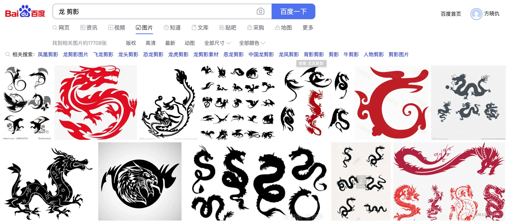
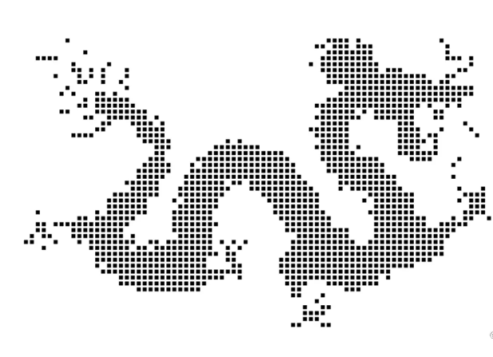
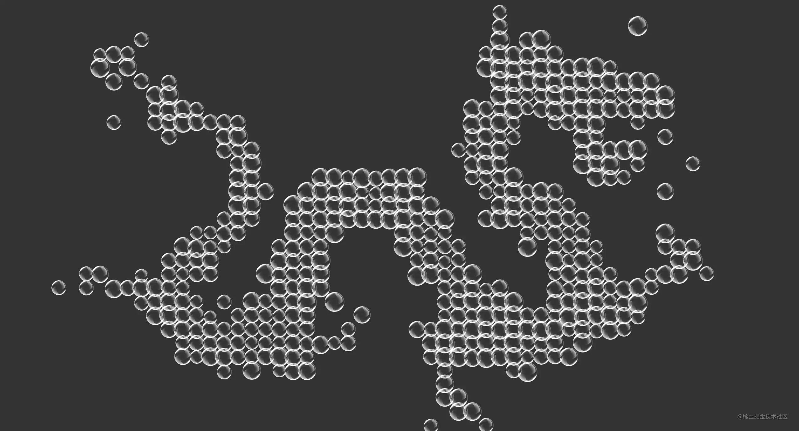

https://juejin.cn/post/7160491044222533639

# 粒子特效


先用图片搜索找一张龙的剪影



## 将图片绘制到canvas中

```javascript
var canvas = document.getElementById("canvas");
var ctx = canvas.getContext("2d");

var image = new Image();
image.src = "dragon.jpg";
image.onload = function(){
        canvas.width = image.width;
        canvas.height = image.height;

        ctx.drawImage(image,0,0);
}
```


## 获取并裁剪画布的点阵信息

~~~html
var imageData = ctx.getImageData(0,0,image.width,image.height).data;
ctx.fillStyle = "#ffffff";
ctx.fillRect(0,0,image.width,image.height);

var gap = 6;

for (var h = 0; h < image.height; h+=gap) {
    for(var w = 0; w < image.width; w+=gap){
            var position = (image.width * h + w) * 4;
            var r = imageData[position], g = imageData[position + 1], b = imageData[position + 2];

            if(r+g+b==0){
                    ctx.fillStyle = "#000";
                    ctx.fillRect(w,h,4,4);
                }
    }
}
~~~

现在我们获得了这样一条龙的点阵信息




## 通过点阵信息生成气泡dom

~~~js
var dragonContainer = document.getElementById("container");
var dragonScale = 2;

for (var h = 0; h < image.height; h+=gap) {
    for(var w = 0; w < image.width; w+=gap){
            var position = (image.width * h + w) * 4;
            var r = imageData[position], g = imageData[position + 1], b = imageData[position + 2];

            if(r+g+b==0){
                    var bubble = document.createElement("img");
                    bubble.src = "bubble.png";
                    bubble.setAttribute("class","bubble");

                    var bubbleSize = Math.random()*10+20;
                    bubble.style.left = (w*dragonScale-bubbleSize/2) + "px";
                    bubble.style.top = (h*dragonScale-bubbleSize/2) + "px";
                    bubble.style.width = bubble.style.height = bubbleSize+"px";
                    bubble.style.animationDuration = Math.random()*6+4 + "s";

                    dragonContainer.appendChild(bubble);
                }
    }
}
~~~



使用div绘制大量的dom，仅为阐述思路，没考虑性能。

利用一些js游戏引擎，比如pixi等，可以很方便的全部交由canvas去绘制并添加交互。


# Pixijs-Gsap 实现明日方舟粒子动画

| 序号 | 名称            | 摘要      | npm url                              | 官网                                         |
| ---- | --------------- | --------- | ------------------------------------ | -------------------------------------------- |
| 1    | pixijs 官方网站 | 2d 渲染库 | https://www.npmjs.com/package/pixijs | https://pixijs.com/                          |
| 2    | gsap 官网       | 动画库    | https://www.npmjs.com/package/gsap   | https://greensock.com/docs/v3/GSAP/gsap.to() |


## 效果展示

明日方舟官网 https://ak.hypergryph.com/#information

模仿明月方舟粒子效果 - 在线预览 [/examples/pixijs-gsap/index.html](https://ffffee.com/examples/pixijs-gsap/index.html)


## 获取坐标

根据图片获取即可


## Pixijs

根据坐标，渲染粒子效果


### API

| 序号 | API                | 作用                   | 备注                       |
| ---- | ------------------ | ---------------------- | -------------------------- |
| 1    | PIXI.Application   | 创建一个 PIXI 应用实例 |                            |
| 2    | app.stage.addChild | 舞台                   | 所有的容器需要添加到舞台中 |
| 3    | PIXI.Container     | 容器管理所有的点       | particleContainer.addChild |
| 4    | PIXI.Graphics      | 绘制坐标点             | gr.clear() 方法            |


## Gsap


动画库 - 让粒子动起来

### API

| 序号 | API     | 备注                         |
| ---- | ------- | ---------------------------- |
| 1    | gsap.to | js 动画 、ease: 'power4.out' |


## 完整代码

~~~js
<!DOCTYPE html>
<html lang="en">
  <head>
    <meta charset="UTF-8" />
    <meta http-equiv="X-UA-Compatible" content="IE=edge" />
    <meta name="viewport" content="width=device-width, initial-scale=1.0" />
    <title>Pixijs-Gsap 实现明月方舟粒子动画 - 程序员李钟意</title>
    <style>
      html,
      body {
        padding: 0;
        margin: 0;
        background-color: #1f1f1f;
      }
      #app,
      body {
        width: 100%;
        height: 100%;
      }

      canvas {
        display: block;
        margin: 0 auto;
      }
    </style>
  </head>
  <body>
    <div id="app"></div>
    <script src="story1.js"></script>
    <script src="story2.js"></script>
    <script src="story3.js"></script>
    <script src="story4.js"></script>
    <script src="story5.js"></script>
    <script src="https://cdn.jsdelivr.net/npm/pixi.js@7.0.4/dist/pixi.min.js"></script>
    <script src="https://cdnjs.cloudflare.com/ajax/libs/gsap/3.10.4/gsap.min.js"></script>

    <script>
      console.log('story1', story1);
      console.log('story2', story2);
      main();

      async function main() {
        const app = new PIXI.Application({
          width: window.innerWidth, // 画布的大小
          height: window.innerHeight, // 画布的大小
          useContextAlpha: 'notMultiplied',
          backgroundColor: 0x1f1f1f, // 画布背景色
          resizeTo: window // 画布大小跟随屏幕大小
        });

        // #region 创建粒子
        // 所有粒子都放到这个容器
        const particleContainer = new PIXI.Container();

        // 把粒子到舞台上
        app.stage.addChild(particleContainer);

        async function loop(particles = []) {
          for (const item of [story1, story2, story3, story4, story5]) {
            // 如果当前的粒子数量少于上一次的粒子数量
            // 清理掉多余的粒子
            let oldParticles = particles;
            if (item.count < particles.length) {
              oldParticles = particles.slice(0, item.count);
              particles.slice(item.count).forEach((pItem) => {
                pItem.gr.clear();
              });
            }

            particles = createParticles(particleContainer, item, oldParticles);
            resize();
            await new Promise((resolve) => setTimeout(resolve, 2000));
          }
          loop(particles);
        }
        loop();

        function resize() {
          // 修改容器位置
          particleContainer.x = window.innerWidth / 2 - particleContainer.width / 2;
          particleContainer.y = window.innerHeight / 2 - particleContainer.width / 2;
        }

        window.addEventListener('resize', resize);
        resize();

        function createParticles(particleContainer, newValue = [], oldParticles) {
          // 管理粒子数组
          let particles = [];
          let colors = [0x9f9f9f, 0x464646, 0x202020, 0x1c1c1c, 0x4b4b4b];

          for (let index = 0; index < newValue.count; index++) {
            // 创建粒子
            const oldPoint = oldParticles[index];

            let gr;
            if (oldPoint) {
              gr = oldPoint.gr;
            } else {
              gr = createPoint(colors, index);

              // 添加到容器中
              particleContainer.addChild(gr);
            }

            // 给定乱序的坐标
            gr.x = Math.random() * newValue.size.width;
            gr.y = Math.random() * newValue.size.height;

            // 添加到容器中
            // 缓存粒子
            const point = newValue.points[index];
            particles.push({gr, x: point[0], y: point[1]});
          }

          // gsap实现动画效果
          for (let i = 0; i < newValue.count; i++) {
            const pItem = particles[i];
            gsap.to(pItem.gr, {
              duration: 2, // 动画持续时间
              x: pItem.x,
              y: pItem.y,
              ease: 'power4.out'
            });
          }

          return particles;
        }

        // 创建点
        function createPoint(colors, index) {
          // PIXI绘图API创建图形， 和canvas2的绘图api很像
          const gr = new PIXI.Graphics();
          // 创建的粒子添加颜色
          gr.beginFill(index % 3 !== 0 ? colors[0] : colors[Math.floor(Math.random() * colors.length)]);
          // 创建小圆球
          gr.drawCircle(0, 0, 1);
          // 结束填充
          gr.endFill();

          return gr;
        }

        document.querySelector('#app').appendChild(app.view);
      }
    </script>
  </body>
</html>
~~~


5个 js 文件附件找。
