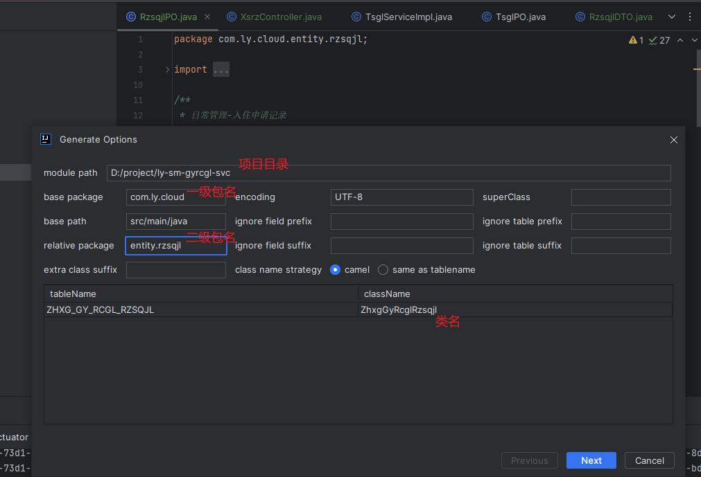
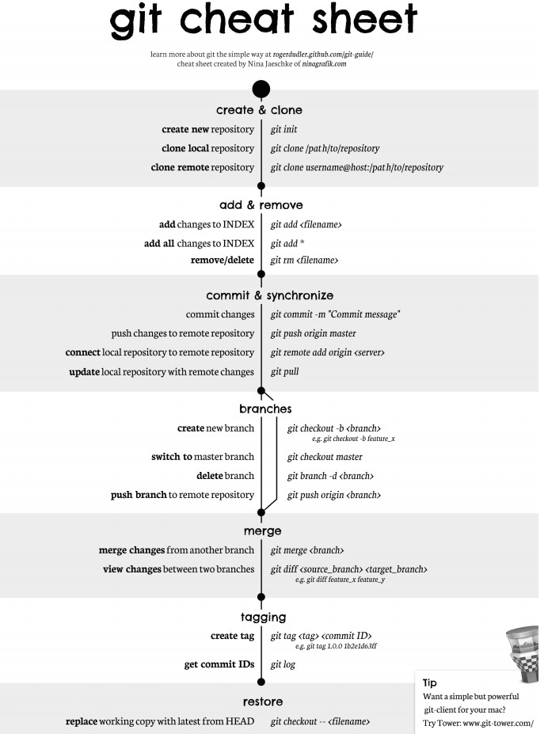

# Jet Brains

## IDEA

### 查找

全局查找：Shift Shift

文件内查找：Ctrl F

### 文本调整

竖向复制：alt  shift insert

文本格式化：Ctrl Shift Alt L

切换大小写：Ctrl Shift u

复制当前光标所在行到下一行：Ctrl d

删除当前光标所在行：Ctrl y

优化导包功能，去除没有用到的包：Ctrl Alt O


### 插件

#### Rainbow Brackets（彩虹括号）

#### MybatisX（代码生成）




## DataGrid

### 文本格式化

去设置调整格式化规则`settings-Editor-Code Style-SQL`


# Maven

1. clean：将以前编译得到的旧文件class字节码文件删除
2. compile：将java源程序编译成class字节码文件
3. test：自动测试，自动调用junit程序
4. report：测试程序执行的结果
5. package：动态Web工程打War包，java工程打jar包
6. install：Maven特定的概念-----将打包得到的文件复制到“仓库”中的指定位置
7. deploy：将动态Web工程生成的war包复制到Servlet容器下，使其可以运行


## 安装

1. 系统变量新增*MAVEN_HOME*为*Maven*安装目录
2. 系统变量*path*里新增*%MAVEN_HOME%bin*

*cmd*里使用*mvn -version*检查版本


## 仓库和坐标

*Maven*配置文件*conf/Setting.xml*配置仓库地址，仓库默认位置在*C*盘不太好


**① pom.xml：** Project Object Model 项目对象模型。它是maven的核心配置文件，所有的构建的配置都在这里设置。

**② 坐标：** 使用下面的三个向量在仓库中唯一的定位一个maven工程


**③ maven工程的坐标与仓库中路径的关系：**

****

maven坐标和仓库对应的映射关系：`[groupId][artifactId][version][artifactId]-[version].jar`

去本地仓库看一下此目录：`org\springframework\spring-core\4.3.4.RELEASE\spring-core-4.3.4.RELEASE.jar`


## 依赖

**① maven解析依赖信息时会到本地仓库中取查找被依赖的jar包**

- 对于[本地仓库](c:\Usrs[登录当前系统的用户名].m2\repository  --本地仓库可修改位置)中没有的会去中央仓库去查找maven坐标来获取jar包，获取到jar之后会下载到本地仓库
- 对于[中央仓库]([Maven Repository: Search/Browse/Explore (mvnrepository.com)](https://mvnrepository.com/))也找不到依赖的jar包的时候，就会编译失败了


**② 如果依赖的是自己或者团队开发的maven工程，需要先使用install命令把被依赖的maven工程的jar包导入到本地仓库中**

举例：现在我再创建第二个maven工程HelloFriend，其中用到了第一个Hello工程里类的sayHello(String name)方法。我们在给HelloFriend项目使用 mvn compile命令进行编译的时候，会提示缺少依赖Hello的jar包。怎么办呢？

到第一个maven工程中执行 mvn install后，你再去看一下本地仓库，你会发现有了Hello项目的jar包。一旦本地仓库有了依赖的maven工程的jar包后，你再到HelloFriend项目中使用 mvn compile命令的时候，可以成功编译


**③ 依赖范围**

****

*scope就是依赖的范围*

**1、compile，** 默认值，适用于所有阶段（开发、测试、部署、运行），本jar会一直存在所有阶段。

**2、provided，** 只在开发、测试阶段使用，目的是不让Servlet容器和你本地仓库的jar包冲突 。如servlet.jar。

**3、runtime，** 只在运行时使用，如JDBC驱动，适用运行和测试阶段。

**4、test，** 只在测试时使用，用于编译和运行测试代码。不会随项目发布。

**5、system，** 类似provided，需要显式提供包含依赖的jar，Maven不会在Repository中查找它。


## build配置

~~~xml

<build>
  <!-- 项目的名字 -->
  <finalName>WebMavenDemo</finalName>
    
  <!-- 描述项目中资源的位置 -->
  <resources>
    <!-- 自定义资源1 -->
    <resource>
      <!-- 资源目录 -->
      <directory>src/main/java</directory>
      <!-- 包括哪些文件参与打包 -->
      <includes>
        <include>**/*.xml</include>
      </includes>
      <!-- 排除哪些文件不参与打包 -->
      <excludes>
        <exclude>**/*.txt</exclude>
          <exclude>**/*.doc</exclude>
      </excludes>
    </resource>
  </resources>
    
    
  <!-- 设置构建时候的插件 -->
  <plugins>
    <plugin>
      <groupId>org.apache.maven.plugins</groupId>
      <artifactId>maven-compiler-plugin</artifactId>
      <version>2.1</version>
      <configuration>
        <!-- 源代码编译版本 -->
        <source>1.8</source>
        <!-- 目标平台编译版本 -->
        <target>1.8</target>
      </configuration>
    </plugin>
      
    <!-- 资源插件（资源的插件） -->
    <plugin>
      <groupId>org.apache.maven.plugins</groupId>
      <artifactId>maven-resources-plugin</artifactId>
      <version>2.1</version>
      <executions>
        <execution>
          <phase>compile</phase>
        </execution>
      </executions>
      <configuration>
        <encoding>UTF-8</encoding>
      </configuration>
    </plugin>
      
    <!-- war插件(将项目打成war包) -->
    <plugin>
      <groupId>org.apache.maven.plugins</groupId>
      <artifactId>maven-war-plugin</artifactId>
      <version>2.1</version>
      <configuration>
        <!-- war包名字 -->
        <warName>WebMavenDemo1</warName>
      </configuration>
    </plugin>
  </plugins>
</build>
~~~

配置好build后，执行mvn package之后，在maven工程指定的target目录里war包和文件都按照配置的生成了


## 版本

https://archive.apache.org/dist/maven/maven-3/3.5.4/binaries/


# Git


pull - 从远程仓库（remote）获取项目最新代码

add - 将修改的文件加入到Git版本控制（index）中，不加入的在后续push中不会被Git推送到远程仓库

commit - 将所有通过add加入到Git版本控制的修改文件，推送到本地仓库（repository）

push - 将本地仓库的项目代码推送（覆盖）到远程


## 暂存修改（Stashing）

在一个分支上操作之后，如果还没有将修改提交到分支上，此时进行切换分支，那么另一个分支上也能看到新的修改。<span style='color: red'>这是因为所有分支都共用一个工作区的缘故。</span>

使用 git stash 将当前分支的修改储藏起来，此时当前工作区的所有修改都会被存到栈中，也就是说当前工作区是干净的，没有任何未提交的修改。此时就可以安全的切换到其它分支上了。

```
$ git stash
Saved working directory and index state \ "WIP on master: 049d078 added the index file"
HEAD is now at 049d078 added the index file (To restore them type "git stash apply")
```

该功能可以用于 bug 分支的实现。如果当前正在 dev 分支上进行开发，但是此时 master 上有个 bug 需要修复，但是 dev 分支上的开发还未完成，不想立即提交。


1. git stash

   

2. *IDEA*的*shelve*

   

   


## 配置

| 权重   | 中文名   | 优先级 | 配置文件         |
| ------ | -------- | ------ | ---------------- |
| system | 系统级别 | 低     | `/etc/gitconfig` |
| global | 全局级别 | 中     | `~/.gitconfig`   |
| local  | 仓库级别 | 高     | `.git/config`    |

（1）查看

```shell
git config --system --list 	# 系统级别
git config --global --list 	# 用户级别
git config --local --list   # 用户级别
 
# 查看单个配置项
git config --global --get [配置名]
```

（2）编辑

~~~shell
git config [–local|–global|–system] --unset 配置项名称  	# 取消配置 
git config [–local|–global|–system] --edit 			    # 编辑
git config [–local|–global|–system] –add section.key value # 添加，默认local
~~~


### 用户名、邮箱配置

**1、配置用户名和邮箱**

报上名来，多人协作时用户名标识身份，伪冒可以追查


**2、用户名和邮箱无关身份验证**

仅标识代码提交记录


```shell
git config --global user.name "sangyu" 	# 配置用户名
git config --global user.email "yls912@qq.com" 	# 配置邮箱
ssh-keygen -t rsa -C "yls912@qq.com" 	# 根据 “邮箱” 生成公钥和私钥
										-- 按三次回车，把生成公钥私钥保存在默认地方
 cat ~/.ssh/id_rsa.pub	 # 默认位置查看公钥
						 -- copy 到仓库的 settings SSH Keys
```


### 网络配置

网络代理设置，比如使用 Github 当作仓库，在国内推送不了因为网络问题，这时打开梯子，需要修改 Git 的网络配置

（1）查看系统网络代理


（2）修改配置

~~~shell
# 注意修改成自己的IP和端口号
git config --global http.proxy http://127.0.0.1:7890 
git config --global https.proxy http://127.0.0.1:7890
~~~


## .gitignore 文件

忽略以下文件：

- 操作系统自动生成的文件，比如缩略图；
- 编译生成的中间文件，比如 Java 编译产生的 .class 文件；
- 自己的敏感信息，比如存放口令的配置文件。

不需要全部自己编写，可以到 https://github.com/github/gitignore 中进行查询。


## 命令




# Docker

> Docker 的Logo设计为蓝色鲸鱼，拖着许多集装箱，鲸鱼可以看作为宿主机，集装箱可以理解为相互隔离的容器，每个集装箱中都包含自己的应用程序。


## 镜像与容器

镜像是一种静态的结构，可以看成面向对象里面的类，而容器是镜像的一个实例。

[史上最全Docker初学者命令大全 - 云 社区 - 腾讯云 (tencent.com)](https://cloud.tencent.com/developer/article/1698107)


## 镜像

[Docker 删除&清理容器和镜像相关命令 - 腾讯云开发者社区-腾讯云 (tencent.com)](https://cloud.tencent.com/developer/article/1626164)

## 仓库

仓库注册服务器上往往存放着多个仓库，每个仓库中包含了多个镜像，每个镜像有不同标签（tag）。


## 容器


## 卸载


# 构建工具

## 构建工具的作用

构建一个项目通常包含了依赖管理、测试、编译、打包、发布等流程，构建工具可以自动化进行这些操作，从而为我们减少这些繁琐的工作。

其中构建工具提供的依赖管理能够可以自动处理依赖关系。例如一个项目需要用到依赖 A，A 又依赖于 B，那么构建工具就能帮我们导入 B，而不需要我们手动去寻找并导入。

在 Java 项目中，打包流程通常是将项目打包成 Jar 包。在没有构建工具的情况下，我们需要使用命令行工具或者 IDE 手动打包。而发布流程通常是将 Jar 包上传到服务器上。

## Java 主流构建工具

Ant 具有编译、测试和打包功能，其后出现的 Maven 在 Ant 的功能基础上又新增了依赖管理功能，而最新的 Gradle 又在 Maven 的功能基础上新增了对 Groovy 语言的支持。


Gradle 和 Maven 的区别是，它使用 Groovy 这种特定领域语言（DSL）来管理构建脚本，而不再使用 XML 这种标记性语言。因为项目如果庞大的话，XML 很容易就变得臃肿。

例如要在项目中引入 Junit，Maven 的代码如下：

```xml
<?xml version="1.0" encoding="UTF-8"?>
<project xmlns="http://maven.apache.org/POM/4.0.0" xmlns:xsi="http://www.w3.org/2001/XMLSchema-instance"
  xsi:schemaLocation="http://maven.apache.org/POM/4.0.0 http://maven.apache.org/xsd/maven-4.0.0.xsd">
   <modelVersion>4.0.0</modelVersion>
 
   <groupId>jizg.study.maven.hello</groupId>
   <artifactId>hello-first</artifactId>
   <version>0.0.1-SNAPSHOT</version>

   <dependencies>
          <dependency>
               <groupId>junit</groupId>
               <artifactId>junit</artifactId>
               <version>4.10</version>
               <scope>test</scope>
          </dependency>
   </dependencies>
</project>
```

而 Gradle 只需要几行代码：

```
dependencies {
    testCompile "junit:junit:4.10"
}
```


## Maven

### 概述

提供了项目对象模型（POM）文件来管理项目的构建。

### 仓库

仓库的搜索顺序为：本地仓库、中央仓库、远程仓库。

- 本地仓库用来存储项目的依赖库；
- 中央仓库是下载依赖库的默认位置；
- 远程仓库，因为并非所有的依赖库都在中央仓库，或者中央仓库访问速度很慢，远程仓库是中央仓库的补充。

### POM

POM 代表项目对象模型，它是一个 XML 文件，保存在项目根目录的 pom.xml 文件中。

```xml
<dependency>
    <groupId>junit</groupId>
    <artifactId>junit</artifactId>
    <version>4.12</version>
    <scope>test</scope>
</dependency>
```

[groupId, artifactId, version, packaging, classifier] 称为一个项目的坐标，其中 groupId、artifactId、version 必须定义，packaging 可选（默认为 Jar），classifier 不能直接定义的，需要结合插件使用。

- groupId：项目组 Id，必须全球唯一；
- artifactId：项目 Id，即项目名；
- version：项目版本；
- packaging：项目打包方式。

### 依赖原则

#### 1. 依赖路径最短优先原则

```
A -> B -> C -> X(1.0)
A -> D -> X(2.0)
```

由于 X(2.0) 路径最短，所以使用 X(2.0)。

#### 2. 声明顺序优先原则

```
A -> B -> X(1.0)
A -> C -> X(2.0)
```

在 POM 中最先声明的优先，上面的两个依赖如果先声明 B，那么最后使用 X(1.0)。

#### 3. 覆写优先原则

子 POM 内声明的依赖优先于父 POM 中声明的依赖。

### 解决依赖冲突

找到 Maven 加载的 Jar 包版本，使用 `mvn dependency:tree` 查看依赖树，根据依赖原则来调整依赖在 POM 文件的声明顺序。

