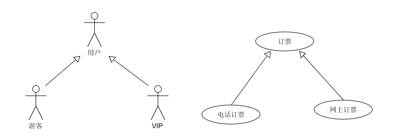
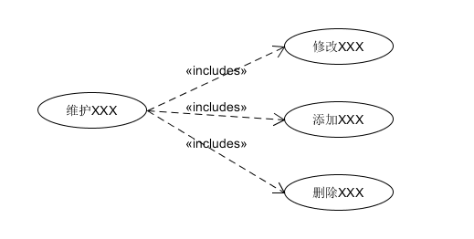

# 用例图

[在线用例图工具 (visual-paradigm.com)](https://online.visual-paradigm.com/cn/diagrams/features/use-case-diagram-software/)

用例图主要用来描述角色以及角色与用例之间的**连接关系**。说明的是谁要使用系统，以及他们使用该系统可以做些什么。一个用例图包含了**多个模型元素**，如系统、参与者和用例，并且**显示这些元素之间的各种关系**，如**泛化**、**关联**和**依赖**。它展示了一个外部用户能够观察到的系统功能模型图。

【用途】：帮助开发团队以一种可视化的方式理解系统的功能需求。

 

**一、用例图所包含的的元素**

**1.** **参与者(Actor)——**与应用程序或系统进行交互的用户、组织或外部系统。**用一个小人表示**。

 

　　　　　　　　　　　　　　　　

 

**2.** **用例(Use Case)——**用例就是外部可见的系统功能，对系统提供的服务进行描述。**用椭圆表示**。

 

　　　　　　　　　　　　 

 

**3. 子系统(Subsystem)——**用来展示系统的一部分功能，这部分功能联系紧密。

 

　　　　

 

 

***\*二、用例图所包含的的关系\****

　　用例图中涉及的关系有：**关联**、**泛化**、**包含**、**扩展**。

　　如下表所示：

 

 

　　**a. 关联(Association)**

 

　　表示参与者与用例之间的通信，任何一方都可发送或接受消息。

 

　　【箭头指向】：无箭头，将参与者与用例相连接，指向消息接收方

 

　　

 

　　**b. 泛化(Inheritance)**

 

　　就是通常理解的继承关系，子用例和父用例相似，但表现出更特别的行为；子用例将继承父用例的所有结构、行为和关系。子用例可以使用父用例的一段行为，也可以重载它。父用例通常是抽象的。在实际应用中很少使用泛化关系，子用例中的特殊行为都可以作为父用例中的备选流存在。

 

　　【箭头指向】：指向父用例

 

 

　　**c. 包含(Include)**

 

　　包含关系用来把一个较复杂用例所表示的功能分解成较小的步骤。包含关系对典型的应用就是复用，也就是定义中说的情景。但是有时当某用例的事件流过于复杂时，为了简化用例的描述，我们也可以把某一段事件流抽象成为一个被包含的用例；相反，用例划分太细时，也可以抽象出一个基用例，来包含这些细颗粒的用例。这种情况类似于在过程设计语言中，将程序的某一段算法封装成一个子过程，然后再从主程序中调用这一子过程。

　　例如：业务中，总是存在着维护某某信息的功能，如果将它作为一个用例，那添加、修改以及删除都要在用例详述中描述，过于复杂；如果分成添加用例、修改用例和删除用例，则划分太细。这时包含关系可以用来理清关系。

 

　　【箭头指向】：指向分解出来的功能用例

 

 

　　**d. 扩展(Extend)**

 

　　扩展关系是指用例功能的延伸，相当于为基础用例提供一个附加功能。将基用例中一段相对独立并且可选的动作，用扩展（Extension）用例加以封装，再让它从基用例中声明的扩展点（Extension Point）上进行扩展，从而使基用例行为更简练和目标更集中。扩展用例为基用例添加新的行为。扩展用例可以访问基用例的属性，因此它能根据基用例中扩展点的当前状态来判断是否执行自己。但是扩展用例对基用例不可见。

对于一个扩展用例，可以在基用例上有几个扩展点。

 

　　【箭头指向】：指向基础用例

 

 

　　**e. 依赖(Dependency)**

 

　　以上4种关系，是UML定义的标准关系。但VS2010的用例模型图中，添加了依赖关系，用带箭头的虚线表示，表示源用例依赖于目标用例。

 

　　【箭头指向】：指向被依赖项

 

 

　　**5. 项目(Artifact)**

 

　　用例图虽然是用来帮助人们形象地理解功能需求，但却没多少人能够通看懂它。很多时候跟用户交流甚至用Excel都比用例图强，VS2010中引入了“项目”这样一个元素，以便让开发人员能够在用例图中链接一个普通文档。

 

　　用依赖关系把某个用例依赖到项目上：

 

 

　　然后把项目->属性的Hyperlink设置到你的文档上；

 

　　这样当你在用例图上双击项目时，就会打开相关联的文档。

 

　　**6. 注释(Comment)**

 

 

　　**包含(include)****、扩展(extend)****、泛化(Inheritance)** **的区别：**

 

　　条件性：泛化中的子用例和include中的被包含的用例会无条件发生，而extend中的延伸用例的发生是有条件的；

 

　　直接性：泛化中的子用例和extend中的延伸用例为参与者提供直接服务，而include中被包含的用例为参与者提供间接服务。

 

　　对extend而言，延伸用例并不包含基础用例的内容，基础用例也不包含延伸用例的内容。

 

　　对Inheritance而言，子用例包含基础用例的所有内容及其和其他用例或参与者之间的关系；

　　●泛化侧重表示子用例间的互斥性；

　　●包含侧重表示被包含用例对Actor提供服务的间接性；

　　●扩展侧重表示扩展用例的触发不定性；

　　另外一点需要提及的是：泛化中的子用例和扩展中的扩展用例均可以作为基本用例事件的备选择流而存在。

 

 

**三、几个用例图示例**

 

****************************************************************************

　　以下为某在线购物系统的用例图，对系统做出做了整体的描绘。

　　(1)系统整体用例图

**
  

  
**  (商品用例图)**

  
  
  
  
  
**  （购买信息用例）**
 
  

  
**  (用户资料用例)**

  **