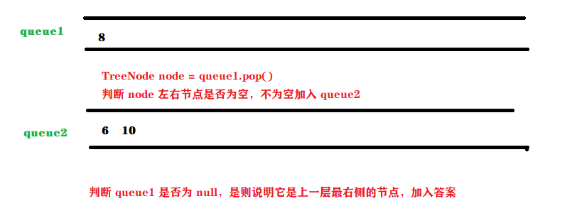
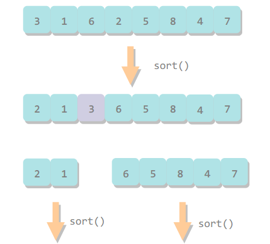
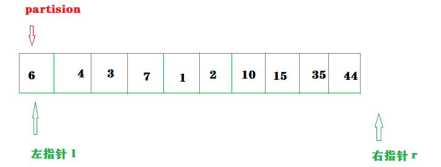
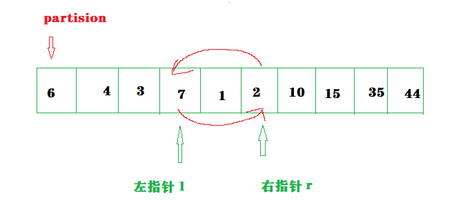
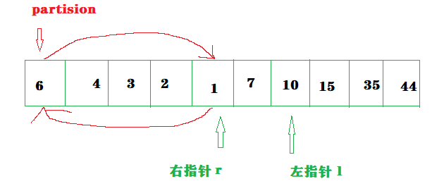
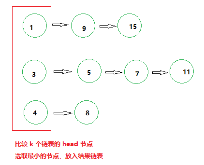

# 如何解题


# 整数

java 的 4 种整数类型，皆为**有符号**表示。发生溢出不会报错。

除法中，除数为0在运行中将会报错。


<h4 style="color:green">面试题1：整数除法</h4> 

不能使用 * / % 运算，对于不能整除，取整数


第一层：被除数循环减去除数。示例中，7 循环 - 2，直到小于 2 

<p style="color:red">缺点：</p>除数为1，被除数 n，复杂度为O(n)

|

第二层：被除数大于除数时，判断被除数是否大于除数的 2 倍，大于则再判断是否大于除数的 4 倍.....以此类推，近似二分，时间复杂度O(NlogN)

|

第三层：（1）负数：负数转正，根据“负负得正”判断结果正负

​				（2）溢出：补码表示法，负数比整数多一位表示，因此将负数转正存在溢出风险，正确应该**正数转负数**

|

大气层：整数（int）之间的除法，除数不为0，因此**商**必定 <= |被除数|

​				唯一的溢出只剩下：-2^31^ / -1 ，正数无法表示 2^31^

~~~java
import java.util.ArrayList;
import java.util.List;

public class Test {
    public static void main(String[] args) {
        Test test = new Test();
        System.out.println(test.divide(15,2));
    }

    private int divide(int dividend, int divisor) {
        //溢出返回最大值
        if(dividend == 0x80000000 && divisor == -1) {
            return Integer.MAX_VALUE;
        }

        //负转正，并记录正负关系
        int negative = 2;
        if(dividend > 0) {
            negative--;
            dividend = -dividend;
        }

        if(divisor > 0) {
            negative--;
            divisor = -divisor;
        }

        int result = divideCore(dividend,divisor);

        return negative == 1 ? -result : result;
    }

    private int divideCore(int dividend,int divisor) {
        int result = 0;
        while(dividend <= divisor) {

            int i = 1;
            int divisorCopy = divisor;
            while(divisorCopy >= 0xc0000000 && dividend <= divisorCopy + divisorCopy) {
                i += i;
                divisorCopy += divisorCopy;
            }
            result += i;
            dividend -= divisorCopy;
        }
        return result;
    }

}
~~~

0xc000 0000 是 0x8000 0000（-2^31^） 的一半，即 -2^30^


# 二进制


| 符号 | 运算 |                                                              | 示例                                     |
| ---- | ---- | ------------------------------------------------------------ | ---------------------------------------- |
| &    | 与   | 有 0 为 0                                                    | 0 & 0 = 0<br>0 & 1 = 0<br/>1 & 1 = 1     |
| \|   | 或   | 有 1 为 1                                                    | 0 \| 0 = 0<br/>0 \| 1 = 1<br/>1 \| 1 = 1 |
| ！   | 非   | 取反                                                         | ! 0 = 1<br>! 1 = 0                       |
| ^    | 异或 | 相同为 0，不同为 1                                           | 0 ^ 0 = 0<br/>0 ^ 1 = 1<br/>1 ^ 1 = 0    |
| <<   | 左移 |                                                              | 0000 0100 << 1 = 0000 1000               |
| >>   | 右移 | 正数：补 0，负数：左侧补1<br/>三目右移运算符 `>>>` ： 统一左侧补 0 的 | 0000 0100 >> 1 = 0000 0010               |


<h4 style="color:green">面试题 2：二进制加法</h4> 


~~~java
public class Test {
    public static void main(String[] args) {
        Test test = new Test();
        System.out.println(test.binaryAdd("11100101","10110101"));

    }

    private String binaryAdd(String a,String b) {
        StringBuilder sb = new StringBuilder();
        int i = a.length() - 1;
        int j = b.length() - 1;
        int carry = 0;
        while(i >= 0 || j >= 0) {
            int num1 = i >= 0 ? a.charAt(i--) - '0' : 0;
            int num2 = j >= 0 ? b.charAt(j--) - '0' : 0;
            int sum = num1 + num2 + carry;

            carry = sum >= 2 ? 1 : 0;
            sum = sum >= 2 ? sum - 2 : sum;
            sb.append(sum);
        }

        if(carry == 1) {
            sb.append(carry);
        }
        return sb.reverse().toString();
    }
}
~~~


<h4 style="color:green">面试题 3：给定数字 N，统计 1 - N 的二进制形式中 1 的个数</h4> 

统计每个数中二进制形式的 1 的个数。


**<span style="color:red">计算二进制中 1 的个数？</span>**

（1）按位与

```
  1001
& 1000  <= 1001 - 1
-------
  1000
  
  1000
& 0111  <= 1000 - 1
 -------
  0000 
```

**代码：**

9 的二进制形式 1001 中有两个 1

~~~java
while(i > 0) {
    cnt++;
    i &= (i-1);
}
~~~


（2）动态规划：**i & (i - 1) 的特点“ i 比 i - 1 多 1 个 1”**

```java
int[] dp = new int[i];
dp[1] = 1;
for (int j = 2; j < i; j++) {
    dp[j] = dp[j & (j-1)] + 1;
}
```


（3）**” >> " **

```
十进制   二进制
6       0110
12      1100

6       0110
13      1101
```

一个数，以 2 倍提升时，二进制中 1 的数目不会有变化。

**换句话：**2 倍降级，二进制中 1 的数目也不会有变化。


但奇数的偶数倍降级，没有整数表示。eg：13 / 2 不是整数

但是得出：奇数的 2 倍降级（二进制左移是向下取整），二进制中 1 的数目比降级后向下取整的数多 1 个

~~~JAVA
private int[] oneNum(int n) {
    int[] nums = new int[n + 1];
    for(int i = 1; i < nums.length; i++) {
        nums[i] = nums[i >> 1] + (i & 1);
    }
    return nums;
}
~~~

i & 1 可以替换成 i % 2


<h4 style="color:green">面试题 4：数组只出现 1 次的数字</h4> 

其它数字在数组中都有 3 个，只有 1 个出现 1次，找出来。


降级问题：**数组中除了一个数只出现 1 次，其余都出现两次**

```
5  1  1  5  8
```

异或运算 ^ ：相同为 0

~~~java
sout(5 ^ 1 ^ 1 ^ 5 ^ 8);

输出：8
~~~

但是此题目其余数出现 3 次，不能消除。


**分析：**整数是 32 位的 0 和 1组成，将这些数同位的 0 和 1相加，如果能被 3 整除，那么出现 1 次的数在此位的值一定是 0，反之为 1.

```
   11      1011
   11      1011
   11      1011
   7     + 0111      
       ---------    相加
       	   3144    
       	 % 3333
       ---------    能否被 3 整除？
           0111
```

构造出了只出现 1 次的 7.


具体代码：

~~~java
public class FindOne {

    public static void main(String[] args) {
        FindOne o = new FindOne();
        System.out.println(o.findOne(new int[]{3, 3, 3, 1,2,2,2,5,5,5,6,6,6}));
    }

    public int findOne(int[] nums) {
        int[] bitSum = new int[32];
        for(int i = 0; i < bitSum.length; i++) {    //统计32位，最高位也可以不统计，因为正数都是 0.
            for(int j = 0; j < nums.length; j++) {
                bitSum[i] += (nums[j] >> (31 - i)) & 1;    //最多右移31位
            }
        }

        int result = 0;
        for (int i = 0; i < bitSum.length; i++) {
            result = (result << 1) + bitSum[i] % 3;
        }
        return result;
    }
}

~~~


**"& 1"** ：保留最低位的值。

目的在于消除其余位的 1 

```
                         11     1011
                         11     1011
                         11     1011
                         7    + 0111
                           ----------
       	                        3144
                                  |
                                  |
计算第 2 位结果应该是：4              |
                                  |
00000000 00000000 00000000 00000101
00000000 00000000 00000000 00000101
00000000 00000000 00000000 00000101
00000000 00000000 00000000 00000011
---------------------------------------
结果是：5 + 5 + 3 = 13
```


> <h5 style="color:red">举一反三</h5> 
>
> **题目：**输入一个数组，有一个数字只出现了 m 次，其它都出现了 n 次，找出那个只出现了 m 次的数。假设 m 不能被 n 整除（如同 1 不能被 3 整除）。
>
> **分析：**如果数组中所有数字的二进制形式相加的第 i 位能被 n 整除，那么出现 m 次的数在第 i 位的值是 0，反之为 1.


<h4 style="color:green">面试题 5：二进制位哈希</h4> 

字符串数组：字符串只含有小写英文字母

```
"abcd","foo","bar","fxyz","abcdef"
```

问：任意两个无相同字符的字符串的最大乘积？


很直观的就是循环暴力，但解决不是算法的目的。

第二种哈希表。

第三种位运算，位作为判断依据。


- 英文小写字母 a-z，总共 26 个
- int 类型数有二进制 32 位

```
0 1 2 3 4 5 6 7 8 9 10 11 12 13 14 15 16 17 18 19 20 21 22 23 24 25 26 27 28 29 30 31

a b c d e f g h i j  k l  m  n   o  p q   r  s  t  u v   w  x  y z
```

使用一个 int 类型的数据记录字符串存在的数据。


~~~java
private  int main() {
    String[] words = {"abcd","foo","bar","fxyz","abcdef"};

    int[] flags = new int[words.length];
    for (int i = 0; i < words.length; i++) {
        for (char ch: words[i].toCharArray()) {
            flags[i] |= 1 << (ch - 'a');
        }
    }

    int result = 0;
    for (int i = 0; i < flags.length; i++) {
        for (int j = i + 1; j < flags.length; j++) {
            if((flags[i] & flags[j]) == 0) {
                result = Math.max(words[i].length() * words[j].length(),result);
            }
        }
    }

    return result;
}
~~~


# 数组（双指针 + 前缀和）

<h4 style="color:green">面试题 6：排序数组两数之和</h4> 

双指针 O(N)


<h4 style="color:green">面试题 7：排序数组三数之和为 0</h4> 

选定一个数作为 target，其余两个就是双指针  O(N)


<h4 style="color:green">面试题 8：正整数数组中，和大于等于 k 的最短子数组长度</h4> 

双指针滑动窗口  O(N)


<h4 style="color:green">面试题 9：正整数数组中，乘积小于 k 的子数组数量</h4> 

双指针滑动窗口  O(N)


> 双指针适用：正数。
>
> 向双指针窗口里新增数字能确定增加了子数组之和，删除数字能确定减少了子数组之和。（负数和 0 ，情况将会复杂许多）


<h4 style="color:green">面试题 10：乱序数组中，和为 K 的子数组数量</h4> 

子数组：数组中所有的窗口。


**针对此题：**

使用 hash <键<前 n 项之和>，值<出现的次数>>

先添加 `map.put(0, 1)` 


累加数组，统计前 n 项和的值

1） `sum[i] - k = map中的键`   <==>   `sum[i] - map中的键 = k `  

2）map 中的键，是前 n 项和

​		前 n 项和之间的相减，是一个连续的子数组，而这个连续的子数组之和为 K，符合答案。

​		`ans += map中键的值`  

​		存在多个前几项和的值都是相同的，也就有多个不同的连续子数组和为 K。所以 map 中的值是相同前 n 项和出现的次数。

​		

**注意边界：**（前0项和）0 - i 也是子数组，因此初始化 hash <0,1>，表示 sum[i] = k 的情况


```java
import java.util.*;

public class Test {

    public static void main(String[] args) {
        int[] arr = {1,1,1};

        Test test = new Test();
        System.out.println(test.sum2K(arr,2));

    }

    private static int sum2K(int[] arr,int k) {
        HashMap<Integer,Integer> map = new HashMap<>();
        map.put(0,1);
        int sum = 0;
        int count = 0;
        for (int num : arr) {
            sum += num;
            count += map.getOrDefault(sum - k, 0);
            map.put(sum, map.getOrDefault(sum,0) + 1);
        }
        return count;
    }
}
```


<h4 style="color:green">面试题 11： 0 和 1 的数组，求 0 和 1 个数相同的子数组中长度最长的</h4> 

**0 翻译成 -1，那么数值得到平衡。**

当 sum[i] - sum[j] == 0 时，即 sum[i] = sum[j] ，说明 j - i 子数组中 0 1数量相同。

~~~java
import java.util.*;

public class Test{
    public static void main(String[] args) {
        int[] arr = {0,0,1,1,0,1,0,1,1,0,0,0,1,1,0};
        
        Test test = new Test();
        System.out.println(test.findMaxLength(arr));
    }
    
    private static int findMaxLength(int[] arr) {
        HashMap<Integer,Integer> map = new HashMap<>();
        int sum = 0;
        int maxLength = 0;
        map.put(0,-1);
        
        for(int i = 0; i < arr.length; i++) {
            sum += arr[i] == 1 ? 1 : -1;
            
            //hash 中键为 sum，值为 sum 出现最早的索引，遇到 sum[i] = sum[j] ，不更新 sum[i]，而是计算子数组长度。
            if(map.containsKey(sum)) {
               maxLength = Math.max(maxLength,i - map.get(sum));
            }else {
                map.put(sum,i);
            }
        }
        
        return maxLength;
    }
}
~~~


<h4 style="color:green">面试题 12：返回数组中一个元素两侧子数组和相等的元素下标</h4> 

返回一个元素下标，这个元素将数组劈开两半，不包括自己。

两半数组的和相等。


~~~java
private static int findIndex(int[] arr) {
    int total = 0;
    for(int num : arr) {  // 统计数组总和 total
        total += num;
    }

    int sum = 0;
    for(int i = 0; i < arr.length; i++) {
        sum += arr[i];
        if(sum - arr[i] == total - sum) {
            return i;
        }
    }

    return -1;
}
~~~


<h4 style="color:green">面试题 13：二维子矩阵的和</h4> 

数组值随机

```
1  2  3  4  5  6
      ____
2  3 |4  5| 6  7
     |    |
3  4 |5  6| 7  8
     |____|
4  5  6  7  8  9


//sums 回头看，第一遍忽略。添加 0 边界，充当缓冲区
0  0  0  0  0  0  0
         ____
0  1  2 |3  4| 5  6
        |    |
0  2  3 |4  5| 6  7
        |    |
0  3  4 |5  6| 7  8
        |____|
0  4  5  6  7  8  9
```

求左上角坐标（1，2）到右下角坐标（2，3）的子矩阵的和


**首先，两个问题：**

（1）如何计算每一个点前缀和

（2）如何得到子矩阵的值


**解决第一个问题：**

以 `sums[2][3]` 表示：


初始化是一个遍历过程，因此假设  `sums[2][3]` 前的元素已经初始化完成


两部分构成  `sums[2][3]` = `sums[1][3]` + `当前行的 sum[3]`


抽象一下：`sums[i][j]` = `sums[i - 1][j]` + `当前行的 sum[j]`


**解决第二个问题：**

定义二维数组 `sums[i][j]` ，表示从左上角坐标（0，0）到右下角坐标（i，j）矩阵的和


如何得到左上角坐标（1，2）到右下角坐标（2，3）的子矩阵的和？

抽象一下：

`sums[2][3]`  ——

`sums[2][1]` ——

 `sums[0][3]` ——

可以看到重复删了 [1,2] ，因此加上 `sums[0][1]` —— 

因此左上角坐标（1，2）到右下角坐标（2，3）的子矩阵的和 = `sums[2][3]` - `sums[2][1]`  -`sums[0][3]` + `sums[0][1]`


化为公式：

左上角坐标（i1，j1）到右下角坐标（i2，j2）的子矩阵的和 =  `sums[i2][j2]` - `sums[i2][j1 - 1]`  - `sums[i1 - 1][j2]` + `sums[i1 - 1][j1 - 1]`


**边界注意：**

 `sums[0][3]` ——

如果左上角坐标是 （0，2）时呢？

那上面部分的坐标将是 （**-1**，3）了，以此为了索引不越界问题，`sums[i+1][j+1]` 数组定义表示，从左上角坐标（0，0）到右下角坐标（i，j）矩阵的和


所以公式也将发生变化：

左上角坐标（i1，j1）到右下角坐标（i2，j2）的子矩阵的和 =  `sums[i2 + 1][j2 + 1]` - `sums[i2 + 1][j1]`  - `sums[i1][j2 + 1]` + `sums[i1][j1]`

（0，0）到（i，j）的矩阵和  `sums[i + 1][j + 1]` = `sums[i][j + 1]` + `当前行的 sum[j + 1]`


~~~java
import java.util.*;

public class Test{
    public static void main(String[] args) {
        int[][] arr = {
                {1,2,3,4,5},
                {2,3,4,5,6},
                {3,4,5,6,7},
                {4,5,6,7,8},
                {5,6,7,8,9}
        };

        System.out.println(subMatrixSum(arr,1,2,3,4));
    }

    private static int subMatrixSum(int[][] arr,int row1,int col1,int row2,int col2) {
        int[][] sums = new int[arr.length + 1][arr[0].length + 1];
        for(int i = 0; i < arr.length; i++) {
            int rowSum = 0;
            for(int j = 0; j < arr[0].length; j++) {
                rowSum += arr[i][j];
                sums[i+1][j+1] = sums[i][j+1] + rowSum;
            }
        }

        return subMatrixSumCore(sums,row1,col1,row2,col2);
    }

    private static int subMatrixSumCore(int[][] sums,int row1,int col1,int row2,int col2) {
        return sums[row2+1][col2+1] - sums[row1][col2+1] - sums[row2+1][col1] + sums[row1][col1];
    }
}
~~~

```
54
```


> 数组总结：
>
> 双指针：
>
> 数组是正数排序的，用双指针可以在 O(N)时间复杂度内找出两个数值元素和为给定值的下标。
>
> 数组都是正数，用双指针可以在 O(1) 辅助空间可以找出和为给定值的子数组。
>
> 没说明数组是正数，可能有负数和 0时，不适用双指针。
>
> 
>
> 前缀和：


# 字符串（双指针 + hash)

可以把字符串当成一个字符类型的数组，那么它也可利用双指针思想。

经常使用 hash 记录字符出现的次数。


<h4 style="color:green">面试题 14：字符串 s2 中是否存在字符串 s1 的变位词（限定小写字母）</h4> 

**变位词**：

- 组成单词的各个字母出现的次数完全相同
- 字母排列的顺序不同


如：”abcs"、“cbsa”、”cbas“


分析：变位词无关顺序，字符相同且次数一致 == 统计字符

```
s1   ac
s2   dgcaf
```

只有小写字母，用数组模拟 hash


统计了 s1 字符次数，s2 进来时减去出现字符的次数，如果数组元素值全为 0，说明 s1 和 s2 字串是一组变位词。

```
index  0     1     2     3     4     5    6   .......
      'a'   'b'   'c'   'd'   'e'   'f'  'g'  .........   
      
s1     -1    0    -1     0     0     0    0   ........  将 s1 变位词的字符坑位置 -1
s2     -1    0    -1     1     0     0    1   ...   窗口长度定位 s1.length() s2 ，“dg”进来，将字符对应坑位加 1
       -1    0     0     0     0     0    1   ...   “dg”不是，判断下一个“gc”，'d' 坑位去除，新增 'c'
       0     0     0     0     0     0    0   ...   “gc”不是，判断下一个“ca”，'g' 坑位去除，新增 'a'
```

~~~java
import java.util.*:

public class Test{
    public static void main(String[] args) {
        String s1 = "ac";
        String s2 = "dgcaf";
        System.out.println(exitsChangeWord(s1,s2));
    }

    private static boolean exitsChangeWord(String s1, String s2) {
        if(s2.length() < s1.length()) {
            return false;
        }
        
        int[] count = new int[26];
        for(int i = 0; i < s1.length(); i++) {
            count[s1.charAt(i) - 'a']++;
            count[s2.charAt(i) - 'a']--;
        }

        if(isAllZero(count)) {
            return true;
        }

        for(int i = s1.length(); i < s2.length(); i++) {
            count[s2.charAt(i) - 'a']--;
            count[s2.charAt(i - s1.length()) - 'a']++;
            if(isAllZero(count)) {
                return true;
            }
        }
        return false;
    }

    private static boolean isAllZero(int[] count) {
        for(int num : count) {
            if(num != 0) {
                return false;
            }
        }
        return true;
    }
}
~~~


<h4 style="color:green">面试题 16：无重复字符的最长子串</h4>

```
babcca
```

```
3  (abc)
```


双指针遍历：

1. 右指针不断前进，过程中统计字符出现次数，并且记录符合答案的子串长度
2. 出现重复时，左指针一直前进直到消除重复字符
3. 不断重复 1、2 过程

~~~java
import java.util.*;

public class Test{
    public static void main(String[] args) {
        String str = "babcca";
        System.out.println(maxLengthSubString(str));
    }

    private static int maxLengthSubString(String str) {
        if(str.length() == 0) {
            return 0;
        }

        //无限定字符，因此字符不受限制（256个字符）
        int[] count = new int[256];
        int l = -1;
        int r = 0;
        int ans = 1;
        
        //为 1 表示重复
        int countDup = 0;
        for(; r < str.length(); r++) {
            count[str.charAt(r)]++;
            
            //出现重复字符
            if(count[str.charAt(r)] == 2) {
                countDup++;
            }

            //出现重复字符，滑动左指针，直到消除重复字符
            while(countDup > 0) {
                l++;
                count[str.charAt(l)]--;
                if(count[str.charAt(l)] == 1) {
                    countDup--;
                }
            }
            ans = Math.max(ans,r-l);
        }
        return ans;
    }
}
~~~


<h4 style="color:green">面试题 17：包含所有字符的最短子串</h4>

两个字符串，返回 s 中包含 t 所有字符的最短字符串

```
addbancad
abc
```

则返回

```
banc
```

包括了 a，b，c


看结束条件，包含了所有字符就可结束。因此需要统计的是 t 中所有的字符，因此要确切知道字符个数，使用 hashmap。

当 s 字串增加字符过程包含了所有 t 的字符，进行最短长度记录，并移动左指针，直到不符合包含所有字符，再移动右指针，重复此过程

~~~java
import java.util.*;

public class Test{
    public static void main(String[] args) {
        String s = "addbancad";
        String t = "abc";
        System.out.println(minAllCharSubStr(s,t));

    }
    
    private static String minAllCharSubStr(String s,String t) {
        HashMap<Character,Integer> charCount = new HashMap<>();
        for(char ch : t.toCharArray()) {
            charCount.put(ch,charCount.getOrDefault(ch,0) + 1);
        }

        int count = charCount.size();
        int start = 0,end = 0,minStart = 0,minEnd = 0;
        int minLength = Integer.MAX_VALUE;

        while(end < s.length() || (count == 0 && end == s.length())) {
            if(count > 0) {
                char ch = s.charAt(end);
                if(charCount.containsKey(ch)) {
                    charCount.put(ch,charCount.getOrDefault(ch,0) - 1);
                    if(charCount.get(ch) == 0) {
                        count--;
                    }
                }
                end++;
            }else {
                if(end - start < minLength) {
                    minLength = end - start;
                    minStart = start;
                    minEnd = end;
                }

                char ch = s.charAt(start);
                if(charCount.containsKey(ch)) {
                    charCount.put(ch,charCount.getOrDefault(ch,0) + 1);
                    if(charCount.get(ch) == 1) {
                        count++;
                    }
                }
                start++;
            }
        }
        return minLength < Integer.MAX_VALUE ? s.substring(minStart,minEnd) : "";
    }
}
~~~


## 回文串


<h4 style="color:green">面试题 18：是否是回文串</h4>

只考虑字母和数字，其它字符忽视，并且忽略大小写

~~~java
public class Test{
    public static void main(String[] args) {
        String str = "a1bcB1a";
        System.out.println(isPalindrome(str));
    }

    private static boolean isPalindrome(String str) {
        int l = 0;
        int r = str.length() - 1;
        while(l < r) {
            char ch1 = str.charAt(l);
            char ch2 = str.charAt(r); 
            if(!Character.isLetterOrDigit(ch1)) {  // 其它字符忽视
                l++;
            }else if(!Character.isLetterOrDigit(ch2)) {   // 其它字符忽视
                r--;
            }else {        
                ch1 = Character.toLowerCase(ch1);    // 忽略大小写
                ch2 = Character.toLowerCase(ch2);
                if( ch1 != ch2) {
                    return false;
                }
                l++;
                r--;
            }
        }
        return true;
    }

}
~~~


<h4 style="color:green">面试题 19：能否最多删除一个字符得到回文串</h4>

~~~java
public class Test{
    public static void main(String[] args) {
        String str = "abca";
        System.out.println(validPalindrome(str));
    }
    
    private static boolean validPalindrome(String s) {
        int i = 0;
        int j = s.length() - 1;
        while(i < j) {
            if (s.charAt(i) != s.charAt(j)) {
                return isPalindrome(s, i + 1, j) || isPalindrome(s, i , j - 1);
            }
            i++;
            j--;
        }
        return true;
    }
    
    private static boolean isPalindrome(String s, int i, int j) {
        while (i < j) {
            if (s.charAt(i) != s.charAt(j)) {
                return false;
            }
            i++;
            j--;
        }
        return true;
    }
}
~~~


<h4 style="color:green">面试题 20：回文字符串的个数</h4>

```
abc 

a b c  3个


aaa

a a a aa aa aaa  6个
```


~~~java
public class Test{
    public static void main(String[] args) {
        String str = "aaa";
        System.out.println(countPalindrome(str));
    }

    private static int countPalindrome(String str) {
        if(str.length() == 0) {
            return 0;
        }

        int count = 0;
        for(int i = 0; i < str.length(); i++) {
            count += countPalindromeCore(str,i,i);
            count += countPalindromeCore(str,i,i+1);
        }
        return count;
    }

    private static int countPalindromeCore(String str,int left,int right) {
        int count = 0;
        while(left >= 0  && right< str.length()
                && str.charAt(left) == str.charAt(right)) {
            count++;
            left--;
            right++;
        }
        return count;
    }
}
~~~


# 链表

单链表

~~~java
public class ListNode{
    private int val;
    private ListNode next;
}
~~~


## 哨兵节点

相信经常遇到传入链表 head 为 null 的情况，哨兵节点可以避免这种情况。

简化节点的增加和删除逻辑。


## 单向链表

**众所周知**，在没有使用‘异或’的情况下，交换两个值需要第三个参数，数组如此，链表更是如此。

交换 node1|node2 ，需要有 node1 的前置节点。


~~~java
public void swap(ListNode pre, ListNode node1, ListNode node2) {
    pre.next = node1.next;
    node1.next = node2.next;
    node2.next = node1;
}
~~~


<h4 style="color:green">面试题 21：删除倒数第 K 个节点</h4>

快慢指针，快指针先走 K 步。快指针指向 null，此时慢指针指向倒数第 K 个节点。


<h4 style="color:green">面试题 22：链表环的入口</h4>

快慢指针走到环相遇点，将快指针初始化为 head 节点，快指针速度恢复和慢指针一致，再次相遇就是入口。


<h4 style="color:green">面试题 23：两个链表的第 1 个重合节点</h4>


<h4 style="color:green">面试题 24：反转链表</h4>

**（1）迭代反转链表**


获取下一节点的引用。


反转当前节点。


准备反转下一节点。


~~~java
public class Reverse{
    
    public ListNode reverseList(ListNode head) {
        if(head == null || head.next == null) {
            return head;
        }
        ListNode pre = null;
        ListNode cur = head;
        while(cur != null) {
            ListNode next = cur.next;
            cur.next = pre;
            
            pre = cur;
            cur = next;
        }
        return pre;
    }
}
~~~


（2）**递归反转链表**

每个节点认为自己是 head 节点，逻辑认为子节点都已反转

它只需要完成：

1. 自己的子节点代替自己成为链表的 head 节点

   ~~~java
   // 子节点成为 head
   ListNoe newHead = reverseList(head.next);
   ~~~

2. 子节点指向自己

   ~~~java
   head.next.next = head;
   ~~~

   

3. 自己指向 null

   ~~~java
   head.next = null;
   ~~~
   
   
   
4. 返回 newHead

~~~java
public ListNode reverseList(ListNode head) {
    if(head == null || head.next == null) {
        return head;
    }

    ListNode newHead = reverseList(head.next);
    head.next.next = head;
    head.next = null;
    return newHead;
}
~~~


<h4 style="color:green">面试题 25：链表相加</h4>

进制位对齐，需要从底进制位开始运算，单向链表则需要反转链表


<h4 style="color:green">面试题 26：重排链表</h4>


1. 找到链表中间节点

2. 反转后半段链表

3. 轮流放入 


<h4 style="color:green">面试题 27：回文链表</h4>


找到链表中间节点

反转后半段链表，奇数个节点忽略中心节点

判断相同


## 双向链表


<h4 style="color:green">面试题 28：展平多级双向链表</h4>


<h4 style="color:green">面试题 29：单向循环有序链表插入节点，并保持有序</h4>


插入条件1：比上一个大，比下一个小


插入条件2：不符合 1 的情况是新节点的值大于所有节点的值，或者小于所有节点的值，此时插入最小值和最大值之间都是对的


边界条件1：链表为空，新节点为 head

边界条件2：原来只有一个节点，那么加上要插入的总共 2 个，两个循环的节点，无所谓排序


# 哈希表

哈希通过哈希函数计算一个元素的 hash 值，通过此值，可以快速定位元素，也就是说寻找效率非常高 O(1) ，因此删除，插入也非常的快。

Java 中有两种 hash 实现：

- HashSet
- HashMap


HashSet 只存储一个元素，元素本身是单个的，或者说，hashset 只存储存储键（hash通常是键值对）。

如果每个元素都只有一个值，则用 HashSet，通常在图搜索时用来存储已经搜索过的节点间。

HashMap 存储键值对。


虽然哈希表效率很高，但若是作为字典，需要输入完整的单词进行查找。

如果对数据集中的元素排序更有助于解决问题，那么就用 TreeSet 和 TreeMap。

如果需要知道一个动态数据集中的最大值或者最小值，那么堆的效率可能会更好。

如果希望能通过前缀进行单词查找，如搜索以“帅”为开头的单词，那么应该使用前缀树作为字典的数据结构。


<h4 style="color:green">面试题 30：插入、删除和随机访问都是 O(1) 的容器</h4>

设计一个数据结构，使得如下三个操作的时间复杂度都是O(1)：

+ insert(value)：如果数据集不包含一个数值，则把它添加到数据集；
+ remove(value)：如果数据集包含一个数值，则把它删除；
+ getRandom()：随机返回数据集中的一个数值，要求数据集里每个数字被返回的概率都相同。

***审题！！！***

1. 插入、删除的参数是 value
2. 随机访问


随机访问——必是数组。

随机，基本不可能随机生成 hashmap 的键，适合的是 Random 生成数字随机数作为数组下标，快速随机访问。

**因此考虑 ArrayList 存放数据集。**


插入、删除 O(1) ——要求是根据值删除，那么可以使用 HashMap ，键是 val，值是在 arraylist 中存 val 的下标。

hashmap 的 val 只是辅助作用，记下 val 的下标。

~~~java
class RandomizedSet {
    public RandomizedSet() {
        numToLocation = new HashMap<>();
        nums = new ArrayList<>();
    }
    
    public boolean insert(int val) {
        if (numToLocation.containsKey(val)) {
            return false;
        }

        numToLocation.put(val, nums.size());
        nums.add(val);
        return true;
    }
    
    public boolean remove(int val) {
        if (!numToLocation.containsKey(val)) {
            return false;
        }
        
        int location = numToLocation.get(val);   // 要删除元素在 arraylist 中的下标
        numToLocation.put(nums.get(nums.size() - 1), location);   // 修改最新元素的下标为 location
        numToLocation.remove(val);
        nums.set(location, nums.get(nums.size() - 1));  // arraylist 将下标为 location 的元素修改为最新元素
        nums.remove(nums.size() - 1);
        return true;
    }
    
    public int getRandom() {
        Random random = new Random();
        int r = random.nextInt(nums.size());
        return nums.get(r);
    }
}
~~~

注意删除的逻辑，arraylist 将要删除的元素和尾元素替换位置，这样删除就是 O(1) 了

同时再此之前，hashmap 已经更新了尾元素的 location


## 面试题 31：最近最少使用缓存（LRU）

缓存就是 <key，value> 

hashmap 没有功能可以找到最近最少使用的 key-value。


 LRU 缓存：

**get(Key)**——如果缓存中存在 key，返回它的值，否则返回 -1

**put(key,val)**——如果缓存包含 key，则更新 val，不然添加 key 并设置 val。如果缓存达到数量限制，那么删除最近最少使用的键。


~~~java
public class LRUCache{
    private ListNode head;
    private ListNode tail;
    private HashMap<Integer,ListNode> map;
    int capacity;
    
    public LRUCache(int capacity) {
        head = new ListNode(-1);
        tail = new ListNode(-1);
        map = new HashMap<>();
        
        this.capacity = capacity;
        head.next = tail;
        tail.pre = head;
    }
    
    public int get(int key) {
        ListNode node = map.get(key);
        if(node == null) {
            return -1;
        }
        
        moveToTail(node);
        return node.val;
    }
    
    public void put(int key,int val) {
        if(map.containsKey(key)) {
            map.put(key,val);
        }else {
            if(capacity == map.size()) {
                ListNode toBeDelete = head.next;
                deleteNode(toBeDelete);
            }
            ListNode newNode = new Node(val);
            insertToTail(newNode);
            map.put(key,val);
        }
    }
    
}

class ListNode {
    private int val;
    private ListNode pre;
    private ListNode next;
    
    public ListNode(int val);
}
~~~


观看上方代码，先忽略 deleteNode、 insertToTail 、moveToTail 方法的具体实现。

获取逻辑o1没问题， put 逻辑看起来也是 o1 没问题，但是 **当容量到达限制后，链表的头部删除了没问题，但是 map 中的 key 还在，并且看起来没办法删除，因为根本不知道此缓存键值对的 key，没有 key ，map 无法删除。**

由此，链表无需知道 key，因为我们就打算删除头部节点，并且一直保存着获取头部的时间复杂为 o1，因此，可以在双向链表加一个属性 **key** 使用，就让它和 缓存的 key 一致，这样就可以定位 map 中要删除的数据。

~~~java
import java.util.HashMap;

public class LRUCache{
    private final ListNode head;
    private final ListNode tail;
    private final HashMap<Integer,ListNode> map;
    int capacity;

    public LRUCache(int capacity) {
        head = new ListNode(-1,-1);
        tail = new ListNode(-1,-1);
        map = new HashMap<>();

        this.capacity = capacity;
        head.next = tail;
        tail.pre = head;
    }

    public int get(int key) {
        ListNode node = map.get(key);
        if(node == null) {
            return -1;
        }

        moveToTail(node,node.val);
        return node.val;
    }

    public void put(int key,int val) {
        if(map.containsKey(key)) {
            moveToTail(map.get(key),val);
        }else {
            if(capacity == map.size()) {
                ListNode toBeDelete = head.next;

                //先从 map 中删除
                map.remove(toBeDelete.key);
                deleteNode(toBeDelete);
            }
            ListNode newNode = new ListNode(key,val);
            insertToTail(newNode);
            map.put(key,newNode);
        }
    }

    private void deleteNode(ListNode node) {
        head.next = node.next;
        node.next.pre = head;
    }

    private void insertToTail(ListNode node) {
        tail.pre.next = node;
        node.pre = tail.pre;
        tail.pre = node;
        node.next = tail;
    }

    private void moveToTail(ListNode node,int newVal) {
        deleteNode(node);

        node.val = newVal;
        insertToTail(node);
    }
}

class ListNode {
    public int key;
    public int val;
    public ListNode pre;
    public ListNode next;

    public ListNode(int key,int val) {
        this.key = key;
        this.val = val;
    }
}
~~~


<h4 style="color:green">面试题 32：给两个字符串，判断是不是属于同一组变位词</h4>

简单，只有两个字符串，变位词是字符包括字符次数一样，只要统计就可以了。


如果，限定小写字母，用数组模拟

不限定字母，用 hashmap


第一轮遍历 s 串，对出现的字符统计 +1（减一也可以）


第二轮遍历 t 串，队出现的字符统计 -1（与第一轮相反）


这样就得出结果。

提前结束的条件是：当第二轮遍历字符时，都判断下标是不是为 0，为 0 说明第一轮遍历 没有出现这个字符，直接 return false


<h4 style="color:green">面试题 33：给一个字符串数组，把它们按照变位词进行分组</h4>

限定小写字母


很多字符串，怎么才能把正确的变位词组 映射到 同一位置呢？

abc 假设像上一题一样 0+1+2 = 5  那么 一个 e 就和它们映射到同一位置了，不适用。


**数学中的质数**

质数之间相乘的值不会落到同一个值上，因此可以将一个小写字母对应一个质数。

a - 2 b - 3 c - 5

那就是 abc = 30  cba = 30  cab = 30 ....


**自然排序**

每个变位词组都是包含不同的字母或者次数，因此自然排序是相同的、


<h4 style="color:green">面试题 35：最小时间差</h4>

给定 24 小时格式的时间，判断时间差最小的两个时间


把每一分钟映射到不同的数组下标，00：01 在数组下标 1     23：59 在1439


# 栈

<h4 style="color:green">面试题 36：后缀表达式</h4>

~~~java
public class Test{
    public static void main(String[] args) {
        String[] strs = {"2","1","3","+","*"};
        System.out.println(solution(strs));
    }

    public static int solution(String[] strs) {
        Stack<Integer> stack = new Stack<>();

        for(String s : strs) {
            switch(s) {
                case "+":
                case "-":
                case "*":
                case "/":
                    int num = solutionCore(stack.pop(),stack.pop(),s);
                    stack.push(num);
                    break;
                default:
                    stack.push(Integer.parseInt(s));
            }
        }
        
        return stack.pop();
    }

    private static int solutionCore(Integer a,Integer b,String c) {
        switch(c) {
            case "+":
                return a + b;
            case "-":
                return a - b;
            case "*":
                return a * b;
            case "/":
                return a / b;
            default:
                return 0;
        }
    }
}
~~~


<h4 style="color:green">面试题 39：直方图最大面积矩形</h4>


单调栈法：

- 栈存储柱子高度递增有序的下标。从左到右扫描柱子，如果高度高于栈顶，将柱子下标加入栈中；否则，栈顶出栈计算面积。

  

- 栈顶出栈，计算面积。以某根柱子为顶的最大矩形，一定是从该柱子向两侧延申直到遇到比它矮的柱子，这个最大矩形的高是该柱子的高，最大矩形的宽是两侧比它矮的柱子中间的间隔。

  假如是下标为 3 的柱子（第一个高度为 4 的），则最大矩形的高是自己的高度 4，宽度则是从自身向两侧扩散比它矮的柱子（也就是第一个高度为 2 的柱子和第一个高度为 1 的柱子）之间的间隔 3

  

- 遍历完，栈中可能还存在元素，需要计算以它们为顶的最大矩形。


~~~java
public class LargestRectangle {

    public static void main(String[] args) {
        int[] heights = {3,2,5,4,6,1,4,2};
        System.out.println(largestRectangle(heights));;
    }

    public static int largestRectangle(int[] heights) {
        Stack<Integer> stack = new Stack<>();
        stack.push(-1);
        int maxArea = 0;
        
        for(int i = 0; i < heights.length; i++) {
            while(stack.peek() != -1 && heights[stack.peek()] >= heights[i]) {
                int height = heights[stack.pop()];
                int width = i - stack.peek() - 1;
                maxArea = Math.max(maxArea,height * width);
            }
            stack.push(i);
        }

        while(stack.peek() != -1) {
            int height = heights[stack.pop()];
            int width = heights.length - stack.peek() - 1;  // 注意 heights.length ，右边界
            maxArea = Math.max(maxArea,height * width);
        }

        return maxArea;
    }
}
~~~


<h4 style="color:green">面试题 40：矩阵最大矩形</h4>


0 和 1 的二维数组中，只有 1 的最大矩形


面试题 39 中利用了直方图，可以将矩阵转化为直方图。

遍历每一行得到的直方图


~~~java
public class LargestRectangle {

    public static void main(String[] args) {
        int[] heights = {3,2,5,4,6,1,4,2};
        System.out.println(largestRectangle(heights));


        int[][] matrix = {
                {1,0,1,0,0},
                {0,0,1,1,1},
                {1,1,1,1,1},
                {1,0,0,1,0}
        };
        System.out.println(largestRectangle(matrix));
    }

    public static int largestRectangle(int[][] matrix) {
        if(matrix.length == 0 || matrix[0].length == 0) {
            return 0;
        }

        int maxArea = 0;
        int[] heights = new int[matrix[0].length];
        for (int[] arr: matrix) {
            for (int i = 0; i < arr.length; i++) {
                if(arr[i] == 0) {
                    heights[i] = 0;
                }else {
                    heights[i]++;
                }
            }

            maxArea = Math.max(maxArea,largestRectangle(heights));
        }
        return maxArea;
    }

    public static int largestRectangle(int[] heights) {
        Stack<Integer> stack = new Stack<>();
        stack.push(-1);

        int maxArea = 0;
        for(int i = 0; i < heights.length; i++) {
            while(stack.peek() != -1 && heights[stack.peek()] >= heights[i]) {
                int height = heights[stack.pop()];
                int width = i - stack.peek() - 1;
                maxArea = Math.max(maxArea,height * width);
            }
            stack.push(i);
        }

        while(stack.peek() != -1) {
            int height = heights[stack.pop()];
            int width = heights.length - stack.peek() - 1;
            maxArea = Math.max(maxArea,height * width);
        }

        return maxArea;
    }
}
~~~


# 队列

| 操作           | 抛异常  |          |
| -------------- | ------- | -------- |
| 插入元素       | add(e)  | offer(e) |
| 删除           | remove  | poll     |
| 返回队列头元素 | element | peek     |


## 二叉树广度优先搜索

~~~java
public class Traverse {
    
    public static void traverse(TreeNode root) {
        Queue<TreeNode> queue = new LinkedList<>();
        queue.add(root);

        while(!queue.isEmpty()) {
            TreeNode node = queue.poll();
            if(node.left != null) {
                queue.add(node.left);
            }
            if(node.right != null) {
                queue.add(node.right);
            }
            System.out.println(node.val);
        }
    }
    
}

class TreeNode{
    int val;
    TreeNode left;
    TreeNode right;
    public TreeNode(int val,TreeNode left,TreeNode right) {
        this.val = val;
        this.left = left;
        this.right = right;
    }
    public TreeNode(TreeNode left,TreeNode right) {
        this.left = left;
        this.right = right;
    }
    public TreeNode(int val) {
        this.val = val;
    }

    public void setLeft(TreeNode left) {
        this.left = left;
    }

    public void setRight(TreeNode right) {
        this.right = right;
    }
}
~~~


<h4 style="color:green">面试题 43：完全二叉树的插入</h4>

用队列维护要插入节点的父节点，如果

```
      1
    2   3
  4  
```

此时，插入的是 2 的右节点，队列头应该是 2


初始化传入 root 节点

insert(val) 插入值返回父节点值

get 获取根节点

~~~~java
import java.util.*;

public class CompleteBinaryTree{
    private Queue<TreeNode> queue;
    private TreeNode root;

    public CompleteBinaryTree(TreeNode root) {
        this.root = root;

        queue = new LinkedList<TreeNode>();
        queue.add(root);
        while(queue.peek().left != null && queue.peek().right != null) {
            TreeNode node = queue.poll();
            queue.add(node.left);
            queue.add(node.right);
        }
    }


    public int insert(int val) {
        TreeNode node = new TreeNode(val);
        TreeNode father = queue.peek();

        if(father.left == null) {
            father.left = node;
        }else {
            father.right = node;

            queue.poll();
            queue.add(father.left);
            queue.add(father.right);
        }

        return father.val;
    }

    public TreeNode get() {
        return this.root;
    }
}

class TreeNode{
    int val;
    TreeNode left;
    TreeNode right;
    public TreeNode(int val,TreeNode left,TreeNode right) {
        this.val = val;
        this.left = left;
        this.right = right;
    }
    public TreeNode(TreeNode left,TreeNode right) {
        this.left = left;
        this.right = right;
    }
    public TreeNode(int val) {
        this.val = val;
    }

    public void setLeft(TreeNode left) {
        this.left = left;
    }

    public void setRight(TreeNode right) {
        this.right = right;
    }

    @Override
    public String toString() {
        return "TreeNode{" +
                "val=" + val +
                ", left=" + left +
                ", right=" + right +
                '}';
    }
}
~~~~


<h4 style="color:green">面试题 44：二叉树每层中的最大值</h4>

两个队列，一个队列存当前层的节点

另一个队列存上一层节点的子节点

每次统计找出每一个队列的最大值，循环往复


<h4 style="color:green">面试题 45：二叉树最底层最左边的值</h4>

双队列遍历

用一个变量记录每一层的第一个进入到队列的元素，统计到最后一层，就是


<h4 style="color:green">面试题 46：二叉树右侧视图</h4>

```
       8
    6     10
  5   7
```

站在右边，看到 8 10 7 

返回他们


依然针对的是每一层有结果，两个队列



~~~java
public class RightView{
    
    
    public List<Integer> rightView(TreeNode root) {
        List<Integer> view = new LinkedList<>();
        if(root == null) {
            return view;
        }
        
       	Queue<TreeNode> queue1 = new LinkedList<>();
        Queue<TreeNode> queue2 = new LinkedList<>();
        queue1.add(root);
        while(!queue1.isEmpty()) {
            TreeNode node = queue1.pop();
            if(node.left != null) {
                queue2.add(node.left);
            }
            if(node.right != null) {
                queue2.add(node.right);
            }
            
            if(queue1.isEmpty) {
                veiw.add(node.val);
                
                queue1 = queue2;
                queue2 = new LinkedList<>();
            }
        }
        
        return view;
    }
}
~~~


# 树

## 二叉树深度优先搜索

- 先序遍历：根左右

- 中序遍历：左根由

- 后序遍历：左右根

  


### 先序遍历

1-2-4-5-3-6

~~~java
    public List<Integer> inOrderTraversal(TreeNode root) {
        List<Integer> list = new LinkedList<>();
        Stack<TreeNode> stack = new Stack<>();
        TreeNode cur = root;
        while(cur != null || !stack.isEmpty()) {
            while(cur != null) {
                cur = stack.pop();
                stack.push(cur);
                cur = cur.left;
            }

            list.add(cur.val);
            cur = cur.right;
        }

        return list;
    }
~~~

跟中序相比，只有 `cur = stack.pop()` 的位置改动了一下


### 中序遍历

4-2-5-1-6-3

~~~java
public class InOrderTraversal{ 
		
    public List<Integer> inOrderTraversal(TreeNode root) {
        List<Integer> list = new LinkedList<>();
        Stack<TreeNode> stack = new Stack<>();
        TreeNode cur = root;
        while(cur != null || !stack.isEmpty()) {
            while(cur != null) {
                stack.push(cur);
                cur = cur.left;
            }

            cur = stack.pop();
            list.add(cur.val);
            cur = cur.right;
        }

        return list;
    }

}
~~~


### 后序遍历


~~~java
public class Traversal {
    
    public List<Integer> postOrderTraversal(TreeNode root) {
        List<Integer> list = new LinkedList<>();
        Stack<TreeNode> stack = new Stack<>();
        TreeNode cur = root;
        //记录上一个输出的节点
        TreeNode pre = null;
        
        while(cur != null || !stack.isEmpty()) {
            while(cur != null) {
				stack.push(cur);
                cur = cur.left;
            }
            
            cur = stack.peek();
            if(cur.right != null && cur.right != pre) {
                cur = cur.right;
            }else {
                stack.pop();
                list.add(cur.val);
                pre = cur;
                cur = null;
            }
        }
        return list;
    }
}
~~~


## 面试题


<h4 style="color:green">面试题 47：二叉树剪枝</h4>

剪除二叉树中所有节点的值是 0 的子树


先判断左右节点，再到本节点。因此顺序是 **左右根**，后序遍历

~~~java
public TreeNode dfs(TreeNode root) {
    if(root == null) {
        return root;
    }
   	root.left = dfs(root.left);
    root.right = dfs(root.right);
    
    return root.val == 0 && root.left == null && root.right == null ? null : root; 
}
~~~


<h4 style="color:green">面试题 48：序列化和反序列化二叉树</h4>

将二叉树序列化成字符串，并可以将字符串反序列化为二叉树


**细节：**需要将左右子树为null时用一个特定字符占位，否则无法反序列化

以**前序遍历**的顺序生成

~~~
	2
1      2
~~~

按照预期应该是 212，但是将无法反序列化

应该是 21##2##


递归实现，简洁直观一些

~~~java
public class BinaryTreeSerialize{
    
    public String serialize(TreeNode root) {
        if(root == null) {
            return "#";
        }

        String leftStr = serialize(root.left);
        String rightStr = serialize(root.right);
        return root.val + leftStr + rightStr;
    }

    public TreeNode deSerialize(String treeStr) {
        char[] nodeArr = treeStr.toCharArray();
        
        //index[0] 用于计数。定义 static 变量也可以（目的是为了传递变量的地址）
        int[] index = {0};
        return dfs(nodeArr,index);
    }

    private TreeNode dfs(char[] nodeArr,int[] index) {
        char val = nodeArr[index[0]];
        index[0]++;
        if(val == '#') {
            return null;
        }

        TreeNode node = new TreeNode(val - 48);
        node.left = dfs(nodeArr,index);
        node.right = dfs(nodeArr,index);
        return node;
    }
}
~~~


# TreeSet 、 TreeMap


# 堆

堆相比其它数据结构，可以动态地加入元素并且维护dui


<h4 style="color:green">面试题 76：数据流的第 K 大数字</h4>

设计一个类型 KthLargest，维护一个数据流中第 K 大的元素。

构造函数传入 k 和一个数据流，每次读取数据流一个元素并得到第 K 大元素。

还有一个 add() 函数，可持续往数据流中添加元素，并返回第 K 大元素。

~~~java
public class KthLargest{
    private PriorityQueue<Integer> minHeap;
    private int size;

    public KthLargest(int k,int[] nums) {
        this.size = k;
        minHeap = new PriorityQueue<Integer>();
        for (int num : nums) {
            add(num);
        }
    }

    public void add(int val) {
        if (minHeap.size() < size) {
            minHeap.offer(val);
        } else if (val > minHeap.peek()) {
            minHeap.poll();
            minHeap.offer(val);
        }

        return minHeap.peek();
    }
}
~~~

minHeap 是一个小顶堆，最多维护 K 个元素，空间复杂度 O(k)

add() 函数时间复杂度为 O(logk)，n 个元素，则时间复杂度 O(nlogk)

对于内存友好，占用内存少，特别合适 n 远远大于 k 的场景。


# 前缀树

~~~java
public class Trie {

    static class TrieNode{
        TrieNode[] children;
        boolean isWord;
        public TrieNode() {
            children = new TrieNode[26];
        }
    }

    // root 不能让外界访问
    // 并且在方法中永远不能直接操作 root，root是根节点，一但改变指向，就失去了 root 节点
    private final TrieNode root;

    public Trie() {
        root = new TrieNode();
    }

    public void insert(String word) {
        TrieNode node = root;
        for (char c : word.toCharArray()) {
            // 如果这个节点的根节点下的 w 子节点为 null，那就让它不为 null，代表存在。
            if(node.children[c - 65] == null) {
                node.children[c - 65] = new TrieNode();
            }
            // 存在了之后，node 开始指向下一节点
            node = node.children[c - 65];
        }
        node.isWord = true;
    }

    public boolean search(String word) {
        TrieNode node = root;
        for (char c : word.toCharArray()) {
            if (node.children[c - 65] == null) {
                return false;
            }
            node = node.children[c - 65];
        }
        // 这里不是直接返回 true，有可能是某个单词的前缀
        return node.isWord;
    }

    public boolean startWith(String prefix) {
        TrieNode node = root;
        for (char c : prefix.toCharArray()) {
            if (node.children[c - 65] == null) {
                return false;
            }
            node = node.children[c - 65];
        }

        // 这里就可以直接返回 true
        return true;
    }
}
~~~


# 二分查找

<h4 style="color:green">面试题 69：山峰数组顶部</h4>

在一个长度大于或等于3的数组里，任意相邻的两个数都不相等。该数组的前若干个数字是递增的，之后的数字是递减的，因此它的值看起来像一座山峰。

请找出山峰顶部即数组中最大值的位置。例如，在数组[1, 3, 5, 4, 2]中，最大值是5，输出它在数组中的下标2。


**思路**

山峰数组，还没到达山顶前，left 、mid  、 right 都是有序的，依然可以用二分查找


山顶的判断条件是 `left < mid  > right`


``` java
public int peakIndexInMountainArray(int[] nums) {
    int left = 1;
    int right = nums.length - 2;
    while (left <= right) {
        int mid = (left + right) / 2;
        if (nums[mid] > nums[mid + 1] && nums[mid] > nums[mid - 1]) {
            return mid;
        }

        if (nums[mid] > nums[mid - 1]) {
            left = mid + 1;
        } else {
            right = mid - 1;
        }
    }

    return -1;
}
```


 <h4 style="color:green">面试题 72：求非负数 n 的平方根</h4>

输入一个非负整数，请计算它的平方根。正数的平方根有两个，只输出其中正数平方根。如果平方根不是整数，只需要输出它的整数部分。例如，如果输入4则输出2；如果输入18则输出4。


非负数的平方根 <= n （等于是因为 1 的平方根是 1）

~~~java
public int mySqrt(int n) {
    int left = 1;
    int right = n;
    while (left <= right) {
        int mid = left + (right - left) / 2;
        
        // mid * mid <= n 等价，但是 mid * mid 会有溢出风险
        if (mid <= n / mid) {
            if ((mid + 1) > n / (mid + 1)) {
                return mid;
            }

            left = mid + 1;
        } else {
            right = mid - 1;
        }
    }
    return 0;
}
~~~


# 排序


## 计数排序

统计一遍数组中元素的个数

```
[2, 2, 3, 1, 3, 3]
```

统计得到 2 - 2 、1 - 1、 3 - 3 [ 元素 - 出现次数]，并将结果存放到统计数组中。


将元素的值作为**统计数组的下标**，假设统计数组的容量为源数组的长度。

那么，统计完后的统计数组是 `counts = {0,1,2,3,0,0}`

**解释**：

0 元素的次数为 0

1 元素的次数为 1

2 元素的次数为 2

3 元素的次数为 3

4 元素的次数为 0

5 元素的次数为0


发现了，当以元素值作为统计数组的下标，已经将元素有序排放了，那么只要展开统计数组即可完成排序。

**展开统计数组后：**

```
1 2 2 3 3 3
```


**优化：**可以看到统计数组中有多余的空间

 `counts = {0,1,2,3,0,0}`


可以节省。


节省原理：

统计数组的起始下标，必定是源数组中的最小值（min）。那么源数组中最大值（max）减去源数组的最小值 （min）就是统计数组的容量。


**优化后的统计数组：**

最大值为 3，最小值为 1，那么可能存在的值只有 1、2、3，也就是说可能存在的值有 3 个。

那么统计数组的容量 `counts = new int[3 - 1 + 1]` ，就可记录所有元素的次数


**解释**：

0 + min 元素的次数为 1

1 + min 元素的次数为 2

2 + min 元素的次数为 3


~~~java
public class CountSort {
     
    public int[] countSort(int[] nums) {
        int max = Integer.MIN_VALUE;
        int min = Integer.MAX_VALUE;
        for(int num : nums) {
			max = Math.max(num,max);
            min = Math.min(num,min);
        }
        
        int[] counts = new int[max - min + 1];
        for(int num : nums) {
            counts[num - min]++;
        }
        
        int i = 0;
        for(int num = min; num <= max; num++) {
			while(counts[num - min] > 0) {
                nums[i++] = num;
                counts[num - min]--;
            }
        }
        
        return nums;
    }
}
~~~


当 K 很小时，速度超快。K 大时，速度不如快排、归并排序。


时间复杂度 O(2n + k) = （n + k）

空间复杂度 O(K)


## 快速排序

- 平均状况下时间复杂度 Ο(nlogn) 

- 最坏状况下则需要 Ο(n^2^) 次比较
- 数组乱序，效果是最好（所以先将数组打乱） 


快速排序通常比归并排序快，它的内部循环（inner loop）可以在大部分的架构上很有效率地被实现出来。


**步骤**

1. 选 partition
2. 比 partition 小的元素放左侧，比 partition 大的元素放右侧（相同随意）
3. 再将 partition 左右侧数组进行递归快速排序。



1、2 步骤由 partition() 函数完成


### partition()

Random 随机获取 par


将 par 交换到**当前分区数组** 的 start 下标


> **<font color='red'>为什么不直接取 start 为 par ？</font>** 而是需要经过一次 Random 选取交换？
>
> 快速排序每次选取的**中间值 par**都接近数组有序的中间值，那么时间复杂度是 O(nlogn)
>
> 若是每次选取的 par 都是数组有序的头部或者尾部，那么时间复杂度就是 O(n^2^)


初始化左、右指针




循环 **++l** 直到元素比 par 大，如下遇到 7

循环 **--r** 直到元素比 par 小，如下遇到 2



交换左右指针指向的元素。

左指针继续向右，右指针继续向左的过程中，当发生两个指针 l >= r，这时 r 右指针指向的元素是从右到左 第一个小于 partision 的元素


交换 a[lindex] 和 a[r]



partision 正确归位，r 指针是它最终的位置。

~~~java
public class QuickSort{

    public void quickSort(int[] nums) {
        quickSortCore(nums,0,nums.length - 1);
    }

    private void quickSortCore(int[] nums,int start,int end) {
        if(end <= start) return;
        
        int par = partition(nums,start,end);
        quickSortCore(nums,start,par - 1);
        quickSortCore(nums,par + 1,end);
    }

    private int partition(int[] nums,int start,int end) {
        int random = new Random().nextInt(end - start + 1) + start;
        swap(nums, start, random);

        int l = start, r = end + 1;
        int par = nums[start];
        while(true) {
            while(nums[++l] < par && l < end);
            while(nums[--r] > par && r > start);
            if(l >= r)
                break;
            swap(nums, l, r);
        }

        swap(nums, start, r);
        return r;
    }

    private void swap(int[] nums, int i, int j) {
        if(i != j) {
            int temp = nums[i];
            nums[i] = nums[j];
            nums[j] = temp;
        }
    }
}
~~~


<h4 style="color:green">面试题 76：数组中第 K 大元素</h4>

思考一下，和使用**堆**解决有什么不同？

堆是处理**数据流**中的第 K 大元素，什么数据流？

比如，初始给定 4 个元素

```
1 6 4 9
```

找出了第 3 大的元素 4

再往数据流中加入元素 5，则

```
1 6 4 9 5
```

第 3 大的元素是 5。

那么使用堆解决第 K 大元素，解释就是：**动态处理**

- 时间复杂度 O(nlogk)
- 空间复杂度 O(k)


但是给定一个数组，找出第 K 大元素，就是只从当前数组且不可变。

那么可以有更快的方法。那就是**快速排序**

这种方法，将元素全加载进内存，占用内存高，但是速度快些。


从 n 容量的排序数组找第 k 大元素，那么下标为 n - k 的数组元素就是。

如：`nums = {1,2,3,4,5,6}`

容量 n = 6，第 3 大。

则 nums[n - 3 ] = 4

~~~java
public int findKthLargest(int[] nums,int k) {
    int targetIndex = nums - k;
    int l = 0, r = nums.length - 1;
    int index = partition(nums, l, r);   //partition() 就是快速排序的 partition()
    while(targetIndex != index) {
        if(index > targetIndex) {
            r = index - 1;
        }else {
            l = index + 1;
        }
        
        index = partition(nums, l, r);
    }
    
    return nums[index];
}
~~~


## 归并排序

非常稳定的排序方式，相当于快速排序每一次选定的 partition  都是数组有序的中间值。

也就是每次二分。


**递归方式**

~~~java
public class MergeSort {
    private int[] aux;

    public void sort(int[] nums) {
        aux = new int[nums.length];
        partition(nums, 0, nums.length - 1);
    }

    private void partition(int[] nums, int l, int h) {
        if(h <= l) return;

        int mid = l + (h - l) / 2;
        partition(nums, l, mid);
        partition(nums, mid + 1, h);
        merge(nums, l, mid, h);
    }

    private void merge(int[] nums, int l, int mid, int h) {
        int i = l, j = mid + 1;

        System.arraycopy(nums, l, aux, l, h - l + 1);

        for (int k = l; k <= h; k++) {
            //（1）j > h 在前，否则数组越界。短路机制
            //（2）i <= mid 表示 i 还在自己半区内
            if(j > h || (i <= mid && aux[i] < aux[j])) {   
                nums[k] = aux[i++];
            }else {
                nums[k] = aux[j++];
            }
        }
    }


    public static void main(String[] args) {
        int[] nums = {23,23,23,2,32,32,32,34,3,53,453,43,4};
        MergeSort mergeSort = new MergeSort();
        mergeSort.sort(nums);
        System.out.println(Arrays.toString(nums));

        int[] nums1 = {23,2,4,343,4,34,2,32,3,23,2,423};
        mergeSort.iterate(nums1);
        System.out.println(Arrays.toString(nums1));
    }
}
~~~


**迭代方式**

~~~java
public void iterate(int[] nums) {
    int N = nums.length;
    aux = new int[N];

    for(int sz = 1; sz < N; sz += sz) {
        for(int lo = 0; lo + sz < N; lo += 2 * sz) {
            merge(nums, lo, lo + sz - 1, Math.min(lo + 2 * sz - 1, N - 1));
        }
    }
}
~~~


<h4 style="color:green">面试题 77：链表排序</h4>


交换操作在单向链表只能发生在相邻元素间，因此选择、希尔排序不可用。

冒泡、插入排序时间复杂度为 O(n^2^)


题目没有明确说明节点的值范围，计数排序暂定。

快速排序，首先考虑如何获取 par ，随机生成后在链表中寻找它需要 O(N) 。如果直接以头节点为 par，可能 par 是有序链表的头节点或者尾节点，导致时间复杂度退化到 O(n^2^)


归并排序就很稳定了。

每次将链表分半

~~~java
package test.s;

public class ListMergeSort {
    public ListNode sort(ListNode head) {
        if(head == null || head.next == null) {
            return head;
        }

        ListNode head1 = head;
        ListNode head2 = spilt(head);

        head1 = sort(head1);
        head2 = sort(head2);

        return merge(head1, head2);
    }

    private ListNode merge(ListNode node1, ListNode node2) {
        ListNode dummy = new ListNode(0);
        ListNode cur = dummy;
        while(node1 != null && node2 != null) {
            if(node1.val < node2.val) {
                cur.next = node1;
                node1 = node1.next;
            }else{
                cur.next = node2;
                node2 = node2.next;
            }

            cur = cur.next;
        }

        cur.next = node1 == null ? node2 : node1;
        return dummy.next;
    }

    private ListNode spilt(ListNode head) {
        ListNode slow = head;
        ListNode fast = head.next;

        while(fast != null && fast.next != null) {
            slow = slow.next;
            fast = fast.next.next;
        }

        ListNode nextHead = slow.next;
        slow.next = null;

        return nextHead;
    }

    public static void main(String[] args) {
        ListNode node1 = new ListNode(1);
        ListNode node2 = new ListNode(2);
        ListNode node3 = new ListNode(3);
        ListNode node4 = new ListNode(4);
        ListNode node5 = new ListNode(5);
        ListNode node6 = new ListNode(6);
        ListNode node7 = new ListNode(7);
        ListNode node8 = new ListNode(8);

        node8.next = node7;
        node7.next = node6;
        node6.next = node5;
        node5.next = node4;
        node4.next = node3;
        node3.next = node2;
        node2.next = node1;

        System.out.println(node8);
        ListMergeSort listMergeSort = new ListMergeSort();
        node8 = listMergeSort.sort(node8);
        System.out.println(node8);
    }
}


class ListNode {
    int val;
    ListNode next;

    public ListNode(int val, ListNode next) {
        this.val = val;
        this.next = next;
    }

    public ListNode(int val) {
        this.val = val;
    }

    @Override
    public String toString() {
        return "ListNode{" +
                "val=" + val +
                ", next=" + next +
                '}';
    }
}
~~~


<h4 style="color:green">面试题 77：多个有序链表合并一个有序链表</h4>

**最小堆解法**




**归并做法**


# 回溯

回溯可以看作暴力破解的升级版，它在***每一步都将尝试所有的可能操作***


- 子集（组合）：集合的元素子集，不在乎元素排列顺序
- 排列：元素相同，顺序不同视为不同的排列。


因此，回溯的过程像一棵树：

假设存在问题，求出不重复集合【1，2】中的所有子集。那对于集合【1，2】来说，它的每一个元素在遍历时，都可以选择 **加入**当前子集、或者**不加入**


## 组合

<h4 style="color:green">面试题79：不重复集合的所有子集（组合）</h4>

对于当前子集，每个元素都可以选择

- 加入
- 不加入

~~~java
public List<List<Integer>> subSets(int[] nums) {
    List<Integer> result = new LinkedList<>();
	if(nums.length == 0) {
        return result;
    }
    
    backTracking(nums, 0, new LinkedList<Integer>(), result);
    return result : 
}

private void backTracking(int nums, 
                          int index, 
                          LinkedList<Integer> subSet, // 双向链表
                          List<Integer> result) {
    
    if(index == nums.length) {
        result.add(new LinkedList<>(subSet));   //subSet 拷贝
    }else {
        backTracking(nums, index + 1, subSet, result);
        
        subSet.add(nums[indexp]);
        backTracking(nums, index + 1, subSet, result);
        subSet.removeLast();
    }
}
~~~


<h4 style="color:green">面试题81：不重复集合，的可重复选择组合</h4>

什么是不重复集合，的可重复组合？？

【2，3，5】 是不重复的组合，给定一个 8，找出所有元素和等于 8 的组合，可重复选择元素。

那么有【2，2，2，2】、【2，3，3】、【3，5】


比 **面试题79** 多了一个选择，就是选择了一个元素后，不推进，可以继续选择当前元素。

~~~java
public List<List<Integer>> repeatCombination(int[] nums, int target) {
    List<List<Integer>> result = new LinkedList<>();
    if (nums.length == 0) {
        return result;
    }

    backTracking(nums, target, 0, new LinkedList<Integer>(), result);
    return result;
}

private void backTracking(int[] nums, 
                          int target, 
                          int index, 
                          LinkedList<Integer> combination, 
                          List<List<Integer>> result) {
    if(target == 0) {
        result.add(new LinkedList<>(combination));
    }else if (target > 0 && index < nums.length) {
        backTracking(nums, target, index + 1, combination, result);

        combination.add(nums[index]);
        backTracking(nums, target - nums[index], index, combination, result);
        combination.removeLast();
    }
}

public static void main(String[] args) {
    int[] nums = {2,3,5};

    RepeatCombination repeatCombination = new RepeatCombination();
    List<List<Integer>> list =  repeatCombination.repeatCombination(nums, 8);
    list.forEach(System.out::println);
}
~~~


<h4 style="color:green">面试题82：重复集合，不可重复选择组合</h4>

在【2，2，2，4，3，3】 包含重复元素集合中，给定一个数 8，找和为 8 的组合。

输出中不包含重复组合，也就是【2（第一个2），2（第二个2），4】、【2（第一个2），2（第三个2），4】、【2（第二个2），2（第三个2），4】是同一个组合。

输出：【2，2，4】、【2，3，3】


避免出现【2（第一个2），2（第二个2），4】、【2（第一个2），2（第三个2），4】、【2（第二个2），2（第三个2），4】的情况，采取**<font color='red'>跳过后面所有重复元素的操作</font>**。

为了方便跳过，可以排序数组。

~~~java
//input 【2，2，2，4，3，3】 

Arrays.sort(nums);


//output 【2，2，2，3，3,4】 

~~~


所有重复元素，都将靠在一起。

这时可以简化跳过后面重复元素的操作。

~~~java
private int skipRepeat(int nums, int cur) {
    int next = cur;
    while(nums[cur] == nums[next] && next < nums.length) {
        next++;
    }
    
    return next;
}
~~~


~~~java
public List<List<Integer>> noRepeatCombination(int[] nums,int target) {
    List<List<Integer>> result = new LinkedList<>();
    if(nums.length == 0) {
        return result;
    }

    backTracking(nums, target, 0, new LinkedList<>(), result);
    return result;
}

private void backTracking(int[] nums,
                          int target,
                          int index,
                          LinkedList<Integer> combination,
                          List<List<Integer>> result) {

    if(target == 0) {
        result.add(new LinkedList<>(combination));
    }else if(target > 0 && index < nums.length){
        backTracking(nums, target, skipRepeat(nums, index), combination, result);

        combination.add(nums[index]);
        backTracking(nums, target - nums[index], index + 1, combination, result);
        combination.removeLast();
    }
}

private int skipRepeat(int[] nums, int cur) {
    int next = cur;
    while(next < nums.length && nums[cur] == nums[next]) {
        next++;
    }

    return next;
}

public static void main(String[] args) {
    int[] nums = {2,2,2,4,3,3};
    NoRepeatCombination no = new NoRepeatCombination();
    List<List<Integer>> list = no.noRepeatCombination(nums, 8);
    list.forEach(System.out::println);
}
~~~


## 全排列


<h4 style="color:green">面试题83：无重复集合的全排列</h4>

【1，2，3】 的全排列有：

- 【1，2，3】、【1，3，2】
- 【2，1，3】、【2，3，1】
- 【3，1，2】、【3，2，1】

全排列，每个元素都将在每一个位置出现。


~~~java
public List<List<Integer>> allArrangement(int[] nums) {
    List<List<Integer>> result = new LinkedList<>();
    backTracking(nums, 0, result);
    return result;
}

private void backTracking(int[] nums, 
                          int index, 
                          List<List<Integer>> result) {
    if(index == nums.length) {
        LinkedList<Integer> arrangement = new LinkedList<>();
        for(int num : nums) {
            arrangement.add(num);
        }

        result.add(arrangement);
    }else {
        for(int j = index; j < nums.length; j++) {
            swap(nums, index, j);
            backTracking(nums, index + 1, result);
            swap(nums, index, j);
        }
    }
}

private void swap(int[] nums, int i, int j) {
    if(i == j) return;

    int temp = nums[i];
    nums[i] = nums[j];
    nums[j] = temp;
}

public static void main(String[] args) {
    int[] nums = {1,2,3};
    AllArrangement allArrangement = new AllArrangement();
    allArrangement.allArrangement(nums).forEach(System.out::println);
}
~~~


<h4 style="color:green">面试题83：重复集合的全排列</h4>

【1，1，2】 的全排列有：

- 【1，1，2】    不区分第一个 1，第二个 1，都算同一个排列

- 【1，2，1】

- 【2，1，1】


具有重复元素，因此**同个位置，遇到重复元素是无意义**的。


交换此位置的下一位元素时，判断是否是相同元素。

如【1，1，2】

- 首先是第一个位置是 1（第一个1）
- 交换元素前，判断下一个要替换的元素是否曾在此位置上


~~~java
public List<List<Integer>> allArrangement(int[] nums) {
    List<List<Integer>> result = new LinkedList<>();
    backTracking(nums, 0, result);
    return result;
}

private void backTracking(int[] nums, 
                          int i, 
                          List<List<Integer>> result) {
    if(i == nums.length) {
        LinkedList<Integer> arrangement = new LinkedList<>();
        for(int num : nums) {
            arrangement.add(num);
        }

        result.add(arrangement);
    }else {
        Set<Integer> set = new HashSet<>();
        for(int j = i; j < nums.length; j++) {
            if(!set.contains(nums[j])) {
                set.add(nums[j]);

                swap(nums, i, j);
                backTracking(nums, i + 1, result);
                swap(nums, i, j);
            }
        }
    }
}

private void swap(int[] nums, int i, int j) {
    if(i == j) return;

    int temp = nums[i];
    nums[i] = nums[j];
    nums[j] = temp;
}

public static void main(String[] args) {
    int[] nums = {1,1,2,3};
    AllArrangement allArrangement = new AllArrangement();
    allArrangement.allArrangement(nums).forEach(System.out::println);
}
~~~


## 其它问题


<h4 style="color:green">面试题 86：字符串切割成几个回文串的所有方案</h4>

给定一个字符串 google ，那么将其切割成几个回文（palindrome）串的切割方法

- 【g， o， o， g， l， e】
- 【g， oo， g， l， e】
- 【goog， l， e】


如果问的是一个字符串中存在的回文串，那么就是【g， o， o， g， l， e，oo，goog】，暂且不理会

~~~java
public List<List<String>> palindromicCut(String str) {
    List<List<String>> result = new LinkedList<>();

    backTracking(str, 0,new LinkedList<>(), result);
    return result;
}

public void backTracking(String str,
                         int i,
                         LinkedList<String> subStrings,
                         List<List<String>> result) {
    if(i == str.length()) {
        result.add(new LinkedList<>(subStrings));
        return;
    }

    for(int j = i; j < str.length(); j++) {
        if(isPalindrome(str, i, j)) {		// i，j 是回文串
            subStrings.add(str.substring(i, j+1));
            backTracking(str, j + 1, subStrings, result);  //从 j+1 开始寻找下一个符合回文串的子串
            subStrings.removeLast();
        }
    }
}

private boolean isPalindrome(String str, int i, int j) {
    while (i < j) {
        if(str.charAt(i++) != str.charAt(j--)) {
            return false;
        }
    }
    return true;
}

public static void main(String[] args) {
    String str = "google";
    PalindromicCut cut = new PalindromicCut();
    System.out.println(cut.palindromicCut(str));
}
~~~


<h4 style="color:green">面试题 87：恢复 IP 地址</h4>

给定 `10203040` ，给出可能的 IP 地址

- `10.20.30.40`
- `10.203.0.40`
- `102.0.30.40`


IP 地址：

- 用 `.` 将 IP 分割成 4 段
- 范围是 0~255


~~~java
public List<String> fixIP(String ip) {
    List<String> result = new LinkedList<>();
    
    backTracking(ip, ".", new StringBuilder(), result);
    return result;
}

private void backTracking(String ip, 
                          String point, 
                          StringBuilder sb,
                          LinkedList<String> result) {
    
    
}
~~~


# 动态规划

回溯是求所有解。

动态规划求的是最优解。


