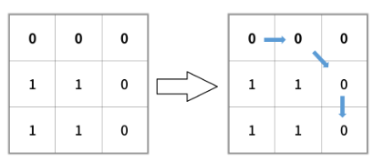

# 复杂度

***O(1)*** ：常数级，不随着算法的数据量提升而提升

***O(N)***：线性级，随数据量提升复杂度


# 算法思想


## 二分查找

1. *将数据**排序***
2. *指针定位**中间***
3. *目标元素与指针指向元素比较，根据比较关系确定指针下一步走向*


**时间复杂度**：每次将查找区间减半 O(logN)

```
Input : [1,2,3,4,5]
key : 3
return the index : 2
```

```java
public int binarySearch(int[] nums, int key) {
    int l = 0, h = nums.length - 1;
    while (l <= h) {
        int m = l + (h - l) / 2;
        if (nums[m] == key) {
            return m;
        } else if (nums[m] > key) {
            h = m - 1;
        } else {
            l = m + 1;
        }
    }
    return -1;
}
```


**mid 计算**

- m = (l + h) / 2
- ***m = l + (h - l) / 2（推荐）*** 

l 和 h 都为正数，l + h 可能出现加法溢出，也就是说加法的结果大于整型能够表示的范围。 


**未成功查找的返回值**

循环退出时如果仍然没有查找到 key，那么表示查找失败。可以有两种返回值：

- -1：以一个错误码表示没有查找到 key
- l：将 key 插入到 nums 中的正确位置


**变种**

二分查找可以有很多变种，实现变种要注意边界值的判断。


1. *目标元素重复则**取最左边的***

   ~~~java
   public int binarySearch(int[] nums, int key) {
       int l = 0, h = nums.length;
       while (l < h) {
           int m = l + (h - l) / 2;
           if (nums[m] >= key) {
               h = m;
           } else {
               l = m + 1;
           }
       }
       return l;
   }
   ~~~


## 双指针

双指针与二分查找有相似之处，二分查找需要左、右边界确定中间指针，双指针需要左、右指针。

双指针有三个对象：

- 左指针
- 右指针
- 对左右指针进行判定的第三方


### 1. 两数之和

题目描述：在有序数组中找出两个数，使它们的和为 target。

```
Input: numbers={2, 7, 11, 15}, target=9
Output: index1=1, index2=2
```

使用双指针，head指向数组第一个元素，tail指向最后一个元素。

- 如果两个指针指向元素的和 sum == target，那么得到要求的结果；
- 如果 sum > target，tail向左移动，使 sum 变小；
- 如果 sum < target，head向右移动，使 sum 变大。


数组中的元素最多遍历一次，时间复杂度为 O(N)。

只使用了两个额外变量，空间复杂度为 O(1)。

```java
public int[] twoSum(int[] numbers, int target) {
    if (numbers == null) return null;
    int i = 0, j = numbers.length - 1;
    while (i < j) {
        int sum = numbers[i] + numbers[j];
        if (sum == target) {
            return new int[]{i + 1, j + 1};
        } else if (sum < target) {
            i++;
        } else {
            j--;
        }
    }
    return null;
}
```


### 2. 三数之和

ThreeSum 用于统计一个数组中和为 0 的三元组数量。

```java
public interface ThreeSum {
    int count(int[] nums);
}
```

#### ThreeSumSlow

该算法的内循环为 `if (nums[i] + nums[j] + nums[k] == 0)` 语句，总共执行的次数为 N(N-1)(N-2) = N^3^/6 - N^2^/2 + N/3，因此它的近似执行次数为 ~N^3^/6，增长数量级为 O(N^3^)。

```java
public class ThreeSumSlow implements ThreeSum {
    @Override
    public int count(int[] nums) {
        int N = nums.length;
        int cnt = 0;
        for (int i = 0; i < N; i++) {
            for (int j = i + 1; j < N; j++) {
                for (int k = j + 1; k < N; k++) {
                    if (nums[i] + nums[j] + nums[k] == 0) {
                        cnt++;
                    }
                }
            }
        }
        return cnt;
    }
}
```

#### ThreeSumBinarySearch

将数组进行排序，对两个元素求和，并用二分查找方法查找是否存在该和的相反数，如果存在，就说明存在和为 0 的三元组。

该方法可以将 ThreeSum 算法增长数量级降低为 O(N^2^logN)

> 只有数组不含有相同元素才能使用这种解法，否则二分查找的结果会出错。

```java
public class ThreeSumBinarySearch implements ThreeSum {

    @Override
    public int count(int[] nums) {
        Arrays.sort(nums);
        int N = nums.length;
        int cnt = 0;
        for (int i = 0; i < N; i++) {
            for (int j = i + 1; j < N; j++) {
                int target = -nums[i] - nums[j];
                int index = BinarySearch.search(nums, target);
                
                // 应该注意这里的下标必须大于 j，否则会重复统计
                if (index > j) {
                    cnt++;
                }
            }
        }
        return cnt;
    }
}
```

```java
public class BinarySearch {

    public static int search(int[] nums, int target) {
        int l = 0, h = nums.length - 1;
        while (l <= h) {
            int m = l + (h - l) / 2;
            if (target == nums[m]) {
                return m;
            } else if (target > nums[m]) {
                l = m + 1;
            } else {
                h = m - 1;
            }
        }
        return -1;
    }
}
```

```java
// 应该注意这里的下标必须大于 j，否则会重复统计
if (index > j) {
	cnt++;
}
```


比如，-3 -2 5一组，可能的索引是：

- 以-3 和 -2 为两数和相反数查找的 5，则索引为0 1 5
- 以-2 和 5 为两数和相反数查找的 -3，则索引为1 5 0

所以，对于二分查找的索引 index > j 表示是第一次出现这三个数的组合，可以 +1


#### ThreeSumTwoPointer

更有效的方法是先将数组排序，选定一个数，然后使用双指针之和进行查找相反数，时间复杂度为 O(N2)。

> 同样不适用与数组存在重复元素的情况。

```java
public class ThreeSumTwoPointer implements ThreeSum {

    @Override
    public int count(int[] nums) {
        int N = nums.length;
        int cnt = 0;
        Arrays.sort(nums);
        for (int i = 0; i < N - 2; i++) {
            int l = i + 1, h = N - 1, target = -nums[i];
            while (l < h) {
                int sum = nums[l] + nums[h];
                if (sum == target) {
                    cnt++;
                    l++;
                    h--;
                } else if (sum < target) {
                    l++;
                } else {
                    h--;
                }
            }
        }
        return cnt;
    }
}
```


### 3. 两数平方和

题目描述：判断一个非负整数是否为两个整数的平方和。

```
Input: 5
Output: True
Explanation: 1 * 1 + 2 * 2 = 5
```

思路：在 0~target 的有序数组中查找两个数，使得这两个数的平方和为 target，如果能找到，则返回 true。


对右指针的初始化，实现剪枝，从而降低时间复杂度。

左指针固定为 0，右指针初始化为 j = sqrt(target)。


时间复杂度：遍历一次 0~sqrt(target)，为 O(sqrt(target))

空间复杂度：左右指针 O(1)

```java
 public boolean judgeSquareSum(int target) {
     if (target < 0) return false;
     int i = 0, j = (int) Math.sqrt(target);
     while (i <= j) {
         int powSum = i * i + j * j;
         if (powSum == target) {
             return true;
         } else if (powSum > target) {
             j--;
         } else {
             i++;
         }
     }
     return false;
 }
```


### 4. 回文字符串

题目描述：删除一个字符，判断是否能构成回文字符串。

> 回文字符串：左右对称特点的字符串，如 "abcba"、"abba"

```
Input: "abca"
Output: True
Explanation: You could delete the character 'c'.
```

两个指针同时移动一个位置，每次都判断两个指针指向的字符是否相同，如果都相同，是回文字符串。


==处理删除一个字符==

在使用双指针遍历字符串时，如果出现两个指针指向的字符不相等的情况，我们就试着删除一个字符，再判断删除完之后的字符串是否是回文字符串。

```java
public boolean validPalindrome(String s) {
    for (int i = 0, j = s.length() - 1; i < j; i++, j--) {
        if (s.charAt(i) != s.charAt(j)) {
            return isPalindrome(s, i + 1, j) || isPalindrome(s, i , j - 1);
        }
    }
    return true;
}

private boolean isPalindrome(String s, int i, int j) {
    while (i < j) {
        if (s.charAt(i++) != s.charAt(j--)) {
            return false;
        }
    }
    return true;
}
```


### 6. 最长子序列

题目描述：删除 s 中的一些字符，使得它构成字符串列表 d 中的一个字符串，找出能构成的最长字符串。如果有多个相同长度的结果，返回字典序的最小字符串。

```
Input:
s = "abpcplea", d = ["ale","apple","monkey","plea"]

Output:
"apple"
```


通过删除字符串 s 中的一个字符能得到字符串 t，可以认为 t 是 s 的子序列，我们可以使用双指针来判断一个字符串是否为另一个字符串的子序列。

```java
public String findLongestWord(String s, List<String> d) {
    String longestWord = "";
    for (String target : d) {
        int l1 = longestWord.length(), l2 = target.length();
        
        // l1是目前为止最长子序列，l2 < l1，抛弃 l2
        // 如果l1 == l2 是长度一样，如果l2字典序大，直接比比较
        if (l1 > l2 || (l1 == l2 && longestWord.compareTo(target) < 0)) {
            continue;
        }
        if (isSubstr(s, target)) {
            longestWord = target;
        }
    }
    return longestWord;
}

// 双指针判断 t是否是s的子序列
private boolean isSubstr(String s, String target) {
    int i = 0, j = 0;
    while (i < s.length() && j < target.length()) {
        if (s.charAt(i) == target.charAt(j)) {
            j++;
        }
        i++;
    }
    return j == target.length();
}
```


## 排序

### 快速选择


#### 1. 第 K 个元素

题目描述：找到倒数第 k 个的元素。

```
Input: [3,2,1,5,6,4] and k = 2
Output: 5
```


**快速排序** ：时间复杂度 O(NlogN)，空间复杂度 O(1)

```java
public int findKthLargest(int[] nums, int k) {
    Arrays.sort(nums);
    return nums[nums.length - k];
}
```

可以使用快速排序的 partition() 进行实现。需要先打乱数组，否则最坏情况下时间复杂度为 O(N2)。


#### 2. 荷兰国旗问题

荷兰国旗包含三种颜色：红、白、蓝。

有三种颜色的球，算法的目标是将这三种球按颜色顺序正确地排列。它其实是三向切分快速排序的一种变种，在三向切分快速排序中，每次切分都将数组分成三个区间：小于切分元素、等于切分元素、大于切分元素，而该算法是将数组分成三个区间：等于红色、等于白色、等于蓝色。


##### 1. 按颜色进行排序

\75. Sort Colors (Medium)

[Leetcode](https://leetcode.com/problems/sort-colors/description/) / [力扣](https://leetcode-cn.com/problems/sort-colors/description/)

```
Input: [2,0,2,1,1,0]
Output: [0,0,1,1,2,2]
```

题目描述：只有 0/1/2 三种颜色。

```java
public void sortColors(int[] nums) {
    int zero = -1, one = 0, two = nums.length;
    while (one < two) {
        if (nums[one] == 0) {
            swap(nums, ++zero, one++);
        } else if (nums[one] == 2) {
            swap(nums, --two, one);
        } else {
            ++one;
        }
    }
}

private void swap(int[] nums, int i, int j) {
    int t = nums[i];
    nums[i] = nums[j];
    nums[j] = t;
}
```


### 堆

用于求解 **TopK Elements** 问题，也就是 K 个最小元素的问题。


#### 第 K 个元素

[Leetcode](https://leetcode.com/problems/kth-largest-element-in-an-array/description/) / [力扣](https://leetcode-cn.com/problems/kth-largest-element-in-an-array/description/)

题目描述：找到第 k 大的元素。

```
Input: [3,2,1,5,6,4] and k = 2
Output: 5
```


1. 构造一个容量为 2 的最小堆，小顶堆是指最小值在堆顶。

2. 堆构造过程，遇到比堆顶大的元素——加入，比堆顶小的元素——抛弃。

   > Java 的优先队列 PriorityQueue

3. 当堆构造完成 堆的容量K 就是 数组中排名前K 的元素。


时间复杂度 O(NlogK)，空间复杂度 O(K)。

不断地往大顶堆中插入新元素，当堆中元素的数量大于 k 时，移除堆顶元素，也就是当前堆中最大的元素，剩下的元素都为当前添加过的元素中最小的 K 个元素。插入和移除堆顶元素的时间复杂度都为 log2N。


```java
public int findKthLargest(int[] nums, int k) {
    PriorityQueue<Integer> pq = new PriorityQueue<>(); // 小顶堆
    for (int val : nums) {
        pq.add(val);
        if (pq.size() > k)  // 维护堆的大小为 K
            pq.poll();
    }
    return pq.peek();
}
```

**快速选择** ：时间复杂度 O(N)，空间复杂度 O(1)

```java
public int findKthLargest(int[] nums, int k) {
    k = nums.length - k;
    int l = 0, h = nums.length - 1;
    while (l < h) {
        int j = partition(nums, l, h);
        if (j == k) {
            break;
        } else if (j < k) {
            l = j + 1;
        } else {
            h = j - 1;
        }
    }
    return nums[k];
}

private int partition(int[] a, int l, int h) {
    int i = l, j = h + 1;
    while (true) {
        while (a[++i] < a[l] && i < h) ;
        while (a[--j] > a[l] && j > l) ;
        if (i >= j) {
            break;
        }
        swap(a, i, j);
    }
    swap(a, l, j);
    return j;
}

private void swap(int[] a, int i, int j) {
    int t = a[i];
    a[i] = a[j];
    a[j] = t;
}
```

快速选择也可以求解 TopK Elements 问题，因为找到 Kth Element 之后，再遍历一次数组，所有小于等于 Kth Element 的元素都是 TopK Elements。

可以看到，快速选择和堆排序都可以求解 Kth Element 和 TopK Elements 问题。


## 贪心

*保证每次操作都是局部最优的，并且最后得到的结果是全局最优的。*


### 1. 分配饼干

题目描述：每个孩子都有一个满足度 grid，每个饼干都有一个大小 size，只有饼干的大小大于等于一个孩子的满足度，该孩子才会获得满足。求解最多可以获得满足的孩子数量。

```
Input: grid[1,3], size[1,2,4]
Output: 2
```


1. 给一个孩子的饼干应当尽量小并且又能满足该孩子，这样大饼干才能拿来给满足度比较大的孩子。
2. 因为满足度最小的孩子最容易得到满足，所以先满足满足度最小的孩子。

在以上的解法中，我们只在每次分配时饼干时选择一种看起来是当前最优的分配方法，但无法保证这种局部最优的分配方法最后能得到全局最优解。


```java
public int findContentChildren(int[] grid, int[] size) {
    if (grid == null || size == null) return 0;
    Arrays.sort(grid);
    Arrays.sort(size);
    int gi = 0, si = 0;
    while (gi < grid.length && si < size.length) {
        if (grid[gi] <= size[si]) {
            gi++;
        }
        si++;
    }
    return gi;
}
```


### 2. 重叠区间数

题目描述：让一组区间不重叠所需要移除的区间个数，[1, 2] 和 [2, 3] 中 2 不算是重叠区间，不需要移除。

```
Input: [ [1,2], 
		 [1,2], 
		 [1,2] ]
Output: 2

Input: [ [1,2], 
		 [2,3] ]
Output: 0

```


思路：

按区间的结尾进行排序，每次选择结尾最小，并且和前一个区间不重叠的区间。

在每次选择中，区间的结尾最为重要，选择的区间结尾越小，留给后面的区间的空间越大，那么后面能够选择的区间个数也就越大。


```java
public int eraseOverlapIntervals(int[][] intervals) {
    if (intervals.length == 0) {
        return 0;
    }
    
    Arrays.sort(intervals, new Comparator<int[]>() {
     @Override
     public int compare(int[] o1, int[] o2) {
         return (o1[1] < o2[1]) ? -1 : ((o1[1] == o2[1]) ? 0 : 1);
     }
});
    
    int cnt = 1;
    int end = intervals[0][1];
    for (int i = 1; i < intervals.length; i++) {
        if (intervals[i][0] < end) {
            continue;
        }
        end = intervals[i][1];
        cnt++;
    }
    return intervals.length - cnt;
}
```

实现 compare() 函数时避免使用 `return o1[1] - o2[1];` 这种减法操作，防止溢出。


### 3. 投飞镖刺破气球

题目描述：气球在一个水平数轴上摆放，可以重叠，飞镖垂直投向坐标轴，使得路径上的气球都被刺破。求解最小的投飞镖次数使所有气球都被刺破。[1, 2] 和 [2, 3] 中2算是重叠区间。

```
Input: [[10,16], [2,8], [1,6], [7,12]]
Output: 2
```

```java
public int findMinArrowShots(int[][] points) {
    if (points.length == 0) {
        return 0;
    }
    Arrays.sort(points, Comparator.comparingInt(o -> o[1]));
    int cnt = 1, end = points[0][1];
    for (int i = 1; i < points.length; i++) {
        if (points[i][0] <= end) {
            continue;
        }
        cnt++;
        end = points[i][1];
    }
    return cnt;
}
```


### 4. 根据身高和序号排队

题目描述：一个学生用两个分量 (h, k) 描述，h 表示身高，k 表示排在前面的有 k 个学生的身高比他高或者和他一样高。

```
Input:
[[7,0], [4,4], [7,1], [5,0], [6,1], [5,2]]

Output:
[[5,0], [7,0], [5,2], [6,1], [4,4], [7,1]]
```


思路：身高 h 降序、个数 k 值升序，然后将某个学生插入队列的第 k 个位置中。

```
[[7, 0], [7, 1], [6, 1], [5, 0], [5, 2], [4, 4]]
```

利用list集合的 add(index,element) 方法，指定位置加入指定元素。当指定位置已经存在元素，则旧元素索引加1

加入过程如下：

```
0： [7, 0]
1： [7, 1]
此时加入：[6, 1]  //1的索引位置 已经存在[7, 1]，那么[6, 1]会占用1的位置，[7, 1]索引加1

0： [7, 0]
1： [6, 1]
2： [7, 1]
```

为了使插入操作不影响后续的操作，身高较高的学生应该先做插入操作，因为较矮的学生后续插入在前方不会影响较高的学生前面比他高的人数。

```java
public int[][] reconstructQueue(int[][] people) {
    if (people == null || people.length == 0 || people[0].length == 0) {
        return new int[0][0];
    }
    Arrays.sort(people, (a, b) -> (a[0] == b[0] ? a[1] - b[1] : b[0] - a[0]));
    List<int[]> queue = new ArrayList<>();
    for (int[] p : people) {
        queue.add(p[1], p);
    }
    return queue.toArray(new int[queue.size()][]);
}
```


### 5. 种植花朵

\605. Can Place Flowers (Easy)

[Leetcode](https://leetcode.com/problems/can-place-flowers/description/) / [力扣](https://leetcode-cn.com/problems/can-place-flowers/description/)

```
Input: flowerbed = [1,0,0,0,1], n = 1
Output: True
```

题目描述：flowerbed 数组中 1 表示已经种下了花朵。花朵之间至少需要一个单位的间隔，求解是否能种下 n 朵花。

```java
public boolean canPlaceFlowers(int[] flowerbed, int n) {
    int len = flowerbed.length;
    int cnt = 0;
    for (int i = 0; i < len && cnt < n; i++) {
        if (flowerbed[i] == 1) {
            continue;
        }
        int pre = i == 0 ? 0 : flowerbed[i - 1];
        int next = i == len - 1 ? 0 : flowerbed[i + 1];
        if (pre == 0 && next == 0) {
            cnt++;
            flowerbed[i] = 1;
        }
    }
    return cnt >= n;
}
```


### 6. 判断是否为子序列

\392. Is Subsequence (Medium)

[Leetcode](https://leetcode.com/problems/is-subsequence/description/) / [力扣](https://leetcode-cn.com/problems/is-subsequence/description/)

题目描述：给定字符串 s 和 t ，判断 s 是否为 t 的子序列。

字符串的一个子序列是原始字符串删除一些（也可以不删除）字符而不改变剩余字符相对位置形成的新字符串。（例如，"ace"是"abcde"的一个子序列，而"aec"不是）。

```
s = "abc", t = "ahbgdc"
Return true.
```

```java
public boolean isSubsequence(String s, String t) {
    int index = -1;
    for (char c : s.toCharArray()) {
        //indexOf() 从t中寻找c字符，指定从index+1位置开始寻找
        index = t.indexOf(c, index + 1);
        if (index == -1) {
            return false;
        }
    }
    return true;
}
```


## 分治


## 搜索

### BFS


每当访问一个节点，记录节点所有可访问的节点，然后根据顺序访问这些节点，重复这个过程。

访问起点 0

- 0 -> {6,2,1,5}

访问起点 0 所有可访问的节点

- 6 -> {4}
- 2 -> {}
- 1 -> {}
- 5 -> {3}

接下来访问 6 ，以此类推


每一层遍历的节点都与根节点距离相同。设 di 表示第 i 个节点与根节点的距离，推导出一个结论：对于先遍历的节点 i 与后遍历的节点 j，有 di <= dj。利用这个结论，可以求解最短路径等 **最优解** 问题：第一次遍历到目的节点，其所经过的路径为最短路径。

应该注意的是，使用 BFS 只能求解无权图的最短路径，无权图是指从一个节点到另一个节点的代价都记为 1。

在程序实现 BFS 时需要考虑以下问题：

- 队列：用来存储每一轮遍历得到的节点；
- 标记：对于遍历过的节点，应该将它标记，防止重复遍历。


#### 1. 迷宫最短路径

给你一个 `n x n` 的二进制矩阵 grid 中，返回矩阵中最短 **畅通路径** 的长度。如果不存在这样的路径，返回 -1 。

二进制矩阵中的 畅通路径 是一条从 **左上角** 单元格（即，(0, 0)）到 右下角 单元格（即，(n - 1, n - 1)）的路径，该路径同时满足下述要求：

- 路径途经的所有单元格都的值都是 0 。
- 路径中所有相邻的单元格应当在 8 个方向之一 上连通（即，相邻两单元之间彼此不同且共享一条边或者一个角）。

**畅通路径的长度** 是该路径途经的单元格总数。


```
输入：grid = [[0,1],[1,0]]
输出：2
```



```
输入：grid = [[0,0,0],[1,1,0],[1,1,0]]
输出：4
```

```java
public int shortestPathBinaryMatrix(int[][] grids) {
        if (grids == null || grids.length == 0 || grids[0].length == 0) {
            return -1;
        }
        int[][] direction = {{1, -1}, {1, 0}, {1, 1}, {0, -1}, {0, 1}, {-1, -1}, {-1, 0}, {-1, 1}};
        int m = grids.length, n = grids[0].length;
        Queue<Pair<Integer, Integer>> queue = new LinkedList<>();
        queue.add(new Pair<>(0, 0));
        int pathLength = 0;
        while (!queue.isEmpty()) {
            int size = queue.size();
            pathLength++;
            while (size-- > 0) {
                Pair<Integer, Integer> cur = queue.poll();
                int cr = cur.getKey(), cc = cur.getValue();
                if (grids[cr][cc] == 1) {
                    continue;
                }
                if (cr == m - 1 && cc == n - 1) {
                    return pathLength;
                }
                grids[cr][cc] = 1; // 标记
                for (int[] d : direction) {
                    int nr = cr + d[0], nc = cc + d[1];
                    if (nr < 0 || nr >= m || nc < 0 || nc >= n) {
                        continue;
                    }
                    queue.add(new Pair<>(nr, nc));
                }
            }
        }
        return -1;
    }
```


#### 2. 组成整数的最小平方数数量

给你一个整数 n ，返回 和为 n 的完全平方数的最少数量 。

完全平方数 是一个整数，其值等于另一个整数的平方；换句话说，其值等于一个整数自乘的积。例如，1、4、9 和 16 都是完全平方数，而 3 和 11 不是。

```
输入：n = 12
输出：3 
解释：12 = 4 + 4 + 4
```

```
输入：n = 13
输出：2
解释：13 = 4 + 9
```

可以将每个完全平方数看成图中的一个节点，给定整数也是一个节点，从给定整数出发，不断减去完全平方数，当相减为0，返回相减次数（level），也就是最小的平方数数量。

要求解最小的平方数数量，就是求解从节点 n 到节点 0 的最短路径。


本题也可以用动态规划求解，在之后动态规划部分中会再次出现。

```java
public int numSquares(int n) {
    List<Integer> squares = generateSquares(n);
    Queue<Integer> queue = new LinkedList<>();
    boolean[] marked = new boolean[n + 1];
    queue.add(n);
    marked[n] = true;
    int level = 0;
    while (!queue.isEmpty()) {
        int size = queue.size();
        level++;
        while (size-- > 0) {
            int cur = queue.poll();
            for (int s : squares) {
                int next = cur - s;
                if (next < 0) {
                    break;
                }
                if (next == 0) {
                    return level;
                }
                if (marked[next]) {
                    continue;
                }
                marked[next] = true;
                queue.add(next);
            }
        }
    }
    return n;
}

/**
 * 生成小于 n 的平方数序列
 * @return 1,4,9,...
 */
private List<Integer> generateSquares(int n) {
    List<Integer> squares = new ArrayList<>();
    int square = 1;
    int diff = 3;
    while (square <= n) {
        squares.add(square);
        square += diff;
        diff += 2;
    }
    return squares;
}
```


### DFS

从一个节点出发，使用 DFS 对一个图进行遍历时，能够遍历到的节点都是从初始节点可达的，DFS 常用来求解这种 **可达性** 问题。

在程序实现 DFS 时需要考虑以下问题：

- 栈：用栈来保存当前节点信息，当遍历新节点返回时能够继续遍历当前节点。可以使用递归栈。
- 标记：和 BFS 一样同样需要对已经遍历过的节点进行标记。


#### 1.岛屿最大面积

\695. Max Area of Island (Medium)

[Leetcode](https://leetcode.com/problems/max-area-of-island/description/) / [力扣](https://leetcode-cn.com/problems/max-area-of-island/description/)

给你一个大小为 m x n 的二进制矩阵 grid 。

岛屿 是由一些相邻的 1 (代表土地) 构成的组合，这里的「相邻」要求两个 1 必须在 水平或者竖直的四个方向上 相邻。你可以假设 grid 的四个边缘都被 0（代表水）包围着。

岛屿的面积是岛上值为 1 的单元格的数目。

计算并返回 grid 中最大的岛屿面积。如果没有岛屿，则返回面积为 0 。

 

```
输入：grid = [
[0,0,1,0,0,0,0,1,0,0,0,0,0],
[0,0,0,0,0,0,0,1,1,1,0,0,0],
[0,1,1,0,1,0,0,0,0,0,0,0,0],
[0,1,0,0,1,1,0,0,1,0,1,0,0],
[0,1,0,0,1,1,0,0,1,1,1,0,0],
[0,0,0,0,0,0,0,0,0,0,1,0,0],
[0,0,0,0,0,0,0,1,1,1,0,0,0],
[0,0,0,0,0,0,0,1,1,0,0,0,0]]

输出：6
解释：答案不应该是 11 ，因为岛屿只能包含水平或垂直这四个方向上的 1 
```

```java
private int m, n;
private int[][] direction = {{0, 1}, {0, -1}, {1, 0}, {-1, 0}};

public int maxAreaOfIsland(int[][] grid) {
    if (grid == null || grid.length == 0) {
        return 0;
    }
    m = grid.length;
    n = grid[0].length;
    int maxArea = 0;
    for (int i = 0; i < m; i++) {
        for (int j = 0; j < n; j++) {
            maxArea = Math.max(maxArea, dfs(grid, i, j));
        }
    }
    return maxArea;
}

private int dfs(int[][] grid, int r, int c) {
    if (r < 0 || r >= m || c < 0 || c >= n || grid[r][c] == 0) {
        return 0;
    }
    grid[r][c] = 0;
    int area = 1;
    for (int[] d : direction) {
        area += dfs(grid, r + d[0], c + d[1]);
    }
    return area;
}
```


#### 2.岛屿数量

[200. 岛屿数量](https://leetcode.cn/problems/number-of-islands/)

给你一个由 '1'（陆地）和 '0'（水）组成的的二维网格，请你计算网格中岛屿的数量。

岛屿总是被水包围，并且每座岛屿只能由水平方向和/或竖直方向上相邻的陆地连接形成。

此外，你可以假设该网格的四条边均被水包围。

```
输入：grid = [
  ["1","1","0","0","0"],
  ["1","1","0","0","0"],
  ["0","0","1","0","0"],
  ["0","0","0","1","1"]
]
输出：3
```

思路：遍历数组，遇到1，把和这个1联通的格子1全变成0，后续就不会统计和这个1连通的1格子。


```java
private int m, n;
private int[][] direction = {{0, 1}, {0, -1}, {1, 0}, {-1, 0}};

public int numIslands(char[][] grid) {
    if (grid == null || grid.length == 0) {
        return 0;
    }
    m = grid.length;
    n = grid[0].length;
    int islandsNum = 0;
    for (int i = 0; i < m; i++) {
        for (int j = 0; j < n; j++) {
            if (grid[i][j] != '0') {
                dfs(grid, i, j);
                islandsNum++;
            }
        }
    }
    return islandsNum;
}

private void dfs(char[][] grid, int i, int j) {
    if (i < 0 || i >= m || j < 0 || j >= n || grid[i][j] == '0') {
        return;
    }
    grid[i][j] = '0';
    for (int[] d : direction) {
        dfs(grid, i + d[0], j + d[1]);
    }
}
```


#### 3.填充封闭区域

\130. Surrounded Regions (Medium)

[Leetcode](https://leetcode.com/problems/surrounded-regions/description/) / [力扣](https://leetcode-cn.com/problems/surrounded-regions/description/)

题目描述：使被 'X' 包围的 'O' 转换为 'X'。

```
For example,
X X X X
X O O X
X X O X
X O X X

After running your function, the board should be:
X X X X
X X X X
X X X X
X O X X
```

思路：从成立条件思考，成立条件有明显的边界。从边界反推。

遍历最外侧，如果最外侧都是x，那么全部都被包围；如果最外侧有o，有缺口，那么从缺口出发将和缺口联通的格子mark，未被mark的都是被包围的。


```java
private int[][] direction = {{0, 1}, {0, -1}, {1, 0}, {-1, 0}};
private int m, n;

public void solve(char[][] board) {
    if (board == null || board.length == 0) {
        return;
    }

    m = board.length;
    n = board[0].length;

    for (int i = 0; i < m; i++) {
        dfs(board, i, 0);
        dfs(board, i, n - 1);
    }
    for (int i = 0; i < n; i++) {
        dfs(board, 0, i);
        dfs(board, m - 1, i);
    }

    for (int i = 0; i < m; i++) {
        for (int j = 0; j < n; j++) {
            if (board[i][j] == 'T') {
                board[i][j] = 'O';
            } else if (board[i][j] == 'O') {
                board[i][j] = 'X';
            }
        }
    }
}

private void dfs(char[][] board, int r, int c) {
    if (r < 0 || r >= m || c < 0 || c >= n || board[r][c] != 'O') {
        return;
    }
    board[r][c] = 'T';
    for (int[] d : direction) {
        dfs(board, r + d[0], c + d[1]);
    }
}
```


#### 4.太平洋和大西洋水流

有一个 `m × n` 的矩形岛屿，与 **太平洋** 和 **大西洋** 相邻。 “太平洋” 处于大陆的左边界和上边界，而 “大西洋” 处于大陆的右边界和下边界。

这个岛被分割成一个由若干方形单元格组成的网格，单元格表示 **高于海平面的高度** 。

岛上雨水较多，如果相邻单元格的高度 小于或等于 当前单元格的高度，雨水可以直接向北、南、东、西流向相邻单元格。水可以从海洋附近的任何单元格流入海洋。

返回网格坐标 result 的 2D 列表 ，其中 result[i] = [ri, ci] 表示雨水从单元格 (ri, ci) 流动 既可流向太平洋也可流向大西洋 。


```
Given the following 5x5 matrix:

  Pacific ~   ~   ~   ~   ~
       ~  1   2   2   3  (5) *
       ~  3   2   3  (4) (4) *
       ~  2   4  (5)  3   1  *
       ~ (6) (7)  1   4   5  *
       ~ (5)  1   1   2   4  *
          *   *   *   *   * Atlantic

Return:
[[0, 4], [1, 3], [1, 4], [2, 2], [3, 0], [3, 1], [4, 0]] (positions with parentheses in above matrix).
```

```java
private int m, n;
private int[][] matrix;
private int[][] direction = {{0, 1}, {0, -1}, {1, 0}, {-1, 0}};

public List<List<Integer>> pacificAtlantic(int[][] matrix) {
    List<List<Integer>> ret = new ArrayList<>();
    if (matrix == null || matrix.length == 0) {
        return ret;
    }

    m = matrix.length;
    n = matrix[0].length;
    this.matrix = matrix;
    boolean[][] canReachP = new boolean[m][n];
    boolean[][] canReachA = new boolean[m][n];

    for (int i = 0; i < m; i++) {
        dfs(i, 0, canReachP);
        dfs(i, n - 1, canReachA);
    }
    for (int i = 0; i < n; i++) {
        dfs(0, i, canReachP);
        dfs(m - 1, i, canReachA);
    }

    for (int i = 0; i < m; i++) {
        for (int j = 0; j < n; j++) {
            if (canReachP[i][j] && canReachA[i][j]) {
                ret.add(Arrays.asList(i, j));
            }
        }
    }

    return ret;
}

private void dfs(int r, int c, boolean[][] canReach) {
    if (canReach[r][c]) {
        return;
    }
    canReach[r][c] = true;
    for (int[] d : direction) {
        int nextR = d[0] + r;
        int nextC = d[1] + c;
        if (nextR < 0 || nextR >= m || nextC < 0 || nextC >= n
                || matrix[r][c] > matrix[nextR][nextC]) {

            continue;
        }
        dfs(nextR, nextC, canReach);
    }
}
```


## Backtracking

Backtracking（回溯）属于 DFS。

- 普通 DFS 主要用在 **可达性问题** ，这种问题只需要执行到特点的位置然后返回即可。
- 而 Backtracking 主要用于求解 **排列组合** 问题，例如有 { 'a','b','c' } 三个字符，求解所有由这三个字符排列得到的字符串，这种问题在执行到特定的位置返回之后还会继续执行求解过程。

因为 Backtracking 不是立即返回，而要继续求解，因此在程序实现时，需要注意对元素的标记问题：

- 在访问一个新元素进入新的递归调用时，需要将新元素标记为已经访问，这样才能在继续递归调用时不用重复访问该元素；
- 但是在递归返回时，需要将元素标记为未访问，因为只需要保证在一个递归链中不同时访问一个元素，可以访问已经访问过但是不在当前递归链中的元素。


#### 1.电话号码的字母组合

[17. 电话号码的字母组合](https://leetcode.cn/problems/letter-combinations-of-a-phone-number/)

给定一个仅包含数字 2-9 的字符串，返回所有它能表示的字母组合。答案可以按 任意顺序 返回。

给出数字到字母的映射如下（与电话按键相同）。注意 1 不对应任何字母。


```
Input:Digit string "23"
Output: ["ad", "ae", "af", "bd", "be", "bf", "cd", "ce", "cf"].
```

```java
private static final String[] KEYS = {"", "", "abc", "def", "ghi", "jkl", "mno", "pqrs", "tuv", "wxyz"};

public List<String> letterCombinations(String digits) {
    List<String> combinations = new ArrayList<>();
    if (digits == null || digits.length() == 0) {
        return combinations;
    }
    doCombination(new StringBuilder(), combinations, digits);
    return combinations;
}

private void doCombination(StringBuilder prefix, List<String> combinations, final String digits) {
    if (prefix.length() == digits.length()) {
        combinations.add(prefix.toString());
        return;
    }
     //根据prefix（不完整答案）的长度确定需要位置的num
    //获取的的char型，本质是ascall码，可以用于计算
    int curDigits = digits.charAt(prefix.length()) - '0';
    
    String letters = KEYS[curDigits];
    for (char c : letters.toCharArray()) {
        prefix.append(c);                         // 添加
        doCombination(prefix, combinations, digits);
        prefix.deleteCharAt(prefix.length() - 1); // 删除
    }
}
```


#### 2.单词搜索

[79. 单词搜索](https://leetcode.cn/problems/word-search/)

给定一个 m x n 二维字符网格 board 和一个字符串单词 word 。如果 word 存在于网格中，返回 true ；否则，返回 false 。

单词必须按照字母顺序，通过相邻的单元格内的字母构成，其中“相邻”单元格是那些水平相邻或垂直相邻的单元格。同一个单元格内的字母不允许被重复使用。


```
输入：board = [["A","B","C","E"],["S","F","C","S"],["A","D","E","E"]],
	 word = "ABCCED"
输出：true

	 word = "see"
输出：true

	 word = "abcb"
输出：flase
```


## 动态规划

### 斐波那契数列

#### 1. 爬楼梯

题目描述：有 N 阶楼梯，每次可以上一阶或者两阶，求有多少种上楼梯的方法。

定义一个数组 dp 存储上楼梯的方法数（为了方便讨论，数组下标从 1 开始），dp[i] 表示走到第 i 个楼梯的方法数目。

第 i 个楼梯可以从第 i-1 和 i-2 个楼梯再走一步到达，走到第 i 个楼梯的方法数为走到第 i-1 和第 i-2 个楼梯的方法数之和。


考虑到 dp[i] 只与 dp[i - 1] 和 dp[i - 2] 有关，因此可以只用两个变量来存储 dp[i - 1] 和 dp[i - 2]，使得原来的 O(N) 空间复杂度优化为 O(1) 复杂度。

```java
public int climbStairs(int n) {
    if (n <= 2) {
        return n;
    }
    int pre2 = 1, pre1 = 2;
    for (int i = 2; i < n; i++) {
        int cur = pre1 + pre2;
        pre2 = pre1;
        pre1 = cur;
    }
    return pre1;
}
```


#### 2. 强盗抢劫

[Leetcode](https://leetcode.com/problems/house-robber/description/) / [力扣](https://leetcode-cn.com/problems/house-robber/description/)

题目描述：

你是一个专业的小偷，计划偷窃沿街的房屋。每间房内都藏有一定的现金，影响你偷窃的唯一制约因素就是相邻的房屋装有相互连通的防盗系统，如果两间相邻的房屋在同一晚上被小偷闯入，系统会自动报警。

给定一个代表每个房屋存放金额的非负整数数组，计算你 不触动警报装置的情况下 ，一夜之内能够偷窃到的最高金额。


思路：

定义 dp 数组用来存储最大的抢劫量，其中 dp[i] 表示抢到第 i 个住户时的最大抢劫量。

由于不能抢劫邻近住户，如果抢劫了第 i -1 个住户，那么就不能再抢劫第 i 个住户，所以


```java
public int rob(int[] nums) {
    int pre2 = 0, pre1 = 0;
    for (int i = 0; i < nums.length; i++) {
        int cur = Math.max(pre2 + nums[i], pre1);
        pre2 = pre1;
        pre1 = cur;
    }
    return pre1;
}
```


# 数据结构类型题

## 链表

### 链表交点


A 和 B 两个链表存在公共部分，求交汇处的节点。

```
A:          a1 → a2
                    ↘
                      c1 → c2 → c3
                    ↗
B:    b1 → b2 → b3
```

设 A 的长度为 a + c，B 的长度为 b + c，其中 c 为尾部公共部分长度

由此可得 **`a + c + b = b + c + a`**

```java
public ListNode getIntersectionNode(ListNode headA, ListNode headB) {
    ListNode l1 = headA, l2 = headB;
    while (l1 != l2) {
        l1 = (l1 == null) ? headB : l1.next;
        l2 = (l2 == null) ? headA : l2.next;
    }
    return l1;
}
```

> 扩展：**是否存在交点**
>
> 判断两个链表的最后一个节点是否相等


### 反转链表

[Leetcode](https://leetcode.com/problems/reverse-linked-list/description/) / [力扣](https://leetcode-cn.com/problems/reverse-linked-list/description/)


1. 反转子链表，并用新节点接收

   ```java
   ListNode newHead = reverseList(head.next)
   ```

   按照预期，newHead.val == 4

   

2. next 节点指向 head

   

3. head 指向 null

   
   
4. 返回 newHead

```java
public ListNode reverseList(ListNode head) {
    if (head == null || head.next == null) {
        return head;
    }
    ListNode newHead = reverseList(head.next);
    head.next.next = head;
    head.next = null;
    return newHead;
}
```


头插法

```java
public ListNode reverseList(ListNode head) {
    ListNode newHead = null;
    while (head != null) {
        ListNode nextNode = head.next;
        head.next = newHead;
        newHead = head;
        head = nextNode;
    }
    return newHead;
}
```


### 3. 链表是否有环

链表存在环路，则可以无限循环。相当于在操场上，无限跑圈。

同理，一个人跑得慢，一个跑得快，跑得快的非常可能在自己的第二圈甚至很多圈后碰到跑得慢的。


```java
public boolean hasCycle(ListNode head) {
    if (head == null) {
        return false;
    }
    ListNode slow = head, fast = head;
    while (fast.next != null && fast.next.next != null) {
        slow = slow.next;
        fast = fast.next.next;
        if (slow == fast) {
            return true;
        }
    }
    return false;
}
```


### 4. 寻找链表环入口的节点


相遇时，两个指针走过的距离：

**快指针路程 = a+（b+c）k+b，k>=1**

**慢指针路程 = a+b**

快指针速度是慢指针的两倍：**（a+b）* 2 = a +（b+c）k+b**

a 在图中表示 链表到环入口的距离，得到 a 即可得到入口节点：**a=（k-1）（b+c）+ c**


所以，**链表头到环入口的距离 = 相遇点到环入口的距离+（k-1）圈数环长度**

两个指针相遇后分别从`链表头`和`相遇点`出发，最后一定相遇于环入口。

```java
public ListNode hasCycle(ListNode head) {
    if (head == null) {
        return null;
    }
    ListNode slow = head, fast = head;
    while (fast.next != null && fast.next.next != null) {
        slow = slow.next;
        fast = fast.next.next;
        if (slow == fast) {
            slow = head;
        	while (slow != fast) {
            	fast = fast.next;
            	slow = slow.next;
        	}
            return slow;
        }
    }
    return null;
}
```


### 5. 合并两个有序的链表

[Leetcode](https://leetcode.com/problems/merge-two-sorted-lists/description/) / [力扣](https://leetcode-cn.com/problems/merge-two-sorted-lists/description/)

比较 l1 当前节点和 l2 当前节点的大小，大的节点继续和小的后续节点比较。

```java
public ListNode mergeTwoLists(ListNode l1, ListNode l2) {
    if (l1 == null) return l2;
    if (l2 == null) return l1;
    if (l1.val < l2.val) {
        l1.next = mergeTwoLists(l1.next, l2);
        return l1;
    } else {
        l2.next = mergeTwoLists(l1, l2.next);
        return l2;
    }
}
```


### 6. 有序链表中删除重复节点

[Leetcode](https://leetcode.com/problems/remove-duplicates-from-sorted-list/description/) / [力扣](https://leetcode-cn.com/problems/remove-duplicates-from-sorted-list/description/)

```java
public ListNode deleteDuplicates(ListNode head) {
    if (head == null || head.next == null) {
        return head;
    }
    head.next = deleteDuplicates(head.next);
    return head.val == head.next.val ? head.next : head;
}
```


### 7. 删除链表的倒数第 n 个节点

[Leetcode](https://leetcode.com/problems/remove-nth-node-from-end-of-list/description/) / [力扣](https://leetcode-cn.com/problems/remove-nth-node-from-end-of-list/description/)

fast 先走 n 次，然后 slow 和 fast 一起走，当fast走到尾，slow走到了倒数第n个节点前置节点

```java
public ListNode removeNthFromEnd(ListNode head, int n) {
    ListNode fast = head;
    while (n-- > 0) {
        fast = fast.next;
    }
    if (fast == null) return head.next;
    ListNode slow = head;
    while (fast.next != null) {
        fast = fast.next;
        slow = slow.next;
    }
    slow.next = slow.next.next;
    return head;
}
```


### 8. 交换链表中的相邻结点

[Leetcode](https://leetcode.com/problems/swap-nodes-in-pairs/description/) / [力扣](https://leetcode-cn.com/problems/swap-nodes-in-pairs/description/)

交换相当于当前节点（head）指向下一节点（head.next）的下一节点（head.next.next）


返回值是 head.next ，交换后 head.next 是头节点了。

```java
public ListNode swapPairs(ListNode head) {
    if(head == null || head.next == null){
        return head;
    }
    ListNode next = head.next;
    head.next = swapPairs(next.next);
    next.next = head;
    return next;
}
```


### 9. 链表求和

[Leetcode](https://leetcode.com/problems/add-two-numbers-ii/description/) / [力扣](https://leetcode-cn.com/problems/add-two-numbers-ii/description/)

```
Input: (7 -> 2 -> 4 -> 3) + (5 -> 6 -> 4)
Output: 7 -> 8 -> 0 -> 7
```

题目要求：不能修改原始链表。

思路：链表入栈

```java
public ListNode addTwoNumbers(ListNode l1, ListNode l2) {
    Stack<Integer> l1Stack = buildStack(l1);
    Stack<Integer> l2Stack = buildStack(l2);
    ListNode head = new ListNode(-1);
    int carry = 0;
    while (!l1Stack.isEmpty() || !l2Stack.isEmpty() || carry != 0) {
        int x = l1Stack.isEmpty() ? 0 : l1Stack.pop();
        int y = l2Stack.isEmpty() ? 0 : l2Stack.pop();
        int sum = x + y + carry;
        ListNode node = new ListNode(sum % 10);
        node.next = head.next;
        head.next = node;
        carry = sum / 10;
    }
    return head.next;
}

private Stack<Integer> buildStack(ListNode l) {
    Stack<Integer> stack = new Stack<>();
    while (l != null) {
        stack.push(l.val);
        l = l.next;
    }
    return stack;
}
```


### 8. 回文链表

[Leetcode](https://leetcode.com/problems/palindrome-linked-list/description/) / [力扣](https://leetcode-cn.com/problems/palindrome-linked-list/description/)

切成两半，把后半段反转，然后比较两半是否相等。

```java
public boolean isPalindrome(ListNode head) {
    if (head == null || head.next == null) return true;
    ListNode slow = head, fast = head.next;
    while (fast != null && fast.next != null) {
        slow = slow.next;
        fast = fast.next.next;
    }
    if (fast != null) slow = slow.next;  // 偶数节点，让 slow 指向下一个节点
    cut(head, slow);                     // 切成两个链表
    return isEqual(head, reverse(slow));
}

private void cut(ListNode head, ListNode cutNode) {
    while (head.next != cutNode) {
        head = head.next;
    }
    head.next = null;
}

private ListNode reverse(ListNode head) {
    ListNode newHead = null;
    while (head != null) {
        ListNode nextNode = head.next;
        head.next = newHead;
        newHead = head;
        head = nextNode;
    }
    return newHead;
}

private boolean isEqual(ListNode l1, ListNode l2) {
    while (l1 != null && l2 != null) {
        if (l1.val != l2.val) return false;
        l1 = l1.next;
        l2 = l2.next;
    }
    return true;
}
```


## 树


#### 1. 树高 / 节点数量

[Leetcode](https://leetcode.com/problems/maximum-depth-of-binary-tree/description/) / [力扣](https://leetcode-cn.com/problems/maximum-depth-of-binary-tree/description/)

二叉树的深度为根节点到最远叶子节点的最长路径上的节点数。

    	3
       / \
      9  20
        /  \
       15   7
```java
public int maxDepth(TreeNode root) {
    if (root == null) return 0;
    return Math.max(maxDepth(root.left), maxDepth(root.right)) + 1;
}
```

扩展：树的节点数量

```java
public int size(TreeNode root) {
    if (root == null) return 0;
    return size(root.left) + size(root.right) + 1;
}
```


#### 2. is平衡树

[Leetcode](https://leetcode.com/problems/balanced-binary-tree/description/) / [力扣](https://leetcode-cn.com/problems/balanced-binary-tree/description/)

平衡树每个节点的左右子树高度差都小于等于 1

```java
private boolean result = true;

public boolean isBalanced(TreeNode root) {
    maxDepth(root);
    return result;
}

public int maxDepth(TreeNode root) {
    if (root == null) return 0;
    int l = maxDepth(root.left);
    int r = maxDepth(root.right);
    if (Math.abs(l - r) > 1) result = false;
    return 1 + Math.max(l, r);
}
```


#### 3. 树的最长路径

[Leetcode](https://leetcode.com/problems/diameter-of-binary-tree/description/) / [力扣](https://leetcode-cn.com/problems/diameter-of-binary-tree/description/)

任意两个结点路径长度中的最大值，这条路径可能穿过也可能不穿过根结点，因此，获取每个节点左右子树的树高相加，即是当前节点的最长路径。

          1
         / \
        2   3
       / \     
      4   5    
返回 3（长度）, 它的长度是路径 [4,2,1,3] 或者 [5,2,1,3]。

```java
private int max = 0;

public int diameterOfBinaryTree(TreeNode root) {
    depth(root);
    return max;
}

private int depth(TreeNode root) {
    if (root == null) return 0;
    int leftDepth = depth(root.left);
    int rightDepth = depth(root.right);
    max = Math.max(max, leftDepth + rightDepth);
    return Math.max(leftDepth, rightDepth) + 1;
}
```


#### 4. 翻转树

[Leetcode](https://leetcode.com/problems/invert-binary-tree/description/) / [力扣](https://leetcode-cn.com/problems/invert-binary-tree/description/)

给你一棵二叉树的根节点 root ，翻转这棵二叉树，并返回其根节点。

 

```
输入：root = [4,2,7,1,3,6,9]
输出：[4,7,2,9,6,3,1]
```

思路：左子节点指向翻转后的右子节点，右子节点同理。

```java
public TreeNode invertTree(TreeNode root) {
    if(root == null) return null;
    TreeNode left = root.left;
    root.left = invertTree(root.right);
    root.right = invertTree(left);
    return root;
}
```


```java
利用前序遍历
class Solution {
        // 先序遍历--从顶向下交换
        public TreeNode invertTree(TreeNode root) {
            if (root == null) return null;
            // 保存右子树
            TreeNode rightTree = root.right;
            // 交换左右子树的位置
            root.right = invertTree(root.left);
            root.left = invertTree(rightTree);
            return root;
        }
    }

利用中序遍历
class Solution {
    public TreeNode invertTree(TreeNode root) {
            if (root == null) return null;
            invertTree(root.left); // 递归找到左节点
            TreeNode rightNode= root.right; // 保存右节点
            root.right = root.left;
            root.left = rightNode;
            // 递归找到右节点 继续交换 : 因为此时左右节点已经交换了,所以此时的右节点为root.left
            invertTree(root.left); 
    }
}

利用后序遍历
 class Solution {
        public TreeNode invertTree(TreeNode root) {
            // 后序遍历-- 从下向上交换
            if (root == null) return null;
            TreeNode leftNode = invertTree(root.left);
            TreeNode rightNode = invertTree(root.right);
            root.right = leftNode;
            root.left = rightNode;
            return root;
        }
    }

利用层次遍历
   class Solution {
        public TreeNode invertTree(TreeNode root) {
            // 层次遍历--直接左右交换即可
            if (root == null) return null;
            Queue<TreeNode> queue = new LinkedList<>();
            queue.offer(root);
            while (!queue.isEmpty()){
                TreeNode node = queue.poll();
                TreeNode rightTree = node.right;
                node.right = node.left;
                node.left = rightTree;
                if (node.left != null){
                    queue.offer(node.left);
                }
                if (node.right != null){
                    queue.offer(node.right);
                }
            }
            return root;
        }
    }
```


#### 7. 统计路径和等于一个数的路径数量

\437. Path Sum III (Easy)

[Leetcode](https://leetcode.com/problems/path-sum-iii/description/) / [力扣](https://leetcode-cn.com/problems/path-sum-iii/description/)

```java
root = [10,5,-3,3,2,null,11,3,-2,null,1], sum = 8

      10
     /  \
    5   -3
   / \    \
  3   2   11
 / \   \
3  -2   1

Return 3. The paths that sum to 8 are:

1.  5 -> 3
2.  5 -> 2 -> 1
3. -3 -> 11
```

路径不一定以 root 开头，也不一定以 leaf 结尾，但是必须连续。


双重递归：考虑从根节点开始连续的值，也要考虑以根节点的左右子节点开始的连续值

耗时

```java
public int pathSum(TreeNode root, int sum) {
    if (root == null) return 0;
    int ret = pathSumStartWithRoot(root, sum) + pathSum(root.left, sum) + pathSum(root.right, sum);
    return ret;
}

private int pathSumStartWithRoot(TreeNode root, int sum) {
    if (root == null) return 0;
    int ret = 0;
    if (root.val == sum) ret++;
    ret += pathSumStartWithRoot(root.left, sum - root.val) + pathSumStartWithRoot(root.right, sum - root.val);
    return ret;
}
```


前缀和：超快

```java
class Solution {
    public int pathSum(TreeNode root, int targetSum) {
        Map<Long, Integer> prefix = new HashMap<Long, Integer>();
        prefix.put(0L, 1);
        return dfs(root, prefix, 0, targetSum);
    }

    public int dfs(TreeNode root, Map<Long, Integer> prefix, long curr, int targetSum) {
        if (root == null) {
            return 0;
        }

        int ret = 0;
        curr += root.val;

        ret = prefix.getOrDefault(curr - targetSum, 0);
        prefix.put(curr, prefix.getOrDefault(curr, 0) + 1);
        ret += dfs(root.left, prefix, curr, targetSum);
        ret += dfs(root.right, prefix, curr, targetSum);
        prefix.put(curr, prefix.getOrDefault(curr, 0) - 1);

        return ret;
    }
}
```

#### 8. 是否是其子树

[Leetcode](https://leetcode.com/problems/subtree-of-another-tree/description/) / [力扣](https://leetcode-cn.com/problems/subtree-of-another-tree/description/)

```java
Given tree s:
     3
    / \
   4   5
  / \
 1   2

Given tree t:
   4
  / \
 1   2

Return true, because t has the same structure and node values with a subtree of s.
```

```java
public boolean isSubtree(TreeNode s, TreeNode t) {
    if (s == null) return false;
    return isSubtreeWithRoot(s, t) || isSubtree(s.left, t) || isSubtree(s.right, t);
}

private boolean isSubtreeWithRoot(TreeNode s, TreeNode t) {
    if (t == null && s == null) return true;
    if (t == null || s == null) return false;
    if (t.val != s.val) return false;
    return isSubtreeWithRoot(s.left, t.left) && isSubtreeWithRoot(s.right, t.right);
}
```


#### 9. 对称树

\101. Symmetric Tree (Easy)

[Leetcode](https://leetcode.com/problems/symmetric-tree/description/) / [力扣](https://leetcode-cn.com/problems/symmetric-tree/description/)

```
    1
   / \
  2   2
 / \ / \
3  4 4  3
```

```java
public boolean isSymmetric(TreeNode root) {
    if (root == null) return true;
    return isSymmetric(root.left, root.right);
}

private boolean isSymmetric(TreeNode t1, TreeNode t2) {
    if (t1 == null && t2 == null) return true;
    if (t1 == null || t2 == null) return false;
    if (t1.val != t2.val) return false;
    return isSymmetric(t1.left, t2.right) && isSymmetric(t1.right, t2.left);
}
```


#### 10. 最低深度

\111. Minimum Depth of Binary Tree (Easy)

[Leetcode](https://leetcode.com/problems/minimum-depth-of-binary-tree/description/) / [力扣](https://leetcode-cn.com/problems/minimum-depth-of-binary-tree/description/)

树的根节点到叶子节点的最小深度

```java
public int minDepth(TreeNode root) {
    if (root == null) return 0;
    int left = minDepth(root.left);
    int right = minDepth(root.right);
    if (left == 0 || right == 0) return left + right + 1;
    return Math.min(left, right) + 1;
}
```


#### 11. 统计左叶子节点的和

\404. Sum of Left Leaves (Easy)

[Leetcode](https://leetcode.com/problems/sum-of-left-leaves/description/) / [力扣](https://leetcode-cn.com/problems/sum-of-left-leaves/description/)

```java
    3
   / \
  9  20
    /  \
   15   7

There are two left leaves in the binary tree, with values 9 and 15 respectively. 
Return 24.
```

```java
public int sumOfLeftLeaves(TreeNode root) {
    if (root == null) return 0;
    if (isLeaf(root.left)) return root.left.val + sumOfLeftLeaves(root.right);
    return sumOfLeftLeaves(root.left) + sumOfLeftLeaves(root.right);
}

private boolean isLeaf(TreeNode node){
    if (node == null) return false;
    return node.left == null && node.right == null;
}
```


### 层次遍历

使用 BFS 进行层次遍历。不需要使用两个队列来分别存储当前层的节点和下一层的节点，因为在开始遍历一层的节点时，当前队列中的节点数就是当前层的节点数，只要控制遍历这么多节点数，就能保证这次遍历的都是当前层的节点。

#### 1. 一棵树每层节点的平均数

\637. Average of Levels in Binary Tree (Easy)

[Leetcode](https://leetcode.com/problems/average-of-levels-in-binary-tree/description/) / [力扣](https://leetcode-cn.com/problems/average-of-levels-in-binary-tree/description/)

```
public List<Double> averageOfLevels(TreeNode root) {
    List<Double> ret = new ArrayList<>();
    if (root == null) return ret;
    Queue<TreeNode> queue = new LinkedList<>();
    queue.add(root);
    while (!queue.isEmpty()) {
        int cnt = queue.size();
        double sum = 0;
        for (int i = 0; i < cnt; i++) {
            TreeNode node = queue.poll();
            sum += node.val;
            if (node.left != null) queue.add(node.left);
            if (node.right != null) queue.add(node.right);
        }
        ret.add(sum / cnt);
    }
    return ret;
}
```

#### 2. 得到左下角的节点

\513. Find Bottom Left Tree Value (mid)

[Leetcode](https://leetcode.com/problems/find-bottom-left-tree-value/description/) / [力扣](https://leetcode-cn.com/problems/find-bottom-left-tree-value/description/)

给定一个二叉树的 **根节点** `root`，请找出该二叉树的 **最底层 最左边** 节点的值。

假设二叉树中最底层至少有一个节点。

注意题意：最底层最左边，不是最底层的最左叶子节点

```
Input:

        1
       / \
      2   3
     /   / \
    4   5   6
       /
      7

Output:
7
```

```java
public int findBottomLeftValue(TreeNode root) {
    Queue<TreeNode> queue = new LinkedList<>();
    queue.add(root);
    while (!queue.isEmpty()) {
        root = queue.poll();
        if (root.right != null) queue.add(root.right);
        if (root.left != null) queue.add(root.left);
    }
    return root.val;
}
```


### 前中后遍历

（1）先序遍历：根左右

（2）后序遍历：左右根

（3）中序遍历：左根右


## 栈和队列

### 1.栈实现队列

[Leetcode](https://leetcode.com/problems/implement-queue-using-stacks/description/) / [力扣](https://leetcode-cn.com/problems/implement-queue-using-stacks/description/)

负负得正，将一个元素经过两个栈，那就是队列的顺序。

```java
class MyQueue {

    private Stack<Integer> in = new Stack<>();
    private Stack<Integer> out = new Stack<>();

    public void push(int x) {
        in.push(x);
    }

    public int pop() {
        in2out();
        return out.pop();
    }

    private void in2out() {
        if (out.isEmpty()) {
            while (!in.isEmpty()) {
                out.push(in.pop());
            }
        }
    }
    
    public int peek() {
        in2out();
        return out.peek();
    }

    public boolean empty() {
        return in.isEmpty() && out.isEmpty();
    }
}
```


## 并查集

用于解决动态连通性问题，能动态连接两个点，并且判断两个点是否连通。

| 方法                            | 描述                      |
| ------------------------------- | ------------------------- |
| UF(int N)                       | 构造一个大小为 N 的并查集 |
| void union(int p, int q)        | 连接 p 和 q 节点          |
| int find(int p)                 | 查找 p 所在的连通分量编号 |
| boolean connected(int p, int q) | 判断 p 和 q 节点是否连通  |

~~~java
public abstract class UF {

    protected int[] id;

    public UF(int N) {
        id = new int[N];
        for (int i = 0; i < N; i++) {
            id[i] = i;
        }
    }

    public boolean connected(int p, int q) {
        return find(p) == find(q);
    }

    public abstract int find(int p);

    public abstract void union(int p, int q);
}
~~~


### Quick Find

可以快速进行 find 操作，也就是可以快速判断两个节点是否连通。

特点：

需要保证同一连通分量的所有节点的值相等，就可以通过判断两个节点的值是否相等从而判断其连通性。

但是 union 操作代价却很高，需要将其中一个连通分量中的所有节点值都修改为另一个节点的值。

~~~java
public class QuickFindUF extends UF {

    public QuickFindUF(int N) {
        super(N);
    }


    @Override
    public int find(int p) {
        return id[p];
    }


    @Override
    public void union(int p, int q) {
        int pID = find(p);
        int qID = find(q);

        if (pID == qID) {
            return;
        }

        for (int i = 0; i < id.length; i++) {
            if (id[i] == pID) {
                id[i] = qID;
            }
        }
    }
}
~~~


### Quick Union

可以快速进行 union 操作，只需要修改一个节点的 id 值即可。

但是 find 操作开销很大，因为同一个连通分量的节点 id 值不同，id 值只是用来指向另一个节点。因此需要一直向上查找操作，直到找到最上层的节点。

~~~java
public class QuickUnionUF extends UF {

    public QuickUnionUF(int N) {
        super(N);
    }


    @Override
    public int find(int p) {
        while (p != id[p]) {
            p = id[p];
        }
        return p;
    }


    @Override
    public void union(int p, int q) {
        int pRoot = find(p);
        int qRoot = find(q);

        if (pRoot != qRoot) {
            id[pRoot] = qRoot;
        }
    }
}
~~~

这种方法可以快速进行 union 操作，但是 find 操作和树高成正比，最坏的情况下树的高度为节点的数目。


### 加权 Quick Union

为了解决 quick-union 的树通常会很高的问题，加权 quick-union 在 union 操作时会让较小的树连接较大的树上面。

理论研究证明，加权 quick-union 算法构造的树深度最多不超过 logN。


~~~java
public class WeightedQuickUnionUF extends UF {

    // 保存节点的数量信息
    private int[] sz;

    public WeightedQuickUnionUF(int N) {
        super(N);
        this.sz = new int[N];
        for (int i = 0; i < N; i++) {
            this.sz[i] = 1;
        }
    }

    @Override
    public int find(int p) {
        while (p != id[p]) {
            p = id[p];
        }
        return p;
    }

    @Override
    public void union(int p, int q) {
        int i = find(p);
        int j = find(q);

        if (i == j) return;

        if (sz[i] < sz[j]) {
            id[i] = j;
            sz[j] += sz[i];
        } else {
            id[j] = i;
            sz[i] += sz[j];
        }
    }
}
~~~


### 路径压缩的加权 Quick Union

在检查节点的同时将它们直接链接到根节点，只需要在 find 中添加一个循环即可。

~~~java
public class Weighted2QuickUnion extends UF {
	protected int[] sz;
	public WeightedQuickUnion(int n) {
		super(n);
		sz = new int[n];
		Arrays.fill(sz,1);
	}

	@Override
	public void union(int p, int q) {
		int pRoot = find(p);
		int qRoot = find(q);
		if (pRoot == qRoot) {
			return;
		}
		if (sz[pRoot] < sz[qRoot]) {//小的连大身上去
			id[pRoot] = qRoot;
			sz[qRoot] += sz[pRoot];
		} else {
			id[qRoot]=pRoot;
			sz[pRoot] += sz[qRoot];
		}
	}

	@Override
	public int find(int p) {
		int k=p;
		while (id[k] != k) {
			k = id[k];
		}
		int t ;
		while (id[p] != p) {//把路径上的点都连到根点。
			t = id[p];
			id[p]=k;
			p = t;
		}
		return k;
	}

}
~~~

### 比较

| 算法                       | union      | find       |
| -------------------------- | ---------- | ---------- |
| Quick Find                 | N          | 1          |
| Quick Union                | 树高       | 树高       |
| 加权 Quick Union           | logN       | logN       |
| 路径压缩的加权 Quick Union | 非常接近 1 | 非常接近 1 |


# 十大排序

*时间空间复杂度的**大 O 表示法：***

空间复杂度的 O(1) 表示算法所需的额外空间是一个常数级别的，与输入规模无关。

具体来说，如果一个算法的空间复杂度为 O(1)，那么该算法所需的额外空间与输入规模无关，它所需的额外空间是一个常数。因此，随着输入规模的增加，算法所需的额外空间不会增加。

与之相对，空间复杂度为 O(n) 表示算法所需的额外空间与输入规模成正比，随着输入规模的增加，算法所需的额外空间也会随之增加。


下面是十大常见排序算法的时间复杂度、空间复杂度和稳定性的总结：

| 排序算法 | 时间复杂度           | 空间复杂度      | 稳定性 |
| -------- | -------------------- | --------------- | ------ |
| 冒泡排序 | O(n^2^)              | O(1)            | 稳定   |
| 选择排序 | O(n^2^)              | O(1)            | 不稳定 |
| 插入排序 | O(n^2^)              | O(1)            | 稳定   |
| 希尔排序 | O(n log n) ~ O(n^2^) | O(1)            | 不稳定 |
| 归并排序 | O(n log n)           | O(n)            | 稳定   |
| 快速排序 | O(n log n)           | O(log n) ~ O(n) | 不稳定 |
| 堆排序   | O(n log n)           | O(1)            | 不稳定 |
| 计数排序 | O(n + k)             | O(k)            | 稳定   |
| 桶排序   | O(n + k)             | O(n + k)        | 稳定   |
| 基数排序 | O(d(n+k))            | O(n + k)        | 稳定   |

其中，n 表示待排序序列的长度，k 表示序列中元素的取值范围，d 表示序列中元素的位数。

需要注意的是，时间复杂度和空间复杂度都是算法的理论上限，实际执行效率可能受到多种因素的影响，例如硬件设备、数据规模等。因此，在实际应用中，需要综合考虑多个因素，选择合适的排序算法。


***排序算法的稳定性***指的是：如果待排序的序列中存在相同的元素，在排序后这些元素的相对位置是否保持不变。

换句话说，如果一个排序算法是稳定的，则对于待排序序列中两个相同元素 A 和 B，如果在排序前 A 在 B 的前面，那么在排序后 A 仍然在 B 的前面。

***稳定性的作用：***为什么要考虑排序算法的稳定性呢？因为在某些应用场景下，我们需要保持相同元素的相对位置不变，例如对于一个学生信息表，如果两个学生的成绩相同，我们希望按照他们的学号排序，那么我们需要使用稳定排序算法。如果使用不稳定的排序算法，可能会导致相同成绩的学生在排序后位置发生变化，进而影响我们的业务逻辑。


不稳定算法：

1. ***选择排序***

   选择排序不稳定的原因在于，当待排序序列中存在相同元素时，选择排序算法在选择最小元素的过程中并没有考虑相同元素之间的相对位置，而是直接选择第一个最小的元素。

   eg：对于序列 [5, 2, 5, 1, 6]，如果我们使用选择排序对其进行排序，第一轮选择最小元素时会选择第 4 个元素 1，将其与第一个元素交换，得到序列 [1, 2, 5, 5, 6]。可以看到，第一次选择最小元素时，原序列中第一个 5 和第二个 5 的相对位置已经发生了变化。

   

2. ***希尔排序***

   希尔排序的不稳定性来自于其分组方式的特殊性质。在希尔排序中，相同的元素可能被分在不同的子序列中，从而破坏它们之间的相对位置关系，导致排序结果的不稳定性。

   rg：对于序列 [5, 3, 2, 4, 1, 5]，如果我们使用希尔排序进行排序，可以选择间隔序列为 [3, 1]，这样第一轮排序会将第一个 5 和最后一个 5 分别分到两个不同的子序列中，分别进行插入排序。当第二轮排序使用间隔为 1 时，第一个 5 可能会被放到序列的后面，导致排序结果的不稳定性。

   因此，希尔排序的不稳定性源于其分组方式的不确定性。

   

3. ***快速排序***

   快速排序的不稳定性来自于其基本操作“交换”（swap），在进行元素交换时，可能会破坏原本相同元素之间的相对位置关系。

   eg：对于序列 [5, 6, 6, 4, 1, 2]，如果我们使用快速排序进行排序，可以选择第一个元素 5 作为枢轴元素。在进行第一次排序时，6, 6, 4, 1, 2 两个 6 与 1，2 交换，两个 6 的相对位置发生了交换，因此不稳定。


待排序的元素需要实现 Java 的 Comparable 接口，该接口有 compareTo() 方法，可以用它来判断两个元素的大小关系。

~~~java
public abstract class Sort<T extends Comparable<T>> {

    public abstract void sort(T[] nums);

    /**
    * v 小于 w 返回 true
    */
    protected boolean less(T v, T w) {
        return v.compareTo(w) < 0;
    }

    protected void swap(T[] a, int i, int j) {
        T t = a[i];
        a[i] = a[j];
        a[j] = t;
    }
}
~~~


## 冒泡排序

相邻元素不断比较，大的元素，优先上升到数组末尾。


往复 nums.length - 1 次，数组有序。（外循环）


执行相邻元素的比较和替换，因为大的元素会上升到数组末尾，因此**每次**都要从头开始比较（j = 0）（外循环）


~~~java
public class Bubble<T extends Comparable<T>> extends Sort<T> {

    
    private void swap(int[] nums, int i, int j) {
        int temp = nums[i];
        nums[i] = nums[j];
        nums[j] = temp;
    }

    public void bubbleSort(int[] nums) {
        for(int i = 1; i < nums.length; i++) {

            //标识提前结束，一轮上升中没有发生交换，此时已经全部有序
            boolean isEnd = true;

            //内循环执行相邻的比较，j 、 j + 1 会出现数组越界  
            //   ——> 所以外循环 i = 1 开始，内循环 nums.length - i 开始，就避免了越界
            for(int j = 0; j < nums.length - i; j++) {
                if (nums[j] > nums[j+1]) {
                    isEnd = false;
                    swap(nums, j, j+1);
                }
            }
            if (isEnd) break;
        }
    }
}
~~~


## 选择排序

选定一个槽位，将每一轮的最小值放入当前槽位。

原地数组元素替换，不需要额外空间。


~~~java
public void selectSort(int[] nums) {
    for(int i = 0; i < nums.length; i++) {
        for (int j = i + 1; j < nums.length; j++) {
            if(nums[i] > nums[j]) {
                swap(nums, i, j);
            }
        }
    }
}
~~~

看上方代码，会存在一定的交换无效。eg：{5，3，1}   5 和 3 没必要交换，直接和 1 交换即可。

~~~java
public void selectSort(int[] nums) {
    for(int i = 0; i < nums.length; i++) {
        
        int min = i;
        for (int j = i + 1; j < nums.length; j++) {
            if(nums[i] > nums[j]) {
                min = j;
            }
        }
        swap(nums, i, min);
    }
}
~~~


### 第 K 小元素

每一次选择都是未排序元素里的最小值，可以用于选择第 K 小的元素。


## 插入排序

i 从 0 到 N - 1，每一轮确保 0 ~ i元素有序。

将当前元素和左侧已排序元素比较，插入到正确的位置使左侧插入当前元素依旧有序。


~~~java
/**
* 1）维护当前已排序的元素
* 2）下一个元素，相当于是往已排序的数组中找到自己的位置，加入后也使的数组有序
*/
public void insertionSort(int[] nums) {

    //新元素加入
    for(int i = 1; i < nums.length; i++) {

        //维护已排序数组有序
        for(int j = i; j > 0; j--) {
            if(nums[j - 1] > nums[j]) swap(nums, j - 1, j);
        }
    }

}
~~~

> 思考一下：为什么内循环是 j - 1，而不是 j + 1 呢？
>
> 冒泡排序内循环为什么是 j + 1 呢？
>
> 
>
> **j 代表当前元素**
>
> 冒泡排序中：j 是那个开头，如果它比前一位大，它将取代它，那么下一轮的 j 还是它（代表当前），j + 1就代表了它是向数组右侧前进
>
> 
>
> 插入排序中：要维护已排序的数组，它是向数组的左侧前进，因此是 j - 1。   更符合语义。


对于数组 {3, 5, 2, 4, 1}，它具有以下逆序：(3, 2), (3, 1), (5, 2), (5, 4), (5, 1), (2, 1), (4, 1)，插入排序每次只能交换相邻元素，令逆序数量减少 1，因此插入排序需要交换的次数为逆序数量。

插入排序的时间复杂度取决于数组的初始顺序，如果数组已经部分有序了，那么逆序较少，需要的交换次数也就较少，时间复杂度较低。


## 希尔排序

对于大规模的数组，插入排序很慢，因为它只能交换相邻的元素，每次只能将逆序数量减少 1。


希尔排序的出现就是为了解决插入排序的这种局限性，它通过交换不相邻的元素，每次可以将逆序数量减少大于 1。


希尔排序使用插入排序对间隔 gap 的序列进行排序。通过不断减小 gap，最后令 gap = 1，就可以使得整个数组是有序的。

~~~java
public void hillSort(int[] nums) {
    int arrLength = nums.length;

    //定义希尔增量
    int hillDelta = 1;
    while(hillDelta < arrLength / 3) {
        hillDelta = 3 * hillDelta + 1;
    }

    while(hillDelta >= 1) {

        // 外循环控制每一组相隔 hillDelta 长度的数组元素
        for(int i = hillDelta; i < arrLength; i++) {

            // 交换间隔 hillDelta 的逆序 (内循环何其相似插入排序)
            for(int j = i; j >= hillDelta; j -= hillDelta) {
                if(nums[j - hillDelta] > nums[j]) {
                    swap(nums, j - hillDelta, j);
                }
            }
        }

        hillDelta /= 3;
    }
}
~~~

时间复杂度 < O(n^2^)

使用递增序列 1, 4, 13, 40, ... 的希尔排序所需要的比较次数不会超过 N 的若干倍乘于递增序列的长度。

后面介绍的高级排序算法只会比希尔排序快两倍左右。


## 归并排序

我愿称之为 **二分排序**


将数组不断二分，直到每一个小数组剩下一个元素，一个元素那就是有序！！


然后将小数组的每个元素依次比较，先将小的放入辅助数组，最终得到有序的数组。


时间复杂度： O(NlogN)，额外的内存空间 O(N)


#### merge()

```java
public abstract class MergeSort<T extends Comparable<T>> extends Sort<T> {

    protected T[] aux;
    
    protected void merge(T[] nums, int l, int m, int h) {

        int i = l, j = m + 1;

        for (int k = l; k <= h; k++) {
            aux[k] = nums[k]; 
        }

        for (int k = l; k <= h; k++) {
            if (i > m) {
                nums[k] = aux[j++];

            } else if (j > h) {
                nums[k] = aux[i++];

            } else if (aux[i].compareTo(aux[j]) <= 0) {
                nums[k] = aux[i++];

            } else {
                nums[k] = aux[j++];
            }
        }
    }
}
```


#### 递归

将一个大数组分成两个小数组去求解。

```java
public class Up2DownMergeSort<T extends Comparable<T>> extends MergeSort<T> {

    @Override
    public void sort(T[] nums) {
        aux = (T[]) new Comparable[nums.length];
        sort(nums, 0, nums.length - 1);
    }

    private void sort(T[] nums, int l, int h) {
        if (h <= l) {
            return;
        }
        
        int mid = l + (h - l) / 2;
        sort(nums, l, mid);
        sort(nums, mid + 1, h);
        merge(nums, l, mid, h);
    }
}
```


#### 迭代

```java
public class Down2UpMergeSort<T extends Comparable<T>> extends MergeSort<T> {

    @Override
    public void sort(T[] nums) {

        int N = nums.length;
        aux = (T[]) new Comparable[N];

        for (int sz = 1; sz < N; sz += sz) {
            for (int lo = 0; lo < N - sz; lo += sz + sz) {
                merge(nums, lo, lo + sz - 1, Math.min(lo + sz + sz - 1, N - 1));
            }
        }
    }
}
```


## 快速排序

- 平均状况下时间复杂度 Ο(nlogn) 

- 最坏状况下则需要 Ο(n^2^) 次比较
- 数组乱序，效果是最好（所以先将数组打乱） 


快速排序通常比归并排序快，它的内部循环（inner loop）可以在大部分的架构上很有效率地被实现出来。


**步骤**

1. 选 partition
2. 比 partition 小的元素放左侧，比 partition 大的元素放右侧（相同随意）
3. 再将 partition 左右侧数据进行递归。


partition 会排到它最终的位置。

> 可以解决第 K 个的问题

~~~java
public class QuickSort<T extends Comparable<T>> extends Sort<T> {

    @Override
    public void sort(T[] nums) {
        shuffle(nums);
        sort(nums, 0, nums.length - 1);
    }

    private void shuffle(T[] nums) {
        List<Comparable> list = Arrays.asList(nums);
        Collections.shuffle(list);
        list.toArray(nums);
    }
    
    
    private void sort(T[] nums, int l, int h) {
        if (h <= l) return;
        int parIndex = partition(nums, l, h);
        sort(nums, l, parIndex - 1);
        sort(nums, parIndex + 1, h);
    }
}
~~~


### partition()

Random 随机获取 par


将 par 交换到**当前分区数组** 的 start 下标


> **<font color='red'>为什么不直接取 start 为 par ？</font>** 而是需要经过一次 Random 选取交换？
>
> 快速排序每次选取的**中间值 par**都接近数组有序的中间值，那么时间复杂度是 O(nlogn)
>
> 若是每次选取的 par 都是数组有序的头部或者尾部，那么时间复杂度就是 O(n^2^)


初始化左、右指针


循环 **++l** 直到元素比 par 大，如下遇到 7

循环 **--r** 直到元素比 par 小，如下遇到 2


交换左右指针指向的元素。

左指针继续向右，右指针继续向左的过程中，当发生两个指针 l >= r，这时 r 右指针指向的元素是从右到左 第一个小于 partision 的元素


交换 a[lindex] 和 a[r]


partision 正确归位，r 指针是它最终的位置。

~~~java
private int partition(T[] nums, int start, int end) {
    int random = new Random().nextInt(end - start + 1) + start;
    swap(nums, start, random);
    
    int l = start, r = end + 1;
    T par = nums[start];
    while (true) {
        while (less(nums[++l], par) && l < end) ;
        while (less(par, nums[--r]) && r > start) ;
        if (l >= r)
            break;
        swap(nums, l, r);
    }
    swap(nums, start, r);
    return r;
}
~~~


#### 第 K 大元素

partition() 返回的整数 j ，使得小于 arr[index < j] < arr[j] < arr[index > j]


**`TopK 问题`**：找出数组中的第 K 大的元素

如果 partision 返回的 j == k，直接就找到了。

```java
public T select(T[] nums, int k) {
    int l = 0, h = nums.length - 1;
    while (h > l) {
        int j = partition(nums, l, h);
        if (j == k) {
            return nums[k];
        } else if (j > k) {
            h = j - 1;
        } else {
            l = j + 1;
        }
    }
    return nums[k];
}
```

该算法是线性级别的，假设每次能将数组二分，那么比较的总次数为 (N+N/2+N/4+..)，直到找到第 k 个元素，这个和显然小于 2N。

查看代码发现与二分查找是如此的相似。


### 性能分析

快速排序是原地排序，不需要辅助数组，但是递归调用需要辅助栈。

快速排序最好的情况下是每次都正好将数组对半分，这样递归调用次数才是最少的。

最坏的情况下，第一次从最小的元素切分，第二次从第二小的元素切分，如此这般。因此最坏的情况下需要比较 N^2^/2。

为了防止数组最开始就是有序的，在进行快速排序时需要随机打乱数组。


### 算法改进

##### 4.1 切换到插入排序

因为快速排序在小数组中也会递归调用自己，对于小数组，插入排序比快速排序的性能更好，因此在小数组中可以切换到插入排序。

##### 4.2 三数取中

最好的情况下是每次都能取数组的中位数作为切分元素，但是计算中位数的代价很高。一种折中方法是取 3 个元素，并将大小居中的元素作为切分元素。

##### 4.3 三向切分

对于有大量重复元素的数组，可以将数组切分为三部分，分别对应小于、等于和大于切分元素。

三向切分快速排序对于有大量重复元素的随机数组可以在线性时间内完成排序。

```java
public class ThreeWayQuickSort<T extends Comparable<T>> extends QuickSort<T> {

    @Override
    protected void sort(T[] nums, int l, int h) {
        if (h <= l) {
            return;
        }
        int lt = l, i = l + 1, gt = h;
        T v = nums[l];
        while (i <= gt) {
            int cmp = nums[i].compareTo(v);
            if (cmp < 0) {
                swap(nums, lt++, i++);
            } else if (cmp > 0) {
                swap(nums, i, gt--);
            } else {
                i++;
            }
        }
        sort(nums, l, lt - 1);
        sort(nums, gt + 1, h);
    }
}
```


## 堆排序 

堆是一颗完全二叉树，所以一般用数组作为堆的存储结构，不使用数组索引为 0 的位置，当父节点为*k*那么左子节点即为*2k*，右子节点 *2K + 1*


### 最大堆

堆中某个节点的值总是大于其子节点的值


### 最小堆

堆中某个节点的值总是小于其子节点的值

~~~java
public class Heap<T extends Comparable<T>> {

    private T[] heap;
    private int N = 0;

    public Heap(int maxN) {
        this.heap = (T[]) new Comparable[maxN + 1];
    }

    public boolean isEmpty() {
        return N == 0;
    }

    public int size() {
        return N;
    }

    private boolean less(int i, int j) {
        return heap[i].compareTo(heap[j]) < 0;
    }

    private void swap(int i, int j) {
        T t = heap[i];
        heap[i] = heap[j];
        heap[j] = t;
    }
}
~~~


### 上浮和下沉

让大的节点上升

~~~java
private void swim(int k) {
    while (k > 1 && less(k / 2, k)) {
        swap(k / 2, k);
        k = k / 2;
    }
}
~~~

让小节点下沉

~~~java
private void sink(int k) {
    while (2 * k <= N) {
        
        // 默认指向左子节点，如果右子节点比左子节点大，指向右子节点
        int j = 2 * k;
        if (j < N && less(j, j + 1)) j++;
        
        // 子节点比父节点小，无需下沉
        if (!less(k, j)) break;
        swap(k, j);
        k = j;
    }
}
~~~

### 插入元素

将新元素放到数组末尾，然后上浮到合适的位置

```java
public void insert(Comparable v) {
    heap[++N] = v;
    swim(N);
}
```

### 删除最大元素

从数组顶端删除最大的元素，并将数组的最后一个元素放到顶端，并让这个元素下沉到合适的位置。

```java
public T delMax() {
    T max = heap[1];
    swap(1, N--);
    heap[N + 1] = null;
    sink(1);
    return max;
}
```

### 堆排序

把最大元素和当前堆中数组的最后一个元素交换位置，并且不删除它，那么就可以得到一个从尾到头的递减序列，从正向来看就是一个递增序列，这就是堆排序。

#### 1.构建堆

##### 上升构造


##### 下沉构造

一个更高效的方法是从右至左进行下沉操作，如果一个节点的两个节点都已经是堆有序，那么进行下沉操作可以使得这个节点为根节点的堆有序。

叶子节点不需要进行下沉操作，可以忽略叶子节点的元素，因此只需要遍历一半的元素即可。


#### 2 交换堆顶元素与最后一个元素

交换之后需要进行下沉操作维持堆的有序状态。

```java
public class HeapSort<T extends Comparable<T>> extends Sort<T> {

    @Override
    public void sort(T[] nums) {
        int N = nums.length - 1;
        for (int k = N / 2; k >= 1; k--)
            sink(nums, k, N);

        while (N > 1) {
            swap(nums, 1, N--);
            sink(nums, 1, N);
        }
    }

    private void sink(T[] nums, int k, int N) {
        while (2 * k <= N) {
            int j = 2 * k;
            if (j < N && less(nums, j, j + 1))
                j++;
            if (!less(nums, k, j))
                break;
            swap(nums, k, j);
            k = j;
        }
    }

    private boolean less(T[] nums, int i, int j) {
        return nums[i].compareTo(nums[j]) < 0;
    }
}
```

#### 分析

一个堆的高度为 logN，因此在堆中插入元素和删除最大元素的复杂度都为 logN。

对于堆排序，由于要对 N 个节点进行下沉操作，因此复杂度为 NlogN。

***空间复杂度：***堆排序是一种原地排序，没有利用额外的空间。


## 桶排序

计数排序是把数组的一个坑位统计相同值的数量，然后展开。

桶排序是创建一定数量的桶，每个桶只可以存放给定范围内的值的元素，然后展开。（相较计数，减少了空间浪费的可能）


# --------------------

# 数据结构

# ---------------------


# 树

树是美丽的东西。


<h3 style="color:#00FA9A">术语

- **节点的度：**节点拥有子树的数目
- **树的度：**整颗树中最大的节点度
- **叶节点（终端节点）：**节点度为零
- **分支节点（非终端节点）：**节点度不为零
- **父节点：**拥有子树
- **子节点：**拥有父节点
- **兄弟节点：**拥有同一个父节点的几个节点间关系
- **节点的层次：**根节点为第 1 层、根节点的子节点是第 2 层....以此类推
- **深度：**对于任意节点，此节点的深度为根节点到此节点的唯一路径长，根节点的深度是 0
- **高度：**对于任意节点，此节点的高度为此节点到一片叶子的最长路径长，所有树叶的高度是 0
- **堂兄弟节点：**父节点在同一层次的节点间关系
- **节点的祖先：**从根节点到此节点所经过分支的所有节点
- **子孙：**节点所属子树的任一节点都是该节点的子孙
- **森林：**由 m（m>0）颗不相交的树组成的集合叫做森林。


## 二叉树

一开始有一颗树，它很规则，它每一个枝桠都最多只有两个分叉枝桠。


**👨🏻我想爬遍这棵树！**一个顽皮小孩想要走过所有的枝桠，那我们如何帮助他呢？


首先，以人类的思维，沿着枝桠走到底，到底了回头再走其它枝桠（因为人不是猴子，不会跳）


程序代码和算法是对生活中现象和原理的映射！！！

这就是树的 **深度优先遍历**


深度优先遍历在程序代码的树结构上，又有三种体现：

- 先序遍历
- 中序遍历
- 后序遍历


<h4>先序遍历


<h4>中序遍历


<h4>后序遍历


# 数学题型

## 直线

### 直线方程的五种形式


1.一般式：Ax+By+C=0（A≠0 B≠0）【适用于所有直线】。 

2.斜率是指一条直线与平面直角坐标系横轴正半轴方向的夹角的正切值，即该直线相对于该坐标系的斜率，一般式公式：k=-A/B。 

3.横截距是指一条直线与横轴相交的点(a,0)与原点的距离，一般式的公式：a=-C/A。 

4.纵截距是指一条直线与纵轴相交的点(0,b)与原点的距离，一般式的公式：b=-C/B。


### 求直线

####  直接法

根据已知条件，选择适当的直线方程形式，直接求出直线方程．应明确直线方程的几种形式及各自的特点，合理选择解决方法，一般地，已知一点通常选择点斜式；已知斜率选择斜截式或点斜式；已知在两坐标轴上的截距用截距式；已知两点用两点式，这时应特别注意斜率不存在的情况．


#### 待定系数法

先设出直线的方程，再根据已知条件求出假设系数，最后代入直线方程，待定系数法常适用于斜截式，已知两点坐标等．
利用待定系数法求直线方程的步骤：①设方程；②求系数；③代入方程得直线方程，如果已知直线过一个定点 ,可以利用直线的点斜式 求方程，也可以利用斜截式、截距式等形式求解．


### 斜率k

直线斜率公式：k=(y2-y1)/(x2-x1)

如果直线与x轴垂直，直角的正切值无穷大，故此直线不存在斜率。


**斜率相关**

- 斜率不存在时，斜截式y=kx+b，当k=0时，y=b；
- 对于任意函数上任意一点，其斜率等于其切线与x轴正方向的夹角，即tanα；
- **斜率计算：ax+by+c=0中，k=－a/b.**
- 直线斜率公式:k=(y2-y1)/(x2-x1)
- **两条垂直相交直线的斜率相乘积为-1：k1*k2=-1.**
- 当k>0时，直线与x轴夹角越大，斜率越大；当k<0时，直线与x轴夹角越小，斜率越小。


## 三点一线（三角形）

对每两个点之间的的Y轴（上升）和X轴（运行）进行运算，比较差值

```java
rise1 = y2 - y1
rise2 = y3 - y2
rise3 = y1 - y3

run1 = x2 - x1
run2 = x3 - x2
run3 = x1 - x3
```

检查是否有点重合。如果上升和运行都是0，说明两点重合

```java
if ((rise1 == 0 && run1 == 0) || (rise2 == 0 && run2 == 0) || (rise3 == 0 && run3 == 0)) {
    System.out.println("点重复");
}
```


如果没有两点在一条垂直线（x 相同 or y相同）上，则如果任意两条直线之间的斜率相等，则这三点在一条线上。

判断两条直线的斜率是否相同：

```
rise1/run1 = rise2/run2
```

根据等效性：

```
rise1 * run2 = rise2 * run1
```

如果成立，则三点一线。


如果有两点在同一条垂直线上，说明两个点要么X轴相等，要么Y轴相等。因为前面确认过没有点重复，那么至少不可能 X 和 Y 都一起相等。

首先假设两点的 x 相等，那么run1 或者 run2 为0。假设run1为0，根据斜率判断三点一线

```
rise1 * run2 = rise2 * run1
```

即

```
rise1 * run2 = 0
```

rise1 不为 0，只有当run2 = 0 满足三点一线。


**所以** 不用刻意检查垂直线的情况包含了对垂直线情况的判断，最终只需要检查这一条件：

```
rise1 * run2 = rise2 * run1
```


## 点到直线

直线方程：Ax  + By + c = 0

点：（x0，y0)


则点直线的距离：d = （Ax  + By + c ）/ 根号下A平方 + B平方


# 秋招笔试

## 按规则可坐的位置

给定座位数 N，编号 1 ~ n，以及 m 个规则，规则规定座位编号 l 到 r 可坐 x 人

示例输入：

```
14 4
1 3 2
4 7 3
6 10 2
10 14 3
```

输出：

```
10
```

图解说明：


记录每一区间不可坐的位置数目，累加。如{1 3 2}


由于不知道下一区间是否会与当前区间重叠，所以不可坐位置数目还有另外的作用。

发生重叠时：

计算当前区间总共可坐的位置数

1. 不重叠的座位数，如图中{8 9 10}

2. 重叠座位{6 7} 以及重叠区间可以坐的位置数{7}


总共 4 位。

> 问题来了，因为上一区间不知道下一区间会重叠，因此累加了不可坐位置数，要进行补偿。
>
> 上一区间{4 7 3}，不可坐位置数 1，并在重叠区间（即当前区间）利用了 1 个位置，那么，总不可坐位置数 - 1

```java
import java.util.Arrays;
import java.util.Comparator;
import java.util.Scanner;

public class Main {
    public static void main(String[] args) {
        Scanner sc = new Scanner(System.in);
        int n = sc.nextInt();
        int m = sc.nextInt();
        int[][] rules = new int[m][3];

        for(int i = 0; i < m; i++) {
            rules[i][0] = sc.nextInt();
            rules[i][1] = sc.nextInt();
            rules[i][2] = sc.nextInt();
        }
        sc.close();

        Arrays.sort(rules, new Comparator<int[]>() {
            @Override
            public int compare(int[] o1, int[] o2) {
                return o1[0] - o2[0];
            }
        });

        int allSit = rules[0][1] - rules[0][0] + 1;
        int noSit = allSit - rules[0][2];
        int noAns = noSit;
        for(int i = 1; i < m; i++) {
            if(rules[i-1][1] >= rules[i][0]) {
                allSit = rules[i][1] - rules[i-1][1] + Math.min(rules[i-1][1] - rules[i][0] + 1, noSit);
                noAns -= Math.min(rules[i - 1][1] - rules[i][0] + 1, noSit);
            }else{
                allSit = rules[i][1] - rules[i][0] + 1;
            }
            noSit = allSit - rules[i][2];
            noAns += noSit;
        }
        System.out.println(noAns);
        int ans = n - noAns;
        System.out.println(ans);

    }
}
```


# 进制转换

