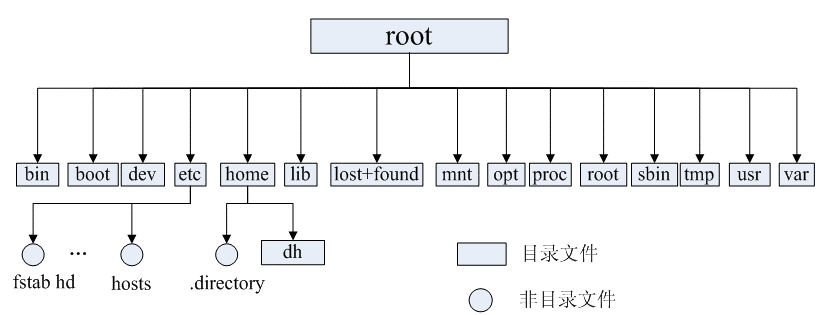

# 目录树



**/bin：** 可执行文件

**`/etc`：** 配置文件

**/home：** 用户目录

**/root**

**/sbin:** 存放二进制可执行文件，只有 root 才能访问。存放系统级别的指令

**/usr ：** 存放系统应用

**/opt：** 额外安装的可选应用程序包所放置的位置。一般情况下，我们可以把 tomcat 等都安装到这里；

**/proc：** 虚拟文件系统目录，是系统内存的映射。可直接访问这个目录来获取系统信息；

**/dev：** 用于存放设备文件；

**/mnt：** 系统管理员安装临时文件系统的安装点，系统提供这个目录是让用户临时挂载其他的文件系统；

**/boot：** 存放用于系统引导时使用的各种文件；

**/lib ：** 存放系统运行相关的库文件

**/tmp：** 临时文件

**`/var`：** 日志

**/lost+found：** 这个目录平时是空的，系统非正常关机而留下“无家可归”的文件（windows 下叫什么.chk）就在这里


# 命令

Linux 命令大全：[http://man.linuxde.net/open in new window](http://man.linuxde.net/)


### 文件权限

~~~shell
-- 查看文件权限
ll 
~~~


- **属主(u)** ：创建者

  ```shell
  ls ‐ahl ：查看文件的所有者 、所在组
  chown 用户名 文件名：修改文件所有者 
  ```

- **属组(g)** ：用户的所在组就是文件所在组

  	chgrp 组名 文件名：修改文件所在组

- **其它用户(o)** ：除开文件的所有者和所在组的用户外，系统的其它用户都是文件的其它组


权限可以用数字表示：

- r：读，数字 4 
- w：写，数字 2 
- x：可执行，数字 1 

对文件和目录而言，读写执行表示不同的意义

| 权限名称 |           文件           |         目录         |
| :------: | :----------------------: | :------------------: |
|    r     |      查看文件的内容      |     查看目录列表     |
|    w     |         修改文件         | 创建和删除目录下文件 |
|    x     | 可以将其运行为二进制文件 |      可以使用 c      |


**修改权限：`chmod`**

修改/test 下的 aaa.txt 的权限为文件所有者有全部权限，文件所有者所在的组有读写权限，其他用户只有读的权限

**`chmod u=rwx,g=rw,o=r aaa.txt`** 或者 **`chmod 764 aaa.txt`**

`chmod +x zookeeper`：添加可执行权限


### **开机启动命令**

假如我们装了一个 zookeeper，我们每次开机到要求其自动启动该怎么办？

1. 添加可执行权限 : `chmod +x zookeeper`
2. 添加到开机启动项里面 ：`chkconfig --add zookeeper`
3. 如果想看看是否添加成功，命令是：`chkconfig --list`


### 主机名

```shell
-- 临时
sudo hostname xxxxx

-- 永久
sudo hostnamectl set-hostname xxxx
```


### 内存

free

```shell
free 
    -b 以Byte为单位显示内存使用情况。 
    -k 以KB为单位显示内存使用情况。 
    -m 以MB为单位显示内存使用情况。 
    -h 以合适的单位显示内存使用情况，最大为三位数，自动计算对应的单位值。
        单位有：         
            B = bytes         
            K = kilos         
            M = megas         
            G = gigas         
            T = teras 

    -o 不显示缓冲区调节列。 
    -s<间隔秒数> 持续观察内存使用状况。 
    -t 显示内存总和列。 
    -V 显示版本信息。
```


top


## 文件移动

转移【重命名】

~~~shell
mv -f xxx /xx/xx

mv oldName newName
~~~


# Vim

三个模式：

- **`i`** 输入
- **`:`** 底线命令


| 移动光标的方法            |                                                 |
| :------------------------ | ----------------------------------------------- |
| 上下左右                  | 移动光标                                        |
| **Page Up**/**Page Down** | 上/下翻页                                       |
| **HOME**/**END**          | 移动光标到行首/行尾                             |
| gg                        | 移动到这个档案的第一行                          |
| G                         | 移动到这个档案的最后一行                        |
| nG                        | n 为数字。移动到这个档案的第 n 行(配合 :set nu) |
| n< Enter>                 | n 为数字。光标向下移动 n 行(常用)               |

| 搜索  |                                 |
| :---- | ------------------------------- |
| /word | 按下`/`开启搜索，定位后按下回车 |
| ?word | 向上搜索                        |

| 删除、复制与粘贴 |                                                          |
| :--------------- | -------------------------------------------------------- |
| dd               | 删一行                                                   |
| ndd              | n 为数字，删除光标所在的向下 n 行                        |
| yy               | 复制一行                                                 |
| nyy              | n 为数字，复制光标所在的向下 n 行                        |
| p, P             | p 为将已复制的数据在光标下一行贴上，P 则为贴在游标上一行 |
| u                | 复原前一个动作                                           |
| [Ctrl]+r         | 重做上一个动作。(常用)                                   |

| 底线命令模式  |                                                          |
| :------------ | -------------------------------------------------------- |
| :w            |                                                          |
| :w!           | 『只读』时，强制写入。最终能否与你对该档案的档案权限有关 |
| :q            | 离开 vi (常用)                                           |
| :q!           | 修改后不保存退出，修改了然后删除修改也会被当作修改       |
| **:wq**       |                                                          |
| :w [filename] | 另存新档                                                 |
| :r [filename] | 将其它文件的内容写入当前文档                             |
| **:set nu**   | 显示行号，设定之后，会在每一行的前缀显示该行的行号       |
| :set nonu     | 与 set nu 相反，为取消行号！                             |


# 磁盘管理

磁盘管理关系到系统的性能问题

- df ：列出文件系统的整体磁盘使用量

- du：列出文件空间使用量

  

```shell
df [-ahikHTm] 文件名
```

- -a ：列出所有的文件系统
- -m ： MBytes 的容量显示
- **-h** ： GB, MB, KB 格式自行显示
- -T ：显示文件系统类型
- -k ： KBytes 的容量显示
- -i ：不用硬盘容量，而以 inode 的数量来显示


```bash
du [-ahskm] 文件名
```

选项与参数：

- -a ：列出所有的文件与目录容量，默认仅统计当前目录底下的文件
- -h ：容量格式 (G/M/K) 
- -s ：列出总量而已，而不列出每个各别的目录占用容量；
- -S ：不包括子目录下的总计，与 -s 有点差别
- -k ：以 KBytes 列出容量显示；
- -m ：以 MBytes 列出容量显示；


通配符 * 来代表每个目录


> 磁盘挂载与卸除

根文件系统之外的其他文件要想能够被访问，都必须通过“关联”至根文件系统上的某个目录来实现，此关联操作即为“挂载”，此目录即为“挂载点”,解除此关联关系的过程称之为“卸载”

Linux 的磁盘挂载使用mount命令，卸载使用umount命令。

磁盘挂载语法：

```bash
mount [-t 文件系统] [-L Label名] [-o 额外选项] [-n] 装置文件名 挂载点
```

测试：

```bash
# 将 /dev/hdc6 挂载到 /mnt/hdc6 上面！
[root@www ~]# mkdir /mnt/hdc6
[root@www ~]# mount /dev/hdc6 /mnt/hdc6
[root@www ~]# df
Filesystem           1K-blocks     Used Available Use% Mounted on
/dev/hdc6              1976312     42072   1833836   3% /mnt/hdc6
```

磁盘卸载命令 umount 语法：

```bash
umount [-fn] 装置文件名或挂载点
```

选项与参数：

- -f ：强制卸除！可用在类似网络文件系统 (NFS) 无法读取到的情况下；
- -n ：不升级 /etc/mtab 情况下卸除。

卸载/dev/hdc6

```bash
[root@www ~]# umount /dev/hdc6
```


# 安装环境

### JDK

[Centos安装Java - 简书 (jianshu.com)](https://www.jianshu.com/p/39a847aec780)

**安装**

[(19条消息) Linux 中安装 JDK（rpm包安装）_蒋嘿嘿i的博客-CSDN博客_jdkrpm包下载地址](https://blog.csdn.net/qq_43023754/article/details/108233484)


### MySQL

[(13条消息) Linux安装MySQL5.7_蛇皮皮蛋的博客-CSDN博客_linux安装mysql](https://blog.csdn.net/qq_37598011/article/details/93489404?ops_request_misc=%7B%22request%5Fid%22%3A%22165157762616782395322923%22%2C%22scm%22%3A%2220140713.130102334..%22%7D&request_id=165157762616782395322923&biz_id=0&utm_medium=distribute.pc_search_result.none-task-blog-2~all~top_positive~default-1-93489404.142^v9^control,157^v4^control&utm_term=linux安装mysql&spm=1018.2226.3001.4187)


# 端口

端口和应用绑定

~~~shell
netstat -nlp | grep [端口号]
~~~

~~~shell
sudo lsof -i :[端口号]
~~~


1. ***tcpdump port [端口号]*** 监听端口


# 防火墙

- `firewall-cmd --list-ports`：查看开启的端口

- `firewall-cmd --zone=public --add-port=8080/tcp --permanent`：开启新端口

  命令含义：
  `--zone` #作用域
  `--add-port=80/tcp`  #添加端口，格式为：端口/通讯协议
  `--permanent`   #永久生效，没有此参数重启后失效

- `systemctl restart firewalld.service`：重启

- `systemctl status firewalld`：状态

- `systemctl stop firewalld`：停止防火墙

- `systemctl stop iptables`：停止iptables服务

- `systemctl mask iptables`：禁用iptables服务


查看特定端口被谁使用

```
lsof -i:port
```

```
netstat -tunlp | grep 7075  //显示进程pid
```


# 软、硬链接

[Linux软连接和硬链接 - 知乎 (zhihu.com)](https://zhuanlan.zhihu.com/p/67366919)

【硬连接】

硬连接指通过索引节点来进行连接。在Linux的文件系统中，保存在磁盘分区中的文件不管是什么类型都给它分配一个编号，称为索引节点号(Inode Index)。在Linux中，多个文件名指向同一索引节点是存在的。一般这种连接就是硬连接。硬连接的作用是允许一个文件拥有多个有效路径名，这样用户就可以建立硬连接到重要文件，以防止“误删”的功能。其原因如上所述，因为对应该目录的索引节点有一个以上的连接。只删除一个连接并不影响索引节点本身和其它的连接，只有当最后一个连接被删除后，文件的数据块及目录的连接才会被释放。也就是说，文件真正删除的条件是与之相关的所有硬连接文件均被删除。

【软连接】

另外一种连接称之为符号连接（Symbolic Link），也叫软连接。软链接文件有类似于Windows的快捷方式。它实际上是一个特殊的文件。在符号连接中，文件实际上是一个文本文件，其中包含的有另一文件的位置信息。


# web服务器

***Apache Web服务器***

1. html 文件放在 ***/var/www/html*** 下

2. 安装服务

   ~~~shell
   yum -y install httpd
   ~~~

3. 开机启动

   ~~~shell
   service httpd start
   ~~~

4. 外网访问


***Nginx 方式***

1. nginx 默认静态文件位置 ***/usr/share/nginx/html***

# Node

下载-传送至Linux-解压


配置环境变量

~~~shell
export NODE_HOME=绝对路径
export PATH=$NODE_HOME/bin:$PATH
~~~


建立软连接

~~~shell
ln -s nodejs绝对经路/bin/node /usr/bin/node
ln -s nodejs绝对经路/bin/npm /usr/bin/npm
~~~


设置npm镜像

~~~shell
npm config set registry https://registry.npm.taobao.org
npm config get registry
~~~


改变依赖和缓存位置

1. nodejs目录新建两个文件夹

   ~~~shell
   mkdir node_global
   mkdir node_cache
   ~~~

2. 改变npm配置

   ~~~shell
   npm config set prefix "node_global"
   npm config set cache "node_cache"
   ~~~

   

安装yarn

~~~shell
npm install -g yarn
~~~

建立软链接【yarn安装的目录随着依赖存放位置改变而改变】

~~~shell
ln -s nodejs绝对经路/node_global/bin/yarn /usr/bin/yarn
~~~


yarn安装vue

~~~shell
yarn global add @vue/cli
~~~

建立软链接【vue安装的目录随着依赖存放位置改变而改变】

~~~shell
ln -s nodejs绝对经路/node_global/bin/vue /usr/bin/vue
~~~


# Maven

版本

```
mvn -v
```


下载-传送至Linux-解压【maven目录】


编辑 setting.xml

1. jar包位置

   ```xml
   <localRepository>绝对路径</localRepository>
   ```

2. 依赖下载位置【阿里云】

   ```xml
   <mirror>
   	 <id>alimaven</id>
    	<mirrorOf>central</mirrorOf>
    	<name>aliyun maven</name>
    	<url>https://maven.aliyun.com/repository/central</url>
   </mirror>
   
   <mirror> 
   	<id>alimaven</id> 
   	<name>aliyun maven</name> 
   	<url>http://maven.aliyun.com/nexus/content/groups/public/</url> 
    	<mirrorOf>central</mirrorOf> 
    </mirror> 
   ```


根据jar包位置，创建相应目录

~~~shell
mkdir path
~~~


配置环境变量

~~~shell
export MAVEN_HOME=maven目录存放绝对路径
export PATH=$PATH:$MAVEN_HOME/bin
~~~


# Git

版本

```sql
git --version
```


目录

```bash
which git
whereis git
```


# Redis

下载链接https://redis.io/download

```
wget 链接
```


解压

```
tar -xvf ....... -C /usr/local/redis
```


进入redis目录

```
make
```

```
make PREFIX=/usr/local/redis install
```


配置文件

```xml
protect mode no
bind *
```


安装redis

```
make install
```


启动

```
redis-server /usr/local/redis/redis.conf --daemonize yes
```

[Linux安装部署Redis(超级详细) - 长沙大鹏 - 博客园 (cnblogs.com)](https://www.cnblogs.com/hunanzp/p/12304622.html)


# 环境变量

位置

```
/etc/profile
```


刷新

```
source /etc/profile
```


# 查找

~~~shell
find / --name fileName
~~~


# 定位生效的配置文件

Linux在启动一个进程时，系统会在 /proc 文件夹下创建一个以 PID 命名的文件夹


查看 pid

```shell
lsof -i:port
```


pid 文件夹下的 exe 文件

~~~shell
ll  /proc/pid/exe
~~~

会获取到进程的执行路径

```shell
lrwxrwxrwx 1 nginx nginx 0 Apr 30 15:15 /proc/9500/exe -> /usr/sbin/nginx
```


获取生效的配置文件路径【在执行路径后加 -t】

~~~shell
/usr/sbin/nginx -t
~~~


**换句话说，获取到进程执行路径即可**

~~~shell
ps -ef | grep nginx
~~~


# 内存

查看

~~~shell
free -h
~~~


total——总物理内存
used——已使用内存，一般情况这个值会比较大，因为这个值包括了cache+应用程序使用的内存
free——完全未被使用的内存
shared——应用程序共享内存
buffers——缓存，主要用于目录方面,inode值等（ls大目录可看到这个值增加）
cached——缓存，用于已打开的文件


清理

1. 先同步缓存区

   ~~~shell
   sync
   ~~~

2. 清理

   ~~~shell
   echo 3 > /proc/sys/vm/drop_caches
   ~~~

   0：不释放（系统默认值）

   1：释放页缓存

   2：释放dentries和inodes

   3：释放所有缓存


# 磁盘清理

各个目录大小

~~~shell
du
~~~


# 虚拟内存

慎用，性能堪忧


CentOS上启用虚拟内存，您可以按照以下步骤进行操作：

1. 在终端中运行以下命令，检查虚拟内存是否已启用：

   ```
   free -m
   ```

   这将显示当前的内存使用情况，包括可用的交换内存量。如果交换内存显示为0，则表示未启用虚拟内存。

2. 运行以下命令创建交换文件：

   ```
   sudo fallocate -l <size> /swapfile
   ```

   将`<size>`替换为您要创建的交换文件的大小，以兆字节为单位。例如，要创建一个2GB的交换文件，请使用`sudo fallocate -l 2G /swapfile`。

3. 设置交换文件的权限：

   ```
   sudo chmod 600 /swapfile
   ```

4. 设置交换区域：

   ```
   sudo mkswap /swapfile
   ```

5. 启用交换文件：

   ```
   sudo swapon /swapfile
   ```

6. 验证交换文件正在使用：

   ```
   free -m
   ```

   这应该会显示可用的交换内存量并且正在使用。

7. 通过将其添加到`/etc/fstab`文件中，使交换文件永久化：

   ```
   echo '/swapfile none swap sw 0 0' | sudo tee -a /etc/fstab
   ```

   这将确保在系统启动时自动启用交换文件。


关闭虚拟内存，您可以按照以下步骤进行操作：

1. 查看当前的虚拟内存状态，可以运行以下命令：

   ```
   free -m
   ```

   这将显示当前的内存使用情况，包括可用的交换内存量。如果交换内存显示为0，则表示虚拟内存已关闭。

2. 临时关闭虚拟内存，可以运行以下命令：

   ```
   sudo swapoff -a
   ```

   这将禁用所有的交换区，导致虚拟内存被关闭。

3. 检查虚拟内存是否已关闭，可以再次运行以下命令：

   ```
   free -m
   ```

   这应该会显示交换内存的大小为0，表示虚拟内存已关闭。

4. 如果您希望永久关闭虚拟内存，可以编辑`/etc/fstab`文件，将其中与虚拟内存相关的行注释掉或删除。例如：

   ```
   #/dev/mapper/cl-swap     swap                    swap    defaults        0 0
   ```

   这将使系统在下次启动时不会加载虚拟内存。

5. 重启系统以使更改生效：

   ```
   sudo reboot
   ```


# MySQL

[CentOS / Linux 安装MySQL（超简单详细） - 知乎 (zhihu.com)](https://zhuanlan.zhihu.com/p/623778183)

[(23条消息) /var/log/mysqld.log 但是执行命令后发现没有要找的密码，是个空的文件_mysqld.log为空_fy_1852003327的博客-CSDN博客](https://blog.csdn.net/fy_1852003327/article/details/105890658)


# systemctl


# 部署 jar

1. ***上传 jar 包到 linux***
2. ***nohup java -jar xxxxx.jar &***
3. ***tail -f nohup**：查看日志*
