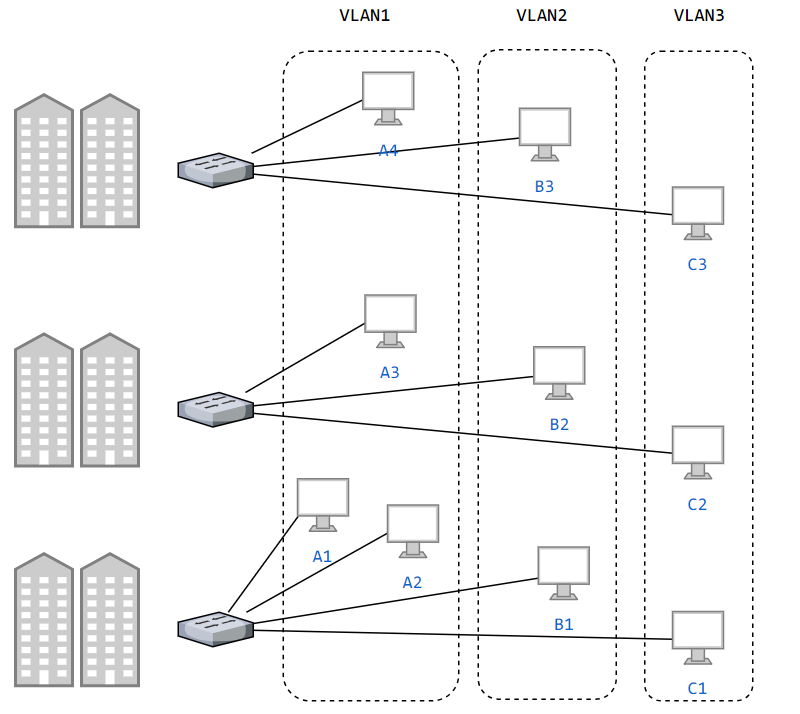
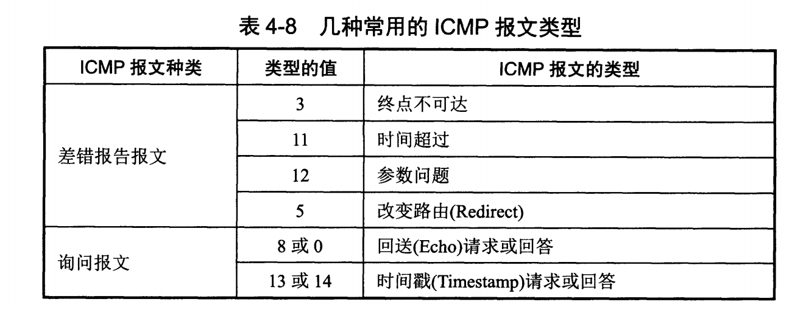
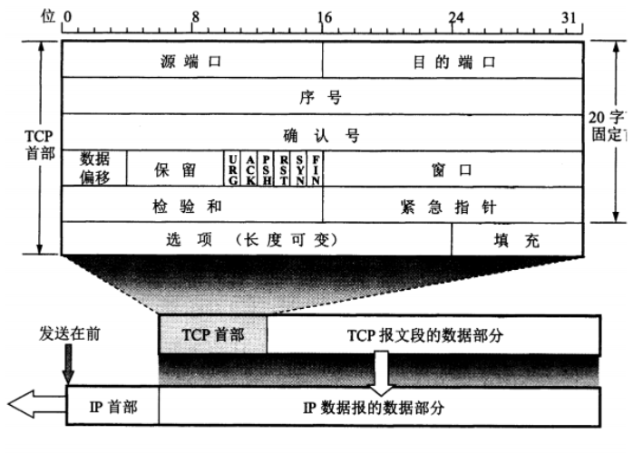

# 网络分层


## 物理层

透明传输字节流

### 通信方式

1. 单工 - 单向传输
2. 半双工 - 双向交替传输
3. 全双工 - 双向同时传输

> 通信 - 也就是数据的往来传输
>


### 带通调制

模拟信号是连续的信号，数字信号是离散的信号。带通调制把数字信号转换为模拟信号。


### 硬件

1. 集线器


## 链路层


将分组封装成帧，添加首部和尾部标记帧的开始和结束


帧格式


- **类型** ：上层协议
- **数据** ：长度在 46-1500 之间，如果太小则需要填充；
- **FCS** ：检查比特差错，使用的是循环冗余检验（CRC）检验方法；


### 透明传输

指不管所传数据是什么样的比特组合，都应当能够在链路上传送。当所传数据中的比特组合恰巧与某一个控制信息完全一样时，就必须采取适当的措施（转义），使接收方不会将这样的数据误认为是某种控制信息。


### 信道

信道即通信数据传输所需的道路

1. *广播信道* —— 所有的主机都在同一个广播信道上发送数据，可以使用信道复用技术或者CSMA/MA协议协调避免发生碰撞
2. *点对对信道* —— *1*对*1*通信。不会碰撞，使用 PPP 协议进行控制。


#### 信道复用技术

1. 频分复用 - 所有主机在相同的时间占用不同的频率带宽资源

2. 时分复用 - 所有主机在不同的时间占用相同的频率带宽资源

   > 频分复用、时分复用在通信的过程中主机会一直占用一部分信道资源。但是由于计算机数据的突发性质，通信过程没必要一直占用信道资源而不让出给其它用户使用，因此这两种方式对信道的利用率都不高。

3. 统计时分复用 - 对时分复用的一种改进，不固定每个用户在时分复用帧中的位置，只要有数据就集中起来组成统计时分复用帧然后发送。

4. 波分复用 - 光的频分复用。由于光的频率很高，因此习惯上用波长而不是频率来表示所使用的光载波。

5. 码分复用


#### CSMA/CD 协议

CSMA/CD 表示载波监听多点接入 / 碰撞检测。

- **多点接入** ：说明这是总线型网络，许多主机以多点的方式连接到总线上。
- **载波监听** ：每个主机都必须不停地监听信道。在发送前，如果监听到信道正在使用，就必须等待。
- **碰撞检测** ：在发送中，如果监听到信道已有其它主机正在发送数据，就表示发生了碰撞。虽然每个主机在发送数据之前都已经监听到信道为空闲，但是由于电磁波的传播时延的存在，还是有可能会发生碰撞。

记端到端的传播时延为 τ，最先发送的站点最多经过 2τ 就可以知道是否发生了碰撞，称 2τ 为 **争用期** 。只有经过争用期之后还没有检测到碰撞，才能肯定这次发送不会发生碰撞。

当发生碰撞时，站点要停止发送，等待一段时间再发送。这个时间采用 **截断二进制指数退避算法** 来确定。从离散的整数集合 {0, 1, .., (2k-1)} 中随机取出一个数，记作 r，然后取 r 倍的争用期作为重传等待时间。


### PPP 协议

用户计算机和*ISP*进行通信时所使用的数据链路层协议


### MAC 地址

MAC 地址是链路层地址，长度为 6 字节，标识网络适配器（网卡）。一台主机拥有多少个网络适配器就有多少个 MAC 地址


### 局域网

广播信道，分类


<h4 style="color:#B0E0E6">以太网

占领着**有线局域网**市场。

星型拓扑结构局域网。

早期使用集线器进行连接，目前以太网使用交换机替代了集线器，交换机是一种链路层设备，它不会发生碰撞，能根据 MAC 地址进行存储转发。


<h4 style="color:#B0E0E6">无线局域网（WLAN）


<h4 style="color:#B0E0E6">虚拟局域网

无关地理位置，任何地点的网络设备经过允许可加入此网络。


物理上分割网络：

1. 存储转发
2. 过滤技术





### 硬件

1. 交换机 - 连接同一个网络的所有主机

   交换表中存储着*MAC*地址到接口的映射。交换机具备自学习能力，不需要网络管理员手动配置交换表内容。

   

2. 网桥 - 网络间数据的中转设备，网桥的每个端口与一个网络相连


## 网络层

网络层抽象为主机之间的通信，将传输层传递的报文或者用户数据报封装成分组，并选择合适的路由进行传送。


### IP

计算机的*IP*相当于人的身份证。身份证随着时代发展有了第二代身份证的出现，*IP*地址同样随着计算机寄存器的发展出现了*64 bit*的地址寄存器，随之出现第二代的*IP*，称之为*IPv6*。第一代*IP*是*IPv4*，使用*32 bit*的地址寄存器，它将*IP*分为A-E的五大类，采用***<网络号，主机号>***的表示法，使用网络号进行分类。


#### IPv4

IPV4 使用*32 bit*地址寄存器规划*IP*地址，第*1*个字节称为网络号，并在网络号中为每一类网络设定标识符

|  A   |  B   |  C   |  D   |   E    |
| :--: | :--: | :--: | :--: | :----: |
|  0   |  10  | 100  | 1000 | 1000 0 |

注意点：

1. 每一类网络，第*1*个字节中除网络标识符外的网络号不能为全零，即不允许

   |                     A                     |                    B                     |                    C                     |                    D                     |                    E                     |
   | :---------------------------------------: | :--------------------------------------: | :--------------------------------------: | :--------------------------------------: | :--------------------------------------: |
   | 0<span style="color:red">000 00000</span> | 10<span style="color:red">00 0000</span> | 110<span style="color:red">0 0000</span> | 1110<span style="color:red"> 0000</span> | 1111 0<span style="color:red">000</span> |

2. *A*类网络，第*1*个字节中主机号全为*1*保留作为特殊的本地主机地址

3. 所有网络，主机号全*0*保留用作本网络主机（包括子网划分）

4. 所有网络，主机号全*1*保留用作目标网络广播（包括子网划分）


特殊的*IP*：

1. *A*类网络网络号全零 + 主机号全零  => **0.0.0.0** （本网本主机）
2. *A*类网络网络号全*1* + 主机号 **0.0.1** => **127.0.0.1**（环回地址，表示本主机，主要用于软件测试）
3. 255.255.255.255 => 本网广播


#### 子网掩码 

划分网络号和主机号数字。在大型网络中，所有设备都共享同一个网络号，这可能导致网络拥堵和广播风暴等问题。使用子网掩码将网络划分为多个子网，可以减少广播流量并提高网络的安全性。

示例：172.20.1.0/26


如何划分子网呢？子网掩码占用主机号部分位数。划分 N 个子网，需要 ***2^m^ >= N***，*m* 是需要占用主机号地址的位数。值得注意的是不可能将所有主机号用于分配子网。


#### *IP*数据格式


- **首部长度** : 以*byte*为单位，*IP*协议头固定部分长度为 20 字节，因此该值最小为 5。如果可选字段的长度不是 4 字节的整数倍，就用尾部的填充部分来填充。

- **区分服务** : 用来获得更好的服务，一般情况下不使用。

- **总长度** : 首部长度 + 数据部分长度

- **标识** : 在数据报长度过长从而发生分片的情况下，相同数据报的不同分片具有相同的标识符。

- **片偏移** : 和标识一起，用于发生分片的情况。片偏移的单位为 8 字节。

- **生存时间** ：防止无法交付的数据报滞留在互联网。以路由器跳数为单位，当 TTL 为 0 时就丢弃数据报。

- **协议** ：指出携带的数据应该上交给哪个协议进行处理，例如 ICMP、TCP、UDP 等。

- **首部检验和** ：因为数据报每经过一个路由器，都要重新计算检验和，因此检验和不包含数据部分可以减少计算的工作量。


### ARP（地址解析协议）

地址解析协议（Address Resolution Protocol）具有高速缓存，存放*IP*地址到*MAC*地址的映射表


### ICMP（网络控制信息协议）

网络控制信息协议（Internet Control Message Protocol） 检查和测试网络间的通信

用于 TCP/IP 网络中发送控制消息，提供问题反馈。


在*IP*通信中数据包没能发送到目的主机，由 ICMP 协议告知。


<h4 style="color:#B0E0E6">ICMP 报文

- 差错报告报文
- 询问报文




<h4 style="color:#B0E0E6">Ping

测试两台主机是否网络互通。


<h4 style="color:#B0E0E6">Traceroute

打印从源点到终点的路径。

```shell
# linux 的 traceroute 默认使用的是 UDP 协议，通过参数修改为使用 ICMP 协议
traceroute hostname;

# window 只使用 ICMP 协议 
tracert hostname
```


ICMP 发送的*IP*数据报封装的是无法交付的 UDP 用户数据报，所谓“无法交付”，是指让发送的UDP报文**故意使用一个错误的端口**，在该报文到达目的主机后被丢弃，目的主机向源主机发送终点不可达 ICMP差错报告报文。

- 源主机向目的主机发送一连串的*IP*数据报。第一个数据报 P1 的生存时间 TTL 设置为 1，当 P1 到达路径上的第一个路由器 R1 时，R1 收下它并把 TTL 减 1，此时 TTL 等于 0，R1 就把 P1 丢弃，并向源主机发送一个 ICMP 时间超过差错报告报文；
- 源主机接着发送第二个数据报 P2，并把 TTL 设置为 2。P2 先到达 R1，R1 收下后把 TTL 减 1 再转发给 R2，R2 收下后也把 TTL 减 1，由于此时 TTL 等于 0，R2 就丢弃 P2，并向源主机发送一个 ICMP 时间超过差错报文。
- 不断执行这样的步骤，直到最后一个数据报刚刚到达目的主机，主机不转发数据报，也不把 TTL 值减 1。但是因为数据报封装的是无法交付的 UDP，因此目的主机要向源主机发送 ICMP 终点不可达差错报告报文。
- 之后源主机知道了到达目的主机所经过的路由器*IP*地址以及到达每个路由器的往返时间。


### VPN（虚拟专用网）

由于*IP*地址的紧缺，一个机构能申请到的*IP*地址数往往远小于本机构所拥有的主机数，并且一个机构并不需要把所有的主机接入到外部的互联网中。虚拟专用网（Virtual Private Network）提供一些*IP*地址供机构里的计算机使用，但仅在本机构内有效，且使用专用网*IP*的主机只能与本机构的主机通信。

VPN 三个专用地址块：

- 10.0.0.0 ~ 10.255.255.255
- 172.16.0.0 ~ 172.31.255.255
- 192.168.0.0 ~ 192.168.255.255


专用指机构内的主机只与本机构内的其它主机通信，而使用专用网*IP*的主机与其它主机通信实际上会经过互联网，这就是被称作虚拟的原因。


### NAT（网络地址转换）

*VPN*主机使用本地*IP*地址又想和互联网上的主机通信时，可以使用*NAT*来将本地*IP*转换为全球*IP*

*NAPT*网络端口地址转换（Network Address Port Transfer）是使用端口号的*NAT*


### 硬件

1. 路由器 - 路由选择和分组转发

   

   **流程**

   1. 从 IP数据报的首部 提取 目的主机的IP地址D，得到目的网络地址N
   2. 若 N 就是与此路由器直接相连的某个网络地址，则进行直接交付；
   3. 若路由表中有目的地址为 D 的特定主机路由，则把数据报传送给表中所指明的下一跳路由器；
   4. 若路由表中有到达网络 N 的路由，则把数据报传送给路由表中所指明的下一跳路由器；
   5. 若路由表中有一个默认路由，则把数据报传送给路由表中所指明的默认路由器；
   6. 报告转发分组出错。

   

2. 网关 - 连接两个不同的网络的设备都可以叫网关。路由器（包含了网关的功能）和网桥都是网关


## 传输层

提供了进程间的逻辑通信。


### TCP

传输控制协议，通信前需要经历三次握手，建立全双工及一对一的通信通道，提供可靠的通信数据交付，具备流量控制、拥塞控制等机制。




- **序号** ：对二进制数据编制序号。因为一个完整的通信数据可能会分成几个报文进行传输，因此需要编制序号，让接收方知道正确的报文读取顺序。

- **确认号** ：期望中的下一个报文段序号。

- **数据偏移** ：数据部分距离报文段起始处的偏移量，指的是**首部长度**。

- **ACK** ：*Acknowledge*缩写，表示连接确认，连接建立后的 ACK 都为*1*

- **SYN** ：连接建立时用来同步序号

  > SYN=1，ACK=0 ———— TCP 连接请求
  >
  > SYN=1，ACK=1 ———— TCP 同意建立连接的响应报

- **FIN** ：四次挥手时释放连接  FIN=1 时，表示此报文段的发送方的数据已发送完毕，并要求释放连接。

- **窗口** ：数据接受方在响应报文会告知发送方自己的窗口大小（指的是接受数据的速率），让发送方调整


#### 三次握手


1. 用户发送连接请求报文【Syn = 1，ACK = 0】，选定初始序号*x*，进入同步已发送状态（syn-sent）。
2. 服务器接收到连接请求，回应连接确认报文【SYN = 1，ACK = 1】，选定初始序号*y*，确认号为*x+1*表示期望用户下次报文段序号，进入同步已接受状态（syn-rcvd）。
3. 用户接收到服务器的连接确认报文，需要发送确认报文告诉服务器自己接收到了它的连接确认报文【ACK = 1】，序号为*x+1*，确认号为*y+1*表示期望服务器下次报文段序号，进入连接确立状态（estab-lished）。
4. 服务器收到用户的确认报文随后进入连接确立状态。

> 第三次握手的作用：
>
> ​	如果用户网络存在延迟，会发送连接报文时触发了超时重传机制，在不存在第三次握手的场景下，服务器每当收到一个连接报文就会开启一个网络通信通道，那么会对一个用户开启两个通道造成资源浪费，也可以避免用户发送了连接报文就下线，导致服务器一直等待用户发送数据，造成通道占用。
>
> ​	存在第三次握手就可以避免上述问题，服务器会忽视已经连接的用户后续的连接报文，同时只有收到用户的确认报文才进入连接确立状态，避免通道占用。


#### 四次挥手


1. 用户发送连接释放报文【FIN = 1】，选定序号*u*，进入释放等待1状态
2. 服务器收到后发出确认报文【ACK = 1】，选定序号*v*，确认号*u+1*期望下次收到的报文段序号，进入关闭等待状态，同时继续传输还没传输完的数据
3. 用户收到服务器的确认报文进入释放等待2状态
4. 服务器传输完数据后发出释放确认报文【FIN = 1，ACK = 1】，选定序号*w*，确认号为*u+1*，进入最终确认状态
5. 用户收到服务器的释放确认报文，发送确认报文【ACK = 1】表示收到，序号为*u+1*，确认号*w+1*，进入限时等待状态

> 为什么需要四次挥手？
>
> 1. 确保数据传输完成 - 四次握手允许客户端和服务器在关闭连接之前确认所有数据已成功传输。这一点很重要，因为TCP是保证数据传递的可靠协议。如果没有四次握手，一方可能会过早地关闭连接，从而导致潜在的数据丢失。
> 2. 处理半封闭连接 - 在TCP中，连接可以在半封闭状态下关闭，其中一方已完成发送数据，但另一方可能仍有数据要发送。四次握手允许已经完成发送数据的一方向另一方表明这一点，确保双方在终止连接之前都有机会发送和接收任何剩余的数据。
> 3. 处理丢包和异常 - 四次握手有助于处理在终止过程中可能出现的丢包或异常情况。通过交换多个确认和终止请求，双方可以确保他们的意图被正确地传达，并且以受控的方式终止连接。


#### 可靠传输

<h4 style="color:#2E8B57">序号机制


<h4 style="color:#2E8B57">确认机制


<h4 style="color:#2E8B57">数据校验


<h4 style="color:#2E8B57">超时重传

报文段在超时时间内没有收到确认，重传。


<h4 style="color:#2E8B57">滑动窗口

发送方和接收方各有一个窗口，接收方通过 TCP 报文段中的窗口字段告诉发送方自己的窗口大小，发送方根据这个值和其它信息设置自己的窗口大小。

如果发送窗口左部的字节已经发送并且收到了确认，那么就将发送窗口向右滑动一定距离，直到左部第一个字节不是已发送并且已确认的状态；


接收窗口的滑动类似，接收窗口左部字节已经发送确认并交付主机，就向右滑动接收窗口。


接收窗口只会对窗口内最后一个按序到达的字节进行确认，例如接收窗口已经收到的字节为 {31, 34, 35}，其中 {31} 按序到达，而 {34, 35} 就不是，因此只对字节 31 进行确认。发送方得到一个字节的确认之后，就知道这个字节之前的所有字节都已经被接收。


<h4 style="color:#2E8B57">流量控制

流量控制是为了控制发送方发送速率，保证接收方来得及接收。

接收方发送的确认报文中的窗口字段可以用来控制发送方窗口大小，从而影响发送方的发送速率。

将窗口字段设置为 0，则发送方不能发送数据。


<h4 style="color:#2E8B57">拥塞控制

四个算法：

- 慢开始
- 拥塞避免
- 快重传
- 快恢复


**场景：**网络拥塞，则分组丢失，此时发送方会重传，从而导致网络拥塞程度更高。

**解决：**控制发送方的速率。

1. 流量控制 —— 让接收方能来得及接收
2. 拥塞控制 —— 降低整个网络的拥塞程度


发送方需要维护一个叫做拥塞窗口（cwnd）的状态变量，注意拥塞窗口与发送方窗口的区别：拥塞窗口只是一个状态变量，实际决定发送方能发送多少数据的是发送方窗口。


### UDP 

不需连接，不对上层数据修改的数据报协议，最大传输 512 字节（大于则拆分），支持多种通信方式（一对一、一对多、多对一、多对多）


### TCP 与 UDP

UDP 是不可靠的，但是在一些应用场景下对可靠传输的要求不高的情况下，UDP协议具有更好的实时性，工作效率要比TCP高。

同时，UDP的段结构要比TCP的段结构简单，能降低网络开销。


## 应用层


### DNS - 域名系统

 域名系统（Domain Name System）将*IP*地址映射为一个域名，域名即网站名称。

> 域名 ——*IP*—— MAC ，域名即定位一个目的主机。


域名层次：

- 根域名

  - 顶级域名
    - 二级域名

  


<h4 style="color:#B0E0E6">域名解析过程

默认使用 UDP 传输，DNS 需要进行超时重传保证可靠，响应超过 512 字节将使用 TCP 传输。


### SNMP - 简单网络管理协议

简单网络管理协议(Simple Network Management Protocol--SNMP）的原来名字叫做简单网关监控协议（Simple Gateway Monitoring Protocol-SGMP）。

> 跟 ICMP （网际控制信息协议）有点像，监控检测网络问题。


### FTP - 文件传输协议

文件传输协议（File Transfer Protocol ），使用 TCP 进行连接：


使用 **二个 TCP 通道**：

- 控制信息通道
- 数据通道


<h4 style="color:#B0E0E6">模式

- Standard （PORT方式，主动方式）
- Passive （PASV，被动方式）


### DHCP -*IP*分配协议

动态主机配置协议 (Dynamic Host Configuration Protocol) ，主机连接互联网时由 DHCP 分配一个*IP*给其。

> 新电脑可能需要安装其驱动。
>


 DHCP Server 使用 UDP 协议并监听 67 端口，响应发送至主机的 68 端口。


<h4 style="color:#B0E0E6">IP 分配方式

- 自动分配（Automatic Allocation）一个永久 IP

  

- 动态分配（Dynamic Allocation）一个具有时间限制的 IP

  > 可重复使用客户端不再需要的地址

  

- 手工分配（Manual Allocation）：网络管理员指定主机的 IP，DHCP 只是告知转发


### TELNET - 远程登陆协议

数据以明文发送


### 邮件协议


#### SMTP - 简单邮件传输协议

简单邮件传送协议 （Simple Mail Transfer Protocol） 建立在 FTP 协议之上的邮件传输服务。


SMTP 只能发送 ASCII 码，而互联网邮件扩充 MIME 可以发送二进制文件。

MIME 并没有改动或者取代 SMTP，而是增加邮件主体的结构，定义了非 ASCII 码的编码规则。


#### POP3 - 邮件读取协议

邮件读取协议


#### IMAP - 互联网信息访问协议

IMAP（Internet Message Access Protocol）互联网消息访问协议，以前称作**交互邮件访问协议**（Interactive Mail Access Protocol）。

IMAP 协议中客户端和服务器上的邮件保持同步，如果不手动删除邮件，那么服务器上的邮件也不会被删除。

IMAP 这种做法可以让用户随时随地去访问服务器上的邮件。


### 常用端口

|                    | 应用层协议 | 端口号  | 传输层协议 | 备注                        |
| ------------------ | ---------- | ------- | ---------- | --------------------------- |
| 域名系统           | DNS        | 53      | UDP/TCP    | 长度超过 512 字节时使用 TCP |
| 动态主机配置协议   | DHCP       | 67/68   | UDP        |                             |
| 简单网络管理协议   | SNMP       | 161/162 | UDP        |                             |
| 文件传送协议       | FTP        | 20/21   | TCP        | 控制连接 21，数据连接 20    |
| 远程终端协议       | TELNET     | 23      | TCP        |                             |
| 超文本传送协议     | HTTP       | 80      | TCP        |                             |
| 简单邮件传送协议   | SMTP       | 25      | TCP        |                             |
| 邮件读取协议       | POP3       | 110     | TCP        |                             |
| 互联网信息访问协议 | IMAP       | 143     | TCP        |                             |


## 五层协议与*TPC*协议


表示层、会话层给应用开发者进行更灵活的处理。


## Web 请求过程

### 1. DHCP 配置*IP*信息

1. 如果主机没有IP地址，通过 DHCP 来获取

2. 生成一个 DHCP Request 报文，报文的目的端口为67， DCHP Server监听端口 67

3. 报文进入传输层，被放入 32全 1 的目的IP地址中 (255.255.255.255 —— 本网广播地址) ，32位全 0 的源IP地址（0.0.0.0 —— 标识本主机）的 UDP 用户数据报中。

4. IP 数据报则被放置在 MAC 帧中，将广播到与交换机连接的所有设备。

5. 连接在交换机的 DHCP Server收到广播帧之后，不断地向上分解得到DHCP Request报文，之后生成 DHCP ACK 报文。

6. DHCP ACK报文被放入 UDP 用户数据报中，最后放入 MAC 帧中。该帧的目的地址是请求主机的 MAC 地址，交换机已经记录请求主机到其转发接口的映射，因此直接知道了向哪个接口发送该帧。

7. 主机收到该帧后，不断分解得到 DHCP ACK报文，配置*IP*地址，知道了 DNS Server服务器的 IP地址、默认网关路由器的 IP地址。

   

### 2. ARP 解析 MAC地址

1. 浏览器生成 TCP 套接字，需要知道网站的域名对应的*IP*地址
2. 主机生成一个 DNS 查询报文
3. 报文被放入 UDP 或者 TCP 中，端口53，因为 DNS Server的端口号是 53。
4. 数据报（或报文段）被放入*IP*数据报中，发送到网关路由器。
5. DHCP 过程只知道网关路由器的*IP*地址，为了获取网关路由器的 MAC 地址，需要使用 ARP 协议。
6. 主机生成一个目的地址为网关路由器*IP*地址的 ARP 查询报文，将该 ARP 查询报文放入一个具有广播目的地址的以太网帧中，并向交换机发送该以太网帧，交换机将该帧转发给所有的连接设备，包括网关路由器。
7. 网关路由器接收到该帧后，分解得到 ARP 报文，发现其中的*IP*地址与其接口的*IP*地址匹配，因此就发送一个 ARP 回答报文，包含了它的 MAC 地址，发回给主机。


### 3. DNS 解析域名

1. 知道了网关路由器的 MAC 地址之后，就可以继续 DNS 的解析过程了。
2. 网关路由器接收到包含 DNS 查询报文的以太网帧后，抽取出*IP*数据报，并根据转发表决定该*IP*数据报应该转发的路由器。
3. 因为路由器具有内部网关协议（RIP、OSPF）和外部网关协议（BGP）这两种路由选择协议，因此路由表中已经配置了网关路由器到达 DNS 服务器的路由表项。
4. 到达 DNS 服务器之后，DNS 服务器抽取出 DNS 查询报文，并在 DNS 数据库中查找待解析的域名。
5. 找到 DNS 记录之后，发送 DNS 回答报文，将该回答报文放入 UDP 报文段中，然后放入*IP*数据报中，通过路由器反向转发回网关路由器，并经过以太网交换机到达主机。


### 4. HTTP 请求页面

1. 有了 HTTP 服务器的*IP*地址之后，主机就能够生成 TCP 套接字，该套接字将用于向 Web 服务器发送 HTTP GET 报文。
2. 在生成 TCP 套接字之前，必须先与 HTTP 服务器进行三次握手来建立连接。
3. 连接建立之后，浏览器生成 HTTP GET 报文，并交付给 HTTP 服务器。
4. HTTP 服务器从 TCP 套接字读取 HTTP GET 报文，生成一个 HTTP 响应报文，将 Web 页面内容放入报文主体中，发回给主机。
5. 浏览器收到 HTTP 响应报文后，抽取出 Web 页面内容，之后进行渲染，显示 Web 页面。


简化版：

1. 首先会**<font color='red'>域名解析（DNS）</font>**，其实先查<font color='red'>本地缓存</font>，本地缓存没有再去解析域名
2. 获得服务器对应域名地址后，<font color='red'>**建立TCP连接**</font>
3. 连接服务器后，浏览器**<font color='red'>发送HTTP请求</font>**给服务器
4. 服务器接收到请求，处理并<font color='red'>**回应请求**</font>
5. 处理完请求，**<font color='red'>断开TCP连接</font>**
6. 浏览器获得资源文件HTML并渲染


# HTTP

超文本传输协议（HTTP，HyperText Transfer Protocol) 可以传送普通字符串、声音、视频、图片等流媒体信息


## Request

- 请求行：请求方式、URI、HTTP协议版本号
- 请求头: 首部名称，以及对应的值。包括主机、端口、浏览器信息、cookie、......
- 空白行
- 请求体：具体数据

```http
GET http://www.example.com/ HTTP/1.1
Accept: text/html,application/xhtml+xml,application/xml;q=0.9,image/webp,image/apng,*/*;q=0.8,application/signed-exchange;v=b3;q=0.9
Accept-Encoding: gzip, deflate
....

param1=1&param2=2
```


### 请求方式

请求行内容：==请求方式== URL HTTP版本

#### GET

获取资源。


#### POST

上传资源。


#### HEAD

获取报文首部，响应报文无实体主体部分。

主要用于确认 URL 的有效性以及资源更新的日期时间等。


#### PUT

上传文件，不带验证机制，因此存在安全性问题，一般不使用该方法。


#### PATCH

对资源进行部分修改，PUT 也可以用于修改资源，但是只能完全替代原始资源，PATCH 允许部分修改。


#### DELETE

删除文件。与 PUT 功能相反，并且同样不带验证机制。

```http
DELETE /file.html HTTP/1.1
```


#### OPTIONS

> 查询支持的方法

查询指定的 URL 能够支持的方法。

会返回 这样的内容。`Allow: GET, POST, HEAD, OPTIONS`

#### CONNECT

> 要求在与代理服务器通信时建立隧道

使用 SSL（Secure Sockets Layer，安全套接层）和 TLS（Transport Layer Security，传输层安全）协议把通信内容加密后经网络隧道传输。

```http
CONNECT www.example.com:443 HTTP/1.1
```


#### TRACE

> 追踪路径

服务器会将通信路径返回给客户端。

发送请求时，在 Max-Forwards 首部字段中填入数值，每经过一个服务器就会减 1，当数值为 0 时就停止传输。

通常不会使用 TRACE，并且它容易受到 XST 攻击（Cross-Site Tracing，跨站追踪）。


### GET 和 POST 比较

#### 作用

GET 用于获取资源，而 POST 用于传输实体主体。


#### 参数

GET 的参数出现在请求行的 URL 中，参数类型只接受 ASCII 码

```http
GET /test/demo_form.asp?name1=value1&name2=value2 HTTP/1.1
```

POST 的参数存储在请求体中，参数类型无限制

```http
POST /test/demo_form.asp HTTP/1.1
Host: w3schools.com

name1=value1&name2=value2
```

不能因为 POST 参数存储在实体主体中就认为它的安全性更高，因为照样可以通过一些抓包工具（Fiddler）查看。

> #### get请求的参数能放到body里面吗？
>
> 可以但没必要。
>


#### 安全

安全的 HTTP 方法不会改变服务器状态，也就是说它只是可读的。

GET 方法是安全的，而 POST 却不是，因为 POST 的目的是传送实体主体内容，这个内容可能是用户上传的表单数据，上传成功之后，服务器可能把这个数据存储到数据库中，因此状态也就发生了改变。

安全的方法除了 GET 之外还有：HEAD、OPTIONS。

不安全的方法除了 POST 之外还有 PUT、DELETE。


#### 幂等性

幂等的 HTTP 方法，同样的请求被执行一次与连续执行多次的效果是一样的，服务器的状态也是一样的。换句话说就是，幂等方法不应该具有副作用（统计用途除外）。

所有的安全方法也都是幂等的。

在正确实现的条件下，GET、HEAD、PUT、DELETE 等方法都是幂等的，而 POST 方法不是。

GET /pageX HTTP/1.1 是幂等的，连续调用多次，客户端接收到的结果都是一样的：

```
GET /pageX HTTP/1.1
GET /pageX HTTP/1.1
GET /pageX HTTP/1.1
GET /pageX HTTP/1.1
```

DELETE /idX/delete HTTP/1.1 是幂等的，即使不同的请求接收到的状态码不一样：

```
DELETE /idX/delete HTTP/1.1   -> Returns 200 if idX exists
DELETE /idX/delete HTTP/1.1   -> Returns 404
DELETE /idX/delete HTTP/1.1   -> Returns 404
```

POST /add_row HTTP/1.1 不是幂等的，如果调用多次，就会增加多行记录：

```
POST /add_row HTTP/1.1   -> Adds a 1nd row
POST /add_row HTTP/1.1   -> Adds a 2nd row
POST /add_row HTTP/1.1   -> Adds a 3rd row
```

> #### post不幂等是为什么？
>
> **POST所对应的URI并非创建的资源本身，而是资源的接收者**。比如：POST http://www.forum.com/articles的语义是在http://www.forum.com/articles


#### 可缓存

如果要对响应进行缓存，需要满足以下条件：

- 请求报文的 HTTP 方法本身是可缓存的，包括 GET 和 HEAD，但是 PUT 和 DELETE 不可缓存，POST 在多数情况下不可缓存的。
- 响应报文的状态码是可缓存的，包括：200, 203, 204, 206, 300, 301, 404, 405, 410, 414, and 501。
- 响应报文的 Cache-Control 首部字段没有指定不进行缓存。


#### XMLHttpRequest

为了阐述 POST 和 GET 的另一个区别，需要先了解 XMLHttpRequest：

> XMLHttpRequest 是一个 API，它为客户端提供了在客户端和服务器之间传输数据的功能。
>
> 它提供了一个通过 URL 来获取数据的简单方式，并且不会使整个页面刷新。这使得网页只更新一部分页面而不会打扰到用户。
>
> XMLHttpRequest 在 AJAX 中被大量使用。

- 在使用 XMLHttpRequest 的 POST 方法时，浏览器会先发送 Header 再发送 Data。但并不是所有浏览器会这么做，例如火狐就不会。
- 而 GET 方法 Header 和 Data 会一起发送。


**[http中的post请求发生了两次（多了一次options请求）的原因](https://www.cnblogs.com/liuchunxiao83/p/14724081.html)**

两次请求一般：

- 第一条为options请求
- 第二条请求才是我们预想中的请求。


为什么先发起了一条options请求？

options请求的官方定义：OPTIONS方法是用于请求获得由Request-URI标识的资源在请求/响应的通信过程中可以使用的功能选项。

通过这个方法，客户端可以在采取具体资源请求之前，决定对该资源采取何种必要措施，或者了解服务器的性能。


其实就是：在发生正式的请求之前，先进行一次预检请求。看服务端返回一些信息，浏览器拿到之后，看后台是否允许进行访问。

如何产生options请求：
产生options请求的原因包括以下几条：

1：产生了复杂请求。复杂请求对应的就是简单请求。简单请求的定义是：

 请求方法是GET、HEAD或者POST，并且当请求方法是POST时，Content-Type必须是application/x-www-form-urlencoded, multipart/form-data或着text/plain中的一个值。
 请求中没有自定义HTTP头部。
所谓的自定义头部，在实际的项目里，我们经常会遇到需要在header头部加上一些token或者其他的用户信息，用来做用户信息的校验。

2：发生了跨域。

options请求有什么作用
官方将头部带自定义信息的请求方式称为带预检（preflighted）的跨域请求。在实际调用接口之前，会首先发出一个options请求，检测服务端是否支持真实的请求进行跨域的请求。真实请求在options请求中，通过request-header将 Access-Control-Request-Headers与Access-Control-Request-Method发送给后台，另外浏览器会自行加上一个Origin请求地址。服务端在接收到预检请求后，根据资源权限配置，在response-header头部加入access-control-allow-headers（允许跨域请求的请求头）、access-control-allow-methods（允许跨域请求的请求方式）、access-control-allow-origin（允许跨域请求的域）。另外，服务端还可以通过Access-Control-Max-Age来设置一定时间内无须再进行预检请求，直接用之前的预检请求的协商结果即可。浏览器再根据服务端返回的信息，进行决定是否再进行真实的跨域请求。这个过程对于用户来说，也是透明的。

另外在HTTP响应头，凡是浏览器请求中携带了身份信息，而响应头中没有返回Access-Control-Allow-Credentials: true的，浏览器都会忽略此次响应。

总结：只要是带自定义header的跨域请求，在发送真实请求前都会先发送OPTIONS请求，浏览器根据OPTIONS请求返回的结果来决定是否继续发送真实的请求进行跨域资源访问。所以复杂请求肯定会两次请求服务端。

options请求如何避免

其实通过以上的分析，我们能得出以下解决方案：

1：使用代理，避开跨域。

2：将复杂跨域请求更改为简单跨域请求。

3：不使用带自定义配置的header头部。


## Response

- 状态行 ：HTTP版本、状态码、状态描述信息
- 响应头
- 空白行

- 响应体：响应正文，字符串，被浏览器渲染展示效果

~~~http
HTTP/1.1 200 OK
Age: 529651
Cache-Control: max-age=604800
Connection: keep-alive
Content-Encoding: gzip
Content-Length: 648
Content-Type: text/html; charset=UTF-8
Date: Mon, 02 Nov 2020 17:53:39 GMT
Etag: "3147526947+ident+gzip"
Expires: Mon, 09 Nov 2020 17:53:39 GMT
Keep-Alive: timeout=4
Last-Modified: Thu, 17 Oct 2019 07:18:26 GMT
Proxy-Connection: keep-alive
Server: ECS (sjc/16DF)
Vary: Accept-Encoding
X-Cache: HIT

<!doctype html>
<html>
<head>
    <title>Example Domain</title>
	// 省略... 
</body>
</html>

~~~


### 状态码

状态行：HTTP版本 ==状态码== 状态描述

| 状态码                 | 类别                             | 含义                       |
| ---------------------- | -------------------------------- | -------------------------- |
| 1XX*（HTTP 1.1 新增）* | Informational（信息性状态码）    | 接收的请求正在处理         |
| 2XX                    | Success（成功状态码）            | 请求正常处理完毕           |
| 3XX                    | Redirection（重定向状态码）      | 需要进行附加操作以完成请求 |
| 4XX                    | Client Error（客户端错误状态码） | 服务器无法处理请求         |
| 5XX                    | Server Error（服务器错误状态码） | 服务器处理请求出错         |

#### 1XX 信息

- **100 Continue** ：服务器执行到目前为止都很正常

#### 2XX 成功

- **200 OK**
- **204 No Content** ：ok 响应无内容
- **206 Partial Content** ：范围请求，响应报文 Content-Range 指定实体内容。

#### 3XX 重定向

- **301 Moved Permanently** ：请求的资源已==永久==移动到新位置，新的URL在Location头中给出，浏览器应该自动地访问新的URL。

- **302 Found** ：请求的资源现在==临时==从不同的URL响应请求。

- **303 See Other** ：类似302， 303 要求客户端采用 GET 方式获取资源。

- **304 Not Modified** 

- **307 Temporary Redirect** ：类似302，但不会像 303 要求采用 GET方式。

#### 4XX 客户端错误

- **400 Bad Request** ：请求报文语法错误。
- **401 Unauthorized** ：需要认证 | 认证失败
- **403 Forbidden** ：请求被拒绝
- **404 Not Found** ：服务器无此资源

#### 5XX 服务器错误

- **500 Internal Server Error** ：服务器执行发生错误
- **503 Service Unavailable** ：由于临时的[服务器](https://baike.baidu.com/item/服务器)维护或者过载，服务器当前无法处理请求。这个状况是临时的，并且将在一段时间以后恢复。


## HTTP 首部

### Common

| 首部字段名                       | 说明                                       |                                                              |
| -------------------------------- | ------------------------------------------ | ------------------------------------------------------------ |
| Cache-Control*（HTTP 1.1 新增）* | 控制缓存的行为                             | **no-store**：禁用缓存<br>**no-cache**：代理 Server 向源 Server 确认资源可用后，对 request 进行缓存<br>**private**：单个用户私有缓存，存储在 Client 浏览器<br>**public**：用户公用，存在代理 Server<br><font color='cornflowerblue'>**过期时间：**</font><br>max - age —— 优先处理<br>expires |
| Connection                       | 控制不再转发给代理的首部字段、管理持久连接 |                                                              |
| Date                             | 创建报文的日期时间                         |                                                              |
| Pragma                           | 报文指令                                   |                                                              |
| Trailer                          | 报文末端的首部一览                         |                                                              |
| Transfer-Encoding                | 指定报文主体的传输编码方式                 |                                                              |
| Upgrade                          | 升级为其他协议                             |                                                              |
| Via                              | 代理服务器的相关信息                       |                                                              |
| Warning                          | 错误通知                                   |                                                              |


### Request

| 首部字段名                                     | 说明                                            |                                                              |
| ---------------------------------------------- | ----------------------------------------------- | ------------------------------------------------------------ |
| Accept                                         | 用户代理可处理的媒体类型                        |                                                              |
| Accept-Charset                                 | 优先的字符集                                    |                                                              |
| **<font color='red'>`Accept-Encoding`</font>** | 内容编码                                        | Client 发送 Accept-Encoding 表明选择的压缩算法和优先级，Server 从中选择一个使用 Content-Encoding 告知 Client 自己采取了哪一种。 |
| Accept-Language                                | 优先的语言（自然语言）                          |                                                              |
| Authorization                                  | Web 认证信息                                    |                                                              |
| Expect                                         | 期待服务器的特定行为                            |                                                              |
| From                                           | 用户的电子邮箱地址                              |                                                              |
| Host                                           | 请求资源所在服务器                              |                                                              |
| If-Match                                       | 比较实体标记（ETag）                            |                                                              |
| If-Modified-Since                              | 比较资源的更新时间                              |                                                              |
| If-None-Match                                  | 比较实体标记（与 If-Match 相反）                | **<font color='red'>缓存验证：</font>**<br>设置为缓存资源的 Etag 值，如果和 Server 中此资源的 Etag 一致，说明没修改，返回 304（not modified） |
| If-Range*（HTTP1.1 新增）*                     | 资源未更新时发送实体 Byte 的范围请求            | 网络出现中断，Server 只发送了一部分数据，范围请求可以使得客户端只请求服务器未发送的那部分数据，从而避免服务器重新发送所有数据。<br>`If-Range: bytes=0-1023`，请求成功返回 206 |
| If-Unmodified-Since                            | 比较资源的更新时间（与 If-Modified-Since 相反） |                                                              |
| Max-Forwards                                   | 最大传输逐跳数                                  |                                                              |
| Proxy-Authorization                            | 代理服务器要求客户端的认证信息                  |                                                              |
| Range                                          | 实体的字节范围请求                              |                                                              |
| Referer                                        | 对请求中 URI 的原始获取方                       |                                                              |
| TE                                             | 传输编码的优先级                                |                                                              |
| User-Agent                                     | HTTP 客户端程序的信息                           |                                                              |


### Response

| 首部字段名                      | 说明                         |                                                              |
| ------------------------------- | ---------------------------- | ------------------------------------------------------------ |
| Accept-Ranges*（HTTP1.1 新增）* | 是否接受字节范围请求         | 可以处理使用 bytes，否则使用 none。                          |
| Age                             | 推算资源创建经过时间         |                                                              |
| ETag                            | 资源的唯一标识               | URL 不能唯一表示资源。eg： 有中文和英文两个资源，只有 ETag 才能对这两个资源进行唯一标识。 |
| Location                        | 令客户端重定向至指定 URI     |                                                              |
| Proxy-Authenticate              | 代理服务器对客户端的认证信息 |                                                              |
| Retry-After                     | 对再次发起请求的时机要求     |                                                              |
| Server                          | HTTP 服务器的安装信息        |                                                              |
| Vary*（HTTP1.1 新增）*          | 内容协商                     | 通过协商返回最合适的内容。eg：根据默认语言选择返回中文界面还是英文界面。<br> Accept<br>Accept-Charset<br/>Accept-Encoding<br/>Accept-Language |
| WWW-Authenticate                | 服务器对客户端的认证信息     |                                                              |


### Entity

| 首部字段名       | 说明                   |                                                              |
| ---------------- | ---------------------- | ------------------------------------------------------------ |
| Allow            | 资源可支持的 HTTP 方法 |                                                              |
| Content-Encoding | 实体主体适用的编码方式 |                                                              |
| Content-Language | 实体主体的自然语言     |                                                              |
| Content-Length   | 实体主体的大小         |                                                              |
| Content-Location | 替代对应资源的 URI     |                                                              |
| Content-MD5      | 实体主体的报文摘要     |                                                              |
| Content-Range    | 实体主体的位置范围     |                                                              |
| Content-Type     | 实体主体的媒体类型     |                                                              |
| Expires          | 实体主体过期的日期时间 |                                                              |
| Last-Modified    | 资源的最后修改日期时间 | <font color='red'>**缓存验证**</font><br>Server Response 中，表示上次修改时间。Client 在后续请求可以通过  If-Modified-Since 来验证缓存。<br>当 request 的资源未经修改，返回 304；修改过，则返回资源 200 OK。 |


## HTTP/1.1 的优化


### 长连接

如果每进行一次 HTTP 通信就要新建一个 TCP 连接，那么开销会很大。

长连接只需要建立一次 TCP 连接就能进行多次 HTTP 通信。


HTTP/1.1 默认长连接的，断开连接 `Connection : close`

比 HTTP/1.1 老的版本启动长连接：`Connection : Keep-Alive`


### 流水线

默认情况下，HTTP 请求是按顺序发出的，下一个请求只有在当前请求收到响应之后才会被发出。由于受到网络延迟和带宽的限制，在下一个请求被发送到服务器之前，可能需要等待很长时间。

流水线是在同一条长连接上连续发出请求，而不用等待响应返回，这样可以减少延迟。


### Cookie

众所周知 HTTP 是无状态的（Stateless） ，HTTP/1.1 引入 Cookie 来保存状态信息。


Cookie 在 Client 第一次请求 Server 时，Server 发送给 Client 的浏览器并且**<font color='green'>*保存在本地*</font>**，Client 下一次请求时会自动带上 Cookie 发送到 Server，因此 Server 得知这个请求来自上次的 Client。


**缺陷：**

- 额外携带 cookie ，网络通信开销增大


**用途：**

- 用户信息，会话状态
- 个性化设置（如用户自定义设置、主题等）
- 浏览器行为跟踪（分析用户行为等）


##### 创建

Server response 的首部设置 `Set-Cookie` 

```http
HTTP/1.0 200 OK
Content-type: text/html
Set-Cookie: yummy_cookie=choco
Set-Cookie: tasty_cookie=strawberry

[page content]
```


Client 接受到 response，会自动携带 Cookie

```http
GET /sample_page.html HTTP/1.1
Host: www.example.org
Cookie: yummy_cookie=choco; tasty_cookie=strawberry
```


##### 过期时间

 Cookie 浏览器关闭之后它会被自动删除，也就是说它仅在会话期内有效。


可通过设置时间，时间到才被删除。

-  **<font color='red'>Expires</font>** 指定过期时间
- max-age 有效期*（HTTP 1.1 新增）*

```http
....
Set-Cookie: id=a3fWa; Expires=Wed, 21 Oct 2015 07:28:00 GMT;
```


##### 作用域

Domain 标识指定了哪些主机可以接受 Cookie。如果不指定，默认为当前文档的主机（不包含子域名）。如果指定了 Domain，则一般包含子域名。例如，如果设置 Domain=mozilla.org，则 Cookie 也包含在子域名中（如 developer.mozilla.org）。

Path 标识指定了主机下的哪些路径可以接受 Cookie（该 URL 路径必须存在于请求 URL 中）。以字符 **`%x2F ("/")`** 作为路径分隔符，子路径也会被匹配。例如，设置 Path=/docs，则以下地址都会匹配：

- /docs
- /docs/Web/
- /docs/Web/HTTP


#####  JavaScript 访问 Cookie

访问非 HttpOnly 标记的 Cookie

```js
document.cookie = "yummy_cookie=choco";
document.cookie = "tasty_cookie=strawberry";
console.log(document.cookie);
```


##### 避免 JavaScript 访问 Cookie （HttpOnly）

标记为 HttpOnly 的 Cookie 不能被 JavaScript 脚本调用。

跨站脚本攻击 (XSS) 常常使用 JavaScript 的 API 窃取用户的 Cookie 信息，因此使用 HttpOnly 标记可以在一定程度上避免 XSS 攻击。

```http
Set-Cookie: id=a3fWa; Expires=Wed, 21 Oct 2015 07:28:00 GMT; Secure; HttpOnly
```


##### Secure （HTTPS 传输）

标记为 Secure 的 Cookie 只能通过被 HTTPS 协议加密过的请求发送给服务端。

但即便设置了 Secure 标记，敏感信息也不应该通过 Cookie 传输，因为 Cookie 有其固有的不安全性，Secure 标记也无法提供确实的安全保障。


### Session

 Session 通常存储在 Server，也可以存储在 Redis。

每个用户都使用 Session 在 Server 存储自己的登录信息，因此 Server 需要派发 SessionID 给 Client 存储于 Cookie 中，用于获取属于用户的那份 Session。 


**<font color='red'>问题：</font>**某些情况下用户浏览器禁用了 Cookie

此时无法使用 Cookie 来保存用户信息，只能使用 Session。

除此之外，不能再将 Session ID 存放到 Cookie 中，而是使用 URL 重写技术，将 Session ID 作为 URL 的参数进行传递。


<font color='cornflowerblue'>**选择：**</font> Cookie 与 Session 选择

- Cookie 只能存储 ASCII 码字符串，而 Session 则可以存储任何类型的数据，因此在考虑数据复杂性时首选 Session；
- Cookie 存储在浏览器中，容易被恶意查看。如果非要将一些隐私数据存在 Cookie 中，可以将 Cookie 值进行加密，然后在服务器进行解密；
- 对于大型网站，如果用户所有的信息都存储在 Session 中，那么开销是非常大的，因此不建议将所有的用户信息都存储到 Session 中


### 虚拟主机

HTTP/1.1 使用虚拟主机技术，使得一台服务器拥有多个域名，并且在逻辑上可以看成多个服务器。


### 分块传输编码

Chunked Transfer Encoding，可以把数据分割成多块，让浏览器逐步显示页面。


### 多部分对象集合

一份报文主体内可含有多种类型的实体同时发送，每个部分之间用 boundary 字段定义的分隔符进行分隔，每个部分都可以有首部字段。

例如，上传多个表单时可以使用如下方式：

```http
Content-Type: multipart/form-data; boundary=AaB03x

--AaB03x
Content-Disposition: form-data; name="submit-name"

Larry
--AaB03x
Content-Disposition: form-data; name="files"; filename="file1.txt"
Content-Type: text/plain

... contents of file1.txt ...
--AaB03x--
```


### 通信数据转发

#### 1. 代理

代理服务器接受客户端的请求，并且转发给其它服务器。

使用代理的主要目的是：

- 缓存
- 负载均衡
- 网络访问控制
- 访问日志记录

代理服务器分为正向代理和反向代理两种：

- 用户察觉得到正向代理的存在。

  

- 而反向代理一般位于内部网络中，用户察觉不到。

  


#### 2. 网关

与代理服务器不同的是，网关服务器会将 HTTP 转化为其它协议进行通信，从而请求其它非 HTTP 服务器的服务.


#### 3. 隧道

使用 SSL 等加密手段，在客户端和服务器之间建立一条安全的通信线路。


## URL

HTTP 使用 URL（ **U**niform **R**esource **L**ocator，统一资源定位符）来定位资源，URL 在 URI （**U**niform **R**esource **I**dentifier，统一资源标识符）的基础上增加了定位能力。

URI 除了包含 URL，还包含 URN（Uniform Resource Name，统一资源名称），它只是用来定义一个资源的名称，并不具备定位该资源的能力。例如 urn:isbn:0451450523 用来定义一个书籍名称，但是却没有表示怎么找到这本书。


URL 和 URI 都是用于标识互联网上资源的字符串，但是它们的含义略有不同。

URI（Uniform Resource Identifier，统一资源标识符）是一个用于标识某个资源的字符串，它包含了该资源的名称和访问方式。URI 可以是 URL 的子集，也可以是 URN（Uniform Resource Name，统一资源名称）的子集。

URL（Uniform Resource Locator，统一资源定位符）是一种具体的 URI，它包含了访问该资源所需的所有信息，包括资源的协议类型、主机名、端口号、路径和查询参数等。URL 通常用于访问互联网上的资源，例如网页、图片、视频等。

举例来说，对于网页 https://www.example.com/index.html，其中 https:// 是协议类型，[www.example.com](http://www.example.com/) 是主机名，/index.html 是路径，这个字符串就是一个 URL。而该网页对应的 URI 则包括了所有的信息，包括 URL 中的信息以及其他可能的信息，比如使用 URN 指定该网页的名称等。

总的来说，URI 是一个更广泛的概念，它用于标识资源，而 URL 是 URI 的一种具体实现，它不仅标识了资源，还提供了访问该资源所需的详细信息。


# HTTP/2.0

## HTTP/1.x 缺陷

HTTP/1.x 实现简单是以牺牲性能为代价的：

- 客户端需要使用多个连接才能实现并发和缩短延迟；
- 首部带有大量信息，而且每次都要重复发送。
- 不支持有效的资源优先级，致使底层 TCP 连接的利用率低下。


## 二进制分帧层

报文分成 HEADERS 帧和 DATA 帧，它们都是二进制格式的。


只有一个 TCP 连接，承载任意数量的双向数据流（Stream）

- 数据流（Stream）都有一个唯一标识符和可选的优先级信息
- 帧（Frame）是最小的通信单位，来自不同数据流的帧可以交错发送，然后再根据每个帧头的数据流标识符重新组装。


## 服务端推送

HTTP/2.0 在客户端请求一个资源时，会把相关的资源一起发送给客户端，客户端就不需要再次发起请求了。例如客户端请求 page.html 页面，服务端就把 script.js 和 style.css 等与之相关的资源一起发给客户端。


## 首部压缩

HTTP/2.0 中客户端和服务器同时维护和更新一个包含之前见过的首部字段表，从而避免了重复传输。

同时使用 Huffman 编码对首部字段进行压缩。


# HTTPS

*HTTP*通信时不验证通信方的身份，并且明文通话，也无法保证报文是否完整。

*HTTP*先和 SSL（Secure Sockets Layer）通信，再由 SSL 和 TCP 通信，也就是说 HTTPS 使用了隧道进行通信。


## 加密

### 对称密钥加密

加密和解密使用同一密钥。

- 优点：运算速度快；
- 缺点：无法安全地将密钥传输给通信方。


双方通信前，需要一个用于对称加密的密钥，网络通信是不安全的，传输报文对任何人可见，密钥的交换肯定不能直接在网络通道中传输。所以，使用非对称加密对对称加密的密钥进行加密，保护密钥不在网络通道中被窃听。


### 非对称密钥加密

加密和解密使用不同的密钥。

- 优点：可以更安全地将公开密钥传输给通信发送方；
- 缺点：运算速度慢。


**两把钥匙：**公开密钥、私有密钥。

**发送方加密：**客户端获得接收方的公开密钥对通信内容进行加密，接收方收到通信内容后使用私有密钥解密。

**接收方签名：**私有密钥接收方私有，接收方使用其私有密钥进行签名，发送方使用公开密钥对签名进行解密，判断签名是否正确。


### HTTPS 加密方式

使用非对称密钥加密方式，传输对称密钥加密方式所需要的密钥，从而保证安全性；再使用对称密钥加密方式进行通信，从而保证效率。

### 认证

数字证书认证机构（CA，Certificate Authority）是客户端与服务器双方都可信赖的第三方机构，通过使用 **证书** 来对通信方进行认证。


服务器向 CA 提出申请自己公开密钥的证书（向客户端证明你收到的公开密钥是我的），CA 在判明申请者的身份之后，对申请的公开密钥做数字签名，然后分配这个已签名的公开密钥，并将该公开密钥放入公开密钥证书后绑定在一起。

进行 HTTPS 通信时，服务器会把证书发送给客户端。客户端取得其中的CA公开密钥之后，对数字签名进行验证，如果验证通过，就可以开始通信了。


[数字签名是什么？ - 阮一峰的网络日志 (ruanyifeng.com)](https://ruanyifeng.com/blog/2011/08/what_is_a_digital_signature.html)


## 完整性保护

SSL利用机密共享和[hash函数](https://baike.baidu.com/item/hash函数?fromModule=lemma_inlink)组提供信息完整性服务。

HTTPS 的报文摘要功能之所以安全，是因为它结合了加密和认证这两个操作。试想一下，加密之后的报文，遭到篡改之后，也很难重新计算报文摘要，因为无法轻易获取明文。


## HTTPS 的缺点

- 因为需要进行加密解密等过程，因此速度会更慢；
- 需要支付证书授权的高额费用。
