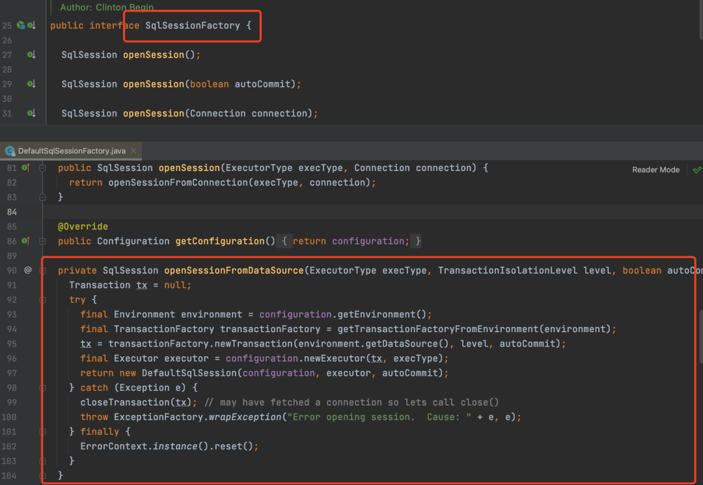
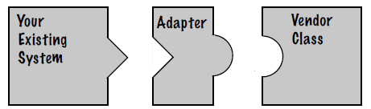
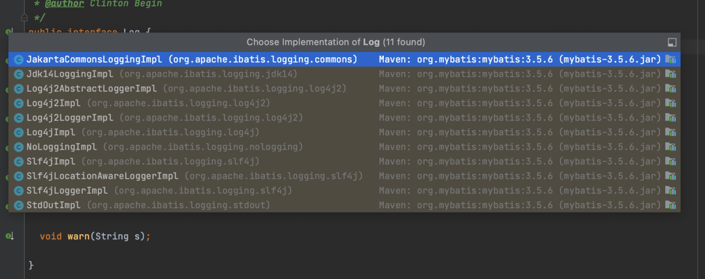
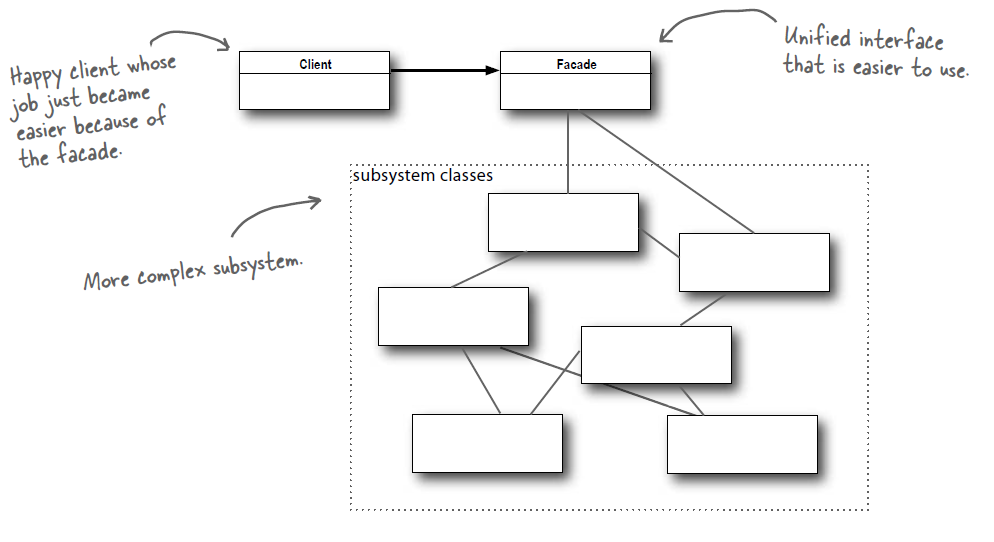
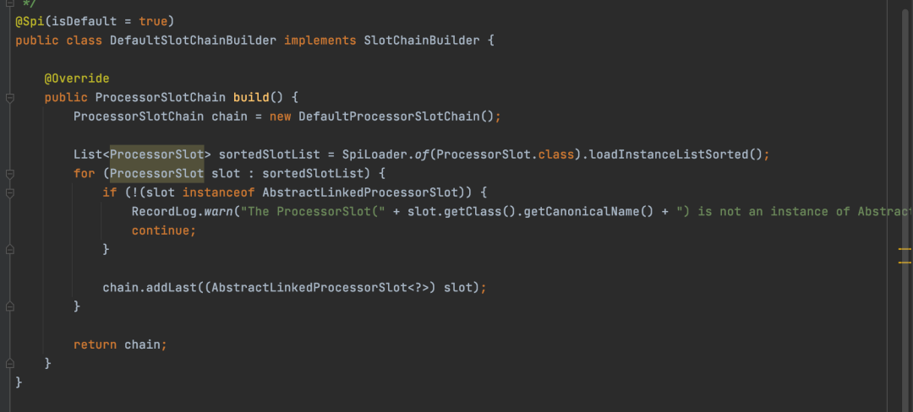
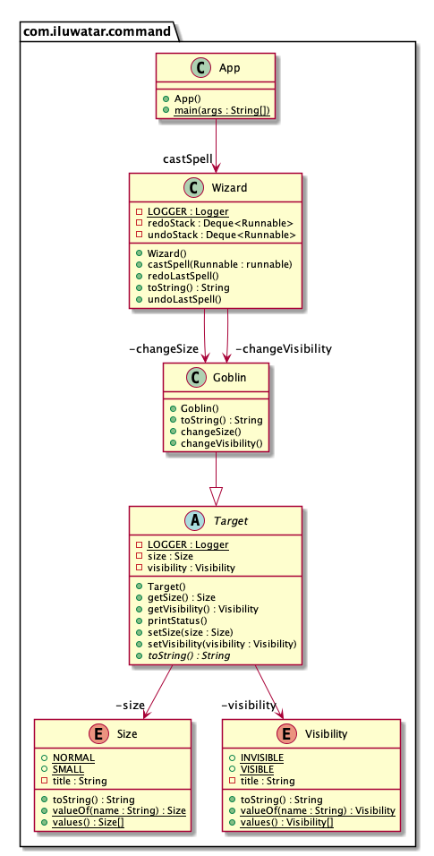
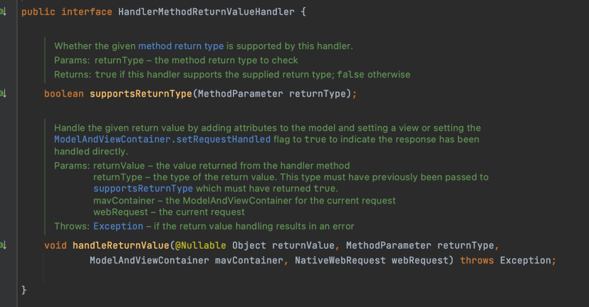
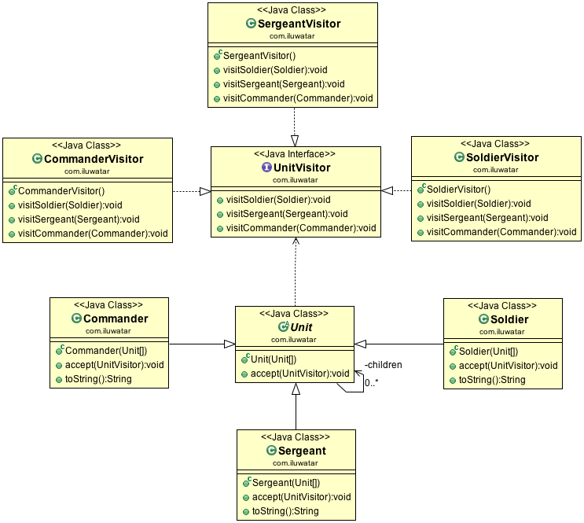

设计模式代表了最佳实践，是开发人员在开发过程中面临的一般问题的解决方案

# —————————————————

# 创建型

# —————————————————


# 单例模式（Singleton）

确保类只有一个实例，并提供全局访问点


#### Ⅰ 懒汉式

对构造函数私有化，即外界不能通过`new`关键字实例化`SingleTon`，只能通过`SingleTon`定义的获取唯一对象方法`getUniqueInstance()`去完成唯一对象的实例化或者是获取唯一对象，将实例化权力由自己掌控。

同时，没有类的实例化对象情况下，外界只能对类的 static 成员进行访问，所以要对实例化方法用`static`修饰，那么也要对声明的唯一实例`uniqueInstance`使用`static`修饰，同时使用`private`修饰唯一对象，让外界无论是实例化唯一对象还是获取都只能通过公开的`getUniqueInstance()`方法进行。

```java
public class Singleton {

    private static Singleton uniqueInstance;  // 延迟（懒）实例化
    
    private Singleton() {}

    public static Singleton getUniqueInstance() {
        // 多个线程同时到达，造成实例化多个对象
        if (uniqueInstance == null) {
            uniqueInstance = new Singleton();
        }
        return uniqueInstance;
    }
}
```

 

####  Ⅱ 懒汉式-线程安全

对实例化方法加锁，保证了线程安全。但是在获取对象的时候每个线程都需要按照顺序来，会让每个线程都阻塞产生性能问题。

```java
public static synchronized Singleton getUniqueInstance() {
    if (uniqueInstance == null) {
        uniqueInstance = new Singleton();
    }
    return uniqueInstance;
}
```


#### Ⅲ 饿汉式 - 线程安全

直接实例化 uniqueInstance 的方式就不会产生线程不安全问题，但是还没用到就实例化了，不能达到节省资源的目的。

```java
private static Singleton uniqueInstance = new Singleton();
```


#### Ⅳ 双重校验 - 线程安全

锁先判断 uniqueInstance 是否已经被实例化，如果没有被实例化，那么才对实例化语句进行加锁

```java
public class Singleton {

    private volatile static Singleton uniqueInstance;

    private Singleton() {}

    public static Singleton getUniqueInstance() {
        if (uniqueInstance == null) {
            synchronized (Singleton.class) {
                if (uniqueInstance == null) {
                    uniqueInstance = new Singleton();
                }
            }
        }
        
        return uniqueInstance;
    }
}
```

**1）两个 if **

第一个 if 避免了已经实例化后的加锁操作

第二个 if 避免了实例化多个对象


***2）volatile***

Java 中实例化对象，分为三步进行：

1. 选定内存空间
2. 初始化 uniqueInstance
3. 将 uniqueInstance 指向分配的内存地址


<h5 style="color: red">指令重排</h5>

但是由于 JVM 具有指令重排的特性，执行顺序有可能变成 1>3>2。当完成了第 3 步后，`uniqueInstance == null` 将会表示为 false，代表初始化完成，对象不为 null。

指令重排在单线程环境下不会出现问题，但是在多线程环境下会导致一个线程获得还没有初始化的实例。

例如，线程 T1 执行了 1 和 3，此时 T2 调用 getUniqueInstance() 后发现 uniqueInstance 不为空，因此返回 uniqueInstance，但此时 uniqueInstance 还未被初始化。

使用 volatile 可以禁止 JVM 的指令重排，保证在多线程环境下也能正常运行。


#### Ⅴ 静态内部类实现

当 Singleton 类被加载时，静态内部类 SingletonHolder 没有被加载进内存。只有当调用 `getUniqueInstance()` 方法从而触发 `SingletonHolder.INSTANCE` 时 SingletonHolder 才会被加载，此时初始化 INSTANCE 实例，并且 JVM 能确保 INSTANCE 只被实例化一次。

这种方式不仅具有延迟初始化的好处，而且由 JVM 提供了对线程安全的支持。

```java
public class Singleton {

    private Singleton() {}

    private static class SingletonHolder {
        private static final Singleton INSTANCE = new Singleton();
    }

    public static Singleton getUniqueInstance() {
        return SingletonHolder.INSTANCE;
    }
}
```


#### Ⅵ 枚举实现

```java
public enum Singleton {

    INSTANCE;

    private String objName;


    public String getObjName() {
        return objName;
    }


    public void setObjName(String objName) {
        this.objName = objName;
    }


    public static void main(String[] args) {

        // 单例测试
        Singleton firstSingleton = Singleton.INSTANCE;
        firstSingleton.setObjName("firstName");
        System.out.println(firstSingleton.getObjName());
        Singleton secondSingleton = Singleton.INSTANCE;
        secondSingleton.setObjName("secondName");
        System.out.println(firstSingleton.getObjName());
        System.out.println(secondSingleton.getObjName());

        // 反射获取实例测试
        try {
            Singleton[] enumConstants = Singleton.class.getEnumConstants();
            for (Singleton enumConstant : enumConstants) {
                System.out.println(enumConstant.getObjName());
            }
        } catch (Exception e) {
            e.printStackTrace();
        }
    }
}
```

```
firstName
secondName
secondName
secondName
```

该实现可以防止反射攻击。在其它实现中，通过 setAccessible() 方法可以将私有构造函数的访问级别设置为 public，然后调用构造函数从而实例化对象，如果要防止这种攻击，需要在构造函数中添加防止多次实例化的代码。该实现是由 JVM 保证只会实例化一次，因此不会出现上述的反射攻击。

该实现在多次序列化和序列化之后，不会得到多个实例。而其它实现需要使用 transient 修饰所有字段，并且实现序列化和反序列化的方法。


# 工厂模式

工厂意思为一种类型的工厂，如动物类型。

在开源项目中也使用的非常多，具体的实现大概可以细分为三种：

- 简单工厂模式
- 工厂方法模式
- 抽象工厂模式

## 简单工厂（Simple Factory）


封装一种类型对象的创建过程，假如类型是动物，调用者只需要表名想要的动物即可，不用关心这个动物是怎么来的。

```java
public class SimpleAnimalFactory {

    public Animal createAnimal(String animalType) {
        if ("cat".equals(animalType)) {
            Cat cat = new Cat();
            ...
            return cat;
        } else if ("dog".equals(animalType)) {
            Dog dog = new Dog();
            ...
            return dog;
        } else {
            throw new RuntimeException("animalType=" + animalType + "无法创建对应对象");
        }
    }

}
```

当需要使用这些对象，调用者就可以直接通过简单工厂创建就行。

```java
SimpleAnimalFactory animalFactory = new SimpleAnimalFactory();
Animal cat = animalFactory.createAnimal("cat");
```

> 一般来说如果每个动物对象的创建只需要简单地new一下就行了，那么其实就无需使用工厂模式，工厂模式适合对象创建过程复杂的场景。


## 工厂方法（Factory Method）

<h3>意图

简单工厂模式违反了七大设计原则的 OCP 原则，也就是开闭原则。

如果新增了一种动物兔子，那么createAnimal方法就得修改，增加一种类型的判断，那么就此时就出现了修改代码的行为，也就违反了对修改关闭的原则。

所以解决简单工厂模式违反开闭原则的问题，就可以使用工厂方法模式来解决。


<h3>Class Diagram

在简单工厂中，由一个工厂统一负责所有类型产品的创建。

而在工厂方法中，有一个工厂提供一个创建具体类型产品的接口，由此类型产品的子工厂负责创建此类产品。


拿上面的例子来说，如果现在新增了一种动物兔子，那么createAnimal方法就得修改，增加一种类型的判断，那么就此时就出现了修改代码的行为，也就违反了对修改关闭的原则。

```java
/**
 * 工厂接口
 */
public interface AnimalFactory {
    Animal createAnimal();
}

/**
 * 小猫实现
 */
public class CatFactory implements AnimalFactory {
    @Override
    public Animal createAnimal() {
        Cat cat = new Cat();
        //一系列复杂操作
        return cat;
    }
}

/**
 * 小狗实现
 */
public class DogFactory implements AnimalFactory {
    @Override
    public Animal createAnimal() {
        Dog dog = new Dog();
        //一系列复杂操作
        return dog;
    }
}
```

这种方式就是工厂方法模式。他将动物工厂提取成一个接口AnimalFactory，具体每个动物都各自实现这个接口，每种动物都有各自的创建工厂，如果调用者需要创建动物，就可以通过各自的工厂来实现。

```java
AnimalFactory animalFactory = new CatFactory();
Animal cat = animalFactory.createAnimal();
```


如果后续有新的动物，只需要实现 AnimalFactory接口就行 ，新增一个加载器工厂即可，不用对原有的代码进行修改。符合开闭原则。


## 抽象工厂（Abstract Factory）

<h3>意图

工厂方法模式其实是创建一个产品的工厂，而抽象工厂模式特点就是创建与此产品相关的一系列产品。

比如说，不同的动物吃的东西是不一样的，那么就可以加入食物这个产品，通过抽象工厂模式来实现这个产品相关对象的创建。


```java
public interface AnimalFactory {

    Animal createAnimal();

    Food createFood();
        
}
```

在动物工厂中，新增了创建食物的接口，小狗小猫的工厂去实现这个接口，创建狗粮和猫粮，这里就不去写了。


## 应用

**1、工厂模式在Mybatis的运用**

在Mybatis中，当需要调用Mapper接口执行sql的时候，需要先获取到SqlSession，通过SqlSession再获取到Mapper接口的动态代理对象，而SqlSession的构造过程比较复杂，所以就提供了SqlSessionFactory工厂类来封装SqlSession的创建过程。

SqlSessionFactory及默认实现DefaultSqlSessionFactory

对于使用者来说，只需要通过SqlSessionFactory来获取到SqlSession，而无需关心SqlSession是如何创建的。


**2、工厂模式在Spring中的运用**

我们知道Spring中的Bean是通过BeanFactory创建的。


BeanFactory就是Bean生成的工厂。

一个Spring Bean在生成过程中会经历复杂的一个生命周期，而这些生命周期对于使用者来说是无需关心的，所以就可以将Bean创建过程的逻辑给封装起来，提取出一个Bean的工厂。


# 建造者（Builder）

封装一个对象的构造过程，可以逐步构造。

~~~java
public class NutritionFacts {
    private final int servingSize;
    private final int servings;
    private final int calories;
    private final int fat;
    private final int sodium;
    private final int carbohydrate;

    public static class Builder {
        // 必须参数
        private final int servingSize;
        private final int servings;
        // 可选参数 - 初始化值
        private int calories = 0;
        private int fat = 0;
        private int sodium = 0;
        private int carbohydrate = 0;
        public Builder(int servingSize, int servings) {
            this.servingSize = servingSize;
            this.servings = servings;
        } 
        public Builder calories(int val){ 
            calories = val; return this; 
        }
        public Builder fat(int val){ 
            fat = val; return this; 
        }
        public Builder sodium(int val){ 
            sodium = val; return this; 
        }
        public Builder carbohydrate(int val){ 
            carbohydrate = val; return this; 
        }
        public NutritionFacts build() {
            return new NutritionFacts(this);
        }
    } 
    private NutritionFacts(Builder builder) {
        servingSize = builder.servingSize;
        servings = builder.servings;
        calories = builder.calories;
        fat = builder.fat;
        sodium = builder.sodium;
        carbohydrate = builder.carbohydrate;
    }
}
~~~


# 原型模式（Prototype）


### 意图

使用原型实例指定要创建对象的类型，通过复制这个原型来创建新对象。

### Class Diagram

[](https://camo.githubusercontent.com/257e892ab993b7d4b1055b6c721df4a080b63b357014707466d3c245360bcbc5/68747470733a2f2f63732d6e6f7465732d313235363130393739362e636f732e61702d6775616e677a686f752e6d7971636c6f75642e636f6d2f62383932326638632d393565362d343138372d626538352d3537326135303961666237312e706e67)


### Implementation

```java
public abstract class Prototype {
    abstract Prototype myClone();
}
```

~~~java
public class ConcretePrototype extends Prototype {

    private String filed;

    public ConcretePrototype(String filed) {
        this.filed = filed;
    }

    @Override
    Prototype myClone() {
        return new ConcretePrototype(filed);
    }

    @Override
    public String toString() {
        return filed;
    }
}
~~~

~~~java
public class Client {
    public static void main(String[] args) {
        Prototype prototype = new ConcretePrototype("abc");
        Prototype clone = prototype.myClone();
        System.out.println(clone.toString());
    }
}
~~~

```
abc
```


# —————————————————

# 结构性

# —————————————————


# 桥接（Bridge）

### 意图

将抽象与实现分离开来，使他们可以独立变化。

### Class Diagram

- Abstraction：定义抽象类的接口
- Implementor：定义实现类接口


###  Implementation

RemoteControl 表示遥控器，指代 Abstraction。

TV 表示电视，指代 Implementor。

桥接模式将遥控器和电视分离开来，从而可以独立改变遥控器或者电视的实现。

```java
public abstract class TV {
    public abstract void on();

    public abstract void off();

    public abstract void tuneChannel();
}
```

```java
public class Sony extends TV {
    @Override
    public void on() {
        System.out.println("Sony.on()");
    }

    @Override
    public void off() {
        System.out.println("Sony.off()");
    }

    @Override
    public void tuneChannel() {
        System.out.println("Sony.tuneChannel()");
    }
}
```

```java
public class RCA extends TV {
    @Override
    public void on() {
        System.out.println("RCA.on()");
    }

    @Override
    public void off() {
        System.out.println("RCA.off()");
    }

    @Override
    public void tuneChannel() {
        System.out.println("RCA.tuneChannel()");
    }
}
```

```java
public abstract class RemoteControl {
    protected TV tv;

    public RemoteControl(TV tv) {
        this.tv = tv;
    }

    public abstract void on();

    public abstract void off();

    public abstract void tuneChannel();
}
```

```java
public class ConcreteRemoteControl1 extends RemoteControl {
    public ConcreteRemoteControl1(TV tv) {
        super(tv);
    }

    @Override
    public void on() {
        System.out.println("ConcreteRemoteControl1.on()");
        tv.on();
    }

    @Override
    public void off() {
        System.out.println("ConcreteRemoteControl1.off()");
        tv.off();
    }

    @Override
    public void tuneChannel() {
        System.out.println("ConcreteRemoteControl1.tuneChannel()");
        tv.tuneChannel();
    }
}
```

```java
public class ConcreteRemoteControl2 extends RemoteControl {
    public ConcreteRemoteControl2(TV tv) {
        super(tv);
    }

    @Override
    public void on() {
        System.out.println("ConcreteRemoteControl2.on()");
        tv.on();
    }

    @Override
    public void off() {
        System.out.println("ConcreteRemoteControl2.off()");
        tv.off();
    }

    @Override
    public void tuneChannel() {
        System.out.println("ConcreteRemoteControl2.tuneChannel()");
        tv.tuneChannel();
    }
}
```

```java
public class Client {
    public static void main(String[] args) {
        RemoteControl remoteControl1 = new ConcreteRemoteControl1(new RCA());
        remoteControl1.on();
        remoteControl1.off();
        remoteControl1.tuneChannel();
        RemoteControl remoteControl2 = new ConcreteRemoteControl2(new Sony());
        remoteControl2.on();
        remoteControl2.off();
        remoteControl2.tuneChannel();
    }
}
```


# 装饰（Decorator）

**意图**

为对象动态添加功能。


**Class Diagram**

装饰者（Decorator）和具体组件（ConcreteComponent）都实现自组件（Component），具体组件的方法实现不需要依赖于其它对象。


装饰者组合了一个组件，这样它可以装饰其它装饰者或者具体组件。


所谓装饰，就是把这个装饰者套在被装饰者（具体组件）之上，从而动态扩展被装饰者（具体组件）的功能。


Java I/O 使用了装饰者模式来实现。以 InputStream 为例，

- InputStream 类是抽象组件；
- 除了 FilterInputStream 类之外的继承类属于具体组件；
- FilterInputStream 类属于装饰者，装饰者用于装饰组件，为组件提供额外的功能。装饰者组合了一个InputStream。


实例化一个具有缓存功能的字节流对象时，只需要在 FileInputStream 对象上再套一层 BufferedInputStream 对象即可。

```java
BufferedInputStream bufferedInputStream = new BufferedInputStream(new FileInputStream(filePath));
```


## Implement

设计不同种类的饮料，饮料可以添加配料，比如可以添加牛奶，并且支持动态添加新配料。每增加一种配料，该饮料的价格就会增加，要求计算一种饮料的价格。


DarkRoast 被 Mocha 包裹，Mocha 又被 Whip 包裹。它们都继承自相同父类，都有 cost() 方法，外层类的 cost() 方法调用了内层类的 cost() 方法。

可以这么理解：DarkRoast 饮料是一个组件，配料就相当于装饰者，可以随便加


```java
public interface Beverage {
    double cost();
}
```

```java
public class DarkRoast implements Beverage {
    @Override
    public double cost() {
        return 1;
    }
}
```

```java
public class HouseBlend implements Beverage {
    @Override
    public double cost() {
        return 1;
    }
}
```

```java
public abstract class CondimentDecorator implements Beverage {
    protected Beverage beverage;
}
```

```java
public class Milk extends CondimentDecorator {

    public Milk(Beverage beverage) {
        this.beverage = beverage;
    }

    //装饰者的方法有一部分是自己的，这属于它的功能，然后调用被装饰者（具体组件）的方法实现，从而也保留了被装饰者的功能。
    //比如 1 就是自己功能，然后调用具体组件的方法
    @Override
    public double cost() {
        return 1 + beverage.cost();
    }
}
```

```java
public class Mocha extends CondimentDecorator {

    public Mocha(Beverage beverage) {
        this.beverage = beverage;
    }

    //装饰者的方法有一部分是自己的，这属于它的功能，然后调用被装饰者（具体组件）的方法实现，从而也保留了被装饰者的功能。
    //比如 1 就是自己功能，然后调用具体组件的方法
    @Override
    public double cost() {
        return 1 + beverage.cost();
    }
}
```


为 `HouseBlend` 添加 `Mocha` 和 `Milk` 配料

```java
public class Client {

    public static void main(String[] args) {
        Beverage beverage = new HouseBlend();
        beverage = new Mocha(beverage);
        beverage = new Milk(beverage);
        
        //可以替换成 这样实例化
        //Beverage beverage = new Milk(new Mocha(new HouseBlend()));
        
        System.out.println(beverage.cost());
    }
}
```

```
3.0
```


通过 `Beverage beverage = new Milk(new Mocha(new HouseBlend()))` 的实例化方式，可以看出来，具体组件是最底层的组件，因为它的功能是确定了的（修改关闭），如果我们想要加强它，例如加点配料，可以再加点**糖**。

那么我们需要的就是写一个类 soga 实现装饰者 `CondimentDecorator` ，并且装饰到 beverage 上即可啦。


## 设计原则

类应该对扩展开放，对修改关闭：也就是添加新功能时不需要修改代码。


饮料可以动态添加新的配料，而不需要去修改饮料的代码。


不可能把所有的类设计成都满足这一原则，应当把该原则应用于最有可能发生改变的地方。


# 代理（Proxy）

提供对象的替代品或占位符。代理控制元对象的访问，并且允许在将请求提交给对象前进行一些处理（在**不修改原目标对象的前提下，提供额外的功能**，比如在目标对象的某个方法执行前后增加自定义的操作）


## 静态代理


- 定义接口和接口实现类；

  

- 创建代理类同样实现这个接口

  

- 将目标对象（接口实现类）注入进代理类，然后在代理类的对应方法调用目标类中的对应方法。

  

这样的话，我们就可以通过代理类屏蔽对目标对象的访问，并且可以在目标方法执行前后做一些自己想做的事情


### 示例1

模拟了图片延迟加载的情况下使用与图片大小相等的临时内容去替换原始图片，直到图片加载完成才将图片显示出来。

```java
public interface Image {
    void showImage();
}
```

~~~java
public class HighResolutionImage implements Image {

    private URL imageURL;
    private long startTime;
    private int height;
    private int width;

    public int getHeight() {
        return height;
    }

    public int getWidth() {
        return width;
    }

    public HighResolutionImage(URL imageURL) {
        this.imageURL = imageURL;
        this.startTime = System.currentTimeMillis();
        this.width = 600;
        this.height = 600;
    }

    public boolean isLoad() {
        // 模拟图片加载，延迟 3s 加载完成
        long endTime = System.currentTimeMillis();
        return endTime - startTime > 3000;
    }

    @Override
    public void showImage() {
        System.out.println("Real Image: " + imageURL);
    }
}
~~~

~~~java
public class ImageProxy implements Image {

    private HighResolutionImage highResolutionImage;

    public ImageProxy(HighResolutionImage highResolutionImage) {
        this.highResolutionImage = highResolutionImage;
    }

    @Override
    public void showImage() {
        while (!highResolutionImage.isLoad()) {
            try {
                System.out.println("Temp Image: " + highResolutionImage.getWidth() + " " + highResolutionImage.getHeight());
                Thread.sleep(100);
            } catch (InterruptedException e) {
                e.printStackTrace();
            }
        }
        highResolutionImage.showImage();
    }
}
~~~

~~~java
public class ImageViewer {

    public static void main(String[] args) throws Exception {
        String image = "http://image.jpg";
        URL url = new URL(image);
        HighResolutionImage highResolutionImage = new HighResolutionImage(url);
        ImageProxy imageProxy = new ImageProxy(highResolutionImage);
        imageProxy.showImage();
    }
}
~~~


### 示例2

**1.定义发送短信的接口**

```java
public interface SmsService {
    String send(String message);
}
```

**2.实现发送短信的接口**

```java
public class SmsServiceImpl implements SmsService {
    public String send(String message) {
        System.out.println("send message:" + message);
        return message;
    }
}
```

**3.创建代理类并同样实现发送短信的接口**

```java
public class SmsProxy implements SmsService {

    private final SmsService smsService;

    public SmsProxy(SmsService smsService) {
        this.smsService = smsService;
    }

    @Override
    public String send(String message) {
        //调用方法之前，我们可以添加自己的操作
        System.out.println("before method send()");
        
        smsService.send(message);
        
        //调用方法之后，我们同样可以添加自己的操作
        System.out.println("after method send()");
        return null;
    }
}
```

**4.实际使用**

```java
public class Main {
    public static void main(String[] args) {
        SmsProxy smsProxy = new SmsProxy(new SmsServiceImpl());
        smsProxy.send("java");
    }
}
```

Output：

```bash
before method send()
send message:java
after method send()
```


## 动态代理

### JDK 动态代理

##### InvocationHandler 接口

动态代理对象调用一个方法时，方法的调用就会被转发到实现`InvocationHandler` 接口类的 `invoke` 方法来调用

```java
public interface myInvocationHandler implements InvocationHandler{
    public Object invoke(Object proxy, 
                         Method method, 
                         Object[] args) throws Throwable {
        ....
    }
}
```

**`proxy`** :代理类

**`method`** : 代理对象被调用的方法

**`args`** : 方法参数值


##### Proxy.newProxyInstance()

生成代理对象

```java
public static Object newProxyInstance(ClassLoader loader,
                                      Class<?>[] interfaces,
                                      InvocationHandler h) throws IllegalArgumentException {
        ......
    }
```


#### 步骤

1. 定义接口和接口实现类；
2. 实现 `InvocationHandler` 并重写`invoke`方法，在 `invoke` 方法中会调用原生方法并自定义一些处理逻辑
3. 通过 `Proxy.newProxyInstance(ClassLoader loader,Class<?>[] interfaces,InvocationHandler h)` 方法创建代理对象；

#### 示例

**1.接口**

```java
public interface SmsService {
    String send(String message);
}
```

**2.接口实现类**

```java
public class SmsServiceImpl implements SmsService {
    public String send(String message) {
        System.out.println("send message:" + message);
        return message;
    }
}
```

**3.定义 JDK 动态代理类**

```java
import java.lang.reflect.InvocationHandler;
import java.lang.reflect.InvocationTargetException;
import java.lang.reflect.Method;

public class DebugInvocationHandler implements InvocationHandler {
    
    //被代理类对象
    private final Object target;

    public DebugInvocationHandler(Object target) {
        this.target = target;
    }

    public Object invoke(Object proxy, Method method, Object[] args) throws InvocationTargetException, IllegalAccessException {
        //调用方法之前，我们可以添加自己的操作
        System.out.println("before method " + method.getName());
        
        Object result = method.invoke(target, args);
        
        //调用方法之后，我们同样可以添加自己的操作
        System.out.println("after method " + method.getName());
        return result;
    }
}
```

**4.获取代理对象的工厂类**

```java
public class JdkProxyFactory {
    public static Object getProxy(Object target) {
        return Proxy.newProxyInstance(
                target.getClass().getClassLoader(), // 被代理类的类加载器
                target.getClass().getInterfaces(),  // 被代理类的接口
                new DebugInvocationHandler(target)   // 代理类
        );
    }
}
```

**5.实际使用**

```java
SmsService smsService = (SmsService) JdkProxyFactory.getProxy(new SmsServiceImpl());
smsService.send("java");
```

Output：

```text
before method send
send message:java
after method send
```


### CGLIB 动态代理机制

允许我们在运行时对字节码进行修改和动态生成，继承方式实现。也就是生成被代理类的子类。


核心

-  `MethodInterceptor` 接口
-  `Enhancer` 类


自定义 `MethodInterceptor` 并重写 `intercept` 方法，`intercept` 用于拦截增强被代理类的方法

```java
public interface MethodInterceptor
extends Callback{
    // 拦截被代理对象中的方法
    public Object intercept(Object obj, 
                            Method method, 
                            Object[] args,
                            MethodProxy proxy) throws Throwable;
}
```

- **`obj`** ：被代理的对象
- **`method`** ：被拦截的方法
- **`args`** ：方法参数
- **`proxy`** ：用于调用原始方法


通过 `Enhancer`类来动态获取被代理类，当代理类调用方法的时候，实际调用的是 `MethodInterceptor` 中的 `intercept` 方法


#### 步骤

1. 定义一个类；
2. 实现 `MethodInterceptor` 并重写 `intercept` 方法，`intercept` 用于拦截增强被代理类的方法
3. 通过 `Enhancer` 类的 `create()`创建代理类


#### 示例

添加相关依赖

```xml
<dependency>
  <groupId>cglib</groupId>
  <artifactId>cglib</artifactId>
  <version>3.3.0</version>
</dependency>
```

**1.实现一个使用阿里云发送短信的类**

```java
public class AliSmsService {
    public String send(String message) {
        System.out.println("send message:" + message);
        return message;
    }
}
```

**2.实现 `MethodInterceptor`**

```java
import net.sf.cglib.proxy.MethodInterceptor;
import net.sf.cglib.proxy.MethodProxy;
import java.lang.reflect.Method;

public class DebugMethodInterceptor implements MethodInterceptor {
 
    @Override
    public Object intercept(Object o, Method method, Object[] args, MethodProxy methodProxy) throws Throwable {
        //调用方法之前，我们可以添加自己的操作
        System.out.println("before method " + method.getName());
        Object object = methodProxy.invokeSuper(o, args);
        //调用方法之后，我们同样可以添加自己的操作
        System.out.println("after method " + method.getName());
        return object;
    }

}
```

**3.获取代理对象的工厂类**

```java
import net.sf.cglib.proxy.Enhancer;

public class CglibProxyFactory {

    public static Object getProxy(Class<?> clazz) {

        Enhancer enhancer = new Enhancer();
        
        // 设置类加载器
        enhancer.setClassLoader(clazz.getClassLoader());
        
        // 设置被代理类
        enhancer.setSuperclass(clazz);
        
        // 设置方法拦截器
        enhancer.setCallback(new DebugMethodInterceptor());

        return enhancer.create();
    }
}
```

**4.实际使用**

```java
AliSmsService aliSmsService = (AliSmsService) CglibProxyFactory.getProxy(AliSmsService.class);
aliSmsService.send("java");
```

Output：

```bash
before method send
send message:java
after method send
```


## 静动代理区别

1. **灵活性** ：动态代理更加灵活，不需要必须实现接口，可以直接代理实现类。

   并且可以==不需要针对每个目标类都创建一个代理类==。

   另外，静态代理中，接口一旦新增加方法，目标对象和代理对象都要进行修改，这是非常麻烦的！

   > 也就是说动态代理：
   >
   > - 为所有目标代理类创建了一个统一的代理类
   > - 代理类直接代理目标类的所有方法，且只需要同一代理逻辑

2. **JVM 层面** ：

   静态代理在编译时就将接口、实现类、代理类这些都变成了一个个实际的 class 文件

   而动态代理是在运行时动态生成类字节码，并加载到 JVM 中的


# 适配器（Adapter）

适配器模式使得原本由于接口不兼容而不能一起工作的哪些类可以一起工作，将一个类的接口转换成客户希望的另一个接口。




举个生活中的例子，比如手机充电器接口类型有USB TypeC接口和Micro USB接口等。现在需要给一个Micro USB接口的手机充电，但是现在只有USB TypeC接口的充电器，这怎么办呢？

其实一般可以弄个一个USB TypeC转Micro USB接口的转接头，这样就可以给Micro USB接口手机充电了，代码如下


USBTypeC接口充电

```java
public class USBTypeC {

    public void chargeTypeC() {
        System.out.println("开启充电了");
    }

}
```

MicroUSB接口

```java
public interface MicroUSB {

    void charge();

}
```

适配实现，最后是调用USBTypeC接口来充电

```java
public class MicroUSBAdapter implements MicroUSB {

    private final USBTypeC usbTypeC = new USBTypeC();

    @Override
    public void charge() {
        //使用usb来充电
        usbTypeC.chargeTypeC();
    }

}
```

方然除了上面这种写法，还有一种继承的写法。

```java
public class MicroUSBAdapter extends USBTypeC implements MicroUSB {

    @Override
    public void charge() {
        //使用usb来充电
        this.chargeTypeC();
    }

}
```

这两种写法主要是继承和组合（聚合）的区别。

这样就可以通过适配器（转接头）就可以实现USBTypeC给MicroUSB接口充电。


#### 日志中的使用

在日常开发中，日志是必不可少的，可以帮助我们快速快速定位问题，但是日志框架比较多，比如Slf4j、Log4j等等，一般同一系统都使用一种日志框架。

但是像Mybatis这种框架来说，它本身在运行的过程中也需要产生日志，但是Mybatis框架在设计的时候，无法知道项目中具体使用的是什么日志框架，所以只能适配各种日志框架，项目中使用什么框架，Mybatis就使用什么框架。

为此Mybatis提供一个Log接口


而不同的日志框架，只需要适配这个接口就可以了

Slf4jLoggerImpl

就拿Slf4j的实现来看，内部依赖了一个Slf4j框架中的Logger对象，最后所有日志的打印都是通过Slf4j框架中的Logger对象来实现的。

此外，Mybatis还提供了如下的一些实现



这样，Mybatis在需要打印日志的时候，只需要从Mybatis自己的LogFactory中获取到Log对象就行，至于最终获取到的是什么Log实现，由最终项目中使用日志框架来决定。


<h3>适用性</h3>

在以下情况下使用适配器模式

- 您想使用现有类，但其接口与您需要的接口不匹配
- 您希望创建一个可重用的类，该类与不相关或不可预见的类（即不一定具有兼容接口的类）协作
- 您需要使用几个现有的子类，但是通过对每个人进行子类化来调整它们的接口是不切实际的。对象适配器可以调整其父类的接口。
- 大多数使用第三方库的应用程序使用适配器作为应用程序和第三方库之间的中间层，以将应用程序与库分离。如果必须使用另一个库，则只需要新库的适配器，而不必更改应用程序代码。


<h3>已知用途</h3>

- [java.util.Arrays#asList()](http://docs.oracle.com/javase/8/docs/api/java/util/Arrays.html#asList(T...))
- [java.util.Collections#list()](https://docs.oracle.com/javase/8/docs/api/java/util/Collections.html#list-java.util.Enumeration-)
- [java.util.Collections#enumeration()](https://docs.oracle.com/javase/8/docs/api/java/util/Collections.html#enumeration-java.util.Collection-)
- [javax.xml.bind.annotation.adapters.XMLAdapter](http://docs.oracle.com/javase/8/docs/api/javax/xml/bind/annotation/adapters/XmlAdapter.html#marshal-BoundType-)


# 组合（Composite）

<h3>意图</h3>

将对象组合成树形结构来表示“整体/部分”层次关系，允许用户以相同的方式处理单独对象和组合对象。


<h3>示例</h3>

**示例（1）**

每个句子都由单词组成，而单词又由字符组成。这些中的每一个 对象是可打印的，它们可以在它们之前或之后打印一些东西，如句子 总是以句号结尾，单词前面总是有空格。

```java
public abstract class LetterComposite {

  private final List<LetterComposite> children = new ArrayList<>();

  public void add(LetterComposite letter) {
    children.add(letter);
  }

  public int count() {
    return children.size();
  }

  protected void printThisBefore() {
  }

  protected void printThisAfter() {
  }

  public void print() {
    printThisBefore();
    children.forEach(LetterComposite::print);
    printThisAfter();
  }
}

public class Letter extends LetterComposite {

  private final char character;

  public Letter(char c) {
    this.character = c;
  }

  @Override
  protected void printThisBefore() {
    System.out.print(character);
  }
}

public class Word extends LetterComposite {

  public Word(List<Letter> letters) {
    letters.forEach(this::add);
  }

  public Word(char... letters) {
    for (char letter : letters) {
      this.add(new Letter(letter));
    }
  }

  @Override
  protected void printThisBefore() {
    System.out.print(" ");
  }
}

public class Sentence extends LetterComposite {

  public Sentence(List<Word> words) {
    words.forEach(this::add);
  }

  @Override
  protected void printThisAfter() {
    System.out.print(".");
  }
}
```

然后我们有一个信使来传递消息：

```java
public class Messenger {

  LetterComposite messageFromOrcs() {

    var words = List.of(
        new Word('W', 'h', 'e', 'r', 'e'),
        new Word('t', 'h', 'e', 'r', 'e'),
        new Word('i', 's'),
        new Word('a'),
        new Word('w', 'h', 'i', 'p'),
        new Word('t', 'h', 'e', 'r', 'e'),
        new Word('i', 's'),
        new Word('a'),
        new Word('w', 'a', 'y')
    );

    return new Sentence(words);

  }

  LetterComposite messageFromElves() {

    var words = List.of(
        new Word('M', 'u', 'c', 'h'),
        new Word('w', 'i', 'n', 'd'),
        new Word('p', 'o', 'u', 'r', 's'),
        new Word('f', 'r', 'o', 'm'),
        new Word('y', 'o', 'u', 'r'),
        new Word('m', 'o', 'u', 't', 'h')
    );

    return new Sentence(words);

  }

}
```

然后它可以用作：

```java
var messenger = new Messenger();

LOGGER.info("Message from the orcs: ");
messenger.messageFromOrcs().print();

LOGGER.info("Message from the elves: ");
messenger.messageFromElves().print();
```

控制台输出：

```
Message from the orcs: 
 Where there is a whip there is a way.
Message from the elves: 
 Much wind pours from your mouth.
```


**示例（2）**

组件（Component）类是组合类（Composite）和叶子类（Leaf）的父类，可以把组合类看成是树的中间节点。

组合对象拥有一个或者多个组件对象，因此组合对象的操作可以委托给组件对象去处理，而组件对象可以是另一个组合对象或者叶子对象。


```java
public abstract class Component {
    protected String name;

    public Component(String name) {
        this.name = name;
    }

    public void print() {
        print(0);
    }

    abstract void print(int level);

    abstract public void add(Component component);

    abstract public void remove(Component component);
}
public class Composite extends Component {

    private List<Component> child;

    public Composite(String name) {
        super(name);
        child = new ArrayList<>();
    }

    @Override
    void print(int level) {
        for (int i = 0; i < level; i++) {
            System.out.print("--");
        }
        System.out.println("Composite:" + name);
        for (Component component : child) {
            component.print(level + 1);
        }
    }

    @Override
    public void add(Component component) {
        child.add(component);
    }

    @Override
    public void remove(Component component) {
        child.remove(component);
    }
}
public class Leaf extends Component {
    public Leaf(String name) {
        super(name);
    }

    @Override
    void print(int level) {
        for (int i = 0; i < level; i++) {
            System.out.print("--");
        }
        System.out.println("left:" + name);
    }

    @Override
    public void add(Component component) {
        throw new UnsupportedOperationException(); // 牺牲透明性换取单一职责原则，这样就不用考虑是叶子节点还是组合节点
    }

    @Override
    public void remove(Component component) {
        throw new UnsupportedOperationException();
    }
}
public class Client {
    public static void main(String[] args) {
        Composite root = new Composite("root");
        Component node1 = new Leaf("1");
        Component node2 = new Composite("2");
        Component node3 = new Leaf("3");
        root.add(node1);
        root.add(node2);
        root.add(node3);
        Component node21 = new Leaf("21");
        Component node22 = new Composite("22");
        node2.add(node21);
        node2.add(node22);
        Component node221 = new Leaf("221");
        node22.add(node221);
        root.print();
    }
}
Composite:root
--left:1
--Composite:2
----left:21
----Composite:22
------left:221
--left:3
```


<h3>适用性</h3>

在以下情况下使用复合模式

- 您希望表示对象的部分整体层次结构。
- 您希望客户端能够忽略对象组合和 单个对象。客户将统一处理复合结构中的所有对象。


<h3>已知用途</h3>

- [java.awt.Container](http://docs.oracle.com/javase/8/docs/api/java/awt/Container.html)和[java.awt.Component](http://docs.oracle.com/javase/8/docs/api/java/awt/Component.html)
- [Apache Wicket](https://github.com/apache/wicket)组件树，请参阅[组件](https://github.com/apache/wicket/blob/91e154702ab1ff3481ef6cbb04c6044814b7e130/wicket-core/src/main/java/org/apache/wicket/Component.java)和[标记容器](https://github.com/apache/wicket/blob/b60ec64d0b50a611a9549809c9ab216f0ffa3ae3/wicket-core/src/main/java/org/apache/wicket/MarkupContainer.java)


# 外观（Facade）

<h3>意图</h3>

提供了一个统一的接口，用来访问子系统中的一群接口，从而让子系统更容易使用。





观看电影需要操作很多电器，使用外观模式实现一键看电影功能。

```java
public class SubSystem {
    public void turnOnTV() {
        System.out.println("turnOnTV()");
    }

    public void setCD(String cd) {
        System.out.println("setCD( " + cd + " )");
    }

    public void startWatching(){
        System.out.println("startWatching()");
    }
}
public class Facade {
    private SubSystem subSystem = new SubSystem();

    public void watchMovie() {
        subSystem.turnOnTV();
        subSystem.setCD("a movie");
        subSystem.startWatching();
    }
}
public class Client {
    public static void main(String[] args) {
        Facade facade = new Facade();
        facade.watchMovie();
    }
}
```

**设计原则**

最少知识原则：只和你的密友谈话。也就是说客户对象所需要交互的对象应当尽可能少。


# 享元（Flyweight）

<h3>意图</h3>

利用共享的方式来支持大量细粒度的对象，这些对象一部分内部状态是相同的。


- Flyweight：享元对象
- IntrinsicState：内部状态，享元对象共享内部状态
- ExtrinsicState：外部状态，每个享元对象的外部状态不同


```java
public interface Flyweight {
    void doOperation(String extrinsicState);
}
public class ConcreteFlyweight implements Flyweight {

    private String intrinsicState;

    public ConcreteFlyweight(String intrinsicState) {
        this.intrinsicState = intrinsicState;
    }

    @Override
    public void doOperation(String extrinsicState) {
        System.out.println("Object address: " + System.identityHashCode(this));
        System.out.println("IntrinsicState: " + intrinsicState);
        System.out.println("ExtrinsicState: " + extrinsicState);
    }
}
public class FlyweightFactory {

    private HashMap<String, Flyweight> flyweights = new HashMap<>();

    Flyweight getFlyweight(String intrinsicState) {
        if (!flyweights.containsKey(intrinsicState)) {
            Flyweight flyweight = new ConcreteFlyweight(intrinsicState);
            flyweights.put(intrinsicState, flyweight);
        }
        return flyweights.get(intrinsicState);
    }
}
public class Client {

    public static void main(String[] args) {
        FlyweightFactory factory = new FlyweightFactory();
        Flyweight flyweight1 = factory.getFlyweight("aa");
        Flyweight flyweight2 = factory.getFlyweight("aa");
        flyweight1.doOperation("x");
        flyweight2.doOperation("y");
    }
}
```

```
Object address: 1163157884
IntrinsicState: aa
ExtrinsicState: x
Object address: 1163157884
IntrinsicState: aa
ExtrinsicState: y
```


<h3>JDK</h3>

Java 利用缓存来加速大量小对象的访问时间。

- java.lang.Integer#valueOf(int)
- java.lang.Boolean#valueOf(boolean)
- java.lang.Byte#valueOf(byte)
- java.lang.Character#valueOf(char)


# —————————————————

# 行为型

# —————————————————


# 责任链（Chain Of Responsibility)

在责任链模式里，很多对象由每一个对象对其下家的引用而连接起来形成一条链。请求在这个链上传递，由该链上的某一个对象或者某几个对象决定处理此请求，每个对象在整个处理过程中值扮演一个小小的角色。

举个例子，现在有个请假的审批流程，根据请假的人的级别审批到的领导不同，比如有有组长、主管、HR、分管经理等等。

先需要定义一个处理抽象类，抽象类有个下一个处理对象的引用，提供了抽象处理方法，还有一个对下一个处理对象的调用方法。

```java
public abstract class ApprovalHandler {

    /**
     * 责任链中的下一个处理对象
     */
    protected ApprovalHandler next;

    /**
     * 设置下一个处理对象
     *
     * @param approvalHandler
     */
    public void nextHandler(ApprovalHandler approvalHandler) {
        this.next = approvalHandler;
    }

    /**
     * 处理
     *
     * @param approvalContext
     */
    public abstract void approval(ApprovalContext approvalContext);

    /**
     * 调用下一个处理对象
     *
     * @param approvalContext
     */
    protected void invokeNext(ApprovalContext approvalContext) {
        if (next != null) {
            next.approval(approvalContext);
        }
    }

}
```

几种审批人的实现类

```java
//组长审批实现
public class GroupLeaderApprovalHandler extends ApprovalHandler {
    @Override
    public void approval(ApprovalContext approvalContext) {
        ..组长审批
        invokeNext(approvalContext); //调用下一个处理对象进行处理
    }
}

//主管审批实现
public class DirectorApprovalHandler extends ApprovalHandler {
    @Override
    public void approval(ApprovalContext approvalContext) {
        invokeNext(approvalContext);
    }
}

//hr审批实现
public class HrApprovalHandler extends ApprovalHandler {
    @Override
    public void approval(ApprovalContext approvalContext) {
        invokeNext(approvalContext);
    }
}
```

有了这几个实现之后，接下来就需要对对象进行组装，组成一个链条，比如在Spring中就可以这么玩。

```java
@Component
public class ApprovalHandlerChain {

    @Autowired
    private GroupLeaderApprovalHandler groupLeaderApprovalHandler;
    
    @Autowired
    private DirectorApprovalHandler directorApprovalHandler;
    
    @Autowired
    private HrApprovalHandler hrApprovalHandler;

    public ApprovalHandler getChain() {
        //组长处理完下一个处理对象是主管
        groupLeaderApprovalHandler.nextHandler(directorApprovalHandler);
        //主管处理完下一个处理对象是hr
        directorApprovalHandler.nextHandler(hrApprovalHandler);
        //返回组长，这样就从组长开始审批，一条链就完成了
        return groupLeaderApprovalHandler;
    }

}
```

之后对于调用方而言，只需要获取到链条，开始处理就行。

一旦后面出现需要增加或者减少审批人，只需要调整链条中的节点就行，对于调用者来说是无感知的。


#### SpringMVC的拦截器

mvc责任链模式的写法跟上面举的例子写法不太一样。

可以责任链中每一个节点都设想成一个拦截者，遍历拦截者，符合拦截者拦截条件的就会进行处理


对于HandlerInterceptor的调用是在HandlerExecutionChain中完成的。


比如说，对于请求处理前的拦截，就在是这样调用的。


#### Sentinel

Sentinel是阿里开源的一个流量治理组件，而Sentinel核心逻辑的执行其实就是一条责任链。

在Sentinel中，有个核心抽象类AbstractLinkedProcessorSlot

AbstractLinkedProcessorSlot

这个组件内部也维护了下一个节点对象，这个类扮演的角色跟例子中的ApprovalHandler类是一样的，写法也比较相似。这个组件有很多实现


比如有比较核心的几个实现

- DegradeSlot：熔断降级的实现
- FlowSlot：流量控制的实现
- StatisticSlot：统计的实现，比如统计请求成功的次数、异常次数，为限流提供数据来源
- SystemSlot：根据系统规则来进行流量控制

整个链条的组装的实现是由DefaultSlotChainBuilder实现的

DefaultSlotChainBuilder

并且内部是使用了SPI机制来加载每个处理节点


所以，如果你想自定一些处理逻辑，就可以基于SPI机制来扩展。

除了上面的例子，比如Gateway网关、Dubbo、MyBatis等等框架中都有责任链模式的身影，所以责任链模式使用的还是比较多的。


# 命令（Command）

<h4>意图</h4>

将命令封装成对象中，具有以下作用：

- 使用命令来**参数化请求**（可以执行不同的请求）
- 将命令放入队列中进行排队
- 将命令的操作记录到日志中
- 支持可撤销的操作


## Implement

有一个巫师对一个妖精施法。

咒语一一在哥布林身上执行。 第一个咒语使哥布林缩小，第二个咒语使他隐形。然后引导反转咒语一个接一个。这里的每个咒语都是一个可以撤消的命令对象。




1）巫师

~~~java
public class Wizard {
    private final Deque<Runnable> undoStack = new LinkedList<>();
    private final Deque<Runnable> redoStack = new LinkedList<>();

    public Wizard() {}

    public void castSpell(Runnable runnable) {
        runnable.run();
        undoStack.offerLast(runnable);
    }

    public void undoLastSpell() {
        if (!undoStack.isEmpty()) {
            Runnable previousSpell = undoStack.pollLast();
            redoStack.offerLast(previousSpell);
            previousSpell.run();
        }
    }

    public void redoLastSpell() {
        if (!redoStack.isEmpty()) {
            Runnable previousSpell = redoStack.pollLast();
            undoStack.offerLast(previousSpell);
            previousSpell.run();
        }
    }

    @Override
    public String toString() {
        return "Wizard";
    }
}

~~~


2）哥布林（咒语目标）

~~~java
@Slf4j
@Data
public abstract class Target {

    private Size size;
    private Visibility visibility;

    @Override
    public abstract String toString();

    public void printStatus() {
        log.info("{}, [size={}] [visibility={}]", this, getSize(), getVisibility());
    }
}
~~~

~~~java
public class Goblin extends Target {

    public Goblin() {
        setSize(Size.NORMAL);
        setVisibility(Visibility.VISIBLE);
    }

    @Override
    public String toString() {
        return "Goblin";
    }

    public void changeSize() {
        Size oldSize = getSize() == Size.NORMAL ? Size.SMALL : Size.NORMAL;
        setSize(oldSize);
    }

    public void changeVisibility() {
        Visibility visible = getVisibility() == Visibility.INVISIBLE
                ? Visibility.VISIBLE : Visibility.INVISIBLE;
        setVisibility(visible);
    }
}
~~~

~~~java
public enum Size {
    NORMAL,SMALL
}

public enum Visibility {
    VISIBLE,INVISIBLE
}
~~~


3）施放法术

~~~java
Wizard wizard = new Wizard();

Goblin goblin = new Goblin();
goblin.printStatus();

wizard.castSpell(goblin::changeSize);
goblin.printStatus();

wizard.castSpell(goblin::changeVisibility);
goblin.printStatus();

wizard.undoLastSpell();
goblin.printStatus();

wizard.undoLastSpell();
goblin.printStatus();

wizard.redoLastSpell();
goblin.printStatus();

wizard.redoLastSpell();
goblin.printStatus();
~~~

```
Goblin, [size=NORMAL] [visibility=VISIBLE]
Goblin, [size=SMALL] [visibility=VISIBLE]
Goblin, [size=SMALL] [visibility=INVISIBLE]
Goblin, [size=SMALL] [visibility=VISIBLE]
Goblin, [size=NORMAL] [visibility=VISIBLE]
Goblin, [size=SMALL] [visibility=VISIBLE]
Goblin, [size=SMALL] [visibility=INVISIBLE]
```


设计一个遥控器，可以控制电灯开关。


```java
public interface Command {
    void execute();
}
public class LightOnCommand implements Command {
    Light light;

    public LightOnCommand(Light light) {
        this.light = light;
    }

    @Override
    public void execute() {
        light.on();
    }
}
public class LightOffCommand implements Command {
    Light light;

    public LightOffCommand(Light light) {
        this.light = light;
    }

    @Override
    public void execute() {
        light.off();
    }
}
public class Light {

    public void on() {
        System.out.println("Light is on!");
    }

    public void off() {
        System.out.println("Light is off!");
    }
}
/**
 * 遥控器
 */
public class Invoker {
    private Command[] onCommands;
    private Command[] offCommands;
    private final int slotNum = 7;

    public Invoker() {
        this.onCommands = new Command[slotNum];
        this.offCommands = new Command[slotNum];
    }

    public void setOnCommand(Command command, int slot) {
        onCommands[slot] = command;
    }

    public void setOffCommand(Command command, int slot) {
        offCommands[slot] = command;
    }

    public void onButtonWasPushed(int slot) {
        onCommands[slot].execute();
    }

    public void offButtonWasPushed(int slot) {
        offCommands[slot].execute();
    }
}
public class Client {
    public static void main(String[] args) {
        Invoker invoker = new Invoker();
        Light light = new Light();
        Command lightOnCommand = new LightOnCommand(light);
        Command lightOffCommand = new LightOffCommand(light);
        invoker.setOnCommand(lightOnCommand, 0);
        invoker.setOffCommand(lightOffCommand, 0);
        invoker.onButtonWasPushed(0);
        invoker.offButtonWasPushed(0);
    }
}
```


## 用途

- 通过要执行的操作参数化对象。您可以使用回调函数在过程语言中表示这种参数化，回调函数是在某个地方注册的函数，将在稍后调用。命令是回调的面向对象替代品。

  

- 在不同的时间指定、排队和执行请求。Command对象的生命周期可以独立于原始请求。如果请求的接收者可以用地址空间无关的方式表示，那么您可以将请求的命令对象传输到不同的进程，并在那里完成请求。

  

- 支持撤销。命令的执行操作可以存储状态，以便在命令本身中逆转其效果。Command接口必须有一个添加的反执行操作，该操作可以逆转要执行的前一个调用的效果。执行的命令存储在历史列表中。无限级别的撤销和重做功能是通过分别调用un-execute和execute向后和向前遍历这个列表来实现的。

  

- 支持日志记录更改，以便在系统崩溃的情况下可以重新应用它们。通过使用加载和存储操作扩展Command接口，您可以保持更改的持久日志。从崩溃中恢复需要从磁盘重新加载日志命令，并使用execute操作重新执行它们。

  

- 围绕构建在基本操作基础上的高级操作构建系统。这样的结构在支持事务的信息系统中很常见。事务封装了一组数据更改。Command模式提供了一种对事务建模的方法。命令有一个公共接口，允许您以相同的方式调用所有事务。该模式还使使用新事务扩展系统变得容易。

  

- 保持请求的历史记录。

  

- 实现回调功能。

  

- 实现撤消功能。


已知用途：

- [java.lang.Runnable](http://docs.oracle.com/javase/8/docs/api/java/lang/Runnable.html)
- [org.junit.runners.model.Statement](https://github.com/junit-team/junit4/blob/master/src/main/java/org/junit/runners/model/Statement.java)
- [Netflix Hystrix](https://github.com/Netflix/Hystrix/wiki)
- [javax.swing.Action](http://docs.oracle.com/javase/8/docs/api/javax/swing/Action.html)


# 解释器（interpreter）

<h4>意图</h4>

给定一种语言，定义其语法，并使用该语法表解释该语言中的句子的解释器。


为了能够解释基本的数学，我们需要一个表达式的层次结构。的基本抽象 它是类。`Expression`

```java
public abstract class Expression {

  public abstract int interpret();

  @Override
  public abstract String toString();
}
```

最简单的表达式是只包含一个整数 数。`NumberExpression`

```java
public class NumberExpression extends Expression {

  private final int number;

  public NumberExpression(int number) {
    this.number = number;
  }

  public NumberExpression(String s) {
    this.number = Integer.parseInt(s);
  }

  @Override
  public int interpret() {
    return number;
  }

  @Override
  public String toString() {
    return "number";
  }
}
```

更复杂的表达式是诸如、和等操作。这是其中的第一个，其他的都相似。`PlusExpression`  `MinusExpression`    `MultiplyExpression`

```java
public class PlusExpression extends Expression {

  private final Expression leftExpression;
  private final Expression rightExpression;

  public PlusExpression(Expression leftExpression, Expression rightExpression) {
    this.leftExpression = leftExpression;
    this.rightExpression = rightExpression;
  }

  @Override
  public int interpret() {
    return leftExpression.interpret() + rightExpression.interpret();
  }

  @Override
  public String toString() {
    return "+";
  }
}
```

现在，我们能够在解析一些简单的数学运算中展示解释器模式。

```java
final var tokenString = "4 3 2 - 1 + *";

var stack = new Stack<Expression>();

var tokenList = tokenString.split(" ");
for (var s : tokenList) {
    if (isOperator(s)) {
        var rightExpression = stack.pop();
        var leftExpression = stack.pop();
        LOGGER.info("popped from stack left: {} right: {}",
                    leftExpression.interpret(), rightExpression.interpret());
        var operator = getOperatorInstance(s, leftExpression, rightExpression);
        LOGGER.info("operator: {}", operator);
        var result = operator.interpret();
        // the operation result is pushed on top of the stack
        var resultExpression = new NumberExpression(result);
        stack.push(resultExpression);
        LOGGER.info("push result to stack: {}", resultExpression.interpret());
    } else {
        // numbers are pushed on top of the stack
        var i = new NumberExpression(s);
        stack.push(i);
        LOGGER.info("push to stack: {}", i.interpret());
    }
}
// in the end, the final result lies on top of the stack
LOGGER.info("result: {}", stack.pop().interpret());
```

执行程序将生成以下控制台输出。

```java
popped from stack left: 1 right: 1
operator: +
push result to stack: 2
popped from stack left: 4 right: 2
operator: *
push result to stack: 8
result: 8
```

## 类图

[](https://github.com/iluwatar/java-design-patterns/blob/master/interpreter/etc/interpreter_1.png)

## 适用性

当有语言需要解释时，请使用解释器模式，并且可以表示语句 在语言中作为抽象语法树。解释器模式在以下情况下效果最佳

- 语法很简单。对于复杂语法，语法的类层次结构变得很大且难以管理。在这种情况下，解析器生成器等工具是更好的选择。他们可以在不构建抽象语法树的情况下解释表达式，这可以节省空间和时间
- 效率不是一个关键问题。最有效的解释器通常不是通过直接解释解析树来实现的，而是首先将它们转换为另一种形式来实现的。例如，正则表达式通常转换为状态机。但即便如此，翻译器也可以通过解释器模式实现，因此该模式仍然适用


## 已知用途

- [java.util.Pattern ](http://docs.oracle.com/javase/8/docs/api/java/util/regex/Pattern.html)  正则定义好规则，传入一个文本符合规则，返回 true，这就是解释
- [java.text.Normalizer](http://docs.oracle.com/javase/8/docs/api/java/text/Normalizer.html)
- [java.text.Format](http://docs.oracle.com/javase/8/docs/api/java/text/Format.html) 的所有子类
- [javax.el.ELResolver](http://docs.oracle.com/javaee/7/api/javax/el/ELResolver.html)


# 迭代器（Iterator）

## 意图

提供一种按顺序访问聚合对象的元素而不公开其 底层表示。

## 解释

真实世界示例

> 宝箱包含一套魔法物品。有多种类型的物品，例如戒指， 药水和武器。可以使用迭代器按类型浏览物品 宝箱 提供。

简单来说

> 容器可以提供与表示无关的迭代器接口，以提供对 元素。

维基百科说

> 在面向对象编程中，迭代器模式是一种设计模式，其中迭代器 用于遍历容器并访问容器的元素。

**编程示例**

我们示例中的主类是包含项。`TreasureChest`

```java
public class TreasureChest {

  private final List<Item> items;

  public TreasureChest() {
    items = List.of(
        new Item(ItemType.POTION, "Potion of courage"),
        new Item(ItemType.RING, "Ring of shadows"),
        new Item(ItemType.POTION, "Potion of wisdom"),
        new Item(ItemType.POTION, "Potion of blood"),
        new Item(ItemType.WEAPON, "Sword of silver +1"),
        new Item(ItemType.POTION, "Potion of rust"),
        new Item(ItemType.POTION, "Potion of healing"),
        new Item(ItemType.RING, "Ring of armor"),
        new Item(ItemType.WEAPON, "Steel halberd"),
        new Item(ItemType.WEAPON, "Dagger of poison"));
  }

  public Iterator<Item> iterator(ItemType itemType) {
    return new TreasureChestItemIterator(this, itemType);
  }

  public List<Item> getItems() {
    return new ArrayList<>(items);
  }
}
```

这是类：`Item`

```java
public class Item {

  private ItemType type;
  private final String name;

  public Item(ItemType type, String name) {
    this.setType(type);
    this.name = name;
  }

  @Override
  public String toString() {
    return name;
  }

  public ItemType getType() {
    return type;
  }

  public final void setType(ItemType type) {
    this.type = type;
  }
}

public enum ItemType {

  ANY, WEAPON, RING, POTION

}
```

界面非常简单。`Iterator`

```java
public interface Iterator<T> {

  boolean hasNext();

  T next();
}
```

在下面的示例中，我们遍历在箱子中找到的戒指型物品。

```java
var itemIterator = TREASURE_CHEST.iterator(ItemType.RING);
while (itemIterator.hasNext()) {
  LOGGER.info(itemIterator.next().toString());
}
```

程序输出：

```
Ring of shadows
Ring of armor
```

## 类图

[](https://github.com/iluwatar/java-design-patterns/blob/master/iterator/etc/iterator_1.png)

## 适用性

使用迭代器模式

- 访问聚合对象的内容而不公开其内部表示形式。
- 支持聚合对象的多个遍历。
- 为遍历不同的聚合结构提供统一的接口。

## 教程

- [如何使用迭代器？](http://www.tutorialspoint.com/java/java_using_iterator.htm)

## 已知用途

- [java.util.Iterator](http://docs.oracle.com/javase/8/docs/api/java/util/Iterator.html)
- [java.util.Enumeration](http://docs.oracle.com/javase/8/docs/api/java/util/Enumeration.html)


# 中介者（Mediator）

## 意图

定义一个封装一组对象如何交互的对象。调解员促进松耦合 通过防止对象显式地相互引用，并允许您改变它们的交互 独立地。

## 解释

真实世界示例

> 流氓、巫师、霍比特人和猎人决定加入他们的部队并在同一部队旅行 党。为了避免每个成员相互耦合，他们使用群接口 相互沟通。

简单来说

> 中介器通过强制一组类的通信流通过中介来解耦一组类 对象。

维基百科说

> 在软件工程中，中介器模式定义了一个对象，该对象封装了一组 对象交互。这种模式被认为是一种行为模式，因为它可以 更改程序的运行行为。在面向对象编程中，程序通常由 许多类。业务逻辑和计算分布在这些类中。然而，作为 更多的类被添加到程序中，特别是在维护和/或重构期间， 这些类之间的通信问题可能会变得更加复杂。这使得程序 更难阅读和维护。此外，更改程序可能会变得困难，因为 任何更改都可能影响其他几个类中的代码。使用调解员模式，沟通 对象之间封装在中介器对象中。对象不再直接通信 彼此之间，而是通过调解员进行沟通。这减少了依赖性 在通信对象之间，从而减少耦合。

**编程示例**

在此示例中，中介程序封装一组对象的交互方式。而不是参考 彼此直接使用调解器接口。

党员,,,和所有继承自实现接口。`Rogue``Wizard``Hobbit``Hunter``PartyMemberBase``PartyMember`

```java
public interface PartyMember {

  void joinedParty(Party party);

  void partyAction(Action action);

  void act(Action action);
}

@Slf4j
public abstract class PartyMemberBase implements PartyMember {

  protected Party party;

  @Override
  public void joinedParty(Party party) {
    LOGGER.info("{} joins the party", this);
    this.party = party;
  }

  @Override
  public void partyAction(Action action) {
    LOGGER.info("{} {}", this, action.getDescription());
  }

  @Override
  public void act(Action action) {
    if (party != null) {
      LOGGER.info("{} {}", this, action);
      party.act(this, action);
    }
  }

  @Override
  public abstract String toString();
}

public class Rogue extends PartyMemberBase {

  @Override
  public String toString() {
    return "Rogue";
  }
}

// Wizard, Hobbit, and Hunter are implemented similarly
```

我们的调解员系统由接口及其实现组成。`Party`

```java
public interface Party {

  void addMember(PartyMember member);

  void act(PartyMember actor, Action action);
}

public class PartyImpl implements Party {

  private final List<PartyMember> members;

  public PartyImpl() {
    members = new ArrayList<>();
  }

  @Override
  public void act(PartyMember actor, Action action) {
    for (var member : members) {
      if (!member.equals(actor)) {
        member.partyAction(action);
      }
    }
  }

  @Override
  public void addMember(PartyMember member) {
    members.add(member);
    member.joinedParty(this);
  }
}
```

下面是一个演示，显示了中介器模式的实际应用。

```java
    // create party and members
    Party party = new PartyImpl();
    var hobbit = new Hobbit();
    var wizard = new Wizard();
    var rogue = new Rogue();
    var hunter = new Hunter();

    // add party members
    party.addMember(hobbit);
    party.addMember(wizard);
    party.addMember(rogue);
    party.addMember(hunter);

    // perform actions -> the other party members
    // are notified by the party
    hobbit.act(Action.ENEMY);
    wizard.act(Action.TALE);
    rogue.act(Action.GOLD);
    hunter.act(Action.HUNT);
```

下面是运行示例的控制台输出。

```
Hobbit joins the party
Wizard joins the party
Rogue joins the party
Hunter joins the party
Hobbit spotted enemies
Wizard runs for cover
Rogue runs for cover
Hunter runs for cover
Wizard tells a tale
Hobbit comes to listen
Rogue comes to listen
Hunter comes to listen
Rogue found gold
Hobbit takes his share of the gold
Wizard takes his share of the gold
Hunter takes his share of the gold
Hunter hunted a rabbit
Hobbit arrives for dinner
Wizard arrives for dinner
Rogue arrives for dinner
```

## 类图

[](https://github.com/iluwatar/java-design-patterns/blob/master/mediator/etc/mediator_1.png)

## 适用性

在以下情况下使用调解器模式

- 一组对象以定义明确但复杂的方式进行通信。由此产生的相互依赖关系是非结构化的，难以理解
- 重用对象很困难，因为它引用许多其他对象并与之通信
- 分布在多个类之间的行为应该是可自定义的，而无需大量子类化

## 已知用途

- [java.util.Timer](http://docs.oracle.com/javase/8/docs/api/java/util/Timer.html) 的所有 scheduleXXX（） 方法
- [java.util.concurrent.Executor#execute（）](http://docs.oracle.com/javase/8/docs/api/java/util/concurrent/Executor.html#execute-java.lang.Runnable-)
- [java.util.concurrent.ExecutorService](http://docs.oracle.com/javase/8/docs/api/java/util/concurrent/ExecutorService.html) 的 submit（） 和 invokeXXX（） 方法
- scheduleXXX（）[java.util.concurrent.ScheduledExecutorService](http://docs.oracle.com/javase/8/docs/api/java/util/concurrent/ScheduledExecutorService.html) 的方法
- [java.lang.reflect.Method#invoke（）](http://docs.oracle.com/javase/8/docs/api/java/lang/reflect/Method.html#invoke-java.lang.Object-java.lang.Object...-)


## 示例2

Alarm（闹钟）、CoffeePot（咖啡壶）、Calendar（日历）、Sprinkler（喷头）是一组相关的对象，在某个对象的事件产生时需要去操作其它对象，形成了下面这种依赖结构：


使用中介者模式可以将复杂的依赖结构变成星形结构：


- Mediator：中介者，定义一个接口用于与各同事（Colleague）对象通信。
- Colleague：同事，相关对象


```java
public abstract class Colleague {
    public abstract void onEvent(Mediator mediator);
}
public class Alarm extends Colleague {

    @Override
    public void onEvent(Mediator mediator) {
        mediator.doEvent("alarm");
    }

    public void doAlarm() {
        System.out.println("doAlarm()");
    }
}
public class CoffeePot extends Colleague {
    @Override
    public void onEvent(Mediator mediator) {
        mediator.doEvent("coffeePot");
    }

    public void doCoffeePot() {
        System.out.println("doCoffeePot()");
    }
}
public class Calender extends Colleague {
    @Override
    public void onEvent(Mediator mediator) {
        mediator.doEvent("calender");
    }

    public void doCalender() {
        System.out.println("doCalender()");
    }
}
public class Sprinkler extends Colleague {
    @Override
    public void onEvent(Mediator mediator) {
        mediator.doEvent("sprinkler");
    }

    public void doSprinkler() {
        System.out.println("doSprinkler()");
    }
}
public abstract class Mediator {
    public abstract void doEvent(String eventType);
}
public class ConcreteMediator extends Mediator {
    private Alarm alarm;
    private CoffeePot coffeePot;
    private Calender calender;
    private Sprinkler sprinkler;

    public ConcreteMediator(Alarm alarm, CoffeePot coffeePot, Calender calender, Sprinkler sprinkler) {
        this.alarm = alarm;
        this.coffeePot = coffeePot;
        this.calender = calender;
        this.sprinkler = sprinkler;
    }

    @Override
    public void doEvent(String eventType) {
        switch (eventType) {
            case "alarm":
                doAlarmEvent();
                break;
            case "coffeePot":
                doCoffeePotEvent();
                break;
            case "calender":
                doCalenderEvent();
                break;
            default:
                doSprinklerEvent();
        }
    }

    public void doAlarmEvent() {
        alarm.doAlarm();
        coffeePot.doCoffeePot();
        calender.doCalender();
        sprinkler.doSprinkler();
    }

    public void doCoffeePotEvent() {
        // ...
    }

    public void doCalenderEvent() {
        // ...
    }

    public void doSprinklerEvent() {
        // ...
    }
}
public class Client {
    public static void main(String[] args) {
        Alarm alarm = new Alarm();
        CoffeePot coffeePot = new CoffeePot();
        Calender calender = new Calender();
        Sprinkler sprinkler = new Sprinkler();
        Mediator mediator = new ConcreteMediator(alarm, coffeePot, calender, sprinkler);
        // 闹钟事件到达，调用中介者就可以操作相关对象
        alarm.onEvent(mediator);
    }
}
doAlarm()
doCoffeePot()
doCalender()
doSprinkler()
```


# 备忘录（Memento）

在不违反封装的情况下，捕获和外部化对象的内部状态，以便对象稍后可以还原到此状态


**编程示例**

让我们首先定义我们能够处理的恒星类型。

```java
public enum StarType {
  SUN("sun"),
  RED_GIANT("red giant"),
  WHITE_DWARF("white dwarf"),
  SUPERNOVA("supernova"),
  DEAD("dead star");
  ...
}
```

接下来，让我们直接跳到要点。这是课程以及我们的纪念品 需要操纵。尤其要注意方法。`Star``getMemento``setMemento`

```java
public interface StarMemento {
}

public class Star {

  private StarType type;
  private int ageYears;
  private int massTons;

  public Star(StarType startType, int startAge, int startMass) {
    this.type = startType;
    this.ageYears = startAge;
    this.massTons = startMass;
  }

  public void timePasses() {
    ageYears *= 2;
    massTons *= 8;
    switch (type) {
      case RED_GIANT:
        type = StarType.WHITE_DWARF;
        break;
      case SUN:
        type = StarType.RED_GIANT;
        break;
      case SUPERNOVA:
        type = StarType.DEAD;
        break;
      case WHITE_DWARF:
        type = StarType.SUPERNOVA;
        break;
      case DEAD:
        ageYears *= 2;
        massTons = 0;
        break;
      default:
        break;
    }
  }

  StarMemento getMemento() {
    var state = new StarMementoInternal();
    state.setAgeYears(ageYears);
    state.setMassTons(massTons);
    state.setType(type);
    return state;
  }

  void setMemento(StarMemento memento) {
    var state = (StarMementoInternal) memento;
    this.type = state.getType();
    this.ageYears = state.getAgeYears();
    this.massTons = state.getMassTons();
  }

  @Override
  public String toString() {
    return String.format("%s age: %d years mass: %d tons", type.toString(), ageYears, massTons);
  }

  private static class StarMementoInternal implements StarMemento {

    private StarType type;
    private int ageYears;
    private int massTons;

    // setters and getters ->
    ...
  }
}
```

最后，这是我们如何使用纪念品来存储和恢复恒星状态的。

```java
    var states = new Stack<>();
    var star = new Star(StarType.SUN, 10000000, 500000);
    LOGGER.info(star.toString());
    states.add(star.getMemento());
    star.timePasses();
    LOGGER.info(star.toString());
    states.add(star.getMemento());
    star.timePasses();
    LOGGER.info(star.toString());
    states.add(star.getMemento());
    star.timePasses();
    LOGGER.info(star.toString());
    states.add(star.getMemento());
    star.timePasses();
    LOGGER.info(star.toString());
    while (states.size() > 0) {
      star.setMemento(states.pop());
      LOGGER.info(star.toString());
    }
```

程序输出：

```
sun age: 10000000 years mass: 500000 tons
red giant age: 20000000 years mass: 4000000 tons
white dwarf age: 40000000 years mass: 32000000 tons
supernova age: 80000000 years mass: 256000000 tons
dead star age: 160000000 years mass: 2048000000 tons
supernova age: 80000000 years mass: 256000000 tons
white dwarf age: 40000000 years mass: 32000000 tons
red giant age: 20000000 years mass: 4000000 tons
sun age: 10000000 years mass: 500000 tons
```


# 观察者（Observer)

当对象间存在一对多关系时，当一个对象被修改时，则会自动通知依赖它的对象。

这是什么意思呢，举个例子来说，假设发生了火灾，可能需要打119、救人，那么就可以基于观察者模式来实现，打119、救人的操作只需要观察火灾的发生，一旦发生，就触发相应的逻辑。


观察者的核心优点就是观察者和被观察者是解耦合的。就拿上面的例子来说，火灾事件（被观察者）根本不关系有几个监听器（观察者），当以后需要有变动，只需要扩展监听器就行，对于事件的发布者和其它监听器是无需做任何改变的。


##### 观察者模式在Spring事件中的运用

Spring事件，就是Spring基于观察者模式实现的一套API，如果有不知道不知道Spring事件的小伙伴，可以看看[《三万字盘点Spring/Boot的那些常用扩展点》](https://mp.weixin.qq.com/s?__biz=Mzg2OTA0Njk0OA==&mid=2247530447&idx=1&sn=87ea04d63cc101761a3eadadbf8966ea&chksm=cea13804f9d6b112e16fb0e73d93f270f20c5294270285fffa486e5a21c26b2bf622aaa3340f&token=9220217&lang=zh_CN&scene=21#wechat_redirect)这篇文章，里面有对Spring事件的详细介绍，这里就不对使用进行介绍了。

Spring事件的实现比较简单，其实就是当Bean在生成完成之后，会将所有的ApplicationListener接口实现（监听器）添加到ApplicationEventMulticaster中。

ApplicationEventMulticaster（multicaster-多播） 可以理解为一个调度中心的作用，可以将事件通知给监听器，触发监听器的执行。

ApplicationEventMulticaster可以理解为一个总线

retrieverCache（retriever-猎犬（监听）） 中存储了事件类型和对应监听器的缓存。当发布事件的时候，会通过事件的类型找到对应的监听器，然后循环调用监听器。


所以，Spring的观察者模式实现的其实也不复杂。


## 适用性

在以下任一情况下使用观察者模式：

- 当抽象有两个方面时，一个依赖于另一个方面。将这些方面封装在 单独的对象允许您独立地改变和重用它们。
- 当对一个对象的更改需要更改其他对象，而您不知道需要更改多少个对象时 被改变。
- 当一个对象应该能够通知其他对象而不假设这些对象是谁时 对象是。换句话说，您不希望这些对象紧密耦合。

## 已知用途

- [java.util.Observer](http://docs.oracle.com/javase/8/docs/api/java/util/Observer.html)
- [java.util.EventListener](http://docs.oracle.com/javase/8/docs/api/java/util/EventListener.html)
- [javax.servlet.http.HttpSessionBindingListener](http://docs.oracle.com/javaee/7/api/javax/servlet/http/HttpSessionBindingListener.html)
- [RxJava](https://github.com/ReactiveX/RxJava)


# 状态（State）

允许对象运行过程中状态发生改变，行为随之发生改变。


（1）当在其自然栖息地观察猛犸象时，它似乎会根据 情况。它可能首先看起来很平静，但随着时间的推移，当它检测到威胁时，它会生气和 对周围环境有危险。

定义状态接口

~~~java
public interface State {

  void onEnterState();

  void observe();
}
~~~

实现平和状态

~~~java
@Slf4j
public class PeacefulState implements State {

  private final Mammoth mammoth;

  public PeacefulState(Mammoth mammoth) {
    this.mammoth = mammoth;
  }

  @Override
  public void observe() {
    LOGGER.info("{} is calm and peaceful.", mammoth);
  }

  @Override
  public void onEnterState() {
    LOGGER.info("{} calms down.", mammoth);
  }
}
~~~

生气状态

```java
@Slf4j
public class AngryState implements State {

  private final Mammoth mammoth;

  public AngryState(Mammoth mammoth) {
    this.mammoth = mammoth;
  }

  @Override
  public void observe() {
    LOGGER.info("{} is furious!", mammoth);
  }

  @Override
  public void onEnterState() {
    LOGGER.info("{} gets angry!", mammoth);
  }
}
```

猛犸象类，包含状态

```java
public class Mammoth {

  private State state;

  public Mammoth() {
    state = new PeacefulState(this);
  }

  public void timePasses() {
    if (state.getClass().equals(PeacefulState.class)) {
      changeStateTo(new AngryState(this));
    } else {
      changeStateTo(new PeacefulState(this));
    }
  }

  private void changeStateTo(State newState) {
    this.state = newState;
    this.state.onEnterState();
  }

  @Override
  public String toString() {
    return "The mammoth";
  }

  public void observe() {
    this.state.observe();
  }
}
```

以下是猛犸象随时间变化的完整示例。

```java
    var mammoth = new Mammoth();
    mammoth.observe();
    mammoth.timePasses();
    mammoth.observe();
    mammoth.timePasses();
    mammoth.observe();
```

程序输出：

```
    The mammoth gets angry!
    The mammoth is furious!
    The mammoth calms down.
    The mammoth is calm and peaceful.
```


在以下任一情况下使用状态模式

- 对象的行为取决于其状态，并且它必须在运行时根据该状态更改其行为
- 操作具有依赖于对象状态的大型多部分条件语句。此状态通常由一个或多个枚举常量表示。通常，多个操作将包含相同的条件结构。状态模式将条件的每个分支放在一个单独的类中。这使您可以将对象的状态视为一个独立的对象，该对象可以独立于其他对象而变化。


# 策略模式（Strategy）

假设现在有一个需求，需要将消息推送到不同的平台，最简单的做法其实就是使用if else来做判断就行了。

```java
public void notifyMessage(User user, String content, int notifyType) {
    if (notifyType == 0) {
        //调用短信通知的api发送短信
    } else if (notifyType == 1) {
        //调用app通知的api发送消息
    }
}
```

根据不同的平台类型进行判断，调用对应的api发送消息。虽然这样能实现功能，但是跟上面的提到的简单工厂的问题是一样的，同样违反了开闭原则。当需要增加一种平台类型，比如邮件通知，那么就得修改notifyMessage的方法，再次进行else if的判断，然后调用发送邮件的邮件发送消息。

策略模式来优化了，首先设计一个策略接口：

```java
public interface MessageNotifier {

    /**
     * 是否支持改类型的通知的方式
     *
     * @param notifyType 0:短信 1:app
     * @return
     */
    boolean support(int notifyType);

    /**
     * 通知
     *
     * @param user
     * @param content
     */
    void notify(User user, String content);
}
```

短信通知实现：

```java
@Component
public class SMSMessageNotifier implements MessageNotifier {
    @Override
    public boolean support(int notifyType) {
        return notifyType == 0;
    }

    @Override
    public void notify(User user, String content) {
        //调用短信通知的api发送短信
    }
}
```

app通知实现：

```java
public class AppMessageNotifier implements MessageNotifier {
    @Override
    public boolean support(int notifyType) {
        return notifyType == 1;
    }

    @Override
    public void notify(User user, String content) {
       //调用通知app通知的api
    }
}
```

最后notifyMessage的实现只需要要循环调用所有的MessageNotifier的support方法，一旦support方法返回true，说明当前MessageNotifier支持该类的消息发送，最后再调用notify发送消息就可以了。

```java
@Resource
private List<MessageNotifier> messageNotifiers;

public void notifyMessage(User user, String content, int notifyType) {
    for (MessageNotifier messageNotifier : messageNotifiers) {
        if (messageNotifier.support(notifyType)) {
            messageNotifier.notify(user, content);
        }
    }
}
```

那么如果现在需要支持通过邮件通知，只需要实现MessageNotifier接口，注入到Spring容器就行，其余的代码根本不需要有任何变动。

到这其实可以更好的理解策略模式了，抽取共性，使这些策略之间相互替换。


#### 接口方法参数的处理

@PathVariable、@RequestParam、@RequestBody等注解，一旦我们使用了注解，SpringMVC会处理注解，从请求中获取到参数，然后再调用接口传递过来，而这个过程，就使用到了策略模式。

SpringMVC提供了一个策略接口HandlerMethodArgumentResolver


比如处理@RequestParam注解的RequestParamMethodArgumentResolver的实现。


#### 接口返回值的处理

同样，SpringMVC对于返回值的处理也是基于策略模式来实现的。



HandlerMethodReturnValueHandler接口定义跟上面都是同一种套路。

比如说，常见的对于@ResponseBody注解处理的实现RequestResponseBodyMethodProcessor。


策略模式在Spring的运用远不止这两处，就比如我在[《三万字盘点Spring/Boot的那些常用扩展点》](https://mp.weixin.qq.com/s?__biz=Mzg2OTA0Njk0OA==&mid=2247530447&idx=1&sn=87ea04d63cc101761a3eadadbf8966ea&chksm=cea13804f9d6b112e16fb0e73d93f270f20c5294270285fffa486e5a21c26b2bf622aaa3340f&token=9220217&lang=zh_CN&scene=21#wechat_redirect)文章提到过对于配置文件的加载PropertySourceLoader也是策略模式的运用。


# 模板方法（Template Method）

模板方法模式是指，在父类中定义一个操作中的框架，而操作步骤的具体实现交由子类做。其核心思想就是，对于功能实现的顺序步骤是一定的，但是具体每一步如何实现交由子类决定。

比如说，对于旅游来说，一般有以下几个步骤：

- 做攻略，选择目的地
- 收拾行李
- 乘坐交通工具去目的地
- 玩耍、拍照
- 乘坐交通工具去返回

但是对于去哪，收拾什么东西都，乘坐什么交通工具，都是由具体某个旅行来决定。

那么对于旅游这个过程使用模板方法模式翻译成代码如下：

```java
public abstract class Travel {

    public void travel() {
        //做攻略
        makePlan();

        //收拾行李
        packUp();

        //去目的地
        toDestination();

        //玩耍、拍照
        play();

        //乘坐交通工具去返回
        backHome();
    }

    protected abstract void makePlan();

    protected abstract void packUp();

    protected abstract void toDestination();

    protected abstract void play();

    protected abstract void backHome();

}
```

对于某次旅行来说，只需要重写每个步骤该做的事就行，比如说这次可以选择去杭州西湖，下次可以去长城，但是对于旅行过程来说是不变了，对于调用者来说，只需要调用暴露的travel方法就行。

可能这说的还是比较抽象，我再举两个模板方法模式在源码中实现的例子。


#### 应用

##### 1、HashMap

HashMap我们都很熟悉，可以通过put方法存元素，并且在元素添加成功之后，会调用一下afterNodeInsertion方法。


而afterNodeInsertion其实是在HashMap中是空实现，什么事都没干。

afterNodeInsertion

这其实就是模板方法模式。HashMap定义了一个流程，那就是当元素成功添加之后会调用afterNodeInsertion，子类如果需要在元素添加之后做什么事，那么重写afterNodeInsertion就行。

正巧，JDK中的LinkedHashMap重写了这个方法。


而这段代码主要干的一件事就是可能会移除最老的元素，至于到底会不会移除，得看if是否成立。

添加元素移除最老的元素，基于这种特性其实可以实现LRU算法，比如Mybatis的LruCache就是基于LinkedHashMap实现的，有兴趣的可以扒扒源码，这里就不再展开讲了。

##### 2、Spring

我们都知道，在Spring中，ApplicationContext在使用之前需要调用一下refresh方法，而refresh方法就定义了整个容器刷新的执行流程代码。

refresh方法部分截图

在整个刷新过程有一个onRefresh方法

onRefresh方法

而onRefresh方法默认是没有做任何事，并且在注释上有清楚两个单词Template method，翻译过来就是模板方法的意思，所以onRefresh就是一个模板方法，并且方法内部的注释也表明了，这个方法是为了子类提供的。

在Web环境下，子类会重写这个方法，然后创建一个Web服务器。


##### 3、Mybatis

在Mybatis中，是使用Executor执行Sql的。

Executor

而Mybatis一级缓存就在Executor的抽象实现中BaseExecutor实现的。如图所示，红圈就是一级缓存

BaseExecutor

比如在查询的时候，如果一级缓存有，那么就处理缓存的数据，没有的话就调用queryFromDatabase从数据库查


queryFromDatabase会调用doQuery方法从数据库查数据，然后放入一级缓存中。


而doQuery是个抽象方法


所以doQuery其实就是一个模板方法，需要子类真正实现从数据库中查询数据，所以这里就使用了模板方法模式。


**教程**

- [模板方法模式教程](https://www.journaldev.com/1763/template-method-design-pattern-in-java)


##### 4、Servlet

- [javax.servlet.GenericServlet.init](https://jakarta.ee/specifications/servlet/4.0/apidocs/javax/servlet/GenericServlet.html#init--)： 方法调用无参数方法，该方法打算在子类中重写。 

  ~~~java
  public void init(ServletConfig config) throws ServletException {
      this.config = config;
      this.init();
  }
  
  //子类重写
  public void init() throws ServletException {
  
  }
  ~~~

  初始化调用的还是有参的方法，但是子类重写无参的方法可以区别不同的实现方式。并且无参的方法由子类重写并由有参的调用。子类无需重写有参的方法，调用其使用统一的方式初始化。

  也就是说，**定义了初始化的骨架，但是子步骤延迟到了子类实现。**


# 访客（Visitor）

一种将算法与其操作的对象结构分开。这样做的实际结果是在不修改的情况下向现有对象结构添加新操作的能力


（1）考虑一个带有军队单位的树形结构。指挥官下设两名中士，每名中士他们手下有三个士兵。给定层次结构实现了访问者模式，我们可以轻松创建与指挥官、中士、士兵或所有人交互的新对象。



可被访问对象抽象类，即指挥官、中士和士兵

~~~java
public abstract class Unit {

  //被访问的对象，集合形式存储（可以单个组合）  
  private final Unit[] units;

  public Unit(Unit... units) {
    this.units = units;
  }

  public void accept(UnitVisitor visitor) {
    Arrays.stream(units).forEach(unit -> unit.accept(visitor));
  }
}
~~~

访客行为

```java
public interface UnitVisitor {

  void visitSoldier(Soldier soldier);

  void visitSergeant(Sergeant sergeant);

  void visitCommander(Commander commander);
}
```

三种对象

```java
public class Commander extends Unit {

  public Commander(Unit... children) {
    super(children);
  }

  @Override
  public void accept(UnitVisitor visitor) {
    visitor.visit(this);
    super.accept(visitor);
  }

  @Override
  public String toString() {
    return "commander";
  }
}

public class Sergeant extends Unit {

  public Sergeant(Unit... children) {
    super(children);
  }

  @Override
  public void accept(UnitVisitor visitor) {
    visitor.visit(this);
    super.accept(visitor);
  }

  @Override
  public String toString() {
    return "sergeant";
  }
}

public class Soldier extends Unit {

  public Soldier(Unit... children) {
    super(children);
  }

  @Override
  public void accept(UnitVisitor visitor) {
    visitor.visit(this);
    super.accept(visitor);
  }

  @Override
  public String toString() {
    return "soldier";
  }
}
```

具体访客

```java
@Slf4j
public class CommanderVisitor implements UnitVisitor {

  @Override
  public void visit(Soldier soldier) {
    // Do nothing
  }

  @Override
  public void visit(Sergeant sergeant) {
    // Do nothing
  }

  @Override
  public void visit(Commander commander) {
    LOGGER.info("Good to see you {}", commander);
  }
}

@Slf4j
public class SergeantVisitor implements UnitVisitor {

  @Override
  public void visit(Soldier soldier) {
    // Do nothing
  }

  @Override
  public void visit(Sergeant sergeant) {
    LOGGER.info("Hello {}", sergeant);
  }

  @Override
  public void visit(Commander commander) {
    // Do nothing
  }
}

@Slf4j
public class SoldierVisitor implements UnitVisitor {

  @Override
  public void visit(Soldier soldier) {
    LOGGER.info("Greetings {}", soldier);
  }

  @Override
  public void visit(Sergeant sergeant) {
    // Do nothing
  }

  @Override
  public void visit(Commander commander) {
    // Do nothing
  }
}
```

最后，我们可以展示访客在行动中的力量。

```java
commander.accept(new SoldierVisitor());
commander.accept(new SergeantVisitor());
commander.accept(new CommanderVisitor());
```

程序输出：

```
Greetings soldier
Greetings soldier
Greetings soldier
Greetings soldier
Greetings soldier
Greetings soldier
Hello sergeant
Hello sergeant
Good to see you commander
```


# 空对象（Null-Object）

使用什么都不做的空对象来代替 NULL。

一个方法返回 NULL，意味着方法的调用端需要去检查返回值是否是 NULL，这么做会导致非常多的冗余的检查代码。并且如果某一个调用端忘记了做这个检查返回值，而直接使用返回的对象，那么就有可能抛出空指针异常。

~~~java
public abstract class AbstractOperation {
    abstract void request();
}
~~~

~~~java
public class RealOperation extends AbstractOperation {
    @Override
    void request() {
        System.out.println("do something");
    }
}
~~~

~~~java
public class NullOperation extends AbstractOperation{
    @Override
    void request() {
        // do nothing
    }
}
~~~

~~~java
public class Client {
    public static void main(String[] args) {
        AbstractOperation abstractOperation = func(-1);
        abstractOperation.request();
    }

    public static AbstractOperation func(int para) {
        if (para < 0) {
            return new NullOperation();
        }
        return new RealOperation();
    }
}
~~~


<h3>已知用途</h3>

- Java 的 Optional


# —————————————————

# 编码原则

# —————————————————


# 组合还是继承

继承是指一个类可以从另一个类继承属性和方法，而组合则是指一个类包含另一个类的实例作为其属性。

相比继承，组合有以下优势：

1. 灵活性更高：组合可以在运行时动态地改变组合的行为，而继承是在编译时静态地决定的，不能运行时改变。

   eg：有一个人从春熙路到天府广场去。

   ```java
   class Man{
   	public void run(){
   		System.out.println("前往天府广场");
   	}
   }
   
   class CDMan extends Man{}
   
   CDMan c = new CDMan();
   c.run();
   ```

   当我们调用run()方法时，就只能打印从父类中继承的run方法。如果这个人想骑单车去天府广场应该怎么办呢？有人说，简单，在CDMan中重写run()不就行了吗？

   ```java
   class CDMan extends Man{
   	@Override
   	public void run(){
   		System.out.println("骑单车去天府广场");
   	}
   }
   ```

   但是，如果这个人想骑单车走一段，再开汽车走一段，就没法通过继承和重写来实现了。所以，无论是从父类中继承的方法，还是子类重写的父类方法，实现的都是一种静态的复用。不能在运行时发生改变，灵活性比较差。

   

2. 避免继承层次过深：继承层次过深会导致代码难以维护和理解。组合可以避免这种问题，因为它不需要创建额外的类层次结构。

   

3. 更好的代码复用性：组合使得可以将多个类的实例组合成一个更复杂的对象，从而提高了代码复用性。

   eg：人想上天怎么办呢？可以利用飞机上天，我们不需要是一只鸟。人想下海怎么办呢，可以利用轮船下海，我们不需要是一只鱼。

   与其我们”是什么”，倒不如我们”用什么”。也就是用聚合/组合复用，去代替继承复用。把一些特征和行为抽取出来，形成工具类。用”has-a”(有什么或用什么)去替代”is-a”(是什么)。

   

4. 更好的封装性：组合可以实现更好的封装性，因为组合的成员变量可以被定义为私有变量，只有通过公共接口才能被访问。

   

5. 避免继承带来的问题：继承有时会带来一些问题，比如继承来的属性或方法可能会产生副作用，或者子类可能会过于依赖父类的实现细节。组合避免了这些问题，因为组合的成员变量是独立的对象，不会直接影响到其他对象。
